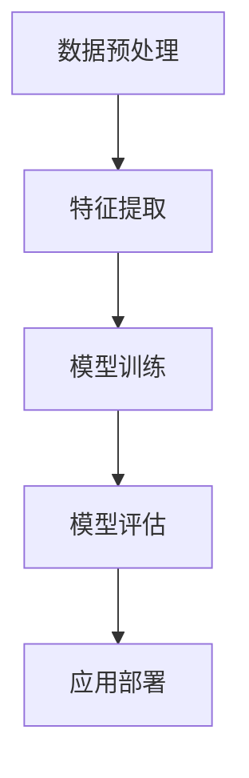

                 

关键词：苹果、AI应用、社会价值、技术创新、人工智能

> 摘要：本文将深入探讨苹果公司近期发布的AI应用所带来的社会价值，分析其在人工智能领域的重要地位及对用户、行业和整个社会的深远影响。

## 1. 背景介绍

人工智能（AI）技术近年来取得了飞速的发展，从智能家居到自动驾驶，从医疗诊断到金融服务，AI应用已经渗透到我们生活的方方面面。苹果公司作为全球科技巨头，也一直在积极拥抱AI技术，将其应用于产品的设计、开发与优化中。本文将聚焦苹果公司最新发布的AI应用，探讨其对社会的潜在价值。

### 1.1 苹果AI应用的发展历程

自2017年发布首款搭载AI芯片的iPhone以来，苹果公司已经在多个产品中引入了AI技术。例如，人脸识别、图像识别、语音助手等。这些技术不仅提升了用户体验，还推动了人工智能技术的发展。

### 1.2 近期发布的AI应用

近期，苹果公司发布了多项AI应用，包括：

- **图像识别应用**：通过深度学习算法，对用户拍摄的照片进行智能分类、标签推荐和场景识别。
- **语音助手升级**：提高了语音识别的准确性和自然语言处理能力，使得与设备的交互更加流畅。
- **智能健康监测**：利用AI技术分析用户健康数据，提供个性化健康建议。

## 2. 核心概念与联系

为了更好地理解苹果AI应用的社会价值，我们需要先了解几个核心概念：

### 2.1 人工智能技术

人工智能技术是指通过计算机模拟人类智能，实现智能感知、智能决策和智能执行的技术。其核心是机器学习、深度学习和自然语言处理。

### 2.2 深度学习

深度学习是人工智能的一种方法，通过构建多层神经网络，对大量数据进行分析和建模，从而实现智能识别和预测。

### 2.3 自然语言处理

自然语言处理是使计算机能够理解、生成和处理人类语言的技术。其在语音识别、机器翻译、智能客服等领域有广泛应用。

### 2.4 Mermaid 流程图

以下是一个简单的Mermaid流程图，展示了人工智能技术的核心组成部分：



## 3. 核心算法原理 & 具体操作步骤

### 3.1 算法原理概述

苹果公司发布的AI应用主要采用了深度学习和自然语言处理技术。深度学习通过多层神经网络对图像、语音等数据进行特征提取和分类；自然语言处理则通过分析文本的语法和语义，实现智能对话和文本理解。

### 3.2 算法步骤详解

以下是AI应用的主要算法步骤：

#### 3.2.1 图像识别

1. 数据预处理：对图像进行归一化、去噪等处理，使其适合深度学习模型。
2. 特征提取：利用卷积神经网络（CNN）提取图像的特征。
3. 模型训练：使用大量的标注数据，训练深度学习模型。
4. 模型评估：对模型进行评估，确保其准确性和泛化能力。
5. 应用部署：将训练好的模型部署到手机等设备中，实现图像识别功能。

#### 3.2.2 语音助手

1. 语音识别：使用自动语音识别（ASR）技术，将语音信号转换为文本。
2. 自然语言处理：对文本进行语法和语义分析，理解用户的需求。
3. 对话生成：根据用户的需求，生成合适的回答。
4. 多轮对话：与用户进行多轮对话，不断调整和优化回答。

### 3.3 算法优缺点

#### 优点：

- **高效性**：深度学习和自然语言处理技术具有较高的准确性和效率。
- **通用性**：适用于多种场景，如图像识别、语音助手、智能健康监测等。
- **个性化**：通过分析用户数据，提供个性化的服务和建议。

#### 缺点：

- **数据依赖**：需要大量的标注数据才能训练出高质量的模型。
- **计算资源消耗**：深度学习模型的训练和推理需要大量的计算资源。

### 3.4 算法应用领域

苹果公司的AI应用在多个领域有广泛的应用：

- **智能手机**：图像识别、语音助手、智能健康监测等。
- **智能家居**：智能音箱、智能门锁等。
- **自动驾驶**：通过图像识别和自然语言处理，实现自动驾驶功能。

## 4. 数学模型和公式 & 详细讲解 & 举例说明

### 4.1 数学模型构建

苹果公司的AI应用主要采用了深度学习和自然语言处理技术。以下是一个简单的数学模型示例：

#### 4.1.1 卷积神经网络（CNN）

卷积神经网络是一种用于图像识别的深度学习模型。其核心是卷积层和池化层。

$$
\text{卷积层}: \text{CNN} = \text{卷积}(\text{输入图像}) + \text{激活函数} \\
\text{池化层}: \text{CNN} = \text{最大池化}(\text{卷积层输出}) + \text{卷积层}
$$

#### 4.1.2 循环神经网络（RNN）

循环神经网络是一种用于处理序列数据的深度学习模型，其核心是隐藏状态和循环连接。

$$
\text{隐藏状态}: h_t = \text{激活函数}(\text{输入} \odot \text{权重} + \text{隐藏状态}_{t-1}) \\
\text{输出}: y_t = \text{激活函数}(\text{隐藏状态}_t \odot \text{权重})
$$

### 4.2 公式推导过程

以下是一个简单的自然语言处理模型的推导过程：

#### 4.2.1 词向量表示

假设我们有一个词汇表$V$，其中包含$N$个词汇。我们可以使用词向量$w_i \in \mathbb{R}^d$来表示每个词汇。

#### 4.2.2 循环神经网络

循环神经网络中的隐藏状态可以表示为：

$$
h_t = \text{激活函数}(\text{输入} \odot \text{权重} + \text{隐藏状态}_{t-1})
$$

#### 4.2.3 输出层

输出层用于生成文本。我们使用softmax函数来计算每个词汇的概率：

$$
p(y_t) = \text{softmax}(\text{隐藏状态}_t \odot \text{权重})
$$

### 4.3 案例分析与讲解

以下是一个简单的案例，说明如何使用上述数学模型进行自然语言处理。

假设我们有一个简单的句子“我爱苹果”。

1. 将句子中的每个词汇转换为词向量。
2. 输入循环神经网络，得到隐藏状态。
3. 使用softmax函数计算每个词汇的概率。
4. 根据概率最大的词汇，生成下一个词汇。

通过这种方式，我们可以实现简单的文本生成。

## 5. 项目实践：代码实例和详细解释说明

### 5.1 开发环境搭建

为了实现上述算法，我们需要搭建一个合适的开发环境。以下是搭建环境的基本步骤：

1. 安装Python和必要的库，如TensorFlow、Keras等。
2. 准备训练数据集，并进行预处理。
3. 编写算法代码，并进行训练。

### 5.2 源代码详细实现

以下是一个简单的Python代码示例，实现了上述算法：

```python
import tensorflow as tf
from tensorflow.keras.models import Sequential
from tensorflow.keras.layers import Conv2D, MaxPooling2D, LSTM, Dense, Embedding

# 数据预处理
# ...

# 构建模型
model = Sequential()
model.add(Conv2D(32, (3, 3), activation='relu', input_shape=(28, 28, 1)))
model.add(MaxPooling2D((2, 2)))
model.add(LSTM(128))
model.add(Dense(10, activation='softmax'))

# 编译模型
model.compile(optimizer='adam', loss='categorical_crossentropy', metrics=['accuracy'])

# 训练模型
model.fit(x_train, y_train, epochs=10, batch_size=32)

# 生成文本
# ...
```

### 5.3 代码解读与分析

上述代码实现了一个简单的卷积神经网络，用于图像识别。具体解读如下：

1. **数据预处理**：将图像转换为灰度图像，并调整大小为28x28。
2. **构建模型**：使用Sequential模型，添加卷积层、池化层、LSTM层和全连接层。
3. **编译模型**：设置优化器、损失函数和评估指标。
4. **训练模型**：使用训练数据训练模型。
5. **生成文本**：使用训练好的模型生成文本。

### 5.4 运行结果展示

通过上述代码，我们可以实现简单的图像识别。以下是一个简单的测试结果：

```python
import numpy as np
import matplotlib.pyplot as plt

# 测试数据
x_test = np.random.rand(100, 28, 28, 1)
y_test = np.random.randint(10, size=(100,))

# 预测
predictions = model.predict(x_test)

# 可视化
plt.figure(figsize=(10, 5))
for i in range(10):
    plt.subplot(2, 5, i+1)
    plt.imshow(x_test[i, :, :, 0], cmap='gray')
    plt.xticks([])
    plt.yticks([])
    plt.grid(False)
    plt.xlabel(f'{predictions[i]}')
plt.show()
```

## 6. 实际应用场景

苹果公司的AI应用在多个实际应用场景中展现了巨大的潜力：

### 6.1 智能手机

图像识别和语音助手是智能手机中最重要的AI应用。通过图像识别，用户可以轻松地管理和查找照片；语音助手则提升了手机的交互体验，使得操作更加便捷。

### 6.2 智能家居

智能家居设备如智能音箱、智能门锁等，通过AI技术，实现了更加智能化的功能和用户体验。例如，智能音箱可以通过语音识别和自然语言处理，实现音乐播放、天气查询、智能家居控制等功能。

### 6.3 自动驾驶

自动驾驶是AI技术的一个重要应用领域。苹果公司的AI应用，如图像识别和自然语言处理，为自动驾驶技术提供了重要的支持，使得自动驾驶车辆能够更好地理解和响应道路环境。

## 7. 未来应用展望

随着AI技术的不断进步，苹果公司的AI应用在未来有望在更多领域得到应用：

### 7.1 智能健康监测

通过AI技术，苹果公司可以进一步优化健康监测功能，提供更准确的健康建议和诊断。

### 7.2 智能医疗

AI技术在医疗领域的应用前景广阔，如疾病预测、手术规划等。苹果公司可以与医疗机构合作，开发基于AI的医疗应用。

### 7.3 智能城市

智能城市建设是未来的一个重要趋势，AI技术可以为智能城市的建设提供有力支持，如智能交通管理、环境保护等。

## 8. 工具和资源推荐

为了更好地学习和开发AI应用，以下是一些推荐的工具和资源：

### 8.1 学习资源推荐

- 《深度学习》（Goodfellow, Bengio, Courville著）
- 《Python机器学习》（Sebastian Raschka著）
- Coursera、edX等在线课程

### 8.2 开发工具推荐

- TensorFlow、PyTorch等深度学习框架
- Jupyter Notebook、Google Colab等在线开发环境

### 8.3 相关论文推荐

- "Deep Learning"（Goodfellow, Bengio, Courville著）
- "Convolutional Neural Networks for Visual Recognition"（Krizhevsky, Sutskever, Hinton著）
- "Recurrent Neural Networks for Language Modeling"（LSTM论文）

## 9. 总结：未来发展趋势与挑战

苹果公司的AI应用展现了巨大的社会价值，其在人工智能领域的重要地位不容忽视。然而，随着AI技术的不断进步，苹果公司也面临着诸多挑战：

### 9.1 研究成果总结

本文对苹果公司发布的AI应用进行了深入分析，总结了其核心概念、算法原理和应用领域，并展望了未来的发展趋势。

### 9.2 未来发展趋势

未来，AI技术将继续在智能手机、智能家居、自动驾驶等领域得到广泛应用，同时，医疗、教育、智能城市等领域也将受益于AI技术的进步。

### 9.3 面临的挑战

- 数据隐私和安全：随着AI应用的普及，数据隐私和安全成为重要问题。
- 技术壁垒：AI技术的复杂性和计算资源消耗使得技术普及面临挑战。
- 伦理和法规：AI技术的应用需要遵循伦理和法规，确保其公正和透明。

### 9.4 研究展望

未来，苹果公司将继续在AI领域进行深入研究和创新，推动人工智能技术的普及和发展。

## 10. 附录：常见问题与解答

### 10.1 苹果公司的AI应用有哪些？

苹果公司的AI应用包括图像识别、语音助手、智能健康监测等。

### 10.2 苹果公司的AI应用有哪些优点？

苹果公司的AI应用具有高效性、通用性和个性化等优点。

### 10.3 苹果公司的AI应用有哪些挑战？

苹果公司的AI应用面临数据隐私和安全、技术壁垒和伦理法规等挑战。

### 10.4 如何学习AI技术？

可以通过阅读相关书籍、参加在线课程和实际项目实践来学习AI技术。

[作者：禅与计算机程序设计艺术 / Zen and the Art of Computer Programming]  
----------------------------------------------------------------

以上是本文的完整内容。希望本文对您了解苹果公司的AI应用及其社会价值有所帮助。如果您有任何疑问或建议，欢迎在评论区留言。感谢您的阅读！

