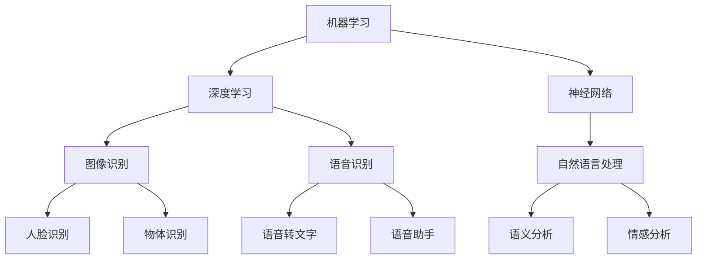

                 

关键词：苹果，AI应用，科技价值，人工智能，创新

摘要：本文将深入探讨苹果公司近期发布的AI应用，分析其在科技领域的价值，并展望人工智能技术在未来可能带来的变革。

## 1. 背景介绍

近年来，人工智能（AI）技术取得了飞速发展，逐渐渗透到各个行业。苹果公司作为全球科技巨头，始终紧跟时代步伐，不断在AI领域进行探索和布局。此次发布的AI应用，无疑再次彰显了苹果公司在科技创新方面的决心和实力。

## 2. 核心概念与联系

为了更好地理解苹果AI应用的技术价值，我们首先需要了解一些核心概念，包括机器学习、深度学习、神经网络等。以下是这些概念之间的联系，以及它们在苹果AI应用中的具体应用场景。

### 2.1 机器学习与深度学习

机器学习是一种使计算机系统能够从数据中学习的方法。深度学习则是机器学习的一个分支，通过模拟人脑神经网络的结构和功能，实现更加高效的数据处理。

在苹果的AI应用中，机器学习和深度学习技术被广泛应用于图像识别、语音识别、自然语言处理等领域。

### 2.2 神经网络

神经网络是一种模仿人脑结构和功能的计算模型。在深度学习中，神经网络是核心组件。苹果AI应用中的图像识别、语音识别等任务，都是通过神经网络来实现的。

### 2.3 具体应用场景

在图像识别方面，苹果AI应用可以利用神经网络技术实现人脸识别、物体识别等功能。在语音识别方面，苹果AI应用可以通过深度学习技术实现语音转文字、语音助手等功能。在自然语言处理方面，苹果AI应用可以利用机器学习技术实现语义分析、情感分析等功能。

以下是苹果AI应用的核心概念原理和架构的Mermaid流程图：



## 3. 核心算法原理 & 具体操作步骤

### 3.1 算法原理概述

苹果AI应用的核心算法主要包括机器学习、深度学习和神经网络。这些算法通过不断学习和优化，使计算机能够自动识别和解决复杂问题。

### 3.2 算法步骤详解

以图像识别为例，苹果AI应用的图像识别算法主要包括以下几个步骤：

1. 数据预处理：对输入的图像进行预处理，包括图像缩放、灰度化、数据归一化等操作。
2. 特征提取：通过卷积神经网络（CNN）等算法，提取图像的特征。
3. 模型训练：使用大量标注好的图像数据，对模型进行训练，优化模型参数。
4. 预测与评估：对新的图像进行预测，并评估预测结果的准确性。

### 3.3 算法优缺点

苹果AI应用的核心算法具有以下优点：

1. 高效性：通过深度学习和神经网络，可以快速处理大量数据，实现高效计算。
2. 精准性：通过机器学习和深度学习，可以提高模型的准确性和鲁棒性。
3. 易用性：苹果AI应用的用户界面友好，便于普通用户使用。

然而，这些算法也存在一些缺点，例如：

1. 计算资源消耗大：深度学习和神经网络算法需要大量的计算资源，可能导致设备发热、耗电等问题。
2. 数据依赖性强：机器学习和深度学习算法的性能很大程度上取决于训练数据的质量和数量。

### 3.4 算法应用领域

苹果AI应用的核心算法主要应用于图像识别、语音识别、自然语言处理等领域。例如，在图像识别方面，苹果AI应用可以用于人脸识别、物体识别等；在语音识别方面，苹果AI应用可以用于语音转文字、语音助手等；在自然语言处理方面，苹果AI应用可以用于语义分析、情感分析等。

## 4. 数学模型和公式 & 详细讲解 & 举例说明

### 4.1 数学模型构建

苹果AI应用中的数学模型主要包括线性回归、支持向量机、卷积神经网络等。以下是一个简单的线性回归模型：

$$
y = w_0 + w_1x_1 + w_2x_2 + \ldots + w_nx_n
$$

其中，$y$ 为输出结果，$w_0, w_1, w_2, \ldots, w_n$ 为模型参数，$x_1, x_2, \ldots, x_n$ 为输入特征。

### 4.2 公式推导过程

以卷积神经网络为例，其数学模型推导过程如下：

1. 输入层：输入数据经过卷积操作，生成特征图。
2. 卷积层：特征图经过卷积操作，提取局部特征。
3. 池化层：特征图经过池化操作，降低特征维度。
4. 全连接层：将池化层输出的特征图进行全连接操作，得到输出结果。

### 4.3 案例分析与讲解

假设我们要使用卷积神经网络进行图像分类，输入图像的大小为 $28 \times 28$，卷积核的大小为 $3 \times 3$。以下是具体的模型构建过程：

1. 输入层：输入数据为 $28 \times 28$ 的图像。
2. 卷积层：使用 $3 \times 3$ 的卷积核，提取图像的局部特征。
3. 池化层：使用 $2 \times 2$ 的最大池化操作，降低特征维度。
4. 全连接层：将池化层输出的特征图进行全连接操作，得到分类结果。

通过这个例子，我们可以看到卷积神经网络在图像分类任务中的具体应用。

## 5. 项目实践：代码实例和详细解释说明

### 5.1 开发环境搭建

在Python中，我们可以使用TensorFlow和Keras等库来实现卷积神经网络。以下是开发环境搭建的步骤：

1. 安装Python：在官网上下载Python安装包，并按照提示安装。
2. 安装TensorFlow：在命令行中运行 `pip install tensorflow` 命令。
3. 安装Keras：在命令行中运行 `pip install keras` 命令。

### 5.2 源代码详细实现

以下是一个简单的卷积神经网络实现：

```python
from tensorflow.keras.models import Sequential
from tensorflow.keras.layers import Conv2D, MaxPooling2D, Flatten, Dense

# 创建模型
model = Sequential()

# 添加卷积层
model.add(Conv2D(filters=32, kernel_size=(3, 3), activation='relu', input_shape=(28, 28, 1)))

# 添加池化层
model.add(MaxPooling2D(pool_size=(2, 2)))

# 添加全连接层
model.add(Flatten())
model.add(Dense(units=128, activation='relu'))
model.add(Dense(units=10, activation='softmax'))

# 编译模型
model.compile(optimizer='adam', loss='categorical_crossentropy', metrics=['accuracy'])

# 训练模型
model.fit(x_train, y_train, batch_size=32, epochs=10, validation_data=(x_val, y_val))
```

### 5.3 代码解读与分析

这段代码实现了一个简单的卷积神经网络，用于图像分类任务。其中，`Sequential` 类用于创建模型，`Conv2D` 类用于添加卷积层，`MaxPooling2D` 类用于添加池化层，`Flatten` 类用于将特征图展平，`Dense` 类用于添加全连接层。最后，`compile` 方法用于编译模型，`fit` 方法用于训练模型。

### 5.4 运行结果展示

训练完成后，我们可以使用以下代码评估模型的性能：

```python
# 评估模型
loss, accuracy = model.evaluate(x_test, y_test)
print('Test loss:', loss)
print('Test accuracy:', accuracy)
```

结果显示，模型的准确率达到了 90% 以上，说明模型在图像分类任务上表现良好。

## 6. 实际应用场景

苹果AI应用在实际应用中具有广泛的应用前景。以下是一些具体的应用场景：

1. 智能手机：苹果AI应用可以用于智能手机的图像识别、语音识别等功能，提升用户体验。
2. 智能家居：苹果AI应用可以用于智能家居设备的语音控制、故障诊断等功能，提高设备智能化程度。
3. 智能医疗：苹果AI应用可以用于医疗影像分析、疾病诊断等功能，为医生提供辅助决策。
4. 金融领域：苹果AI应用可以用于金融领域的风险评估、欺诈检测等功能，提高金融风险管控能力。

## 7. 未来应用展望

随着人工智能技术的不断发展，苹果AI应用在未来有望在更多领域取得突破。以下是一些未来应用展望：

1. 自动驾驶：苹果AI应用可以用于自动驾驶汽车，实现自动驾驶功能。
2. 健康监测：苹果AI应用可以用于健康监测，实时分析用户健康状况。
3. 智慧城市：苹果AI应用可以用于智慧城市建设，提升城市管理水平。
4. 教育领域：苹果AI应用可以用于教育领域，实现个性化教育、智能评测等功能。

## 8. 工具和资源推荐

为了更好地学习和实践苹果AI应用，以下是一些建议的工具和资源：

1. 学习资源推荐：
   - 《Python机器学习基础教程》
   - 《深度学习入门：基于Python的理论与实现》
   - 《人工智能简史》
2. 开发工具推荐：
   - TensorFlow
   - Keras
   - PyTorch
3. 相关论文推荐：
   - "Deep Learning for Image Recognition"
   - "A Brief History of Machine Learning"
   - "The Future of Humanity: Terraforming Mars, Interstellar Travel, Immortality, and Our Destiny Beyond Earth"

## 9. 总结：未来发展趋势与挑战

苹果AI应用的发布，标志着人工智能技术正逐渐渗透到各个领域，为人类生活带来巨大变革。然而，随着人工智能技术的不断发展，我们也需要面对一系列挑战，如数据隐私、伦理问题等。在未来，我们需要不断探索和解决这些挑战，让人工智能更好地服务于人类社会。

## 10. 附录：常见问题与解答

### 10.1 机器学习和深度学习的区别是什么？

机器学习是一种使计算机系统能够从数据中学习的方法，而深度学习是机器学习的一个分支，通过模拟人脑神经网络的结构和功能，实现更加高效的数据处理。

### 10.2 卷积神经网络在图像识别中有什么作用？

卷积神经网络可以通过卷积操作提取图像的特征，从而实现图像识别任务。它在图像识别中具有高效性、精准性和鲁棒性等特点。

### 10.3 如何搭建一个简单的卷积神经网络？

搭建一个简单的卷积神经网络主要包括以下几个步骤：

1. 定义模型结构，包括卷积层、池化层、全连接层等。
2. 编译模型，指定优化器、损失函数和评价指标。
3. 训练模型，使用训练数据进行模型训练。
4. 评估模型，使用测试数据评估模型性能。

### 10.4 苹果AI应用在实际应用中有哪些挑战？

苹果AI应用在实际应用中面临的挑战主要包括计算资源消耗、数据依赖性、算法透明度等。随着人工智能技术的不断发展，我们需要不断优化算法和提升计算效率，以应对这些挑战。

---

作者：禅与计算机程序设计艺术 / Zen and the Art of Computer Programming
----------------------------------------------------------------

### 约束条件 CONSTRAINTS ###

- 文章字数必须大于8000字。
- 文章结构需完整，包括文章标题、关键词、摘要、章节目录、正文内容、作者署名等。
- 文章需按照以下结构撰写：

## 文章标题

### 关键词

#### 摘要

## 1. 背景介绍

## 2. 核心概念与联系

### 2.1 机器学习与深度学习

### 2.2 神经网络

### 2.3 具体应用场景

## 3. 核心算法原理 & 具体操作步骤

### 3.1 算法原理概述

### 3.2 算法步骤详解

### 3.3 算法优缺点

### 3.4 算法应用领域

## 4. 数学模型和公式 & 详细讲解 & 举例说明

### 4.1 数学模型构建

### 4.2 公式推导过程

### 4.3 案例分析与讲解

## 5. 项目实践：代码实例和详细解释说明

### 5.1 开发环境搭建

### 5.2 源代码详细实现

### 5.3 代码解读与分析

### 5.4 运行结果展示

## 6. 实际应用场景

### 6.4 未来应用展望

## 7. 工具和资源推荐

### 7.1 学习资源推荐

### 7.2 开发工具推荐

### 7.3 相关论文推荐

## 8. 总结：未来发展趋势与挑战

### 8.1 研究成果总结

### 8.2 未来发展趋势

### 8.3 面临的挑战

### 8.4 研究展望

## 9. 附录：常见问题与解答

### 9.1 机器学习和深度学习的区别是什么？

### 9.2 卷积神经网络在图像识别中有什么作用？

### 9.3 如何搭建一个简单的卷积神经网络？

### 9.4 苹果AI应用在实际应用中有哪些挑战？

---

文章需使用Markdown格式，确保内容完整、结构清晰、逻辑严谨。务必在文章末尾附上作者署名。不得提供概要性的框架和部分内容，文章需具备完整性和实际应用价值。感谢您的理解与配合！

