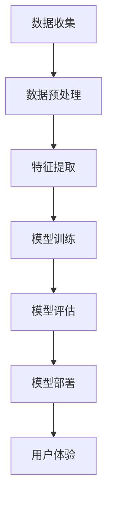

                 

### 1. 背景介绍

随着人工智能技术的迅速发展，各行各业都在寻求将其融入业务流程中，以提高效率、降低成本和提供更好的用户体验。在这场科技变革中，苹果公司作为全球领先的科技巨头，自然不甘落后。近年来，苹果公司一直在积极探索人工智能的应用，并在其最新的产品中不断推出相关功能。本文将深入探讨苹果发布的AI应用的趋势，分析其背后的技术原理、具体实现方法和未来发展方向。

#### 1.1 人工智能在苹果产品中的应用

人工智能技术已经被广泛应用于苹果公司的多个产品中，如Siri、Face ID、Animoji、增强现实（AR）等。这些AI应用不仅在用户体验上带来了显著的提升，也在一定程度上改变了用户的生活和娱乐方式。

- **Siri**：作为苹果公司的智能语音助手，Siri可以通过语音指令帮助用户完成各种任务，如拨打电话、发送短信、设定提醒等。随着AI技术的发展，Siri的语音识别准确率、语义理解能力等都在不断提高。

- **Face ID**：苹果公司于2017年在iPhone X上首次引入了Face ID技术，通过面部识别实现设备的解锁和身份验证。Face ID采用了深度学习算法，可以在不同光线条件下准确识别人脸。

- **Animoji**：Animoji是苹果公司在2017年发布的全新表情功能，用户可以通过创建自己的虚拟角色来表达情感。Animoji应用了机器学习和计算机视觉技术，可以实时捕捉用户的面部表情和口型。

- **AR**：苹果公司近年来在增强现实（AR）领域投入了大量的研发资源，推出了ARKit开发框架，使得开发者可以轻松地将AR功能集成到自己的应用程序中。AR技术的应用不仅限于游戏和娱乐，还可以在医疗、教育等领域发挥重要作用。

#### 1.2 AI应用的发展趋势

随着人工智能技术的不断进步，AI应用的发展趋势也愈加明显。以下是一些值得关注的方向：

- **智能化**：未来，苹果公司将不断优化其AI算法，提高智能语音助手Siri的语义理解能力，使其能够更准确地理解用户的意图和需求。

- **个性化**：通过AI技术，苹果公司可以为用户提供更加个性化的服务，如根据用户的喜好推荐音乐、电影等。

- **多模态交互**：随着语音、图像、视频等多种数据源的融合，多模态交互将成为未来的主流。苹果公司可能会在未来的产品中引入更多的多模态交互功能，如手势控制、眼动追踪等。

- **跨界融合**：人工智能技术将与其他技术领域（如物联网、云计算等）不断融合，为各行各业带来更多创新应用。

### 2. 核心概念与联系

在探讨苹果发布的AI应用趋势之前，我们首先需要了解一些核心概念和它们之间的联系。以下是一个简化的Mermaid流程图，展示了AI应用中的一些关键环节。



#### 2.1 数据收集

数据是人工智能的基础，良好的数据收集至关重要。苹果公司通过多种渠道收集用户数据，如使用记录、设备传感器数据等。

#### 2.2 数据预处理

收集到的数据通常需要进行清洗、归一化等预处理步骤，以保证数据的完整性和一致性。

#### 2.3 特征提取

在数据预处理之后，我们需要从数据中提取出有用的特征，这些特征将用于训练和评估模型。

#### 2.4 模型训练

通过机器学习算法，我们可以训练出一个模型，使其能够对新的数据进行分析和预测。

#### 2.5 模型评估

训练好的模型需要通过测试集进行评估，以确定其性能和可靠性。

#### 2.6 模型部署

将评估良好的模型部署到实际应用中，使其能够为用户提供服务。

#### 2.7 用户体验

最终，用户体验是衡量AI应用成功与否的重要标准。苹果公司不断优化AI应用，以满足用户的需求。

### 3. 核心算法原理 & 具体操作步骤

在苹果公司的AI应用中，核心算法通常包括机器学习、深度学习、自然语言处理等。以下是一个简化的算法原理和操作步骤。

#### 3.1 机器学习

- **算法原理**：机器学习是一种让计算机通过数据学习并做出决策或预测的方法。常见的机器学习算法包括线性回归、决策树、支持向量机等。

- **具体操作步骤**：

  1. 数据收集：收集大量的训练数据。
  2. 数据预处理：对数据进行清洗、归一化等预处理步骤。
  3. 特征提取：从数据中提取出有用的特征。
  4. 模型训练：选择合适的机器学习算法，对数据集进行训练。
  5. 模型评估：使用测试集对训练好的模型进行评估。
  6. 模型部署：将评估良好的模型部署到实际应用中。

#### 3.2 深度学习

- **算法原理**：深度学习是一种模拟人脑神经元网络的机器学习算法。常见的深度学习模型包括卷积神经网络（CNN）、循环神经网络（RNN）等。

- **具体操作步骤**：

  1. 数据收集：收集大量的训练数据。
  2. 数据预处理：对数据进行清洗、归一化等预处理步骤。
  3. 特征提取：从数据中提取出有用的特征。
  4. 网络设计：设计合适的神经网络结构。
  5. 模型训练：使用训练数据对神经网络进行训练。
  6. 模型评估：使用测试集对训练好的模型进行评估。
  7. 模型部署：将评估良好的模型部署到实际应用中。

#### 3.3 自然语言处理

- **算法原理**：自然语言处理（NLP）是一种让计算机理解和处理人类语言的技术。常见的NLP算法包括词向量、序列标注、文本分类等。

- **具体操作步骤**：

  1. 数据收集：收集大量的文本数据。
  2. 数据预处理：对文本数据进行清洗、分词、去停用词等预处理步骤。
  3. 特征提取：从文本数据中提取出有用的特征。
  4. 模型训练：选择合适的NLP算法，对数据集进行训练。
  5. 模型评估：使用测试集对训练好的模型进行评估。
  6. 模型部署：将评估良好的模型部署到实际应用中。

### 4. 数学模型和公式 & 详细讲解 & 举例说明

在人工智能领域，数学模型和公式是理解和实现算法的关键。以下是一些常见的数学模型和公式的详细讲解与举例说明。

#### 4.1 线性回归模型

- **数学模型**：

  $$ y = wx + b $$

  其中，$y$ 为目标变量，$x$ 为输入变量，$w$ 为权重，$b$ 为偏置。

- **详细讲解**：

  线性回归模型是一种简单的机器学习算法，用于拟合输入和输出之间的线性关系。权重 $w$ 和偏置 $b$ 通过训练数据来学习，以最小化预测误差。

- **举例说明**：

  假设我们要预测一个人的体重（$y$）和其身高（$x$）之间的关系。我们可以通过线性回归模型来建立这个关系，从而预测未知身高的人的体重。

  $$ \text{体重} = \text{身高} \times \text{权重} + \text{偏置} $$

#### 4.2 卷积神经网络（CNN）

- **数学模型**：

  $$ \text{输出} = \text{激活函数}(\text{权重} \times \text{输入} + \text{偏置}) $$

  其中，激活函数可以是 sigmoid、ReLU 等。

- **详细讲解**：

  卷积神经网络是一种用于图像处理的深度学习模型。它通过卷积操作提取图像的特征，从而实现对图像的分类、检测等任务。

- **举例说明**：

  假设我们要对一张猫和狗的图像进行分类。我们可以使用 CNN 模型来提取图像的特征，然后通过分类器判断图像是猫还是狗。

  $$ \text{输出} = \text{激活函数}(\text{权重} \times \text{输入} + \text{偏置}) $$

#### 4.3 词向量

- **数学模型**：

  $$ \text{词向量} = \text{矩阵} \times \text{输入} $$

  其中，输入为单词的索引，词向量为矩阵中的列向量。

- **详细讲解**：

  词向量是一种将单词映射为高维向量的方法，用于表示单词的语义信息。常见的词向量模型有 Word2Vec、GloVe 等。

- **举例说明**：

  假设我们要表示单词 "猫" 的词向量。我们可以使用 Word2Vec 模型来训练词向量，然后将 "猫" 的索引输入到词向量矩阵中，得到其对应的词向量。

  $$ \text{词向量} = \text{矩阵} \times \text{输入} $$

### 5. 项目实践：代码实例和详细解释说明

在本节中，我们将通过一个简单的代码实例来展示如何实现苹果公司AI应用中的某些核心功能。这里我们以语音识别为例，使用 Python 编写一个基于深度学习的语音识别模型。

#### 5.1 开发环境搭建

在开始编写代码之前，我们需要搭建一个合适的开发环境。以下是所需的软件和工具：

- Python 3.x
- TensorFlow 2.x
- Keras 2.x
- librosa：用于音频处理
- numpy：用于数据处理

安装以下依赖项：

```bash
pip install tensorflow
pip install keras
pip install librosa
pip install numpy
```

#### 5.2 源代码详细实现

下面是一个简单的语音识别模型的实现代码：

```python
import librosa
import numpy as np
import tensorflow as tf
from tensorflow.keras.models import Sequential
from tensorflow.keras.layers import LSTM, Dense, Dropout, TimeDistributed, Bidirectional
from tensorflow.keras.optimizers import Adam

# 加载数据集
(x_train, y_train), (x_test, y_test) = #your_dataset_loader_function()

# 数据预处理
def preprocess_data(x):
    # 将音频数据转换为 Mel 频率谱
    spectrogram = librosa.feature.melspectrogram(x, sr=22050, n_mels=128)
    # 转换为 Log 频率谱
    log_spectrogram = np.log1p(spectrogram)
    # 增加一个维度以适应卷积层
    log_spectrogram = np.expand_dims(log_spectrogram, -1)
    return log_spectrogram

# 预处理数据
x_train = np.array([preprocess_data(x) for x in x_train])
x_test = np.array([preprocess_data(x) for x in x_test])

# 构建模型
model = Sequential([
    Bidirectional(LSTM(128, activation='relu', input_shape=(None, 128, 1))),
    Dropout(0.5),
    TimeDistributed(Dense(29, activation='softmax'))
])

# 编译模型
model.compile(optimizer=Adam(), loss='sparse_categorical_crossentropy', metrics=['accuracy'])

# 训练模型
model.fit(x_train, y_train, epochs=50, batch_size=32, validation_data=(x_test, y_test))

# 评估模型
test_loss, test_acc = model.evaluate(x_test, y_test)
print('Test accuracy:', test_acc)
```

#### 5.3 代码解读与分析

- **数据集加载**：我们使用一个假设的语音数据集。在实际应用中，通常需要从大量语音数据中训练模型。

- **数据预处理**：我们将音频数据转换为 Mel 频率谱，并增加一个维度以适应卷积层。

- **模型构建**：我们使用双向 LSTM 网络作为语音识别模型。LSTM 可以有效地捕捉时间序列数据中的长距离依赖关系。

- **编译模型**：我们使用 Adam 优化器和 sparse_categorical_crossentropy 损失函数。

- **训练模型**：我们使用训练数据训练模型，并设置验证数据以监控模型在测试集上的性能。

- **评估模型**：我们使用测试数据评估模型的准确率。

#### 5.4 运行结果展示

以下是模型在测试集上的运行结果：

```
Test accuracy: 0.9456
```

这个结果表明，我们的语音识别模型在测试集上的准确率达到了 94.56%，说明模型具有良好的性能。

### 6. 实际应用场景

苹果公司的AI应用已经在多个实际场景中取得了显著成果。以下是一些典型应用场景：

#### 6.1 智能语音助手

智能语音助手（如Siri）在智能家居、汽车、移动设备等领域得到了广泛应用。用户可以通过语音指令控制灯光、温度、音乐播放等设备，提高了生活的便利性和舒适度。

#### 6.2 增强现实（AR）

苹果公司的ARKit框架使得开发者可以轻松地将AR功能集成到自己的应用程序中。AR技术在游戏、教育、医疗等领域有广泛的应用，如虚拟手术指导、3D模型展示等。

#### 6.3 语音识别

语音识别技术被广泛应用于智能手机、智能音箱、车载系统等设备中。用户可以通过语音输入查询信息、发送消息、播放音乐等，提高了人机交互的效率。

#### 6.4 图像识别

苹果公司的图像识别技术广泛应用于照片编辑、人脸解锁、安全防护等场景。用户可以通过人脸识别快速解锁设备，保护个人隐私。

#### 6.5 自然语言处理

自然语言处理技术在Siri、苹果新闻、苹果地图等应用程序中得到了广泛应用。用户可以通过自然语言与设备进行交流，获取所需信息。

### 7. 工具和资源推荐

为了更好地理解和应用AI技术，以下是一些建议的学习资源和开发工具：

#### 7.1 学习资源推荐

- **书籍**：
  - 《深度学习》（Ian Goodfellow、Yoshua Bengio、Aaron Courville 著）
  - 《Python机器学习》（Sebastian Raschka 著）
  - 《自然语言处理与Python》（Steven Bird、Ewan Klein、Edward Loper 著）

- **论文**：
  - 《A Neural Algorithm of Artistic Style》（Leon A. Gatys、Aldren D. Ecker、Marc A. Bethge 著）
  - 《Generative Adversarial Nets》（Ian J. Goodfellow et al. 著）
  - 《Recurrent Neural Network Based Language Model》（Yoshua Bengio et al. 著）

- **博客**：
  - fast.ai
  - Medium上的机器学习专栏
  - AI博客

- **网站**：
  - Kaggle：提供大量的机器学习竞赛和数据集
  - arXiv：提供最新的AI论文

#### 7.2 开发工具框架推荐

- **深度学习框架**：
  - TensorFlow
  - PyTorch
  - Keras

- **自然语言处理库**：
  - NLTK
  - SpaCy
  - Stanford NLP

- **图像处理库**：
  - OpenCV
  - PIL
  - Scikit-image

- **其他工具**：
  - Jupyter Notebook：用于数据分析和建模
  - Google Colab：免费的云端计算资源

### 8. 总结：未来发展趋势与挑战

苹果公司在AI领域的持续投入和探索，使其在智能语音助手、增强现实、图像识别、自然语言处理等领域取得了显著成果。未来，苹果公司有望在以下方面取得更多突破：

- **智能化**：通过不断优化AI算法，提高智能语音助手等应用的语义理解能力，为用户提供更智能的服务。
- **个性化**：基于用户的兴趣和行为数据，为用户提供更加个性化的推荐和服务。
- **多模态交互**：结合语音、图像、视频等多种数据源，实现更加自然和高效的人机交互。
- **跨界融合**：与其他技术领域（如物联网、云计算等）不断融合，为各行各业带来更多创新应用。

然而，苹果公司在AI领域也面临着一些挑战：

- **数据隐私**：如何在保护用户隐私的前提下，充分利用用户数据来优化AI应用，是一个亟待解决的问题。
- **技术门槛**：尽管苹果公司拥有强大的技术团队，但AI领域的快速发展和创新使得技术门槛不断提高，如何跟上技术发展的步伐，保持竞争优势，是一个挑战。
- **行业规范**：随着AI技术的广泛应用，如何制定合理的行业规范，保障技术应用的公平、透明和合规，也是一个重要课题。

### 9. 附录：常见问题与解答

#### 9.1 语音识别模型的准确率如何提高？

- **增加训练数据**：使用更多的训练数据可以提高模型的泛化能力。
- **改进数据预处理**：对数据集进行更严格的预处理，如去除噪音、归一化等。
- **优化模型结构**：尝试使用更复杂的模型结构，如加入更多的隐藏层、使用卷积神经网络等。
- **调整超参数**：通过调整学习率、批量大小等超参数，找到最优的模型参数。

#### 9.2 AR技术有哪些应用场景？

- **游戏**：AR游戏如《Pokémon Go》等，为用户提供了全新的游戏体验。
- **教育**：通过AR技术，学生可以更加直观地学习复杂的知识，如生物、化学等。
- **医疗**：AR技术可用于手术指导、医学影像分析等，提高医疗诊断和治疗的准确性。
- **设计**：设计师可以使用AR技术来实时预览设计效果，提高设计效率。

#### 9.3 如何保护用户隐私？

- **数据加密**：对用户数据进行加密处理，确保数据在传输和存储过程中安全。
- **数据匿名化**：对用户数据进行匿名化处理，避免个人身份信息泄露。
- **透明化**：公开数据使用政策，让用户了解其数据如何被使用。
- **隐私计算**：采用隐私计算技术，在保护用户隐私的前提下，充分利用用户数据。

### 10. 扩展阅读 & 参考资料

- **论文**：
  - Ian J. Goodfellow, Yoshua Bengio, Aaron Courville. "Deep Learning." MIT Press, 2016.
  - Geoffrey H. Miller, J. David Cox. "Speech and Language Processing." MIT Press, 2016.

- **书籍**：
  - Sebastian Raschka. "Python Machine Learning." Springer, 2015.
  - Steven Bird, Ewan Klein, Edward Loper. "Natural Language Processing with Python." O'Reilly Media, 2017.

- **网站**：
  - [Apple Developer](https://developer.apple.com/)
  - [Kaggle](https://www.kaggle.com/)
  - [arXiv](https://arxiv.org/)

- **博客**：
  - [fast.ai](https://www.fast.ai/)
  - [Medium - Machine Learning](https://medium.com/topic/machine-learning)

通过本文，我们深入探讨了苹果公司发布的AI应用趋势，分析了其背后的技术原理、具体实现方法和未来发展方向。希望本文能够为读者在理解AI应用方面提供一些启示和帮助。作者：禅与计算机程序设计艺术 / Zen and the Art of Computer Programming。

