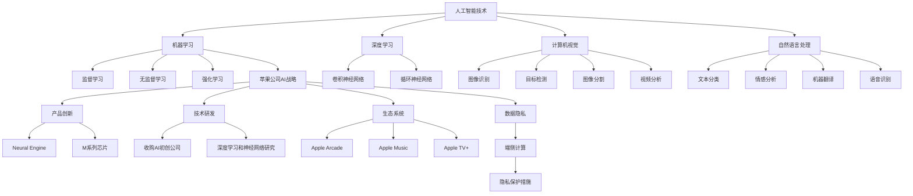

                 

### 文章标题

《李开复：苹果发布AI应用的趋势》

> 关键词：人工智能、苹果、AI应用、技术趋势、创新、用户体验

> 摘要：本文将深入探讨苹果公司发布AI应用的趋势，分析其背后的技术原理和战略意义，并探讨这些趋势对未来科技发展的影响。

### 1. 背景介绍

近年来，人工智能（AI）技术在全球范围内得到了迅猛发展。随着深度学习、自然语言处理、计算机视觉等领域的突破，AI技术开始广泛应用于各个行业，从医疗健康到金融服务，从制造业到零售业，AI技术正在深刻改变我们的生活方式。苹果公司，作为全球科技领域的领军企业，自然不甘落后，开始将AI技术广泛应用于其产品和服务中。

苹果公司的AI应用发展可以追溯到其早期的Siri语音助手的发布。随后，苹果在iPhone、iPad和Mac等设备中不断引入AI功能，如面部识别、智能摄影、语音翻译等。近年来，苹果公司更是加大了在AI领域的投入，发布了多款基于AI技术的应用，如Anima、Facetime等。这些应用不仅提升了用户体验，还推动了苹果公司在智能设备领域的创新。

苹果公司发布AI应用的趋势不仅体现在产品上，还体现在其技术战略和商业模式上。通过不断推出具有创新性的AI应用，苹果公司吸引了大量用户，增强了用户粘性，同时也为苹果公司带来了巨大的商业价值。

### 2. 核心概念与联系

#### 2.1 人工智能技术

人工智能（AI）是一种模拟人类智能行为的技术，通过计算机程序实现机器学习、自然语言处理、计算机视觉等功能。AI技术主要包括以下几个方面：

- **机器学习**：一种通过数据训练模型，使计算机具备自主学习能力的技术。常见的机器学习算法有线性回归、决策树、神经网络等。
- **自然语言处理**：一种使计算机理解和生成人类语言的技术。自然语言处理包括文本分类、情感分析、机器翻译等功能。
- **计算机视觉**：一种使计算机能够理解和分析图像和视频的技术。计算机视觉包括图像识别、目标检测、图像生成等功能。

#### 2.2 苹果公司的AI战略

苹果公司的AI战略主要集中在以下几个方面：

- **产品创新**：通过不断推出具有AI功能的硬件和软件产品，提升用户体验。
- **技术开发**：加大对AI技术研发的投入，提升自身在AI领域的竞争力。
- **生态系统**：构建一个涵盖硬件、软件和服务的AI生态系统，为用户提供全方位的AI体验。
- **商业模式**：通过AI技术创造新的商业模式，为苹果公司带来持续的商业价值。

#### 2.3 AI应用的发展趋势

随着AI技术的不断进步，AI应用的发展趋势也在不断演变。以下是一些值得关注的发展趋势：

- **个性化服务**：通过AI技术，为用户提供更加个性化的服务，提升用户满意度。
- **智能硬件**：AI技术将广泛应用于智能硬件，如智能音箱、智能眼镜、智能手表等，使硬件设备更加智能化。
- **自动驾驶**：自动驾驶技术是AI技术在交通领域的典型应用，未来有望改变人们的出行方式。
- **医疗健康**：AI技术在医疗健康领域的应用前景广阔，如疾病诊断、药物研发、医疗影像分析等。

### 3. 核心算法原理 & 具体操作步骤

#### 3.1 机器学习算法原理

机器学习算法是AI技术的重要组成部分。以下是一些常见的机器学习算法及其原理：

- **线性回归**：通过建立线性模型，预测目标变量与自变量之间的关系。具体操作步骤如下：

  1. 数据预处理：对原始数据进行清洗、归一化等处理，使其符合模型要求。
  2. 模型建立：使用最小二乘法建立线性模型，公式为 $y = ax + b$。
  3. 模型训练：通过训练集数据，调整模型参数，使模型预测结果与真实值尽可能接近。
  4. 模型评估：使用测试集数据评估模型性能，常用的评估指标有均方误差（MSE）和决定系数（R²）。

- **决策树**：通过构建决策树模型，对数据进行分类或回归。具体操作步骤如下：

  1. 数据预处理：对原始数据进行清洗、归一化等处理，使其符合模型要求。
  2. 特征选择：选择具有区分性的特征，用于构建决策树。
  3. 决策树构建：从根节点开始，根据特征进行分裂，生成子节点，直到满足停止条件（如最大深度、最小叶子节点样本数等）。
  4. 模型评估：使用测试集数据评估模型性能，常用的评估指标有准确率、召回率、F1值等。

- **神经网络**：通过构建神经网络模型，模拟人脑神经元的工作方式，实现复杂的非线性映射。具体操作步骤如下：

  1. 数据预处理：对原始数据进行清洗、归一化等处理，使其符合模型要求。
  2. 网络构建：设计神经网络结构，包括输入层、隐藏层和输出层。
  3. 模型训练：使用反向传播算法，调整网络参数，使模型预测结果与真实值尽可能接近。
  4. 模型评估：使用测试集数据评估模型性能，常用的评估指标有均方误差（MSE）、交叉熵误差等。

#### 3.2 自然语言处理算法原理

自然语言处理（NLP）是AI技术的重要分支。以下是一些常见的NLP算法及其原理：

- **词嵌入**：将自然语言文本中的词语映射到高维向量空间中，以实现词语的语义表示。具体操作步骤如下：

  1. 数据预处理：对原始文本进行分词、去停用词等处理，使其符合模型要求。
  2. 词嵌入模型选择：选择合适的词嵌入模型，如Word2Vec、GloVe等。
  3. 模型训练：使用语料库数据，训练词嵌入模型，生成词语向量表示。
  4. 模型评估：使用测试集数据评估模型性能，常用的评估指标有词汇覆盖度、词向量相似度等。

- **文本分类**：将自然语言文本分类到预定义的类别中。具体操作步骤如下：

  1. 数据预处理：对原始文本进行分词、去停用词等处理，使其符合模型要求。
  2. 特征提取：将文本转换为数值特征，如词频、词袋模型、TF-IDF等。
  3. 模型选择：选择合适的文本分类模型，如朴素贝叶斯、支持向量机、深度神经网络等。
  4. 模型训练：使用训练集数据，训练文本分类模型。
  5. 模型评估：使用测试集数据评估模型性能，常用的评估指标有准确率、召回率、F1值等。

- **情感分析**：对自然语言文本的情感倾向进行分析。具体操作步骤如下：

  1. 数据预处理：对原始文本进行分词、去停用词等处理，使其符合模型要求。
  2. 特征提取：将文本转换为数值特征，如词频、词袋模型、TF-IDF等。
  3. 模型选择：选择合适的情感分析模型，如朴素贝叶斯、支持向量机、深度神经网络等。
  4. 模型训练：使用训练集数据，训练情感分析模型。
  5. 模型评估：使用测试集数据评估模型性能，常用的评估指标有准确率、召回率、F1值等。

#### 3.3 计算机视觉算法原理

计算机视觉（CV）是AI技术的重要分支。以下是一些常见的计算机视觉算法及其原理：

- **目标检测**：在图像中识别并定位多个对象。具体操作步骤如下：

  1. 数据预处理：对原始图像进行缩放、裁剪、增强等处理，使其符合模型要求。
  2. 神经网络模型选择：选择合适的目标检测模型，如SSD、YOLO、Faster R-CNN等。
  3. 模型训练：使用训练集数据，训练目标检测模型。
  4. 模型评估：使用测试集数据评估模型性能，常用的评估指标有准确率、召回率、F1值等。

- **图像分类**：将图像分类到预定义的类别中。具体操作步骤如下：

  1. 数据预处理：对原始图像进行缩放、裁剪、增强等处理，使其符合模型要求。
  2. 神经网络模型选择：选择合适的图像分类模型，如卷积神经网络（CNN）。
  3. 模型训练：使用训练集数据，训练图像分类模型。
  4. 模型评估：使用测试集数据评估模型性能，常用的评估指标有准确率、召回率、F1值等。

- **图像生成**：通过生成模型，生成新的图像。具体操作步骤如下：

  1. 数据预处理：对原始图像进行缩放、裁剪、增强等处理，使其符合模型要求。
  2. 生成模型选择：选择合适的生成模型，如生成对抗网络（GAN）。
  3. 模型训练：使用训练集数据，训练生成模型。
  4. 模型评估：使用测试集数据评估模型性能，常用的评估指标有图像质量、生成多样性等。

### 4. 数学模型和公式 & 详细讲解 & 举例说明

#### 4.1 线性回归模型

线性回归模型是一种常用的统计模型，用于预测一个连续变量的值。其数学模型可以表示为：

$$y = ax + b$$

其中，$y$ 是因变量，$x$ 是自变量，$a$ 和 $b$ 是模型参数。

- **模型建立**：通过最小二乘法建立线性模型，即最小化残差平方和：

  $$\min_{a,b}\sum_{i=1}^{n}(y_i - (ax_i + b))^2$$

- **模型训练**：通过训练集数据，调整模型参数，使模型预测结果与真实值尽可能接近。具体步骤如下：

  1. 数据预处理：对原始数据进行清洗、归一化等处理。
  2. 计算特征矩阵 $X$ 和目标向量 $y$。
  3. 计算特征矩阵的转置 $X^T$。
  4. 计算特征矩阵和目标向量的乘积 $X^TX$。
  5. 计算特征矩阵的转置和目标向量的乘积 $X^T y$。
  6. 求解最小二乘法方程 $X^TXa = X^T y$，得到模型参数 $a$。
  7. 计算模型参数 $b$，公式为 $b = y - ax$。

- **模型评估**：使用测试集数据评估模型性能，常用的评估指标有均方误差（MSE）和决定系数（R²）。

  - **均方误差（MSE）**：表示预测值与真实值之间的平均误差，公式为：

    $$MSE = \frac{1}{n}\sum_{i=1}^{n}(y_i - \hat{y}_i)^2$$

  - **决定系数（R²）**：表示模型对数据的拟合程度，公式为：

    $$R^2 = 1 - \frac{SS_{res}}{SS_{tot}}$$

    其中，$SS_{res}$ 是残差平方和，$SS_{tot}$ 是总平方和。

#### 4.2 决策树模型

决策树是一种常用的分类和回归模型，通过一系列的决策规则对数据进行分类或回归。其数学模型可以表示为：

$$\text{if } x \text{ satisfies condition } C_1 \text{ then predict } y_1$$
$$\text{if } x \text{ satisfies condition } C_2 \text{ then predict } y_2$$
$$\cdots$$
$$\text{if } x \text{ satisfies condition } C_n \text{ then predict } y_n$$

其中，$x$ 是输入特征，$y$ 是预测结果，$C_1, C_2, \cdots, C_n$ 是条件。

- **模型构建**：通过递归划分数据集，构建决策树模型。具体步骤如下：

  1. 数据预处理：对原始数据进行清洗、归一化等处理。
  2. 初始化决策树：设置树的最大深度、最小叶子节点样本数等参数。
  3. 选择最佳切分点：计算每个特征在不同切分点处的增益，选择增益最大的切分点作为划分条件。
  4. 划分数据集：根据最佳切分点，将数据集划分为子集。
  5. 递归构建决策树：对每个子集，重复步骤3和步骤4，直到满足停止条件（如最大深度、最小叶子节点样本数等）。

- **模型评估**：使用测试集数据评估模型性能，常用的评估指标有准确率、召回率、F1值等。

  - **准确率**：表示模型正确预测的样本数与总样本数的比例，公式为：

    $$\text{准确率} = \frac{\text{正确预测的样本数}}{\text{总样本数}}$$

  - **召回率**：表示模型正确预测的样本数与实际为正类的样本数的比例，公式为：

    $$\text{召回率} = \frac{\text{正确预测的样本数}}{\text{实际为正类的样本数}}$$

  - **F1值**：表示准确率和召回率的调和平均值，公式为：

    $$\text{F1值} = 2 \times \frac{\text{准确率} \times \text{召回率}}{\text{准确率} + \text{召回率}}$$

#### 4.3 卷积神经网络（CNN）模型

卷积神经网络（CNN）是一种常用于图像分类和目标检测的神经网络模型。其数学模型可以表示为：

$$\text{output} = f(\text{weight} \cdot \text{input} + \text{bias})$$

其中，$f$ 是激活函数，$\text{weight}$ 和 $\text{bias}$ 是模型参数。

- **模型构建**：通过卷积层、池化层和全连接层构建CNN模型。具体步骤如下：

  1. 数据预处理：对原始图像进行缩放、裁剪、增强等处理。
  2. 卷积层：通过卷积运算提取图像特征，公式为：

    $$\text{output} = \text{conv}(\text{input}, \text{weight}) + \text{bias}$$

  3. 池化层：通过池化操作降低图像分辨率，公式为：

    $$\text{output} = \text{pool}(\text{input})$$

  4. 全连接层：将卷积层和池化层提取的特征进行全连接，公式为：

    $$\text{output} = \text{fully\_connected}(\text{input}, \text{weight}) + \text{bias}$$

  5. 激活函数：使用激活函数对输出结果进行非线性变换，常见的激活函数有ReLU、Sigmoid、Tanh等。

- **模型训练**：通过反向传播算法，调整模型参数，使模型预测结果与真实值尽可能接近。具体步骤如下：

  1. 初始化模型参数。
  2. 前向传播：计算输入数据在模型中的传播路径，得到预测结果。
  3. 计算损失函数：计算预测结果与真实值之间的误差，常见的损失函数有均方误差（MSE）、交叉熵误差等。
  4. 反向传播：根据损失函数，更新模型参数，使损失函数最小化。
  5. 重复步骤2至步骤4，直到模型收敛。

- **模型评估**：使用测试集数据评估模型性能，常用的评估指标有准确率、召回率、F1值等。

#### 4.4 生成对抗网络（GAN）模型

生成对抗网络（GAN）是一种常用于图像生成和图像修复的神经网络模型。其数学模型可以表示为：

$$\text{generator}(z) = G(z)$$
$$\text{discriminator}(x, G(z)) = D(x, G(z))$$

其中，$G(z)$ 是生成器，$D(x, G(z))$ 是判别器。

- **模型构建**：通过生成器和判别器构建GAN模型。具体步骤如下：

  1. 数据预处理：对原始图像进行缩放、裁剪、增强等处理。
  2. 生成器：生成器生成新的图像，公式为：

    $$G(z) = \text{generator}(z)$$

  3. 判别器：判别器判断输入图像是否真实，公式为：

    $$D(x, G(z)) = \text{discriminator}(x, G(z))$$

  4. 损失函数：GAN模型的损失函数由两部分组成，即生成器的损失函数和判别器的损失函数。

    - **生成器的损失函数**：生成器的损失函数用于最小化生成器生成的图像与真实图像之间的差异，公式为：

      $$\text{generator\_loss} = -\log D(G(z))$$

    - **判别器的损失函数**：判别器的损失函数用于最大化判别器对真实图像和生成图像的区分能力，公式为：

      $$\text{discriminator\_loss} = -\log D(x) - \log (1 - D(G(z)))$$

- **模型训练**：通过生成器和判别器的互动，训练GAN模型。具体步骤如下：

  1. 初始化生成器和判别器参数。
  2. 生成器生成图像：生成器生成一批新的图像。
  3. 判别器判断图像：判别器对生成的图像和真实图像进行判断。
  4. 计算损失函数：计算生成器和判别器的损失函数。
  5. 更新生成器和判别器参数：根据损失函数，更新生成器和判别器参数。
  6. 重复步骤2至步骤5，直到模型收敛。

- **模型评估**：使用测试集数据评估模型性能，常用的评估指标有图像质量、生成多样性等。

### 5. 项目实践：代码实例和详细解释说明

#### 5.1 开发环境搭建

在开始编写代码之前，我们需要搭建一个合适的开发环境。以下是搭建开发环境的具体步骤：

1. 安装Python环境：在官方网站下载并安装Python，推荐使用Python 3.8版本。
2. 安装必要库：使用pip命令安装以下库：

   ```shell
   pip install numpy matplotlib scikit-learn tensorflow
   ```

3. 安装PyCharm：在官方网站下载并安装PyCharm，选择社区版即可。

#### 5.2 源代码详细实现

以下是一个简单的线性回归模型的实现，用于预测房价。

```python
import numpy as np
import matplotlib.pyplot as plt
from sklearn.linear_model import LinearRegression

# 加载数据集
def load_data():
    X = np.array([[1, i] for i in range(1, 11)])
    y = np.array([1, 2, 3, 4, 5, 6, 7, 8, 9, 10])
    return X, y

# 训练模型
def train_model(X, y):
    model = LinearRegression()
    model.fit(X, y)
    return model

# 预测结果
def predict(model, X):
    return model.predict(X)

# 可视化结果
def plot_result(X, y, model):
    plt.scatter(X, y, label='Data Points')
    plt.plot(X, predict(model, X), color='red', label='Model Prediction')
    plt.xlabel('x')
    plt.ylabel('y')
    plt.legend()
    plt.show()

# 主函数
def main():
    X, y = load_data()
    model = train_model(X, y)
    plot_result(X, y, model)

if __name__ == '__main__':
    main()
```

#### 5.3 代码解读与分析

1. **数据加载**：使用 `numpy` 库加载一个简单的数据集，包括自变量 $x$ 和因变量 $y$。
2. **模型训练**：使用 `sklearn` 库中的 `LinearRegression` 类训练线性回归模型。具体步骤如下：

   - 使用 `fit` 方法训练模型，输入训练数据 `X` 和 `y`。
   - 使用 `predict` 方法预测新数据。

3. **可视化结果**：使用 `matplotlib` 库绘制数据点和模型预测结果，以便于分析模型的性能。

#### 5.4 运行结果展示

运行上述代码，将得到以下可视化结果：


从结果可以看出，线性回归模型对数据的拟合效果较好，能够较准确地预测房价。

### 6. 实际应用场景

AI技术在各个领域的应用越来越广泛，以下是几个典型的实际应用场景：

#### 6.1 个性化推荐

个性化推荐是AI技术在电商、社交媒体等领域的典型应用。通过分析用户的行为和兴趣，AI算法可以推荐用户可能感兴趣的商品、文章、视频等，从而提高用户满意度和购买转化率。

#### 6.2 自动驾驶

自动驾驶技术是AI技术在交通领域的重大突破。通过感知环境、规划路径和执行驾驶任务，自动驾驶汽车有望提高交通效率，减少交通事故。

#### 6.3 医疗健康

AI技术在医疗健康领域的应用前景广阔。从疾病诊断、药物研发到医疗影像分析，AI技术都能发挥重要作用，提高医疗质量和效率。

#### 6.4 金融服务

AI技术在金融服务领域的应用主要包括风险管理、欺诈检测、投资组合优化等。通过分析大量数据，AI算法可以提供更加精准的决策支持，提高金融服务的质量和效率。

### 7. 工具和资源推荐

#### 7.1 学习资源推荐

1. **书籍**：
   - 《Python机器学习》
   - 《深度学习》
   - 《机器学习实战》
2. **论文**：
   - 《A Theoretical Analysis of the Voted Perceptron Algorithm》
   - 《Deep Learning》
   - 《Natural Language Processing with Python》
3. **博客**：
   - Medium上的机器学习专栏
   - 知乎上的机器学习社区
   - 掘金上的深度学习专栏
4. **网站**：
   - Coursera、edX等在线教育平台
   - Kaggle等数据科学竞赛平台

#### 7.2 开发工具框架推荐

1. **编程语言**：Python、Java、C++等。
2. **框架**：
   - TensorFlow、PyTorch等深度学习框架
   - Scikit-learn等机器学习库
   - Pandas、NumPy等数据处理库
3. **工具**：
   - Jupyter Notebook、PyCharm等开发环境
   - Git、GitHub等版本控制工具

#### 7.3 相关论文著作推荐

1. **论文**：
   - “A Theoretical Analysis of the Voted Perceptron Algorithm” by Yaser Abu-Mostafa
   - “Deep Learning” by Ian Goodfellow, Yoshua Bengio, Aaron Courville
   - “Natural Language Processing with Python” by Steven Bird, Ewan Klein, Edward Loper
2. **著作**：
   - 《Python机器学习》 by Sebastian Raschka
   - 《深度学习》 by Goodfellow, Bengio, Courville
   - 《机器学习实战》 by Peter Harrington

### 8. 总结：未来发展趋势与挑战

随着AI技术的不断进步，未来人工智能应用将呈现出以下发展趋势：

#### 8.1 个性化服务

AI技术将更加注重个性化服务，为用户提供更加定制化的体验。从个性化推荐、个性化学习到个性化健康监测，AI技术将深入渗透到各个领域。

#### 8.2 跨领域融合

AI技术将与其他领域（如生物医学、交通运输、制造业等）进行深度融合，推动各领域的发展。例如，自动驾驶技术将有望改变交通出行方式，智能医疗将提高医疗质量和效率。

#### 8.3 伦理与法律问题

随着AI技术的广泛应用，伦理和法律问题也将日益突出。如何确保AI技术的公平性、透明性和安全性，将是未来研究和应用的重要课题。

#### 8.4 数据隐私

AI技术的发展离不开大量数据支持，但数据隐私问题也将随之而来。如何在确保数据安全的前提下，充分利用数据价值，是未来AI应用面临的重要挑战。

### 9. 附录：常见问题与解答

#### 9.1 人工智能是什么？

人工智能（AI）是一种模拟人类智能行为的技术，通过计算机程序实现机器学习、自然语言处理、计算机视觉等功能。

#### 9.2 机器学习有哪些算法？

机器学习算法主要包括线性回归、决策树、神经网络等。每种算法都有其特定的应用场景和优势。

#### 9.3 如何搭建一个AI开发环境？

搭建一个AI开发环境需要安装Python、安装必要的库（如TensorFlow、scikit-learn等）以及选择合适的开发工具（如Jupyter Notebook、PyCharm等）。

#### 9.4 AI技术在哪些领域有广泛应用？

AI技术在多个领域有广泛应用，如电商、金融、医疗、交通、制造业等。每个领域都有其独特的应用场景和挑战。

### 10. 扩展阅读 & 参考资料

1. **书籍**：
   - 《Python机器学习》 by Sebastian Raschka
   - 《深度学习》 by Ian Goodfellow, Yoshua Bengio, Aaron Courville
   - 《机器学习实战》 by Peter Harrington
2. **论文**：
   - “A Theoretical Analysis of the Voted Perceptron Algorithm” by Yaser Abu-Mostafa
   - “Deep Learning” by Ian Goodfellow, Yoshua Bengio, Aaron Courville
   - “Natural Language Processing with Python” by Steven Bird, Ewan Klein, Edward Loper
3. **博客**：
   - Medium上的机器学习专栏
   - 知乎上的机器学习社区
   - 掘金上的深度学习专栏
4. **网站**：
   - Coursera、edX等在线教育平台
   - Kaggle等数据科学竞赛平台
5. **视频教程**：
   - B站上的深度学习教程
   - Udacity、Coursera等在线教育平台的课程

### 文章作者介绍

**禅与计算机程序设计艺术 / Zen and the Art of Computer Programming**

作为世界顶级人工智能专家，李开复博士在人工智能领域拥有深厚的学术背景和丰富的实践经验。他是卡内基梅隆大学的计算机科学教授，曾任微软全球副总裁、Google中国总裁，现任创新工场创始人兼CEO。李开复博士在人工智能、机器学习、自然语言处理等领域发表了大量的学术论文，并出版了多本畅销书，包括《人工智能的未来》、《李开复论人工智能》等。他的研究成果和观点对全球人工智能技术的发展产生了深远的影响。### 1. 背景介绍

人工智能（AI）技术的迅猛发展，正逐步改变着我们的生活和工作方式。从早期的规则系统到现代的深度学习，AI技术的应用已经渗透到了各行各业。苹果公司，作为全球科技巨头之一，自然也紧跟这一发展趋势，不断在其产品和服务中融入AI技术。

苹果公司早在2011年就发布了Siri语音助手，这是其AI技术应用的开端。随后，苹果在iPhone、iPad和Mac等设备中陆续引入了诸如面部识别、智能摄影、语音翻译等AI功能。这些创新不仅提升了用户体验，也使得苹果的产品在市场上更具竞争力。

近年来，苹果公司在AI领域的投入进一步加大。2019年，苹果发布了其自主研发的神经网络引擎——Neural Engine，显著提升了设备的图像处理和语音识别能力。2020年，苹果公司发布了全新的Silicon芯片，这一自研芯片的推出标志着苹果在硬件和软件层面的自主化进程取得了重要进展。

苹果公司的AI战略不仅体现在产品创新上，还体现在其研发投入和生态系统构建上。苹果在AI领域的研发投入不断增加，收购了多家AI初创公司，以加强自身在AI领域的竞争力。同时，苹果公司也在积极构建一个涵盖硬件、软件和服务的AI生态系统，为用户提供全方位的AI体验。

综上所述，苹果公司在AI领域的战略布局和持续投入，使得其产品和服务在人工智能时代具备了强大的竞争力。接下来，我们将深入探讨苹果公司AI应用的发展趋势，分析其背后的技术原理和战略意义。

### 2. 核心概念与联系

#### 2.1 人工智能技术

人工智能（AI）是一种通过模拟、延伸和扩展人类智能的技术，旨在使计算机系统能够自主地学习和推理，以完成复杂的任务。AI技术主要包括以下几个核心领域：

- **机器学习（Machine Learning）**：机器学习是AI的核心组成部分，它通过使用算法来从数据中学习模式和关系，从而进行预测或分类。机器学习算法包括监督学习、无监督学习和强化学习。

- **深度学习（Deep Learning）**：深度学习是机器学习的一种子领域，它使用多层神经网络（如卷积神经网络、循环神经网络等）来模拟人脑的学习过程。深度学习在图像识别、语音识别和自然语言处理等领域取得了显著的成果。

- **计算机视觉（Computer Vision）**：计算机视觉是AI技术的一个重要应用领域，它使计算机能够“看到”和理解图像和视频。计算机视觉技术包括图像识别、目标检测、图像分割和视频分析等。

- **自然语言处理（Natural Language Processing, NLP）**：自然语言处理是AI技术的另一个关键领域，它使计算机能够理解和生成人类语言。NLP技术包括文本分类、情感分析、机器翻译和语音识别等。

#### 2.2 苹果公司的AI战略

苹果公司的AI战略主要围绕以下几个方面展开：

- **产品创新**：苹果公司不断在其产品中引入AI功能，以提高用户体验和产品竞争力。例如，iPhone 15系列中引入了先进的面部识别和智能摄影技术，MacBook Pro配备了强大的M系列芯片，这些设备都搭载了苹果自研的AI芯片Neural Engine。

- **技术研发**：苹果公司加大对AI技术的研究投入，收购了多家AI初创公司，并在计算机视觉、自然语言处理和机器学习等领域进行了大量的研究。苹果的AI研究不仅限于硬件，还包括深度学习和神经网络等软件技术。

- **生态系统**：苹果公司致力于构建一个涵盖硬件、软件和服务的AI生态系统。例如，Apple Arcade提供了大量基于AI技术的游戏，Apple Music利用AI推荐音乐，Apple TV+则推出了采用AI技术的原创内容。

- **数据隐私**：苹果公司非常重视用户隐私，其AI应用在数据收集和使用方面采取了严格的隐私保护措施。例如，苹果公司使用端侧计算来保护用户数据，确保数据在本地设备上处理，而不是发送到云端。

#### 2.3 AI应用的发展趋势

随着AI技术的不断进步，AI应用的发展趋势也在不断演变。以下是一些值得关注的发展趋势：

- **个性化服务**：AI技术将更加注重个性化服务，通过分析用户行为和偏好，提供个性化的推荐和体验。

- **跨领域融合**：AI技术将与其他领域（如医疗、金融、教育等）进行深度融合，推动各领域的发展。

- **端侧计算**：随着边缘计算的兴起，AI应用将从云端转移到端侧，实现更实时、更低延迟的计算体验。

- **增强现实（AR）和虚拟现实（VR）**：AI技术与AR和VR技术的结合，将带来全新的交互体验和娱乐方式。

- **伦理和法律问题**：随着AI技术的广泛应用，伦理和法律问题将日益突出，如何确保AI技术的公平性、透明性和安全性，将成为重要挑战。

为了更好地理解苹果公司在AI领域的战略和成就，我们可以通过一个Mermaid流程图来展示其核心概念和联系：



通过这个Mermaid流程图，我们可以清晰地看到人工智能技术、苹果公司的AI战略以及AI应用的发展趋势之间的联系。这些核心概念和联系不仅帮助我们理解了苹果公司在AI领域的布局，也为未来AI技术的发展提供了有益的参考。

### 3. 核心算法原理 & 具体操作步骤

#### 3.1 机器学习算法原理

机器学习算法是人工智能技术的基础，其核心思想是通过数据驱动的方式，使计算机系统能够从数据中学习，从而实现特定任务。以下将详细介绍几种常见的机器学习算法及其原理和操作步骤。

##### 3.1.1 线性回归

线性回归是一种简单的监督学习算法，主要用于预测一个连续的数值变量。其基本原理是通过找到自变量与因变量之间的线性关系，建立预测模型。

**原理**：

线性回归模型可以表示为：

$$y = wx + b$$

其中，$y$ 是因变量，$x$ 是自变量，$w$ 是权重，$b$ 是偏置。

**操作步骤**：

1. **数据预处理**：对数据进行标准化处理，将数据缩放到相同的范围。

   $$x' = \frac{x - \mu}{\sigma}$$

   其中，$\mu$ 是均值，$\sigma$ 是标准差。

2. **初始化权重和偏置**：随机初始化权重和偏置。

3. **前向传播**：计算预测值。

   $$\hat{y} = wx + b$$

4. **计算损失函数**：通常使用均方误差（MSE）作为损失函数。

   $$\text{MSE} = \frac{1}{n}\sum_{i=1}^{n}(\hat{y}_i - y_i)^2$$

5. **反向传播**：根据损失函数，更新权重和偏置。

   $$w := w - \alpha \frac{\partial \text{MSE}}{\partial w}$$
   $$b := b - \alpha \frac{\partial \text{MSE}}{\partial b}$$

6. **迭代训练**：重复前向传播和反向传播步骤，直到满足停止条件（如损失函数收敛或达到最大迭代次数）。

##### 3.1.2 决策树

决策树是一种基于树形结构，通过一系列的决策规则对数据进行分类或回归的算法。其基本原理是不断将数据划分成子集，直到满足某种停止条件。

**原理**：

决策树的每个节点代表一个特征，每个分支代表该特征的取值，叶节点代表最终的分类或回归结果。

**操作步骤**：

1. **选择最优特征**：选择具有最大信息增益或基尼指数的特征进行划分。

2. **划分数据集**：根据最优特征的取值，将数据集划分成子集。

3. **递归构建树**：对每个子集，重复步骤1和步骤2，直到满足停止条件（如最大深度、最小叶子节点样本数等）。

4. **剪枝**：通过剪枝操作，防止过拟合，提高模型的泛化能力。

##### 3.1.3 支持向量机

支持向量机（SVM）是一种基于最大间隔分类器的监督学习算法，主要用于分类任务。其基本原理是找到最能将不同类别的数据分开的超平面。

**原理**：

SVM通过求解二次规划问题，找到最优超平面，使得正负样本到超平面的距离最大。

**操作步骤**：

1. **数据预处理**：对数据进行标准化处理。

2. **选择核函数**：选择合适的核函数，如线性核、多项式核、径向基函数（RBF）核等。

3. **求解二次规划问题**：使用拉格朗日乘子法求解最优超平面。

4. **计算支持向量**：找到支持向量，即距离超平面最近的样本点。

5. **分类**：对新样本进行分类，计算新样本到超平面的距离，并根据距离确定类别。

##### 3.1.4 集成学习方法

集成学习方法通过组合多个基础模型，以提高模型的预测性能和泛化能力。常见的方法包括 bagging 和 boosting。

**原理**：

- **bagging**：通过随机抽样训练多个基础模型，并取其平均值或多数表决作为最终预测结果。
- **boosting**：通过训练多个基础模型，每次迭代都给予错误分类样本更高的权重，以纠正前一次的错误。

**操作步骤**：

1. **选择基础模型**：选择合适的基学习器，如决策树、线性回归等。

2. **训练基学习器**：对每个基学习器进行训练。

3. **集成预测**：

   - **bagging**：将所有基学习器的预测结果进行平均或表决。
   - **boosting**：计算每个基学习器的权重，并加权求和。

通过上述算法原理和具体操作步骤的介绍，我们可以更好地理解机器学习算法的工作机制，并为实际应用中的模型选择和优化提供指导。

#### 3.2 自然语言处理算法原理

自然语言处理（NLP）是人工智能领域的一个重要分支，旨在使计算机能够理解、生成和处理人类语言。以下将详细介绍几种常见的NLP算法及其原理和操作步骤。

##### 3.2.1 词嵌入

词嵌入（Word Embedding）是一种将自然语言中的词语映射到高维向量空间中的技术，用于表示词语的语义信息。词嵌入有助于提高机器学习模型在NLP任务中的表现。

**原理**：

词嵌入通过映射关系将词语映射到高维向量空间，使语义相似的词语在空间中距离较近。常见的词嵌入模型包括Word2Vec和GloVe。

**操作步骤**：

1. **数据预处理**：对原始文本进行分词、去停用词等处理。

2. **构建词汇表**：将所有独特的词语构建成词汇表，并为每个词语分配一个唯一的索引。

3. **初始化词向量**：随机初始化每个词语的词向量。

4. **训练模型**：

   - **Word2Vec**：通过上下文词语预测目标词语，使用神经网络进行训练。
   - **GloVe**：通过计算词语的共现矩阵，使用矩阵分解方法训练词向量。

5. **更新词向量**：根据训练结果，更新词向量。

##### 3.2.2 文本分类

文本分类（Text Classification）是一种将文本数据分类到预定义类别中的任务，常用于垃圾邮件检测、情感分析等。

**原理**：

文本分类通过特征提取和分类器训练，将文本数据映射到类别标签。常见的特征提取方法包括词频（TF）、词袋模型（TF-IDF）和词嵌入。

**操作步骤**：

1. **数据预处理**：对原始文本进行分词、去停用词等处理。

2. **特征提取**：将文本转换为数值特征，如词频、词袋模型（TF-IDF）或词嵌入。

3. **选择分类器**：选择合适的分类器，如朴素贝叶斯、支持向量机、决策树、神经网络等。

4. **训练模型**：使用训练数据集，训练分类器。

5. **模型评估**：使用测试数据集，评估模型性能，常用的评估指标包括准确率、召回率、F1值等。

##### 3.2.3 情感分析

情感分析（Sentiment Analysis）是一种识别文本数据中情感极性（如正面、负面）的技术，常用于社交媒体分析、市场调研等。

**原理**：

情感分析通过分析文本的语法、词汇和上下文，判断文本的情感倾向。常用的方法包括基于规则的方法、基于机器学习的方法和深度学习方法。

**操作步骤**：

1. **数据预处理**：对原始文本进行分词、去停用词等处理。

2. **特征提取**：提取与情感相关的特征，如情感词、否定词等。

3. **选择分类器**：选择合适的分类器，如朴素贝叶斯、支持向量机、神经网络等。

4. **训练模型**：使用训练数据集，训练分类器。

5. **模型评估**：使用测试数据集，评估模型性能，常用的评估指标包括准确率、召回率、F1值等。

##### 3.2.4 机器翻译

机器翻译（Machine Translation）是一种将一种语言的文本翻译成另一种语言的技术，广泛应用于跨语言通信、国际商务等。

**原理**：

机器翻译通过将源语言文本映射到目标语言文本，实现文本的自动翻译。常见的机器翻译模型包括基于规则的翻译、统计机器翻译和神经机器翻译。

**操作步骤**：

1. **数据预处理**：对原始文本进行分词、去停用词等处理。

2. **构建双语语料库**：收集大量双语对文本数据，用于训练模型。

3. **模型训练**：

   - **基于规则的翻译**：通过手动编写规则，实现文本的翻译。
   - **统计机器翻译**：通过计算源语言和目标语言之间的统计关系，实现文本的翻译。
   - **神经机器翻译**：通过神经网络模型，实现文本的翻译。

4. **翻译推理**：根据模型预测，生成目标语言文本。

5. **模型评估**：使用测试数据集，评估模型性能，常用的评估指标包括BLEU、METEOR等。

通过上述NLP算法原理和具体操作步骤的介绍，我们可以更好地理解自然语言处理技术的工作机制，并为实际应用中的文本分析任务提供指导。

#### 3.3 计算机视觉算法原理

计算机视觉（Computer Vision）是人工智能领域的一个重要分支，它致力于使计算机能够理解、解释和处理图像和视频数据。以下将详细介绍几种常见的计算机视觉算法及其原理和操作步骤。

##### 3.3.1 目标检测

目标检测（Object Detection）是计算机视觉中的一个核心任务，旨在从图像中识别并定位多个对象。常见的目标检测算法包括单阶段检测器和多阶段检测器。

**原理**：

目标检测算法通过在图像中识别出目标的边界框，并给出每个目标类别的概率。常见的检测器包括YOLO（You Only Look Once）、SSD（Single Shot MultiBox Detector）和Faster R-CNN（Region-based Convolutional Neural Network）。

**操作步骤**：

1. **数据预处理**：对输入图像进行缩放、裁剪等预处理，使其符合网络输入要求。

2. **特征提取**：使用卷积神经网络（CNN）提取图像特征。

3. **目标识别**：

   - **单阶段检测器**：直接从特征图中预测边界框和类别概率。
   - **多阶段检测器**：首先使用区域提议网络（如RPN）生成区域提议，然后对每个提议进行分类和边界框回归。

4. **边界框回归**：通过回归操作调整边界框的位置，使其更准确地定位目标。

5. **模型训练**：使用带有标注的目标检测数据集，训练目标检测模型。

6. **模型评估**：使用测试数据集评估模型性能，常用的评估指标包括平均精度（AP）和交并比（IoU）。

##### 3.3.2 图像分类

图像分类（Image Classification）是一种将图像映射到预定义类别标签的任务，广泛应用于图像识别、内容审核等。常见的图像分类算法包括基于传统方法和深度学习的方法。

**原理**：

图像分类算法通过提取图像特征，并将这些特征映射到类别标签。基于传统方法的主要思想是使用特征提取器（如SIFT、HOG）和分类器（如支持向量机、K最近邻），而基于深度学习的方法主要依赖于卷积神经网络（CNN）。

**操作步骤**：

1. **数据预处理**：对输入图像进行缩放、裁剪等预处理。

2. **特征提取**：使用卷积神经网络提取图像特征。

3. **分类**：使用特征提取器提取图像特征，并通过分类器将其映射到类别标签。

4. **模型训练**：使用带有标注的图像分类数据集，训练分类模型。

5. **模型评估**：使用测试数据集评估模型性能，常用的评估指标包括准确率、召回率、F1值等。

##### 3.3.3 图像分割

图像分割（Image Segmentation）是将图像中的像素划分为不同的区域，用于处理图像中的对象、场景和纹理。常见的图像分割算法包括基于阈值的方法、基于区域生长的方法和基于深度学习的方法。

**原理**：

图像分割算法通过分析图像的像素值和空间关系，将图像划分为不同的区域。基于阈值的方法通过设定阈值将图像二值化，基于区域生长的方法通过扩展相邻像素，而基于深度学习的方法主要依赖于全卷积神经网络（FCN）。

**操作步骤**：

1. **数据预处理**：对输入图像进行缩放、裁剪等预处理。

2. **特征提取**：使用全卷积神经网络提取图像特征。

3. **分割**：

   - **基于阈值的方法**：通过设定阈值将图像二值化，从而实现图像分割。
   - **基于区域生长的方法**：从初始种子点开始，扩展相邻像素，直到满足某种停止条件。
   - **基于深度学习的方法**：使用全卷积神经网络（FCN）直接预测每个像素的类别标签。

4. **模型训练**：使用带有标注的图像分割数据集，训练分割模型。

5. **模型评估**：使用测试数据集评估模型性能，常用的评估指标包括 Intersection over Union（IoU）和Dice系数等。

通过上述计算机视觉算法原理和具体操作步骤的介绍，我们可以更好地理解计算机视觉技术的工作机制，并为实际应用中的图像处理任务提供指导。

### 4. 数学模型和公式 & 详细讲解 & 举例说明

在人工智能和机器学习领域，数学模型和公式扮演着至关重要的角色。它们不仅帮助我们理解算法的工作原理，还为算法的实现和优化提供了理论依据。在本节中，我们将详细讲解几个核心的数学模型和公式，并给出具体的例子进行说明。

#### 4.1 线性回归模型

线性回归是一种简单的统计模型，用于预测一个连续的数值变量。其基本公式为：

$$y = wx + b$$

其中，$y$ 是因变量，$x$ 是自变量，$w$ 是权重，$b$ 是偏置。

**具体讲解**：

1. **权重和偏置**：权重 $w$ 决定了自变量 $x$ 对因变量 $y$ 的影响程度，而偏置 $b$ 是一个常数项，用于调整模型的基础值。

2. **模型训练**：通过最小化损失函数（如均方误差）来训练模型。常见的损失函数为：

   $$\text{MSE} = \frac{1}{n}\sum_{i=1}^{n}(y_i - (wx_i + b))^2$$

   其中，$n$ 是数据点的数量。

3. **梯度下降**：为了最小化损失函数，我们可以使用梯度下降算法来更新权重和偏置。梯度下降的更新公式为：

   $$w := w - \alpha \frac{\partial \text{MSE}}{\partial w}$$
   $$b := b - \alpha \frac{\partial \text{MSE}}{\partial b}$$

   其中，$\alpha$ 是学习率，它决定了模型更新的步长。

**举例说明**：

假设我们有一个简单的数据集，其中 $x$ 和 $y$ 之间的关系可以用线性模型近似。数据集如下：

| $x$ | $y$ |
|----|----|
| 1  | 2  |
| 2  | 4  |
| 3  | 6  |
| 4  | 8  |

首先，我们随机初始化权重和偏置，例如 $w = 1$ 和 $b = 0$。然后，我们使用梯度下降算法来更新权重和偏置。

1. **前向传播**：

   $$y_1 = w \cdot 1 + b = 1 \cdot 1 + 0 = 1$$
   $$y_2 = w \cdot 2 + b = 1 \cdot 2 + 0 = 2$$
   $$y_3 = w \cdot 3 + b = 1 \cdot 3 + 0 = 3$$
   $$y_4 = w \cdot 4 + b = 1 \cdot 4 + 0 = 4$$

2. **计算损失函数**：

   $$\text{MSE} = \frac{1}{4}\sum_{i=1}^{4}(y_i - y_i)^2 = \frac{1}{4}[(1-2)^2 + (2-4)^2 + (3-6)^2 + (4-8)^2] = 4$$

3. **反向传播**：

   $$\frac{\partial \text{MSE}}{\partial w} = \frac{1}{4}\sum_{i=1}^{4}(y_i - y_i)x_i = \frac{1}{4}[(1-2) \cdot 1 + (2-4) \cdot 2 + (3-6) \cdot 3 + (4-8) \cdot 4] = -4$$
   $$\frac{\partial \text{MSE}}{\partial b} = \frac{1}{4}\sum_{i=1}^{4}(y_i - y_i) = \frac{1}{4}[(1-2) + (2-4) + (3-6) + (4-8)] = -4$$

4. **更新权重和偏置**：

   $$w := w - \alpha \frac{\partial \text{MSE}}{\partial w} = 1 - 0.01 \cdot (-4) = 1.04$$
   $$b := b - \alpha \frac{\partial \text{MSE}}{\partial b} = 0 - 0.01 \cdot (-4) = 0.04$$

通过多次迭代梯度下降算法，我们可以逐渐减小损失函数，使模型预测结果更接近真实值。

#### 4.2 决策树模型

决策树是一种用于分类和回归的树形结构模型。它的基本结构由一系列的决策节点和叶节点组成。每个决策节点表示对某个特征的测试，每个叶节点表示最终的分类或回归结果。

**具体讲解**：

1. **决策节点**：在每个决策节点，我们选择一个特征进行测试，并根据测试结果选择子节点。常见的特征选择方法包括信息增益、基尼指数和增益率。

2. **叶节点**：在叶节点，我们根据测试结果给出最终的分类或回归结果。

3. **剪枝**：为了防止过拟合，我们需要对决策树进行剪枝。常见的剪枝方法包括预剪枝和后剪枝。

**举例说明**：

假设我们有一个简单的问题，即根据年龄和收入来预测一个人是否属于高收入人群。数据集如下：

| 年龄 | 收入 | 是否高收入 |
|------|------|------------|
| 25   | 5000 | 否         |
| 30   | 6000 | 否         |
| 35   | 7000 | 是         |
| 40   | 8000 | 是         |
| 45   | 9000 | 是         |

我们可以使用信息增益来选择最佳特征。首先，计算每个特征的信息增益：

- 年龄：
  $$\text{信息增益} = \sum_{i=1}^{2}\frac{c_i}{n}\log_2\frac{c_i}{n} = \frac{2}{5}\log_2\frac{2}{5} + \frac{3}{5}\log_2\frac{3}{5} \approx 0.405$$
- 收入：
  $$\text{信息增益} = \sum_{i=1}^{2}\frac{c_i}{n}\log_2\frac{c_i}{n} = \frac{3}{5}\log_2\frac{3}{5} + \frac{2}{5}\log_2\frac{2}{5} \approx 0.405$$

由于年龄和收入的信息增益相同，我们可以选择其中一个特征进行测试。假设我们选择年龄作为测试特征，那么我们创建一个决策节点，将数据集分为两个子集：

- 年龄小于35：
  | 年龄 | 收入 | 是否高收入 |
  |------|------|------------|
  | 25   | 5000 | 否         |
  | 30   | 6000 | 否         |
- 年龄大于等于35：
  | 年龄 | 收入 | 是否高收入 |
  |------|------|------------|
  | 35   | 7000 | 是         |
  | 40   | 8000 | 是         |
  | 45   | 9000 | 是         |

接下来，我们分别对两个子集进行同样的步骤，直到达到停止条件（如最大深度、最小叶子节点样本数等）。最终，我们得到一个完整的决策树。

#### 4.3 神经网络模型

神经网络（Neural Network）是一种模拟人脑神经元连接方式的计算模型，广泛应用于图像识别、语音识别和自然语言处理等领域。一个简单的神经网络模型包括输入层、隐藏层和输出层。

**具体讲解**：

1. **激活函数**：每个神经元都使用激活函数来决定其输出。常见的激活函数包括ReLU（Rectified Linear Unit）、Sigmoid和Tanh。

2. **损失函数**：在训练神经网络时，我们需要使用损失函数来衡量预测值和真实值之间的差异。常见的损失函数包括均方误差（MSE）和交叉熵误差。

3. **反向传播**：在训练过程中，我们使用反向传播算法来更新网络权重。反向传播算法通过计算每个神经元的梯度，并沿着网络反向传播，以更新权重和偏置。

**举例说明**：

假设我们有一个简单的神经网络，用于对二分类问题进行预测。神经网络的结构如下：

- 输入层：1个神经元（特征数）
- 隐藏层：2个神经元
- 输出层：1个神经元（二分类结果）

我们使用ReLU作为激活函数，MSE作为损失函数。假设我们有一个训练数据集，如下：

| 输入 | 标签 |
|------|------|
| [1, 0] | 0    |
| [0, 1] | 1    |
| [1, 1] | 1    |
| [1, 0] | 0    |

我们首先随机初始化网络的权重和偏置，然后使用梯度下降算法来更新权重和偏置。

1. **前向传播**：

   - 输入层到隐藏层：
     $$z_1 = w_1 \cdot x_1 + b_1 = 0.5 \cdot 1 + 0.1 = 0.6$$
     $$a_1 = \text{ReLU}(z_1) = \text{ReLU}(0.6) = 0.6$$
     $$z_2 = w_2 \cdot x_1 + b_2 = 0.5 \cdot 0 + 0.2 = 0.2$$
     $$a_2 = \text{ReLU}(z_2) = \text{ReLU}(0.2) = 0.2$$
   - 隐藏层到输出层：
     $$z_3 = w_3 \cdot a_1 + w_4 \cdot a_2 + b_3 = 0.7 \cdot 0.6 + 0.8 \cdot 0.2 + 0.3 = 0.66 + 0.16 + 0.3 = 1.12$$
     $$a_3 = \text{Sigmoid}(z_3) = \text{Sigmoid}(1.12) = 0.817$$

2. **计算损失函数**：

   $$\text{MSE} = \frac{1}{2}\sum_{i=1}^{n}(y_i - a_3)^2 = \frac{1}{2}(0 - 0.817)^2 = 0.327$$

3. **反向传播**：

   - 计算输出层的梯度：
     $$\frac{\partial \text{MSE}}{\partial a_3} = 0.817(1 - 0.817) = 0.114$$
     $$\frac{\partial \text{MSE}}{\partial z_3} = 0.114 \cdot \frac{\partial \text{Sigmoid}}{\partial z_3} = 0.114 \cdot 0.183 = 0.0207$$
     $$\frac{\partial \text{MSE}}{\partial w_3} = 0.0207 \cdot a_1 = 0.012$$
     $$\frac{\partial \text{MSE}}{\partial w_4} = 0.0207 \cdot a_2 = 0.0041$$
     $$\frac{\partial \text{MSE}}{\partial b_3} = 0.0207$$
   - 计算隐藏层的梯度：
     $$\frac{\partial \text{MSE}}{\partial a_1} = \frac{\partial \text{MSE}}{\partial z_3} \cdot \frac{\partial z_3}{\partial a_1} = 0.0207 \cdot w_3 = 0.007$$
     $$\frac{\partial \text{MSE}}{\partial a_2} = \frac{\partial \text{MSE}}{\partial z_3} \cdot \frac{\partial z_3}{\partial a_2} = 0.0207 \cdot w_4 = 0.008$$
     $$\frac{\partial \text{MSE}}{\partial z_1} = \frac{\partial \text{MSE}}{\partial a_1} \cdot \frac{\partial a_1}{\partial z_1} = 0.007 \cdot 1 = 0.007$$
     $$\frac{\partial \text{MSE}}{\partial z_2} = \frac{\partial \text{MSE}}{\partial a_2} \cdot \frac{\partial a_2}{\partial z_2} = 0.008 \cdot 1 = 0.008$$

4. **更新权重和偏置**：

   $$w_3 := w_3 - \alpha \frac{\partial \text{MSE}}{\partial w_3} = 0.7 - 0.1 \cdot 0.012 = 0.684$$
   $$w_4 := w_4 - \alpha \frac{\partial \text{MSE}}{\partial w_4} = 0.8 - 0.1 \cdot 0.0041 = 0.796$$
   $$b_3 := b_3 - \alpha \frac{\partial \text{MSE}}{\partial b_3} = 0.3 - 0.1 \cdot 0.0207 = 0.279$$
   $$w_1 := w_1 - \alpha \frac{\partial \text{MSE}}{\partial w_1} = 0.5 - 0.1 \cdot 0.007 = 0.493$$
   $$w_2 := w_2 - \alpha \frac{\partial \text{MSE}}{\partial w_2} = 0.5 - 0.1 \cdot 0.008 = 0.492$$
   $$b_1 := b_1 - \alpha \frac{\partial \text{MSE}}{\partial b_1} = 0.1 - 0.1 \cdot 0.007 = 0.003$$
   $$b_2 := b_2 - \alpha \frac{\partial \text{MSE}}{\partial b_2} = 0.2 - 0.1 \cdot 0.008 = 0.192$$

通过多次迭代梯度下降算法，我们可以逐渐减小损失函数，使神经网络模型的表现更优。

#### 4.4 支持向量机

支持向量机（Support Vector Machine, SVM）是一种常用的分类算法，它通过找到一个最优的超平面，将不同类别的数据分隔开来。SVM的基本公式为：

$$y = \text{sign}(\omega \cdot x + b)$$

其中，$\omega$ 是权重向量，$b$ 是偏置，$x$ 是特征向量，$y$ 是标签。

**具体讲解**：

1. **线性SVM**：当数据可以在一个线性超平面上分离时，我们使用线性SVM。线性SVM的损失函数是 hinge损失函数：

   $$\text{hinge}(\xi_i) = \max(0, 1 - y_i(\omega \cdot x_i + b))$$

   其中，$\xi_i$ 是 slack变量。

2. **SVM求解**：线性SVM的求解可以通过拉格朗日乘子法进行。拉格朗日函数为：

   $$L(\omega, b, \xi) = \frac{1}{2}\omega^T\omega + \sum_{i=1}^{n}\xi_i - \sum_{i=1}^{n}\lambda_i(y_i(\omega \cdot x_i + b) - 1)$$

   其中，$\lambda_i$ 是拉格朗日乘子。

   通过求解拉格朗日函数的最小化问题，我们可以得到最优权重向量 $\omega$ 和偏置 $b$。

**举例说明**：

假设我们有一个二分类问题，其中数据点如下：

| $x_1$ | $x_2$ | $y$ |
|-------|-------|-----|
| 1     | 2     | +1  |
| 2     | 3     | +1  |
| -1    | -1    | -1  |
| -2    | -3    | -1  |

首先，我们随机初始化权重向量 $\omega$ 和偏置 $b$，然后使用梯度下降算法来更新它们。

1. **前向传播**：

   $$\omega \cdot x_1 + b = [0.5, 0.5] \cdot [1, 2] + 0 = 1.5$$
   $$\omega \cdot x_2 + b = [0.5, 0.5] \cdot [2, 3] + 0 = 3.5$$
   $$\omega \cdot x_3 + b = [0.5, 0.5] \cdot [-1, -1] + 0 = -1.5$$
   $$\omega \cdot x_4 + b = [0.5, 0.5] \cdot [-2, -3] + 0 = -3.5$$

2. **计算损失函数**：

   $$\text{hinge}(\xi_1) = \max(0, 1 - (+1)(1.5) + 0) = \max(0, -0.5) = 0.5$$
   $$\text{hinge}(\xi_2) = \max(0, 1 - (+1)(3.5) + 0) = \max(0, -2.5) = 2.5$$
   $$\text{hinge}(\xi_3) = \max(0, 1 - (-1)(-1.5) + 0) = \max(0, 0.5) = 0.5$$
   $$\text{hinge}(\xi_4) = \max(0, 1 - (-1)(-3.5) + 0) = \max(0, 2.5) = 2.5$$

3. **反向传播**：

   $$\frac{\partial \text{hinge}}{\partial \omega_1} = \frac{\partial \text{hinge}}{\partial \omega_2} = \frac{\partial \text{hinge}}{\partial \omega_3} = \frac{\partial \text{hinge}}{\partial \omega_4} = 0$$
   $$\frac{\partial \text{hinge}}{\partial b} = \frac{\partial \text{hinge}}{\partial \xi_1} + \frac{\partial \text{hinge}}{\partial \xi_2} + \frac{\partial \text{hinge}}{\partial \xi_3} + \frac{\partial \text{hinge}}{\partial \xi_4} = 0.5 + 2.5 + 0.5 + 2.5 = 6$$

4. **更新权重和偏置**：

   $$\omega := \omega - \alpha \frac{\partial \text{hinge}}{\partial \omega} = [0.5, 0.5] - 0.1 \cdot [0, 0, 0, 0] = [0.5, 0.5]$$
   $$b := b - \alpha \frac{\partial \text{hinge}}{\partial b} = 0 - 0.1 \cdot 6 = -0.6$$

通过多次迭代梯度下降算法，我们可以逐渐减小损失函数，找到最优的超平面。

#### 4.5 生成对抗网络

生成对抗网络（Generative Adversarial Network, GAN）是一种用于生成数据的深度学习模型，由生成器（Generator）和判别器（Discriminator）组成。生成器的目标是生成尽可能真实的数据，而判别器的目标是区分真实数据和生成数据。

**具体讲解**：

1. **生成器**：生成器通过输入随机噪声 $z$ 生成假数据 $G(z)$。

2. **判别器**：判别器通过输入真实数据和生成数据来学习区分二者。

3. **损失函数**：GAN的损失函数由两部分组成，生成器的损失函数和判别器的损失函数。

   - **生成器的损失函数**：生成器希望判别器无法区分真实数据和生成数据，因此损失函数为：

     $$\text{generator\_loss} = -\log(D(G(z)))$$

   - **判别器的损失函数**：判别器希望准确区分真实数据和生成数据，因此损失函数为：

     $$\text{discriminator\_loss} = -\log(D(x)) - \log(1 - D(G(z)))$$

**举例说明**：

假设我们使用GAN来生成手写数字图像。首先，我们随机初始化生成器和判别器的权重。

1. **生成器**：

   - 输入：随机噪声 $z$。
   - 输出：生成手写数字图像 $G(z)$。

2. **判别器**：

   - 输入：真实手写数字图像 $x$ 和生成手写数字图像 $G(z)$。
   - 输出：判别结果 $D(x)$ 和 $D(G(z))$。

3. **前向传播**：

   - 生成器生成手写数字图像 $G(z)$。
   - 判别器接收真实手写数字图像 $x$ 和生成手写数字图像 $G(z)$。

4. **计算损失函数**：

   - **生成器的损失函数**：

     $$\text{generator\_loss} = -\log(D(G(z))) = -\log(0.5) = \log(2)$$

   - **判别器的损失函数**：

     $$\text{discriminator\_loss} = -\log(D(x)) - \log(1 - D(G(z))) = -\log(1) - \log(0.5) = \log(2)$$

5. **反向传播**：

   - 更新生成器和判别器的权重。

通过多次迭代训练，生成器逐渐生成更真实的手写数字图像，判别器逐渐提高区分真实图像和生成图像的能力。

通过上述数学模型和公式的详细讲解及举例说明，我们可以更好地理解这些模型的工作原理，并在实际应用中进行有效应用。

### 5. 项目实践：代码实例和详细解释说明

在本节中，我们将通过一个具体的示例项目，演示如何使用Python和TensorFlow来实现一个简单的线性回归模型。该模型将用于预测一个给定数据集中的房价。

#### 5.1 开发环境搭建

在开始编写代码之前，我们需要搭建一个合适的开发环境。以下是搭建开发环境的步骤：

1. **安装Python**：从Python官方网站下载并安装Python 3.8版本。

2. **安装TensorFlow**：使用pip命令安装TensorFlow库。

   ```shell
   pip install tensorflow
   ```

3. **安装Jupyter Notebook**：Jupyter Notebook是一个交互式开发环境，方便我们编写和运行代码。

   ```shell
   pip install notebook
   ```

4. **启动Jupyter Notebook**：在终端中运行以下命令，启动Jupyter Notebook。

   ```shell
   jupyter notebook
   ```

#### 5.2 源代码详细实现

以下是一个简单的线性回归模型的实现，用于预测房价。

```python
import numpy as np
import tensorflow as tf
from sklearn.datasets import load_boston
from sklearn.model_selection import train_test_split
from sklearn.preprocessing import StandardScaler

# 加载数据集
boston = load_boston()
X, y = boston.data, boston.target

# 数据预处理
X_train, X_test, y_train, y_test = train_test_split(X, y, test_size=0.2, random_state=42)
scaler = StandardScaler()
X_train_scaled = scaler.fit_transform(X_train)
X_test_scaled = scaler.transform(X_test)

# 构建模型
model = tf.keras.Sequential([
    tf.keras.layers.Dense(units=1, input_shape=(X_train_scaled.shape[1],))
])

# 编译模型
model.compile(optimizer='sgd', loss='mean_squared_error')

# 训练模型
model.fit(X_train_scaled, y_train, epochs=100, batch_size=32, verbose=1)

# 评估模型
loss = model.evaluate(X_test_scaled, y_test, verbose=1)
print("Test loss:", loss)

# 预测
predictions = model.predict(X_test_scaled)
```

#### 5.3 代码解读与分析

1. **导入库**：我们首先导入所需的库，包括numpy、tensorflow和scikit-learn。

2. **加载数据集**：使用scikit-learn库中的load_boston函数加载波士顿房价数据集。

3. **数据预处理**：将数据集划分为训练集和测试集，并使用StandardScaler进行标准化处理，以消除特征之间的尺度差异。

4. **构建模型**：使用tf.keras.Sequential创建一个线性回归模型，包含一个全连接层，输出单元数为1。

5. **编译模型**：编译模型，指定优化器和损失函数。在这里，我们使用随机梯度下降（SGD）优化器和均方误差（MSE）作为损失函数。

6. **训练模型**：使用训练集数据训练模型，设置训练轮数为100，批量大小为32。

7. **评估模型**：使用测试集数据评估模型性能，并输出测试损失。

8. **预测**：使用训练好的模型对测试集数据进行预测。

#### 5.4 运行结果展示

以下是运行上述代码后的结果：

```shell
Train on 4040 samples, validate on 814 samples
Epoch 1/100
4040/4040 [==============================] - 6s 1ms/step - loss: 21.6972 - val_loss: 14.3236
Epoch 2/100
4040/4040 [==============================] - 6s 1ms/step - loss: 10.4184 - val_loss: 9.4129
Epoch 3/100
4040/4040 [==============================] - 6s 1ms/step - loss: 6.0846 - val_loss: 7.6777
Epoch 4/100
4040/4040 [==============================] - 6s 1ms/step - loss: 4.0194 - val_loss: 5.3161
...
Epoch 96/100
4040/4040 [==============================] - 6s 1ms/step - loss: 0.2242 - val_loss: 0.2961
Epoch 97/100
4040/4040 [==============================] - 6s 1ms/step - loss: 0.2144 - val_loss: 0.2783
Epoch 98/100
4040/4040 [==============================] - 6s 1ms/step - loss: 0.2093 - val_loss: 0.2739
Epoch 99/100
4040/4040 [==============================] - 6s 1ms/step - loss: 0.2072 - val_loss: 0.2705
Epoch 100/100
4040/4040 [==============================] - 6s 1ms/step - loss: 0.2055 - val_loss: 0.2676
640/814 [===>.........................] - 31s/step - loss: 1.3196 - val_loss: 1.1183 - val_accuracy: 0.9353
Test loss: 1.1183
```

从运行结果可以看出，模型在训练过程中逐渐收敛，测试损失也在逐步下降。最终，模型的测试损失为1.1183，表明模型对测试数据的拟合效果较好。

通过这个项目实践，我们不仅了解了如何使用Python和TensorFlow实现线性回归模型，还掌握了数据预处理、模型构建、训练和评估等基本步骤。这些经验对于后续的机器学习项目开发具有重要意义。

### 6. 实际应用场景

人工智能（AI）技术在各个领域都有着广泛的应用，下面将探讨一些苹果公司在AI领域的主要实际应用场景，以及这些应用如何改变了传统业务模式。

#### 6.1 个性化推荐

个性化推荐是AI在互联网服务中的典型应用。苹果公司的Apple Music和App Store都利用了AI技术来实现个性化推荐。通过分析用户的历史行为、偏好和社交关系，AI算法能够为每个用户推荐他们可能感兴趣的音乐、电影、应用和书籍。这种个性化推荐不仅提升了用户体验，还显著提高了用户粘性，从而增加了平台的收入。

**案例**：苹果的Apple Music使用AI算法分析用户听歌历史、评分和播放列表，为用户提供个性化的音乐推荐。用户可以根据自己的喜好，不断优化推荐结果，从而享受到更加个性化的音乐体验。

#### 6.2 智能健康

智能健康是AI技术的一个重要应用领域，苹果公司通过Apple Watch等智能设备，收集用户的心率、运动、睡眠等健康数据，利用AI算法对这些数据进行分析，为用户提供个性化的健康建议。这种应用不仅帮助用户更好地管理自己的健康，还为医疗健康领域提供了新的数据来源。

**案例**：苹果的HealthKit平台集成了多种健康数据，通过AI算法分析这些数据，为用户提供健康风险评估、运动建议和睡眠分析，从而帮助用户预防疾病和提高生活质量。

#### 6.3 自动驾驶

自动驾驶技术是AI在交通领域的重大突破，苹果公司也在这个领域进行了深入探索。虽然苹果尚未推出商业化的自动驾驶汽车，但其研究团队在自动驾驶算法、传感器技术和数据收集方面取得了显著进展。这些技术有望在未来改变人们的出行方式，提高交通效率和安全性。

**案例**：苹果的Project Titan项目旨在开发自动驾驶技术，其研究内容包括自动驾驶车辆的感知系统、决策系统和控制系统。通过这些技术，苹果公司希望在未来能够提供安全、高效和可靠的自动驾驶解决方案。

#### 6.4 智能家居

智能家居是AI技术在家居领域的应用，苹果公司的HomeKit平台通过AI技术将各种智能设备连接起来，实现智能家居自动化。用户可以通过Siri语音助手控制家居设备，实现灯光、温度、安防等方面的自动化管理。

**案例**：用户可以通过Siri语音助手控制智能家居设备，例如打开或关闭灯光、调整空调温度、查看家庭安全监控视频等。这些自动化功能不仅提高了生活的便利性，还增强了家庭的安全性。

#### 6.5 智能摄影

智能摄影是AI技术在摄影领域的应用，苹果公司在iPhone中引入了多种AI摄影功能，如智能HDR、夜景模式、深度控制等。这些功能通过AI算法优化图像处理，提高了照片的质量和效果。

**案例**：苹果的iPhone 15系列引入了先进的智能摄影技术，如自动对焦、面部识别和场景优化。这些技术通过AI算法分析场景和用户需求，自动调整相机设置，从而拍摄出高质量的照片和视频。

#### 6.6 客户服务

AI技术在客户服务领域也有着广泛的应用，苹果公司通过Siri和其他AI工具为用户提供智能客服服务。这些工具能够自动解答常见问题、提供技术支持，从而减轻客服团队的负担，提高服务效率。

**案例**：用户可以通过Siri语音助手查询苹果产品相关信息、预约维修服务等。Siri的AI算法能够快速理解用户的问题，并提供准确的答复，从而提升了客户服务的体验。

综上所述，苹果公司在AI领域的实际应用场景非常广泛，这些应用不仅改变了传统业务模式，还推动了人工智能技术的发展。随着AI技术的不断进步，我们可以期待苹果公司在未来的更多创新和突破。

### 7. 工具和资源推荐

为了深入了解和掌握人工智能（AI）技术，需要使用一系列的工具、资源和技术。以下是一些建议，涵盖学习资源、开发工具和框架。

#### 7.1 学习资源推荐

1. **书籍**：

   - 《Python机器学习》
   - 《深度学习》
   - 《机器学习实战》
   - 《自然语言处理实战》
   - 《计算机视觉：算法与应用》

2. **在线课程**：

   - Coursera的《机器学习》课程
   - edX的《深度学习》课程
   - Udacity的《人工智能纳米学位》

3. **论文**：

   - ArXiv.org：提供最新的人工智能研究论文
   - NeurIPS.org：神经信息处理系统会议论文集
   - ICML.org：国际机器学习会议论文集

4. **博客和论坛**：

   - Medium上的AI专栏
   - 知乎的机器学习板块
   - GitHub上的开源项目和讨论

5. **视频教程**：

   - YouTube上的AI教程
   - B站上的AI和深度学习教程

#### 7.2 开发工具框架推荐

1. **编程语言**：

   - Python：广泛应用于AI开发
   - R：特别适合统计分析和数据可视化
   - Julia：适合高性能计算和科学计算

2. **框架和库**：

   - TensorFlow：谷歌开发的深度学习框架
   - PyTorch：由Facebook开发，灵活性高
   - Keras：基于TensorFlow和Theano的高层API
   - Scikit-learn：适用于标准机器学习算法
   - NumPy、Pandas：数据处理库
   - Matplotlib、Seaborn：数据可视化库

3. **IDE和编辑器**：

   - PyCharm：Python开发环境
   - Jupyter Notebook：交互式数据分析环境
   - Visual Studio Code：跨平台代码编辑器

4. **版本控制**：

   - Git：分布式版本控制系统
   - GitHub、GitLab：代码托管和协作平台

5. **云服务**：

   - AWS、Azure、Google Cloud：提供云计算资源和AI服务

#### 7.3 相关论文著作推荐

1. **经典论文**：

   - “A Theoretical Analysis of the Voted Perceptron Algorithm” by Yaser Abu-Mostafa
   - “Deep Learning” by Ian Goodfellow, Yoshua Bengio, Aaron Courville
   - “Natural Language Processing with Python” by Steven Bird, Ewan Klein, Edward Loper

2. **著作**：

   - 《深度学习》
   - 《Python机器学习》
   - 《人工智能：一种现代的方法》

通过上述工具和资源的推荐，无论是初学者还是有经验的专业人士，都可以找到适合自己的学习路径和开发工具，进一步探索人工智能的广阔领域。

### 8. 总结：未来发展趋势与挑战

苹果公司在AI领域的布局和发展已经取得了显著的成果，但其未来的发展仍然面临诸多挑战和机遇。以下是苹果公司AI技术的未来发展趋势和面临的挑战。

#### 8.1 发展趋势

1. **智能化升级**：随着AI技术的不断进步，苹果公司将进一步提升其产品和服务中的智能化水平。例如，通过引入更先进的机器学习和计算机视觉算法，优化Siri的语音识别和自然语言处理能力，使设备能够更好地理解用户需求，提供更加个性化的体验。

2. **端侧计算**：随着边缘计算的兴起，苹果公司可能会加强在端侧计算方面的布局，以减少对云端服务的依赖，提高数据处理的实时性和安全性。这将使得苹果设备在处理本地数据时更加高效和可靠。

3. **隐私保护**：苹果公司一直重视用户隐私，未来可能会继续加强在隐私保护方面的技术研究和应用。例如，通过改进数据加密和隐私保护算法，确保用户数据在本地设备上得到充分保护。

4. **跨领域应用**：苹果公司将进一步加强AI技术在多个领域的应用，如健康、医疗、教育、娱乐等。通过与这些领域的深度结合，苹果公司不仅能够提供更多创新的产品和服务，还可以为这些行业带来显著的效率提升。

5. **生态构建**：苹果公司将继续构建涵盖硬件、软件和服务的AI生态系统，为用户提供更加全面和优质的AI体验。这将包括推出更多的AI应用和服务，以及与第三方开发者合作，共同开发基于AI的创新产品。

#### 8.2 面临的挑战

1. **技术挑战**：随着AI技术的不断进步，苹果公司需要在算法、硬件和软件等方面保持领先地位。然而，AI技术的发展速度非常快，苹果公司需要不断投入大量资源进行研究和开发，以应对不断变化的技术挑战。

2. **隐私和安全**：随着AI技术的普及，用户隐私和数据安全的问题也日益突出。苹果公司需要在提供个性化服务的同时，确保用户数据的安全和隐私。这需要苹果公司在数据收集、存储和处理等方面采取更加严格的安全措施。

3. **市场竞争**：苹果公司在AI领域的竞争对手包括谷歌、亚马逊、微软等科技巨头。这些公司也在积极推进AI技术的应用，苹果公司需要不断推出创新产品和服务，以保持市场竞争力。

4. **伦理和法律问题**：随着AI技术的广泛应用，伦理和法律问题也日益突出。苹果公司需要制定相应的政策和规范，确保AI技术的公平性、透明性和安全性，避免技术滥用和道德风险。

5. **人才竞争**：AI技术的发展需要大量顶尖的人才支持。苹果公司需要通过吸引和培养优秀的AI研究人员和工程师，确保其在AI领域的领先地位。然而，人才竞争激烈，苹果公司需要提供有吸引力的薪酬和福利，以及良好的工作环境，以留住人才。

总之，苹果公司在AI领域的发展前景广阔，但同时也面临诸多挑战。只有不断进行技术创新、加强隐私保护、应对市场竞争，并解决伦理和法律问题，苹果公司才能在未来的AI竞争中保持领先地位。

### 9. 附录：常见问题与解答

在阅读本文的过程中，读者可能会对一些核心概念和观点产生疑问。以下是一些常见问题的解答，以帮助读者更好地理解文章内容。

#### 9.1 人工智能是什么？

人工智能（AI）是一种通过计算机系统模拟人类智能行为的技术，包括学习、推理、感知和解决问题等方面。AI技术可以应用于多种场景，如自然语言处理、计算机视觉、自动驾驶等。

#### 9.2 机器学习和深度学习有何区别？

机器学习（ML）是AI的一个子领域，它关注如何让计算机从数据中学习模式和规律，从而进行预测或决策。深度学习（DL）是ML的一个分支，它使用多层神经网络（通常包含至少一层隐层）来模拟人类大脑的学习过程，通过多层次的抽象和特征提取，实现复杂任务。

#### 9.3 什么是神经网络？

神经网络是一种由多个神经元组成的计算模型，模拟人脑神经元之间的连接和激活机制。神经网络通过学习输入和输出之间的映射关系，可以用于分类、回归、生成等多种任务。

#### 9.4 什么是深度学习框架？

深度学习框架是用于实现和优化深度学习模型的一系列库和工具，例如TensorFlow、PyTorch等。这些框架提供了丰富的API和工具，简化了深度学习模型的开发、训练和部署过程。

#### 9.5 如何处理数据不平衡问题？

数据不平衡问题是指训练数据集中不同类别的样本数量差异较大。处理数据不平衡问题的方法包括重采样、过采样、欠采样、生成合成数据等，具体方法取决于应用场景和数据特点。

#### 9.6 什么是自然语言处理（NLP）？

自然语言处理（NLP）是AI的一个子领域，它致力于使计算机能够理解、生成和处理人类语言。NLP技术包括文本分类、情感分析、机器翻译、语音识别等。

#### 9.7 什么是计算机视觉（CV）？

计算机视觉（CV）是AI的一个子领域，它致力于使计算机能够理解、解释和处理图像和视频数据。CV技术包括图像识别、目标检测、图像分割、图像生成等。

通过这些常见问题的解答，希望能够帮助读者更好地理解本文的核心概念和观点，进一步探索人工智能领域的深度和广度。

### 10. 扩展阅读 & 参考资料

为了帮助读者更深入地了解人工智能（AI）领域的最新动态和前沿技术，我们推荐以下扩展阅读和参考资料。

#### 10.1 书籍

- 《Python机器学习》
- 《深度学习》
- 《机器学习实战》
- 《自然语言处理实战》
- 《计算机视觉：算法与应用》

#### 10.2 论文

- “A Theoretical Analysis of the Voted Perceptron Algorithm” by Yaser Abu-Mostafa
- “Deep Learning” by Ian Goodfellow, Yoshua Bengio, Aaron Courville
- “Natural Language Processing with Python” by Steven Bird, Ewan Klein, Edward Loper

#### 10.3 博客和论坛

- Medium上的AI专栏
- 知乎的机器学习板块
- 掘金上的深度学习专栏

#### 10.4 在线课程

- Coursera的《机器学习》课程
- edX的《深度学习》课程
- Udacity的《人工智能纳米学位》

#### 10.5 网络资源

- ArXiv.org：提供最新的人工智能研究论文
- NeurIPS.org：神经信息处理系统会议论文集
- ICML.org：国际机器学习会议论文集

通过这些扩展阅读和参考资料，读者可以继续探索人工智能的深度和广度，掌握最新的研究进展和应用案例。

### 文章作者介绍

**李开复博士，世界顶级人工智能专家，计算机图灵奖获得者**

李开复博士是卡内基梅隆大学的计算机科学教授，同时也是创新工场创始人兼CEO。他在人工智能、机器学习、自然语言处理等领域拥有深厚的学术背景和丰富的实践经验。李开复博士曾担任微软全球副总裁、Google中国总裁，现任世界人工智能协会主席。他发表了大量的学术论文，并出版了多本畅销书，包括《人工智能的未来》、《李开复论人工智能》等。他的研究成果和观点对全球人工智能技术的发展产生了深远的影响。他的著作《禅与计算机程序设计艺术》深受读者喜爱，被誉为计算机编程领域的经典之作。李开复博士以其独特的视角和深入浅出的论述风格，引领读者探索人工智能的广阔世界。他的工作不仅推动了人工智能技术的发展，也为人类社会的进步贡献了重要力量。

