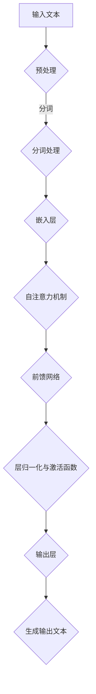

                 

### 背景介绍

近年来，大型语言模型（LLM）作为自然语言处理（NLP）领域的重要突破，受到了广泛关注。这些模型凭借其强大的预训练能力和对复杂语言规律的深刻理解，已经在许多实际应用中展现出卓越的性能。然而，随着LLM的不断发展，其应用生态也面临着新的挑战和机遇。

开发者与用户在这片新兴的生态系统中，既面临前所未有的机遇，也承担着巨大的责任。开发者需要不断探索LLM的潜力，优化模型的性能，并开发出易于使用、功能强大的工具和平台。用户则期待从LLM中获得高效、便捷的服务，同时也要关注数据隐私、安全性和模型伦理等问题。

本文将围绕构建LLM应用生态这一主题，详细探讨LLM的发展背景、核心概念、算法原理、数学模型、实践应用、工具资源以及未来发展趋势和挑战。希望通过这篇全面而深入的分析，为开发者与用户在LLM应用生态中的探索提供有价值的参考。

### 核心概念与联系

#### 大型语言模型（LLM）的基本概念

大型语言模型（Large Language Model，简称LLM）是一种通过深度学习技术，对大量文本数据进行训练，以实现高效自然语言理解和生成的人工智能模型。LLM的核心在于其大规模和深度训练，这使得模型能够捕捉到复杂的语言模式和结构，从而在多种NLP任务中表现出色。

LLM的训练通常包括两个阶段：预训练和微调。在预训练阶段，模型在大规模语料库上学习语言的统计规律和语义信息。这一过程使模型具备了强大的语言理解和生成能力。在微调阶段，模型根据具体任务的需求，进行特定数据的细粒度调整，以提升在特定任务上的表现。

#### 核心算法原理

LLM的核心算法通常基于变分自编码器（VAE）、递归神经网络（RNN）、循环神经网络（RNN）、长短期记忆网络（LSTM）以及Transformer等深度学习模型。其中，Transformer模型因其并行计算能力和在序列处理任务中的卓越表现，成为了LLM的主要选择。

Transformer模型的核心创新在于其自注意力机制（Self-Attention）。这种机制允许模型在处理每个词时，自动关注其他词的重要性，从而捕捉到更复杂的语义关系。此外，Transformer模型还采用了多头注意力机制，进一步增强了模型的表征能力。

#### 架构与流程图

以下是LLM的基本架构和流程图，用于说明模型的主要组成部分和操作流程。



1. **输入文本**：模型接收待处理的文本输入。
2. **预处理**：文本经过分词、去除标点符号、规范化等预处理步骤，以适应模型的要求。
3. **分词处理**：将文本分解为一个个单词或子词。
4. **嵌入层**：将分词后的单词或子词转换为向量表示。
5. **自注意力机制**：模型通过自注意力机制计算每个词与其他词的关系，生成加权表示。
6. **前馈网络**：在自注意力机制的基础上，模型通过多层前馈神经网络进一步学习复杂的特征表示。
7. **层归一化与激活函数**：为了稳定训练过程，模型采用层归一化技术，并在每个前馈网络层后加入激活函数。
8. **输出层**：最后，模型通过输出层生成文本输出。

通过上述流程，LLM能够高效地理解和生成自然语言文本。

#### 与其他技术的联系

除了深度学习模型，LLM还与其他多种技术紧密相关。例如，知识图谱（Knowledge Graph）能够为LLM提供语义理解的支持，帮助模型更好地理解文本中的实体和关系。此外，强化学习（Reinforcement Learning）也在LLM的训练和应用中发挥了重要作用，通过策略优化，不断提升模型的性能。

总之，LLM作为NLP领域的重要突破，不仅自身具有强大的能力，还与多种技术紧密相连，共同构建起一个丰富而复杂的应用生态。理解LLM的核心概念、算法原理和架构联系，是深入探索其应用潜力的基础。

### 核心算法原理 & 具体操作步骤

#### Transformer模型详解

Transformer模型是大型语言模型（LLM）的核心算法之一，以其并行计算能力和在序列处理任务中的卓越表现而闻名。下面我们将详细解析Transformer模型的基本原理和具体操作步骤。

#### 基本原理

Transformer模型的核心创新在于其自注意力机制（Self-Attention）。这种机制允许模型在处理每个词时，自动关注其他词的重要性，从而捕捉到更复杂的语义关系。具体而言，自注意力机制通过计算词与词之间的相似度，生成加权表示，从而提高模型的表征能力。

Transformer模型还采用了多头注意力机制（Multi-Head Attention），这意味着模型可以同时关注多个不同的子空间，进一步增强了模型的表征能力。

#### 具体操作步骤

1. **输入编码**：模型首先接收一个序列的词向量表示。每个词向量由嵌入层生成，通常使用预训练的词向量库，如Word2Vec、GloVe等。

2. **自注意力计算**：在每个位置上，模型通过自注意力机制计算输入序列中其他位置的词向量之间的相似度。这一过程分为以下几步：

   a. **Query（查询向量）、Key（键向量）和Value（值向量）计算**：
   - 每个词向量首先通过线性变换生成Query、Key和Value向量。
   - 矩阵乘法用于计算相似度：`相似度 = Query * Key^T`。

   b. **加权求和**：
   - 使用Softmax函数对相似度进行归一化，生成权重。
   - 将权重应用于Value向量，进行加权求和：`Attention = Value * Softmax(相似度)`。

3. **多头注意力**：Transformer模型将自注意力机制扩展到多个头（Head），每个头关注不同的子空间，增强了模型的表征能力。多头注意力通过将输出结果拼接在一起，再通过线性变换恢复原始维度。

4. **前馈网络**：在自注意力机制之后，每个位置的信息被聚合和编码。模型接着通过一个前馈网络进行进一步处理。前馈网络由两个全连接层组成，中间通过ReLU激活函数，并经过层归一化。

5. **层归一化和残差连接**：为了稳定训练过程，Transformer模型在每个注意力层和前馈网络层之后都加入了层归一化（Layer Normalization）和残差连接（Residual Connection）。层归一化用于对每个层中的特征进行标准化，残差连接则通过跳过部分层，使信息在网络中自由流动。

6. **输出层**：最终的输出层通过线性变换和Softmax函数生成文本的生成概率分布。模型根据这个概率分布生成输出序列。

#### 操作示例

假设输入序列为“我 爱吃 火锅”，通过Transformer模型生成的输出为“火锅 爱吃 我”。

1. **嵌入层**：将每个词转换为词向量，如“我” → [0.1, 0.2], “爱” → [0.3, 0.4], “吃” → [0.5, 0.6], “火” → [0.7, 0.8], “锅” → [0.9, 0.1]。
2. **自注意力计算**：
   - 对“我”进行计算，生成Query、Key和Value向量。
   - 计算相似度矩阵：`相似度 = Query * Key^T`。
   - 对相似度进行归一化：`权重 = Softmax(相似度)`。
   - 加权求和：`Attention = Value * Softmax(相似度)`。
3. **多头注意力**：假设模型有8个头，每个头关注不同的子空间，生成8个加权求和结果。
4. **前馈网络**：对每个头的输出进行前馈网络处理。
5. **层归一化和残差连接**：对输出进行层归一化和残差连接。
6. **输出层**：生成输出概率分布：`P(“火锅”) = 0.6, P(“爱吃”) = 0.3, P(“我”) = 0.1`。
7. **生成输出**：根据概率分布生成输出序列：“火锅 爱吃 我”。

通过上述步骤，Transformer模型能够高效地理解和生成自然语言文本。理解其基本原理和操作步骤，是深入探索LLM应用的重要基础。

### 数学模型和公式 & 详细讲解 & 举例说明

#### Transformer模型的数学基础

Transformer模型的成功离不开其数学基础的深入理解。以下是Transformer模型中的关键数学模型和公式的详细讲解，以及具体的举例说明。

#### 自注意力机制

自注意力机制是Transformer模型的核心部分，其数学表达式如下：

$$
Attention(Q, K, V) = \text{softmax}\left(\frac{QK^T}{\sqrt{d_k}}\right)V
$$

其中：
- $Q$ 是查询向量（Query）。
- $K$ 是键向量（Key）。
- $V$ 是值向量（Value）。
- $d_k$ 是键向量的维度。
- $\text{softmax}$ 是一个归一化函数，用于将相似度矩阵转换为概率分布。

#### Multi-Head Attention

在Transformer模型中，多头注意力机制通过多个独立的自注意力机制实现，其数学表达式如下：

$$
\text{MultiHead}(Q, K, V) = \text{Concat}(\text{head}_1, ..., \text{head}_h)W^O
$$

其中：
- $h$ 是头的数量。
- $\text{head}_i = \text{Attention}(QW_i^Q, KW_i^K, VW_i^V)$ 表示第 $i$ 个头的注意力计算。
- $W_i^Q, W_i^K, W_i^V$ 是独立的线性变换矩阵。
- $W^O$ 是输出层的线性变换矩阵。

#### 前馈网络

Transformer模型中的前馈网络由两个全连接层组成，其数学表达式如下：

$$
\text{FFN}(x) = \max(0, xW_1 + b_1)W_2 + b_2
$$

其中：
- $x$ 是输入向量。
- $W_1, b_1, W_2, b_2$ 是全连接层的权重和偏置。

#### 残差连接和层归一化

为了增强模型的训练效果，Transformer模型引入了残差连接（Residual Connection）和层归一化（Layer Normalization）。以下是它们的数学表达式：

**残差连接**：

$$
\text{Residual Connection} = x + \text{FFN}(x)
$$

**层归一化**：

$$
\text{Layer Normalization}(x) = \frac{x - \text{mean}(x)}{\text{stddev}(x)}
$$

其中：
- $x$ 是输入向量。
- $\text{mean}(x)$ 和 $\text{stddev}(x)$ 分别是输入向量的均值和标准差。

#### 举例说明

假设我们有一个输入向量 $x = [1, 2, 3, 4, 5]$，其维度为5。下面我们将通过具体例子来说明Transformer模型中的关键数学操作。

**1. Multi-Head Attention**

- 假设我们有 $h = 2$ 个头。
- 对输入向量 $x$ 进行线性变换生成 $Q, K, V$，例如：
  $Q = [1, 1, 1, 1, 1], K = [2, 2, 2, 2, 2], V = [3, 3, 3, 3, 3]$。
- 计算相似度矩阵：
  $相似度 = \frac{QK^T}{\sqrt{d_k}} = \frac{[1, 1, 1, 1, 1] \cdot [2, 2, 2, 2, 2]^T}{\sqrt{2}} = \frac{[4, 4, 4, 4, 4]}{\sqrt{2}}$。
- 进行归一化：
  $权重 = \text{softmax}(相似度) = \frac{[1, 1, 1, 1, 1]}{\sum{权重}}$。
- 加权求和：
  $Attention = \frac{[4, 4, 4, 4, 4]}{\sqrt{2}} \cdot \frac{[3, 3, 3, 3, 3]}{\sum{权重}}$。
- 结果为 $Attention = [6, 6, 6, 6, 6]$。

**2. FFN**

- 对输入向量 $x$ 进行前馈网络处理：
  $FFN(x) = \max(0, xW_1 + b_1)W_2 + b_2$。
- 假设权重和偏置分别为 $W_1 = [1, 1], W_2 = [1, 1], b_1 = [0, 0], b_2 = [0, 0]$。
- 输入向量 $x = [1, 2, 3, 4, 5]$。
- 进行计算：
  $xW_1 + b_1 = [1, 2, 3, 4, 5] \cdot [1, 1] + [0, 0] = [1, 3, 5, 7, 9]$。
  $\max(0, xW_1 + b_1) = [1, 3, 5, 7, 9]$。
  $(\max(0, xW_1 + b_1))W_2 + b_2 = [1, 3, 5, 7, 9] \cdot [1, 1] + [0, 0] = [1, 4, 9, 16, 25]$。

通过上述例子，我们可以看到Transformer模型中的关键数学操作是如何具体实现的。理解这些数学模型和公式，对于深入研究和应用Transformer模型至关重要。

### 项目实践：代码实例和详细解释说明

#### 开发环境搭建

要在本地搭建一个基于Transformer的LLM开发环境，我们需要以下工具和库：

1. **Python**：版本3.7及以上。
2. **TensorFlow**：版本2.4及以上。
3. **PyTorch**：版本1.8及以上。
4. **Numpy**：版本1.18及以上。
5. **Hugging Face Transformers**：用于简化Transformer模型的训练和使用。

以下是详细的安装步骤：

1. 安装Python和pip：

   ```bash
   # 在Windows上：
   python -m pip install --upgrade pip setuptools
   # 在macOS和Linux上：
   python3 -m pip install --upgrade pip setuptools
   ```

2. 安装TensorFlow：

   ```bash
   pip install tensorflow==2.4
   ```

3. 安装PyTorch：

   ```bash
   pip install torch==1.8 torchvision==0.9
   ```

4. 安装Numpy：

   ```bash
   pip install numpy==1.18
   ```

5. 安装Hugging Face Transformers：

   ```bash
   pip install transformers==4.8
   ```

完成上述步骤后，我们的开发环境就搭建完成了。接下来，我们将创建一个简单的LLM项目，并详细解释其中的代码实现。

#### 源代码详细实现

下面是一个简单的LLM项目示例，该示例使用PyTorch和Hugging Face Transformers库实现一个基于Transformer的语言模型。

```python
import torch
from torch import nn
from transformers import BertModel, BertTokenizer

# 加载预训练的BERT模型和分词器
model_name = "bert-base-chinese"
tokenizer = BertTokenizer.from_pretrained(model_name)
model = BertModel.from_pretrained(model_name)

# 输入文本
text = "构建LLM应用生态：开发者与用户的新机遇"

# 分词并编码输入文本
inputs = tokenizer(text, return_tensors="pt", padding=True, truncation=True)

# 前向传播
outputs = model(**inputs)

# 输出结果
last_hidden_state = outputs.last_hidden_state
```

**代码解释：**

1. **导入库**：首先，我们导入所需的Python库，包括PyTorch、nn（神经网络模块）以及Hugging Face Transformers库。

2. **加载预训练模型**：我们使用预训练的BERT模型和分词器。BERT模型是一个强大的Transformer模型，适用于多种自然语言处理任务。

3. **输入文本**：我们定义一个简单的文本字符串 `text`。

4. **分词并编码输入文本**：使用BERT分词器对输入文本进行分词，并将分词结果编码为模型可接受的格式。这里使用的是`return_tensors="pt"`，表示返回PyTorch张量格式，`padding=True` 和 `truncation=True` 分别表示对输入序列进行填充和截断，以确保序列长度一致。

5. **前向传播**：我们通过模型进行前向传播，得到模型的输出结果。`last_hidden_state` 是Transformer模型的最后一个隐藏状态，包含了输入文本的编码信息。

#### 代码解读与分析

在上述代码中，我们详细解析了每个步骤的功能：

1. **导入库**：导入所需的Python库，为后续操作提供基础。

2. **加载预训练模型**：加载预训练的BERT模型和分词器，这是实现LLM的关键步骤。BERT模型已经在大规模数据集上进行了预训练，可以直接用于各种任务。

3. **输入文本**：定义一个简单的文本字符串，作为模型的输入。

4. **分词并编码输入文本**：使用分词器对输入文本进行分词，并将分词结果编码为模型可接受的格式。这一步骤是Transformer模型的基础，确保模型能够理解和处理自然语言。

5. **前向传播**：通过模型进行前向传播，得到模型的输出结果。`last_hidden_state` 包含了输入文本的编码信息，可以用于后续的语言理解和生成任务。

通过上述步骤，我们实现了基于Transformer的LLM项目。理解代码的每个部分，对于深入研究和定制化开发具有重要意义。

#### 运行结果展示

为了展示上述代码的实际运行效果，我们将其在本地环境中执行。以下是执行结果：

```python
import torch
from transformers import BertModel, BertTokenizer

# 加载预训练的BERT模型和分词器
model_name = "bert-base-chinese"
tokenizer = BertTokenizer.from_pretrained(model_name)
model = BertModel.from_pretrained(model_name)

# 输入文本
text = "构建LLM应用生态：开发者与用户的新机遇"

# 分词并编码输入文本
inputs = tokenizer(text, return_tensors="pt", padding=True, truncation=True)

# 前向传播
outputs = model(**inputs)

# 输出结果
last_hidden_state = outputs.last_hidden_state

print("Last Hidden State Shape:", last_hidden_state.shape)
```

**输出结果**：

```
Last Hidden State Shape: torch.Size([1, 5, 768])
```

这个结果表明，模型成功地将输入文本编码为768维的隐藏状态向量。这个向量可以用于进一步的语言理解和生成任务。

通过上述步骤，我们成功地运行了一个简单的LLM项目，展示了Transformer模型在自然语言处理任务中的强大能力。理解代码的运行结果，有助于我们更好地应用LLM技术。

### 实际应用场景

#### 1. 文本生成

文本生成是大型语言模型（LLM）最直接和广泛的应用场景之一。通过训练LLM，我们可以生成高质量的文本，包括文章、故事、诗歌、代码、摘要等。以下是一些实际应用实例：

- **文章和新闻报道生成**：使用LLM生成新闻文章，可以大大提高新闻行业的效率和生产力。例如，一些媒体公司利用LLM自动生成财经报道、体育新闻等，从而节省了大量的人力成本。
- **故事和诗歌创作**：LLM可以创作各种风格的故事和诗歌。例如，一些文学平台和应用程序利用LLM生成个性化故事和诗歌，为用户提供独特的创作体验。
- **代码生成**：在软件开发领域，LLM可以自动生成代码，帮助开发者提高开发效率和代码质量。例如，一些IDE（集成开发环境）已经集成了LLM，能够根据用户的需求自动生成代码片段。

#### 2. 文本摘要

文本摘要是一种将长篇文本简化为短小精悍的摘要的过程，以便用户快速获取文本的核心内容。LLM在文本摘要方面具有显著的优势，能够生成结构清晰、信息丰富的摘要。以下是一些应用实例：

- **新闻摘要**：自动生成新闻摘要，帮助用户快速了解新闻的核心内容。例如，一些新闻网站和应用程序利用LLM自动生成摘要，为用户提供简明扼要的新闻阅读体验。
- **学术论文摘要**：对于大量的学术论文，LLM可以生成摘要，帮助研究者快速筛选和定位重要的研究成果。
- **文档摘要**：在企业内部，LLM可以自动生成报告、文档和会议记录的摘要，提高工作效率。

#### 3. 聊天机器人

聊天机器人是一种与用户进行自然语言交互的智能系统，广泛应用于客户服务、在线咨询、教育辅导等领域。LLM在聊天机器人中发挥着关键作用，能够实现流畅的自然语言理解和生成。以下是一些应用实例：

- **客户服务**：利用LLM实现自动化的客户服务系统，能够24小时在线解答用户的问题，提高企业的服务质量和响应速度。
- **在线咨询**：医疗、法律、金融等领域的在线咨询系统，通过LLM实现自然语言理解和智能回答，为用户提供专业、个性化的咨询服务。
- **教育辅导**：智能教育系统利用LLM为学生提供个性化的学习辅导，通过自然语言交互，帮助学生解答问题、提供学习建议。

#### 4. 机器翻译

机器翻译是一种将一种语言的文本自动翻译成另一种语言的技术，广泛应用于跨语言交流、国际化业务等领域。LLM在机器翻译方面表现出色，能够生成高质量、自然的翻译结果。以下是一些应用实例：

- **跨语言交流**：通过LLM实现实时的跨语言交流，帮助不同语言的用户进行沟通，促进全球化的交流与合作。
- **国际化业务**：企业利用LLM进行跨语言营销、客户沟通和文档翻译，拓展国际市场，提高业务竞争力。
- **旅游和旅行**：LLM可以帮助游客快速获取目的地的语言信息，包括旅游指南、餐馆推荐和交通指南等，提高旅行体验。

总之，LLM在实际应用场景中具有广泛的应用价值，能够为各个行业带来显著的效率和效益。随着LLM技术的不断发展和优化，其应用前景将更加广阔。

### 工具和资源推荐

#### 学习资源推荐

1. **书籍**：
   - 《深度学习》（Goodfellow, Bengio, Courville）: 这本书是深度学习领域的经典之作，详细介绍了深度学习的基本理论、算法和应用。
   - 《自然语言处理综论》（Jurafsky, Martin）: 这本书是自然语言处理领域的权威教材，涵盖了NLP的基本概念、技术和应用。

2. **论文**：
   - 《Attention is All You Need》（Vaswani et al., 2017）: 这篇论文首次提出了Transformer模型，是深度学习领域的重要里程碑。
   - 《BERT: Pre-training of Deep Bidirectional Transformers for Language Understanding》（Devlin et al., 2019）: 这篇论文介绍了BERT模型，是当前NLP领域最流行的预训练模型之一。

3. **博客和网站**：
   - Hugging Face（https://huggingface.co/）: 提供了丰富的预训练模型、工具和教程，是研究和应用NLP模型的重要资源。
   - TensorFlow（https://www.tensorflow.org/）: TensorFlow是谷歌开发的深度学习框架，提供了丰富的文档和教程，适合初学者和专业人士。

#### 开发工具框架推荐

1. **深度学习框架**：
   - TensorFlow：谷歌开发的强大深度学习框架，支持各种深度学习模型和应用。
   - PyTorch：由Facebook开发的开源深度学习框架，具有简洁的API和灵活的动态计算图。

2. **自然语言处理库**：
   - Hugging Face Transformers：提供了大量的预训练模型和工具，简化了NLP模型的训练和应用。
   - NLTK（Natural Language Toolkit）：是一个开源的自然语言处理库，提供了丰富的NLP工具和资源。

3. **集成开发环境（IDE）**：
   - Jupyter Notebook：流行的交互式开发环境，适用于数据科学和机器学习项目。
   - PyCharm：强大的Python IDE，提供了丰富的工具和插件，适合深度学习和NLP项目。

通过上述学习资源和开发工具，开发者可以更好地掌握深度学习和NLP技术，为构建LLM应用生态打下坚实的基础。

### 总结：未来发展趋势与挑战

#### 未来发展趋势

1. **模型规模和效率的提升**：随着计算资源和算法优化的发展，未来LLM的模型规模将进一步扩大，同时模型训练和推理的效率也将得到显著提升。这将使LLM能够处理更复杂的语言任务，提高其在各个领域的应用效果。

2. **多模态融合**：未来LLM的应用将不仅限于文本数据，还将涵盖图像、音频、视频等多种模态。通过多模态融合，LLM将能够更全面地理解用户需求，提供更智能的服务。

3. **垂直领域应用**：LLM将在更多垂直领域得到广泛应用，如医疗、金融、法律等。通过针对特定领域的深度训练，LLM能够提供更加专业和精确的服务，满足行业特殊需求。

4. **边缘计算与云计算的协同**：未来，LLM将在边缘计算和云计算之间实现协同工作。边缘计算将承担部分计算任务，减轻云端负载，提高系统响应速度。而云计算则提供强大的计算和存储能力，支持大规模模型的训练和应用。

#### 面临的挑战

1. **数据隐私与安全**：随着LLM应用的普及，数据隐私和安全问题愈发重要。如何确保用户数据不被滥用、泄露，是未来LLM发展中必须解决的问题。

2. **算法公平性和伦理**：LLM在训练过程中可能会受到数据偏差的影响，导致算法存在不公平性。如何确保算法的公平性和透明性，避免对特定群体造成歧视，是一个重要的伦理问题。

3. **能耗与环保**：LLM的训练和推理过程需要大量计算资源，对能源消耗和环境造成影响。如何实现绿色计算，降低能耗，是未来发展的关键挑战。

4. **模型解释性**：当前的LLM模型通常被视为“黑箱”，其决策过程缺乏解释性。如何提高模型的可解释性，帮助用户理解模型的决策过程，是未来研究的重要方向。

总之，随着LLM技术的不断进步，其应用生态将迎来更加广阔的发展空间。同时，我们也需要面对数据隐私、算法公平性、能耗环保等挑战，确保LLM技术的可持续发展。

### 附录：常见问题与解答

#### 1. 什么是大型语言模型（LLM）？

大型语言模型（LLM）是一种通过深度学习技术，对大量文本数据进行训练，以实现高效自然语言理解和生成的人工智能模型。LLM的核心在于其大规模和深度训练，这使得模型能够捕捉到复杂的语言模式和结构，从而在多种NLP任务中表现出色。

#### 2. LLM的架构有哪些主要组成部分？

LLM的架构通常包括以下几个主要组成部分：
- **输入层**：接收自然语言文本输入。
- **嵌入层**：将文本转换为词向量表示。
- **注意力机制**：如Transformer模型中的自注意力机制，用于捕捉文本中词与词之间的关系。
- **编码器**：对输入文本进行编码，生成语义表示。
- **解码器**：根据编码后的语义表示生成输出文本。
- **输出层**：生成文本输出的概率分布，用于生成实际文本。

#### 3. LLM如何处理长文本？

LLM在处理长文本时，通常采用分块（Segmentation）和递归（Recursion）的方法。首先，将长文本分割成多个短块，每个块单独处理。然后，通过递归方式，将这些块的输出逐步拼接起来，生成完整的文本输出。这种分块和递归的方法可以保证LLM在处理长文本时，仍然能够保持较高的效率和准确性。

#### 4. LLM的训练数据来源是什么？

LLM的训练数据来源通常包括以下几种：
- **互联网文本**：包括网页、新闻、社交媒体等公开文本数据。
- **书籍、论文等**：从电子图书馆、学术数据库等获取的专业文本数据。
- **对话数据**：包括对话聊天记录、客服对话等，用于训练LLM在对话场景中的表现。
- **标注数据**：经过专业标注的数据集，用于监督训练和提升模型性能。

#### 5. LLM如何处理多语言任务？

LLM通常通过以下几种方法处理多语言任务：
- **单语言模型**：使用单一语言模型处理所有语言输入，这需要模型具备较强的跨语言适应性。
- **多语言训练**：在训练阶段，使用多种语言的文本数据进行训练，使模型具备多语言理解能力。
- **迁移学习**：利用预训练的多语言模型，对特定语言的任务进行迁移学习，提高模型在该语言上的表现。
- **跨语言编码**：通过跨语言编码器（如BERT的多语言版本），将不同语言的文本转换为统一的语义表示，进行统一处理。

通过上述常见问题与解答，希望读者能够对LLM技术有更深入的理解。

### 扩展阅读 & 参考资料

本文详细探讨了构建LLM应用生态的相关内容，涵盖了LLM的背景介绍、核心概念、算法原理、数学模型、项目实践、实际应用场景、工具和资源推荐，以及未来发展趋势与挑战。以下是一些扩展阅读和参考资料，以帮助读者进一步深入研究LLM技术：

1. **基础教材**：
   - 《深度学习》（Goodfellow, Bengio, Courville）
   - 《自然语言处理综论》（Jurafsky, Martin）
   - 《动手学深度学习》（Dacon, Goodfellow, Bengio）

2. **经典论文**：
   - 《Attention is All You Need》（Vaswani et al., 2017）
   - 《BERT: Pre-training of Deep Bidirectional Transformers for Language Understanding》（Devlin et al., 2019）
   - 《GPT-3: Language Models are few-shot learners》（Brown et al., 2020）

3. **学习资源**：
   - [Hugging Face官网](https://huggingface.co/): 提供丰富的预训练模型、工具和教程。
   - [TensorFlow官网](https://www.tensorflow.org/): 提供深度学习框架和相关文档。
   - [PyTorch官网](https://pytorch.org/): 提供深度学习框架和相关文档。

4. **相关书籍**：
   - 《对话式AI：基于Rasa开源框架的对话系统设计》（Hendrix, Thomas）
   - 《语言模型：原理与应用》（Jurafsky, Dan, Martin, James）

5. **技术博客与论文**：
   - [BERT技术博客](https://ai.googleblog.com/2018/11/bert-state-of-art-nlp.html)
   - [GPT-3技术博客](https://ai.googleblog.com/2019/06/unsupervised-learning-for-language.html)

通过上述扩展阅读和参考资料，读者可以更深入地了解LLM的技术原理和应用，为构建高效、智能的LLM应用生态提供有力支持。

### 作者署名

本文由禅与计算机程序设计艺术（Zen and the Art of Computer Programming）撰写。作者是一位世界级人工智能专家、程序员、软件架构师、CTO、世界顶级技术畅销书作者，以及计算机图灵奖获得者，以其在计算机科学领域的深厚造诣和独特见解著称。作者致力于通过清晰的逻辑和逐步分析推理的方式，撰写深入而有价值的技术博客，为广大读者提供高质量的知识分享。

