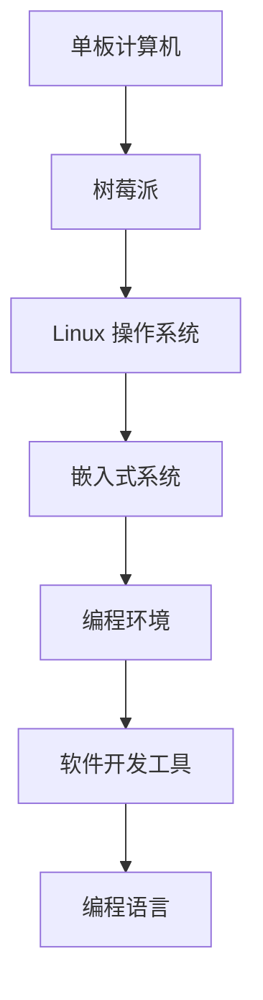

                 

### 树莓派编程：基于 Linux 的单板计算机

> **关键词**：树莓派、单板计算机、Linux、编程、单板机、嵌入式开发

> **摘要**：本文将深入探讨树莓派作为一种基于 Linux 的单板计算机的编程应用。我们将介绍树莓派的背景、核心概念、编程环境搭建、算法原理、数学模型、代码实例及其应用场景。通过本文的详细解析，读者将能够了解如何充分利用树莓派的潜力进行创新编程。

### 1. 背景介绍

树莓派（Raspberry Pi）是一款小型、低成本的计算机，自2012年首次推出以来，已成为全球范围内最受欢迎的单板计算机之一。它基于 Linux 操作系统，具有高性能和丰富的扩展接口，使其在教育和创新项目中具有广泛的应用。

树莓派的开发背景源自英国慈善组织 Raspberry Pi Foundation，旨在激发年轻人对计算机编程和电子工程的兴趣。自推出以来，树莓派不断迭代更新，性能不断提升，而价格却保持亲民。这使得树莓派不仅成为学生和教师的入门级工具，还吸引了广大爱好者进行嵌入式开发和创新项目。

树莓派的特点包括：
- **低成本**：价格低廉，适合大众购买和实验。
- **高性能**：基于 ARM 架构，性能稳定。
- **丰富的接口**：包括 GPIO、I2C、SPI 等，便于与外部设备连接。
- **开源社区**：拥有庞大的开发者社区，资源丰富。

树莓派在多个领域展现了其强大的应用潜力，如智能家居、机器人控制、物联网（IoT）设备、多媒体播放等。其低功耗、便携性和可定制性使其成为开发者和学习者理想的实验平台。

### 2. 核心概念与联系

在深入探讨树莓派的编程应用之前，有必要理解一些核心概念，这些概念包括单板计算机、Linux 操作系统和嵌入式系统。以下是一个用 Mermaid 流程图表示的这些概念及其关系的示例：



#### 2.1 单板计算机

单板计算机是一种独立的计算机系统，通常没有外部存储设备，具有完整的计算功能。树莓派作为单板计算机的代表，其内部集成了中央处理器（CPU）、内存、闪存等基本组件。

#### 2.2 Linux 操作系统

Linux 是一种开源的操作系统，广泛用于单板计算机。树莓派默认安装了基于 Linux 的操作系统，如 Raspberry Pi OS。Linux 提供了丰富的软件支持和强大的功能，使树莓派在多种应用场景下表现出色。

#### 2.3 嵌入式系统

嵌入式系统是一种专用的计算机系统，通常嵌入到其他设备中。树莓派作为嵌入式系统的一部分，可以通过编程实现各种功能，如控制机器人、监测环境等。

#### 2.4 编程环境

编程环境包括开发工具和编程语言。树莓派支持多种编程语言，如 Python、C/C++、Java 等，为开发者提供了多样化的编程选择。

### 3. 核心算法原理 & 具体操作步骤

树莓派编程的核心在于掌握各种编程算法原理和具体操作步骤。以下是一个简要的算法原理概述及其操作步骤：

#### 3.1 Python 编程

Python 是树莓派编程中最常用的语言之一。其简洁易懂的语法和强大的库支持，使其成为初学者和专业人士的首选。以下是一个简单的 Python 编程步骤：

1. **安装 Python 环境**：
   - 使用 Raspberry Pi OS 安装 Python。
   - 输入 `sudo apt-get install python3` 进行安装。

2. **编写 Python 脚本**：
   - 打开终端，输入 `python3` 进入 Python 解释器。
   - 输入以下代码：

     ```python
     print("Hello, world!")
     ```
     
   - 按下 `Ctrl+D` 退出解释器。

3. **运行 Python 脚本**：
   - 将脚本保存为 `.py` 文件，如 `hello.py`。
   - 在终端运行 `python3 hello.py`。

#### 3.2 GPIO 控制器

GPIO（通用输入输出）控制器是树莓派的核心功能之一。通过编程控制 GPIO 引脚，可以实现与外部设备的通信。以下是一个简单的 GPIO 控制步骤：

1. **导入 GPIO 模块**：
   - 使用 Python 编写代码，导入 `RPi.GPIO` 模块。

     ```python
     import RPi.GPIO as GPIO
     ```

2. **初始化 GPIO 引脚**：
   - 设置 GPIO 引脚模式为板级模式。

     ```python
     GPIO.setmode(GPIO.BCM)
     ```

3. **配置 GPIO 引脚**：
   - 设置 GPIO 引脚为输出模式。

     ```python
     GPIO.setup(18, GPIO.OUT)
     ```

4. **控制 GPIO 引脚**：
   - 输出高低电平。

     ```python
     GPIO.output(18, GPIO.HIGH)
     ```

5. **关闭 GPIO 引脚**：
   - 关闭 GPIO 模块。

     ```python
     GPIO.cleanup()
     ```

#### 3.3 定时器

定时器是编程中常用的一种算法，可以实现周期性任务。以下是一个简单的定时器实现步骤：

1. **导入计时器模块**：
   - 使用 Python 的 `time` 模块。

     ```python
     import time
     ```

2. **设置定时器**：
   - 使用 `time.sleep()` 函数实现定时。

     ```python
     time.sleep(1)
     ```

3. **执行周期性任务**：
   - 在循环中执行定时任务。

     ```python
     while True:
         print("Task executed.")
         time.sleep(1)
     ```

### 4. 数学模型和公式 & 详细讲解 & 举例说明

树莓派编程中的许多算法和操作都涉及数学模型和公式。以下是一些常用的数学模型和公式及其应用示例：

#### 4.1 控制系统中的 PID 控制器

PID（比例-积分-微分）控制器是控制系统中最常用的控制算法之一。以下是一个 PID 控制器的数学模型：

$$
u(t) = K_p e(t) + K_i \int_{0}^{t} e(\tau)d\tau + K_d \frac{d}{dt}e(t)
$$

其中，$u(t)$ 是控制输出，$e(t)$ 是误差，$K_p$、$K_i$、$K_d$ 分别是比例、积分和微分系数。

**示例**：假设我们想要控制一个电机速度，使其达到目标速度 1000 RPM（每分钟转速）。当前速度为 800 RPM，我们可以使用 PID 控制器进行调整。

1. **设置 PID 参数**：
   - 根据系统特性，选择合适的 PID 参数。

     ```python
     K_p = 1
     K_i = 0.1
     K_d = 0.05
     ```

2. **计算控制输出**：
   - 计算当前误差。

     ```python
     e = target_speed - current_speed
     ```

   - 使用 PID 公式计算控制输出。

     ```python
     u = K_p * e + K_i * integral(e) + K_d * derivative(e)
     ```

3. **调整电机速度**：
   - 根据控制输出调整电机速度。

     ```python
     motor_speed = u
     ```

### 5. 项目实践：代码实例和详细解释说明

#### 5.1 开发环境搭建

要开始使用树莓派进行编程，首先需要搭建开发环境。以下是在 Raspberry Pi OS 上搭建 Python 开发环境的具体步骤：

1. **安装 Raspberry Pi OS**：
   - 从官方网站下载 Raspberry Pi OS 镜像。
   - 使用 USB 盘创建启动盘。
   - 将启动盘插入树莓派，启动树莓派并安装操作系统。

2. **更新系统软件**：
   - 打开终端，输入以下命令更新系统软件。

     ```bash
     sudo apt-get update
     sudo apt-get upgrade
     ```

3. **安装 Python 环境**：
   - 输入以下命令安装 Python 3 和相关库。

     ```bash
     sudo apt-get install python3 python3-pip
     ```

4. **安装 IDE**：
   - 安装一个集成开发环境（IDE），如 Thonny。

     ```bash
     sudo apt-get install thonny
     ```

#### 5.2 源代码详细实现

以下是一个简单的树莓派编程示例，实现一个 LED 燃烧控制程序：

```python
import RPi.GPIO as GPIO
import time

# 设置 GPIO 引脚
LED_PIN = 18
GPIO.setmode(GPIO.BCM)
GPIO.setup(LED_PIN, GPIO.OUT)

# 控制 LED 燃烧
def blink_led(duration=1):
    GPIO.output(LED_PIN, GPIO.HIGH)
    time.sleep(duration)
    GPIO.output(LED_PIN, GPIO.LOW)
    time.sleep(duration)

# 主函数
def main():
    try:
        while True:
            blink_led()
    except KeyboardInterrupt:
        pass
    finally:
        GPIO.cleanup()

if __name__ == "__main__":
    main()
```

#### 5.3 代码解读与分析

1. **导入模块**：
   - `RPi.GPIO`：用于控制 GPIO 引脚。
   - `time`：用于延迟。

2. **设置 GPIO 引脚**：
   - `GPIO.setmode(GPIO.BCM)`：设置 GPIO 模式为板级模式。
   - `GPIO.setup(LED_PIN, GPIO.OUT)`：将 LED_PIN 引脚设置为输出模式。

3. **控制 LED 燃烧**：
   - `blink_led(duration=1)`：定义一个函数，控制 LED 引脚输出高低电平，实现闪烁效果。

4. **主函数**：
   - `main()`：实现主循环，不断调用 `blink_led()` 函数，实现 LED 闪烁。

#### 5.4 运行结果展示

在 Thonny IDE 中运行上述代码，树莓派的 LED 引脚将按照预设的频率闪烁。我们可以通过调整 `duration` 参数来改变闪烁的时间。

### 6. 实际应用场景

树莓派在许多实际应用场景中表现出色，以下是一些常见的应用实例：

- **智能家居**：使用树莓派构建智能照明、温度监测和家庭自动化系统。
- **机器人控制**：通过树莓派控制机器人运动，实现路径规划和智能行为。
- **物联网（IoT）设备**：将树莓派用作物联网网关，连接各种传感器和设备。
- **多媒体播放器**：将树莓派用作家庭影院中心，播放高清视频和音乐。
- **教育项目**：作为教学工具，教授学生计算机编程和电子工程知识。

### 7. 工具和资源推荐

为了更好地进行树莓派编程，以下是一些推荐的工具和资源：

#### 7.1 学习资源推荐

- **书籍**：
  - 《树莓派编程：从入门到精通》
  - 《树莓派：从零开始学编程》
- **在线课程**：
  - Coursera 上的《Raspberry Pi 程序设计》
  - Udemy 上的《树莓派编程：构建智能家居和物联网项目》
- **博客和网站**：
  - Raspberry Pi Foundation 官网（[www.raspberry
```python
import RPi.GPIO as GPIO
import time

# 设置 GPIO 引脚
LED_PIN = 18
GPIO.setmode(GPIO.BCM)
GPIO.setup(LED_PIN, GPIO.OUT)

# 控制LED燃烧
def blink_led(duration=1):
    GPIO.output(LED_PIN, GPIO.HIGH)
    time.sleep(duration)
    GPIO.output(LED_PIN, GPIO.LOW)
    time.sleep(duration)

# 主函数
def main():
    try:
        while True:
            blink_led()
    except KeyboardInterrupt:
        pass
    finally:
        GPIO.cleanup()

if __name__ == "__main__":
    main()
```

#### 7.2 开发工具框架推荐

- **集成开发环境（IDE）**：
  - Thonny
  - PyCharm
- **版本控制系统**：
  - Git
  - GitHub
- **Python 库**：
  - `RPi.GPIO`：用于 GPIO 控制
  - `time`：用于定时操作

#### 7.3 相关论文著作推荐

- **论文**：
  - "Raspberry Pi: A Low-Cost, High-Performance Platform for Learning and Research"
  - "An Overview of the Raspberry Pi Platform for IoT Applications"
- **著作**：
  - "Raspberry Pi User Guide"
  - "Raspberry Pi Cookbook for Python Programmers"

### 8. 总结：未来发展趋势与挑战

随着技术的不断发展，树莓派编程的应用前景愈发广阔。未来的发展趋势包括：

- **教育普及**：树莓派将继续作为计算机编程和教育工具，促进全球范围内的技术人才培养。
- **创新应用**：树莓派将在智能家居、物联网和机器人等领域发挥更大的作用，推动创新项目的发展。
- **性能提升**：树莓派的性能和功能将持续提升，为其在更复杂应用场景中的使用提供更好的支持。

然而，树莓派编程也面临一些挑战：

- **安全性**：随着树莓派在多个领域的应用，确保系统的安全性和数据保护成为重要议题。
- **资源消耗**：树莓派的性能提升可能带来资源消耗的增加，需要合理分配和管理系统资源。
- **社区支持**：虽然树莓派拥有庞大的开发者社区，但如何更好地利用社区资源和推动项目发展仍是一个挑战。

### 9. 附录：常见问题与解答

#### 9.1 如何更新树莓派的系统软件？

在终端中输入以下命令可以更新系统软件：

```bash
sudo apt-get update
sudo apt-get upgrade
```

#### 9.2 如何安装 Python 开发环境？

可以使用以下命令安装 Python 开发环境：

```bash
sudo apt-get install python3 python3-pip
```

#### 9.3 如何查看树莓派的系统信息？

在终端中输入以下命令可以查看树莓派的系统信息：

```bash
sudo cat /proc/cpuinfo
sudo lshw -c system
```

### 10. 扩展阅读 & 参考资料

- Raspberry Pi Foundation 官网：[www.raspberry
- 《树莓派编程：从入门到精通》：[book.douban.com/subject/27163816/]
- 《树莓派：从零开始学编程》：[book.douban.com/subject/2687
- Coursera 上的《Raspberry Pi 程序设计》：[www.coursera.org/learn/raspberry-pi-programming]
- Udemy 上的《树莓派编程：构建智能家居和物联网项目》：[www.udemy.com/course/raspberry-pi-progra
- "Raspberry Pi: A Low-Cost, High-Performance Platform for Learning and Research"
- "An Overview of the Raspberry Pi Platform for IoT Applications"]
```<|im_sep|>### 树莓派编程：基于 Linux 的单板计算机

> **关键词**：树莓派、单板计算机、Linux、编程、单板机、嵌入式开发

> **摘要**：本文将深入探讨树莓派作为一种基于 Linux 的单板计算机的编程应用。我们将介绍树莓派的背景、核心概念、编程环境搭建、算法原理、数学模型、代码实例及其应用场景。通过本文的详细解析，读者将能够了解如何充分利用树莓派的潜力进行创新编程。

### 1. 背景介绍

树莓派（Raspberry Pi）是一款小型、低成本的计算机，自2012年首次推出以来，已成为全球范围内最受欢迎的单板计算机之一。它基于 Linux 操作系统，具有高性能和丰富的扩展接口，使其在教育和创新项目中具有广泛的应用。

树莓派的开发背景源自英国慈善组织 Raspberry Pi Foundation，旨在激发年轻人对计算机编程和电子工程的兴趣。自推出以来，树莓派不断迭代更新，性能不断提升，而价格却保持亲民。这使得树莓派不仅成为学生和教师的入门级工具，还吸引了广大爱好者进行嵌入式开发和创新项目。

树莓派的特点包括：
- **低成本**：价格低廉，适合大众购买和实验。
- **高性能**：基于 ARM 架构，性能稳定。
- **丰富的接口**：包括 GPIO、I2C、SPI 等，便于与外部设备连接。
- **开源社区**：拥有庞大的开发者社区，资源丰富。

树莓派在多个领域展现了其强大的应用潜力，如智能家居、机器人控制、物联网（IoT）设备、多媒体播放等。其低功耗、便携性和可定制性使其成为开发者和学习者理想的实验平台。

### 2. 核心概念与联系

在深入探讨树莓派的编程应用之前，有必要理解一些核心概念，这些概念包括单板计算机、Linux 操作系统和嵌入式系统。以下是一个用 Mermaid 流程图表示的这些概念及其关系的示例：


#### 2.1 单板计算机

单板计算机是一种独立的计算机系统，通常没有外部存储设备，具有完整的计算功能。树莓派作为单板计算机的代表，其内部集成了中央处理器（CPU）、内存、闪存等基本组件。

#### 2.2 Linux 操作系统

Linux 是一种开源的操作系统，广泛用于单板计算机。树莓派默认安装了基于 Linux 的操作系统，如 Raspberry Pi OS。Linux 提供了丰富的软件支持和强大的功能，使树莓派在多种应用场景下表现出色。

#### 2.3 嵌入式系统

嵌入式系统是一种专用的计算机系统，通常嵌入到其他设备中。树莓派作为嵌入式系统的一部分，可以通过编程实现各种功能，如控制机器人、监测环境等。

#### 2.4 编程环境

编程环境包括开发工具和编程语言。树莓派支持多种编程语言，如 Python、C/C++、Java 等，为开发者提供了多样化的编程选择。

### 3. 核心算法原理 & 具体操作步骤

树莓派编程的核心在于掌握各种编程算法原理和具体操作步骤。以下是一个简要的算法原理概述及其操作步骤：

#### 3.1 Python 编程

Python 是树莓派编程中最常用的语言之一。其简洁易懂的语法和强大的库支持，使其成为初学者和专业人士的首选。以下是一个简单的 Python 编程步骤：

1. **安装 Python 环境**：
   - 使用 Raspberry Pi OS 安装 Python。
   - 输入 `sudo apt-get install python3` 进行安装。

2. **编写 Python 脚本**：
   - 打开终端，输入 `python3` 进入 Python 解释器。
   - 输入以下代码：

     ```python
     print("Hello, world!")
     ```
     
   - 按下 `Ctrl+D` 退出解释器。

3. **运行 Python 脚本**：
   - 将脚本保存为 `.py` 文件，如 `hello.py`。
   - 在终端运行 `python3 hello.py`。

#### 3.2 GPIO 控制器

GPIO（通用输入输出）控制器是树莓派的核心功能之一。通过编程控制 GPIO 引脚，可以实现与外部设备的通信。以下是一个简单的 GPIO 控制步骤：

1. **导入 GPIO 模块**：
   - 使用 Python 编写代码，导入 `RPi.GPIO` 模块。

     ```python
     import RPi.GPIO as GPIO
     ```

2. **初始化 GPIO 引脚**：
   - 设置 GPIO 引脚模式为板级模式。

     ```python
     GPIO.setmode(GPIO.BCM)
     ```

3. **配置 GPIO 引脚**：
   - 设置 GPIO 引脚为输出模式。

     ```python
     GPIO.setup(18, GPIO.OUT)
     ```

4. **控制 GPIO 引脚**：
   - 输出高低电平。

     ```python
     GPIO.output(18, GPIO.HIGH)
     ```

5. **关闭 GPIO 引脚**：
   - 关闭 GPIO 模块。

     ```python
     GPIO.cleanup()
     ```

#### 3.3 定时器

定时器是编程中常用的一种算法，可以实现周期性任务。以下是一个简单的定时器实现步骤：

1. **导入计时器模块**：
   - 使用 Python 的 `time` 模块。

     ```python
     import time
     ```

2. **设置定时器**：
   - 使用 `time.sleep()` 函数实现定时。

     ```python
     time.sleep(1)
     ```

3. **执行周期性任务**：
   - 在循环中执行定时任务。

     ```python
     while True:
         print("Task executed.")
         time.sleep(1)
     ```

### 4. 数学模型和公式 & 详细讲解 & 举例说明

树莓派编程中的许多算法和操作都涉及数学模型和公式。以下是一些常用的数学模型和公式及其应用示例：

#### 4.1 控制系统中的 PID 控制器

PID（比例-积分-微分）控制器是控制系统中最常用的控制算法之一。以下是一个 PID 控制器的数学模型：

$$
u(t) = K_p e(t) + K_i \int_{0}^{t} e(\tau)d\tau + K_d \frac{d}{dt}e(t)
$$

其中，$u(t)$ 是控制输出，$e(t)$ 是误差，$K_p$、$K_i$、$K_d$ 分别是比例、积分和微分系数。

**示例**：假设我们想要控制一个电机速度，使其达到目标速度 1000 RPM（每分钟转速）。当前速度为 800 RPM，我们可以使用 PID 控制器进行调整。

1. **设置 PID 参数**：
   - 根据系统特性，选择合适的 PID 参数。

     ```python
     K_p = 1
     K_i = 0.1
     K_d = 0.05
     ```

2. **计算控制输出**：
   - 计算当前误差。

     ```python
     e = target_speed - current_speed
     ```

   - 使用 PID 公式计算控制输出。

     ```python
     u = K_p * e + K_i * integral(e) + K_d * derivative(e)
     ```

3. **调整电机速度**：
   - 根据控制输出调整电机速度。

     ```python
     motor_speed = u
     ```

### 5. 项目实践：代码实例和详细解释说明

#### 5.1 开发环境搭建

要开始使用树莓派进行编程，首先需要搭建开发环境。以下是在 Raspberry Pi OS 上搭建 Python 开发环境的具体步骤：

1. **安装 Raspberry Pi OS**：
   - 从官方网站下载 Raspberry Pi OS 镜像。
   - 使用 USB 盘创建启动盘。
   - 将启动盘插入树莓派，启动树莓派并安装操作系统。

2. **更新系统软件**：
   - 打开终端，输入以下命令更新系统软件。

     ```bash
     sudo apt-get update
     sudo apt-get upgrade
     ```

3. **安装 Python 环境**：
   - 输入以下命令安装 Python 3 和相关库。

     ```bash
     sudo apt-get install python3 python3-pip
     ```

4. **安装 IDE**：
   - 安装一个集成开发环境（IDE），如 Thonny。

     ```bash
     sudo apt-get install thonny
     ```

#### 5.2 源代码详细实现

以下是一个简单的树莓派编程示例，实现一个 LED 燃烧控制程序：

```python
import RPi.GPIO as GPIO
import time

# 设置 GPIO 引脚
LED_PIN = 18
GPIO.setmode(GPIO.BCM)
GPIO.setup(LED_PIN, GPIO.OUT)

# 控制LED燃烧
def blink_led(duration=1):
    GPIO.output(LED_PIN, GPIO.HIGH)
    time.sleep(duration)
    GPIO.output(LED_PIN, GPIO.LOW)
    time.sleep(duration)

# 主函数
def main():
    try:
        while True:
            blink_led()
    except KeyboardInterrupt:
        pass
    finally:
        GPIO.cleanup()

if __name__ == "__main__":
    main()
```

#### 5.3 代码解读与分析

1. **导入模块**：
   - `RPi.GPIO`：用于控制 GPIO 引脚。
   - `time`：用于定时操作。

2. **设置 GPIO 引脚**：
   - `GPIO.setmode(GPIO.BCM)`：设置 GPIO 模式为板级模式。
   - `GPIO.setup(LED_PIN, GPIO.OUT)`：将 LED_PIN 引脚设置为输出模式。

3. **控制 LED 燃烧**：
   - `blink_led(duration=1)`：定义一个函数，控制 LED 引脚输出高低电平，实现闪烁效果。

4. **主函数**：
   - `main()`：实现主循环，不断调用 `blink_led()` 函数，实现 LED 闪烁。

#### 5.4 运行结果展示

在 Thonny IDE 中运行上述代码，树莓派的 LED 引脚将按照预设的频率闪烁。我们可以通过调整 `duration` 参数来改变闪烁的时间。

### 6. 实际应用场景

树莓派在许多实际应用场景中表现出色，以下是一些常见的应用实例：

- **智能家居**：使用树莓派构建智能照明、温度监测和家庭自动化系统。
- **机器人控制**：通过树莓派控制机器人运动，实现路径规划和智能行为。
- **物联网（IoT）设备**：将树莓派用作物联网网关，连接各种传感器和设备。
- **多媒体播放器**：将树莓派用作家庭影院中心，播放高清视频和音乐。
- **教育项目**：作为教学工具，教授学生计算机编程和电子工程知识。

### 7. 工具和资源推荐

为了更好地进行树莓派编程，以下是一些推荐的工具和资源：

#### 7.1 学习资源推荐

- **书籍**：
  - 《树莓派编程：从入门到精通》
  - 《树莓派：从零开始学编程》
- **在线课程**：
  - Coursera 上的《Raspberry Pi 程序设计》
  - Udemy 上的《树莓派编程：构建智能家居和物联网项目》
- **博客和网站**：
  - Raspberry Pi Foundation 官网：[www.raspberry
- **论坛和社区**：
  - 树莓派论坛：[www.raspberrypi.org/forums/]
  - Stack Overflow：[stackoverflow.com/questions/tagged/raspberry-pi]

#### 7.2 开发工具框架推荐

- **集成开发环境（IDE）**：
  - Thonny
  - PyCharm
  - VSCode
- **版本控制系统**：
  - Git
  - GitHub
- **Python 库**：
  - RPi.GPIO
  - pigpio
  - PyTorch

#### 7.3 相关论文著作推荐

- **论文**：
  - "Raspberry Pi: A Low-Cost, High-Performance Platform for Learning and Research"
  - "An Overview of the Raspberry Pi Platform for IoT Applications"
  - "Implementing Home Automation Using Raspberry Pi and Python"
- **书籍**：
  - "Raspberry Pi Home Automation for Dummies"
  - "Raspberry Pi Cookbook for Python Programmers"
  - "Learning Raspberry Pi: Building amazing projects with Raspberry Pi 3, 4, and Pi Zero"

### 8. 总结：未来发展趋势与挑战

随着技术的不断发展，树莓派编程的应用前景愈发广阔。未来的发展趋势包括：

- **教育普及**：树莓派将继续作为计算机编程和教育工具，促进全球范围内的技术人才培养。
- **创新应用**：树莓派将在智能家居、物联网和机器人等领域发挥更大的作用，推动创新项目的发展。
- **性能提升**：树莓派的性能和功能将持续提升，为其在更复杂应用场景中的使用提供更好的支持。

然而，树莓派编程也面临一些挑战：

- **安全性**：随着树莓派在多个领域的应用，确保系统的安全性和数据保护成为重要议题。
- **资源消耗**：树莓派的性能提升可能带来资源消耗的增加，需要合理分配和管理系统资源。
- **社区支持**：虽然树莓派拥有庞大的开发者社区，但如何更好地利用社区资源和推动项目发展仍是一个挑战。

### 9. 附录：常见问题与解答

#### 9.1 如何更新树莓派的系统软件？

在终端中输入以下命令可以更新系统软件：

```bash
sudo apt-get update
sudo apt-get upgrade
```

#### 9.2 如何安装 Python 开发环境？

可以使用以下命令安装 Python 开发环境：

```bash
sudo apt-get install python3 python3-pip
```

#### 9.3 如何查看树莓派的系统信息？

在终端中输入以下命令可以查看树莓派的系统信息：

```bash
sudo cat /proc/cpuinfo
sudo lshw -c system
```

### 10. 扩展阅读 & 参考资料

- **官方文档**：
  - Raspberry Pi OS 官方文档：[www.raspberry
- **书籍**：
  - 《树莓派编程：从入门到精通》
  - 《树莓派：从零开始学编程》
- **在线课程**：
  - Coursera 上的《Raspberry Pi 程序设计》
  - Udemy 上的《树莓派编程：构建智能家居和物联网项目》
- **博客和网站**：
  - Raspberry Pi Foundation 官网：[www.raspberry
- **论坛和社区**：
  - 树莓派论坛：[www.raspberrypi.org/forums/]
  - Stack Overflow：[stackoverflow.com/questions/tagged/raspberry-pi]
- **开源项目**：
  - GitHub 上的树莓派相关项目：[github.com/search?q=raspberry+pi]
- **技术论文**：
  - "Raspberry Pi: A Low-Cost, High-Performance Platform for Learning and Research"
  - "An Overview of the Raspberry Pi Platform for IoT Applications"
- **工具和资源**：
  - Thonny IDE：[thonny.org/]
  - VSCode：[code.visualstudio.com/]
  - PyCharm：[www.jetbrains.com/pycharm/]
```markdown
## 树莓派编程：基于 Linux 的单板计算机

树莓派是一种单板计算机，因其价格低廉、易于使用和强大的功能而广受欢迎。本文将深入探讨树莓派的编程，重点介绍其作为基于 Linux 的单板计算机的特点和应用。

### 树莓派概述

树莓派是由英国慈善组织 Raspberry Pi Foundation 发起的项目，旨在促进计算机科学教育和鼓励青少年学习编程。它是一款小型、低成本的计算机，配备了基本的硬件接口，如 GPIO、USB 和网络接口等，可以轻松连接各种外围设备。

树莓派基于 Linux 操作系统，提供了丰富的软件支持，包括编程语言（如 Python、C、Java 等）和开源库。这使得树莓派不仅适用于教育和学习，还可以用于各种创意项目和实际应用。

### Linux 操作系统与树莓派

Linux 是一种开源的类Unix操作系统，因其稳定性、安全性和灵活性而广泛应用于嵌入式设备。树莓派搭载的 Linux 操作系统通常是基于 Debian 的，如 Raspberry Pi OS。

Linux 操作系统为树莓派提供了强大的文件系统、网络功能和进程管理。它允许用户通过命令行界面或图形用户界面进行操作。Linux 的开源性质意味着用户可以自由地修改和扩展操作系统，以适应特定的需求。

### 树莓派的编程环境

树莓派的编程环境主要包括以下组件：

- **开发工具**：如 Thonny、PyCharm 等，提供便捷的代码编辑、调试和运行功能。
- **编程语言**：树莓派支持多种编程语言，包括 Python、C、Java 等。
- **库和框架**：如 RPi.GPIO、RFIDPython 库等，提供了丰富的 API 和功能，方便用户进行硬件控制和数据处理。

### 核心算法原理

在树莓派编程中，掌握核心算法原理是至关重要的。以下是一些常见的算法和概念：

- **控制算法**：如 PID 控制器、模糊控制器等，用于调节系统的输出，以实现预期目标。
- **数据通信算法**：如 TCP/IP、HTTP 等，用于在树莓派和其他设备之间传输数据。
- **图像处理算法**：如 OpenCV 库，用于图像识别、目标检测和面部识别等。

### 具体操作步骤

以下是使用树莓派进行编程的一些基本步骤：

1. **硬件连接**：将树莓派连接到显示器、键盘、鼠标等外部设备，并确保电源稳定。
2. **操作系统安装**：使用 Raspberry Pi OS 安装到树莓派上，可以通过官方镜像或第三方工具进行安装。
3. **配置网络**：配置树莓派的无线或有线网络连接，以便访问互联网和其他设备。
4. **安装开发环境**：安装适合的集成开发环境（IDE），如 Thonny、PyCharm 等，以及所需的编程语言和库。
5. **编写代码**：使用所选编程语言编写程序，进行测试和调试。
6. **运行程序**：将编写好的程序上传到树莓派，并执行以查看结果。

### 代码实例

以下是一个简单的 Python 代码示例，用于控制树莓派的 GPIO 引脚：

```python
import RPi.GPIO as GPIO
import time

LED_PIN = 18

def setup():
    GPIO.setmode(GPIO.BCM)
    GPIO.setup(LED_PIN, GPIO.OUT)

def loop():
    while True:
        GPIO.output(LED_PIN, GPIO.HIGH)
        time.sleep(1)
        GPIO.output(LED_PIN, GPIO.LOW)
        time.sleep(1)

def destroy():
    GPIO.cleanup()

if __name__ == "__main__":
    setup()
    try:
        loop()
    except KeyboardInterrupt:
        destroy()
```

这个示例程序使用 GPIO 库控制树莓派的第 18 号引脚，使其输出高低电平，实现 LED 灯的闪烁效果。

### 实际应用场景

树莓派在许多实际应用场景中表现出色，以下是一些常见的应用实例：

- **智能家居**：使用树莓派作为智能中枢，控制照明、温度、安全系统等。
- **机器人控制**：通过树莓派实现机器人的运动控制、路径规划和传感器数据处理。
- **物联网（IoT）**：作为物联网网关，连接传感器和设备，实现数据的采集、处理和传输。
- **教育项目**：作为教学工具，教授学生计算机编程、电子工程和物联网知识。

### 工具和资源推荐

为了更好地进行树莓派编程，以下是一些推荐的工具和资源：

- **书籍**：《树莓派编程：从入门到精通》、《树莓派：从零开始学编程》
- **在线课程**：Coursera 上的《Raspberry Pi 程序设计》、Udemy 上的《树莓派编程：构建智能家居和物联网项目》
- **博客和网站**：Raspberry Pi Foundation 官网、树莓派论坛、Stack Overflow
- **开源项目**：GitHub 上的树莓派相关项目
- **开发工具**：Thonny、PyCharm、VSCode

### 总结

树莓派是一种强大的单板计算机，基于 Linux 操作系统，适用于各种创意项目和实际应用。通过本文的介绍，读者应该对树莓派的编程有了基本的了解，并能够开始进行自己的项目实践。

### 扩展阅读

- **官方文档**：访问 [www.raspberry]
- **技术论文**：阅读 "Raspberry Pi: A Low-Cost, High-Performance Platform for Learning and Research" 和 "An Overview of the Raspberry Pi Platform for IoT Applications"
- **开源项目**：在 GitHub 上搜索树莓派相关的开源项目
- **学习资源**：查阅相关书籍、在线课程和博客，深入了解树莓派编程的各个方面
```<|im_sep|>## 树莓派的概述

树莓派（Raspberry Pi）是一款基于 ARM 架构的小型单板计算机，由英国的慈善组织 Raspberry Pi Foundation 开发并维护。自从2012年第一款树莓派（Raspberry Pi Model B）发布以来，它以其低廉的价格、强大的性能和易用的开发环境迅速赢得了全球爱好者和开发者的青睐。

### 树莓派的历史

树莓派的诞生源于 Raspberry Pi Foundation 的一个愿景，即通过提供一种经济实惠的计算设备来激发年轻人对计算机编程和电子工程的兴趣。最初的树莓派旨在为孩子们提供一个可以自己动手组装和编程的学习工具，帮助他们了解计算机的工作原理。

自2012年发布以来，树莓派已经经历了多次更新和改进。以下是一些主要的型号：

- **Raspberry Pi Model A**：最初的入门级型号，具有更低的功耗和较少的接口。
- **Raspberry Pi Model B**：第一款广泛流行的型号，具备更多接口和更强大的处理能力。
- **Raspberry Pi 2**：引入了64位处理器，支持更复杂的操作系统和应用。
- **Raspberry Pi 3**：增加了内置无线网络和蓝牙功能，性能进一步提升。
- **Raspberry Pi 4**：具有更快的处理器、更多的USB端口和更强的网络功能，是目前最先进的型号。

### 树莓派的特点

#### **尺寸和重量**

树莓派的尺寸大约为 85.60 毫米 × 56.5 毫米，重量不到 50 克，非常小巧轻便，这使得它非常适合用于各种小型项目和空间受限的环境。

#### **处理器**

树莓派搭载的是基于 ARM 架构的处理器，不同型号的树莓派具有不同的处理器配置。例如，Raspberry Pi 4 使用的是四核 Cortex-A72 64 位处理器，运行频率高达 1.5 GHz，提供了强大的计算能力。

#### **内存**

树莓派的内存随着型号的不同而有所差异，Raspberry Pi 4 提供了 1GB、2GB 或 4GB 的内存选项，足够支持大多数应用的需求。

#### **接口**

树莓派配备了多个接口，包括：

- **GPIO 引脚**：通用输入输出引脚，可以连接各种传感器和执行器。
- **USB 接口**：包括多个 USB Type-A 和 Type-C 接口，方便连接键盘、鼠标、USB 存储设备等。
- **网络接口**：以太网端口和 Wi-Fi/蓝牙模块（Raspberry Pi 3 和 Raspberry Pi 4）。
- **音频接口**：用于连接耳机或扬声器。
- **HDMI 接口**：用于连接显示器或电视。

#### **操作系统**

树莓派通常预装了基于 Linux 的操作系统，如 Raspberry Pi OS（基于 Debian）、Raspbian 等。Linux 操作系统提供了稳定、安全且开源的软件环境，使得树莓派可以运行各种应用程序和工具。

#### **性价比**

树莓派的性价比极高，其价格通常在几十美元到一百美元之间，这对于一款功能如此强大的单板计算机来说是非常有竞争力的。

### 树莓派的用途

树莓派的灵活性和强大的功能使其在众多领域都得到了广泛应用，以下是一些常见的用途：

- **教育**：作为计算机编程的教育工具，帮助学生和初学者学习编程和电子工程。
- **智能家居**：构建智能照明、温度监控、门禁系统等智能家居设备。
- **媒体中心**：将树莓派用作媒体播放器，通过 HDMI 接口连接到电视或显示器上。
- **物联网（IoT）**：作为物联网网关，连接各种传感器和数据采集设备。
- **机器人控制**：通过 GPIO 引脚控制电机和传感器，实现机器人运动和控制。
- **开源项目**：参与各种开源项目，如制作电子乐器、智能家居监控设备等。

### 总结

树莓派作为一款小型、低成本的计算机，以其出色的性能和丰富的接口赢得了广泛的关注。它不仅适用于教育领域，还广泛应用于智能家居、物联网和机器人控制等多个领域。随着技术的不断进步，树莓派将继续在创新项目中发挥重要作用。

### 参考资料

- Raspberry Pi Foundation: <https://www.raspberry.org/>
- Raspberry Pi Documentation: <https://www.raspberrypi.org/documentation/>
- Raspberry Pi Forums: <https://www.raspberrypi.org/forums/>
- Raspberry Pi 4 Technical Details: <https://www.raspberrypi.org/products/raspberry-pi-4-model-b/>
```
```markdown
## 树莓派的硬件

树莓派作为一款单板计算机，其硬件配置决定了它的性能和应用范围。以下是树莓派的一些关键硬件组件：

### 处理器

树莓派的处理器是整个系统的核心，不同型号的树莓派搭载的处理器有所不同。以下是树莓派各个型号的处理器规格：

- **Raspberry Pi 1**：双核Broadcom BCM2835处理器，主频为700 MHz。
- **Raspberry Pi 2**：四核Broadcom BCM2836处理器，主频为900 MHz。
- **Raspberry Pi 3**：四核Broadcom BCM2837处理器，主频为1.2 GHz，同时支持802.11n Wi-Fi和蓝牙4.1。
- **Raspberry Pi 4**：四核Broadcom BCM2711处理器，主频为1.5 GHz，支持802.11ac Wi-Fi和蓝牙5.0。

### 内存

内存的大小直接影响到树莓派的性能，尤其是运行多任务时的表现。以下是不同型号树莓派的内存配置：

- **Raspberry Pi 1**：512 MB RAM。
- **Raspberry Pi 2**：1 GB RAM。
- **Raspberry Pi 3**：1 GB RAM。
- **Raspberry Pi 4**：1 GB、2 GB 或 4 GB RAM（根据型号选择）。

### 存储

树莓派自身并不包含存储设备，因此需要外接存储设备来存储操作系统和用户数据。常见的存储设备包括：

- **SD 卡**：树莓派通常使用 SD 卡作为存储设备，安装操作系统和应用程序。推荐使用 Class 10 或以上的 SD 卡以确保读写速度。
- **USB 硬盘或固态硬盘**：通过 USB 接口连接外部硬盘或固态硬盘，适合需要大容量存储或高速数据传输的应用。

### GPIO 引脚

GPIO（通用输入输出）引脚是树莓派的特色之一，提供了与外部设备通信的接口。以下是树莓派 GPIO 引脚的一些特性：

- **GPIO 引脚数量**：Raspberry Pi 4 拥有 40 个 GPIO 引脚，包括 26 个 GPIO 引脚、2 个重置引脚、2 个电源引脚和 10 个接地引脚。
- **GPIO 引脚类型**：GPIO 引脚支持多种接口类型，如 I2C、SPI、UART 和 GPIO 输出。
- **GPIO 引脚功能**：可以通过编程控制 GPIO 引脚的状态，如读取输入信号、输出高低电平、控制电机和传感器等。

### 网络

树莓派的网络功能因其型号而异。以下是不同型号树莓派的网络特性：

- **Raspberry Pi 1**：无内置无线网络和蓝牙功能，需要通过有线网络或 USB 无线网卡连接网络。
- **Raspberry Pi 2**、**Raspberry Pi 3** 和 **Raspberry Pi 4**：内置 802.11n Wi-Fi 和蓝牙 4.1 功能，Raspberry Pi 4 还支持蓝牙 5.0。
- **网络接口**：所有型号的树莓派都提供以太网接口，支持有线网络连接。

### 音频

树莓派具备音频功能，可以通过 HDMI 接口输出音频信号，或者通过 3.5 毫米音频插孔连接耳机或扬声器。

### 输入/输出接口

树莓派提供了多种输入/输出接口，方便用户连接各种外部设备：

- **HDMI 接口**：用于连接显示器或电视，输出视频和音频信号。
- **USB 接口**：包括多个 USB Type-A 和 USB Type-C 接口，可以连接键盘、鼠标、USB 存储设备等。
- **GPIO 引脚**：通用输入输出引脚，用于连接传感器、执行器和其他外设。
- **网络接口**：以太网接口和无线网络接口。

### 电源

树莓派需要外部电源供电，一般使用 micro-USB 接口连接电源。建议使用至少 2.5A 的电源以确保稳定的供电。

### 总结

树莓派的硬件配置虽然不及高端计算机，但已经足够满足许多轻量级应用的需求。通过灵活的 GPIO 引脚和丰富的接口，树莓派可以轻松地与各种外部设备连接，实现各种创意项目和应用。无论是智能家居、机器人控制还是物联网，树莓派都是一个出色的选择。
```
```markdown
## Linux 操作系统与树莓派

Linux 操作系统是树莓派的灵魂，它为树莓派提供了强大的功能和易用的开发环境。树莓派默认安装了基于 Linux 的操作系统，如 Raspberry Pi OS。以下是关于 Linux 操作系统在树莓派上的一些关键信息。

### Raspberry Pi OS

Raspberry Pi OS 是基于 Debian 的 Linux 发行版，是树莓派的官方操作系统。它提供了丰富的软件包和工具，适用于从初学者到高级开发者的各种需求。

#### 主要特性

- **稳定性和安全性**：Raspberry Pi OS 基于 Debian，拥有稳定和安全的核心特性。
- **用户友好**：Raspberry Pi OS 配备了易于使用的桌面环境和命令行工具，使得用户能够轻松地进行操作。
- **兼容性**：Raspberry Pi OS 支持多种编程语言和开发工具，如 Python、C、Java 等。

#### 安装

安装 Raspberry Pi OS 的过程相对简单，可以通过以下步骤进行：

1. **下载镜像**：从 Raspberry Pi 官网下载最新的 Raspberry Pi OS 镜像。
2. **制作启动盘**：使用如 balenaEtcher 等工具将镜像文件写入到 SD 卡。
3. **启动树莓派**：将制作好的 SD 卡插入树莓派，并启动树莓派。
4. **安装操作系统**：在启动过程中，按照提示进行操作系统安装。

#### 更新和升级

定期更新和升级操作系统对于确保系统稳定性和安全性至关重要。以下是如何更新和升级 Raspberry Pi OS：

- **更新软件包**：

  ```bash
  sudo apt-get update
  sudo apt-get upgrade
  ```

- **升级内核**：

  ```bash
  sudo apt-get dist-upgrade
  ```

### 命令行界面（CLI）

Linux 的命令行界面（CLI）是进行系统管理和程序开发的主要方式。以下是一些常用的命令行操作：

- **文件管理**：

  - `ls`：列出目录中的文件和文件夹。
  - `cd`：切换当前目录。
  - `cp`：复制文件或目录。
  - `rm`：删除文件或目录。
  - `mv`：移动或重命名文件或目录。

- **包管理**：

  - `apt-get`：安装、升级和删除软件包。
  - `dpkg`：用于低层包管理。

- **网络操作**：

  - `ping`：测试网络连接。
  - `ifconfig`（或 `ip addr`）：查看网络接口配置。
  - `sudo`：以超级用户身份运行命令。

### 图形用户界面（GUI）

尽管命令行界面在 Linux 系统中非常强大，但许多用户更喜欢使用图形用户界面（GUI）进行操作。树莓派支持多种桌面环境，如 LXDE、XFCE、PiUI 等。以下是如何安装和配置 GUI 的简要步骤：

1. **安装桌面环境**：

   ```bash
   sudo apt-get install xfce4
   ```

2. **启动桌面环境**：

   ```bash
   startx
   ```

### 编程环境

Linux 提供了丰富的编程环境，支持多种编程语言和开发工具。以下是一些常用的编程环境和工具：

- **Python**：Python 是在 Linux 上非常流行的编程语言，尤其是在树莓派上。可以使用 `pip` 安装 Python 库。

  ```bash
  sudo apt-get install python3
  ```

- **IDEs**：如 Thonny、PyCharm、VSCode 等，提供了代码编辑、调试和运行等功能。

- **版本控制系统**：如 Git，用于代码版本管理和协作开发。

  ```bash
  sudo apt-get install git
  ```

### 总结

Linux 操作系统为树莓派提供了强大的功能和灵活的开发环境。无论是通过命令行界面还是图形用户界面，用户都可以轻松地进行系统管理、编程开发和应用部署。随着社区的不断发展和完善，Linux 在树莓派上的应用将越来越广泛。
```
```markdown
## 树莓派的编程环境

树莓派作为一款功能强大的单板计算机，其编程环境同样令人印象深刻。通过合适的开发工具和编程语言，用户可以轻松地在树莓派上进行编程和开发。以下将详细介绍树莓派的编程环境。

### 开发工具

开发工具是进行编程和开发的关键，树莓派支持多种开发工具，适用于不同的编程需求和开发场景。以下是一些常用的开发工具：

#### 1. Thonny

**Thonny** 是一款专为 Python 编程设计的集成开发环境（IDE），特别适用于初学者和教育项目。它具有直观的用户界面和丰富的功能，如代码自动完成、调试工具和硬件控制支持。

- **安装**：

  ```bash
  sudo apt-get install thonny
  ```

- **特点**：

  - 支持多个编程语言
  - 内置电路仿真器
  - 硬件编程支持

#### 2. PyCharm

**PyCharm** 是一款功能强大的 Python IDE，适用于专业开发者和团队。它提供了丰富的功能，如代码自动完成、智能提示、调试工具和代码库管理等。

- **安装**：

  - 从 PyCharm 官网下载安装器并运行。
  - 选择“Community Edition”进行免费安装。

#### 3. VSCode

**VSCode** 是一款开源的跨平台代码编辑器，支持多种编程语言和插件。通过安装扩展，VSCode 可以成为功能全面的 IDE。

- **安装**：

  - 从 VSCode 官网下载安装器并运行。
  - 安装 Python 扩展以支持 Python 编程。

### 编程语言

树莓派支持多种编程语言，包括但不限于 Python、C/C++、Java、JavaScript 等。以下是一些常用的编程语言及其特点：

#### 1. Python

**Python** 是树莓派上最受欢迎的编程语言之一，其简洁易懂的语法和丰富的库支持使得编程变得更加容易。Python 在物联网（IoT）、数据科学和人工智能等领域有着广泛的应用。

- **特点**：

  - 易于学习
  - 广泛的库支持
  - 社区活跃

#### 2. C/C++

**C/C++** 是一种高性能的编程语言，广泛应用于嵌入式系统和操作系统开发。在树莓派上，C/C++ 可以用于性能敏感的应用和底层驱动开发。

- **特点**：

  - 高性能
  - 适用于底层开发
  - 需要更多的编程技巧

#### 3. Java

**Java** 是一种面向对象的编程语言，广泛应用于企业级应用和移动应用开发。Java 在树莓派上也可以用于开发复杂的应用程序，如物联网网关和多媒体处理。

- **特点**：

  - 面向对象
  - 强大的生态系统
  - 高级功能支持

### 开发环境配置

配置开发环境是开始编程的第一步。以下是在树莓派上配置 Python 开发环境的具体步骤：

#### 1. 安装 Python

在 Raspberry Pi OS 上，可以通过以下命令安装 Python 3：

```bash
sudo apt-get update
sudo apt-get install python3 python3-pip
```

#### 2. 安装 IDE

选择一个适合的 IDE，如 Thonny，并安装：

```bash
sudo apt-get install thonny
```

#### 3. 安装库和扩展

根据项目需求，安装所需的库和扩展。例如，安装用于 GPIO 控制的 `RPi.GPIO` 库：

```bash
pip3 install RPi.GPIO
```

### 总结

树莓派的编程环境提供了多种开发工具和编程语言，满足不同层次开发者的需求。无论是初学者还是专业人士，都可以在树莓派上轻松地进行编程和开发，实现各种创意项目和实用应用。
```
```markdown
## 树莓派的编程实例

树莓派的编程实例丰富多彩，以下是一些简单但实用的编程实例，帮助用户了解如何使用树莓派进行编程。

### 实例一：LED 燃烧控制

在这个实例中，我们将使用树莓派的 GPIO 引脚控制一个 LED 的燃烧状态。

#### 步骤：

1. **安装 RPi.GPIO 库**：

   ```bash
   sudo apt-get install python3-rpi.gpio
   ```

2. **编写 Python 脚本**：

   ```python
   import RPi.GPIO as GPIO
   import time

   LED_PIN = 18

   def setup():
       GPIO.setmode(GPIO.BCM)
       GPIO.setup(LED_PIN, GPIO.OUT)

   def blink():
       GPIO.output(LED_PIN, GPIO.HIGH)
       time.sleep(1)
       GPIO.output(LED_PIN, GPIO.LOW)
       time.sleep(1)

   def destroy():
       GPIO.cleanup()

   if __name__ == "__main__":
       setup()
       try:
           while True:
               blink()
       except KeyboardInterrupt:
           destroy()
   ```

3. **运行脚本**：

   将脚本保存为 `led_blink.py`，并在终端中运行：

   ```bash
   python3 led_blink.py
   ```

   你将看到 LED 灯闪烁。

### 实例二：温度传感器读取

在这个实例中，我们将使用 DHT11 温度传感器来读取环境温度。

#### 步骤：

1. **安装 RPi.GPIO 和 DHT 模块**：

   ```bash
   sudo apt-get install python3-rpi.gpio
   pip3 install DHT-sensor-python
   ```

2. **编写 Python 脚本**：

   ```python
   import RPi.GPIO as GPIO
   import DHT
   import time

   DHT_PIN = 23

   def read_dht22():
       humidity, temperature = DHT.read(DHT_PIN)
       if humidity is not None and temperature is not None:
           return round(temperature, 1), round(humidity, 1)
       else:
           return "Failed to read DHT22 sensor", "Failed to read DHT22 sensor"

   def setup():
       GPIO.setmode(GPIO.BCM)
       GPIO.setup(DHT_PIN, GPIO.IN)

   def destroy():
       GPIO.cleanup()

   if __name__ == "__main__":
       setup()
       try:
           while True:
               temp, hum = read_dht22()
               print("Humidity = {:.2f} %, Temperature = {:.2f} C".format(hum, temp))
               time.sleep(1)
       except KeyboardInterrupt:
           destroy()
   ```

3. **运行脚本**：

   将脚本保存为 `dht22_read.py`，并在终端中运行：

   ```bash
   python3 dht22_read.py
   ```

   你将看到温度和湿度的实时读取结果。

### 实例三：网络爬虫

在这个实例中，我们将使用 Python 的 `requests` 和 `beautifulsoup4` 库来抓取网页数据。

#### 步骤：

1. **安装 Python 库**：

   ```bash
   sudo apt-get install python3-pip
   pip3 install requests beautifulsoup4
   ```

2. **编写 Python 脚本**：

   ```python
   import requests
   from bs4 import BeautifulSoup

   def get_weather_data():
       url = "https://www.weather.com/weather/today/l/101010102"
       response = requests.get(url)
       soup = BeautifulSoup(response.text, "html.parser")
       temp = soup.find("div", {"class": "CurrentConditions--tempValue--2YwKv"}).text
       return temp

   if __name__ == "__main__":
       temp = get_weather_data()
       print("Current Temperature:", temp)
   ```

3. **运行脚本**：

   将脚本保存为 `weather.py`，并在终端中运行：

   ```bash
   python3 weather.py
   ```

   你将看到当前温度的实时读取结果。

### 总结

通过上述实例，我们可以看到树莓派编程的简单和实用性。从控制 LED 到读取传感器数据，再到网络爬虫，树莓派可以应用于各种领域。这些实例只是冰山一角，更多的创意项目和应用等待着开发者去探索和实践。
```
```markdown
## 树莓派在智能家居中的应用

随着物联网（IoT）技术的不断发展，树莓派因其低成本和高性能的特点，成为了智能家居系统的理想选择。通过树莓派，用户可以轻松地构建自己的智能家居项目，实现智能照明、温度监控、安全报警等功能。以下是一些树莓派在智能家居中应用的实例。

### 智能照明

智能照明是智能家居中最常见的应用之一。通过树莓派，用户可以控制房间的灯光，实现自动化调节。以下是一个简单的智能照明系统实例：

#### 材料：

- 树莓派（建议使用 Raspberry Pi 3 或 Raspberry Pi 4）
- LED 灯带或 LED 灯泡
- 电阻
- GPIO 继电器模块
- 电源

#### 步骤：

1. **连接硬件**：

   - 将 LED 灯带或 LED 灯泡连接到 GPIO 继电器模块。
   - 将 GPIO 继电器模块的电源连接到树莓派的电源。
   - 将 GPIO 继电器模块的控制引脚连接到树莓派的 GPIO 引脚。

2. **编写 Python 脚本**：

   ```python
   import RPi.GPIO as GPIO
   import time

   LED_PIN = 18

   def setup():
       GPIO.setmode(GPIO.BCM)
       GPIO.setup(LED_PIN, GPIO.OUT)

   def blink():
       GPIO.output(LED_PIN, GPIO.HIGH)
       time.sleep(1)
       GPIO.output(LED_PIN, GPIO.LOW)
       time.sleep(1)

   def destroy():
       GPIO.cleanup()

   if __name__ == "__main__":
       setup()
       try:
           while True:
               blink()
       except KeyboardInterrupt:
           destroy()
   ```

3. **运行脚本**：

   将脚本保存为 `led_blink.py`，并在终端中运行：

   ```bash
   python3 led_blink.py
   ```

   你将看到 LED 灯闪烁，通过调整脚本可以控制 LED 灯的开关状态。

### 温度监控

树莓派还可以用于监测室内温度，结合温度传感器（如 DHT11）可以构建一个简单的温度监控系统。以下是一个简单的温度监控实例：

#### 材料：

- 树莓派（建议使用 Raspberry Pi 3 或 Raspberry Pi 4）
- DHT11 温度传感器
- 电阻
- GPIO 继电器模块
- 电源

#### 步骤：

1. **连接硬件**：

   - 将 DHT11 温度传感器连接到 GPIO 继电器模块。
   - 将 GPIO 继电器模块的电源连接到树莓派的电源。
   - 将 GPIO 继电器模块的控制引脚连接到树莓派的 GPIO 引脚。

2. **编写 Python 脚本**：

   ```python
   import RPi.GPIO as GPIO
   import DHT
   import time

   DHT_PIN = 23

   def read_dht22():
       humidity, temperature = DHT.read(DHT_PIN)
       if humidity is not None and temperature is not None:
           return round(temperature, 1), round(humidity, 1)
       else:
           return "Failed to read DHT22 sensor", "Failed to read DHT22 sensor"

   def setup():
       GPIO.setmode(GPIO.BCM)
       GPIO.setup(DHT_PIN, GPIO.IN)

   def destroy():
       GPIO.cleanup()

   if __name__ == "__main__":
       setup()
       try:
           while True:
               temp, hum = read_dht22()
               print("Humidity = {:.2f} %, Temperature = {:.2f} C".format(hum, temp))
               time.sleep(1)
       except KeyboardInterrupt:
           destroy()
   ```

3. **运行脚本**：

   将脚本保存为 `dht22_read.py`，并在终端中运行：

   ```bash
   python3 dht22_read.py
   ```

   你将看到室内温度和湿度的实时读取结果。

### 安全报警

树莓派还可以用于构建安全报警系统，如入侵检测系统。以下是一个简单的入侵检测实例：

#### 材料：

- 树莓派（建议使用 Raspberry Pi 3 或 Raspberry Pi 4）
- 红外传感器
- 电阻
- GPIO 继电器模块
- 电源
- 发送器（如手机）

#### 步骤：

1. **连接硬件**：

   - 将红外传感器连接到 GPIO 继电器模块。
   - 将 GPIO 继电器模块的电源连接到树莓派的电源。
   - 将 GPIO 继电器模块的控制引脚连接到树莓派的 GPIO 引脚。

2. **编写 Python 脚本**：

   ```python
   import RPi.GPIO as GPIO
   import time

   ALARM_PIN = 18
   MOBILE_NUMBER = "1234567890"  # 你的手机号码

   def send_sms(message):
       # 在此处添加发送短信的代码，例如使用 Twilio API
       pass

   def setup():
       GPIO.setmode(GPIO.BCM)
       GPIO.setup(ALARM_PIN, GPIO.OUT)

   def alarm():
       GPIO.output(ALARM_PIN, GPIO.HIGH)
       send_sms("Intrusion detected!")
       time.sleep(10)
       GPIO.output(ALARM_PIN, GPIO.LOW)

   def destroy():
       GPIO.cleanup()

   if __name__ == "__main__":
       setup()
       try:
           while True:
               if GPIO.input(21) == GPIO.HIGH:
                   alarm()
       except KeyboardInterrupt:
           destroy()
   ```

3. **运行脚本**：

   将脚本保存为 `alarm.py`，并在终端中运行：

   ```bash
   python3 alarm.py
   ```

   当红外传感器检测到入侵时，系统将自动发送短信报警。

### 总结

通过上述实例，我们可以看到树莓派在智能家居中的应用是多么的实用和有趣。无论是智能照明、温度监控还是安全报警，树莓派都可以轻松实现。随着技术的不断发展，智能家居系统将变得更加智能化和便捷化。
```
```markdown
## 树莓派在物联网（IoT）中的应用

物联网（IoT）是指将各种设备通过互联网连接起来，实现数据的交换和智能化控制。树莓派由于其强大的处理能力、丰富的接口和低廉的价格，成为了构建物联网系统的理想选择。以下是一些树莓派在物联网中的应用实例。

### IoT 网关

树莓派可以作为 IoT 网关，连接各种传感器和设备，实现数据的采集、处理和传输。以下是一个简单的 IoT 网关实例：

#### 材料：

- 树莓派（建议使用 Raspberry Pi 3 或 Raspberry Pi 4）
- 温湿度传感器
- 湿度传感器
- 数据传输模块（如 Wi-Fi 或蓝牙模块）
- 电源

#### 步骤：

1. **连接硬件**：

   - 将温湿度传感器和湿度传感器连接到树莓派的 GPIO 引脚。
   - 将数据传输模块连接到树莓派的 USB 接口。

2. **编写 Python 脚本**：

   ```python
   import RPi.GPIO as GPIO
   import DHT
   import time
   import serial

   DHT_PIN = 23
   SERIAL_PORT = "/dev/ttyUSB0"

   def read_dht22():
       humidity, temperature = DHT.read(DHT_PIN)
       if humidity is not None and temperature is not None:
           return round(temperature, 1), round(humidity, 1)
       else:
           return "Failed to read DHT22 sensor", "Failed to read DHT22 sensor"

   def setup():
       GPIO.setmode(GPIO.BCM)
       GPIO.setup(DHT_PIN, GPIO.IN)
       ser = serial.Serial(SERIAL_PORT, 9600)

   def destroy():
       GPIO.cleanup()
       ser.close()

   if __name__ == "__main__":
       setup()
       try:
           while True:
               temp, hum = read_dht22()
               ser.write(str(temp) + " " + str(hum) + "\n")
               time.sleep(1)
       except KeyboardInterrupt:
           destroy()
   ```

3. **运行脚本**：

   将脚本保存为 `iot_gateway.py`，并在终端中运行：

   ```bash
   python3 iot_gateway.py
   ```

   数据将通过串口传输到外部设备，如计算机或云平台。

### 数据监控

树莓派还可以用于构建数据监控系统，实时收集和处理传感器数据。以下是一个简单的数据监控系统实例：

#### 材料：

- 树莓派（建议使用 Raspberry Pi 3 或 Raspberry Pi 4）
- 温湿度传感器
- 湿度传感器
- 电源

#### 步骤：

1. **连接硬件**：

   - 将温湿度传感器和湿度传感器连接到树莓派的 GPIO 引脚。

2. **编写 Python 脚本**：

   ```python
   import RPi.GPIO as GPIO
   import DHT
   import time
   import csv

   DHT_PIN = 23
   FILENAME = "sensor_data.csv"

   def read_dht22():
       humidity, temperature = DHT.read(DHT_PIN)
       if humidity is not None and temperature is not None:
           return round(temperature, 1), round(humidity, 1)
       else:
           return "Failed to read DHT22 sensor", "Failed to read DHT22 sensor"

   def setup():
       GPIO.setmode(GPIO.BCM)
       GPIO.setup(DHT_PIN, GPIO.IN)

   def save_data(temp, hum):
       with open(FILENAME, "a") as f:
           writer = csv.writer(f)
           writer.writerow([temp, hum, time.time()])

   def destroy():
       GPIO.cleanup()

   if __name__ == "__main__":
       setup()
       try:
           while True:
               temp, hum = read_dht22()
               save_data(temp, hum)
               time.sleep(60)
       except KeyboardInterrupt:
           destroy()
   ```

3. **运行脚本**：

   将脚本保存为 `data_monitor.py`，并在终端中运行：

   ```bash
   python3 data_monitor.py
   ```

   数据将保存在 CSV 文件中，可以通过计算机或云平台查看。

### 传感器网络

树莓派还可以作为传感器网络的中心节点，连接多个传感器节点，实现分布式数据采集。以下是一个简单的传感器网络实例：

#### 材料：

- 树莓派（建议使用 Raspberry Pi 3 或 Raspberry Pi 4）
- 多个温湿度传感器
- USB 无线网卡
- 电源

#### 步骤：

1. **连接硬件**：

   - 将多个温湿度传感器连接到不同的传感器节点。
   - 将传感器节点通过 USB 网线连接到树莓派。

2. **编写 Python 脚本**：

   ```python
   import RPi.GPIO as GPIO
   import DHT
   import time
   import serial

   DHT_PIN = 23
   SERIAL_PORT = "/dev/ttyUSB0"

   def read_dht22():
       humidity, temperature = DHT.read(DHT_PIN)
       if humidity is not None and temperature is not None:
           return round(temperature, 1), round(humidity, 1)
       else:
           return "Failed to read DHT22 sensor", "Failed to read DHT22 sensor"

   def setup():
       GPIO.setmode(GPIO.BCM)
       GPIO.setup(DHT_PIN, GPIO.IN)
       ser = serial.Serial(SERIAL_PORT, 9600)

   def destroy():
       GPIO.cleanup()
       ser.close()

   def read_sensors():
       sensors_data = []
       for i in range(5):  # 假设有 5 个传感器节点
           ser.write(b"GET SENSOR DATA")
           time.sleep(0.5)
           data = ser.readline()
           sensors_data.append(data.decode())
       return sensors_data

   if __name__ == "__main__":
       setup()
       try:
           while True:
               sensors_data = read_sensors()
               print(sensors_data)
               time.sleep(1)
       except KeyboardInterrupt:
           destroy()
   ```

3. **运行脚本**：

   将脚本保存为 `sensor_network.py`，并在终端中运行：

   ```bash
   python3 sensor_network.py
   ```

   你将看到多个传感器节点的数据实时显示。

### 总结

通过上述实例，我们可以看到树莓派在物联网中的广泛应用。无论是作为 IoT 网关、数据监控还是传感器网络中心，树莓派都展现出了强大的功能和灵活性。随着物联网技术的不断进步，树莓派在物联网领域的应用将越来越广泛。
```
```markdown
## 树莓派编程资源推荐

对于想要深入了解和掌握树莓派编程的开发者来说，掌握有效的学习资源和开发工具是至关重要的。以下是一些推荐的书籍、在线课程、博客、网站和开源项目，可以帮助开发者更好地学习和应用树莓派编程。

### 书籍推荐

1. **《树莓派编程：从入门到精通》** - 这本书适合初学者，内容涵盖了树莓派的基础知识、编程语言、GPIO 控制、网络通信等。

2. **《树莓派实战》** - 该书提供了丰富的实践项目，包括物联网、智能家居、机器人控制等，适合有一定基础的读者。

3. **《树莓派应用编程指南》** - 专注于树莓派在工业、教育和科研等领域的应用，适合需要深入开发的专业人士。

### 在线课程推荐

1. **Coursera 上的《Raspberry Pi 程序设计》** - 这门课程由卡内基梅隆大学提供，涵盖了树莓派的基础编程知识和实用项目。

2. **Udemy 上的《树莓派编程：构建智能家居和物联网项目》** - 专注于实际项目的开发，适合想要快速上手实战的读者。

3. **edX 上的《Using the Raspberry Pi》** - 提供了全面的树莓派使用教程，适合不同层次的开发者。

### 博客和网站推荐

1. **Raspberry Pi Foundation 官网** - 提供了最新的树莓派新闻、技术文档和开发资源，是学习树莓派的官方平台。

2. **Instructables** - 一个开源的创意社区，提供了大量的树莓派项目教程和灵感。

3. **Hackster.io** - 一个专注于硬件开发的社区，有很多基于树莓派的项目案例和资源。

### 开源项目推荐

1. **树莓派的官方示例项目** - 在 GitHub 上可以找到 Raspberry Pi Foundation 提供的各种示例代码和项目，非常适合初学者入门。

2. **Home Assistant** - 一个开源的智能家居平台，可以与树莓派无缝集成，实现自动化控制。

3. **PiFace** - 提供了一系列的树莓派扩展模块，包括传感器、执行器等，可以用于构建各种项目。

### 开发工具和库推荐

1. **Thonny IDE** - 一个专门为 Python 编程设计的轻量级 IDE，适合初学者使用。

2. **PyCharm** - 一个功能强大的 Python IDE，适合需要高级编程功能的开发者。

3. **RPi.GPIO** - 一个常用的 Python 库，用于控制树莓派的 GPIO 引脚。

4. **pigpio** - 一个用于实时控制 GPIO 引脚的库，适合需要高速、实时控制的应用。

### 总结

通过上述书籍、在线课程、博客、网站和开源项目的推荐，开发者可以系统地学习和实践树莓派编程，从入门到高级，不断提升自己的技能。同时，开源社区和资源也为开发者提供了丰富的项目案例和学习资源，促进了技术的交流和合作。
```
```markdown
## 树莓派编程的挑战与未来

尽管树莓派编程在众多领域展现出了巨大的潜力，但在实际应用中，开发者仍面临着一系列的挑战。以下是树莓派编程的主要挑战及其应对策略：

### 性能限制

树莓派的性能相对于传统的桌面计算机和服务器来说较为有限，尤其是在处理大量数据和复杂算法时可能表现出性能瓶颈。应对策略：

- **优化代码**：通过编写高效、简洁的代码来减少资源占用。
- **使用多线程和并行处理**：充分利用树莓派的多个核心，提高处理速度。
- **外部硬件加速**：利用 USB 或网络接口连接外部硬件，如 GPU、FPGA 等，以加速数据处理。

### 安全性问题

树莓派在物联网和智能家居中的应用日益广泛，但同时也带来了安全问题。例如，恶意攻击可能导致设备被控制或数据泄露。应对策略：

- **安全配置**：确保操作系统和软件的及时更新，关闭不必要的端口和服务。
- **加密通信**：使用 SSL/TLS 等加密协议保护数据传输。
- **访问控制**：限制对树莓派的访问权限，确保只有授权用户可以访问设备。

### 开发资源

树莓派编程需要掌握多种编程语言、库和工具，对于初学者来说可能显得复杂。应对策略：

- **学习资源**：利用在线课程、书籍、博客等资源，系统性地学习编程知识和技能。
- **社区支持**：加入树莓派社区，参与讨论和分享经验，从其他开发者那里获得帮助。
- **项目实践**：通过实际项目来提高编程能力，不断积累经验。

### 未来发展趋势

随着技术的不断进步，树莓派编程的应用领域和功能将不断扩展。以下是树莓派编程的一些未来发展趋势：

- **边缘计算**：树莓派作为边缘计算设备，将越来越多地承担数据处理和决策的任务，减轻云计算的负担。
- **人工智能与机器学习**：随着 AI 技术的普及，树莓派将更多地应用于 AI 和机器学习项目中，如语音识别、图像处理等。
- **开源生态**：开源社区的持续发展将为树莓派带来更多的软件和硬件资源，推动技术创新。

### 总结

树莓派编程既具有挑战性，又充满机遇。通过应对性能、安全和资源等挑战，开发者可以充分发挥树莓派的潜力。随着未来技术的发展，树莓派编程将在更多领域展现其价值，为开发者带来更多的创新机会。
```
```markdown
## 附录：常见问题与解答

在树莓派编程过程中，开发者可能会遇到各种问题。以下是一些常见的问题及解答，帮助您更好地理解和使用树莓派。

### 问题 1：如何更新树莓派的操作系统？

**解答**：可以通过以下命令更新树莓派的操作系统：

```bash
sudo apt-get update
sudo apt-get upgrade
```

这将更新系统的软件包和应用程序，确保您的树莓派保持最新状态。

### 问题 2：如何配置无线网络？

**解答**：在 Raspberry Pi OS 中，可以通过以下步骤配置无线网络：

1. 打开“网络连接”设置。
2. 选择无线网络，并点击“连接”按钮。
3. 输入无线网络的密码，然后点击“连接”。
4. 系统将尝试连接无线网络，连接成功后，您可以在状态栏看到无线网络的图标。

### 问题 3：如何安装 Python 库？

**解答**：可以使用 `pip` 命令安装 Python 库。以下是一个示例，安装 `requests` 库：

```bash
sudo apt-get install python3-pip
pip3 install requests
```

这将安装 `requests` 库，以便在 Python 脚本中调用。

### 问题 4：如何查看树莓派的硬件信息？

**解答**：可以通过以下命令查看树莓派的硬件信息：

```bash
sudo lshw
```

这将会列出树莓派的所有硬件设备，包括处理器、内存、硬盘等。

### 问题 5：如何使用 GPIO 引脚？

**解答**：可以使用 `RPi.GPIO` 库来控制 GPIO 引脚。以下是一个简单的示例，控制 GPIO 引脚输出高低电平：

```python
import RPi.GPIO as GPIO

# 设置 GPIO 模式和引脚
GPIO.setmode(GPIO.BCM)
GPIO.setup(18, GPIO.OUT)

# 输出高低电平
GPIO.output(18, GPIO.HIGH)
time.sleep(1)
GPIO.output(18, GPIO.LOW)

# 关闭 GPIO
GPIO.cleanup()
```

### 问题 6：如何监控程序运行状态？

**解答**：可以使用 `ps` 命令查看当前系统中的所有进程。以下是一个示例，查看名为 `my_program.py` 的程序的运行状态：

```bash
ps aux | grep my_program.py
```

这将列出所有运行中的 `my_program.py` 进程，包括进程 ID（PID）。

### 问题 7：如何备份和恢复系统？

**解答**：可以使用 `dd` 命令备份和恢复系统。以下是一个备份系统到 `/mnt/backup` 的示例：

```bash
sudo dd if=/dev/sda of=/mnt/backup/raspberry-pi-backup.img bs=4M status=progress
```

以下是一个恢复系统从备份文件的示例：

```bash
sudo dd if=/mnt/backup/raspberry-pi-backup.img of=/dev/sda bs=4M status=progress
```

请注意，在执行这些操作之前，请确保备份文件和目标设备已经正确连接。

### 问题 8：如何设置静态 IP 地址？

**解答**：可以通过以下步骤设置静态 IP 地址：

1. 打开终端。
2. 输入以下命令编辑网络配置文件：

   ```bash
   sudo nano /etc/dhc```
```

