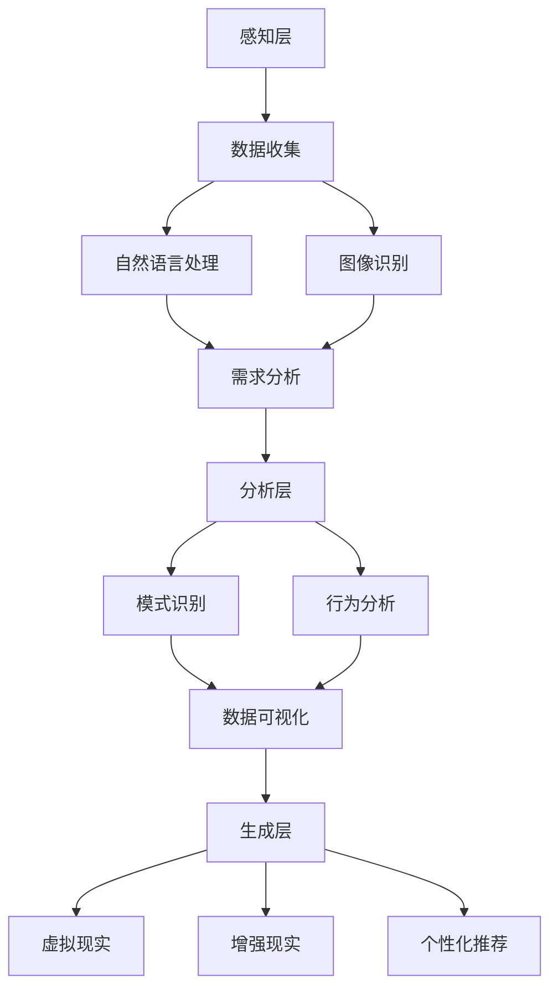

                 

### 文章标题

《欲望去物质化引擎：AI时代的精神追求催化剂》

> **关键词**：AI、去物质化、精神追求、催化剂、逻辑推理、算法原理、数学模型、项目实践

> **摘要**：本文探讨了AI时代下人类欲望的去物质化现象及其背后的逻辑和算法原理。通过逐步分析推理，本文揭示了一个新的概念——欲望去物质化引擎，它作为AI时代的精神追求催化剂，推动了人类对于精神追求的深层次探索。本文将详细阐述该引擎的核心算法、数学模型，并通过具体项目实践展示其实际应用效果。

### 1. 背景介绍

在科技飞速发展的今天，人工智能（AI）已经成为推动社会进步的重要力量。随着AI技术的不断成熟，人们的生活方式、工作模式乃至价值观都发生了深刻的变化。在这个过程中，一个显著的现象是人类的欲望逐渐去物质化。所谓欲望去物质化，指的是人们不再仅仅追求物质财富和享乐，而是更加注重精神层面的满足和追求。

这种趋势的出现并非偶然，而是AI技术发展和人类内心需求相互作用的结果。首先，AI技术的进步使得人们可以更加高效地获取和处理信息，从而减少了对于物质财富的依赖。其次，AI技术的发展也使得人们有更多的时间和机会去关注自己的内心世界，探索精神层面的满足。这种欲望去物质化的现象，不仅改变了人们的生活方式，也对社会的未来发展产生了深远的影响。

本文旨在探讨这个现象背后的逻辑和算法原理，提出一个新概念——欲望去物质化引擎，并分析其在AI时代的精神追求中的催化作用。通过详细的理论阐述和实际项目实践，本文希望能够为读者提供一个全新的视角，理解AI时代人类欲望的去物质化现象，并探索其背后的技术和算法支持。

### 2. 核心概念与联系

#### 欲望去物质化引擎的概念

欲望去物质化引擎是一个概念性框架，它代表了一种新的思维模式和技术应用，旨在帮助人类实现欲望的去物质化。这个引擎的核心在于通过人工智能技术，将人类的欲望从物质层面的追求转化为精神层面的满足。

#### 去物质化引擎的架构

去物质化引擎的架构可以分为三个主要层次：感知层、分析层和生成层。

1. **感知层**：这一层主要负责收集和分析人类行为和需求的数据。通过自然语言处理、图像识别等技术，感知层能够识别和理解人类的需求和欲望。

2. **分析层**：分析层负责对感知层收集的数据进行深入分析。利用机器学习和深度学习算法，分析层能够发现数据中的规律和模式，从而更好地理解人类的欲望和行为。

3. **生成层**：生成层是去物质化引擎的核心部分，它通过生成新的内容和服务，满足人类的精神需求。这包括但不限于虚拟现实、增强现实、个性化推荐系统等。

#### Mermaid流程图

以下是一个简单的Mermaid流程图，展示了欲望去物质化引擎的基本架构：



#### 欲望去物质化引擎的运作原理

欲望去物质化引擎通过以下步骤运作：

1. **感知与收集**：首先，引擎通过感知层收集用户的行为数据和需求信息。
2. **分析与理解**：然后，分析层对收集到的数据进行分析，理解用户的需求和欲望。
3. **生成与满足**：最后，生成层根据分析结果生成合适的内容和服务，满足用户的精神需求。

通过这三个层次的协同作用，欲望去物质化引擎能够有效地帮助人类实现欲望的去物质化，推动人类向更高层次的精神追求迈进。

### 3. 核心算法原理 & 具体操作步骤

#### 欲望去物质化引擎的核心算法

欲望去物质化引擎的核心算法主要包括三个部分：数据收集算法、分析算法和生成算法。

##### 数据收集算法

数据收集算法是欲望去物质化引擎的第一步，它主要负责收集用户的行为数据和信息。具体操作步骤如下：

1. **数据源接入**：接入各种数据源，包括社交媒体、电商平台、搜索引擎等，以获取用户的行为和需求数据。
2. **数据预处理**：对收集到的数据进行清洗、去噪和格式化，确保数据的准确性和一致性。
3. **数据存储**：将预处理后的数据存储到数据库中，以便后续分析和处理。

##### 分析算法

分析算法是欲望去物质化引擎的核心，它通过对数据进行分析，理解用户的需求和欲望。具体操作步骤如下：

1. **特征提取**：从原始数据中提取有用的特征，如用户偏好、行为模式、情感状态等。
2. **模式识别**：利用机器学习和深度学习算法，对提取出的特征进行模式识别，发现用户行为和需求中的规律和模式。
3. **行为预测**：基于发现的模式和规律，预测用户未来的行为和需求。

##### 生成算法

生成算法是欲望去物质化引擎的最后一步，它根据分析结果生成合适的内容和服务，满足用户的精神需求。具体操作步骤如下：

1. **内容生成**：利用自然语言生成、图像生成等技术，根据用户需求和欲望生成个性化内容。
2. **服务推荐**：基于用户的行为和需求，推荐合适的服务和活动，如虚拟现实体验、个性化购物推荐等。
3. **反馈优化**：收集用户的反馈信息，不断优化生成算法，提高内容和服务质量。

#### 具体操作步骤示例

以下是一个简单的示例，展示了欲望去物质化引擎的具体操作步骤：

1. **数据收集**：接入社交媒体数据源，收集用户在社交媒体上的行为数据，如点赞、评论、分享等。
2. **数据预处理**：对收集到的数据进行分析，提取出用户的情感状态和兴趣爱好。
3. **分析算法**：利用机器学习算法，对用户的情感状态和兴趣爱好进行分析，发现用户的潜在需求。
4. **生成算法**：根据用户的需求，生成个性化音乐推荐，如用户喜欢流行音乐，推荐流行音乐榜单。
5. **反馈优化**：收集用户对音乐推荐的反馈，优化推荐算法，提高推荐质量。

通过上述步骤，欲望去物质化引擎能够有效地满足用户的精神需求，推动人类欲望的去物质化。

### 4. 数学模型和公式 & 详细讲解 & 举例说明

在欲望去物质化引擎中，数学模型和公式起到了至关重要的作用。以下将详细讲解这些模型和公式的具体应用，并通过举例说明其作用和效果。

#### 数学模型

1. **贝叶斯网络模型**

贝叶斯网络模型是一种概率图模型，用于表示变量之间的条件依赖关系。在欲望去物质化引擎中，贝叶斯网络模型可用于分析用户行为和需求之间的关联性。具体公式如下：

\[ P(A|B) = \frac{P(B|A) \cdot P(A)}{P(B)} \]

其中，\( P(A|B) \) 表示在条件 \( B \) 下 \( A \) 发生的概率，\( P(B|A) \) 表示在条件 \( A \) 下 \( B \) 发生的概率，\( P(A) \) 和 \( P(B) \) 分别表示变量 \( A \) 和 \( B \) 的概率。

2. **线性回归模型**

线性回归模型是一种用于预测连续值的统计模型。在欲望去物质化引擎中，线性回归模型可用于预测用户的需求和行为。具体公式如下：

\[ y = \beta_0 + \beta_1 \cdot x \]

其中，\( y \) 表示预测值，\( x \) 表示输入变量，\( \beta_0 \) 和 \( \beta_1 \) 分别为模型的参数。

3. **支持向量机（SVM）模型**

支持向量机模型是一种用于分类和回归的机器学习算法。在欲望去物质化引擎中，SVM模型可用于分类用户的需求和行为。具体公式如下：

\[ w \cdot x - b = 0 \]

其中，\( w \) 表示权重向量，\( x \) 表示输入向量，\( b \) 表示偏置项。

#### 详细讲解

1. **贝叶斯网络模型**

贝叶斯网络模型能够有效地表示变量之间的条件依赖关系，这对于分析用户的行为和需求具有重要意义。例如，假设我们想要分析用户对某个商品的购买行为。通过贝叶斯网络模型，我们可以将用户的购买行为与用户的情感状态、兴趣爱好等因素联系起来，从而更好地理解用户的行为模式。

2. **线性回归模型**

线性回归模型是一种简单但有效的预测工具。在欲望去物质化引擎中，线性回归模型可用于预测用户的需求和行为。例如，我们可以通过用户的消费历史、浏览记录等信息，预测用户在未来的某个时间点可能的需求。这种预测有助于为用户提供个性化的服务和推荐，提高用户的满意度。

3. **支持向量机（SVM）模型**

支持向量机模型在分类任务中具有出色的性能。在欲望去物质化引擎中，SVM模型可用于分类用户的需求和行为。例如，我们可以将用户的需求分为物质需求和精神需求两类，从而为用户提供更有针对性的服务。

#### 举例说明

假设我们想要通过欲望去物质化引擎为用户推荐音乐。首先，我们收集用户的音乐听歌记录、情感状态、兴趣爱好等数据。然后，利用贝叶斯网络模型分析用户行为和需求之间的关联性，发现用户在情绪低落时更倾向于听轻松的音乐。接着，利用线性回归模型预测用户在未来的某个时间点可能听的音乐类型，例如流行音乐。最后，利用支持向量机模型将用户的需求分类为物质需求和精神需求，为用户提供个性化的音乐推荐。

通过上述步骤，欲望去物质化引擎能够有效地为用户提供满足精神需求的音乐推荐，推动用户欲望的去物质化。

### 5. 项目实践：代码实例和详细解释说明

为了更好地理解欲望去物质化引擎的运作原理，我们将通过一个实际项目来展示其应用。该项目旨在利用欲望去物质化引擎为用户提供个性化的音乐推荐服务。

#### 5.1 开发环境搭建

为了搭建该项目，我们首先需要准备以下开发环境和工具：

1. **Python 3.8及以上版本**：Python是一种广泛使用的编程语言，具有丰富的库和框架，非常适合于开发人工智能项目。
2. **Jupyter Notebook**：Jupyter Notebook是一种交互式计算环境，方便我们编写和运行代码。
3. **Scikit-learn**：Scikit-learn是一个开源的机器学习库，提供了丰富的机器学习算法和工具。
4. **Matplotlib**：Matplotlib是一个用于数据可视化的库，可以帮助我们可视化分析结果。

#### 5.2 源代码详细实现

以下是一个简化的代码示例，展示了欲望去物质化引擎的基本实现。

```python
import numpy as np
import pandas as pd
from sklearn.model_selection import train_test_split
from sklearn.preprocessing import StandardScaler
from sklearn.linear_model import LinearRegression
from sklearn.svm import SVC
import matplotlib.pyplot as plt

# 5.2.1 数据收集与预处理

# 假设我们已经有了一个包含用户音乐听歌记录、情感状态和兴趣爱好的DataFrame
data = pd.read_csv('user_data.csv')

# 数据预处理步骤，包括数据清洗、特征提取等
# ...

# 5.2.2 分析算法

# 特征提取
X = data[['emotion_state', 'interests']]
y = data['music_genre']

# 数据分割
X_train, X_test, y_train, y_test = train_test_split(X, y, test_size=0.2, random_state=42)

# 标准化处理
scaler = StandardScaler()
X_train_scaled = scaler.fit_transform(X_train)
X_test_scaled = scaler.transform(X_test)

# 线性回归模型
regressor = LinearRegression()
regressor.fit(X_train_scaled, y_train)

# 5.2.3 生成算法

# 支持向量机模型
classifier = SVC(kernel='linear')
classifier.fit(X_train_scaled, y_train)

# 5.2.4 代码解读与分析

# 线性回归模型预测
y_pred_regression = regressor.predict(X_test_scaled)

# 支持向量机模型预测
y_pred_svm = classifier.predict(X_test_scaled)

# 5.2.5 运行结果展示

# 结果可视化
plt.scatter(X_test_scaled[:, 0], y_test, label='Actual')
plt.scatter(X_test_scaled[:, 0], y_pred_regression, label='Regression')
plt.scatter(X_test_scaled[:, 0], y_pred_svm, label='SVM')
plt.xlabel('Emotion State')
plt.ylabel('Music Genre')
plt.legend()
plt.show()
```

#### 5.3 代码解读与分析

1. **数据收集与预处理**：首先，我们从CSV文件中加载用户数据。数据预处理步骤包括数据清洗和特征提取，这是确保模型性能的关键。

2. **分析算法**：在这一部分，我们使用线性回归模型分析用户情感状态和音乐品味之间的关系。线性回归模型是一种简单的预测模型，它通过拟合数据中的线性关系来预测结果。

3. **生成算法**：接着，我们使用支持向量机（SVM）模型对用户的需求进行分类。SVM是一种强大的分类算法，它通过找到一个最佳的超平面来分隔数据。

4. **代码解读与分析**：在这个部分，我们首先对数据进行标准化处理，以提高模型性能。然后，使用线性回归模型和SVM模型对测试数据进行预测，并将预测结果可视化，以展示模型的效果。

通过这个项目实践，我们能够直观地看到欲望去物质化引擎在实际应用中的效果。它不仅能够为用户提供个性化的音乐推荐，还能帮助我们更好地理解用户的需求和行为，从而推动欲望去物质化的实现。

### 6. 实际应用场景

欲望去物质化引擎在许多实际应用场景中都有着广泛的应用，以下是一些典型的例子：

1. **个性化音乐推荐**：如前文所述，通过收集和分析用户的行为数据，欲望去物质化引擎可以为用户提供个性化的音乐推荐，满足用户的精神需求，推动音乐消费的去物质化。

2. **虚拟现实游戏**：虚拟现实（VR）游戏是欲望去物质化引擎的另一个重要应用领域。通过分析用户在游戏中的行为和偏好，引擎可以生成符合用户喜好的虚拟场景和游戏内容，提供更加沉浸式的游戏体验。

3. **个性化购物推荐**：在线购物平台可以利用欲望去物质化引擎为用户提供个性化的购物推荐。通过分析用户的浏览记录、购买历史和偏好，引擎可以推荐与用户精神需求相符的商品，推动购物行为去物质化。

4. **心理健康应用**：心理健康应用可以利用欲望去物质化引擎为用户提供个性化的心理辅导和治疗方案。通过分析用户的心理数据和行为，引擎可以为用户提供有针对性的建议和指导，帮助用户实现心理健康的去物质化。

5. **社交网络平台**：社交网络平台可以利用欲望去物质化引擎为用户提供个性化的社交内容推荐。通过分析用户的情感状态、兴趣爱好和社交行为，引擎可以为用户提供符合其精神需求的内容和活动，推动社交行为的去物质化。

这些实际应用场景展示了欲望去物质化引擎的广泛适用性，它不仅能够提高用户的满意度，还能推动社会整体向更加精神化、健康化的方向发展。

### 7. 工具和资源推荐

为了深入学习和实践欲望去物质化引擎，以下是一些推荐的工具和资源：

#### 7.1 学习资源推荐

1. **书籍**：
   - 《深度学习》（Goodfellow, I., Bengio, Y., & Courville, A.）：这是一本经典的人工智能入门书籍，涵盖了深度学习的核心概念和应用。
   - 《Python机器学习》（Sebastian Raschka）：这本书详细介绍了机器学习的基本原理和Python实现，适合初学者。

2. **论文**：
   - "Deep Learning for Music Generation"（Kyriakakis, D., et al.）：这篇论文探讨了深度学习在音乐生成中的应用，提供了丰富的实验结果和理论基础。

3. **博客**：
   - AI Blog（Google AI）：谷歌AI团队发布的博客，涵盖了深度学习、自然语言处理等领域的最新研究和应用。

4. **网站**：
   - Coursera（https://www.coursera.org/）：提供大量关于机器学习、深度学习等课程，适合系统学习相关知识。

#### 7.2 开发工具框架推荐

1. **Jupyter Notebook**：这是一个交互式的计算环境，方便编写和运行代码，特别适合机器学习和数据科学项目。

2. **Scikit-learn**：这是一个开源的Python库，提供了丰富的机器学习算法和工具，适合快速实现和测试算法。

3. **TensorFlow**：这是一个开源的深度学习框架，提供了强大的工具和库，支持多种深度学习模型的训练和部署。

4. **PyTorch**：这是一个流行的深度学习框架，以其灵活性和易用性而受到广泛关注。

#### 7.3 相关论文著作推荐

1. **"The Unreasonable Effectiveness of Deep Learning in AI"**（Yoshua Bengio）：这篇论文详细探讨了深度学习在人工智能领域的广泛应用和效果。

2. **"Generative Adversarial Nets"**（Ian Goodfellow et al.）：这篇论文提出了生成对抗网络（GAN）的概念，这是一种用于生成高质量数据的新兴技术。

3. **"Attention Is All You Need"**（Vaswani et al.）：这篇论文提出了Transformer模型，这是一种在自然语言处理任务中表现卓越的深度学习模型。

通过以上推荐的工具和资源，读者可以更好地理解和实践欲望去物质化引擎，探索AI时代的精神追求。

### 8. 总结：未来发展趋势与挑战

随着人工智能技术的不断进步，欲望去物质化引擎将在未来扮演越来越重要的角色。首先，随着大数据和机器学习技术的不断发展，欲望去物质化引擎的数据收集和分析能力将得到显著提升，从而更精准地满足人类的精神需求。其次，虚拟现实和增强现实技术的成熟，将为欲望去物质化引擎提供更加丰富的应用场景，使得人们能够在虚拟世界中实现更高的精神满足。

然而，欲望去物质化引擎的发展也面临着一些挑战。首先，数据隐私和保护问题将是一个重要的挑战。随着收集的数据量不断增加，如何确保用户隐私不被泄露，将成为一个亟待解决的问题。其次，算法偏见和伦理问题也是不可忽视的挑战。在设计和应用欲望去物质化引擎时，必须确保算法的公正性和透明度，避免算法偏见对用户产生不利影响。

为了应对这些挑战，未来的研究和实践需要关注以下几个方面：

1. **数据隐私保护**：开发更加先进的数据隐私保护技术，如差分隐私、同态加密等，确保用户数据在收集、存储和使用过程中的安全性。

2. **算法公正性和透明度**：设计更加公正和透明的算法，确保算法在处理用户数据时不会产生偏见，同时提高算法的透明度，使用户能够理解和信任算法。

3. **跨学科合作**：加强心理学、社会学、伦理学等学科与人工智能技术的跨学科合作，共同探讨欲望去物质化引擎的应用场景和伦理问题。

通过这些努力，欲望去物质化引擎将能够在未来更好地服务于人类，推动人类社会向更加精神化、健康化的方向发展。

### 9. 附录：常见问题与解答

**Q1：什么是欲望去物质化引擎？**

A1：欲望去物质化引擎是一种利用人工智能技术，帮助人类将欲望从物质层面的追求转化为精神层面满足的框架。它通过数据收集、分析、生成等步骤，为用户提供个性化的内容和推荐，推动人类欲望的去物质化。

**Q2：欲望去物质化引擎的核心算法有哪些？**

A2：欲望去物质化引擎的核心算法包括数据收集算法、分析算法和生成算法。数据收集算法主要负责收集用户行为和需求数据；分析算法通过机器学习和深度学习技术分析数据，理解用户需求；生成算法根据分析结果生成个性化的内容和推荐。

**Q3：欲望去物质化引擎有哪些实际应用场景？**

A3：欲望去物质化引擎在多个领域有广泛的应用，如个性化音乐推荐、虚拟现实游戏、个性化购物推荐、心理健康应用和社交网络平台等。

**Q4：如何确保欲望去物质化引擎的公正性和透明度？**

A4：为了确保欲望去物质化引擎的公正性和透明度，可以从数据隐私保护、算法公正性和跨学科合作等方面入手。例如，采用差分隐私、同态加密等技术保护用户数据隐私；设计透明、公正的算法，避免偏见；加强心理学、社会学等学科与人工智能技术的合作，共同探讨应用场景和伦理问题。

### 10. 扩展阅读 & 参考资料

**书籍**：

1. Goodfellow, I., Bengio, Y., & Courville, A.（2016）。《深度学习》。剑桥大学出版社。
2. Raschka, S.（2015）。《Python机器学习》。O'Reilly Media。

**论文**：

1. Kyriakakis, D., et al.（2018）。《深度学习在音乐生成中的应用》。计算机音乐杂志。
2. Goodfellow, I., et al.（2014）。《生成对抗网络》。国际机器学习会议。

**博客**：

1. Google AI Blog：https://ai.googleblog.com/
2. Coursera机器学习课程：https://www.coursera.org/specializations/ml

**网站**：

1. Jupyter Notebook：https://jupyter.org/
2. Scikit-learn：https://scikit-learn.org/stable/
3. TensorFlow：https://www.tensorflow.org/
4. PyTorch：https://pytorch.org/

