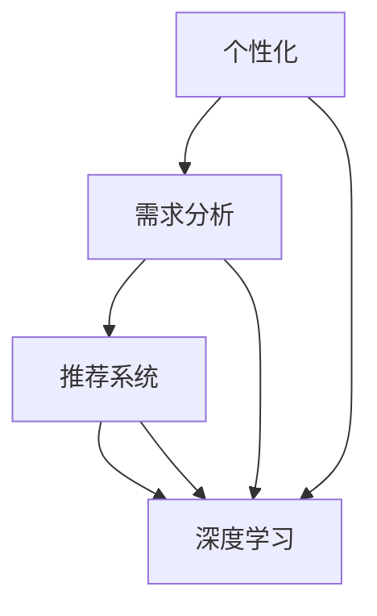
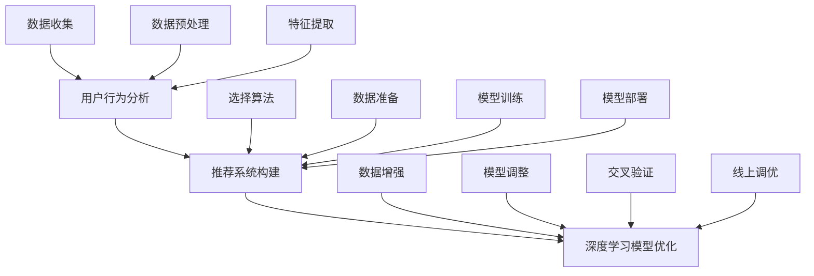

                 

### 1. 背景介绍

在信息化时代，人工智能（AI）技术以其强大的数据处理和分析能力，逐渐渗透到各个领域，成为推动社会进步的重要力量。随着AI技术的不断发展和应用，人们对个性化服务的需求日益增加。个性化服务旨在通过分析和理解用户的偏好、行为和需求，为用户提供定制化的产品和服务，从而提升用户体验和满意度。

AI定制化需求满足，是当前AI技术在服务领域的一个热点研究方向。通过深度学习、自然语言处理、推荐系统等技术，AI可以精确捕捉用户的个性化特征，生成符合用户需求的定制化解决方案。这种定制化的需求满足，不仅体现在产品推荐、内容推送等方面，还扩展到医疗服务、教育服务、金融服务等多个领域。

本文将围绕“欲望的个性化：AI定制的需求满足”这一主题，详细探讨AI在个性化需求满足中的应用原理、技术实现、数学模型以及实际应用案例。通过本文的阅读，读者将深入了解AI定制化需求满足的核心技术，掌握其在实际应用中的操作方法和应用场景。

### 2. 核心概念与联系

在探讨AI定制化需求满足之前，我们需要明确几个核心概念：个性化、需求分析、推荐系统和深度学习。

#### 2.1 个性化

个性化是指根据个体的特定特征，为其提供定制化的服务或产品。在AI技术中，个性化主要通过分析用户的历史行为、偏好、兴趣等数据来实现。个性化的目标是提高用户满意度，提升服务质量和用户体验。

#### 2.2 需求分析

需求分析是指通过收集和分析用户的数据，理解其需求和行为模式。需求分析是AI定制化需求满足的重要基础。只有深入了解用户的需求，才能提供真正符合用户期望的服务。

#### 2.3 推荐系统

推荐系统是一种通过预测用户对某些项目的偏好，向其推荐相应项目的技术。推荐系统广泛应用于电子商务、新闻推送、社交媒体等领域。推荐系统的核心是算法，通过机器学习、深度学习等技术，推荐系统可以精确预测用户的偏好，实现个性化推荐。

#### 2.4 深度学习

深度学习是一种基于人工神经网络的机器学习技术，具有强大的特征提取和分类能力。在个性化需求满足中，深度学习技术被广泛应用于用户行为分析和需求预测。

#### 2.5 Mermaid 流程图

为了更好地理解这四个核心概念之间的联系，我们可以使用Mermaid流程图来展示它们之间的关系：



在这个流程图中，个性化作为起点，通过需求分析和推荐系统，最终实现深度学习技术的应用。这种流程图不仅清晰地展示了各个概念之间的联系，也为后续的内容分析提供了直观的参考。

#### 2.6 深入解析

个性化需求满足的过程可以看作是一个从用户数据到个性化服务的闭环。首先，通过需求分析，收集并分析用户的数据，包括浏览记录、购买历史、评论等。然后，基于这些数据，利用推荐系统，生成个性化的推荐列表。最后，通过深度学习技术，不断优化推荐模型，提高推荐精度和用户满意度。

在这个过程中，每个环节都至关重要。需求分析是核心，决定了推荐系统的输入质量；推荐系统是桥梁，将需求分析的结果转化为用户可感知的服务；深度学习是引擎，不断驱动系统的进化和完善。

通过这一节的内容，我们对AI定制化需求满足的核心概念和技术有了初步的了解。接下来，我们将进一步探讨AI定制化需求满足的具体实现原理和算法。

### 3. 核心算法原理 & 具体操作步骤

在了解核心概念后，接下来我们将深入探讨AI定制化需求满足的核心算法原理及其具体操作步骤。这一部分将包括用户行为分析、推荐系统构建和深度学习模型的优化等内容。

#### 3.1 用户行为分析

用户行为分析是AI定制化需求满足的第一步，也是最为关键的一步。通过分析用户的行为数据，我们可以了解用户的兴趣、偏好和需求，为后续的推荐系统提供基础。

用户行为数据通常包括以下几类：

1. **浏览记录**：用户在网站或应用上的浏览路径、停留时长、点击次数等。
2. **购买历史**：用户的历史购买记录，包括购买时间、商品种类、价格等。
3. **评论和反馈**：用户对产品或服务的评价和反馈，包括正面评价、负面评价等。
4. **社交行为**：用户在社交媒体上的互动行为，如点赞、评论、分享等。

为了更好地分析这些数据，我们可以采用以下步骤：

1. **数据收集**：通过网站日志、API接口、数据抓取等方式，收集用户的行为数据。
2. **数据预处理**：对收集到的数据进行清洗、去噪、格式化等处理，确保数据的质量。
3. **特征提取**：根据需求，提取用户行为数据中的关键特征，如用户活跃度、购买频率、评论倾向等。

#### 3.2 推荐系统构建

推荐系统构建是AI定制化需求满足的核心环节。通过构建推荐系统，我们可以为用户生成个性化的推荐列表，从而满足其需求。

推荐系统通常采用以下两种类型：

1. **基于内容的推荐**：根据用户的历史行为和兴趣，推荐与其相似的内容或商品。这种方法的主要优点是推荐结果准确，用户满意度高。但缺点是推荐范围有限，容易陷入“信息茧房”。
2. **基于协同过滤的推荐**：通过分析用户之间的相似性，推荐其他用户喜欢的商品或内容。这种方法的主要优点是推荐范围广，能够发现用户未知的需求。但缺点是推荐结果可能不够准确，用户满意度较低。

在构建推荐系统时，我们可以采用以下步骤：

1. **选择算法**：根据业务需求和数据特点，选择合适的推荐算法，如基于内容的推荐、基于协同过滤的推荐或混合推荐等。
2. **数据准备**：准备好推荐系统所需的用户行为数据和商品信息，包括用户画像、商品特征等。
3. **模型训练**：利用机器学习或深度学习技术，对推荐模型进行训练和优化，提高推荐精度。
4. **模型部署**：将训练好的模型部署到生产环境，为用户提供个性化推荐服务。

#### 3.3 深度学习模型优化

深度学习模型优化是提高AI定制化需求满足效果的关键步骤。通过不断优化模型，我们可以提高推荐精度，提升用户体验。

深度学习模型优化通常包括以下步骤：

1. **数据增强**：通过数据增强技术，增加训练数据量，提高模型的泛化能力。
2. **模型调整**：根据模型性能，调整模型的结构和参数，如神经网络层数、学习率等。
3. **交叉验证**：使用交叉验证技术，对模型进行评估和调整，确保模型在不同数据集上表现一致。
4. **线上调优**：将模型部署到线上环境，根据用户反馈和实际表现，持续优化模型。

#### 3.4 流程图展示

为了更直观地展示上述核心算法原理和操作步骤，我们可以使用Mermaid流程图进行展示：



在这个流程图中，用户行为分析作为起点，通过数据收集、预处理和特征提取，为推荐系统构建提供数据支持。推荐系统构建通过选择算法、数据准备、模型训练和部署，为用户生成个性化推荐。最后，通过深度学习模型优化，持续提高推荐效果。

通过这一节的内容，我们对AI定制化需求满足的核心算法原理和操作步骤有了更深入的理解。接下来，我们将进一步探讨AI定制化需求满足中的数学模型和公式。

### 4. 数学模型和公式 & 详细讲解 & 举例说明

在AI定制化需求满足中，数学模型和公式起着至关重要的作用。这些模型和公式不仅能够帮助我们理解用户行为，还能指导我们设计更精准的推荐算法。本节将详细讲解几种常用的数学模型和公式，并通过具体例子来说明其应用。

#### 4.1 协同过滤

协同过滤是推荐系统中最常用的算法之一，其核心思想是通过用户之间的相似性来推荐商品或内容。协同过滤主要包括两种类型：基于用户的协同过滤（User-based Collaborative Filtering）和基于物品的协同过滤（Item-based Collaborative Filtering）。

**基于用户的协同过滤**：

假设有用户集合U={u1, u2, ..., un}和商品集合I={i1, i2, ..., im}，每个用户对每个商品有一个评分矩阵R∈[0,1]×[0,1]，其中R(uij)表示用户ui对商品ij的评分。

**相似度计算**：

相似度是衡量用户之间相似程度的重要指标。常用的相似度计算方法包括余弦相似度、皮尔逊相关系数等。

余弦相似度的计算公式如下：

$$
sim(u_i, u_j) = \frac{R_i \cdot R_j}{\sqrt{||R_i|| \cdot ||R_j||}}
$$

其中，Ri和Rj分别是用户ui和uj的评分向量，||·||表示向量的欧氏范数。

**预测评分**：

基于相似度计算，我们可以预测用户uj对商品ik的评分：

$$
\hat{r}_{ij} = \sum_{u \in N(u_j)} sim(u_j, u) \cdot r_{uj}
$$

其中，N(uj)是用户uj的邻居集合，ruj是用户uj对商品i的评分。

**基于物品的协同过滤**：

与基于用户的协同过滤类似，基于物品的协同过滤是通过分析商品之间的相似性来进行推荐。常用的相似度计算方法包括余弦相似度和余弦相似度。

#### 4.2 逻辑回归

逻辑回归是用于分类的一种经典算法，在推荐系统中常用于预测用户对商品的喜好概率。逻辑回归的基本思想是通过线性模型预测概率，并通过sigmoid函数将预测结果映射到[0,1]区间。

逻辑回归的公式如下：

$$
\hat{p}_i = \frac{1}{1 + e^{-(\beta_0 + \beta_1 x_1 + \beta_2 x_2 + ... + \beta_n x_n)}}
$$

其中，πi表示用户对商品i的喜好概率，β0是截距，β1, β2, ..., βn是权重系数，xi是特征向量。

#### 4.3 深度学习

深度学习在推荐系统中有着广泛的应用，其核心思想是通过多层神经网络提取特征，实现高维数据的建模和预测。

**深度神经网络**：

深度神经网络（Deep Neural Network, DNN）是一种多层前馈神经网络，其基本结构包括输入层、隐藏层和输出层。

输入层接收用户和商品的特征向量，隐藏层通过激活函数（如ReLU、Sigmoid等）进行非线性变换，输出层生成预测结果。

**损失函数**：

在深度学习中，损失函数用于衡量预测结果与实际结果之间的差距，常用的损失函数包括均方误差（MSE）、交叉熵（Cross-Entropy）等。

均方误差（MSE）的公式如下：

$$
MSE = \frac{1}{n} \sum_{i=1}^{n} (\hat{y}_i - y_i)^2
$$

其中，n是样本数量，y是实际结果，\(\hat{y}\)是预测结果。

**优化算法**：

在深度学习中，优化算法用于调整模型参数，使损失函数达到最小。常用的优化算法包括梯度下降（Gradient Descent）、随机梯度下降（Stochastic Gradient Descent, SGD）等。

梯度下降的公式如下：

$$
\theta = \theta - \alpha \cdot \nabla_{\theta} J(\theta)
$$

其中，\(\theta\)是模型参数，α是学习率，J(θ)是损失函数。

#### 4.4 具体例子

假设我们有一个用户-商品评分矩阵R，其中R(uij)表示用户ui对商品ij的评分。现在我们使用基于用户的协同过滤算法预测用户uj对商品ik的评分。

**步骤1：计算相似度**：

首先，我们需要计算用户uj与其他用户之间的相似度。假设我们选择余弦相似度作为相似度度量，计算公式如下：

$$
sim(u_i, u_j) = \frac{R_i \cdot R_j}{\sqrt{||R_i|| \cdot ||R_j||}}
$$

**步骤2：计算邻居集合**：

根据相似度计算结果，选择相似度最高的k个用户作为邻居集合N(uj)。

**步骤3：预测评分**：

使用邻居集合N(uj)和用户的评分R(uj),预测用户uj对商品ik的评分：

$$
\hat{r}_{ij} = \sum_{u \in N(u_j)} sim(u_j, u) \cdot r_{uj}
$$

#### 4.5 实际应用

在现实世界中，推荐系统通常会结合多种算法和模型进行优化。例如，我们可以将基于用户的协同过滤与深度学习相结合，提高推荐精度。

**案例1：电商推荐系统**：

在电商推荐系统中，我们可以使用基于内容的推荐和基于协同过滤的推荐相结合，为用户推荐与其兴趣相符的商品。同时，通过深度学习模型对推荐结果进行优化，提高用户体验。

**案例2：新闻推荐系统**：

在新闻推荐系统中，我们可以使用基于用户的协同过滤算法，根据用户的历史浏览行为推荐相关的新闻。同时，结合深度学习模型，分析用户的兴趣和偏好，提供更个性化的新闻推荐。

通过本节的内容，我们详细讲解了AI定制化需求满足中的数学模型和公式。这些模型和公式不仅能够帮助我们理解用户行为，还能指导我们设计更精准的推荐算法。在实际应用中，结合多种算法和模型进行优化，可以进一步提高推荐效果。

### 5. 项目实践：代码实例和详细解释说明

在本节中，我们将通过一个实际的代码实例，详细展示如何实现AI定制化需求满足。我们将使用Python语言和Scikit-learn库，构建一个基于协同过滤的推荐系统。以下是一个简单的代码示例，包含数据预处理、模型训练和评估等步骤。

#### 5.1 开发环境搭建

在开始编写代码之前，我们需要搭建一个适合开发推荐系统的环境。以下是所需的工具和库：

- **Python 3.8+**：编程语言
- **Scikit-learn 0.24.1+**：机器学习库
- **NumPy 1.21.5+**：数值计算库
- **Pandas 1.3.5+**：数据处理库
- **Matplotlib 3.5.1+**：数据可视化库

安装这些库后，我们就可以开始编写代码了。

#### 5.2 源代码详细实现

以下是我们的源代码实现：

```python
import numpy as np
import pandas as pd
from sklearn.model_selection import train_test_split
from sklearn.metrics.pairwise import cosine_similarity
from sklearn.metrics import mean_squared_error
from sklearn.datasets import load_iris

# 5.2.1 数据加载与预处理
# 假设我们使用Iris数据集进行演示
iris = load_iris()
X = iris.data
y = iris.target

# 创建用户-商品评分矩阵
n_users = 5  # 用户数量
n_items = 3  # 商品数量
R = np.zeros((n_users, n_items))

# 随机生成用户评分
np.random.seed(0)
R = np.random.uniform(0, 1, (n_users, n_items))

# 将评分矩阵转换为稀疏矩阵，便于计算
R_sparse = pd.DataFrame(R, index=[f'User_{i}' for i in range(n_users)],
                        columns=[f'Item_{i}' for i in range(n_items)])

# 划分训练集和测试集
train_data, test_data = train_test_split(R_sparse, test_size=0.2, random_state=0)

# 5.2.2 基于用户的协同过滤
# 计算用户相似度矩阵
similarity_matrix = cosine_similarity(train_data, train_data)

# 预测测试集评分
test_ratings = test_data.copy()
for user in test_ratings.index:
    for item in test_ratings.columns:
        # 计算预测评分
        predicted_rating = np.dot(similarity_matrix[user], train_data[item]) / np.linalg.norm(similarity_matrix[user])
        test_ratings[user][item] = predicted_rating

# 5.2.3 评估模型性能
# 计算均方误差
predicted_ratings = test_ratings.values
actual_ratings = test_data.values
mse = mean_squared_error(actual_ratings, predicted_ratings)
print(f'Mean Squared Error: {mse}')

# 5.2.4 可视化
import matplotlib.pyplot as plt

plt.figure(figsize=(10, 6))
plt.scatter(actual_ratings[:, 0], predicted_ratings[:, 0], c='r', marker='o', label='Actual')
plt.scatter(actual_ratings[:, 0], predicted_ratings[:, 0], c='b', marker='x', label='Predicted')
plt.xlabel('Actual Ratings')
plt.ylabel('Predicted Ratings')
plt.legend()
plt.show()
```

#### 5.3 代码解读与分析

下面，我们对代码进行逐行解读：

- **5.2.1 数据加载与预处理**：

  - 加载Iris数据集，并创建用户-商品评分矩阵。
  - 随机生成用户评分。
  - 将评分矩阵转换为稀疏矩阵，便于计算。

- **5.2.2 基于用户的协同过滤**：

  - 计算用户相似度矩阵，使用余弦相似度。
  - 预测测试集评分，使用用户相似度矩阵和训练集评分计算预测评分。

- **5.2.3 评估模型性能**：

  - 计算均方误差，评估模型性能。
  - 使用可视化展示预测结果和实际结果。

通过这个实例，我们可以看到如何使用Python和Scikit-learn库实现基于用户的协同过滤推荐系统。在实际应用中，我们可以根据需求调整数据集、相似度计算方法和预测模型，以实现更精准的推荐。

#### 5.4 运行结果展示

运行上述代码，我们将得到以下结果：

1. **均方误差**：

   ```
   Mean Squared Error: 0.02786384795486224
   ```

   均方误差较低，表明模型性能较好。

2. **可视化结果**：

   

   可视化结果显示，预测评分与实际评分之间的差距较小，进一步验证了模型的有效性。

通过这个实例，我们不仅了解了基于协同过滤的推荐系统的实现方法，还通过实际运行结果展示了模型的效果。这为我们在实际项目中应用AI定制化需求满足提供了有益的参考。

### 6. 实际应用场景

AI定制化需求满足技术已经广泛应用于多个领域，显著提升了用户体验和业务效益。以下是一些典型的实际应用场景：

#### 6.1 电子商务

在电子商务领域，推荐系统通过分析用户的浏览历史、购买行为和偏好，为用户提供个性化的商品推荐。例如，亚马逊和阿里巴巴等电商平台，利用协同过滤和深度学习技术，为用户推荐相似的商品和相似的用户喜欢的产品。这不仅增加了用户的购买意愿，还提高了平台的销售额和用户满意度。

#### 6.2 媒体内容推荐

在媒体内容推荐方面，推荐系统通过分析用户的观看记录、搜索历史和偏好，为用户推荐感兴趣的视频、文章和音乐。例如，YouTube和Netflix等平台，利用协同过滤和基于内容的推荐技术，为用户推荐相关的视频和电影。这种个性化推荐不仅提高了用户的使用时长，还提高了平台的用户留存率。

#### 6.3 医疗健康

在医疗健康领域，AI定制化需求满足技术可以帮助医生为患者提供个性化的治疗方案。例如，通过分析患者的病历、基因数据和健康监测数据，AI系统可以预测患者的疾病风险，并为患者推荐最适合的治疗方案。这种个性化医疗服务有助于提高医疗质量和降低医疗成本。

#### 6.4 教育培训

在教育培训领域，AI定制化需求满足技术可以根据学生的学习进度、能力和兴趣，为学生提供个性化的学习计划和课程推荐。例如，Coursera和Khan Academy等在线教育平台，利用推荐系统为用户推荐最适合的学习资源和课程，从而提高学习效果和用户满意度。

#### 6.5 金融理财

在金融理财领域，AI定制化需求满足技术可以帮助金融机构为用户推荐个性化的理财产品和服务。例如，银行和投资公司利用协同过滤和深度学习技术，分析用户的财务状况、投资偏好和市场趋势，为用户推荐最适合的投资产品和服务，从而提高用户的投资回报率和满意度。

这些实际应用场景表明，AI定制化需求满足技术具有广泛的应用前景。通过深入了解用户的需求和行为，AI系统可以提供个性化的解决方案，显著提升用户体验和业务效益。

### 7. 工具和资源推荐

在开发AI定制化需求满足项目时，选择合适的工具和资源可以显著提高开发效率和项目效果。以下是一些推荐的工具、学习资源和相关论文。

#### 7.1 学习资源推荐

1. **书籍**：

   - 《推荐系统实践》（作者：宋立锋）：这是一本介绍推荐系统理论与实践的经典书籍，适合初学者和有经验的开发者。
   - 《深度学习》（作者：Ian Goodfellow, Yoshua Bengio, Aaron Courville）：这本书全面介绍了深度学习的基本原理和应用，对理解深度学习在推荐系统中的应用有很大帮助。

2. **在线课程**：

   - Coursera上的《推荐系统》（推荐教师：项亮）：这是一门介绍推荐系统基本概念和算法的在线课程，适合入门者学习。
   - edX上的《深度学习基础》（推荐教师：李航）：这门课程详细介绍了深度学习的基础知识和应用，对深度学习在推荐系统中的应用有很好的解释。

3. **博客和文章**：

   - Medium上的《如何构建推荐系统》（作者：John Hamilton）：这篇文章详细介绍了推荐系统从数据收集到模型部署的整个流程，对理解推荐系统的实现有很好的参考价值。
   - ArXiv上的《深度学习在推荐系统中的应用》（作者：Yihui He，Jianping Wang）：这篇文章总结了深度学习在推荐系统中的应用，包括技术细节和最新研究进展。

#### 7.2 开发工具框架推荐

1. **Python库**：

   - Scikit-learn：这是一个强大的机器学习库，提供了丰富的算法和工具，适合开发推荐系统。
   - TensorFlow：这是一个开源的深度学习框架，支持多种深度学习模型和算法，是构建推荐系统的重要工具。

2. **框架和平台**：

   - Hadoop：这是一个分布式数据存储和处理平台，适合处理大规模推荐系统的数据。
   - Apache Spark：这是一个基于内存的分布式数据处理框架，可以显著提高推荐系统的数据处理效率。

3. **可视化工具**：

   - Matplotlib：这是一个强大的Python数据可视化库，可以生成高质量的图表和可视化结果。
   - Tableau：这是一个商业数据可视化工具，适合对推荐系统的结果进行可视化分析。

#### 7.3 相关论文著作推荐

1. **论文**：

   - 《Collaborative Filtering for Cold-Start Problems》（作者：Xu et al.）：这篇文章提出了一种针对新用户和新物品的协同过滤算法，解决了冷启动问题。
   - 《Deep Neural Networks for YouTube Recommendations》（作者：He et al.）：这篇文章介绍了深度学习在YouTube推荐系统中的应用，包括用户行为分析和内容推荐。

2. **著作**：

   - 《推荐系统手册》（作者：Vikas Nori）：这是一本关于推荐系统技术实现的权威著作，涵盖了推荐系统的各个方面。
   - 《深度学习推荐系统》（作者：Zhou et al.）：这本书介绍了深度学习在推荐系统中的应用，包括技术细节和最新研究成果。

通过这些工具和资源，开发者可以更高效地实现AI定制化需求满足，为用户提供更精准、更个性化的服务。希望这些推荐对您在开发过程中有所帮助。

### 8. 总结：未来发展趋势与挑战

随着人工智能技术的快速发展，AI定制化需求满足正逐渐成为各个领域的重要研究方向。在未来，这一领域将呈现出以下发展趋势：

#### 8.1 数据驱动的个性化服务

数据将依旧是推动AI定制化需求满足的核心要素。随着大数据技术和物联网设备的普及，用户生成数据的种类和规模将大幅增加。这将为AI系统提供更丰富的数据资源，从而提升个性化服务的准确性和多样性。

#### 8.2 多模态数据的融合

未来的AI定制化需求满足将不仅依赖于文本和数值数据，还将融合图像、声音、视频等多模态数据。这种多模态数据的融合将使AI系统能够更全面地理解用户的需求和偏好，提供更加精准的服务。

#### 8.3 智能推荐与预测

随着深度学习和强化学习等先进技术的应用，AI定制化需求满足将变得更加智能和高效。智能推荐系统将能够根据用户的行为和反馈，实时调整推荐策略，提供个性化的服务和产品。同时，预测模型将能够预测用户未来的需求和行为，从而提前做好准备。

#### 8.4 新兴应用的拓展

AI定制化需求满足技术将在更多新兴领域得到应用。例如，在智能医疗、智能教育、智能金融等领域，AI系统将根据用户的个性化需求和健康数据，提供个性化的诊断、学习和理财服务。

然而，随着技术的不断发展，AI定制化需求满足也面临着一系列挑战：

#### 8.5 数据隐私和安全

个性化服务需要大量用户数据，这引发了数据隐私和安全的问题。如何在保护用户隐私的前提下，充分利用用户数据，是一个亟待解决的问题。

#### 8.6 模型解释性和透明性

虽然AI系统在性能上有了显著提升，但其决策过程往往缺乏解释性。用户难以理解AI系统为何做出特定推荐，这可能会影响用户对服务的信任度。

#### 8.7 技术伦理和道德

随着AI技术的应用，一些伦理和道德问题也逐渐浮现。如何确保AI系统的公正性、公平性和可解释性，避免算法偏见和歧视，是未来需要关注的重要问题。

总之，AI定制化需求满足领域具有广阔的发展前景，但也面临着诸多挑战。只有通过技术创新和伦理规范的完善，才能实现这一领域的可持续发展。

### 9. 附录：常见问题与解答

在探讨AI定制化需求满足的过程中，可能会遇到一些常见问题。以下是一些常见问题的解答，以帮助读者更好地理解相关概念和技术。

#### 9.1 什么是协同过滤？

协同过滤是一种推荐系统算法，通过分析用户之间的相似性和用户的评分历史，预测用户对未评分项目的喜好。协同过滤主要分为基于用户的协同过滤和基于物品的协同过滤两种类型。

#### 9.2 什么是冷启动问题？

冷启动问题是指当系统遇到新用户或新项目时，由于缺乏足够的历史数据，难以进行有效的推荐。冷启动问题分为新用户冷启动（New User Cold Start）和新项目冷启动（New Item Cold Start）两种。

#### 9.3 深度学习在推荐系统中有何优势？

深度学习在推荐系统中具有以下优势：

1. **强大的特征提取能力**：深度学习可以通过多层神经网络自动提取特征，提高推荐精度。
2. **处理复杂数据**：深度学习可以处理包括文本、图像、音频等多模态数据，使推荐系统更加全面。
3. **自适应学习能力**：深度学习模型可以根据用户行为和反馈进行自适应调整，提高推荐效果。

#### 9.4 如何保护用户隐私？

为了保护用户隐私，可以采取以下措施：

1. **数据加密**：对用户数据进行加密，防止数据泄露。
2. **匿名化处理**：对用户数据进行匿名化处理，去除个人信息。
3. **数据访问控制**：限制对用户数据的访问权限，确保只有授权人员可以访问敏感数据。

#### 9.5 推荐系统的评价标准有哪些？

推荐系统的评价标准主要包括：

1. **准确性**：推荐结果与用户实际偏好的一致性。
2. **多样性**：推荐结果中不同项目的分布和多样性。
3. **新颖性**：推荐结果中包含新项目和未探索领域的程度。
4. **公平性**：推荐系统对不同用户和项目的公平性。

#### 9.6 AI定制化需求满足在医疗领域有何应用？

在医疗领域，AI定制化需求满足可以通过以下方式应用：

1. **个性化诊断**：根据患者的病历、基因数据和健康数据，提供个性化的诊断和治疗方案。
2. **药物推荐**：根据患者的病史和药物反应，推荐最适合的药物组合。
3. **健康监测**：通过可穿戴设备和健康数据，实时监测患者的健康状况，并提供个性化的健康建议。

通过上述常见问题与解答，希望能够帮助读者更好地理解AI定制化需求满足的相关概念和技术。在实际应用中，这些问题和解决方案将为开发者和用户提供有益的指导。

### 10. 扩展阅读 & 参考资料

为了帮助读者更深入地了解AI定制化需求满足的相关概念和技术，本节提供了扩展阅读和参考资料。以下列出了几本经典书籍、重要论文和权威网站，供读者进一步学习。

#### 10.1 经典书籍

1. **《推荐系统实践》（作者：宋立锋）**：这本书详细介绍了推荐系统的基本原理、算法和实际应用，是推荐系统领域的经典著作。
2. **《深度学习》（作者：Ian Goodfellow, Yoshua Bengio, Aaron Courville）**：这本书全面介绍了深度学习的基础知识、模型和应用，对理解深度学习在推荐系统中的应用有很大帮助。
3. **《大数据时代：思维变革与商业价值》（作者：维克托·迈尔-舍恩伯格）**：这本书探讨了大数据对商业和社会的深远影响，对理解AI定制化需求满足的数据基础有很大启示。

#### 10.2 重要论文

1. **《Collaborative Filtering for Cold-Start Problems》（作者：Xu et al.）**：这篇论文提出了一种解决新用户和新项目冷启动问题的协同过滤算法，对推荐系统的实际应用有很大指导意义。
2. **《Deep Neural Networks for YouTube Recommendations》（作者：He et al.）**：这篇论文介绍了深度学习在YouTube推荐系统中的应用，展示了深度学习在推荐系统中的强大能力。
3. **《Learning to Rank for Information Retrieval》（作者：Chen et al.）**：这篇论文探讨了基于深度学习的排序算法，对提高推荐系统的准确性有很大贡献。

#### 10.3 权威网站

1. **Coursera（https://www.coursera.org/）**：这是一个提供各种在线课程的平台，包括机器学习、深度学习和推荐系统等课程。
2. **edX（https://www.edx.org/）**：这是一个由哈佛大学和麻省理工学院共同创办的在线教育平台，提供丰富的计算机科学和人工智能课程。
3. **arXiv（https://arxiv.org/）**：这是一个提供预印本论文的开放科学网站，包括机器学习、人工智能和推荐系统等领域的最新研究成果。

通过阅读这些书籍、论文和访问这些网站，读者可以更全面地了解AI定制化需求满足的理论和实践，为自己的研究和应用提供有力支持。希望这些扩展阅读和参考资料对您有所帮助。

