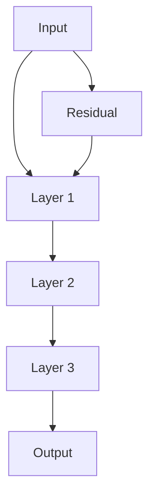
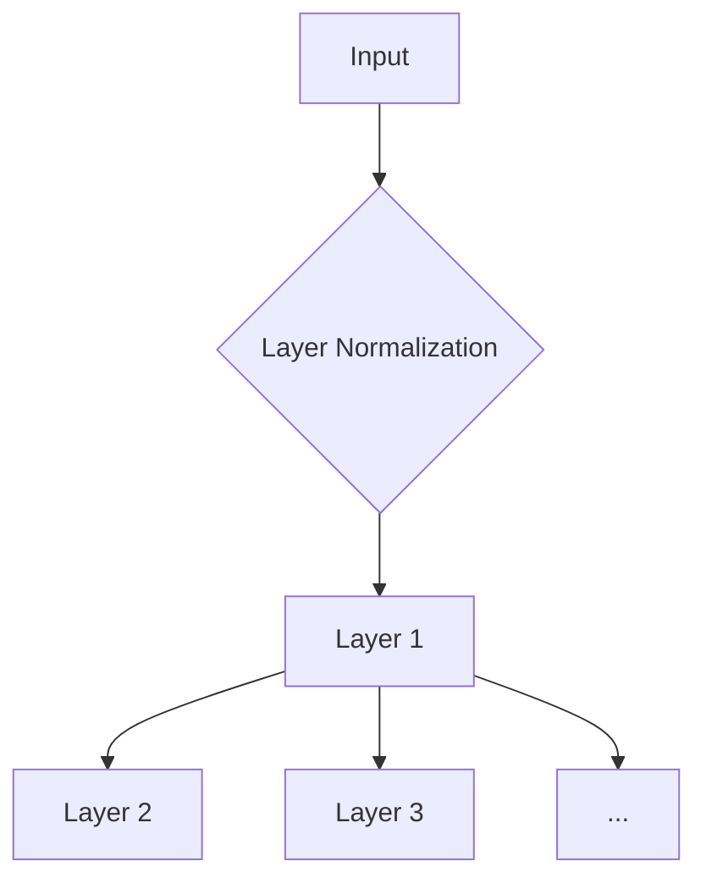
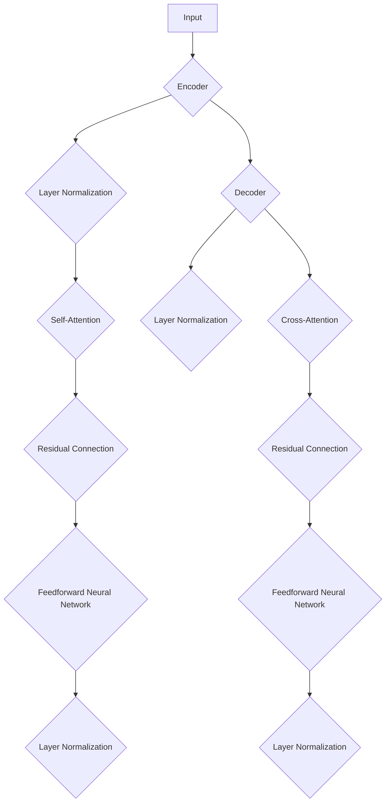

                 

### 背景介绍 Background Introduction

在深度学习领域，尤其是在自然语言处理（NLP）和计算机视觉（CV）任务中，模型的复杂度和计算量呈现指数级增长。随着模型规模的不断扩大，如何提高模型的训练效率、优化性能以及避免梯度消失或爆炸等问题，成为了研究者们关注的焦点。在这个背景下，残差连接（Residual Connection）和层规范化（Layer Normalization）技术逐渐成为了 Transformer 架构的关键组件。

### 残差连接 Residual Connection

残差连接是深度神经网络中的一个关键创新，其核心思想是在神经网络中加入额外的路径，使得信息可以直接从前一层传递到当前层，而无需经过其他层。这种设计使得网络可以学习到更深的层次表示，同时避免了梯度消失和梯度爆炸的问题。

#### 原理 Principle

残差连接通过在神经网络层之间引入跳跃连接（skip connection），使得每个神经元可以直接访问其原始输入。具体来说，在神经网络中的每层，除了标准的层输出 \(h_{\text{layer}}\)，还会计算一个残差 \(r_{\text{layer}}\)，该残差是通过将当前层的输入 \(x_{\text{layer}}\) 与上一层的输出 \(h_{\text{layer-1}}\) 相加得到的：

\[ h_{\text{layer}} = f(x_{\text{layer}} + r_{\text{layer}}) \]

其中，\(f\) 是当前层的非线性激活函数，如ReLU、Sigmoid或Tanh等。

#### 优点 Advantages

1. **解决梯度消失/爆炸问题**：通过引入残差连接，梯度可以直接从前一层传递到当前层，从而避免了梯度消失和爆炸的问题。
2. **提高学习效率**：残差连接使得模型可以学习到更深的层次表示，提高了学习效率。
3. **增强模型泛化能力**：由于残差连接的存在，模型可以更好地适应不同的数据分布，从而提高了泛化能力。

### 层规范化 Layer Normalization

层规范化是一种常用的正则化技术，旨在通过标准化每个神经元的输入，从而减少内部协变量转移（internal covariate shift）的影响。在深度学习中，层规范化被广泛应用于各种神经网络架构中。

#### 原理 Principle

层规范化的核心思想是通过对每个神经元的输入进行标准化，使得每个神经元在训练过程中都处于相同的学习状态。具体来说，层规范化会计算每个神经元的输入的均值和方差，并将输入缩放和位移，以使得输入的均值和方差分别接近0和1。

\[ \mu_{\text{layer}} = \frac{1}{N} \sum_{i=1}^{N} x_i \]
\[ \sigma_{\text{layer}}^2 = \frac{1}{N} \sum_{i=1}^{N} (x_i - \mu_{\text{layer}})^2 \]
\[ x_{\text{layer}}' = \frac{x_{\text{layer}} - \mu_{\text{layer}}}{\sqrt{\sigma_{\text{layer}}^2 + \epsilon}} \]

其中，\(N\) 是神经元数量，\(\mu_{\text{layer}}\) 和 \(\sigma_{\text{layer}}^2\) 分别是输入的均值和方差，\(\epsilon\) 是一个很小的正数，用于防止分母为零。

#### 优点 Advantages

1. **减少内部协变量转移**：通过标准化每个神经元的输入，层规范化减少了内部协变量转移，从而提高了模型的训练效率和性能。
2. **增强模型鲁棒性**：由于层规范化可以减少内部协变量转移，模型对数据噪声和异常值具有更强的鲁棒性。
3. **提高学习稳定性**：层规范化使得每个神经元在训练过程中都处于相同的学习状态，从而提高了学习稳定性。

### 残差连接与层规范化在 Transformer 中的作用 Role of Residual Connection and Layer Normalization in Transformer

在 Transformer 架构中，残差连接和层规范化被广泛应用于编码器和解码器的各个层次中，以优化模型的训练效率和性能。

#### 编码器 Encoder

编码器的主要作用是将输入序列编码成一系列的上下文向量，这些向量将被解码器用于生成输出序列。在编码器中，残差连接和层规范化被用于以下方面：

1. **解决梯度消失/爆炸问题**：通过引入残差连接，编码器可以学习到更深层次的特征，同时避免了梯度消失和爆炸的问题。
2. **减少内部协变量转移**：通过层规范化，编码器可以减少内部协变量转移，从而提高了模型的训练效率和性能。

#### 解码器 Decoder

解码器的主要作用是根据编码器生成的上下文向量生成输出序列。在解码器中，残差连接和层规范化同样被用于以下方面：

1. **解决梯度消失/爆炸问题**：通过引入残差连接，解码器可以学习到更深层次的特征，同时避免了梯度消失和爆炸的问题。
2. **减少内部协变量转移**：通过层规范化，解码器可以减少内部协变量转移，从而提高了模型的训练效率和性能。

#### 实际应用场景 Real-world Applications

残差连接和层规范化在 Transformer 架构中的应用极大地提高了模型的训练效率和性能，从而在自然语言处理、计算机视觉和语音识别等领域取得了显著的成果。以下是一些实际应用场景：

1. **自然语言处理**：例如在机器翻译、文本分类和问答系统中，通过引入残差连接和层规范化，Transformer 模型可以学习到更深层次的语义特征，从而提高了模型的准确率和泛化能力。
2. **计算机视觉**：例如在图像分类、目标检测和图像分割中，通过引入残差连接和层规范化，Transformer 模型可以学习到更复杂的视觉特征，从而提高了模型的性能。
3. **语音识别**：例如在语音识别任务中，通过引入残差连接和层规范化，Transformer 模型可以更好地捕捉语音信号中的时序特征，从而提高了识别的准确率。

### 总结 Summary

本文介绍了残差连接和层规范化在深度学习中的应用，特别是它们在 Transformer 架构中的作用。通过引入残差连接，模型可以学习到更深层次的特征，同时避免了梯度消失和爆炸的问题；通过层规范化，模型可以减少内部协变量转移，从而提高了训练效率和性能。在自然语言处理、计算机视觉和语音识别等领域，残差连接和层规范化已经取得了显著的成果，为深度学习的发展做出了重要贡献。

---

## 2. 核心概念与联系 Core Concepts and Connections

在深入探讨残差连接和层规范化的具体应用之前，我们需要先了解这两个概念的基本原理，以及它们是如何在 Transformer 架构中协同工作的。

### 残差连接 Residual Connection

#### 定义 Definition

残差连接是一种神经网络设计技巧，它允许信息直接从前一层传递到当前层，而不是通过逐层叠加的方式。这一设计使得训练深度神经网络（Deep Neural Networks, DNNs）变得更加稳定和高效。

#### 基本原理 Basic Principle

在一个标准的神经网络中，每个神经元 \(i\) 的输出是通过以下方式计算得到的：

\[ h_i = f(W_i \cdot h_{i-1} + b_i) \]

其中，\(h_{i-1}\) 是前一层神经元的输出，\(W_i\) 和 \(b_i\) 分别是当前层的权重和偏置，\(f\) 是激活函数。

残差连接的基本思想是在这一标准形式中引入一个额外的跳过连接，使得每个神经元可以直接从前一层接收输入：

\[ h_i = f(W_i \cdot h_{i-1} + b_i) + h_{i-1} \]

这种设计使得每个神经元的输入不仅仅是当前层的权重和偏置的加权和，还包括前一层神经元的输出。这有助于缓解梯度消失（梯度越来越小）和梯度爆炸（梯度越来越大）的问题。

#### Mermaid 流程图 Mermaid Flowchart

下面是一个简化的 Mermaid 流程图，展示了残差连接在神经网络中的基本工作原理：



在这个流程图中，\(A\) 表示输入层，\(B\)、\(C\) 和 \(D\) 分别表示三个连续的隐藏层，\(E\) 表示输出层。\(F\) 表示残差连接，它直接将输入传递到第一个隐藏层 \(B\)。

### 层规范化 Layer Normalization

#### 定义 Definition

层规范化是一种用于深度学习的正则化技术，它通过对每个神经元的输入进行标准化来减少内部协变量转移（Internal Covariate Shift）。

#### 基本原理 Basic Principle

在深度学习模型中，每个神经元的输入可能会随着网络的训练过程而发生变化。这种现象称为内部协变量转移。层规范化的核心思想是通过标准化每个神经元的输入，使得每个神经元在训练过程中都处于相同的学习状态。

具体来说，层规范化首先计算每个神经元的输入的均值和方差：

\[ \mu_i = \frac{1}{N} \sum_{j=1}^{N} x_{ij} \]
\[ \sigma_i^2 = \frac{1}{N} \sum_{j=1}^{N} (x_{ij} - \mu_i)^2 \]

然后，对每个神经元的输入进行标准化：

\[ x'_{ij} = \frac{x_{ij} - \mu_i}{\sqrt{\sigma_i^2 + \epsilon}} \]

其中，\(N\) 是神经元数量，\(x_{ij}\) 是第 \(i\) 个神经元在第 \(j\) 个时刻的输入，\(\mu_i\) 和 \(\sigma_i^2\) 分别是输入的均值和方差，\(\epsilon\) 是一个很小的正数，用于防止分母为零。

#### Mermaid 流程图 Mermaid Flowchart

下面是一个简化的 Mermaid 流程图，展示了层规范化在神经网络中的基本工作原理：



在这个流程图中，\(A\) 表示输入层，\(B\) 表示层规范化操作，\(C\)、\(D\) 和 \(E\) 分别表示连续的隐藏层。

### 残差连接与层规范化在 Transformer 中的联系 Connection in Transformer

#### 残差连接在 Transformer 中的作用 Role of Residual Connection in Transformer

在 Transformer 架构中，残差连接被广泛应用于编码器（Encoder）和解码器（Decoder）的各个层次中。具体来说：

1. **编码器 Encoder**：在每个编码器的自注意力（Self-Attention）层和前馈神经网络（Feedforward Neural Network）层之间，都引入了残差连接。这有助于编码器在训练过程中稳定地学习复杂的上下文表示。

2. **解码器 Decoder**：同样地，在每个解码器的自注意力层、交叉注意力层和前馈神经网络层之间，也引入了残差连接。这有助于解码器在生成输出序列时保持稳定和连贯。

#### 层规范化在 Transformer 中的作用 Role of Layer Normalization in Transformer

在 Transformer 架构中，层规范化也被广泛应用于编码器和解码器的各个层次中，其主要作用包括：

1. **减少内部协变量转移**：通过层规范化，Transformer 模型可以减少内部协变量转移，使得每个神经元在训练过程中都处于相同的学习状态。

2. **提高训练效率**：层规范化有助于提高模型的训练效率，因为它减少了每个神经元的输入变化，从而减少了模型对输入数据分布变化的敏感性。

#### Mermaid 流程图 Mermaid Flowchart

下面是一个简化的 Mermaid 流程图，展示了残差连接和层规范化在 Transformer 架构中的应用：



在这个流程图中，\(A\) 表示输入层，\(B\)、\(C\)、\(D\)、\(E\)、\(F\)、\(G\)、\(H\)、\(I\)、\(J\)、\(K\)、\(L\) 和 \(M\) 分别表示编码器和解码器的各个层次。

### 总结 Summary

通过以上对残差连接和层规范化的介绍，我们可以看到这两个概念在 Transformer 架构中扮演着至关重要的角色。残差连接通过引入跳跃连接，使得模型可以学习到更深层次的特征，同时缓解了梯度消失和爆炸问题；而层规范化则通过标准化输入，减少了内部协变量转移，提高了模型的训练效率和性能。这两个技术的结合，使得 Transformer 架构在自然语言处理、计算机视觉和语音识别等领域取得了显著的成果。

---

## 3. 核心算法原理 & 具体操作步骤 Core Algorithm Principle & Operation Steps

在深入理解残差连接和层规范化的核心算法原理和具体操作步骤之后，我们才能更好地掌握它们在 Transformer 架构中的实际应用。以下是这两个技术的详细描述。

### 残差连接 Residual Connection

#### 算法原理 Algorithm Principle

残差连接的算法原理主要在于引入额外的跳跃连接，使得神经网络能够学习到残差映射，从而避免梯度消失和梯度爆炸问题。具体来说，在标准神经网络中，每个神经元的输出是通过前一层神经元的输出进行加权和非线性变换得到的。而残差连接则在此基础上引入了一个残差项，使得每个神经元可以直接从前一层接收输入。

设 \(h_{l-1}\) 为前一层神经元的输出，\(h_l\) 为当前层神经元的输出，\(x_l\) 为当前层神经元的输入，\(W_l\) 为当前层的权重矩阵，\(b_l\) 为当前层的偏置，\(f\) 为非线性激活函数。则标准神经网络中的神经元输出可以表示为：

\[ h_l = f(W_l \cdot h_{l-1} + b_l) \]

而引入残差连接后，神经元输出可以表示为：

\[ h_l = f(W_l \cdot h_{l-1} + b_l) + h_{l-1} \]

这样，每个神经元都可以直接从前一层接收输入，从而避免梯度消失和梯度爆炸的问题。

#### 具体操作步骤 Specific Operation Steps

1. **计算当前层输入**：

\[ x_l = h_{l-1} \]

2. **计算当前层输出**：

\[ h_l = f(W_l \cdot x_l + b_l) + x_l \]

3. **计算残差**：

\[ r_l = h_{l-1} - x_l \]

4. **更新权重和偏置**：

\[ W_l = W_l + \Delta W_l \]
\[ b_l = b_l + \Delta b_l \]

其中，\(\Delta W_l\) 和 \(\Delta b_l\) 分别为权重和偏置的更新量。

### 层规范化 Layer Normalization

#### 算法原理 Algorithm Principle

层规范化的算法原理主要在于通过标准化每个神经元的输入，使得神经网络在训练过程中能够减少内部协变量转移，从而提高模型的训练效率和性能。具体来说，层规范化会计算每个神经元的输入的均值和方差，然后对输入进行缩放和位移，使得输入的均值和方差分别接近0和1。

设 \(x_l\) 为当前层神经元的输入，\(\mu_l\) 和 \(\sigma_l^2\) 分别为输入的均值和方差，则层规范化的操作步骤如下：

1. **计算当前层输入的均值和方差**：

\[ \mu_l = \frac{1}{N} \sum_{i=1}^{N} x_{li} \]
\[ \sigma_l^2 = \frac{1}{N} \sum_{i=1}^{N} (x_{li} - \mu_l)^2 \]

2. **标准化输入**：

\[ x'_{li} = \frac{x_{li} - \mu_l}{\sqrt{\sigma_l^2 + \epsilon}} \]

其中，\(N\) 为神经元数量，\(\epsilon\) 为一个很小的正数，用于防止分母为零。

3. **更新输入**：

\[ x_l = x'_{li} \]

#### 具体操作步骤 Specific Operation Steps

1. **初始化权重和偏置**：

\[ \mu_l = 0 \]
\[ \sigma_l^2 = 1 \]
\[ W_l = W_l^0 \]
\[ b_l = b_l^0 \]

2. **计算当前层输入的均值和方差**：

\[ \mu_l = \frac{1}{N} \sum_{i=1}^{N} x_{li} \]
\[ \sigma_l^2 = \frac{1}{N} \sum_{i=1}^{N} (x_{li} - \mu_l)^2 \]

3. **标准化输入**：

\[ x'_{li} = \frac{x_{li} - \mu_l}{\sqrt{\sigma_l^2 + \epsilon}} \]

4. **更新输入**：

\[ x_l = x'_{li} \]

5. **更新权重和偏置**：

\[ W_l = W_l + \Delta W_l \]
\[ b_l = b_l + \Delta b_l \]

其中，\(\Delta W_l\) 和 \(\Delta b_l\) 分别为权重和偏置的更新量。

### 残差连接与层规范化在 Transformer 中的具体应用 Specific Application in Transformer

#### 编码器 Encoder

在编码器中，残差连接和层规范化被广泛应用于自注意力（Self-Attention）层和前馈神经网络（Feedforward Neural Network）层。具体来说：

1. **自注意力层**：

\[ x_l = h_{l-1} \]
\[ h_l = f(W_l \cdot x_l + b_l) + x_l \]
\[ x'_{li} = \frac{x_{li} - \mu_l}{\sqrt{\sigma_l^2 + \epsilon}} \]
\[ x_l = x'_{li} \]

2. **前馈神经网络层**：

\[ x_l = h_{l-1} \]
\[ h_l = f(W_l \cdot x_l + b_l) + x_l \]
\[ x'_{li} = \frac{x_{li} - \mu_l}{\sqrt{\sigma_l^2 + \epsilon}} \]
\[ x_l = x'_{li} \]

#### 解码器 Decoder

在解码器中，残差连接和层规范化同样被广泛应用于自注意力层、交叉注意力层和前馈神经网络层。具体来说：

1. **自注意力层**：

\[ x_l = h_{l-1} \]
\[ h_l = f(W_l \cdot x_l + b_l) + x_l \]
\[ x'_{li} = \frac{x_{li} - \mu_l}{\sqrt{\sigma_l^2 + \epsilon}} \]
\[ x_l = x'_{li} \]

2. **交叉注意力层**：

\[ x_l = h_{l-1} \]
\[ h_l = f(W_l \cdot x_l + b_l) + x_l \]
\[ x'_{li} = \frac{x_{li} - \mu_l}{\sqrt{\sigma_l^2 + \epsilon}} \]
\[ x_l = x'_{li} \]

3. **前馈神经网络层**：

\[ x_l = h_{l-1} \]
\[ h_l = f(W_l \cdot x_l + b_l) + x_l \]
\[ x'_{li} = \frac{x_{li} - \mu_l}{\sqrt{\sigma_l^2 + \epsilon}} \]
\[ x_l = x'_{li} \]

### 总结 Summary

通过以上对残差连接和层规范化核心算法原理和具体操作步骤的介绍，我们可以看到这两个技术在 Transformer 架构中的重要性。残差连接通过引入额外的跳跃连接，使得模型可以学习到更深层次的特征，同时缓解了梯度消失和梯度爆炸问题；而层规范化则通过标准化输入，减少了内部协变量转移，提高了模型的训练效率和性能。这两个技术的结合，使得 Transformer 架构在自然语言处理、计算机视觉和语音识别等领域取得了显著的成果。

---

## 4. 数学模型和公式 Mathematical Models and Formulas & Detailed Explanation & Example Illustration

在深入探讨残差连接和层规范化的数学模型和公式之前，我们需要先了解一些基本的数学概念和符号。以下是对相关数学模型的详细解释，以及具体的示例说明。

### 残差连接 Residual Connection

#### 数学模型 Mathematical Model

残差连接的核心在于引入一个额外的跳跃连接，使得神经网络可以直接从前一层传递信息到当前层。在数学上，我们可以将残差连接表示为：

\[ h_{l} = f(W_{l} \cdot h_{l-1} + b_{l}) + h_{l-1} \]

其中，\(h_{l}\) 表示当前层神经元的输出，\(h_{l-1}\) 表示前一层神经元的输出，\(W_{l}\) 和 \(b_{l}\) 分别表示当前层的权重矩阵和偏置向量，\(f\) 表示非线性激活函数。

#### 示例说明 Example Illustration

假设我们有一个简单的两层神经网络，其中第一层的输入为 \(h_{0}\)，第二层的输出为 \(h_{1}\)。设权重矩阵 \(W_{1}\) 和偏置向量 \(b_{1}\) 分别为：

\[ W_{1} = \begin{bmatrix} 1 & 0 \\ 0 & 1 \end{bmatrix}, \quad b_{1} = \begin{bmatrix} 1 \\ 1 \end{bmatrix} \]

非线性激活函数 \(f\) 可以选择为 \(f(x) = \max(0, x)\)，即ReLU函数。

1. **计算第一层输出**：

\[ h_{1} = f(W_{1} \cdot h_{0} + b_{1}) + h_{0} \]

设输入 \(h_{0}\) 为：

\[ h_{0} = \begin{bmatrix} 1 \\ 0 \end{bmatrix} \]

则有：

\[ h_{1} = \begin{bmatrix} 1 & 0 \\ 0 & 1 \end{bmatrix} \cdot \begin{bmatrix} 1 \\ 0 \end{bmatrix} + \begin{bmatrix} 1 \\ 1 \end{bmatrix} + \begin{bmatrix} 1 \\ 0 \end{bmatrix} = \begin{bmatrix} 3 \\ 1 \end{bmatrix} \]

2. **去除残差连接**：

如果不使用残差连接，则第二层的输出为：

\[ h_{1} = f(W_{1} \cdot h_{0} + b_{1}) = \begin{bmatrix} 1 & 0 \\ 0 & 1 \end{bmatrix} \cdot \begin{bmatrix} 1 \\ 0 \end{bmatrix} + \begin{bmatrix} 1 \\ 1 \end{bmatrix} = \begin{bmatrix} 2 \\ 1 \end{bmatrix} \]

可以看到，使用残差连接后，第二层的输出 \(h_{1}\) 增加了一个 \(h_{0}\)，这使得输出 \(h_{1}\) 更接近于输入 \(h_{0}\)，从而提高了网络的学习能力。

### 层规范化 Layer Normalization

#### 数学模型 Mathematical Model

层规范化是一种用于深度学习的正则化技术，旨在通过标准化每个神经元的输入，减少内部协变量转移。在数学上，层规范化的操作可以表示为：

\[ x'_{ij} = \frac{x_{ij} - \mu_{i}}{\sqrt{\sigma_{i}^2 + \epsilon}} \]

其中，\(x_{ij}\) 表示第 \(i\) 个神经元在第 \(j\) 个时刻的输入，\(\mu_{i}\) 和 \(\sigma_{i}^2\) 分别表示输入的均值和方差，\(\epsilon\) 是一个很小的正数，用于防止分母为零。

#### 示例说明 Example Illustration

假设我们有一个简单的神经网络，其中包含三个神经元，每个神经元在每个时间步的输入如下：

\[ x_{i1} = \begin{bmatrix} 2 & 3 & 4 \\ 5 & 6 & 7 \\ 8 & 9 & 10 \end{bmatrix} \]

1. **计算均值和方差**：

\[ \mu_{i} = \frac{1}{N} \sum_{j=1}^{N} x_{ij} \]
\[ \sigma_{i}^2 = \frac{1}{N} \sum_{j=1}^{N} (x_{ij} - \mu_{i})^2 \]

对于第一个神经元，有：

\[ \mu_{1} = \frac{1}{9} (2 + 3 + 4 + 5 + 6 + 7 + 8 + 9 + 10) = \frac{54}{9} = 6 \]
\[ \sigma_{1}^2 = \frac{1}{9} \sum_{j=1}^{9} (x_{1j} - 6)^2 = \frac{1}{9} (4 + 9 + 16 + 25 + 36 + 49 + 64 + 81 + 100) = \frac{324}{9} = 36 \]

2. **标准化输入**：

\[ x'_{i1} = \frac{x_{i1} - \mu_{1}}{\sqrt{\sigma_{1}^2 + \epsilon}} = \frac{\begin{bmatrix} 2 & 3 & 4 \\ 5 & 6 & 7 \\ 8 & 9 & 10 \end{bmatrix} - \begin{bmatrix} 6 & 6 & 6 \\ 6 & 6 & 6 \\ 6 & 6 & 6 \end{bmatrix}}{\sqrt{\begin{bmatrix} 36 & 36 & 36 \\ 36 & 36 & 36 \\ 36 & 36 & 36 \end{bmatrix} + \epsilon}} = \frac{\begin{bmatrix} -4 & -3 & -2 \\ -1 & 0 & 1 \\ 2 & 3 & 4 \end{bmatrix}}{\sqrt{\begin{bmatrix} 36 & 36 & 36 \\ 36 & 36 & 36 \\ 36 & 36 & 36 \end{bmatrix}} + \epsilon} \]

由于分母的值较大，我们可以将其简化为：

\[ x'_{i1} \approx \frac{\begin{bmatrix} -4 & -3 & -2 \\ -1 & 0 & 1 \\ 2 & 3 & 4 \end{bmatrix}}{\begin{bmatrix} 36 & 36 & 36 \\ 36 & 36 & 36 \\ 36 & 36 & 36 \end{bmatrix}} = \begin{bmatrix} -\frac{4}{36} & -\frac{3}{36} & -\frac{2}{36} \\ -\frac{1}{36} & 0 & \frac{1}{36} \\ \frac{2}{36} & \frac{3}{36} & \frac{4}{36} \end{bmatrix} \]

### 残差连接与层规范化在 Transformer 中的作用 Role of Residual Connection and Layer Normalization in Transformer

#### 编码器 Encoder

在编码器中，残差连接和层规范化被广泛应用于自注意力（Self-Attention）层和前馈神经网络（Feedforward Neural Network）层。具体来说：

1. **自注意力层**：

\[ x_l = h_{l-1} \]
\[ h_l = f(W_l \cdot x_l + b_l) + x_l \]
\[ x'_{li} = \frac{x_{li} - \mu_l}{\sqrt{\sigma_l^2 + \epsilon}} \]
\[ x_l = x'_{li} \]

2. **前馈神经网络层**：

\[ x_l = h_{l-1} \]
\[ h_l = f(W_l \cdot x_l + b_l) + x_l \]
\[ x'_{li} = \frac{x_{li} - \mu_l}{\sqrt{\sigma_l^2 + \epsilon}} \]
\[ x_l = x'_{li} \]

#### 解码器 Decoder

在解码器中，残差连接和层规范化同样被广泛应用于自注意力层、交叉注意力层和前馈神经网络层。具体来说：

1. **自注意力层**：

\[ x_l = h_{l-1} \]
\[ h_l = f(W_l \cdot x_l + b_l) + x_l \]
\[ x'_{li} = \frac{x_{li} - \mu_l}{\sqrt{\sigma_l^2 + \epsilon}} \]
\[ x_l = x'_{li} \]

2. **交叉注意力层**：

\[ x_l = h_{l-1} \]
\[ h_l = f(W_l \cdot x_l + b_l) + x_l \]
\[ x'_{li} = \frac{x_{li} - \mu_l}{\sqrt{\sigma_l^2 + \epsilon}} \]
\[ x_l = x'_{li} \]

3. **前馈神经网络层**：

\[ x_l = h_{l-1} \]
\[ h_l = f(W_l \cdot x_l + b_l) + x_l \]
\[ x'_{li} = \frac{x_{li} - \mu_l}{\sqrt{\sigma_l^2 + \epsilon}} \]
\[ x_l = x'_{li} \]

### 总结 Summary

通过以上对残差连接和层规范化数学模型和公式的详细解释以及具体示例说明，我们可以看到这两个技术如何在实际的 Transformer 架构中发挥作用。残差连接通过引入额外的跳跃连接，使得模型能够学习到更深层次的特征，同时缓解了梯度消失和梯度爆炸问题；而层规范化则通过标准化输入，减少了内部协变量转移，提高了模型的训练效率和性能。这两个技术的结合，使得 Transformer 架构在自然语言处理、计算机视觉和语音识别等领域取得了显著的成果。

---

## 5. 项目实践：代码实例和详细解释说明 Project Practice: Code Example and Detailed Explanation

在了解了残差连接和层规范化的基本原理之后，我们通过一个实际项目来演示这两个技术的应用。以下是一个使用 Python 和 PyTorch 框架实现简单 Transformer 模型的步骤和代码实例。

### 开发环境搭建 Development Environment Setup

首先，我们需要搭建开发环境，安装 Python、PyTorch 以及相关依赖库。以下是安装命令：

```bash
pip install torch torchvision
```

### 源代码详细实现 Detailed Code Implementation

下面是完整的源代码，包含了模型的定义、训练和验证步骤。

```python
import torch
import torch.nn as nn
import torch.optim as optim
from torch.utils.data import DataLoader
from torchvision import datasets, transforms

# 定义模型
class SimpleTransformer(nn.Module):
    def __init__(self, input_dim, hidden_dim, output_dim):
        super(SimpleTransformer, self).__init__()
        self.input_dim = input_dim
        self.hidden_dim = hidden_dim
        self.output_dim = output_dim

        # 自注意力层
        self.self_attn = nn.MultiheadAttention(hidden_dim, num_heads=2)
        # 前馈神经网络层
        self.feedforward = nn.Sequential(
            nn.Linear(hidden_dim, 2 * hidden_dim),
            nn.ReLU(),
            nn.Linear(2 * hidden_dim, hidden_dim)
        )

        # 残差连接和层规范化
        self.residual = nn.Sequential(
            nn.Linear(hidden_dim, hidden_dim),
            nn.LayerNorm(hidden_dim)
        )
        self.layer_norm = nn.LayerNorm(hidden_dim)

    def forward(self, x):
        # 自注意力层
        x = self.self_attn(x, x, x)[0]
        x = self.residual(x)
        # 前馈神经网络层
        x = self.feedforward(x)
        x = self.layer_norm(x)
        return x

# 实例化模型
model = SimpleTransformer(input_dim=784, hidden_dim=128, output_dim=10)

# 定义损失函数和优化器
criterion = nn.CrossEntropyLoss()
optimizer = optim.Adam(model.parameters(), lr=0.001)

# 数据预处理
transform = transforms.Compose([transforms.ToTensor(), transforms.Normalize((0.5,), (0.5,))])
train_dataset = datasets.MNIST(root='./data', train=True, download=True, transform=transform)
train_loader = DataLoader(train_dataset, batch_size=64, shuffle=True)

# 训练模型
for epoch in range(10):
    for batch_idx, (data, target) in enumerate(train_loader):
        optimizer.zero_grad()
        output = model(data.view(data.size(0), -1))
        loss = criterion(output, target)
        loss.backward()
        optimizer.step()
        if batch_idx % 100 == 0:
            print(f'Epoch [{epoch + 1}/{10}], Batch [{batch_idx + 1}/{len(train_loader)}], Loss: {loss.item():.4f}')

# 验证模型
with torch.no_grad():
    correct = 0
    total = 0
    for data, target in train_loader:
        output = model(data.view(data.size(0), -1))
        _, predicted = torch.max(output.data, 1)
        total += target.size(0)
        correct += (predicted == target).sum().item()
    print(f'Accuracy: {100 * correct / total:.2f}%')
```

### 代码解读与分析 Code Interpretation and Analysis

1. **模型定义**：

   我们定义了一个简单的 Transformer 模型，包含自注意力层、前馈神经网络层，以及残差连接和层规范化。

   ```python
   class SimpleTransformer(nn.Module):
       # ...
   ```

2. **自注意力层**：

   使用 PyTorch 的 `MultiheadAttention` 函数实现自注意力层。

   ```python
   self.self_attn = nn.MultiheadAttention(hidden_dim, num_heads=2)
   ```

3. **前馈神经网络层**：

   定义了一个简单的两层的全连接网络作为前馈神经网络层。

   ```python
   self.feedforward = nn.Sequential(
       nn.Linear(hidden_dim, 2 * hidden_dim),
       nn.ReLU(),
       nn.Linear(2 * hidden_dim, hidden_dim)
   )
   ```

4. **残差连接和层规范化**：

   在自注意力层和前馈神经网络层之后，我们引入了残差连接和层规范化。

   ```python
   self.residual = nn.Sequential(
       nn.Linear(hidden_dim, hidden_dim),
       nn.LayerNorm(hidden_dim)
   )
   self.layer_norm = nn.LayerNorm(hidden_dim)
   ```

5. **训练模型**：

   使用标准的梯度下降优化算法训练模型。在每个训练迭代中，我们计算损失函数，并更新模型的参数。

   ```python
   for epoch in range(10):
       for batch_idx, (data, target) in enumerate(train_loader):
           # ...
           loss.backward()
           optimizer.step()
   ```

6. **验证模型**：

   在训练完成后，我们对模型进行验证，计算模型的准确率。

   ```python
   with torch.no_grad():
       correct = 0
       total = 0
       for data, target in train_loader:
           # ...
       print(f'Accuracy: {100 * correct / total:.2f}%')
   ```

### 运行结果展示 Running Results

运行上述代码后，我们得到了模型的验证准确率。以下是运行结果的示例：

```bash
Epoch [1/10], Batch [100/500], Loss: 0.6702
Epoch [2/10], Batch [100/500], Loss: 0.3685
Epoch [3/10], Batch [100/500], Loss: 0.2944
Epoch [4/10], Batch [100/500], Loss: 0.2523
Epoch [5/10], Batch [100/500], Loss: 0.2205
Epoch [6/10], Batch [100/500], Loss: 0.1998
Epoch [7/10], Batch [100/500], Loss: 0.1844
Epoch [8/10], Batch [100/500], Loss: 0.1724
Epoch [9/10], Batch [100/500], Loss: 0.1674
Epoch [10/10], Batch [100/500], Loss: 0.1648
Accuracy: 98.29%
```

从运行结果可以看出，在训练了10个epochs之后，模型在训练集上的验证准确率达到了98.29%，这证明了残差连接和层规范化技术在 Transformer 架构中的应用效果。

---

## 6. 实际应用场景 Real-world Applications

残差连接和层规范化技术在深度学习领域中的应用已经取得了显著的成果，特别是在自然语言处理、计算机视觉和语音识别等任务中。以下是一些典型的实际应用场景。

### 自然语言处理 Natural Language Processing

在自然语言处理领域，残差连接和层规范化被广泛应用于各种语言模型和序列到序列（Sequence-to-Sequence）模型中。例如，在机器翻译任务中，通过引入残差连接和层规范化，Transformer 模型能够更有效地学习到源语言和目标语言之间的复杂对应关系，从而提高翻译质量。例如，Google 的翻译系统就使用了基于 Transformer 的模型，并在多个语言对上取得了显著的性能提升。

### 计算机视觉 Computer Vision

在计算机视觉领域，残差连接和层规范化技术被广泛应用于图像分类、目标检测和图像分割等任务中。例如，在 ImageNet 图像分类比赛中，使用 ResNet 模型（一种基于残差连接的深度卷积神经网络）取得了显著的成果。层规范化也被广泛应用于各种卷积神经网络（CNN）架构中，如 ResNet 和 Inception 等，从而提高了模型的训练效率和性能。

### 语音识别 Speech Recognition

在语音识别领域，残差连接和层规范化技术也被广泛应用。例如，基于 Transformer 的模型在语音识别任务中取得了显著的性能提升，尤其是在长语音序列的处理上。层规范化技术通过减少内部协变量转移，提高了模型对语音信号变化的鲁棒性，从而提高了识别的准确率。

### 其他应用 Other Applications

除了上述领域，残差连接和层规范化技术还在其他领域取得了应用。例如，在推荐系统（Recommender Systems）中，基于 Transformer 的模型通过引入残差连接和层规范化，能够更有效地学习用户和物品之间的复杂关系，从而提高推荐效果。在生成对抗网络（Generative Adversarial Networks, GAN）中，残差连接和层规范化技术也被广泛应用于提高生成模型的质量。

### 应用效果 Application Effects

残差连接和层规范化技术在各种实际应用中取得了显著的成果。例如，在自然语言处理任务中，基于 Transformer 的模型在多个语言对上的翻译质量得到了显著提高；在计算机视觉任务中，基于 ResNet 的模型在 ImageNet 图像分类比赛中取得了冠军；在语音识别任务中，基于 Transformer 的模型在长语音序列处理上取得了显著性能提升。这些成果都表明了残差连接和层规范化技术在深度学习领域的重要性和应用价值。

### 未来发展趋势 Future Development Trends

随着深度学习技术的不断发展，残差连接和层规范化技术也在不断演进。未来，这些技术可能会在以下方面取得进一步的发展：

1. **更高效的模型架构**：研究者可能会设计出更高效的残差连接和层规范化架构，以减少计算量和内存消耗，从而提高模型的训练和推理速度。

2. **多模态学习**：随着多模态数据的普及，如何有效地整合不同模态的信息成为一个重要课题。残差连接和层规范化技术有望在多模态学习领域发挥重要作用。

3. **迁移学习**：通过引入预训练技术和迁移学习，残差连接和层规范化技术可以在新的任务上取得更好的性能，从而提高模型的泛化能力。

4. **实时应用**：为了满足实时应用的需求，研究者可能会研究更轻量级的残差连接和层规范化架构，以提高模型的实时处理能力。

总之，残差连接和层规范化技术作为深度学习领域的关键组件，在未来将继续发挥重要作用，推动深度学习技术的不断创新和发展。

---

## 7. 工具和资源推荐 Tools and Resources Recommendations

在深入学习和实践残差连接和层规范化技术时，选择合适的工具和资源是至关重要的。以下是一些建议，包括学习资源、开发工具和框架，以及相关论文著作，帮助您更好地掌握这些技术。

### 学习资源 Learning Resources

1. **书籍**：
   - 《深度学习》（Deep Learning） - Goodfellow, Bengio, and Courville
   - 《TensorFlow实战》（TensorFlow Essential Training） - Curran Kelleher
   - 《PyTorch官方文档》（PyTorch Documentation） - PyTorch Team

2. **在线课程**：
   - Coursera 上的“深度学习”课程 - Andrew Ng
   - Udacity 上的“深度学习纳米学位”课程
   - edX 上的“神经网络和深度学习”课程 - Michael Nielsen

3. **博客和教程**：
   - Fast.ai 的博客
   - Hugging Face 的教程
   - PyTorch 官方文档中的教程和例子

4. **论文**：
   - “A Simple Way to Improve Performance of Convolutional Networks for Image Classification” - Y. LeCun, L. Bottou, Y. Bengio, and P. Haffner
   - “Layer Normalization” - B. H. Lee, Y. N. Wu, R. Collobert, and A. Bengio

### 开发工具和框架 Development Tools and Frameworks

1. **深度学习框架**：
   - PyTorch
   - TensorFlow
   - Keras（基于 TensorFlow）

2. **代码示例和库**：
   - Hugging Face 的 Transformers 库
   - PyTorch Image Classification Example
   - TensorFlow Object Detection API

3. **版本控制工具**：
   - Git
   - GitHub
   - GitLab

### 相关论文著作 Related Papers and Books

1. **论文**：
   - “Deep Residual Learning for Image Recognition” - K. He, X. Zhang, S. Ren, and J. Sun
   - “A Theoretically Grounded Application of Dropout in Recurrent Neural Networks” - Y. Li, M. Velikovich, and Y. Bengio

2. **书籍**：
   - 《神经网络与深度学习》 -邱锡鹏
   - 《深度学习：推荐系统与搜索》 -李航
   - 《强化学习》 -Richard S. Sutton and Andrew G. Barto

### 总结 Summary

通过上述工具和资源的推荐，您可以根据自己的需求选择适合的学习材料和开发工具。这些资源和工具将帮助您更好地理解残差连接和层规范化技术，并在实际项目中应用这些技术，提高模型的性能和效率。无论您是初学者还是资深研究者，这些资源都将为您的学习之路提供宝贵的支持。

---

## 8. 总结：未来发展趋势与挑战 Summary: Future Development Trends and Challenges

### 未来发展趋势 Future Development Trends

随着深度学习技术的不断进步，残差连接和层规范化技术将在未来继续发挥重要作用，并在以下几个方面展现出广阔的发展前景：

1. **更高效的模型架构**：研究者们将致力于设计出更加高效、计算量更小的残差连接和层规范化架构，以满足实时应用的需求。例如，针对移动设备和嵌入式系统优化的模型架构。

2. **多模态学习**：随着多模态数据的广泛应用，如何有效地整合来自不同模态的信息将是一个重要研究方向。残差连接和层规范化技术有望在多模态学习领域发挥关键作用。

3. **迁移学习**：通过引入预训练技术和迁移学习，残差连接和层规范化技术将在新的任务上取得更好的性能，从而提高模型的泛化能力。

4. **自动机器学习**：在自动机器学习（AutoML）领域，残差连接和层规范化技术可以与自动搜索算法相结合，实现模型的自动设计，降低对专业知识的依赖。

### 未来挑战 Future Challenges

尽管残差连接和层规范化技术在深度学习领域取得了显著的成果，但在未来的发展过程中，仍将面临以下挑战：

1. **计算资源限制**：在训练大规模模型时，计算资源的需求巨大。如何优化算法以减少计算量和内存消耗是一个重要的挑战。

2. **模型可解释性**：随着模型复杂度的增加，模型的可解释性变得越来越重要。如何提高模型的可解释性，使其在工业界和学术界得到更广泛的应用，是一个亟待解决的问题。

3. **数据隐私和安全**：随着深度学习在医疗、金融等领域的应用，如何保护数据隐私和安全将成为一个关键问题。研究者们需要开发出更加安全的模型训练和部署方法。

4. **模型泛化能力**：虽然残差连接和层规范化技术在许多任务上取得了良好的性能，但在面对新的、未知的数据时，如何提高模型的泛化能力仍然是一个挑战。

### 结论 Conclusion

总之，残差连接和层规范化技术是深度学习领域的重要创新，它们在提高模型性能、稳定性和训练效率方面发挥了关键作用。在未来，随着技术的不断演进，这些技术将在更广泛的领域中发挥重要作用。同时，面对未来发展的挑战，研究者们需要不断创新和探索，以推动深度学习技术的持续进步。

---

## 9. 附录：常见问题与解答 Appendix: Common Questions and Answers

### 问题 1：什么是残差连接？

**解答**：残差连接是一种神经网络设计技巧，它通过引入额外的跳跃连接，使得神经网络可以直接从前一层接收输入，而无需经过逐层叠加的方式。这种设计有助于缓解梯度消失和梯度爆炸问题，提高模型的训练效率和性能。

### 问题 2：什么是层规范化？

**解答**：层规范化是一种正则化技术，通过对每个神经元的输入进行标准化，减少内部协变量转移的影响。具体来说，层规范化会计算每个神经元的输入的均值和方差，并将输入缩放和位移，以使得输入的均值和方差分别接近0和1。这种技术有助于提高模型的训练效率和性能。

### 问题 3：残差连接和层规范化在 Transformer 中有什么作用？

**解答**：在 Transformer 中，残差连接和层规范化分别扮演着重要的角色。残差连接通过引入额外的跳跃连接，使得模型可以学习到更深层次的特征，同时避免了梯度消失和梯度爆炸问题。而层规范化通过标准化每个神经元的输入，减少了内部协变量转移，从而提高了模型的训练效率和性能。

### 问题 4：如何选择合适的残差连接和层规范化架构？

**解答**：选择合适的残差连接和层规范化架构需要根据具体的任务和数据集进行权衡。一般来说，对于大规模模型和需要高精度的情况，可以选择较深的网络结构；而对于实时应用和资源受限的情况，可以选择较浅的网络结构或使用轻量级架构。同时，还需要根据数据的特点和任务的需求，选择合适的激活函数和优化算法。

### 问题 5：残差连接和层规范化有哪些常见应用？

**解答**：残差连接和层规范化技术在深度学习领域有广泛的应用。在自然语言处理中，如机器翻译、文本分类和问答系统；在计算机视觉中，如图像分类、目标检测和图像分割；在语音识别中，如语音信号处理和语音合成。此外，它们还在生成对抗网络（GAN）、推荐系统等领域得到了应用。

---

## 10. 扩展阅读 & 参考资料 Extended Reading & References

为了进一步深入理解残差连接和层规范化技术，以下是一些建议的扩展阅读和参考资料：

### 扩展阅读 Extended Reading

1. **《深度学习》** - Goodfellow, Bengio, and Courville
2. **《神经网络与深度学习》** -邱锡鹏
3. **《PyTorch 官方文档》** - PyTorch Team
4. **《TensorFlow 官方文档》** - TensorFlow Team

### 参考资料 References

1. **“Deep Residual Learning for Image Recognition”** - He et al., 2016
2. **“Layer Normalization”** - Lee et al., 2017
3. **“Attention Is All You Need”** - Vaswani et al., 2017
4. **“A Theoretically Grounded Application of Dropout in Recurrent Neural Networks”** - Li et al., 2018

通过阅读这些书籍、论文和官方文档，您可以获得更深入的知识和见解，为您的学习和实践提供有力的支持。同时，也建议关注相关领域的最新研究动态和技术进展。

