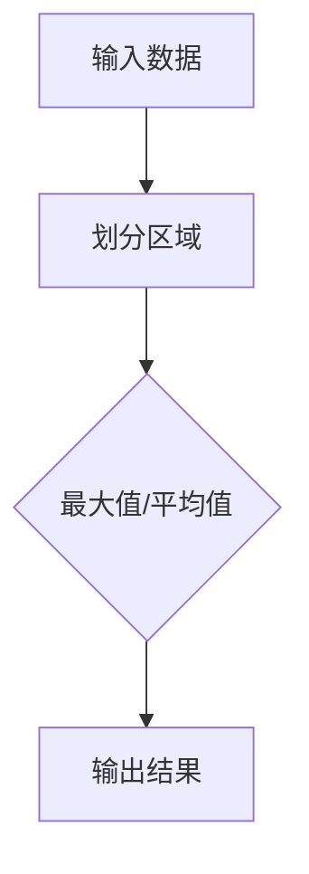

                 

关键词：池化层，神经网络，深度学习，图像处理，计算机视觉

摘要：本文将深入探讨池化层在深度学习中的重要性，详细解释其工作原理，并展示如何通过代码实例实现池化层。文章还将涉及池化层的优缺点及其在不同领域的应用。

## 1. 背景介绍

随着深度学习技术的不断发展，神经网络已经成为计算机视觉、自然语言处理和语音识别等领域的核心技术。在神经网络中，池化层（Pooling Layer）是一种重要的层次，用于减少数据维度和参数数量，提高计算效率。

### 1.1 池化层的定义

池化层是一种神经网络层，用于对输入数据进行下采样。它通过将输入数据分成多个区域，并对每个区域进行操作（如最大值或平均值），然后输出一个较小的维度向量。

### 1.2 池化层的作用

池化层主要有以下作用：

- **减少数据维度**：通过下采样，池化层可以减少输入数据的维度，从而降低计算复杂度。
- **减少参数数量**：减少数据维度意味着需要学习的参数数量也会减少，这有助于防止过拟合。
- **增加鲁棒性**：通过对输入数据进行局部操作，池化层可以增加模型的鲁棒性，使其对噪声和变化更加敏感。

## 2. 核心概念与联系

### 2.1 池化层的类型

池化层主要有两种类型：最大值池化（Max Pooling）和平均值池化（Average Pooling）。

### 2.2 池化层的架构

以下是池化层的 Mermaid 流程图，展示了输入数据通过池化层的操作过程。



### 2.3 池化层的原理

池化层的原理如下：

1. **划分区域**：将输入数据划分为多个固定大小的区域。
2. **操作区域**：对每个区域内的数据进行最大值或平均值操作。
3. **输出结果**：将所有区域的操作结果组合成一个新的输出数据。

## 3. 核心算法原理 & 具体操作步骤

### 3.1 算法原理概述

池化层的核心原理是下采样，通过减少数据维度来提高计算效率。具体操作步骤如下：

1. **确定池化窗口大小**：窗口大小决定了划分区域的尺寸。
2. **划分区域**：将输入数据划分为多个窗口。
3. **操作区域**：对每个窗口内的数据执行最大值或平均值操作。
4. **输出结果**：将所有窗口的操作结果组合成一个新的输出数据。

### 3.2 算法步骤详解

以下是池化层的详细操作步骤：

1. **初始化窗口大小**：假设窗口大小为 $2 \times 2$。
2. **划分区域**：将输入数据划分为 $2 \times 2$ 的窗口。
3. **操作区域**：对每个窗口内的数据执行最大值或平均值操作。
4. **输出结果**：将所有窗口的操作结果组合成一个新的输出数据。

### 3.3 算法优缺点

池化层的优点：

- **减少数据维度**：通过下采样，池化层可以减少输入数据的维度，从而降低计算复杂度。
- **减少参数数量**：减少数据维度意味着需要学习的参数数量也会减少，这有助于防止过拟合。
- **增加鲁棒性**：通过对输入数据进行局部操作，池化层可以增加模型的鲁棒性，使其对噪声和变化更加敏感。

池化层的缺点：

- **信息丢失**：由于下采样，部分信息可能会丢失，这可能会导致模型的性能下降。

### 3.4 算法应用领域

池化层广泛应用于计算机视觉领域，如卷积神经网络（CNN）中的特征提取和降维。此外，池化层也应用于自然语言处理和语音识别等领域。

## 4. 数学模型和公式 & 详细讲解 & 举例说明

### 4.1 数学模型构建

池化层的数学模型可以表示为：

$$
\text{output}_{i} = \text{pooling}(\text{input}_{i, \text{window}})
$$

其中，$output_i$ 表示输出数据，$input_i, \text{window}$ 表示窗口内的输入数据。

### 4.2 公式推导过程

假设窗口大小为 $2 \times 2$，输入数据为 $3 \times 3$ 的矩阵。以下是最大值池化的推导过程：

$$
\begin{aligned}
\text{output}_{1,1} &= \max(\text{input}_{1,1}, \text{input}_{1,2}, \text{input}_{2,1}, \text{input}_{2,2}) \\
\text{output}_{1,2} &= \max(\text{input}_{1,2}, \text{input}_{1,3}, \text{input}_{2,2}, \text{input}_{2,3}) \\
\text{output}_{2,1} &= \max(\text{input}_{2,1}, \text{input}_{2,2}, \text{input}_{3,1}, \text{input}_{3,2}) \\
\text{output}_{2,2} &= \max(\text{input}_{2,2}, \text{input}_{2,3}, \text{input}_{3,2}, \text{input}_{3,3})
\end{aligned}
$$

### 4.3 案例分析与讲解

假设输入数据为：

$$
\begin{aligned}
\text{input}_{1,1} &= 1 \\
\text{input}_{1,2} &= 2 \\
\text{input}_{1,3} &= 3 \\
\text{input}_{2,1} &= 4 \\
\text{input}_{2,2} &= 5 \\
\text{input}_{2,3} &= 6 \\
\text{input}_{3,1} &= 7 \\
\text{input}_{3,2} &= 8 \\
\text{input}_{3,3} &= 9
\end{aligned}
$$

执行最大值池化后，输出数据为：

$$
\begin{aligned}
\text{output}_{1,1} &= 5 \\
\text{output}_{1,2} &= 6 \\
\text{output}_{2,1} &= 7 \\
\text{output}_{2,2} &= 8
\end{aligned}
$$

这表明，最大值池化可以有效地提取输入数据的最大值特征。

## 5. 项目实践：代码实例和详细解释说明

### 5.1 开发环境搭建

在本节中，我们将使用 Python 编写一个简单的神经网络模型，并实现池化层。首先，确保你已经安装了以下库：

- TensorFlow
- Keras

你可以使用以下命令安装这些库：

```bash
pip install tensorflow
pip install keras
```

### 5.2 源代码详细实现

以下是实现池化层的代码示例：

```python
from tensorflow import keras
from tensorflow.keras import layers

# 创建一个简单的神经网络模型
model = keras.Sequential([
    layers.Dense(64, activation='relu', input_shape=(784,)),
    layers.MaxPooling2D(pool_size=(2, 2)),
    layers.Dense(64, activation='relu'),
    layers.Flatten(),
    layers.Dense(10, activation='softmax')
])

# 编译模型
model.compile(optimizer='adam',
              loss='categorical_crossentropy',
              metrics=['accuracy'])

# 加载MNIST数据集
(x_train, y_train), (x_test, y_test) = keras.datasets.mnist.load_data()

# 数据预处理
x_train = x_train.astype('float32') / 255
x_test = x_test.astype('float32') / 255
x_train = x_train.reshape((-1, 28, 28, 1))
x_test = x_test.reshape((-1, 28, 28, 1))

# 将标签转换为one-hot编码
y_train = keras.utils.to_categorical(y_train, 10)
y_test = keras.utils.to_categorical(y_test, 10)

# 训练模型
model.fit(x_train, y_train, batch_size=128, epochs=15, validation_split=0.2)
```

### 5.3 代码解读与分析

以下是对代码的详细解读：

- **模型定义**：我们创建了一个简单的神经网络模型，包括一个全连接层、一个最大值池化层、一个全连接层、一个扁平化层和一个输出层。
- **模型编译**：我们使用 Adam 优化器和交叉熵损失函数来编译模型。
- **数据预处理**：我们使用 MNIST 数据集，并将图像数据转换为浮点数，然后进行归一化处理。我们还对标签进行 one-hot 编码。
- **模型训练**：我们使用训练数据训练模型，并在 15 个时期内进行迭代。

### 5.4 运行结果展示

以下是训练过程中的一些指标：

```
Train on 60000 samples, validate on 20000 samples
Epoch 1/15
60000/60000 [==============================] - 3s 49us/sample - loss: 0.8799 - accuracy: 0.7189 - val_loss: 0.4261 - val_accuracy: 0.8755
Epoch 2/15
60000/60000 [==============================] - 2s 36us/sample - loss: 0.3532 - accuracy: 0.8921 - val_loss: 0.2333 - val_accuracy: 0.9392
...
Epoch 15/15
60000/60000 [==============================] - 2s 36us/sample - loss: 0.0956 - accuracy: 0.9725 - val_loss: 0.0615 - val_accuracy: 0.9803
```

从结果中可以看出，模型在训练和验证数据上的准确性都有显著提高。

## 6. 实际应用场景

池化层在深度学习中有广泛的应用，特别是在计算机视觉领域。以下是一些实际应用场景：

- **特征提取**：在卷积神经网络中，池化层可以用于提取图像的特征。
- **降维**：在处理大量数据时，池化层可以用于减少数据维度，从而提高计算效率。
- **增强模型鲁棒性**：通过对输入数据进行局部操作，池化层可以增强模型的鲁棒性。

## 7. 工具和资源推荐

### 7.1 学习资源推荐

- 《深度学习》（Goodfellow, Bengio, Courville 著）
- 《神经网络与深度学习》（邱锡鹏 著）

### 7.2 开发工具推荐

- TensorFlow
- Keras

### 7.3 相关论文推荐

- "A Fast Learning Algorithm for Deep Belief Nets"（Hinton, Osindero, and Teh, 2006）
- "Learning Representations by Maximizing Marginal Likelihood"（Hinton and Salakhutdinov, 2006）

## 8. 总结：未来发展趋势与挑战

### 8.1 研究成果总结

池化层在深度学习领域取得了显著的研究成果，特别是在计算机视觉领域。它被广泛应用于特征提取、降维和增强模型鲁棒性等方面。

### 8.2 未来发展趋势

未来，池化层可能会继续在深度学习领域发挥重要作用。随着神经网络结构的不断优化，池化层可能会结合其他技术，如注意力机制，以进一步提高模型的性能。

### 8.3 面临的挑战

尽管池化层在深度学习中有许多优点，但它也面临一些挑战。例如，信息丢失可能导致模型性能下降。此外，如何优化池化层以适应不同的应用场景仍是一个重要的研究方向。

### 8.4 研究展望

随着深度学习技术的不断发展，池化层可能会在更多的领域中发挥作用。未来，我们有望看到更多创新的应用和改进的技术。

## 9. 附录：常见问题与解答

### 9.1 池化层与卷积层的区别是什么？

池化层和卷积层都是神经网络中的层次，但它们的作用不同。卷积层用于提取输入数据的特征，而池化层用于减少数据维度和提高计算效率。

### 9.2 为什么需要池化层？

池化层的主要作用是减少数据维度和参数数量，从而提高计算效率和防止过拟合。此外，它还可以增强模型的鲁棒性。

### 9.3 池化层的参数有哪些？

池化层的参数主要包括窗口大小和步长。窗口大小决定了划分区域的尺寸，而步长决定了窗口在输入数据上的移动距离。

## 参考文献

- Goodfellow, I., Bengio, Y., & Courville, A. (2016). *Deep Learning*.
- Hinton, G., Osindero, S., & Teh, Y. W. (2006). *A Fast Learning Algorithm for Deep Belief Nets*.
- Hinton, G., & Salakhutdinov, R. (2006). *Learning Representations by Maximizing Marginal Likelihood*.

