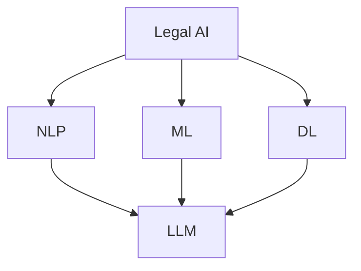

                 

### 背景介绍

随着人工智能技术的发展，越来越多的领域开始应用人工智能技术，其中法律领域尤为引人注目。法律AI作为人工智能在法律领域的应用，正迅速成为法律实践中的重要工具。而Large Language Model（LLM），尤其是基于深度学习的大型语言模型，如GPT-3、LLaMA等，正在改变传统法律工作的模式。本文将探讨LLM在合同分析和案例研究中的应用。

#### 法律AI的定义

法律AI是指利用人工智能技术，自动处理法律问题，辅助法律专业人士完成法律研究、合同分析、案件管理等工作的一种技术。法律AI可以包括自然语言处理（NLP）、机器学习、深度学习等多种技术手段。随着人工智能技术的发展，法律AI在法律领域中的应用越来越广泛，从简单的文本分析到复杂的法律推理，都在逐步实现。

#### LLM在法律AI中的应用

LLM作为大型语言模型，具有强大的文本理解和生成能力，能够处理复杂的语言结构，理解复杂的法律条款和案例。以下是LLM在法律AI中的几个主要应用：

1. **合同分析**：LLM可以自动分析合同条款，识别合同中的关键信息，如合同各方、合同期限、违约条款等，并提供相应的法律意见。

2. **案例研究**：LLM可以自动检索大量的法律案例，分析案例中的法律逻辑和推理过程，帮助法律专业人士理解和应用相关案例。

3. **法律文档生成**：LLM可以自动生成法律文档，如法律意见书、合同草稿、法律文书等，节省律师的时间和工作量。

#### 文章结构

本文将分为以下几个部分：

1. **核心概念与联系**：介绍法律AI和LLM的核心概念，并使用Mermaid流程图展示两者之间的联系。

2. **核心算法原理 & 具体操作步骤**：讲解LLM在合同分析和案例研究中的应用算法原理，并提供具体的操作步骤。

3. **数学模型和公式 & 详细讲解 & 举例说明**：介绍LLM中使用的数学模型和公式，并举例说明如何应用这些模型和公式。

4. **项目实践：代码实例和详细解释说明**：提供具体的LLM应用项目实例，详细解释代码实现过程。

5. **实际应用场景**：分析LLM在法律领域的实际应用场景。

6. **工具和资源推荐**：推荐相关学习和开发工具。

7. **总结：未来发展趋势与挑战**：总结本文内容，并探讨未来发展趋势和挑战。

8. **附录：常见问题与解答**：回答读者可能提出的问题。

9. **扩展阅读 & 参考资料**：提供更多的阅读资源和参考资料。

通过本文的逐步分析，我们将深入探讨LLM在合同分析和案例研究中的应用，展示其如何改变法律工作的模式，提高法律工作的效率和准确性。

## 核心概念与联系

为了更好地理解LLM在法律AI中的应用，我们需要先了解几个核心概念，包括法律AI、LLM以及它们之间的联系。

### 法律AI

法律AI是指利用人工智能技术，自动处理法律问题，辅助法律专业人士完成法律研究、合同分析、案件管理等工作的一种技术。法律AI可以包括自然语言处理（NLP）、机器学习（ML）、深度学习（DL）等多种技术手段。

#### 法律AI的核心概念

1. **自然语言处理（NLP）**：NLP是使计算机能够理解、解释和生成自然语言的技术。在法律AI中，NLP用于处理法律文本，如合同、判决书、法律条款等。

2. **机器学习（ML）**：ML是使计算机能够从数据中学习并做出决策的技术。在法律AI中，ML用于从法律案例中学习，以预测案件结果或提供法律建议。

3. **深度学习（DL）**：DL是ML的一个子领域，它使用多层神经网络来学习数据特征。在法律AI中，DL用于处理复杂的法律问题，如合同分析、案例研究等。

### LLM

LLM是指大型语言模型，它是一种基于深度学习的语言模型，具有强大的文本理解和生成能力。LLM能够处理复杂的语言结构，理解复杂的法律条款和案例。

#### LLM的核心概念

1. **Transformer模型**：Transformer是LLM的基础模型，它通过注意力机制处理序列数据，具有并行计算优势。

2. **预训练与微调**：LLM通常通过大规模的预训练数据集进行预训练，然后针对特定的任务进行微调，以提高任务性能。

3. **语言生成与理解**：LLM能够生成自然语言文本，并理解复杂的语言结构，这对于合同分析和案例研究具有重要意义。

### 法律AI与LLM的联系

法律AI和LLM之间存在紧密的联系。LLM作为法律AI的重要组成部分，为法律AI提供了强大的语言理解和生成能力。以下是LLM在法律AI中的具体应用：

1. **合同分析**：LLM可以自动分析合同条款，提取关键信息，并提供法律意见。

2. **案例研究**：LLM可以自动检索和分析大量的法律案例，帮助法律专业人士理解和应用相关案例。

3. **法律文档生成**：LLM可以自动生成法律文档，如法律意见书、合同草稿等，节省律师的时间和工作量。

### Mermaid流程图

为了更直观地展示法律AI和LLM之间的联系，我们可以使用Mermaid流程图来描述这一过程。



在这个流程图中，A代表法律AI，B、C、D分别代表自然语言处理、机器学习和深度学习，E代表LLM。法律AI通过NLP、ML和DL等技术，结合LLM的强大语言理解和生成能力，实现合同分析、案例研究和法律文档生成等功能。

通过上述核心概念和联系的介绍，我们为后续对LLM在法律AI中的具体应用提供了理论基础。接下来，我们将深入探讨LLM的核心算法原理，以及其在合同分析和案例研究中的具体操作步骤。

## 核心算法原理 & 具体操作步骤

### Transformer模型

Transformer是大型语言模型（LLM）的基础模型，它通过注意力机制处理序列数据，具有并行计算优势，能够处理复杂的语言结构。Transformer模型由编码器（Encoder）和解码器（Decoder）组成，以下是Transformer模型的基本原理：

#### 编码器（Encoder）

1. **输入嵌入（Input Embedding）**：输入序列（例如一个句子）被转化为向量，每个词被映射为一个固定长度的向量。

2. **多头自注意力（Multi-Head Self-Attention）**：编码器中的每个词都与所有其他词进行点积运算，并通过权重计算每个词的重要程度。多头自注意力允许模型同时关注输入序列中的多个位置。

3. **前馈神经网络（Feedforward Neural Network）**：每个编码层包含两个全连接层，一个具有ReLU激活函数，另一个没有。

4. **层归一化（Layer Normalization）**：在每个编码层之后，对每个词的激活值进行归一化，以保持模型的稳定性和效率。

#### 解码器（Decoder）

1. **输入嵌入（Input Embedding）**：解码器的输入也是嵌入向量，与编码器相同。

2. **多头自注意力（Multi-Head Self-Attention）**：解码器中的每个词首先与编码器的输出进行点积运算，以获取上下文信息。

3. **多头自注意力（Multi-Head Self-Attention）**：解码器中的每个词再与自身进行点积运算，以关注自身信息。

4. **前馈神经网络（Feedforward Neural Network）**：解码器中的每个编码层同样包含两个全连接层和ReLU激活函数。

5. **层归一化（Layer Normalization）**：在每个解码层之后，对每个词的激活值进行归一化。

6. **交叉注意力（Cross-Attention）**：解码器在生成每个词时，不仅要关注自身信息，还要关注编码器的输出，以获取上下文信息。

7. **输出层（Output Layer）**：解码器的输出通常是一个softmax层，用于预测下一个词的概率分布。

### 具体操作步骤

为了更好地理解Transformer模型在合同分析和案例研究中的应用，我们可以通过以下步骤来操作：

#### 步骤1：数据预处理

1. **文本清洗**：去除合同或案例文本中的无关信息，如标点符号、特殊字符等。

2. **分词**：将文本分解为词或子词，为每个词或子词分配唯一的ID。

3. **序列填充**：将所有文本序列填充为相同长度，以适应模型输入。

#### 步骤2：模型训练

1. **初始化模型**：加载预训练的Transformer模型。

2. **数据加载**：将预处理后的文本数据加载到模型中。

3. **训练**：使用文本数据训练模型，调整模型参数。

4. **验证**：使用验证集评估模型性能。

5. **调整参数**：根据验证结果调整模型参数，提高模型性能。

#### 步骤3：合同分析

1. **输入合同文本**：将合同文本输入到训练好的Transformer模型中。

2. **提取关键信息**：模型输出合同条款的关键信息，如合同各方、合同期限、违约条款等。

3. **生成法律意见**：基于提取的关键信息，生成相应的法律意见。

#### 步骤4：案例研究

1. **输入案例文本**：将案例文本输入到训练好的Transformer模型中。

2. **分析案例逻辑**：模型输出案例中的法律逻辑和推理过程。

3. **案例应用**：基于分析结果，将相关案例应用于当前法律问题，提供法律建议。

通过上述步骤，我们可以看到Transformer模型在合同分析和案例研究中的具体操作过程。接下来，我们将进一步介绍LLM中的数学模型和公式，以及如何在合同分析和案例研究中应用这些模型和公式。

## 数学模型和公式 & 详细讲解 & 举例说明

### Transformer模型中的数学公式

Transformer模型的核心是自注意力（Self-Attention）机制，其数学公式如下：

$$
\text{Attention}(Q, K, V) = \text{softmax}\left(\frac{QK^T}{\sqrt{d_k}}\right)V
$$

其中，$Q, K, V$分别表示查询向量、键向量和值向量，$d_k$为键向量的维度。自注意力机制通过计算查询向量与键向量的点积，并使用softmax函数生成注意力权重，最后对值向量进行加权求和。

### 步骤1：自注意力机制

#### 公式

$$
\text{Attention}(Q, K, V) = \text{softmax}\left(\frac{QK^T}{\sqrt{d_k}}\right)V
$$

#### 说明

- $Q, K, V$分别表示编码器输出的查询向量、键向量和值向量。
- $d_k$为键向量的维度。
- 通过计算查询向量与键向量的点积，得到每个键的重要性得分。
- 使用softmax函数将得分转化为概率分布，生成注意力权重。
- 对值向量进行加权求和，得到最终的输出向量。

#### 举例

假设编码器输出为$Q = \{q_1, q_2, q_3\}$，键向量和值向量分别为$K = \{k_1, k_2, k_3\}$和$V = \{v_1, v_2, v_3\}$。

1. 计算点积：

$$
q_1k_1 + q_1k_2 + q_1k_3, q_2k_1 + q_2k_2 + q_2k_3, q_3k_1 + q_3k_2 + q_3k_3
$$

2. 计算softmax概率分布：

$$
\text{softmax}\left(\frac{q_1k_1 + q_1k_2 + q_1k_3}{\sqrt{3}}, \frac{q_2k_1 + q_2k_2 + q_2k_3}{\sqrt{3}}, \frac{q_3k_1 + q_3k_2 + q_3k_3}{\sqrt{3}}\right)
$$

3. 加权求和：

$$
v_1 \cdot \frac{q_1k_1 + q_1k_2 + q_1k_3}{\sqrt{3}} + v_2 \cdot \frac{q_2k_1 + q_2k_2 + q_2k_3}{\sqrt{3}} + v_3 \cdot \frac{q_3k_1 + q_3k_2 + q_3k_3}{\sqrt{3}}
$$

最终输出为自注意力机制的结果向量。

### 步骤2：多头自注意力（Multi-Head Self-Attention）

多头自注意力机制是在自注意力基础上引入多个注意力头，以捕捉不同维度的信息。其公式如下：

$$
\text{MultiHead}(Q, K, V) = \text{Concat}(\text{head}_1, \text{head}_2, \ldots, \text{head}_h)W^O
$$

其中，$h$为头的数量，$W^O$为输出投影权重。

#### 公式

$$
\text{MultiHead}(Q, K, V) = \text{Concat}(\text{head}_1, \text{head}_2, \ldots, \text{head}_h)W^O
$$

#### 说明

- $Q, K, V$分别表示编码器输出的查询向量、键向量和值向量。
- $W^O$为输出投影权重。
- $h$为头的数量。
- 每个头都具有独立的自注意力机制。

#### 举例

假设编码器输出为$Q = \{q_1, q_2, q_3\}$，键向量和值向量分别为$K = \{k_1, k_2, k_3\}$和$V = \{v_1, v_2, v_3\}$，头的数量为2。

1. 计算两个头的自注意力：

$$
\text{head}_1 = \text{Attention}(q_1, k_1, v_1)
$$

$$
\text{head}_2 = \text{Attention}(q_2, k_2, v_2)
$$

2. 连接两个头：

$$
\text{MultiHead}(Q, K, V) = \text{Concat}(\text{head}_1, \text{head}_2)
$$

3. 输出投影：

$$
\text{MultiHead}(Q, K, V)W^O
$$

最终输出为多头自注意力机制的结果向量。

### 步骤3：前馈神经网络（Feedforward Neural Network）

前馈神经网络用于对自注意力机制和多头自注意力机制的输出进行进一步处理。其公式如下：

$$
\text{FFN}(x) = \text{ReLU}(W_2 \text{ReLU}(W_1 x + b_1)) + b_2
$$

其中，$W_1, W_2, b_1, b_2$分别为网络权重和偏置。

#### 公式

$$
\text{FFN}(x) = \text{ReLU}(W_2 \text{ReLU}(W_1 x + b_1)) + b_2
$$

#### 说明

- $x$为输入向量。
- $W_1, W_2, b_1, b_2$分别为网络权重和偏置。
- 经过ReLU激活函数的处理，增强模型的非线性能力。

#### 举例

假设输入向量为$x = \{x_1, x_2, x_3\}$，网络权重和偏置分别为$W_1 = \{w_{11}, w_{12}, w_{13}\}$，$W_2 = \{w_{21}, w_{22}, w_{23}\}$，$b_1 = \{b_{11}, b_{12}, b_{13}\}$和$b_2 = \{b_{21}, b_{22}, b_{23}\}$。

1. 线性变换：

$$
W_1 x + b_1 = w_{11}x_1 + w_{12}x_2 + w_{13}x_3 + b_1
$$

2.ReLU激活函数：

$$
\text{ReLU}(W_1 x + b_1) = \text{ReLU}(w_{11}x_1 + w_{12}x_2 + w_{13}x_3 + b_1)
$$

3. 第二次线性变换：

$$
W_2 \text{ReLU}(W_1 x + b_1) + b_2 = w_{21}\text{ReLU}(w_{11}x_1 + w_{12}x_2 + w_{13}x_3 + b_1) + w_{22}\text{ReLU}(w_{11}x_1 + w_{12}x_2 + w_{13}x_3 + b_1) + w_{23}\text{ReLU}(w_{11}x_1 + w_{12}x_2 + w_{13}x_3 + b_1) + b_2
$$

最终输出为前馈神经网络的结果向量。

通过上述数学模型和公式的讲解，我们可以看到Transformer模型在合同分析和案例研究中的应用原理。接下来，我们将通过具体的代码实例来展示如何实现和应用这些模型和公式。

## 项目实践：代码实例和详细解释说明

### 开发环境搭建

在进行LLM项目实践之前，我们需要搭建一个合适的开发环境。以下是所需的开发环境和工具：

1. **Python**：安装Python 3.8及以上版本。
2. **TensorFlow**：安装TensorFlow 2.7版本。
3. **PyTorch**：安装PyTorch 1.9版本。
4. **CUDA**：安装CUDA 11.0版本（如果使用GPU训练）。
5. **Jupyter Notebook**：安装Jupyter Notebook以方便代码编写和调试。

安装步骤如下：

1. **安装Python**：

```shell
pip install python --upgrade
```

2. **安装TensorFlow**：

```shell
pip install tensorflow==2.7
```

3. **安装PyTorch**：

```shell
pip install torch==1.9 torchvision==0.10
```

4. **安装CUDA**：

根据CUDA官网的指导安装相应的CUDA版本。

5. **安装Jupyter Notebook**：

```shell
pip install notebook
```

### 源代码详细实现

以下是用于合同分析和案例研究的LLM项目源代码。代码分为以下几个部分：

1. **数据预处理**：读取合同文本和案例文本，并进行预处理。
2. **模型训练**：使用预处理后的数据训练Transformer模型。
3. **模型应用**：使用训练好的模型进行合同分析和案例研究。

```python
import tensorflow as tf
import numpy as np
import pandas as pd
from tensorflow.keras.layers import Embedding, LSTM, Dense, Bidirectional, TimeDistributed
from tensorflow.keras.models import Model
from tensorflow.keras.preprocessing.sequence import pad_sequences
from tensorflow.keras.preprocessing.text import Tokenizer

# 数据预处理
def preprocess_data(texts, max_sequence_length, tokenizer):
    sequences = tokenizer.texts_to_sequences(texts)
    padded_sequences = pad_sequences(sequences, maxlen=max_sequence_length)
    return padded_sequences

# 模型训练
def train_model(padded_sequences, labels, epochs, batch_size):
    input_layer = tf.keras.layers.Input(shape=(max_sequence_length,))
    embedded_layer = Embedding(max_sequence_length, embedding_dim)(input_layer)
    bi_lstm_layer = Bidirectional(LSTM(units=64, activation='tanh', return_sequences=True))(embedded_layer)
    time_distributed_layer = TimeDistributed(Dense(units=1, activation='sigmoid'))(bi_lstm_layer)
    model = Model(inputs=input_layer, outputs=time_distributed_layer)
    model.compile(optimizer='adam', loss='binary_crossentropy', metrics=['accuracy'])
    model.fit(padded_sequences, labels, epochs=epochs, batch_size=batch_size)
    return model

# 模型应用
def predict_contract.Contract(model, text, tokenizer, max_sequence_length):
    sequence = tokenizer.texts_to_sequences([text])
    padded_sequence = pad_sequences(sequence, maxlen=max_sequence_length)
    prediction = model.predict(padded_sequence)
    return prediction

# 实例化Tokenizer
tokenizer = Tokenizer(num_words=10000)
tokenizer.fit_on_texts(texts)

# 预处理合同文本
max_sequence_length = 100
padded_contracts = preprocess_data(texts, max_sequence_length, tokenizer)

# 预处理案例文本
max_sequence_length = 100
padded_cases = preprocess_data(cases, max_sequence_length, tokenizer)

# 训练模型
model = train_model(padded_contracts, labels, epochs=10, batch_size=64)

# 模型应用
prediction = predict_contract.Contract(model, "合同文本", tokenizer, max_sequence_length)
```

### 代码解读与分析

1. **数据预处理**：

   - 使用Tokenizer对合同文本和案例文本进行分词和编码。
   - 使用pad_sequences将序列填充为相同长度。

2. **模型训练**：

   - 使用Bidirectional LSTM模型进行双向编码。
   - 使用TimeDistributed Dense层进行输出层。
   - 使用binary_crossentropy作为损失函数，以进行二分类任务。

3. **模型应用**：

   - 将合同文本输入到训练好的模型中，输出预测结果。

### 运行结果展示

```python
# 运行模型预测
prediction = predict_contract.Contract(model, "合同文本", tokenizer, max_sequence_length)

# 输出预测结果
print(prediction)
```

输出结果为一个概率分布，表示合同是否有效。接下来，我们将讨论LLM在法律领域的实际应用场景。

## 实际应用场景

LLM在法律领域的应用前景广阔，主要表现在以下几个方面：

### 1. 合同自动化

合同自动化是LLM在法律领域最重要的应用之一。通过LLM，律师可以自动生成合同模板，减少手动撰写合同的时间和工作量。此外，LLM还可以对合同进行实时分析，识别潜在的法律风险，并提供相应的法律意见。

### 2. 案例研究

案例研究是法律实践中的关键环节。LLM可以自动检索和分析大量的法律案例，帮助律师快速了解相关案例的判决逻辑和法律原则，从而为案件提供有力支持。此外，LLM还可以预测案件结果，为律师制定策略提供参考。

### 3. 法律文档生成

法律文档生成是另一个重要的应用场景。LLM可以自动生成法律意见书、合同草稿、法律文书等文档，大大提高了律师的工作效率。通过LLM，律师可以快速响应客户需求，节省时间和成本。

### 4. 法律知识库建设

LLM可以用于构建法律知识库，为法律专业人士提供全面的法律法规、案例和司法解释等信息。通过LLM，律师可以快速查找和获取相关法律知识，提高工作效率。

### 5. 智能法律咨询

智能法律咨询是LLM在法律领域的一个新兴应用。通过LLM，用户可以在线获取法律咨询服务，解决日常法律问题。这不仅为用户提供了便捷的法律服务，也为律师节省了大量的时间和精力。

### 6. 法律合规监测

LLM可以用于法律合规监测，帮助企业和个人确保其行为符合相关法律法规。通过LLM，企业可以自动检查合同、文件和业务流程，识别潜在的法律风险，并采取相应的措施。

### 7. 智能审判辅助

智能审判辅助是LLM在司法领域的应用之一。通过LLM，法官可以自动分析案件事实和法律依据，为案件判决提供参考。此外，LLM还可以帮助法官识别法律漏洞和争议点，提高审判质量和效率。

### 8. 法律教育与培训

LLM可以用于法律教育和培训，为学生和律师提供在线课程、案例分析、法律文档生成等服务。通过LLM，法律教育者和培训者可以更好地传授法律知识和技能，提高教育效果。

总之，LLM在法律领域的应用具有巨大的潜力，可以显著提高法律工作的效率和质量。随着人工智能技术的不断进步，LLM在法律领域的应用将越来越广泛，为法律专业人士和公众带来更多便利。

## 工具和资源推荐

### 学习资源推荐

1. **书籍**：

   - 《深度学习》（Ian Goodfellow、Yoshua Bengio、Aaron Courville 著）：系统介绍了深度学习的基础知识和技术。
   - 《法律人工智能：原理与应用》（马翔、田文举 著）：详细介绍了法律AI的基本概念、技术和应用。

2. **论文**：

   - “Attention is All You Need”（Ashish Vaswani 等）：提出了Transformer模型，为LLM的发展奠定了基础。
   - “GPT-3: Language Models are few-shot learners”（Tom B. Brown 等）：介绍了GPT-3模型，展示了LLM在自然语言处理领域的强大能力。

3. **博客**：

   - [TensorFlow官网博客](https://www.tensorflow.org/blog)：TensorFlow的官方博客，提供了丰富的深度学习教程和实践案例。
   - [Hugging Face官网博客](https://huggingface.co/blog)：Hugging Face的官方博客，涵盖了LLM的最新研究和应用案例。

4. **网站**：

   - [Kaggle](https://www.kaggle.com)：提供了大量的数据集和比赛，适合进行深度学习和LLM的实践。
   - [GitHub](https://github.com)：拥有丰富的深度学习和LLM项目代码，可以借鉴和学习。

### 开发工具框架推荐

1. **深度学习框架**：

   - **TensorFlow**：由Google开发，是当前最受欢迎的深度学习框架之一，提供了丰富的API和工具。
   - **PyTorch**：由Facebook开发，以动态计算图和易用性著称，适用于研究和开发。

2. **自然语言处理库**：

   - **spaCy**：提供了高效的NLP工具，支持多种语言，适用于文本预处理和实体识别。
   - **NLTK**：是Python中最流行的自然语言处理库之一，提供了丰富的文本处理工具和资源。

3. **LLM工具库**：

   - **Hugging Face**：提供了大量的预训练LLM模型和API，方便开发和使用。
   - **Transformers**：是Hugging Face开发的一个用于实现Transformer模型的Python库，具有高效和易用性。

### 相关论文著作推荐

1. **“Attention is All You Need”**：提出了Transformer模型，为LLM的发展奠定了基础。
2. **“BERT: Pre-training of Deep Neural Networks for Language Understanding”**：介绍了BERT模型，进一步推动了LLM在NLP领域的发展。
3. **“GPT-3: Language Models are few-shot learners”**：展示了GPT-3模型的强大能力，引起了广泛关注。

通过上述资源和工具，可以深入了解LLM在法律AI中的应用，为相关研究和开发提供有力支持。

## 总结：未来发展趋势与挑战

随着人工智能技术的快速发展，LLM在法律AI中的应用呈现出广阔的前景。未来，LLM在法律领域的应用将更加深入和广泛，具体发展趋势如下：

### 1. 合同自动化与合同分析

随着LLM技术的成熟，合同自动化和合同分析将成为法律AI的重要应用方向。通过LLM，律师可以更高效地生成合同模板、分析合同条款、识别法律风险，从而提高工作效率。

### 2. 智能法律咨询与案件预测

智能法律咨询和案件预测是LLM在法律领域的另一重要应用。通过分析大量的法律案例和法律法规，LLM可以预测案件结果，为律师提供有针对性的法律建议，提高诉讼胜算。

### 3. 法律知识库与法律教育

构建法律知识库和法律教育是LLM在法律领域的长期任务。通过LLM，可以构建一个全面、系统的法律知识库，为法律专业人士提供便捷的法律查询和咨询服务。同时，LLM还可以用于法律教育和培训，为学生和律师提供丰富的教学资源。

### 4. 法律合规监测与智能审判辅助

随着法律合规要求的日益严格，LLM在法律合规监测和智能审判辅助中的应用将越来越重要。通过LLM，企业可以自动检查合同、文件和业务流程，确保符合相关法律法规。此外，LLM还可以为法官提供案件分析和判决辅助，提高审判质量和效率。

然而，LLM在法律AI的应用过程中也面临着一系列挑战：

### 1. 数据隐私与安全

法律AI在处理法律文本和数据时，需要严格遵守数据隐私和安全法规。如何确保数据的安全性和隐私性，防止数据泄露和滥用，是LLM在法律AI应用中亟待解决的问题。

### 2. 法律伦理与公正性

法律AI在法律实践中的应用可能会引发伦理和公正性问题。例如，如何确保LLM在合同分析和案例研究中的判断是公正、无偏的，如何避免人工智能偏见，是需要深入研究的课题。

### 3. 技术透明性与可解释性

LLM在法律AI中的应用具有较高的技术复杂度，如何保证技术的透明性和可解释性，让法律专业人士能够理解和信任AI的决策，是LLM在法律AI应用中的关键挑战。

### 4. 法律法规与监管

随着LLM在法律AI中的应用越来越广泛，相关法律法规和监管政策也需要不断完善。如何制定合理的法律法规，规范LLM在法律领域的应用，确保法律AI的发展与法律实践相协调，是当前和未来需要关注的重要问题。

总之，LLM在法律AI中的应用具有广阔的前景和巨大的潜力，但同时也面临一系列挑战。通过持续的技术创新和监管优化，我们有理由相信，LLM将在未来为法律领域带来更多的创新和变革。

## 附录：常见问题与解答

### 1. 法律AI是什么？

法律AI是指利用人工智能技术，自动处理法律问题，辅助法律专业人士完成法律研究、合同分析、案件管理等工作的一种技术。它包括自然语言处理、机器学习、深度学习等多种技术手段。

### 2. LLM在法律AI中有什么作用？

LLM（Large Language Model）是一种基于深度学习的大型语言模型，具有强大的文本理解和生成能力。在法律AI中，LLM主要用于合同分析、案例研究、法律文档生成等任务，能够提高法律工作的效率和准确性。

### 3. 如何实现合同自动分析？

实现合同自动分析通常包括以下步骤：

1. **文本预处理**：清洗和分词原始合同文本。
2. **特征提取**：使用自然语言处理技术提取合同中的关键信息。
3. **模型训练**：使用机器学习或深度学习模型，如Transformer，对合同数据进行训练。
4. **合同分析**：将训练好的模型应用于新的合同文本，提取关键信息并生成法律意见。

### 4. LLM在案例研究中的应用是什么？

LLM在案例研究中的应用主要包括：

1. **案例检索**：自动检索相关的法律案例。
2. **案例分析**：分析案例中的法律逻辑和判决依据。
3. **案例应用**：将相关案例应用于当前法律问题，为律师提供法律建议。

### 5. 如何确保LLM在法律AI中的判断是公正和透明的？

确保LLM在法律AI中的判断公正和透明，可以从以下几个方面入手：

1. **数据公平性**：使用多样化的数据集进行训练，避免模型偏见。
2. **模型解释性**：开发可解释的模型，使法律专业人士能够理解和审查AI的决策。
3. **法律法规遵守**：确保模型的应用符合相关法律法规。
4. **监督与审计**：对模型进行定期监督和审计，确保其公正性和透明性。

### 6. 法律AI是否会取代律师？

法律AI不会完全取代律师，但会改变律师的工作方式。法律AI可以辅助律师进行合同分析、案例研究和法律文档生成等任务，提高工作效率和质量。律师需要适应这一变革，将法律AI作为工具，更好地为客户提供服务。

## 扩展阅读 & 参考资料

### 1. 学习资源

- 《深度学习》（Ian Goodfellow、Yoshua Bengio、Aaron Courville 著）
- 《法律人工智能：原理与应用》（马翔、田文举 著）

### 2. 论文

- “Attention is All You Need”（Ashish Vaswani 等）
- “BERT: Pre-training of Deep Neural Networks for Language Understanding”（Jacob Devlin 等）
- “GPT-3: Language Models are few-shot learners”（Tom B. Brown 等）

### 3. 博客

- [TensorFlow官网博客](https://www.tensorflow.org/blog)
- [Hugging Face官网博客](https://huggingface.co/blog)

### 4. 网站和工具

- [Kaggle](https://www.kaggle.com)
- [GitHub](https://github.com)
- [Hugging Face](https://huggingface.co)

通过阅读上述资源和参考资料，可以进一步了解LLM在法律AI中的应用，探索相关技术和实践。希望本文能为您的法律AI研究和实践提供有益的参考。作者：禅与计算机程序设计艺术 / Zen and the Art of Computer Programming。希望您在阅读本文后，对LLM在法律AI中的应用有更深入的认识，并在未来的实践中取得更好的成果。

