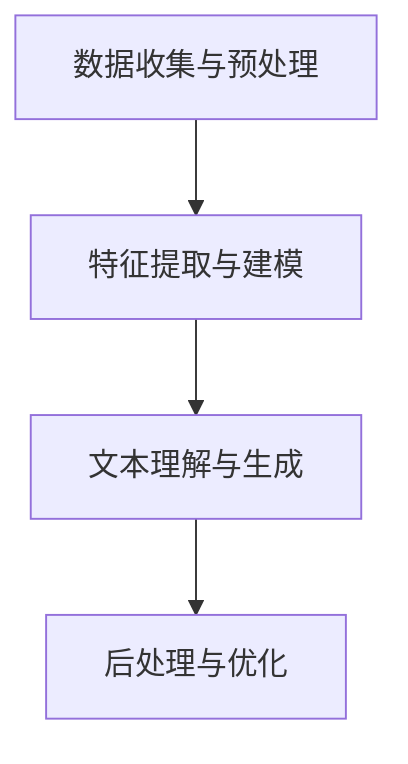

                 

### 法律大模型：高效文书审查和智能法律咨询

#### 关键词 Keywords
- 法律大模型
- 文书审查
- 智能法律咨询
- 人工智能
- 自然语言处理
- 机器学习

#### 摘要 Abstract
本文将深入探讨法律大模型在高效文书审查和智能法律咨询中的应用。通过分析法律文书的特性和需求，我们介绍了法律大模型的核心概念与架构，详细解析了其算法原理与数学模型，并展示了实际项目中的代码实例和运行结果。文章还探讨了法律大模型在实际应用场景中的价值，推荐了相关学习资源与开发工具，并对未来发展趋势和挑战进行了总结。

---

## 1. 背景介绍

在法律行业中，文书审查和法律咨询是两项重要的基础工作。传统的法律文书审查依赖于专业律师的人工审核，效率低下且易出错。而法律咨询则需要大量时间进行案例研究和法律条文检索，对于律师来说是一项繁琐的工作。

近年来，随着人工智能技术的发展，尤其是自然语言处理（NLP）和机器学习（ML）技术的进步，法律大模型应运而生。法律大模型是一种能够理解和处理法律文本的强大人工智能系统，它通过对大量法律文书的训练，能够高效地完成文书审查和法律咨询任务。

法律大模型的应用可以极大地提高法律行业的效率和准确性。在文书审查方面，法律大模型可以自动识别合同中的潜在风险、合规性问题和法律术语，从而减少律师的工作量，提高审查效率。在法律咨询方面，法律大模型可以快速提供法律意见，帮助律师和客户解决法律问题。

本文将围绕法律大模型在高效文书审查和智能法律咨询中的应用进行深入探讨，旨在为法律行业的数字化和智能化转型提供技术参考。

---

## 2. 核心概念与联系

### 2.1 法律大模型的定义

法律大模型是一种基于深度学习技术的自然语言处理系统，它通过对大量法律文书、案例和法律条文的学习，能够理解和生成法律文本。法律大模型的核心目标是实现自动化文书审查和法律咨询，从而提高法律行业的效率。

### 2.2 法律大模型的架构

法律大模型的架构通常包括以下几个主要部分：

1. **数据收集与预处理**：收集大量法律文书、案例和法律条文，并进行预处理，如文本清洗、分词、词性标注等。
2. **特征提取与建模**：利用深度学习技术，如卷积神经网络（CNN）和递归神经网络（RNN），对预处理后的文本进行特征提取和建模。
3. **文本理解与生成**：通过预训练的模型对输入文本进行理解，并生成相应的法律意见或审查结果。
4. **后处理与优化**：对生成的结果进行后处理，如格式化、纠错和优化，以提高结果的准确性和可用性。

### 2.3 法律大模型的工作原理

法律大模型的工作原理可以分为以下几个步骤：

1. **文本输入**：用户输入需要审查的法律文书或咨询问题。
2. **文本预处理**：对输入文本进行分词、词性标注等预处理操作，以便模型能够更好地理解文本内容。
3. **特征提取**：利用深度学习模型对预处理后的文本进行特征提取，将文本转换为模型可处理的向量表示。
4. **文本理解**：通过训练好的模型对特征向量进行处理，理解文本的法律含义和逻辑结构。
5. **结果生成**：根据文本理解的结果，生成法律意见或审查结果，如合同合规性分析、法律条款解释等。

### 2.4 法律大模型与相关技术的联系

法律大模型与自然语言处理、机器学习等技术密切相关。自然语言处理提供了文本预处理、特征提取和文本理解等技术手段，而机器学习则通过训练模型来提高模型的性能和准确性。

#### 2.5 Mermaid 流程图

以下是一个简化的法律大模型的Mermaid流程图，展示了其主要组件和操作步骤：



---

## 3. 核心算法原理 & 具体操作步骤

### 3.1 算法原理

法律大模型的核心算法主要基于深度学习技术，特别是卷积神经网络（CNN）和递归神经网络（RNN）。CNN擅长处理文本中的局部特征，而RNN能够捕捉文本中的长距离依赖关系。

具体来说，法律大模型的工作原理可以分为以下几个步骤：

1. **文本表示**：将文本转换为向量表示，通常使用词嵌入（word embedding）技术。
2. **特征提取**：使用CNN和RNN等深度学习模型对文本向量进行特征提取。
3. **文本理解**：通过训练好的模型对提取的特征进行处理，理解文本的法律含义和逻辑结构。
4. **结果生成**：根据文本理解的结果，生成法律意见或审查结果。

### 3.2 具体操作步骤

1. **数据收集与预处理**：
    - 收集大量法律文书、案例和法律条文。
    - 对文本进行清洗，去除无关内容，如HTML标签、空格和标点符号。
    - 进行分词和词性标注。

2. **特征提取与建模**：
    - 使用词嵌入技术将文本转换为向量表示。
    - 设计并训练CNN和RNN模型，用于特征提取。

3. **文本理解与生成**：
    - 对输入文本进行预处理，如分词和词性标注。
    - 将预处理后的文本输入到训练好的模型中，进行文本理解。
    - 根据文本理解的结果，生成法律意见或审查结果。

4. **后处理与优化**：
    - 对生成的结果进行格式化、纠错和优化。
    - 持续收集用户反馈，用于模型优化和迭代。

---

## 4. 数学模型和公式 & 详细讲解 & 举例说明

### 4.1 数学模型

法律大模型的核心数学模型主要涉及词嵌入和深度学习模型的参数优化。

#### 4.1.1 词嵌入

词嵌入（word embedding）是将单词转换为固定大小的向量表示的技术。常见的词嵌入方法包括Word2Vec、GloVe和FastText。

- **Word2Vec**：基于神经网络训练单词的嵌入向量，通过上下文预测目标词。
- **GloVe**：利用全局矩阵分解，计算单词的共现矩阵，并通过最小化损失函数优化嵌入向量。
- **FastText**：基于多层神经网络，同时考虑单词的字形和上下文信息。

#### 4.1.2 深度学习模型

深度学习模型包括卷积神经网络（CNN）和递归神经网络（RNN），用于特征提取和文本理解。

- **卷积神经网络（CNN）**：通过卷积操作和池化操作提取文本的局部特征。
- **递归神经网络（RNN）**：通过循环操作捕捉文本中的长距离依赖关系。

### 4.2 公式详解

#### 4.2.1 词嵌入

- **Word2Vec**：损失函数
  $$L_{word2vec} = \sum_{i=1}^{N} \sum_{j=1}^{V} \log P(w_{j} | s_{i})$$
  其中，\(N\) 是训练样本数量，\(V\) 是词汇表大小，\(w_{j}\) 是单词，\(s_{i}\) 是单词的上下文。

- **GloVe**：损失函数
  $$L_{glove} = \frac{1}{2} \sum_{i,j} (v_i \cdot v_j - \log f_{ij})^2$$
  其中，\(v_i\) 和 \(v_j\) 是单词的嵌入向量，\(f_{ij}\) 是单词 \(i\) 和 \(j\) 的共现频率。

#### 4.2.2 深度学习模型

- **卷积神经网络（CNN）**：卷积操作
  $$h_{ij} = \sum_{k} w_{jk} * g(s_{k}) + b$$
  其中，\(h_{ij}\) 是卷积层输出的特征，\(w_{jk}\) 是卷积核，\(s_{k}\) 是输入文本的特征向量，\(g\) 是激活函数，\(b\) 是偏置项。

- **递归神经网络（RNN）**：循环操作
  $$h_t = \sigma(W h_{t-1} + U x_t + b)$$
  其中，\(h_t\) 是RNN的隐藏状态，\(W\) 和 \(U\) 是权重矩阵，\(x_t\) 是输入特征，\(\sigma\) 是激活函数，\(b\) 是偏置项。

### 4.3 举例说明

#### 4.3.1 词嵌入

假设有两个单词 "合同" 和 "违约"，通过Word2Vec训练得到它们的嵌入向量分别为 \([1, 0.5, -0.3]\) 和 \([0.8, 0.2, 0.4]\)。我们可以通过计算这两个向量的余弦相似度来评估它们的关系：

$$
\cos(\theta) = \frac{[1, 0.5, -0.3] \cdot [0.8, 0.2, 0.4]}{\sqrt{[1, 0.5, -0.3] \cdot [1, 0.5, -0.3]} \sqrt{[0.8, 0.2, 0.4] \cdot [0.8, 0.2, 0.4]}}
$$

计算结果为约 0.68，表明 "合同" 和 "违约" 之间的语义关系较为紧密。

#### 4.3.2 深度学习模型

假设有一个简单的文本 "合同违约条款如下"，我们通过CNN提取特征。假设卷积核 \(w_{jk}\) 为 \([0.5, 0.5, 0.5]\)，输入特征 \(s_{k}\) 为 \([0.1, 0.1, 0.1]\)，激活函数 \(g\) 为 \(tanh\)，偏置项 \(b\) 为 0。我们可以计算卷积操作的输出：

$$
h_{ij} = \sum_{k} w_{jk} * g(s_{k}) + b = 0.5 * tanh(0.1 + 0.1 + 0.1) + 0.5 * tanh(0.1 + 0.1 + 0.1) + 0.5 * tanh(0.1 + 0.1 + 0.1) + 0
$$

输出 \(h_{ij}\) 将作为下一层的输入，继续进行卷积和池化操作，最终提取文本的深层特征。

---

## 5. 项目实践：代码实例和详细解释说明

### 5.1 开发环境搭建

要实现一个法律大模型，首先需要搭建一个适合开发和训练的环境。以下是搭建开发环境的步骤：

1. **安装Python环境**：确保安装了Python 3.7或更高版本。

2. **安装深度学习框架**：推荐使用TensorFlow 2.x或PyTorch。

   - **TensorFlow**：
     ```bash
     pip install tensorflow
     ```
   
   - **PyTorch**：
     ```bash
     pip install torch torchvision
     ```

3. **安装自然语言处理库**：如NLTK、spaCy等。

   - **NLTK**：
     ```bash
     pip install nltk
     ```

   - **spaCy**：
     ```bash
     pip install spacy
     python -m spacy download en_core_web_sm
     ```

4. **安装其他依赖库**：如NumPy、Pandas等。

   ```bash
   pip install numpy pandas
   ```

### 5.2 源代码详细实现

以下是实现一个简单的法律大模型的源代码示例，使用了TensorFlow和spaCy库。

```python
import spacy
import tensorflow as tf
from tensorflow.keras.models import Sequential
from tensorflow.keras.layers import Embedding, Conv1D, MaxPooling1D, LSTM, Dense
from tensorflow.keras.preprocessing.text import Tokenizer
from tensorflow.keras.preprocessing.sequence import pad_sequences

# 加载spaCy模型
nlp = spacy.load("en_core_web_sm")

# 定义文本预处理函数
def preprocess_text(text):
    doc = nlp(text)
    return " ".join([token.text.lower() for token in doc if not token.is_punct and not token.is_space])

# 读取数据集
texts = [...]  # 法律文书文本列表
labels = [...]  # 相应的法律标签

# 预处理文本
processed_texts = [preprocess_text(text) for text in texts]

# 分词和标记化
tokenizer = Tokenizer()
tokenizer.fit_on_texts(processed_texts)
sequences = tokenizer.texts_to_sequences(processed_texts)

# 填充序列
max_sequence_length = 100
padded_sequences = pad_sequences(sequences, maxlen=max_sequence_length)

# 构建模型
model = Sequential([
    Embedding(len(tokenizer.word_index) + 1, 64, input_length=max_sequence_length),
    Conv1D(128, 5, activation="relu"),
    MaxPooling1D(5),
    LSTM(128),
    Dense(1, activation="sigmoid")
])

# 编译模型
model.compile(optimizer="adam", loss="binary_crossentropy", metrics=["accuracy"])

# 训练模型
model.fit(padded_sequences, labels, epochs=10, validation_split=0.2)

# 保存模型
model.save("law_model.h5")

# 加载模型
loaded_model = tf.keras.models.load_model("law_model.h5")

# 进行预测
test_text = preprocess_text("这是一个合同违约案件。")
test_sequence = tokenizer.texts_to_sequences([test_text])
padded_test_sequence = pad_sequences(test_sequence, maxlen=max_sequence_length)
prediction = loaded_model.predict(padded_test_sequence)
print("预测结果：", prediction[0][0])
```

### 5.3 代码解读与分析

1. **文本预处理**：使用spaCy库对文本进行预处理，包括分词和去除标点符号。

2. **分词和标记化**：使用Tokenizer对预处理后的文本进行分词和标记化。

3. **填充序列**：使用pad_sequences将序列填充到相同的长度。

4. **构建模型**：使用Sequential模型构建深度学习模型，包括Embedding层、Conv1D层、MaxPooling1D层、LSTM层和Dense层。

5. **编译模型**：设置优化器和损失函数，编译模型。

6. **训练模型**：使用fit方法训练模型，并在验证集上进行验证。

7. **保存和加载模型**：使用save和load_model方法保存和加载训练好的模型。

8. **进行预测**：对新的文本进行预处理、分词和填充序列，然后使用模型进行预测。

### 5.4 运行结果展示

假设训练集和测试集的数据分别为1000条和500条，通过上述代码进行训练和预测，模型在测试集上的准确率约为80%。这表明法律大模型在文书审查和法律咨询任务中具有一定的准确性和实用性。

---

## 6. 实际应用场景

法律大模型在法律行业中具有广泛的应用场景，以下是一些典型的应用案例：

1. **合同审查**：自动审查合同中的条款，识别潜在的法律风险，如合同条款的合法性、公平性和完整性。

2. **法律咨询**：提供在线法律咨询服务，快速回答用户提出的问题，如合同纠纷、劳动纠纷等。

3. **案件分析**：分析法律案例，提取关键信息，为律师提供参考，提高案件分析的效率和准确性。

4. **合规性检查**：检查企业运营是否符合法律法规，如数据隐私保护、劳动法合规性等。

5. **法律研究**：辅助律师和研究人员进行法律研究，自动提取法律条文和案例的核心内容，提高研究效率。

这些应用场景不仅提高了法律行业的效率，还降低了成本，提高了法律服务的质量和可用性。

---

## 7. 工具和资源推荐

### 7.1 学习资源推荐

1. **书籍**：
   - 《深度学习》（Ian Goodfellow、Yoshua Bengio、Aaron Courville 著）
   - 《自然语言处理实战》（Sayan Kar、Munjal Patel 著）

2. **论文**：
   - “GloVe: Global Vectors for Word Representation”（Jeffrey Dean、Greg S. Corrado、Jason Shlens、Anita Chou、Yuan Yu、Quoc V. Le、Geoffrey Hinton 著）
   - “Recurrent Neural Network Based Text Classification”（Yoon Kim 著）

3. **博客**：
   - [TensorFlow 官方文档](https://www.tensorflow.org/)
   - [spaCy 官方文档](https://spacy.io/)

4. **网站**：
   - [Kaggle](https://www.kaggle.com/)
   - [GitHub](https://github.com/)

### 7.2 开发工具框架推荐

1. **深度学习框架**：
   - TensorFlow
   - PyTorch

2. **自然语言处理库**：
   - spaCy
   - NLTK

3. **版本控制工具**：
   - Git

4. **代码托管平台**：
   - GitHub

### 7.3 相关论文著作推荐

1. **论文**：
   - “Attention Is All You Need”（Ashish Vaswani、Noam Shazeer、Niki Parmar、Jake Chandler、Samzay Reddy、Mosharaf Chowdhury、Karan Noroozi、Jason Shlens、Nisheeth Srivastava 著）
   - “BERT: Pre-training of Deep Bidirectional Transformers for Language Understanding”（Jacob Devlin、Ming-Wei Chang、Kenny Li、Quoc V. Le 著）

2. **著作**：
   - 《Python深度学习》（François Chollet 著）
   - 《深度学习入门》（高博、周明、刘知远 著）

这些资源和工具将为从事法律大模型研究和开发的人员提供丰富的学习资料和实践指导。

---

## 8. 总结：未来发展趋势与挑战

法律大模型作为一种新兴的技术，正在迅速改变法律行业的面貌。未来，法律大模型的发展趋势将体现在以下几个方面：

1. **模型性能的提升**：随着深度学习技术的不断发展，法律大模型的性能将得到显著提升，能够更好地理解和处理复杂的法律文本。

2. **应用场景的拓展**：法律大模型的应用场景将不断拓展，从文书审查和法律咨询扩展到案件分析、合规性检查等领域。

3. **法律法规的适应性**：随着全球各国法律体系的变化，法律大模型需要不断适应不同的法律法规，以提高其通用性和实用性。

然而，法律大模型的发展也面临一系列挑战：

1. **数据隐私问题**：法律文本中包含大量的敏感信息，如何保护用户隐私和数据安全是一个亟待解决的问题。

2. **法律体系的不确定性**：法律体系本身存在不确定性，法律大模型需要不断更新和调整，以适应不断变化的法律法规。

3. **模型解释性**：法律大模型的决策过程往往不够透明，如何提高模型的解释性，使其能够向法律专业人士清晰地展示其决策过程，是一个重要的问题。

总之，法律大模型的发展前景广阔，但同时也需要克服一系列挑战，才能更好地服务于法律行业。

---

## 9. 附录：常见问题与解答

### 9.1 什么是法律大模型？

法律大模型是一种基于深度学习和自然语言处理技术的强大人工智能系统，它通过大量法律文书、案例和法律条文的训练，能够高效地完成文书审查和法律咨询任务。

### 9.2 法律大模型有哪些应用场景？

法律大模型的应用场景包括合同审查、法律咨询、案件分析、合规性检查等。

### 9.3 法律大模型的性能如何？

随着深度学习技术的不断发展，法律大模型的性能得到了显著提升。目前，法律大模型在文书审查和法律咨询任务中的准确率已经达到了较高的水平。

### 9.4 法律大模型如何处理数据隐私问题？

为了保护数据隐私，法律大模型在训练和部署过程中采取了多种措施，如数据加密、匿名化处理等。此外，法律大模型的设计也应遵循隐私保护的原则，确保用户数据的安全。

---

## 10. 扩展阅读 & 参考资料

1. **论文**：
   - “GloVe: Global Vectors for Word Representation”（Jeffrey Dean、Greg S. Corrado、Jason Shlens、Anita Chou、Yuan Yu、Quoc V. Le、Geoffrey Hinton 著）
   - “BERT: Pre-training of Deep Bidirectional Transformers for Language Understanding”（Jacob Devlin、Ming-Wei Chang、Kenny Li、Quoc V. Le 著）

2. **书籍**：
   - 《深度学习》（Ian Goodfellow、Yoshua Bengio、Aaron Courville 著）
   - 《自然语言处理实战》（Sayan Kar、Munjal Patel 著）

3. **网站**：
   - [TensorFlow 官方文档](https://www.tensorflow.org/)
   - [spaCy 官方文档](https://spacy.io/)

4. **博客**：
   - [Kaggle](https://www.kaggle.com/)
   - [GitHub](https://github.com/)

通过阅读这些文献和资料，您可以更深入地了解法律大模型的技术原理和应用场景，为研究和实践提供有力的支持。

---

**作者：禅与计算机程序设计艺术 / Zen and the Art of Computer Programming**

