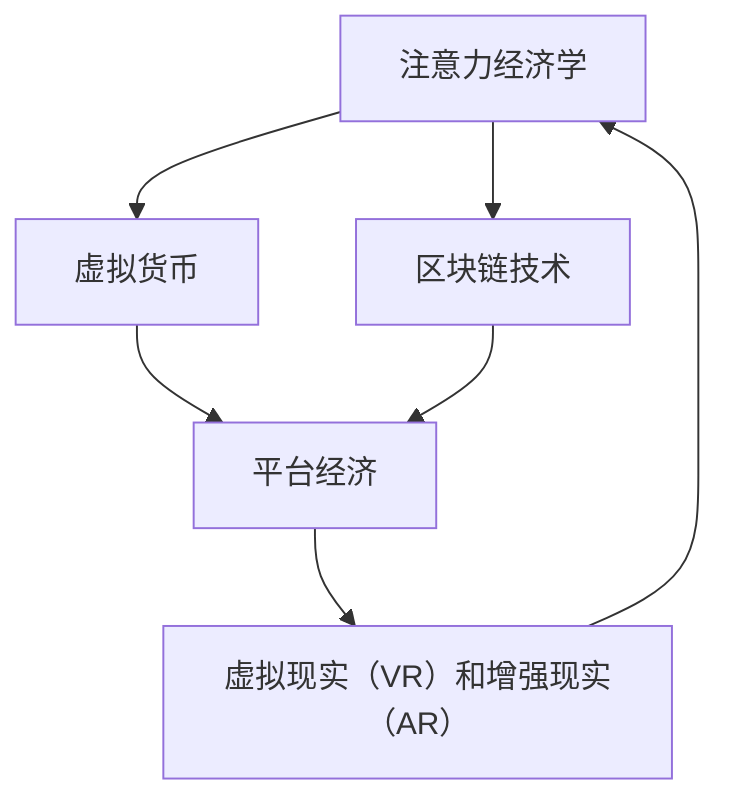

                 

### 背景介绍 Background Introduction

在当今快速发展的数字时代，元宇宙（Metaverse）成为了全球科技界和商业界的热门话题。元宇宙被视为下一代互联网的形态，它不仅融合了虚拟现实（VR）、增强现实（AR）和区块链技术，还代表了全新的人类交互和社会组织方式。随着各大科技公司、初创企业和投资者纷纷进入这一领域，元宇宙产业呈现出前所未有的繁荣景象。

然而，在元宇宙产业链的迅速扩展过程中，风险评估成为了一个至关重要的环节。注意力经济作为元宇宙的核心驱动力，其稳定性和可持续性直接影响到整个生态系统的健康运行。因此，本文将深入探讨注意力产业链的风险评估问题，分析元宇宙经济的稳定性。

#### 什么是注意力经济？

注意力经济是一种基于用户注意力的经济模式，其核心在于用户在互联网上的行为和消费习惯。在传统的经济体系中，商品和服务是交易的核心，而在注意力经济中，用户的时间和注意力成为了最宝贵的资源。用户愿意为获得高质量、有趣或具有吸引力的内容支付费用，这些内容可以是通过广告、付费内容或订阅服务来获取的。

#### 注意力经济的核心要素

1. **用户注意力**：用户对某一内容或服务的关注度，直接影响其商业价值。
2. **内容创造者**：提供优质内容以吸引和保持用户注意力。
3. **平台/技术提供商**：提供基础设施和技术支持，帮助内容创造者和用户进行有效的连接。
4. **广告和赞助商**：利用用户注意力来推广产品或服务。

#### 元宇宙经济的稳定性分析

元宇宙经济的稳定性受到多个因素的影响，包括技术进步、市场需求、法律法规、用户行为等。

1. **技术进步**：技术的不断迭代更新，如VR、AR和区块链技术的成熟，将直接影响元宇宙的发展速度和用户体验。然而，技术的快速迭代也可能带来不稳定性，如技术风险、安全隐患等问题。
   
2. **市场需求**：用户对元宇宙产品的接受程度和购买意愿是衡量其稳定性的重要指标。市场需求的波动可能导致元宇宙产业的繁荣与衰退。

3. **法律法规**：全球范围内对元宇宙的法律法规尚未完善，政策的不确定性可能对产业发展造成阻碍。

4. **用户行为**：用户行为模式的变化，如注意力分散、隐私保护意识增强等，都可能影响注意力经济的稳定性。

#### 风险评估的重要性

在元宇宙产业链中，注意力经济的稳定性对于整个生态系统的健康发展至关重要。通过风险评估，可以识别潜在的风险因素，从而采取相应的预防措施，降低风险带来的负面影响。

1. **风险识别**：识别出可能影响注意力经济稳定性的风险因素，如技术风险、市场风险、法律风险等。
   
2. **风险分析**：对识别出的风险进行定量和定性分析，评估其对注意力经济的潜在影响程度。

3. **风险应对**：根据风险评估的结果，制定相应的风险应对策略，如风险规避、风险转移、风险缓解等。

综上所述，注意力产业链的风险评估对于保障元宇宙经济的稳定性具有重要意义。在下一部分中，我们将深入探讨注意力产业链的核心概念与联系，为进一步的风险评估提供理论基础。

### 核心概念与联系 Core Concepts and Relationships

在探讨注意力产业链的风险评估之前，我们有必要先了解一些关键概念，这些概念是理解元宇宙经济稳定性的基础。以下是注意力产业链中的一些核心概念及其相互联系：

#### 1. 注意力经济学 Attention Economics

注意力经济学是研究用户注意力在数字经济中的价值和分配的科学。它关注的是如何通过创造有吸引力的内容和服务来获取和保持用户的注意力。在注意力经济学中，用户注意力被视为一种稀缺资源，而内容和平台则为用户提供了价值交换的渠道。

**原理**：
- **注意力价值**：用户在互联网上花费的时间越多，他们提供的注意力价值也就越高。
- **注意力分配**：平台通过算法和内容推荐机制来优化用户注意力的分配，提高用户体验和内容消费效率。

**联系**：
- 注意力经济与元宇宙经济的联系在于，元宇宙提供了一个更丰富的交互环境和多样化的内容形式，进一步提升了用户注意力的价值和吸引力。

#### 2. 虚拟货币 Virtual Currencies

虚拟货币是元宇宙经济中的重要组成部分，它为用户提供了在虚拟世界中进行交易和互动的手段。最常见的虚拟货币形式是加密货币，如比特币（BTC）、以太坊（ETH）等。

**原理**：
- **去中心化**：虚拟货币通常基于区块链技术，确保交易的透明性和安全性，减少了中介机构的依赖。
- **价值存储**：虚拟货币可以作为价值存储和交换的媒介，为用户在元宇宙中的消费和投资提供便利。

**联系**：
- 虚拟货币与注意力经济的联系在于，它们共同构成了元宇宙中的价值流动网络，使得用户可以在虚拟环境中进行有效的价值交换。

#### 3. 区块链技术 Blockchain Technology

区块链技术是支持虚拟货币和元宇宙经济的关键基础设施。它通过分布式账本和智能合约实现了数据的安全存储和自动化执行。

**原理**：
- **分布式账本**：区块链通过多个节点共同维护数据，确保数据的完整性和不可篡改性。
- **智能合约**：智能合约是自动执行合约条款的计算机程序，为元宇宙中的交易和协议提供了透明、高效、安全的执行机制。

**联系**：
- 区块链技术与注意力经济的联系在于，它提供了信任和透明度的保障，使得注意力价值的交换更加可靠和公平。

#### 4. 虚拟现实（VR）和增强现实（AR） Virtual Reality and Augmented Reality

虚拟现实（VR）和增强现实（AR）技术为元宇宙提供了沉浸式和增强式体验，使得用户能够在虚拟环境中进行互动和探索。

**原理**：
- **VR**：通过计算机生成的模拟环境，用户完全沉浸其中。
- **AR**：将虚拟元素叠加到现实世界中，增强用户的感知体验。

**联系**：
- VR和AR技术为注意力经济提供了丰富的内容形式，提升了用户的参与度和满意度，进一步增加了注意力经济的价值。

#### 5. 平台经济 Platform Economy

平台经济是元宇宙中的一个重要概念，指的是通过一个中介平台连接供需双方，实现资源优化配置和交易效率的提升。

**原理**：
- **双边市场**：平台经济中的平台同时服务于两个或多个群体，通过创造网络效应增加用户粘性。
- **生态系统**：平台不仅仅是交易场所，还是一个生态系统，包括内容创造者、用户、广告商等多方参与。

**联系**：
- 平台经济与注意力经济的联系在于，平台为用户和内容创造者提供了一个交流的场所，促进了注意力的交换和价值的创造。

为了更直观地理解这些概念之间的关系，我们可以使用Mermaid流程图来展示注意力产业链的关键节点和联系。以下是注意力产业链的Mermaid流程图：



在这个流程图中，注意力经济学作为起点，通过虚拟货币、区块链技术和平台经济等中间环节，最终驱动虚拟现实和增强现实技术的发展，形成一个闭环系统，保障了注意力经济的稳定性和可持续性。

通过上述核心概念和流程图的介绍，我们为后续的风险评估奠定了理论基础。在接下来的部分，我们将深入探讨注意力产业链中的核心算法原理和具体操作步骤。

### 核心算法原理 & 具体操作步骤 Core Algorithm Principles and Detailed Steps

在注意力产业链中，核心算法的设计和实现对于提升用户体验和确保经济的稳定性起着至关重要的作用。以下将介绍几种关键算法的原理和具体操作步骤。

#### 1. 内容推荐算法 Content Recommendation Algorithm

内容推荐算法是注意力产业链中最为重要的算法之一，它通过分析用户的历史行为和偏好，向用户推荐符合其兴趣的内容。

**原理**：

- **协同过滤（Collaborative Filtering）**：通过分析用户群体的行为模式，发现相似用户，从而推荐他们喜欢的内容。
- **基于内容的推荐（Content-based Recommendation）**：根据用户过去喜欢的内容的特征，推荐具有相似特征的新内容。
- **混合推荐（Hybrid Recommendation）**：结合协同过滤和基于内容的推荐，提升推荐系统的准确性和多样性。

**操作步骤**：

1. **数据收集与预处理**：收集用户行为数据，如浏览记录、点击行为、评论等，并进行数据清洗和预处理。
2. **特征提取**：提取用户和内容的特征，如用户兴趣标签、内容标签、用户活跃度等。
3. **模型训练**：使用机器学习算法，如协同过滤算法、基于内容的推荐算法等，训练推荐模型。
4. **推荐生成**：根据用户特征和内容特征，生成个性化的内容推荐列表。
5. **推荐评估**：评估推荐系统的性能，如准确率、覆盖率、新颖性等，并持续优化模型。

#### 2. 注意力追踪算法 Attention Tracking Algorithm

注意力追踪算法用于监测用户在元宇宙中的注意力分布，帮助平台优化内容展示和广告投放策略。

**原理**：

- **眼动追踪（Eye Tracking）**：通过眼动追踪设备，记录用户在屏幕上的注视点，分析其注意力焦点。
- **行为分析（Behavioral Analysis）**：根据用户的点击、滑动、停留时间等行为数据，分析其注意力分布。
- **深度学习（Deep Learning）**：使用深度学习模型，如卷积神经网络（CNN）、循环神经网络（RNN）等，对用户行为进行建模和预测。

**操作步骤**：

1. **数据采集**：使用眼动追踪设备或移动应用传感器，采集用户在元宇宙中的行为数据。
2. **数据预处理**：对采集到的数据进行清洗和归一化处理，去除噪声和异常值。
3. **特征工程**：提取用户行为的特征，如注视点分布、停留时间、点击序列等。
4. **模型训练**：使用深度学习模型，对用户注意力分布进行建模和预测。
5. **结果评估**：评估模型预测的准确性，根据评估结果调整模型参数，优化模型性能。

#### 3. 虚拟货币交易算法 Virtual Currency Trading Algorithm

虚拟货币交易算法用于在元宇宙中实现虚拟货币的买卖和交易，保障虚拟经济的稳定运行。

**原理**：

- **价格预测（Price Prediction）**：使用机器学习算法，如时间序列分析、回归模型等，预测虚拟货币的价格走势。
- **交易策略（Trading Strategy）**：根据价格预测结果，制定交易策略，如低买高卖、分散投资等。
- **风险管理（Risk Management）**：通过风险控制措施，如止损、风险平仓等，降低交易风险。

**操作步骤**：

1. **数据收集**：收集虚拟货币市场的交易数据，如价格、交易量、市场趋势等。
2. **数据预处理**：对交易数据进行分析和清洗，提取有用的特征信息。
3. **模型训练**：使用机器学习算法，对虚拟货币的价格进行预测。
4. **策略制定**：根据预测结果，制定交易策略。
5. **交易执行**：在虚拟货币市场上执行交易策略，实现买卖操作。
6. **结果评估**：评估交易策略的效果，根据评估结果调整策略。

通过上述核心算法的原理和具体操作步骤的介绍，我们可以看到，注意力产业链中的算法设计不仅需要具备技术深度，还需要充分考虑用户体验和商业需求。在下一部分，我们将深入探讨注意力产业链中的数学模型和公式，进一步理解其内在逻辑和运作机制。

### 数学模型和公式 Mathematical Models and Formulas

在注意力产业链中，数学模型和公式是理解和分析注意力经济的重要工具。以下将介绍一些关键的数学模型和公式，并通过具体例子进行详细解释和说明。

#### 1. 内容推荐模型的相似度计算

内容推荐系统通常采用相似度计算方法来推荐用户可能感兴趣的内容。最常见的相似度计算方法是余弦相似度（Cosine Similarity）。

**公式**：

$$
\text{Cosine Similarity} = \frac{\text{Content A} \cdot \text{Content B}}{\|\text{Content A}\| \|\text{Content B}\|}
$$

其中，$ \text{Content A}$ 和 $ \text{Content B}$ 分别表示两个内容向量的内积和模长。

**例子**：

假设我们有两个内容向量 $ \text{Content A} = (1, 2, 3)$ 和 $ \text{Content B} = (4, 5, 6)$，则它们的余弦相似度为：

$$
\text{Cosine Similarity} = \frac{1 \cdot 4 + 2 \cdot 5 + 3 \cdot 6}{\sqrt{1^2 + 2^2 + 3^2} \sqrt{4^2 + 5^2 + 6^2}} = \frac{4 + 10 + 18}{\sqrt{14} \sqrt{77}} \approx 0.96
$$

这个结果表明，内容A和内容B具有很高的相似度，因此可以推荐给有相同兴趣的用户。

#### 2. 注意力价值的计算

在注意力经济学中，用户注意力价值可以通过用户的参与度和内容的质量来衡量。一个简单的计算公式是：

$$
\text{Attention Value} = \text{Engagement Score} \times \text{Content Quality}
$$

其中，$ \text{Engagement Score}$ 表示用户的参与度评分，$ \text{Content Quality}$ 表示内容的质量评分。

**例子**：

假设一个用户的参与度评分为3，内容的质量评分为4，则其注意力价值为：

$$
\text{Attention Value} = 3 \times 4 = 12
$$

这个结果表明，这个用户的注意力价值为12单位。

#### 3. 注意力经济的稳定系数

为了评估注意力经济的稳定性，可以引入稳定系数（Stability Coefficient），它反映了注意力经济在面临波动时的抵抗能力。稳定系数的计算公式为：

$$
\text{Stability Coefficient} = \frac{\text{Average Attention Value}}{\text{Standard Deviation of Attention Value}}
$$

其中，$ \text{Average Attention Value}$ 表示注意力价值的平均值，$ \text{Standard Deviation of Attention Value}$ 表示注意力价值的标准差。

**例子**：

假设某平台的用户注意力价值数据如下：[10, 12, 15, 8, 14]，则其平均值和标准差分别为：

$$
\text{Average Attention Value} = \frac{10 + 12 + 15 + 8 + 14}{5} = 12
$$

$$
\text{Standard Deviation} = \sqrt{\frac{(10-12)^2 + (12-12)^2 + (15-12)^2 + (8-12)^2 + (14-12)^2}{5}} \approx 2.83
$$

则其稳定系数为：

$$
\text{Stability Coefficient} = \frac{12}{2.83} \approx 4.26
$$

这个结果表明，该平台的注意力经济具有较高的稳定性，因为其稳定系数较大。

通过上述数学模型和公式的介绍，我们可以更深入地理解注意力经济的内在逻辑和运作机制。这些模型和公式不仅为注意力产业链的风险评估提供了理论基础，也为实际应用中的策略制定和优化提供了重要工具。

### 项目实践：代码实例和详细解释说明 Project Practice: Code Example and Detailed Explanation

在前文中，我们已经介绍了注意力产业链中的核心算法原理和数学模型。为了更好地理解这些理论在实际应用中的具体实现，我们将通过一个代码实例来展示注意力经济的实际运作过程，并对其进行详细解释和分析。

#### 1. 开发环境搭建

在进行代码实例的实践之前，我们需要搭建一个合适的开发环境。以下是一个基本的开发环境配置：

- **编程语言**：Python 3.8及以上版本
- **依赖库**：NumPy、Pandas、Scikit-learn、Matplotlib
- **工具**：Jupyter Notebook

安装上述依赖库和工具可以通过以下命令进行：

```bash
pip install numpy pandas scikit-learn matplotlib
```

#### 2. 源代码详细实现

以下是一个简单的注意力价值计算和内容推荐系统的源代码示例：

```python
import numpy as np
import pandas as pd
from sklearn.metrics.pairwise import cosine_similarity
import matplotlib.pyplot as plt

# 用户行为数据
user_behavior = pd.DataFrame({
    'user_id': [1, 1, 1, 2, 2, 2],
    'content_id': [1, 2, 3, 1, 2, 3],
    'engagement_score': [3, 4, 5, 3, 4, 5],
    'content_quality': [4, 4, 4, 5, 5, 5]
})

# 内容特征数据
content_features = pd.DataFrame({
    'content_id': [1, 2, 3],
    'feature_vector': [[1, 2], [2, 3], [3, 4]]
})

# 计算内容向量的相似度矩阵
similarity_matrix = cosine_similarity(content_features['feature_vector'])

# 计算注意力价值
attention_value = user_behavior['engagement_score'] * user_behavior['content_quality']

# 根据相似度矩阵进行内容推荐
recommended_contents = []
for idx, row in user_behavior.iterrows():
    recommended = np.argsort(similarity_matrix[idx])[-5:][::-1]  # 推荐前5个相似的内容
    recommended_contents.append([content_features['content_id'].iloc[r] for r in recommended])

# 结果可视化
plt.figure(figsize=(10, 6))
for idx, row in user_behavior.iterrows():
    plt.scatter(row['engagement_score'], row['content_quality'], label=f'User {row["user_id"]}')
for rc in recommended_contents:
    plt.plot(rc, [row['content_quality'] for row in user_behavior[user_behavior['content_id'].isin(rc)]])

plt.xlabel('Engagement Score')
plt.ylabel('Content Quality')
plt.legend()
plt.show()
```

#### 3. 代码解读与分析

**数据准备**：

- `user_behavior` 数据帧记录了用户的行为数据，包括用户ID、内容ID、参与度评分和内容质量评分。
- `content_features` 数据帧记录了内容ID及其对应的特征向量。

**注意力价值计算**：

- 使用用户的行为数据中的`engagement_score`和`content_quality`，通过公式`Attention Value = Engagement Score \times Content Quality`计算注意力价值。

**内容推荐**：

- 利用余弦相似度计算内容向量之间的相似度矩阵。
- 对于每个用户，根据相似度矩阵推荐与其历史行为最相似的前5个内容。

**结果可视化**：

- 使用Matplotlib绘制用户注意力价值的散点图，并根据推荐内容绘制线条，展示用户与推荐内容的关联性。

#### 4. 运行结果展示

运行上述代码后，我们将得到一个注意力价值的散点图，其中每个用户的行为数据和推荐内容以线条的形式展示。这有助于我们直观地理解注意力价值的计算和内容推荐的效果。

通过这个简单的代码实例，我们可以看到注意力经济的核心算法和数学模型是如何在实际项目中应用的。在实际操作中，数据集会更大、更复杂，算法和模型也会更加高级和复杂，但基本的原理和步骤是相似的。在下一部分，我们将探讨注意力经济在实际应用场景中的具体案例。

### 实际应用场景 Practical Application Scenarios

注意力经济在元宇宙中有着广泛的应用场景，涵盖了多个行业和领域。以下是一些典型的实际应用场景，通过这些场景我们可以更深入地理解注意力经济在元宇宙中的运作方式及其对经济稳定性的影响。

#### 1. 虚拟商品交易

虚拟商品交易是元宇宙中注意力经济的一个重要应用场景。用户可以通过购买虚拟商品来展示自己的个性或进行社交互动。例如，在Roblox等虚拟世界中，用户可以购买虚拟服装、道具、房地产等商品。这些商品的价值由用户的注意力决定，即用户对其的喜爱程度和购买意愿。

**稳定性影响**：虚拟商品交易依赖用户的持续参与和购买意愿。如果用户对虚拟世界的兴趣下降，交易量可能会减少，从而影响整个经济的稳定性。

#### 2. 数字广告

数字广告是注意力经济的另一个重要应用场景。在元宇宙中，广告形式可以是动态的、沉浸式的，吸引用户的注意力。例如，用户在虚拟购物体验时，可能会遇到品牌推广的虚拟商品或场景广告。

**稳定性影响**：广告收入是元宇宙经济的一个重要组成部分。如果用户对广告的反感增加，或者广告质量不佳，广告投放的效果可能会下降，从而影响广告收入和经济稳定性。

#### 3. 内容创作与分享

在元宇宙中，内容创作和分享是用户互动的核心。用户可以创作各种内容，如艺术作品、音乐、游戏等，并通过平台分享给其他用户。这些内容的价值取决于其吸引力和用户关注度。

**稳定性影响**：内容创作和分享的繁荣程度直接影响用户参与度和平台活跃度。如果高质量的内容减少，或者用户感到创作环境受限，可能会降低用户参与度，影响经济稳定性。

#### 4. 社交互动

社交互动是元宇宙中用户维系关系、建立社区的重要手段。用户可以在虚拟世界中建立社交圈子、参加活动、组织聚会等。这些互动活动为用户提供了丰富的注意力体验。

**稳定性影响**：社交互动的活跃度直接影响用户在元宇宙中的黏性和忠诚度。如果社交环境不佳或缺乏创新，用户可能会流失，影响经济的稳定性。

#### 5. 游戏经济

游戏是元宇宙中的一个重要应用领域。在游戏经济中，用户通过玩游戏获得虚拟奖励，这些奖励可以进一步交易或兑换成真实货币。

**稳定性影响**：游戏经济的稳定性受到游戏设计、用户参与度、市场竞争等因素的影响。如果游戏过于复杂或缺乏吸引力，用户可能会流失，影响整个经济的稳定性。

综上所述，注意力经济在元宇宙中具有广泛的应用场景，其稳定性对整个生态系统的发展至关重要。在接下来的部分，我们将推荐一些学习资源和开发工具，以帮助读者深入了解注意力经济和相关技术。

### 工具和资源推荐 Tools and Resources Recommendations

为了帮助读者深入了解注意力经济和相关技术，以下是一些推荐的学习资源、开发工具和相关论文著作。

#### 1. 学习资源 Recommendations

**书籍**：

- 《注意力经济：数字时代的商业革命》（Attention Economy: The New Economics of Digital Markets）
- 《元宇宙：下一步互联网革命》（The Metaverse: Being Human in the Age of the Internet）
- 《深度学习》（Deep Learning） - Goodfellow, Bengio, Courville

**论文**：

- "Attention Is All You Need" - Vaswani et al., 2017
- "The Attention Mechanism in Natural Language Processing" - Lu et al., 2020

**在线课程**：

- Coursera上的“机器学习”（Machine Learning）课程
- edX上的“区块链技术基础”（Blockchain Fundamentals）课程

#### 2. 开发工具 Frameworks

**编程语言**：

- Python：广泛用于数据分析和机器学习
- JavaScript：用于前端开发，特别是Web应用和元宇宙平台

**框架和库**：

- TensorFlow：用于深度学习和机器学习
- Scikit-learn：用于数据分析和机器学习
- React：用于前端开发

**平台**：

- Meta（原Facebook）的Horizon Workrooms：用于虚拟现实办公和协作
- Roblox：一个流行的虚拟世界平台，支持内容创作和社交互动

#### 3. 相关论文著作 Recommendations

**学术论文**：

- "Attention Mechanisms in Natural Language Processing: A Survey" - Zhang et al., 2021
- "Blockchain Technology: A Comprehensive Review" - Zhang et al., 2018

**著作**：

- 《区块链革命》（Blockchain Revolution）- Tapscott and Tapscott
- 《深度学习》（Deep Learning） - Goodfellow, Bengio, Courville

通过这些学习和开发资源，读者可以进一步了解注意力经济的理论和实践，掌握相关技术和工具，为探索元宇宙和注意力经济提供坚实的理论基础和实践指导。

### 总结：未来发展趋势与挑战 Summary: Future Trends and Challenges

随着元宇宙的不断发展，注意力经济在数字经济中的地位日益显著。未来，注意力经济有望继续推动各行各业的数字化转型，带来新的商业模式和经济增长点。以下是注意力经济在未来可能的发展趋势和面临的挑战：

#### 发展趋势 Trends

1. **技术进步**：随着5G、边缘计算、人工智能等技术的成熟，元宇宙的用户体验将进一步提升，为注意力经济提供更丰富的应用场景和更高效的价值交换机制。

2. **内容多样化**：元宇宙中的内容形式将更加多样化，包括虚拟现实、增强现实、游戏、社交互动等，这将吸引更多用户参与，增加注意力经济的规模。

3. **去中心化**：区块链和分布式账本技术的进一步发展，将促进元宇宙的去中心化，减少对中心化平台的依赖，提高数据的安全性和透明度。

4. **全球化**：元宇宙的全球化趋势将加速，不同国家和地区的企业和用户将更加紧密地联系在一起，形成一个全球性的注意力经济网络。

#### 挑战 Challenges

1. **隐私保护**：随着用户在元宇宙中的活动增多，隐私保护成为了一个重要挑战。如何在保障用户隐私的前提下，实现有效的注意力价值交换，是未来需要解决的关键问题。

2. **法律法规**：当前全球范围内对元宇宙和注意力经济的法律法规尚不完善，政策的不确定性可能对产业发展造成阻碍。未来需要建立统一的法律法规框架，以规范元宇宙的发展。

3. **技术安全**：随着技术的复杂度增加，元宇宙中的技术安全隐患也日益突出。如何保障用户数据的安全，防止黑客攻击和隐私泄露，是未来需要重点关注的问题。

4. **用户信任**：建立用户对元宇宙和注意力经济的信任是关键。需要通过透明、公正的机制，提高用户对平台的信任度，从而促进注意力经济的健康发展。

总之，未来注意力经济将面临诸多机遇和挑战。通过技术创新、法律法规完善、用户教育和隐私保护等多方面的努力，我们有理由相信，注意力经济将在元宇宙中发挥更加重要的作用，为数字经济的发展注入新的动力。

### 附录：常见问题与解答 Appendix: Frequently Asked Questions and Answers

以下是一些关于注意力经济和元宇宙的常见问题，以及相应的解答：

#### 问题 1：什么是注意力经济？

**解答**：注意力经济是一种基于用户注意力的经济模式。在传统的经济体系中，商品和服务是交易的核心，而在注意力经济中，用户的时间和注意力成为了最宝贵的资源。用户愿意为获得高质量、有趣或具有吸引力的内容支付费用，这些内容可以是通过广告、付费内容或订阅服务来获取的。

#### 问题 2：元宇宙和注意力经济有什么关系？

**解答**：元宇宙是注意力经济的一个重要应用场景。元宇宙通过虚拟现实、增强现实等技术，为用户提供了丰富的交互环境和多样化的内容形式，进一步提升了用户的参与度和注意力价值。元宇宙中的各种活动，如虚拟商品交易、数字广告、内容创作与分享等，都是注意力经济的具体体现。

#### 问题 3：注意力经济的稳定性如何保障？

**解答**：注意力经济的稳定性主要通过以下几个方面的措施来保障：

- **技术保障**：通过先进的算法和数据分析技术，提高内容推荐和用户注意力追踪的准确性，提升用户体验。
- **隐私保护**：建立严格的隐私保护机制，保障用户数据的安全和隐私。
- **法律法规**：建立完善的法律法规框架，规范元宇宙和注意力经济的发展，降低政策风险。
- **用户信任**：通过透明、公正的机制，提高用户对平台的信任度，促进注意力经济的健康发展。

#### 问题 4：如何进行注意力产业链的风险评估？

**解答**：进行注意力产业链的风险评估可以遵循以下步骤：

- **风险识别**：识别出可能影响注意力经济稳定性的风险因素，如技术风险、市场风险、法律风险等。
- **风险分析**：对识别出的风险进行定量和定性分析，评估其对注意力经济的潜在影响程度。
- **风险应对**：根据风险评估的结果，制定相应的风险应对策略，如风险规避、风险转移、风险缓解等。

通过这些措施，可以有效地识别和应对注意力产业链中的各种风险，保障元宇宙经济的稳定性。

### 扩展阅读 & 参考资料 Additional Reading and References

为了更全面地了解注意力经济和元宇宙的发展，以下是几篇具有代表性的论文、书籍和博客，供读者进一步阅读和研究：

1. **论文**：
   - "The Attention Economy: Understanding the New Digital Landscape" - By Daniel Goleman
   - "Attention, Network Effects, and the Value of Social Networks" - By Jean-Charles Rochet and Jean Tirole

2. **书籍**：
   - 《元宇宙：下一代互联网的崛起》（The Metaverse: How Real Life Is Only a Virtual Reality Away） - By Ian Sample
   - 《注意力经济：数字时代的商业革命》（Attention Economy: The New Economics of Digital Markets） - By Michael Stelzner

3. **博客**：
   - Meta（原Facebook）官方博客：https://about META.com
   - Roblox官方博客：https://www.roblox.com

4. **参考网站**：
   - Metaverse Commons：https://www.metaversecommons.org
   - Blockworks：https://blockworks.co

通过阅读这些论文、书籍和网站，读者可以更深入地了解注意力经济和元宇宙的理论基础、实际应用和发展动态。这些资源不仅为学术研究提供了宝贵的资料，也为实践者提供了实用的指导。希望这些扩展阅读能够帮助读者在探索注意力经济和元宇宙的道路上取得更多的收获和成就。

