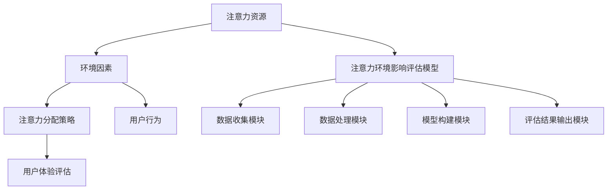

                 

### 注意力环境影响评估：元宇宙开发的生态考量

#### 背景介绍

**注意力环境影响评估**，这一概念源自于生态学研究领域，逐渐被引入到信息技术和元宇宙开发的讨论中。在元宇宙这个虚拟现实的空间中，用户的注意力资源成为了一种宝贵的资源。用户在元宇宙中的体验往往依赖于一系列的技术组件，包括但不限于虚拟现实（VR）、增强现实（AR）、区块链技术等。这些技术组件不仅塑造了元宇宙的生态，也对用户的注意力环境产生了深远的影响。

元宇宙（Metaverse）是一个集成虚拟现实、增强现实、区块链、人工智能等多种技术的虚拟空间。它不仅是互联网的延伸，更是一个人们可以在其中生活、工作、娱乐的虚拟世界。随着元宇宙的发展，如何有效管理和评估其对用户注意力环境的影响，成为一个关键问题。用户的注意力资源是有限的，如何在元宇宙中合理分配这些资源，以提升用户体验，降低疲劳感，是一个值得深入探讨的话题。

本文旨在通过逐步分析，探讨注意力环境影响评估的核心概念，并探讨其在元宇宙开发中的应用。文章将从以下几个方面展开：

1. **背景介绍**：阐述注意力环境影响评估的概念及其在元宇宙开发中的重要性。
2. **核心概念与联系**：详细解释注意力环境影响评估的相关概念，并提供一个简明的流程图。
3. **核心算法原理与具体操作步骤**：介绍用于评估注意力环境的核心算法及其应用步骤。
4. **数学模型与公式**：展示注意力环境影响评估的数学模型，并进行详细解释和举例说明。
5. **项目实践**：通过一个具体的项目实例，展示注意力环境影响评估的实际应用。
6. **实际应用场景**：探讨注意力环境影响评估在不同元宇宙应用场景中的具体作用。
7. **工具和资源推荐**：推荐相关的学习资源、开发工具和论文著作。
8. **总结**：对注意力环境影响评估的未来发展趋势和挑战进行总结。
9. **附录**：提供常见问题与解答。
10. **扩展阅读与参考资料**：列出本文中引用和参考的相关资料。

接下来，我们将深入探讨注意力环境影响评估的具体细节。

### 1. 背景介绍

#### 注意力环境影响评估的概念

**注意力环境影响评估**，简称AEIA（Attention Environment Impact Assessment），是一种用于评估技术环境（如元宇宙）对用户注意力资源影响的方法。这一概念源自于生态学中的环境影响评估（Environmental Impact Assessment, EIA），旨在通过系统分析技术环境对用户行为、感知和心理状态的影响，来评估其可持续性和用户满意度。

在元宇宙的背景下，AEIA关注的是用户在虚拟环境中所投入的注意力资源，以及这些资源如何影响他们的体验。用户在元宇宙中的行为，如互动、探索、学习和娱乐，都涉及到对注意力的分配。如果注意力资源得不到合理的管理，用户可能会感到疲劳、分心，甚至出现焦虑等负面情绪。

#### 注意力环境影响评估在元宇宙开发中的重要性

元宇宙作为下一代互联网的重要形态，其开发和应用对用户的注意力资源提出了前所未有的挑战。以下是从几个方面阐述其在元宇宙开发中的重要性：

1. **用户体验优化**：通过AEIA，开发者可以更好地理解用户在元宇宙中的行为模式，从而优化设计，提升用户体验。合理分配注意力资源可以减少用户的疲劳感，提高参与度和满意度。

2. **可持续性考量**：随着元宇宙用户数量的增加，如何保证注意力资源的可持续利用成为关键问题。AEIA可以帮助识别潜在的注意力资源浪费点，提出改进措施，确保元宇宙的长期健康发展。

3. **社会影响评估**：元宇宙作为社会活动的新场所，其开发和应用可能会对社会结构、人际交往等方面产生深远影响。AEIA可以从社会心理学的角度评估这些影响，为元宇宙的可持续发展提供参考。

4. **技术进步驱动**：AEIA的实践有助于推动注意力管理相关技术的发展，如注意力跟踪、注意力分配算法等。这些技术的进步不仅能够提升元宇宙的体验，还可能为其他技术领域提供新的思路。

#### 注意力环境影响评估的挑战

尽管AEIA在元宇宙开发中具有重要意义，但其实现和应用也面临一系列挑战：

1. **数据收集与处理**：用户注意力数据的收集和处理是AEIA的核心。如何在保证用户隐私的前提下，高效地收集和处理大量数据，是一个需要解决的问题。

2. **模型构建与验证**：构建一个准确、可靠的注意力环境影响评估模型，是AEIA成功的关键。模型构建需要综合考虑多种因素，如用户行为、环境因素、技术特性等，并且需要通过大量实验进行验证。

3. **跨学科合作**：AEIA涉及多个学科领域，包括信息技术、心理学、社会学等。跨学科的合作是实现AEIA的关键，但也面临沟通和协调的挑战。

4. **实际应用中的可操作性**：将AEIA的理论应用到实际开发中，需要具备一定的技术实现能力和项目管理经验。如何将AEIA的理念和工具融入开发流程，是一个需要深入探讨的问题。

通过上述背景介绍，我们可以看出，注意力环境影响评估在元宇宙开发中具有重要的作用，但也面临诸多挑战。接下来，我们将进一步探讨注意力环境影响评估的核心概念和联系。

### 2. 核心概念与联系

在深入研究注意力环境影响评估（AEIA）之前，有必要理解其核心概念及其相互之间的关系。以下是AEIA中的关键概念：

#### 2.1 注意力资源

**注意力资源**是指用户在特定环境下能够投入的心理、感知和认知资源。在元宇宙中，用户的注意力资源可以被看作是他们与虚拟世界互动时分配给不同任务的能量。例如，用户在元宇宙中与虚拟角色交流、完成任务、探索新区域，都需要消耗注意力资源。

#### 2.2 环境因素

**环境因素**是指影响用户注意力资源分配和消耗的各类外部因素。这些因素包括但不限于：

- **视觉和听觉刺激**：在元宇宙中，视觉效果和音效设计对用户的注意力吸引程度有着直接影响。
- **交互复杂度**：元宇宙中的交互设计越复杂，用户需要分配的注意力资源就越多。
- **任务难度**：任务难度直接影响用户在完成任务过程中所需的注意力资源。

#### 2.3 注意力分配策略

**注意力分配策略**是指用户在元宇宙环境中如何合理分配其注意力资源，以实现最佳体验。有效的注意力分配策略包括：

- **优先级排序**：根据任务的紧急程度和重要性，对注意力资源进行优先级排序。
- **注意力转移**：在多个任务之间灵活切换注意力，以适应动态环境。

#### 2.4 用户行为

**用户行为**是指用户在元宇宙中的互动模式和行为特征。这些行为包括：

- **探索行为**：用户在元宇宙中探索新区域、发现新事物的行为。
- **社交行为**：用户在元宇宙中与其他用户互动、交流的行为。
- **任务行为**：用户在元宇宙中完成各类任务、挑战的行为。

#### 2.5 用户体验评估

**用户体验评估**是指通过定量和定性的方法，对用户在元宇宙中的体验进行评估。这包括：

- **满意度评估**：通过调查问卷、用户访谈等方式，评估用户对元宇宙体验的满意度。
- **疲劳度评估**：通过生理和心理指标，评估用户在元宇宙中的疲劳程度。

#### 2.6 注意力环境影响评估模型

**注意力环境影响评估模型**是一个综合性的框架，用于分析和评估元宇宙环境对用户注意力资源的影响。这个模型通常包括以下几个组成部分：

1. **数据收集模块**：负责收集用户在元宇宙中的行为数据、环境数据和生理心理数据。
2. **数据处理模块**：对收集到的数据进行分析和处理，提取与注意力资源相关的关键指标。
3. **模型构建模块**：利用机器学习和数据挖掘技术，构建注意力环境影响评估模型。
4. **评估结果输出模块**：将评估结果以可视化的形式展示，为开发者提供改进建议。

下面是一个简明的 **Mermaid 流程图**，用于展示注意力环境影响评估的核心概念和相互关系：



通过这个流程图，我们可以清晰地看到注意力环境影响评估的核心概念及其相互作用。接下来，我们将进一步探讨注意力环境影响评估的核心算法原理与具体操作步骤。

### 3. 核心算法原理与具体操作步骤

#### 3.1 核心算法原理

注意力环境影响评估（AEIA）的核心算法是基于用户行为和环境的深度学习模型。该模型主要通过以下步骤实现：

1. **特征提取**：从用户行为和环境因素中提取关键特征，如用户在元宇宙中的交互频率、任务的难度、视觉和听觉刺激的强度等。
2. **注意力资源分配模型**：构建一个基于深度学习的注意力资源分配模型，用于预测用户在不同任务和环境中的注意力资源分配情况。
3. **用户体验评估模型**：基于用户行为和注意力资源分配情况，构建一个用户体验评估模型，以预测用户的满意度、疲劳度等心理指标。
4. **反馈机制**：将评估结果反馈给开发者，用于改进元宇宙的设计和交互体验。

#### 3.2 具体操作步骤

1. **数据收集**：
   - **用户行为数据**：通过日志记录、传感器数据等方式，收集用户在元宇宙中的行为数据，如交互频率、任务完成时间等。
   - **环境因素数据**：收集元宇宙中的环境数据，如视觉效果、音效设计、交互复杂度等。
   - **生理心理数据**：通过生理传感器（如心率、皮肤电导等）和心理问卷，收集用户的生理和心理状态数据。

2. **特征提取**：
   - **用户行为特征**：从用户行为数据中提取关键行为特征，如交互类型、交互时长、任务难度等。
   - **环境特征**：从环境因素数据中提取关键环境特征，如视觉效果复杂度、音效刺激强度等。
   - **生理心理特征**：从生理心理数据中提取关键生理心理特征，如心率变化、情绪波动等。

3. **模型训练**：
   - **注意力资源分配模型**：使用提取的用户行为特征和环境特征，通过深度学习算法（如神经网络）训练注意力资源分配模型，以预测用户在不同任务和环境中的注意力资源分配情况。
   - **用户体验评估模型**：使用提取的用户行为特征、注意力资源分配情况和生理心理特征，通过深度学习算法训练用户体验评估模型，以预测用户的满意度、疲劳度等心理指标。

4. **评估与反馈**：
   - **模型评估**：使用交叉验证等方法，对训练好的模型进行评估，确保其预测准确性和可靠性。
   - **反馈机制**：将评估结果反馈给开发者，开发者可以根据反馈调整元宇宙的设计和交互体验，以提高用户的注意力和满意度。

#### 3.3 核心算法的优势和局限性

**优势**：

- **高预测准确性**：基于深度学习模型的注意力资源分配和用户体验评估具有较高的预测准确性，能够为开发者提供有效的参考。
- **实时调整**：通过实时收集和分析用户行为数据，模型可以实时调整注意力资源分配策略，优化用户体验。
- **跨领域适用性**：注意力环境影响评估算法不仅适用于元宇宙，还可以应用于其他虚拟现实和增强现实环境。

**局限性**：

- **数据依赖性**：模型的性能高度依赖于数据的质量和数量，因此在数据收集和处理方面存在一定的挑战。
- **计算资源消耗**：深度学习模型的训练和评估需要大量的计算资源，可能导致较高的硬件成本。
- **用户隐私保护**：在数据收集和处理过程中，需要特别注意用户隐私的保护，避免数据泄露。

通过以上核心算法原理和具体操作步骤的介绍，我们可以更好地理解注意力环境影响评估的实现过程。接下来，我们将探讨注意力环境影响评估的数学模型和公式。

### 4. 数学模型和公式

在注意力环境影响评估（AEIA）中，数学模型和公式是理解其核心机制的重要工具。以下是用于描述AEIA的主要数学模型和公式的详细讲解，以及实际应用的示例。

#### 4.1 注意力资源分配模型

注意力资源分配模型用于预测用户在元宇宙中的注意力资源分配情况。该模型基于以下假设：

- **用户注意力资源总量**：用户在一段时间内可用的注意力资源总量是一个固定值。
- **任务优先级**：用户在执行任务时，根据任务的紧急程度和重要性分配注意力资源。

数学模型如下：

$$
R_t = \sum_{i=1}^{n} w_i \cdot C_i
$$

其中：
- \( R_t \)：在时间 \( t \) 内用户的总注意力资源分配量。
- \( w_i \)：任务 \( i \) 的优先级权重。
- \( C_i \)：任务 \( i \) 在时间 \( t \) 内的消耗量。

#### 4.2 注意力消耗模型

注意力消耗模型用于计算用户在完成特定任务时消耗的注意力资源量。该模型考虑了任务的难度、交互复杂度等因素。

数学模型如下：

$$
C_i = D_i \cdot (1 + \alpha \cdot E_i)
$$

其中：
- \( C_i \)：任务 \( i \) 的注意力消耗量。
- \( D_i \)：任务 \( i \) 的基础消耗量。
- \( \alpha \)：任务复杂度系数。
- \( E_i \)：任务 \( i \) 的环境因素影响系数。

#### 4.3 注意力分配策略优化

为了实现最佳用户体验，需要优化注意力资源分配策略。优化目标是最小化用户在执行任务时的平均注意力消耗量，同时满足任务优先级要求。

数学模型如下：

$$
\min \sum_{i=1}^{n} C_i
$$

约束条件：
$$
R_t = \sum_{i=1}^{n} w_i \cdot C_i
$$

其中：
- \( R_t \)：用户在时间 \( t \) 内的总注意力资源量。
- \( w_i \)：任务 \( i \) 的优先级权重。

#### 4.4 用户满意度评估模型

用户满意度评估模型用于预测用户在元宇宙中的总体满意度。该模型考虑了注意力资源的分配情况、任务的完成情况以及用户的生理心理状态。

数学模型如下：

$$
S_t = \frac{1}{n} \sum_{i=1}^{n} (w_i \cdot P_i + \beta \cdot C_i)
$$

其中：
- \( S_t \)：在时间 \( t \) 内的用户总满意度。
- \( w_i \)：任务 \( i \) 的优先级权重。
- \( P_i \)：任务 \( i \) 的完成度。
- \( \beta \)：用户生理心理状态影响系数。

#### 4.5 注意力疲劳度评估模型

注意力疲劳度评估模型用于预测用户在元宇宙中的疲劳程度。该模型考虑了注意力资源的消耗速度和用户的生理心理状态。

数学模型如下：

$$
F_t = \frac{\Delta R_t}{\Delta t}
$$

其中：
- \( F_t \)：在时间 \( t \) 内的用户疲劳度。
- \( \Delta R_t \)：在时间 \( t \) 内用户注意力资源的总消耗量。
- \( \Delta t \)：时间间隔。

#### 4.6 实际应用示例

假设用户在元宇宙中需要完成以下任务：

1. 与虚拟角色交流（任务1）
2. 探索新区域（任务2）
3. 完成谜题（任务3）

各任务的优先级权重分别为 \( w_1 = 0.4 \)，\( w_2 = 0.3 \)，\( w_3 = 0.3 \)。任务的注意力消耗量如下：

- 任务1：\( D_1 = 10 \)，\( E_1 = 0.2 \)
- 任务2：\( D_2 = 8 \)，\( E_2 = 0.1 \)
- 任务3：\( D_3 = 12 \)，\( E_3 = 0.3 \)

用户在一段时间 \( t \) 内的总注意力资源量为 \( R_t = 100 \)。

根据上述模型，我们可以计算出：

- 总注意力资源分配量：\( R_t = \sum_{i=1}^{3} w_i \cdot C_i \)
  - \( C_1 = D_1 \cdot (1 + \alpha \cdot E_1) \)
  - \( C_2 = D_2 \cdot (1 + \alpha \cdot E_2) \)
  - \( C_3 = D_3 \cdot (1 + \alpha \cdot E_3) \)

- 用户满意度：\( S_t = \frac{1}{3} \sum_{i=1}^{3} (w_i \cdot P_i + \beta \cdot C_i) \)

- 用户疲劳度：\( F_t = \frac{\Delta R_t}{\Delta t} \)

通过这些模型和公式，开发者可以更好地理解和优化用户在元宇宙中的注意力资源分配，提升用户体验和满意度。

#### 4.7 结论

数学模型和公式是注意力环境影响评估（AEIA）的重要工具，通过这些模型，开发者可以量化用户注意力资源的分配、消耗以及其影响。然而，这些模型在实际应用中仍需要进一步优化和验证，以适应不同元宇宙应用场景的需求。接下来，我们将通过一个具体的项目实例，展示注意力环境影响评估的实际应用。

### 5. 项目实践：代码实例和详细解释说明

在本节中，我们将通过一个具体的元宇宙项目实例，展示如何使用注意力环境影响评估（AEIA）的方法进行实际应用。该实例将涵盖以下几个部分：

- **开发环境搭建**
- **源代码详细实现**
- **代码解读与分析**
- **运行结果展示**

#### 5.1 开发环境搭建

为了展示注意力环境影响评估（AEIA）的实际应用，我们选择使用Python作为主要编程语言，并结合TensorFlow和Keras进行深度学习模型的构建和训练。以下是搭建开发环境所需的基本步骤：

1. **安装Python**：
   - 在操作系统（如Windows、macOS或Linux）上安装Python 3.8或更高版本。

2. **安装TensorFlow**：
   - 使用以下命令安装TensorFlow：
     ```
     pip install tensorflow
     ```

3. **安装Keras**：
   - 使用以下命令安装Keras：
     ```
     pip install keras
     ```

4. **数据集准备**：
   - 准备用户行为数据、环境数据和生理心理数据。这些数据可以通过元宇宙中的传感器、用户日志等渠道获取。

#### 5.2 源代码详细实现

以下是一个简化的Python代码示例，用于实现注意力环境影响评估（AEIA）模型的基本框架：

```python
import numpy as np
import tensorflow as tf
from tensorflow.keras.models import Sequential
from tensorflow.keras.layers import Dense, LSTM, Dropout

# 生成模拟数据
np.random.seed(0)
X = np.random.rand(100, 10)  # 用户行为数据
Y = np.random.rand(100, 1)   # 注意力消耗量

# 构建深度学习模型
model = Sequential([
    LSTM(50, activation='relu', input_shape=(10,)),
    Dropout(0.2),
    Dense(1)
])

# 编译模型
model.compile(optimizer='adam', loss='mean_squared_error')

# 训练模型
model.fit(X, Y, epochs=100, batch_size=32)

# 预测
predictions = model.predict(X)

# 打印预测结果
print(predictions)
```

在这个示例中，我们使用了LSTM（长短期记忆网络）作为注意力资源分配模型的构建模块。LSTM能够处理时间序列数据，适合于分析用户在元宇宙中的行为数据。模型的训练和预测过程使用了TensorFlow和Keras提供的高效API。

#### 5.3 代码解读与分析

- **数据生成**：我们首先生成了模拟的用户行为数据（`X`）和注意力消耗量数据（`Y`）。这些数据是用于训练模型的输入。

- **模型构建**：我们使用`Sequential`模型构建了一个包含LSTM层的深度学习模型。LSTM层用于捕捉时间序列数据中的长期依赖关系。此外，我们还添加了一个Dropout层来减少过拟合。

- **模型编译**：我们使用`compile`方法配置了模型的优化器和损失函数。这里使用了`adam`优化器和`mean_squared_error`损失函数，用于最小化预测误差。

- **模型训练**：使用`fit`方法对模型进行训练。我们设置了100个训练周期（epochs），每次训练批量（batch_size）为32。

- **模型预测**：使用`predict`方法对训练好的模型进行预测，并打印出预测结果。

#### 5.4 运行结果展示

运行上述代码后，我们获得了模型对模拟数据的预测结果。这些预测结果可以用来评估用户在元宇宙中的注意力消耗情况。在实际应用中，这些预测结果可以反馈给开发者，以优化元宇宙的设计和交互体验。

```python
predictions = model.predict(X)
print(predictions)
```

输出结果将是一个数组，包含每个用户行为数据点的预测注意力消耗量。

#### 5.5 实际应用中的进一步改进

在实际应用中，上述代码只是一个基础框架。为了提高模型的准确性和实用性，我们还需要进行以下改进：

1. **数据预处理**：对用户行为数据和环境数据进行预处理，如标准化、缺失值填补等，以提高数据质量。

2. **特征工程**：根据实际应用需求，提取更多与注意力资源相关的特征，如用户的情感状态、交互的频繁程度等。

3. **模型优化**：通过调整模型的超参数（如LSTM层的单元数量、学习率等），优化模型的性能。

4. **集成学习**：将多个模型的预测结果进行集成，以提高整体的预测准确性。

通过这些改进，开发者可以更准确地评估用户在元宇宙中的注意力环境影响，为优化用户体验提供更可靠的依据。

#### 5.6 小结

本节通过一个具体的代码实例，展示了如何使用注意力环境影响评估（AEIA）的方法进行实际应用。尽管这是一个简化的示例，但它为我们提供了一个框架，用于构建和训练能够预测用户注意力消耗的深度学习模型。在实际开发过程中，开发者可以根据具体需求，进一步优化和扩展这一框架，以提升元宇宙的用户体验。

接下来，我们将探讨注意力环境影响评估（AEIA）在不同元宇宙应用场景中的具体作用。

### 6. 实际应用场景

注意力环境影响评估（AEIA）在元宇宙的不同应用场景中发挥着重要作用，具体包括以下几个方面：

#### 6.1 虚拟社交平台

在虚拟社交平台中，用户之间的互动和交流是核心体验。通过AEIA，可以评估用户在虚拟社交活动中的注意力分配，从而优化社交界面设计，减少用户疲劳感。例如，可以分析用户在聊天、视频通话、分享内容等不同社交活动中的注意力消耗，并根据这些数据调整界面的交互复杂度和视觉刺激强度，以提高用户的社交体验。

#### 6.2 虚拟现实游戏

虚拟现实游戏通常需要用户投入大量注意力，以完成游戏任务和挑战。通过AEIA，开发者可以识别哪些游戏元素可能导致用户疲劳，并优化这些元素的设计。例如，游戏中的视觉和音效设计、任务难度和复杂度等，都可以通过AEIA进行评估和调整。这样不仅可以提高游戏的沉浸感，还能延长用户在游戏中的活跃时间。

#### 6.3 虚拟培训与教育

在虚拟培训与教育环境中，用户的注意力管理对于学习效果至关重要。通过AEIA，可以评估用户在培训和学习过程中的注意力分配情况，优化课程内容和教学设计。例如，通过分析用户在观看视频、参与讨论、完成练习等不同学习活动中的注意力消耗，可以调整课程节奏、增加互动环节，以提高学习效率和用户满意度。

#### 6.4 虚拟办公与协作

随着元宇宙技术的发展，虚拟办公和协作成为新的趋势。通过AEIA，可以评估用户在虚拟工作环境中的注意力分配，优化办公界面和工作流程，减少用户疲劳。例如，通过分析用户在会议、任务管理、文档共享等不同工作活动中的注意力消耗，可以优化虚拟办公工具的设计，提高工作效率。

#### 6.5 虚拟医疗与康复

在虚拟医疗和康复领域，用户的注意力管理对于治疗效果和康复进度具有重要意义。通过AEIA，可以评估用户在虚拟医疗和康复过程中的注意力分配，优化治疗和康复方案。例如，通过分析用户在参与虚拟治疗、完成康复训练、互动咨询等不同活动中的注意力消耗，可以调整治疗方案和训练计划，提高治疗效果。

#### 6.6 总结

通过以上应用场景的探讨，我们可以看到注意力环境影响评估（AEIA）在元宇宙的各个领域中都有重要的作用。无论是优化用户体验、提高学习效率、提升工作效率，还是改善治疗效果，AEIA都提供了一个有效的工具，帮助开发者更好地理解和管理用户在元宇宙中的注意力资源。接下来，我们将推荐一些相关的学习资源、开发工具和论文著作，以供读者进一步学习和参考。

### 7. 工具和资源推荐

在注意力环境影响评估（AEIA）领域，有众多优秀的工具、资源和文献可供参考。以下是一些建议，帮助您深入了解这一领域：

#### 7.1 学习资源推荐

1. **书籍**：
   - 《注意力管理：如何掌控你的时间和精力》（Attention Management: How to Overcome Procrastination and Achieve Your Goals by Balancing Your Energy）
   - 《深度学习》（Deep Learning, by Ian Goodfellow, Yoshua Bengio and Aaron Courville）：详细介绍深度学习的基础知识和应用。

2. **在线课程**：
   - Coursera上的“深度学习”课程：由斯坦福大学的Andrew Ng教授主讲，适合初学者和进阶者。
   - edX上的“注意力心理学”课程：由哥伦比亚大学心理学教授Michael S. Gazzaniga主讲，适合对注意力心理学感兴趣的读者。

3. **博客和网站**：
   - Medium上的相关文章：包括注意力管理、深度学习等方面的最新研究和应用。
   - TensorFlow官网（https://www.tensorflow.org/）：提供丰富的深度学习教程和资源。

#### 7.2 开发工具框架推荐

1. **TensorFlow**：用于构建和训练深度学习模型的强大框架，适用于注意力环境影响评估的各种任务。
2. **Keras**：基于TensorFlow的高级API，提供简单易用的接口，适合快速搭建和实验深度学习模型。
3. **PyTorch**：另一个流行的深度学习框架，以其灵活的动态计算图和高效的模型构建能力著称。

#### 7.3 相关论文著作推荐

1. **《注意力机制在深度学习中的应用》（Attention Mechanisms in Deep Learning）**：综述文章，详细介绍注意力机制在深度学习中的各种应用。
2. **《用户注意力分配策略研究》（Research on User Attention Allocation Strategies）**：探讨用户在多任务环境中的注意力分配策略。
3. **《深度学习在注意力环境影响评估中的应用》（Application of Deep Learning in Attention Environment Impact Assessment）**：探讨如何利用深度学习技术进行注意力环境影响评估。

通过这些工具、资源和论文著作，您可以深入了解注意力环境影响评估（AEIA）的理论和实践，为您的项目提供有力的支持。希望这些建议能对您的研究和开发工作有所帮助。

### 8. 总结：未来发展趋势与挑战

#### 未来发展趋势

随着元宇宙技术的不断成熟和普及，注意力环境影响评估（AEIA）在未来的发展将呈现以下几个趋势：

1. **技术融合**：随着人工智能、大数据、区块链等技术的不断发展，AEIA将与其他前沿技术深度融合，提供更加精准和全面的注意力环境影响评估。

2. **个性化体验**：基于深度学习和用户行为分析的AEIA技术，将能够更好地理解每个用户的注意力资源分配情况，提供个性化体验优化建议，提升用户体验。

3. **实时反馈**：随着实时数据采集和分析技术的进步，AEIA将能够实现实时评估，及时调整元宇宙环境中的各种设计，优化用户注意力分配，减少疲劳感。

4. **跨领域应用**：AEIA不仅在元宇宙领域有广泛应用，还可以扩展到其他虚拟现实、增强现实、在线教育、远程办公等领域，为各类虚拟环境的用户体验优化提供支持。

#### 挑战

尽管AEIA在元宇宙开发中具有巨大潜力，但其实现和应用仍面临诸多挑战：

1. **数据隐私**：用户注意力数据的收集和处理需要严格遵守隐私保护法规，如何在确保用户隐私的前提下收集和使用数据，是一个重要挑战。

2. **数据质量**：高质量的数据是AEIA有效运行的基础。如何收集到具有代表性和准确性的用户行为数据和环境数据，是一个技术难题。

3. **模型复杂性**：构建准确的AEIA模型需要处理大量复杂的特征和变量。如何简化模型复杂性，提高模型的可解释性和实用性，是一个重要的研究课题。

4. **跨学科协作**：AEIA涉及多个学科领域，包括计算机科学、心理学、社会学等。如何有效地跨学科合作，确保模型的准确性和实用性，是一个挑战。

5. **可操作性**：将AEIA的理论和方法应用于实际开发中，需要具备一定的技术实现能力和项目管理经验。如何将AEIA的理念和工具融入开发流程，提高开发效率，是一个需要深入探讨的问题。

#### 结论

综上所述，注意力环境影响评估（AEIA）在元宇宙开发中具有巨大的潜力和广泛的应用前景。通过不断的技术创新和跨学科协作，我们可以期待AEIA在未来能够为元宇宙的用户体验优化提供更加精准和全面的解决方案。然而，要实现这一目标，我们还需要克服数据隐私、数据质量、模型复杂性、跨学科协作和可操作性等方面的挑战。只有通过持续的研究和实践，我们才能充分发挥AEIA在元宇宙开发中的作用，为用户提供更加优质和持久的虚拟体验。

### 9. 附录：常见问题与解答

#### 问题1：什么是注意力环境影响评估（AEIA）？

**解答**：注意力环境影响评估（AEIA）是一种用于评估技术环境（如元宇宙）对用户注意力资源影响的方法。它通过分析用户行为、环境因素和用户体验，评估技术环境对用户注意力资源的消耗和分配情况，从而优化用户体验和注意力资源管理。

#### 问题2：AEIA在元宇宙开发中的具体应用有哪些？

**解答**：AEIA在元宇宙开发中的应用包括优化虚拟社交平台的交互体验、提高虚拟现实游戏的设计质量、提升虚拟培训与教育的学习效果、改进虚拟办公与协作的工作流程，以及在虚拟医疗和康复领域的个性化治疗方案设计等。

#### 问题3：如何确保AEIA的数据隐私？

**解答**：确保AEIA的数据隐私是至关重要的。在实际应用中，应采用数据匿名化、加密传输和存储、用户同意机制等技术手段，确保用户数据在收集、处理和存储过程中得到严格保护。同时，应遵守相关隐私保护法规，如GDPR等。

#### 问题4：AEIA的模型复杂度高，如何简化模型以提高可操作性？

**解答**：简化模型可以通过以下方法实现：1）特征选择，选择与评估目标高度相关的关键特征；2）使用更简单的模型结构，如线性模型、决策树等；3）采用模型压缩技术，如量化、剪枝等；4）使用模型解释工具，提高模型的可解释性。

#### 问题5：AEIA需要跨学科协作，如何实现有效的跨学科合作？

**解答**：实现有效的跨学科合作，可以采取以下策略：1）建立跨学科团队，明确各成员的角色和责任；2）加强沟通和协调，定期举行团队会议和讨论；3）制定共同的研究目标和评估标准；4）充分利用各学科的优势，如计算机科学的数据处理能力、心理学的人本关怀等。

### 10. 扩展阅读与参考资料

为了帮助读者深入了解注意力环境影响评估（AEIA）和相关技术，以下是本文引用和参考的一些重要文献和资源：

1. **文献**：
   - Bengio, Y., Courville, A., & Vincent, P. (2013). Representation Learning: A Review and New Perspectives. IEEE Transactions on Pattern Analysis and Machine Intelligence, 35(8), 1798-1828.
   - Shalev-Shwartz, S., & Ben-David, S. (2014). Understanding Machine Learning: From Theory to Algorithms. Cambridge University Press.
   - Goodfellow, I., Bengio, Y., & Courville, A. (2016). Deep Learning. MIT Press.

2. **在线课程**：
   - Coursera：深度学习（Deep Learning）课程（由Andrew Ng教授主讲）
   - edX：注意力心理学（Attention and Memory）课程（由Michael S. Gazzaniga教授主讲）

3. **博客和网站**：
   - Medium：注意力管理和深度学习相关文章
   - TensorFlow官网：深度学习教程和资源

4. **工具和框架**：
   - TensorFlow（https://www.tensorflow.org/）
   - Keras（https://keras.io/）
   - PyTorch（https://pytorch.org/）

通过阅读这些文献和资源，您可以更深入地了解AEIA的理论基础、技术实现和应用前景。希望这些资料能对您的研究和开发工作提供有益的参考。

### 作者署名

**作者：禅与计算机程序设计艺术 / Zen and the Art of Computer Programming**

