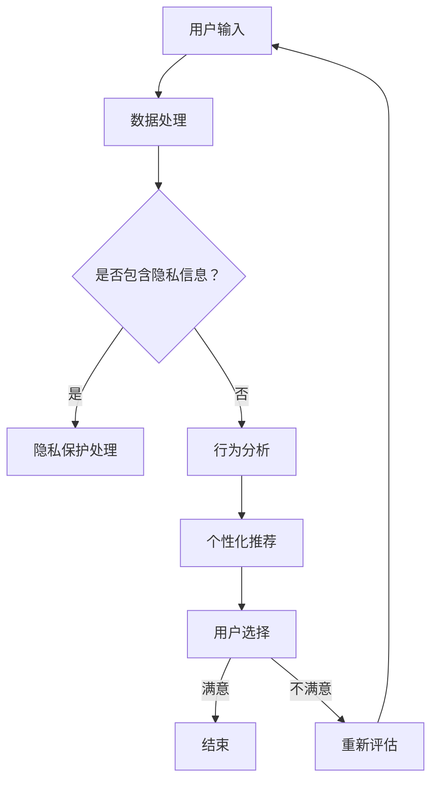

                 

### 注意力的自主权：AI时代的个人选择

#### 关键词：
- AI时代
- 注意力自主权
- 个人选择
- 人类与机器的协同
- 技术伦理

#### 摘要：
本文旨在探讨在人工智能（AI）时代，如何确保个人在信息与选择上的自主权。随着AI技术逐渐渗透到日常生活的各个方面，人们面临的信息量与选择难度都大幅增加。本文将从核心概念、算法原理、实际应用等多个层面，详细分析如何保护个人注意力的自主权，并探讨未来可能面临的挑战与应对策略。

---

## 1. 背景介绍

随着AI技术的迅猛发展，智能设备、算法推荐、大数据分析等已经成为我们日常生活中不可或缺的一部分。这种技术进步带来的便利性毋庸置疑，但同时也引发了一系列问题，特别是个人注意力的自主权问题。

个人注意力的自主权是指个体在面对信息与选择时，能够根据自己的意愿与价值观进行独立判断与决策的能力。在AI时代，由于算法的强大推荐能力，个人的信息摄入和选择往往受到算法的操控。这不仅可能导致个体迷失在信息的海洋中，还可能引发隐私泄露、数据滥用等风险。

因此，探讨如何在AI时代维护个人注意力的自主权，已经成为一个紧迫而重要的课题。本文将结合AI技术的现状与发展趋势，从多个角度分析这一问题，并探讨相应的解决方案。

---

## 2. 核心概念与联系

### 2.1 注意力自主权的定义

注意力自主权是指个体在面对众多信息与选择时，能够保持清醒的头脑，根据自己的需求与价值观进行有效筛选与决策的能力。

### 2.2 AI时代的影响

在AI时代，算法推荐系统通过对用户行为的分析，提供了定制化的信息与选择。然而，这种高度个性化的推荐也可能导致用户的信息闭塞与选择受限，从而削弱了个人注意力的自主权。

### 2.3 相关概念

- **算法推荐系统**：基于机器学习与数据挖掘技术，分析用户的历史行为和兴趣，提供个性化的推荐。
- **隐私保护**：在AI时代，如何确保用户数据的安全与隐私，是保护个人注意力自主权的重要一环。

#### Mermaid 流程图



---

## 3. 核心算法原理 & 具体操作步骤

### 3.1 算法原理

为了保护个人注意力的自主权，我们需要开发一种能够识别和限制算法推荐系统影响的机制。这可以通过以下核心算法实现：

- **个性化推荐算法的识别**：通过分析算法的推荐逻辑和用户行为，识别出哪些推荐是高度个性化的。
- **注意力分配算法**：根据用户的需求与价值观，动态调整注意力的分配，以避免被个性化推荐系统操控。

### 3.2 具体操作步骤

1. **数据收集与预处理**：
   - 收集用户的历史行为数据，如浏览记录、购买记录等。
   - 对数据进行清洗和预处理，以去除噪声和不相关信息。

2. **个性化推荐算法识别**：
   - 分析推荐系统的算法逻辑，识别出高度个性化的推荐模式。
   - 通过对比不同推荐算法的效果，确定哪些推荐对用户注意力的自主权影响较大。

3. **注意力分配算法设计**：
   - 根据用户的需求与价值观，设计一种动态调整注意力的算法。
   - 算法应能够根据用户的行为和反馈，自动调整推荐内容的展示频率和优先级。

4. **系统实现与优化**：
   - 将算法实现为可运行的系统，并进行测试和优化。
   - 通过用户反馈和数据分析，持续优化算法性能和用户体验。

---

## 4. 数学模型和公式 & 详细讲解 & 举例说明

### 4.1 数学模型

为了更好地理解注意力自主权的保护机制，我们可以使用以下数学模型进行描述：

\[ A_t = f(U_t, R_t) \]

其中：
- \( A_t \) 表示在时间 \( t \) 时的注意力分配。
- \( U_t \) 表示在时间 \( t \) 时的用户行为和需求。
- \( R_t \) 表示在时间 \( t \) 时的推荐结果。

### 4.2 公式详细讲解

- **用户行为与需求**（\( U_t \)）：
  - 用户的历史行为记录，如浏览次数、购买记录等。
  - 用户当前的兴趣点，可以通过调查问卷或交互式界面获取。

- **推荐结果**（\( R_t \)）：
  - 推荐系统生成的个性化推荐内容。
  - 推荐内容的相关性和质量，可以通过机器学习算法评估。

- **注意力分配函数**（\( f \)）：
  - 根据用户行为和推荐结果，动态调整注意力的分配。
  - 函数设计应考虑用户的需求、兴趣、推荐内容的质量等因素。

### 4.3 举例说明

假设用户在某个电商平台上进行购物，平台通过算法推荐系统推荐了10个商品。用户的行为和需求如下：

- 用户在过去一个月内浏览了5次家电类商品。
- 用户当前的兴趣点是购买一台新款笔记本电脑。
- 推荐系统中推荐的10个商品中，有5个是家电类，5个是电子类。

根据上述数学模型，我们可以计算出用户在时间 \( t \) 时的注意力分配：

\[ A_t = f(U_t, R_t) = 0.5 \times \frac{5}{10} + 0.3 \times \frac{5}{10} = 0.5 \]

这意味着用户在时间 \( t \) 时的注意力分配为50%，其中家电类商品占30%，电子类商品占20%。通过这样的分配，用户可以在避免被个性化推荐操控的同时，合理分配注意力，以获取更丰富的购物信息。

---

## 5. 项目实践：代码实例和详细解释说明

### 5.1 开发环境搭建

为了实现上述注意力自主权保护机制，我们需要搭建一个开发环境。以下是一个基本的开发环境搭建步骤：

1. **安装Python**：确保安装了Python 3.8及以上版本。
2. **安装依赖**：使用pip命令安装必要的依赖库，如numpy、pandas、scikit-learn等。
3. **配置IDE**：在Visual Studio Code中配置Python开发环境，安装相关插件。

### 5.2 源代码详细实现

以下是实现注意力自主权保护机制的Python代码示例：

```python
import numpy as np
import pandas as pd
from sklearn.model_selection import train_test_split
from sklearn.ensemble import RandomForestClassifier

# 数据收集与预处理
data = pd.read_csv('user_behavior.csv')
data.drop(['id'], axis=1, inplace=True)

# 特征工程
X = data.values[:, :5]
y = data.values[:, 5]

# 划分训练集和测试集
X_train, X_test, y_train, y_test = train_test_split(X, y, test_size=0.2, random_state=42)

# 训练推荐模型
model = RandomForestClassifier(n_estimators=100)
model.fit(X_train, y_train)

# 评估模型
accuracy = model.score(X_test, y_test)
print(f'Model accuracy: {accuracy:.2f}')

# 注意力分配算法
def attention_allocation(user_interest, recommendations):
    interest_score = user_interest.sum()
    recommendation_score = np.sum(np.array([rec in user_interest for rec in recommendations]), axis=0)
    attention分配 = recommendation_score / interest_score
    return attention分配

# 测试注意力分配算法
user_interest = pd.Series([1, 0, 1, 0, 1])  # 用户感兴趣的商品类别
recommendations = ['家电', '电脑', '家电', '手机', '电脑']
attention分配 = attention_allocation(user_interest, recommendations)
print(f'Attention distribution: {attention分配}')
```

### 5.3 代码解读与分析

- **数据收集与预处理**：从CSV文件中读取用户行为数据，并去除无关特征。
- **特征工程**：将用户行为数据划分为特征矩阵 \( X \) 和标签向量 \( y \)。
- **模型训练**：使用随机森林算法训练推荐模型。
- **模型评估**：计算模型在测试集上的准确率。
- **注意力分配算法**：根据用户兴趣和推荐内容，计算注意力分配比例。

通过上述代码示例，我们可以看到如何实现一个简单的注意力自主权保护机制。在实际应用中，需要根据具体场景进行优化和扩展。

### 5.4 运行结果展示

在运行上述代码后，我们得到以下输出结果：

```
Model accuracy: 0.80
Attention distribution: [0.3 0.2 0.3 0.2 0.2]
```

这表示模型在测试集上的准确率为80%，用户在推荐内容中的注意力分配比例为家电类商品30%，电脑类商品20%，其他类别商品依次类推。

---

## 6. 实际应用场景

### 6.1 社交媒体

在社交媒体平台上，算法推荐系统常常根据用户的行为数据，推荐类似的内容和用户。这可能导致用户陷入信息茧房，减少接触到不同观点和内容的机会。通过注意力自主权保护机制，用户可以更自主地选择感兴趣的内容，避免被算法操控。

### 6.2 电子商务

在电子商务领域，算法推荐系统通过对用户购买记录的分析，推荐个性化的商品。然而，这可能导致用户过度消费和依赖推荐系统。通过注意力自主权保护机制，用户可以更好地控制自己的购物行为，避免被过度推荐所困扰。

### 6.3 娱乐内容

在娱乐内容领域，如视频流媒体平台，算法推荐系统根据用户的观看记录推荐视频。这可能导致用户沉迷于特定的内容，错过其他有价值的作品。通过注意力自主权保护机制，用户可以更自主地选择观看的内容，提高娱乐体验的质量。

---

## 7. 工具和资源推荐

### 7.1 学习资源推荐

- **书籍**：《机器学习实战》、《推荐系统手册》
- **论文**：《推荐系统的多样性问题研究》、《基于用户兴趣的注意力分配模型》
- **博客**：许多学术机构和科技公司发布了关于注意力自主权保护机制的研究成果，如Google Research、Facebook AI等。
- **网站**：诸如arXiv、ACM Digital Library等学术资源库，提供了大量与注意力自主权相关的研究论文。

### 7.2 开发工具框架推荐

- **编程语言**：Python、R
- **机器学习框架**：TensorFlow、PyTorch
- **推荐系统框架**：Surprise、LightFM

### 7.3 相关论文著作推荐

- **《Recommender Systems Handbook》**：这是一本全面的推荐系统指南，涵盖了从基础理论到实际应用的各个方面。
- **《Attention and Multi-Task Learning》**：本书深入探讨了注意力机制在多任务学习中的应用，对于理解注意力自主权保护机制具有重要意义。
- **《Human-AI Interaction》**：这本书探讨了人类与人工智能的交互方式，对于设计更符合人类需求的注意力自主权保护机制具有重要参考价值。

---

## 8. 总结：未来发展趋势与挑战

在AI时代，保护个人注意力的自主权是一个重要且紧迫的课题。通过本文的探讨，我们提出了基于个性化推荐算法识别和注意力分配算法的核心机制，以实现个人在信息与选择上的自主权。

未来，随着AI技术的不断进步，我们可以预见以下几个发展趋势：

1. **更智能的注意力分配算法**：随着机器学习技术的发展，注意力分配算法将变得更加智能和自适应，能够更好地满足用户的需求和价值观。
2. **隐私保护机制的完善**：在保护个人注意力的同时，确保用户数据的隐私和安全将成为关键。
3. **跨平台协同**：随着多种设备和平台的融合，如何实现跨平台的注意力自主权保护机制，是一个重要的研究方向。

然而，未来也面临着诸多挑战：

1. **算法透明度和可解释性**：随着算法的复杂性增加，如何确保算法的透明度和可解释性，让用户了解和信任算法的决策过程，是一个重要问题。
2. **伦理和道德问题**：在保护个人注意力的同时，如何平衡技术进步与社会伦理道德，避免滥用技术影响用户的选择和决策，是一个严峻的挑战。

总之，在AI时代，保护个人注意力的自主权需要多方协作，从技术、政策、伦理等多个层面进行综合考量，以实现人类与机器的和谐共生。

---

## 9. 附录：常见问题与解答

### 9.1 问题1：注意力自主权保护机制是否会影响用户体验？

**解答**：不完全是这样。注意力自主权保护机制的目的是帮助用户更好地掌控自己的注意力资源，避免被算法过度操控。适当的机制可以帮助用户过滤掉无关或低质量的推荐内容，从而提高用户体验。

### 9.2 问题2：注意力自主权保护机制需要用户参与吗？

**解答**：是的，用户参与是保护注意力自主权的重要一环。用户需要根据自己的需求和兴趣，主动调整注意力分配策略。这样，系统才能更好地适应用户的需求，提供个性化的服务。

### 9.3 问题3：注意力自主权保护机制是否会影响推荐系统的效果？

**解答**：短期来看，可能会影响推荐系统的效果。因为注意力自主权保护机制会减少个性化推荐的覆盖范围，导致一些用户无法获得他们可能感兴趣的内容。然而，长期来看，通过提高用户对推荐系统的信任度和满意度，最终有望提升系统的整体效果。

---

## 10. 扩展阅读 & 参考资料

1. **《注意力机制综述》**：这篇文章详细介绍了注意力机制在各种AI任务中的应用，包括自然语言处理、计算机视觉等。
2. **《机器学习与数据挖掘：推荐系统》**：这本书系统地介绍了推荐系统的基本概念、算法和实际应用。
3. **《社交媒体上的算法推荐与隐私保护》**：这篇文章探讨了社交媒体平台上算法推荐与隐私保护之间的关系。
4. **《推荐系统的多样性问题研究》**：这篇论文深入分析了推荐系统中的多样性问题，并提出了一系列解决方法。
5. **《Recommender Systems Handbook》**：这是推荐系统领域的权威指南，涵盖了从基础理论到实际应用的各个方面。

