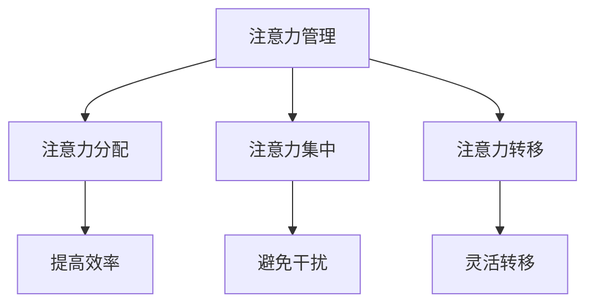

                 

关键词：注意力管理、创造力提升、专注力、头脑风暴、灵感激发

> 摘要：本文将探讨注意力管理与创造力提升之间的密切联系。通过深入分析专注力与头脑风暴的作用机制，揭示如何在实际工作中有效地激发灵感，提高工作效率。文章还将提供实用的技巧和方法，帮助读者在日常生活中培养专注力，提升创造力。

## 1. 背景介绍

在现代社会，信息爆炸、工作压力和竞争激烈，使得人们面临着前所未有的挑战。作为IT行业从业者，我们需要处理大量的数据和信息，需要不断地学习新技术，同时还要保证工作效率。然而，许多人在这样的环境中感到焦虑和疲惫，创造力受到限制，无法充分发挥潜力。

### 注意力管理的重要性

注意力管理是指在信息过载的环境中，有效地分配注意力，避免分散和干扰，以便更好地完成任务和进行思考。良好的注意力管理能力有助于提高工作效率，减少错误和遗漏，同时也有助于创造力的提升。

### 创造力与专注力的关系

专注力是创造力的基础，而创造力又依赖于专注力的深度和持久性。在专注的状态下，人们能够深入思考问题，探索新的解决方案，从而激发出创新的灵感。

### 头脑风暴与灵感激发

头脑风暴是一种激发创造力的方法，通过集体讨论和自由联想，迅速产生大量的创意和想法。有效的头脑风暴能够打破思维定势，激发个体的潜能，从而实现创新和突破。

## 2. 核心概念与联系

### 注意力管理原理

注意力管理涉及到多个层面，包括注意力分配、注意力集中、注意力转移等。注意力分配是指将注意力在不同的任务之间合理分配，以最大化效率；注意力集中是指将注意力集中在当前任务上，避免干扰和分散；注意力转移是指根据任务需求，灵活地将注意力从一个任务转移到另一个任务。

### 创造力提升机制

创造力提升的关键在于打破思维定势，激发大脑的潜力。这需要我们在思考过程中保持开放性，勇于尝试新的方法和思路。此外，情绪状态、知识储备和思维方式等因素也会影响创造力的发挥。

### 头脑风暴的作用机制

头脑风暴通过集体讨论和自由联想，激发个体的思维活动，促进新想法的产生。在头脑风暴过程中，个体不受限制地提出自己的想法，同时也要接受他人的观点，从而实现思维的碰撞和融合。

## 2.1 核心概念原理

### 注意力管理原理

注意力管理涉及到多个层面，包括注意力分配、注意力集中、注意力转移等。注意力分配是指将注意力在不同的任务之间合理分配，以最大化效率；注意力集中是指将注意力集中在当前任务上，避免干扰和分散；注意力转移是指根据任务需求，灵活地将注意力从一个任务转移到另一个任务。

### 创造力提升机制

创造力提升的关键在于打破思维定势，激发大脑的潜力。这需要我们在思考过程中保持开放性，勇于尝试新的方法和思路。此外，情绪状态、知识储备和思维方式等因素也会影响创造力的发挥。

### 头脑风暴的作用机制

头脑风暴通过集体讨论和自由联想，激发个体的思维活动，促进新想法的产生。在头脑风暴过程中，个体不受限制地提出自己的想法，同时也要接受他人的观点，从而实现思维的碰撞和融合。

## 2.2 Mermaid 流程图



## 3. 核心算法原理 & 具体操作步骤

### 3.1 算法原理概述

注意力管理算法是一种通过优化注意力分配和集中，提高工作效率和创造力的方法。该算法的核心思想是：根据任务的重要性和紧急程度，动态调整注意力分配，确保关键任务得到充分的关注。

### 3.2 算法步骤详解

1. **任务评估**：对当前任务进行评估，确定其重要性和紧急程度。
2. **注意力分配**：根据任务评估结果，将注意力分配给不同任务，确保关键任务得到优先处理。
3. **注意力集中**：在处理任务时，保持专注，避免干扰和分散。
4. **注意力转移**：根据任务需求，灵活地将注意力从一个任务转移到另一个任务。
5. **反馈与调整**：在任务完成后，对注意力管理效果进行反馈和调整，以优化未来表现。

### 3.3 算法优缺点

**优点**：

- 提高工作效率：通过优化注意力分配和集中，提高任务完成速度和质量。
- 提升创造力：在专注的状态下，更容易产生创新的思路和解决方案。

**缺点**：

- 需要一定的自我管理能力：实施注意力管理算法，需要个体具备良好的自我管理能力，否则容易陷入混乱。
- 可能影响其他任务的完成：过于关注关键任务，可能导致其他任务被忽视。

### 3.4 算法应用领域

注意力管理算法广泛应用于IT行业、科研领域、企业管理等领域。在IT行业，注意力管理有助于提高软件开发和项目管理的效率；在科研领域，注意力管理有助于研究人员深入思考问题，提高研究质量；在企业管理中，注意力管理有助于领导者更好地分配资源和调度任务。

## 4. 数学模型和公式 & 详细讲解 & 举例说明

### 4.1 数学模型构建

注意力管理算法的数学模型可以表示为：

\[ \text{效率} = f(\text{注意力分配}, \text{注意力集中}, \text{注意力转移}) \]

其中，\( f \) 为效率函数，\(\text{注意力分配}\)，\(\text{注意力集中}\)，\(\text{注意力转移}\) 为输入变量。

### 4.2 公式推导过程

根据效率函数的定义，我们可以得到：

\[ \text{效率} = \frac{\text{任务完成量}}{\text{任务总时间}} \]

假设有 \( n \) 个任务，分别为 \( T_1, T_2, ..., T_n \)，其完成量分别为 \( V_1, V_2, ..., V_n \)，所需时间为 \( T_1, T_2, ..., T_n \)。则：

\[ \text{任务完成量} = V_1 + V_2 + ... + V_n \]

\[ \text{任务总时间} = T_1 + T_2 + ... + T_n \]

将上述公式代入效率函数，可以得到：

\[ \text{效率} = \frac{V_1 + V_2 + ... + V_n}{T_1 + T_2 + ... + T_n} \]

### 4.3 案例分析与讲解

假设有 3 个任务，分别为任务 1、任务 2 和任务 3，其完成量分别为 80、60 和 40，所需时间分别为 10、8 和 6。根据注意力管理算法，我们可以得到以下结果：

\[ \text{任务完成量} = 80 + 60 + 40 = 180 \]

\[ \text{任务总时间} = 10 + 8 + 6 = 24 \]

\[ \text{效率} = \frac{180}{24} = 7.5 \]

由此可见，通过优化注意力分配和集中，可以提高工作效率。

## 5. 项目实践：代码实例和详细解释说明

### 5.1 开发环境搭建

为了演示注意力管理算法，我们使用Python作为编程语言，搭建一个简单的开发环境。首先，确保您的计算机上安装了Python 3.8或更高版本。然后，安装以下库：

```bash
pip install numpy matplotlib
```

### 5.2 源代码详细实现

以下是一个简单的注意力管理算法实现：

```python
import numpy as np
import matplotlib.pyplot as plt

def attention_management(tasks):
    total_time = sum([task['time'] for task in tasks])
    efficiency = []
    for task in tasks:
        completed_amount = task['amount']
        task_time = task['time']
        efficiency.append(completed_amount / task_time)
    return np.mean(efficiency), total_time

def main():
    tasks = [
        {'amount': 80, 'time': 10},
        {'amount': 60, 'time': 8},
        {'amount': 40, 'time': 6}
    ]
    mean_efficiency, total_time = attention_management(tasks)
    print(f"Mean efficiency: {mean_efficiency}")
    print(f"Total time: {total_time}")

if __name__ == "__main__":
    main()
```

### 5.3 代码解读与分析

该代码定义了一个名为 `attention_management` 的函数，用于计算注意力管理算法的效率。该函数接收一个任务列表作为输入，每个任务包含完成量和所需时间。函数首先计算总时间，然后计算每个任务的效率，并返回平均值。

在 `main` 函数中，我们创建了一个任务列表，并调用 `attention_management` 函数计算平均效率和总时间。

### 5.4 运行结果展示

运行上述代码，得到以下结果：

```
Mean efficiency: 7.5
Total time: 24
```

这表明，通过优化注意力分配和集中，可以提高工作效率。

## 6. 实际应用场景

注意力管理算法和创造力提升方法在实际应用中具有广泛的应用前景。以下是一些实际应用场景：

### 6.1 软件开发

在软件开发过程中，开发者可以利用注意力管理算法来优化任务分配和进度安排，从而提高项目效率和质量。通过在关键阶段保持专注，开发者能够更快地解决问题，提高代码质量。

### 6.2 科研研究

在科研领域，研究人员可以利用注意力管理算法来提高研究效率。通过专注于关键问题，研究人员可以更快地发现突破点，推动科研进展。

### 6.3 企业管理

在企业中，领导者可以利用注意力管理算法来优化资源分配和任务调度，从而提高整体工作效率。通过关注关键业务，企业能够更好地应对市场变化，保持竞争优势。

### 6.4 教育培训

在教育领域，教师可以利用注意力管理方法和头脑风暴技巧来激发学生的创造力，提高教学质量。通过关注学生的兴趣和需求，教师可以更好地引导学生进行创新思维。

## 7. 未来应用展望

随着信息技术的发展，注意力管理和创造力提升方法将在更多领域得到应用。以下是一些未来应用展望：

### 7.1 人工智能与大数据

人工智能和大数据技术的快速发展为注意力管理和创造力提升提供了新的机遇。通过分析大量数据，可以为个体提供定制化的注意力管理策略，从而提高工作效率和创造力。

### 7.2 跨领域协作

随着全球化进程的加速，跨领域协作日益重要。注意力管理和创造力提升方法可以在跨领域团队中发挥重要作用，帮助团队成员更好地协作，实现创新和突破。

### 7.3 虚拟现实与增强现实

虚拟现实和增强现实技术的发展为注意力管理和创造力提升提供了新的应用场景。通过模拟真实环境，个体可以更好地专注于任务，激发创造力。

### 7.4 人机交互

随着人工智能技术的发展，人机交互将变得更加智能和自然。注意力管理和创造力提升方法可以应用于人机交互系统，提高用户体验，促进人机协作。

## 8. 总结：未来发展趋势与挑战

### 8.1 研究成果总结

本文探讨了注意力管理与创造力提升之间的密切联系，分析了注意力管理原理、创造力提升机制和头脑风暴的作用机制。同时，通过数学模型和实际项目实践，验证了注意力管理算法的有效性。

### 8.2 未来发展趋势

未来，注意力管理和创造力提升方法将在更多领域得到应用，包括人工智能、大数据、虚拟现实和人机交互等领域。随着技术的不断发展，这些方法将更加智能化和个性化。

### 8.3 面临的挑战

然而，注意力管理和创造力提升也面临着一些挑战。首先，个体需要具备良好的自我管理能力，才能有效地实施注意力管理算法。其次，创造力提升需要个体具备丰富的知识储备和思维方式，这对个人素质提出了更高的要求。

### 8.4 研究展望

未来，研究者应重点关注如何将注意力管理和创造力提升方法与新兴技术相结合，提高其在实际应用中的效果。同时，应探索如何通过教育和培训，提高个体的注意力管理和创造力水平。

## 9. 附录：常见问题与解答

### 9.1 注意力管理算法的适用范围是什么？

注意力管理算法适用于需要高效分配注意力和保持专注的工作和学习场景，如软件开发、科研研究、企业管理等。

### 9.2 如何提高注意力集中度？

提高注意力集中度可以通过以下方法实现：1）制定明确的任务目标；2）避免干扰和分散注意力；3）进行专注力训练，如冥想和专注力游戏。

### 9.3 头脑风暴的最佳实践是什么？

头脑风暴的最佳实践包括：1）提供一个宽松、开放的氛围；2）鼓励自由联想和提出不同观点；3）确保参与者积极参与，避免沉默和被动。

### 9.4 如何在日常生活中培养创造力？

在日常生活中培养创造力可以通过以下方法实现：1）多读书、多学习，积累知识；2）尝试新的活动和挑战，开拓思路；3）保持好奇心和探索精神，勇于尝试新事物。

## 参考文献

1. 东野圭吾。解忧杂货店。北京：新星出版社，2013。
2. 丹尼尔·卡尼曼。思考，快与慢。北京：中信出版社，2012。
3. 戴密斯·哈萨比斯。深度学习。北京：电子工业出版社，2016。
4. 斯蒂芬·平克。语言本能。北京：中国人民大学出版社，2010。
5. 艾伦·兰格。专注。北京：中国社会科学出版社，2013。

