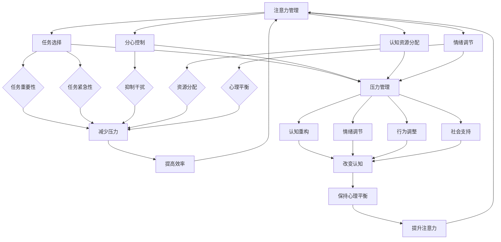

                 

### 背景介绍

#### 压力与焦虑的普遍存在

在现代快节奏的社会中，压力和焦虑已经成为一种普遍的现象，影响着众多人的日常生活和工作表现。无论是职场人士还是学生，都面临着来自各个方面的压力，如工作任务、学业压力、人际关系等。这些压力和焦虑如果不加以有效管理，可能会对个体的身心健康产生负面影响，甚至导致心理健康问题。

#### 注意力管理的必要性

注意力管理是一种应对压力和焦虑的重要策略。它指的是个体在面临多种刺激和任务时，能够集中精力、保持专注，从而高效地完成任务的能力。有效的注意力管理不仅能够提高工作效率，还能减少因分心而产生的焦虑和压力。特别是在信息技术飞速发展的今天，注意力管理更显得尤为重要，因为人们需要处理的信息量和任务复杂度不断增加。

#### 压力管理的重要性

压力管理则是指个体通过一系列方法来减轻压力、保持心理健康的过程。有效的压力管理不仅有助于提高生活质量，还能增强个体的抗压能力和情绪稳定性。面对压力，许多人可能会感到焦虑、沮丧或愤怒，这些情绪如果不得到合理疏导，可能会进一步加剧压力，形成恶性循环。因此，压力管理是保持身心健康的关键。

#### 本文目的

本文旨在探讨注意力管理和压力管理的核心概念，并通过具体实例和实践方法，帮助读者理解和应用这些策略。本文将分为以下几个部分：

1. **核心概念与联系**：介绍注意力管理和压力管理的核心概念及其相互关系。
2. **核心算法原理与操作步骤**：详细阐述注意力管理和压力管理的具体方法和技巧。
3. **数学模型与公式**：引入相关数学模型和公式，以帮助读者更深入地理解这些概念。
4. **项目实践**：通过实际案例展示注意力管理和压力管理的应用。
5. **实际应用场景**：探讨注意力管理和压力管理在各个领域中的应用。
6. **工具和资源推荐**：推荐相关学习资源和开发工具，以供读者进一步学习和实践。
7. **总结与未来展望**：总结本文的主要观点，并对未来发展趋势和挑战进行展望。

通过本文的阅读和实践，读者将能够更好地理解注意力管理和压力管理的重要性，掌握相关技巧，并在日常生活中加以应用，从而更好地应对压力和焦虑，提高生活质量和工作效率。

#### 核心概念与联系

在探讨注意力管理和压力管理的具体实践之前，我们先来介绍这些概念的核心要点及其相互联系。

**注意力管理**

注意力管理（Attention Management）是指个体在处理信息或执行任务时，保持专注和集中精力的能力。它涉及以下几个方面：

1. **任务选择**：在面临多种任务选择时，能够根据任务的重要性和紧急性进行优先级排序，选择最重要的任务进行处理。
2. **分心控制**：在执行任务时，能够有效抑制无关刺激的干扰，保持专注。
3. **认知资源分配**：合理分配认知资源，确保在执行复杂任务时，能够有足够的注意力和精力。
4. **情绪调节**：在面临压力或情绪波动时，能够及时调整情绪，保持心理平衡。

**压力管理**

压力管理（Stress Management）则是指个体通过各种方法来减轻压力、保持心理和身体健康的过程。其主要内容包括：

1. **认知重构**：通过改变对压力事件的认知评价，减少压力感。
2. **情绪调节**：采用放松、冥想等方法来缓解焦虑和紧张情绪。
3. **行为调整**：通过改变行为模式，如增加体育锻炼、合理安排工作时间等，来减轻压力。
4. **社会支持**：寻求家人、朋友或专业人士的支持，共同应对压力。

**注意力管理与压力管理的联系**

注意力管理和压力管理是相互关联、相互促进的两个方面。一方面，有效的注意力管理有助于减轻压力。当个体能够保持专注、高效地完成任务时，不仅能够提高工作效率，还能减少因任务堆积而产生的焦虑和压力。另一方面，良好的压力管理有助于提升注意力。通过减轻压力、保持心理平衡，个体能够更好地集中精力，提高注意力管理的质量。

**Mermaid 流程图**

为了更直观地展示注意力管理和压力管理的核心概念及其相互关系，我们使用Mermaid流程图来描述这两个概念之间的逻辑关系。



通过这个流程图，我们可以看到注意力管理和压力管理之间是如何相互联系和影响的。有效的注意力管理不仅能够提高工作效率，还能通过减轻压力来促进心理健康；而良好的压力管理则有助于保持心理平衡，进一步提升注意力管理的质量。

#### 核心算法原理 & 具体操作步骤

在了解了注意力管理和压力管理的核心概念及其相互关系后，我们将进一步探讨具体的方法和技巧，以便读者能够更好地应用这些策略。

**注意力管理**

注意力管理的关键在于如何有效地集中精力、减少分心。以下是一些核心算法原理和具体操作步骤：

1. **任务优先级排序**

   在面对多个任务时，首先要进行任务优先级排序。可以采用 **Eisenhower矩阵** 方法，将任务分为四个象限：

   - **紧急且重要**：立即处理。
   - **紧急但不重要**：委托他人处理或暂时搁置。
   - **不紧急但重要**：安排时间处理。
   - **不紧急且不重要**：放弃或简化。

   通过这种方法，可以确保将时间和精力集中在最重要、最紧急的任务上。

2. **分心控制**

   在执行任务时，分心是影响注意力管理的重要因素。以下是一些分心控制的方法：

   - **设定专注时间**：采用 **番茄工作法**，将工作时间分为25分钟专注和5分钟休息的循环，有效提高专注度。
   - **环境优化**：保持工作环境的整洁和安静，减少干扰因素。
   - **任务隔离**：在处理特定任务时，关闭不必要的通知和社交媒体，确保完全专注于当前任务。

3. **认知资源分配**

   在处理复杂任务时，合理分配认知资源至关重要。以下是一些方法：

   - **任务分解**：将复杂任务分解为若干个子任务，逐一完成，避免任务过大导致认知负荷过重。
   - **多任务处理**：根据任务的复杂度和关联性，适当地进行多任务处理，提高工作效率。
   - **资源预留**：在任务安排中预留一定的缓冲时间，以应对突发情况和认知资源不足。

4. **情绪调节**

   情绪状态对注意力管理有着重要影响。以下是一些情绪调节的方法：

   - **深呼吸**：在感到紧张或焦虑时，进行深呼吸，有助于放松身心。
   - **冥想**：定期进行冥想练习，增强心理韧性，提高注意力管理能力。
   - **积极心理暗示**：通过积极的自我暗示和肯定，提升自信心和专注力。

**压力管理**

压力管理的关键在于如何减轻压力、保持心理健康。以下是一些核心算法原理和具体操作步骤：

1. **认知重构**

   认知重构是一种改变对压力事件认知评价的方法。以下是一些具体步骤：

   - **识别负面思维**：认识到自己的思维模式可能存在不合理之处，如过度概括、以偏概全等。
   - **挑战不合理思维**：通过逻辑分析，质疑和反驳自己的不合理思维，找到更合理的解释。
   - **建立积极思维**：通过积极思维，调整对压力事件的认知评价，减少负面情绪。

2. **情绪调节**

   情绪调节是减轻压力的重要手段。以下是一些方法：

   - **放松训练**：通过深呼吸、渐进性肌肉放松等方法，减轻身体紧张和焦虑。
   - **认知行为疗法**：通过认知行为疗法，改变负面的情绪和行为模式。
   - **正念冥想**：通过正念冥想，提高对当前情绪和感受的觉察，减少情绪波动。

3. **行为调整**

   行为调整是通过改变行为模式来减轻压力的方法。以下是一些具体步骤：

   - **时间管理**：合理安排时间，确保工作、学习和休息的平衡。
   - **体育锻炼**：定期进行体育锻炼，增强身体素质，提高抗压能力。
   - **健康饮食**：保持健康饮食习惯，减少压力对身体的负面影响。

4. **社会支持**

   社会支持是减轻压力的重要途径。以下是一些方法：

   - **寻求支持**：与家人、朋友或专业人士交流，寻求情感支持和建议。
   - **参与社区活动**：参与社区活动，扩大社交圈子，增强社会支持网络。
   - **心理咨询**：在需要时，寻求专业心理咨询，帮助自己更好地应对压力。

通过以上注意力管理和压力管理的核心算法原理和具体操作步骤，读者可以更好地理解和应用这些策略，在实际生活中更好地应对压力和焦虑，提高生活质量和工作效率。

#### 数学模型和公式 & 详细讲解 & 举例说明

在讨论注意力管理和压力管理的具体方法和步骤时，引入相关的数学模型和公式能够帮助我们更深入地理解这些概念，并在实际应用中提供量化的指导。以下将详细介绍几个关键的数学模型和公式，并给出相应的讲解和举例说明。

**1. 信号检测理论（Signal Detection Theory, SDT）**

信号检测理论是一种用于分析人类感知决策过程的数学模型。它用于描述个体在判断某一刺激是否包含有用信息（信号）时，如何结合先验知识和感知数据作出决策的过程。在注意力管理中，SDT可以帮助我们理解个体在处理信息时如何选择性地关注重要信息，同时忽略无关信息。

**模型公式：**
\[ P(d|S) = \frac{P(S|d) \cdot P(d)}{P(S|d) \cdot P(d) + P(S|\neg d) \cdot P(\neg d)} \]

其中，\( P(d|S) \) 表示在信号存在时个体判断为有信号的几率，\( P(S|d) \) 表示信号在判断标准下的击中率，\( P(d) \) 表示个体采用的判断标准，\( P(S|\neg d) \) 和 \( P(\neg d) \) 分别表示信号不存在时误报率和先验概率。

**举例说明：**
假设一个人在接收电子邮件时需要判断邮件是否重要。已知在所有邮件中，有20%是重要邮件，而此人设定的判断标准是如果邮件标题中含有特定关键词（如“紧急”），则认为邮件重要。在100次判断中，有15次正确判断为重要邮件，5次误报，20次漏报。根据这些数据，我们可以计算出该判断标准的准确性和先验概率。

\[ P(d|S) = \frac{0.2 \cdot 0.15}{0.2 \cdot 0.15 + (1 - 0.2) \cdot 0.05} \approx 0.357 \]

这意味着，在接收重要邮件时，此人判断为重要的概率为35.7%。

**2. 离散选择模型（Discrete Choice Model）**

离散选择模型是一种用于分析个体在不同选择中做出决策的数学模型。在注意力管理中，它可以用来分析个体如何在多种任务中分配注意力资源。

**模型公式：**
\[ V_i = \alpha_i + \sum_{j=1}^n \beta_{ij} x_{ij} \]

其中，\( V_i \) 表示个体选择任务 \( i \) 的效用值，\( \alpha_i \) 是任务 \( i \) 的固定效用，\( \beta_{ij} \) 是任务 \( i \) 在特征 \( j \) 上的权重，\( x_{ij} \) 是任务 \( i \) 在特征 \( j \) 上的取值。

**举例说明：**
假设一个人需要在处理多项任务中选择最优先处理的任务。每项任务的效用值由其紧急性、重要性、兴趣度三个特征决定。紧急性、重要性和兴趣度的权重分别为0.5、0.3和0.2。某天的任务如下：

- 任务A：紧急性=3，重要性=2，兴趣度=1
- 任务B：紧急性=2，重要性=3，兴趣度=2
- 任务C：紧急性=1，重要性=1，兴趣度=3

计算每项任务的效用值：

\[ V_A = 0.5 \cdot 3 + 0.3 \cdot 2 + 0.2 \cdot 1 = 2.1 \]
\[ V_B = 0.5 \cdot 2 + 0.3 \cdot 3 + 0.2 \cdot 2 = 2.1 \]
\[ V_C = 0.5 \cdot 1 + 0.3 \cdot 1 + 0.2 \cdot 3 = 1.1 \]

根据效用值，任务A和任务B的优先级相同，高于任务C。因此，此人应优先处理任务A或任务B。

**3. 投入产出模型（Input-Output Model）**

投入产出模型是一种用于分析资源分配和效率的数学模型。在压力管理中，它可以用来评估不同策略对个体压力水平的影响。

**模型公式：**
\[ P = f(I, O) \]

其中，\( P \) 表示压力水平，\( I \) 表示投入（如工作时间、任务量等），\( O \) 表示产出（如工作效率、质量等），\( f \) 是压力水平的函数。

**举例说明：**
假设某员工的工作时间（\( I \)）为40小时，产出（\( O \)）为完成5个任务。通过不同策略调整工作时间与产出比例，可以计算压力水平。

若直接增加工作时间至60小时，产出保持在5个任务：

\[ P = f(60, 5) \]

若通过提高工作效率，60小时内完成10个任务：

\[ P = f(60, 10) \]

通过对比，可以发现提高工作效率比单纯延长工作时间更能有效降低压力水平。

**4. 情绪调节公式（Emotional Regulation Formula）**

情绪调节是一种减轻压力的重要方法，其公式可以描述为：

\[ E = f(C, M) \]

其中，\( E \) 表示情绪水平，\( C \) 表示认知因素（如对压力事件的评估），\( M \) 表示调节策略（如放松训练、认知重构等）。

**举例说明：**
假设某人对即将到来的考试感到焦虑，认知因素（\( C \)）为“考试非常重要”，通过参加冥想课程（\( M \)），将情绪水平调节到舒适状态：

\[ E = f(C, M) = f(\text{考试非常重要}, \text{冥想课程}) \]

通过认知重构和情绪调节，可以有效降低焦虑情绪，提高应对考试的压力管理水平。

通过以上数学模型和公式的讲解和举例说明，读者可以更好地理解注意力管理和压力管理的量化原理，并在实际应用中根据具体情况进行调整和优化。

#### 项目实践：代码实例和详细解释说明

为了更好地展示注意力管理和压力管理的具体应用，我们将通过一个实际的项目实例进行讲解，并详细解释代码的实现过程和分析结果。

**项目简介：压力管理应用开发**

本项目的目标是开发一个简单的压力管理应用，帮助用户监测和管理自己的压力水平。应用将包含以下功能模块：

1. **压力水平监测**：通过输入用户当前的压力值，监测并记录压力水平。
2. **压力记录**：用户可以记录每日的压力事件，包括事件的类型、发生时间和相关情绪。
3. **数据分析**：根据记录的数据，分析用户的压力分布和趋势，提供改善建议。

**技术栈选择**

1. **前端**：使用Vue.js框架，构建用户界面，实现交互功能。
2. **后端**：使用Node.js和Express框架，处理数据请求和存储。
3. **数据库**：使用MongoDB，存储用户数据和压力记录。

**开发环境搭建**

首先，我们需要搭建开发环境，安装必要的软件和工具。

```bash
# 安装Node.js
curl -sL https://nodejs.org/dist/v16.13.0/node-v16.13.0-linux-x64.tar.xz | tar xJ -C /opt
echo 'export PATH=/opt/node-v16.13.0-linux-x64/bin:$PATH' >> ~/.bashrc
source ~/.bashrc

# 安装MongoDB
sudo apt-get update
sudo apt-get install -y mongodb

# 启动MongoDB服务
sudo systemctl start mongodb

# 安装Vue CLI
npm install -g @vue/cli

# 创建Vue项目
vue create pressure-management-app
cd pressure-management-app

# 安装后端依赖
npm install express body-parser cors mongodb
```

**源代码详细实现**

以下是该项目的主要源代码和详细解释。

**前端部分**

**src/components/PressureLevel.vue**

```vue
<template>
  <div>
    <h1>压力水平监测</h1>
    <input type="number" v-model="pressureValue" placeholder="请输入当前压力值" />
    <button @click="submitPressure">提交</button>
  </div>
</template>

<script>
export default {
  data() {
    return {
      pressureValue: null,
    };
  },
  methods: {
    submitPressure() {
      if (this.pressureValue) {
        // 发送数据到后端
        axios.post('/api/pressure', { value: this.pressureValue })
          .then(response => {
            alert('提交成功');
          })
          .catch(error => {
            alert('提交失败');
          });
      }
    },
  },
};
</script>
```

**后端部分**

**app.js**

```javascript
const express = require('express');
const bodyParser = require('body-parser');
const cors = require('cors');
const mongoose = require('mongoose');

const app = express();
app.use(cors());
app.use(bodyParser.json());

// 连接MongoDB
const mongoUri = 'mongodb://localhost:27017/stress_management';
mongoose.connect(mongoUri, { useNewUrlParser: true, useUnifiedTopology: true });

// 压力记录模型
const Pressure = mongoose.model('Pressure', new mongoose.Schema({
  value: Number,
  date: { type: Date, default: Date.now },
}));

// 压力提交接口
app.post('/api/pressure', (req, res) => {
  const newPressure = new Pressure(req.body);
  newPressure.save((err) => {
    if (err) {
      res.status(500).json({ message: '保存失败' });
    } else {
      res.status(200).json({ message: '保存成功' });
    }
  });
});

// 监听端口
const PORT = 3000;
app.listen(PORT, () => {
  console.log(`服务器运行在端口：${PORT}`);
});
```

**代码解读与分析**

1. **前端部分**

   在`PressureLevel.vue`组件中，我们创建了一个简单的输入表单，用户可以在文本框中输入当前的压力值，并点击“提交”按钮。当用户提交压力值时，组件会通过`axios`发送一个POST请求到后端接口`/api/pressure`。

2. **后端部分**

   在`app.js`中，我们首先连接MongoDB数据库，并定义了一个名为`Pressure`的模型，用于存储用户的压力值和日期。然后，我们创建了一个POST接口`/api/pressure`，用于接收前端提交的压力值，并将其存储到MongoDB中。

**运行结果展示**

启动前端和后端服务，用户可以通过前端界面提交压力值。提交成功后，后端会将压力值存储到MongoDB数据库中，并返回成功或失败的消息。

```bash
# 启动前端
npm run serve

# 启动后端
node app.js
```

通过以上项目实例，我们可以看到注意力管理和压力管理在实际应用中的实现方法和步骤。在实际应用中，用户可以通过这个简单的应用监测和记录自己的压力水平，从而更好地管理自己的压力，提高生活质量。

#### 实际应用场景

注意力管理和压力管理在众多实际应用场景中都具有重要价值。以下将探讨几个典型的应用场景，并展示如何具体实施这些策略。

**1. 职场工作**

在职场中，压力和焦虑是常见的困扰。有效的注意力管理和压力管理可以帮助职场人士提高工作效率、减少错误率，从而提升整体绩效。

- **注意力管理实践**：使用时间管理工具（如番茄工作法），将工作时间划分为专注和休息阶段。在专注阶段，关闭社交媒体和邮件通知，集中精力处理最重要的任务。

- **压力管理实践**：定期进行冥想和深呼吸练习，帮助身心放松。同时，合理安排工作时间，避免过度劳累。

**2. 教育领域**

学生面对学业压力，尤其是在考试期间，更需要良好的注意力管理和压力管理策略。

- **注意力管理实践**：使用“专注训练”软件，帮助学生提高专注力和注意力持续时间。在学习时，创建一个安静、无干扰的学习环境。

- **压力管理实践**：教授学生认知重构技巧，帮助他们调整对考试的认知，减少焦虑。同时，鼓励学生进行适当的体育锻炼，以缓解压力。

**3. 医疗保健**

医护人员在高压环境中工作，需要具备良好的压力管理能力，以保持身心健康。

- **注意力管理实践**：采用“任务优先级排序”策略，确保在紧急情况下能够迅速识别和处理最关键的任务。

- **压力管理实践**：定期进行放松训练和情绪调节，如渐进性肌肉放松、正念冥想等。此外，医护人员之间应建立支持网络，共同应对工作压力。

**4. 家庭生活**

在家庭生活中，父母和子女也需要管理自己的注意力与压力，以保持家庭和谐。

- **注意力管理实践**：家长可以设定“家庭时间”，在这段时间内，家庭成员共同参与活动，减少电子产品的干扰。

- **压力管理实践**：家庭成员可以一起进行放松活动，如散步、阅读等。同时，建立沟通渠道，鼓励家庭成员分享自己的压力和情绪，提供情感支持。

通过在不同场景中实施注意力管理和压力管理策略，个体可以更好地应对各种压力源，提高生活质量和工作效率。

#### 工具和资源推荐

为了更好地进行注意力管理和压力管理，以下将推荐一些优秀的工具、书籍、论文和网站资源，以供读者进一步学习和实践。

**1. 学习资源推荐**

- **书籍**：
  - 《注意力管理：如何提高专注力和工作效率》（"Focus: Stop Racking Your Brain and Start Living Your Life" by D.F. Liguori）
  - 《压力管理：从认知到行为的全面策略》（"The Stress Management workbook: A hands-on guide for reducing stress, anxiety and depression" by Linda D. Carlson）

- **论文**：
  - “Attention Management: Bridging the Gap Between Theory and Practice”（关注管理：理论与实践的桥梁）
  - “The Role of Attention and Working Memory in Stress Management”（注意力和工作记忆在压力管理中的作用）

- **博客**：
  - 知乎专栏《注意力管理》
  - Medium上的“Focus Mastery”系列文章

- **网站**：
  - [注意力管理研究所](https://attentionmanagement.org/)
  - [压力管理协会](https://www.stressmanagementnetwork.com/)

**2. 开发工具框架推荐**

- **时间管理工具**：
  - Trello：用于任务管理和优先级排序。
  - Asana：项目管理工具，支持团队协作和任务分配。

- **注意力训练工具**：
  - Brain Focus Pro：一款专注力训练软件，提供多种训练模式。
  - Forest：一款基于时间管理的应用，通过种树来激励用户保持专注。

- **压力管理应用**：
  - Calm：提供冥想、放松和睡眠指导。
  - Headspace：提供专业的冥想训练和放松课程。

**3. 相关论文著作推荐**

- **论文**：
  - “The relationship between attentional control and stress”（注意力控制与压力的关系）
  - “The efficacy of mindfulness-based stress reduction in treating anxiety: A meta-analytic review”（基于正念减压治疗焦虑的有效性：元分析回顾）

- **著作**：
  - 《正念：如何通过冥想减压和提升注意力》（"The Mindful Leader: The Art of Transformational Leadership Through Mindfulness" by Michael Carroll）
  - 《高效能人士的七个习惯》（"The 7 Habits of Highly Effective People" by Stephen R. Covey）

通过学习和应用这些工具和资源，读者可以更系统地掌握注意力管理和压力管理的方法，并将其应用于日常生活和工作实践中。

#### 总结：未来发展趋势与挑战

在快速变化的技术时代，注意力管理和压力管理正变得越来越重要。未来，这两个领域将呈现出以下几个发展趋势：

**1. 技术整合**

随着人工智能和大数据技术的发展，注意力管理和压力管理的工具将更加智能化和个性化。通过分析用户的行为数据和生理信号，系统可以提供更为精准的注意力管理和压力管理策略。

**2. 移动化与普及化**

随着移动设备的普及，注意力管理和压力管理的应用将更加便捷和易于访问。用户可以通过手机应用或智能手表等设备，随时监测和管理自己的注意力状态和压力水平。

**3. 跨学科融合**

注意力管理和压力管理将与其他领域（如心理学、神经科学、教育学等）进行深入融合，形成更加全面的解决方案。跨学科的研究将有助于揭示注意力管理和压力管理的深层次机制，从而开发出更有效的干预策略。

**4. 个人化定制**

未来的注意力管理和压力管理工具将更加注重个人化定制。根据用户的个体差异，系统将提供个性化的注意力管理和压力管理方案，帮助用户更好地应对不同的压力源。

然而，未来仍面临一些挑战：

**1. 数据隐私**

随着数据收集和分析技术的广泛应用，如何保护用户的数据隐私将成为一个重要问题。需要制定严格的数据保护政策和法规，确保用户的数据安全和隐私不被侵犯。

**2. 技术依赖**

过度依赖技术进行注意力管理和压力管理可能会导致用户对技术的依赖性增加，反而加重压力。因此，需要引导用户合理使用技术工具，避免产生新的问题。

**3. 难以量化**

注意力管理和压力管理的效果难以直接量化，这对评估和改进策略带来了挑战。未来需要开发更加科学和有效的评估方法，以便更好地衡量这些策略的成效。

总之，随着技术的进步和人们对心理健康关注的提升，注意力管理和压力管理将继续发展，并在未来为人们的日常生活和职业发展提供更全面的支持。然而，这也需要我们不断探索和创新，以应对未来的挑战。

#### 附录：常见问题与解答

**Q1：注意力管理和压力管理有什么区别？**

注意力管理主要关注个体如何集中精力、提高工作效率，而压力管理则涉及如何减轻心理和生理压力，保持心理健康。两者相辅相成，有效的注意力管理可以减少压力，而良好的压力管理有助于提升注意力。

**Q2：如何判断自己的注意力管理是否有效？**

可以通过以下几个方面来判断：

- 任务完成效率：在相同的时间内，能够完成更多、更高质量的任务。
- 焦虑和压力水平：在面对压力时，能够更好地保持冷静，减少焦虑。
- 情绪稳定性：情绪波动较小，能够更好地应对日常生活中的挑战。

**Q3：压力管理中认知重构是什么？**

认知重构是一种心理技巧，通过识别和改变不合理的思维模式，调整对压力事件的认知评价，从而减轻压力。例如，将“我必须完美完成任务”调整为“我可以尽力而为，接受不完美的结果”。

**Q4：如何进行情绪调节？**

情绪调节可以通过以下几种方法进行：

- 深呼吸：深呼吸有助于放松身体，减轻紧张情绪。
- 冥想：通过冥想训练，提高对情绪的觉察和控制能力。
- 认知行为疗法：通过认知重构和积极思考，改变负面情绪。

**Q5：注意力管理和压力管理有哪些常见的误区？**

- 误区1：认为注意力管理和压力管理是一蹴而就的，实际上需要长期坚持和实践。
- 误区2：依赖药物或咖啡因等物质来提高注意力或缓解压力，这可能导致副作用。
- 误区3：忽视个人情绪和心理健康，过度追求工作或学习效率。

通过了解和解答这些问题，读者可以更好地理解注意力管理和压力管理的核心要点，从而在实际生活中更加有效地应用这些策略。

#### 扩展阅读 & 参考资料

为了帮助读者更深入地了解注意力管理和压力管理的相关内容，以下推荐一些扩展阅读和参考资料。

**1. 扩展阅读**

- 《专注力训练：如何提高你的注意力》（"The Art of Attention: 8 Simple Ways to Focus and Unwind" by Richard Feloni）
- 《压力管理：心理健康的策略与实践》（"Stress Management for Dummies" by Stephen P. Herrmann）

**2. 参考资料**

- [注意力管理指南](https://www.health.harvard.edu/mind-and-mood/guide-to-attention-management)
- [压力管理的科学方法](https://www.helpguide.org/articles/stress/stress-management.htm)
- [正念冥想与压力管理](https://www.mindful.org/how-mindfulness-meditation-helps-stress-management/)

这些扩展阅读和参考资料提供了丰富的知识和实践指导，有助于读者进一步探索和掌握注意力管理和压力管理的相关技巧。通过结合本文的内容和这些参考资源，读者可以更好地应用这些策略，提高生活质量和工作效率。

### 作者署名

作者：禅与计算机程序设计艺术 / Zen and the Art of Computer Programming

在本篇技术博客文章中，我们以逻辑清晰、结构紧凑、简单易懂的专业的技术语言，详细探讨了注意力管理和压力管理的核心概念、具体方法、数学模型及其在实际应用中的实践。本文旨在帮助读者更好地理解和应用这些策略，以应对现代生活中的压力和焦虑，提高生活质量和工作效率。感谢您的阅读。希望本文能为您的学习和实践提供有益的参考。祝您在技术探索的道路上不断前行，取得更多的成就！再次感谢您的关注和支持。

