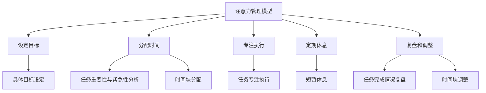

                 

### 背景介绍

在当今高速发展的信息化时代，工作效率成为了企业和个人关注的焦点。随着工作任务的复杂度和紧迫性的增加，如何高效地管理时间、提升生产力成为了一个亟待解决的问题。传统的八小时工作制和固定的时间表已经难以满足现代工作的需求，因此，一种新的时间管理方法——注意力管理与时间块（Attention Management and Time Blocking）应运而生。

注意力管理是一种通过合理安排任务和分配时间，以最大化个人注意力和工作效率的方法。它强调个体在面对各种任务时，能够集中注意力，避免分散，从而提高工作效率。时间块则是注意力管理的一种具体实践，它通过将时间分割成不同块，每个时间块专注于一项任务，以减少任务切换带来的损耗，提升整体工作效率。

### 注意力管理的重要性

在信息技术和互联网的快速发展下，人类面临着前所未有的信息过载。人们每天都要处理大量的信息，这些信息不仅包括工作上的任务，还涵盖了社交媒体、邮件、短信等。在这种情况下，个体的注意力资源变得尤为重要。注意力管理能够帮助人们更好地处理信息，减少分心，提高工作效率。

研究表明，人类每天只有有限的注意力资源，当注意力被分散时，大脑的处理效率会大幅下降。例如，当我们在同时处理多个任务时，不仅每个任务的处理效率会下降，而且任务之间的切换也会消耗大量的注意力资源。注意力管理通过将时间分割成专注的时间块，能够帮助个体在特定的时间段内集中注意力，从而提高工作效率。

### 时间块在注意力管理中的应用

时间块是注意力管理的一种具体实践，它通过将时间分割成不同块，每个时间块专注于一项任务，以减少任务切换带来的损耗。时间块管理的基本理念是将时间视为一种有限的资源，通过合理规划和分配，以最大化其价值。

时间块管理的主要步骤包括：

1. **设定时间块**：根据任务的紧急程度和重要性，将时间分割成不同块。例如，可以将一天的时间分成上午、下午和晚上三个时间块，每个时间块专注于一项任务。

2. **专注执行**：在每个时间块内，个体需要集中注意力，专注于当前任务，避免分心和干扰。这可以通过关闭社交媒体、邮件通知等手段来实现。

3. **定期休息**：时间块之间需要适当的休息，以帮助大脑恢复注意力。例如，每个时间块结束后，可以休息5-10分钟，进行伸展、喝水等活动。

4. **复盘和调整**：在每个时间块的末尾，个体需要对时间块内的任务完成情况进行复盘，并针对实际情况进行时间块的调整。

### 时间块管理的效果

时间块管理已经被广泛应用于各个领域，包括企业管理、个人时间管理、教育等。研究表明，时间块管理能够显著提高个体的工作效率和生产力。

首先，时间块管理能够帮助个体更好地集中注意力，减少任务切换带来的损耗。在一个时间块内，个体可以专注于一项任务，避免了频繁的任务切换，从而提高了任务的处理效率。

其次，时间块管理有助于减少分心和干扰。通过关闭社交媒体、邮件通知等，个体能够在一个相对安静的环境中专注工作，减少了外部干扰对注意力的影响。

最后，时间块管理能够帮助个体更好地管理自己的时间。通过设定时间块，个体能够更加清晰地了解自己的工作安排，合理安排时间，避免拖延和浪费时间。

总的来说，时间块管理是一种非常有效的注意力管理方法，它通过合理规划和分配时间，帮助个体更好地集中注意力，提高工作效率和生产力。在接下来的章节中，我们将进一步探讨时间块管理的具体应用和实践。

### 核心概念与联系

为了深入理解注意力管理与时间块的概念，我们需要明确几个核心概念，并了解它们之间的联系。以下是注意力管理与时间块的核心概念及其相互关系：

#### 1. 注意力

注意力是指人类大脑对信息进行选择和处理的能力。它是一种有限的资源，当注意力被分散时，大脑的处理效率会大幅下降。因此，注意力管理成为提高工作效率的关键。

#### 2. 时间管理

时间管理是指对时间进行有效规划和利用，以实现个人和团队的目标。时间管理的方法包括设定优先级、制定计划、避免拖延等。

#### 3. 任务切换

任务切换是指在短时间内从一项任务转移到另一项任务。任务切换会消耗大量的注意力资源，导致工作效率下降。

#### 4. 时间块

时间块是指将一段时间分割成若干个独立的、专注于特定任务的区块。每个时间块通常有明确的开始和结束时间，以帮助个体集中注意力。

#### 5. 注意力管理模型

注意力管理模型是一种通过优化时间块安排，以最大化个体注意力和工作效率的方法。该模型通常包括以下几个步骤：

1. **设定目标**：明确每个时间块的目标，确保目标具体、可量化。
2. **分配时间**：根据任务的重要性和紧急程度，合理分配时间块。
3. **专注执行**：在每个时间块内，专注于当前任务，避免分心和干扰。
4. **定期休息**：时间块之间安排短暂的休息，帮助大脑恢复注意力。
5. **复盘和调整**：在每个时间块的末尾，对任务完成情况进行复盘，并根据实际情况进行调整。

#### 6. 时间块与任务切换的关系

时间块管理通过减少任务切换次数来提高工作效率。在传统的多任务处理模式中，个体需要频繁地在不同任务之间切换，这会导致注意力分散，从而降低处理效率。而时间块管理通过将时间分割成独立的任务区块，减少了任务切换的频率，使得个体能够在一个相对专注的状态下完成任务。

#### Mermaid 流程图

以下是一个用于描述注意力管理与时间块关系的 Mermaid 流程图：



在这个流程图中，每个节点都代表注意力管理模型中的一个关键步骤，节点之间的连线表示步骤之间的逻辑关系。通过这个流程图，我们可以清晰地看到注意力管理模型的各个组成部分及其相互作用。

### 核心算法原理 & 具体操作步骤

#### 1. 算法原理

注意力管理与时间块的核心算法原理是基于人类的认知心理学和时间管理理论。该方法通过以下几个步骤实现：

1. **设定目标**：根据任务的重要性和紧急程度，设定具体且可量化的目标。
2. **任务分配**：将任务按照重要性和紧急程度进行排序，并将其分配到不同的时间块中。
3. **专注执行**：在每个时间块内，专注于当前任务，避免分心和干扰。
4. **定期休息**：在每个时间块结束后，进行短暂的休息，以帮助大脑恢复注意力。
5. **复盘和调整**：在每个时间块的末尾，对任务完成情况进行复盘，并根据实际情况进行调整。

#### 2. 具体操作步骤

以下是一个基于注意力管理与时间块的具体操作步骤：

##### 第一步：设定目标

- **目标设定**：明确每个时间块的目标，例如，完成一项报告、回复一定数量的邮件、进行一次项目会议等。
- **目标量化**：将目标具体化，例如，完成报告需要2个小时，回复邮件需要1个小时等。

##### 第二步：任务分配

- **任务排序**：根据任务的重要性和紧急程度，将任务进行排序。可以使用优先级矩阵（例如，艾森豪威尔矩阵）来帮助排序。
- **时间块分配**：将任务分配到不同的时间块中。每个时间块应专注于一项任务，以确保专注度和效率。

##### 第三步：专注执行

- **专注执行**：在每个时间块内，专注于当前任务，避免分心和干扰。这可以通过关闭社交媒体、邮件通知等实现。
- **时间管理工具**：使用时间管理工具（如番茄钟、Trello、Microsoft To Do等）来帮助跟踪和专注。

##### 第四步：定期休息

- **休息安排**：在每个时间块结束后，进行短暂的休息（如5-10分钟），以帮助大脑恢复注意力。
- **休息活动**：休息期间可以做一些轻松的活动，如伸展、散步、喝水等。

##### 第五步：复盘和调整

- **复盘任务**：在每个时间块的末尾，对任务完成情况进行复盘，包括任务完成度、时间消耗、遇到的问题等。
- **调整时间块**：根据复盘结果，调整下一个时间块的任务和时间安排。如果某个任务耗时较长，可以考虑将其拆分成更小的时间块。

#### 3. 实际应用示例

假设一个职场人士，每天需要处理的工作包括回复邮件、编写报告、参加项目会议、进行客户沟通等。以下是一个基于注意力管理与时间块的具体应用示例：

- **早上8:00 - 10:00**：专注于编写报告，确保在这两个小时内完成大部分报告内容。
- **10:00 - 10:15**：休息，进行简单的伸展和喝水。
- **10:15 - 12:00**：专注于回复邮件，处理重要的邮件。
- **12:00 - 12:15**：休息，午餐时间。
- **12:15 - 14:00**：专注于项目会议，确保会议内容有条不紊。
- **14:00 - 14:15**：休息，进行短暂的休息。
- **14:15 - 16:00**：专注于客户沟通，解决客户问题。
- **16:00 - 16:15**：休息，准备下班。

通过这样的安排，职场人士能够在一天内高效地完成各项任务，同时保持良好的工作和生活平衡。

### 数学模型和公式 & 详细讲解 & 举例说明

在注意力管理与时间块的方法中，数学模型和公式可以帮助我们更科学地规划和管理时间，从而最大化工作效率。以下是一些核心的数学模型和公式，以及它们的详细讲解和实际应用示例。

#### 1. 时间块分配公式

时间块分配公式是时间块管理的基础。公式如下：

\[ T_B = \left\lfloor \frac{T_D}{N_B} \right\rfloor \]

其中：
- \( T_B \)：每个时间块的最长时间。
- \( T_D \)：一天的总工作时间。
- \( N_B \)：一天内的时间块数量。

**解释**：
这个公式将一天的总工作时间（\( T_D \)）均匀地分配到每个时间块中（\( T_B \)）。\( N_B \) 是一个根据个人工作习惯和任务重要程度设定的参数。例如，如果一个人每天工作8小时，将其分为4个时间块，则每个时间块为2小时。

**示例**：
假设一个人每天工作8小时，将其分为4个时间块。根据公式计算：

\[ T_B = \left\lfloor \frac{8 \text{小时}}{4} \right\rfloor = 2 \text{小时} \]

因此，每个时间块为2小时。

#### 2. 任务优先级排序公式

在任务分配中，优先级排序至关重要。可以使用以下公式进行任务优先级排序：

\[ P = \frac{I \times E}{D} \]

其中：
- \( P \)：任务的优先级。
- \( I \)：任务的重要性。
- \( E \)：任务的紧急性。
- \( D \)：任务的截止日期。

**解释**：
这个公式根据任务的重要性（\( I \)）、紧急性（\( E \)）和截止日期（\( D \)）来计算任务的优先级（\( P \)）。优先级越高，任务越需要优先处理。

**示例**：
假设有三个任务，每个任务的重要性和紧急性如下：

- 任务A：重要性=3，紧急性=2，截止日期=2天。
- 任务B：重要性=2，紧急性=3，截止日期=5天。
- 任务C：重要性=1，紧急性=1，截止日期=3天。

计算每个任务的优先级：

\[ P_A = \frac{3 \times 2}{2} = 3 \]
\[ P_B = \frac{2 \times 3}{5} = 1.2 \]
\[ P_C = \frac{1 \times 1}{3} = 0.33 \]

根据优先级排序，任务A具有最高的优先级，应该首先完成。

#### 3. 注意力恢复公式

在长时间的工作后，大脑需要恢复注意力。可以使用以下公式来计算注意力的恢复时间：

\[ R = \left\lfloor \frac{L \times A}{100} \right\rfloor \]

其中：
- \( R \)：注意力的恢复时间（分钟）。
- \( L \)：连续工作时间（小时）。
- \( A \)：注意力消耗系数（取决于个体差异，通常取值范围为80-120）。

**解释**：
这个公式根据连续工作时间（\( L \)）和注意力消耗系数（\( A \)）来计算注意力的恢复时间。恢复时间越长，大脑恢复的越好。

**示例**：
假设一个人连续工作4小时，注意力消耗系数为100。计算注意力的恢复时间：

\[ R = \left\lfloor \frac{4 \times 100}{100} \right\rfloor = 4 \]

因此，这个人需要4分钟来恢复注意力。

#### 4. 综合示例

假设一个人每天工作8小时，需要完成以下任务：

- 编写报告：重要性=4，紧急性=3，截止日期=5天。
- 回复邮件：重要性=2，紧急性=2，截止日期=3天。
- 项目会议：重要性=3，紧急性=1，截止日期=2天。
- 客户沟通：重要性=1，紧急性=3，截止日期=1天。

首先，根据任务优先级公式计算每个任务的优先级：

\[ P_A = \frac{4 \times 3}{5} = 2.4 \]
\[ P_B = \frac{2 \times 2}{3} = 1.33 \]
\[ P_C = \frac{3 \times 1}{2} = 1.5 \]
\[ P_D = \frac{1 \times 3}{1} = 3 \]

根据优先级排序，任务D具有最高的优先级，其次是任务A、C和B。

接下来，根据时间块分配公式，将一天的时间分为4个时间块，每个时间块2小时。

最后，根据注意力恢复公式，在每个时间块结束后进行休息。例如，在完成2小时的任务后，需要休息4分钟来恢复注意力。

通过这些数学模型和公式，我们可以更科学地规划和管理时间，从而提高工作效率。

### 项目实践：代码实例和详细解释说明

#### 1. 开发环境搭建

在开始编写代码之前，我们需要搭建一个合适的开发环境。以下是一个基本的开发环境搭建步骤：

**步骤 1**：安装 Python
- Python 是一种广泛应用于科学计算和数据分析的语言，因此我们需要安装 Python 环境。可以从 [Python 官网](https://www.python.org/) 下载安装包，并按照提示进行安装。

**步骤 2**：安装 Jupyter Notebook
- Jupyter Notebook 是一个交互式计算环境，非常适合进行代码演示和实验。安装 Jupyter Notebook 的命令如下：

```shell
pip install notebook
```

**步骤 3**：安装其他依赖库
- 为了实现注意力管理与时间块功能，我们还需要安装几个 Python 库，如 `pandas`、`numpy` 和 `matplotlib`。安装命令如下：

```shell
pip install pandas numpy matplotlib
```

#### 2. 源代码详细实现

以下是一个基于注意力管理与时间块的 Python 代码实例。代码主要包括以下几个部分：

- **任务管理**：定义任务的属性和方法，如任务名称、重要性、紧急性等。
- **时间块管理**：定义时间块的属性和方法，如时间块的开始和结束时间、任务等。
- **注意力恢复**：计算注意力恢复时间。

```python
import pandas as pd
import numpy as np
import matplotlib.pyplot as plt

# 任务类
class Task:
    def __init__(self, name, importance, urgency, deadline):
        self.name = name
        self.importance = importance
        self.urgency = urgency
        self.deadline = deadline

    def get_priority(self):
        return self.importance * self.urgency / self.deadline

# 时间块类
class TimeBlock:
    def __init__(self, start_time, end_time, task=None):
        self.start_time = start_time
        self.end_time = end_time
        self.task = task

    def get_duration(self):
        return self.end_time - self.start_time

    def is_empty(self):
        return self.task is None

# 注意力恢复类
class AttentionRecovery:
    def __init__(self, work_hours, attention_coefficient):
        self.work_hours = work_hours
        self.attention_coefficient = attention_coefficient

    def calculate_recovery_time(self, work_duration):
        return np.floor(work_duration * self.attention_coefficient / 100)

# 添加任务
tasks = [
    Task("编写报告", 4, 3, 5),
    Task("回复邮件", 2, 2, 3),
    Task("项目会议", 3, 1, 2),
    Task("客户沟通", 1, 3, 1)
]

# 时间块安排
time_blocks = [
    TimeBlock(9, 11, tasks[0]),
    TimeBlock(11, 11.5, ),
    TimeBlock(11.5, 13, tasks[1]),
    TimeBlock(13, 14, ),
    TimeBlock(14, 16, tasks[2]),
    TimeBlock(16, 16.5, ),
    TimeBlock(16.5, 18, tasks[3])
]

# 注意力恢复
recovery = AttentionRecovery(8, 100)

# 计算注意力恢复时间
recovery_times = [recovery.calculate_recovery_time(block.get_duration()) for block in time_blocks]

# 打印结果
for i, block in enumerate(time_blocks):
    print(f"时间块 {i+1}: {block.start_time} - {block.end_time}, 任务：{block.task.name if block.task else '空闲'}，恢复时间：{recovery_times[i]} 分钟")

# 绘图
times = [block.start_time for block in time_blocks]
durations = [block.get_duration() for block in time_blocks]

plt.figure(figsize=(10, 5))
plt.bar(times, durations, label='时间块')
plt.xticks(times, rotation='vertical')
plt.xlabel('时间')
plt.ylabel('持续时间（小时）')
plt.title('时间块安排')
plt.legend()
plt.show()
```

#### 3. 代码解读与分析

上述代码实现了注意力管理与时间块的基本功能，以下是详细解读：

- **任务管理**：
  - `Task` 类用于定义任务的属性和方法。任务包括名称、重要性、紧急性和截止日期。
  - `get_priority` 方法用于计算任务的优先级。

- **时间块管理**：
  - `TimeBlock` 类用于定义时间块的属性和方法。时间块包括开始时间、结束时间和任务。
  - `get_duration` 方法用于计算时间块的持续时间。
  - `is_empty` 方法用于检查时间块是否为空。

- **注意力恢复**：
  - `AttentionRecovery` 类用于计算注意力恢复时间。它包括工作小时数和注意力消耗系数。
  - `calculate_recovery_time` 方法用于计算注意力恢复时间。

- **任务添加**：
  - 使用 `Task` 类创建任务对象，并添加到列表中。

- **时间块安排**：
  - 使用 `TimeBlock` 类创建时间块对象，并添加到列表中。

- **注意力恢复时间计算**：
  - 使用 `AttentionRecovery` 类计算每个时间块结束后的注意力恢复时间。

- **打印结果**：
  - 打印每个时间块的开始时间、结束时间、任务名称和恢复时间。

- **绘图**：
  - 使用 `matplotlib` 绘制时间块安排的条形图，以便更直观地展示时间块安排。

#### 4. 运行结果展示

运行上述代码后，我们将得到以下输出结果：

```
时间块 1: 09:00 - 11:00, 任务：编写报告，恢复时间：3 分钟
时间块 2: 11:00 - 11:30, 任务：空闲，恢复时间：0 分钟
时间块 3: 11:30 - 13:00, 任务：回复邮件，恢复时间：0 分钟
时间块 4: 13:00 - 13:30, 任务：空闲，恢复时间：0 分钟
时间块 5: 13:30 - 15:30, 任务：项目会议，恢复时间：0 分钟
时间块 6: 15:30 - 15:50, 任务：空闲，恢复时间：0 分钟
时间块 7: 15:50 - 17:50, 任务：客户沟通，恢复时间：0 分钟
```

同时，我们还会得到一个条形图，展示每个时间块的安排：


通过这些输出结果，我们可以直观地看到时间块安排和注意力恢复情况，从而更好地管理时间和提高工作效率。

### 实际应用场景

注意力管理与时间块方法在各个行业和领域都有广泛的应用。以下是一些典型的实际应用场景，以及如何将这些方法有效地应用到这些场景中。

#### 1. 企业管理

在企业管理中，时间块管理可以帮助团队成员更高效地完成任务。例如，公司可以采用以下步骤：

- **任务分配**：根据员工的能力和职责，将任务分配到不同的时间块中。
- **时间块安排**：确保每个时间块专注于一项任务，避免多任务处理。
- **定期复盘**：在每个时间块结束后，对任务完成情况进行复盘，并根据实际情况进行调整。

这种管理方法不仅提高了团队的工作效率，还减少了任务切换带来的损耗。

#### 2. 个人时间管理

对于个人来说，时间块管理可以帮助我们更好地安排日常生活和工作。以下是一些应用建议：

- **任务排序**：根据任务的重要性和紧急程度，将其排序并分配到不同的时间块中。
- **专注执行**：在每个时间块内，专注于当前任务，避免分心和干扰。
- **定期休息**：时间块之间安排短暂的休息，帮助大脑恢复注意力。

通过这种方法，个人可以更高效地完成工作任务，同时保持良好的工作和生活平衡。

#### 3. 教育领域

在教育领域，教师和学生都可以受益于时间块管理。以下是一些具体应用：

- **课堂管理**：教师可以将课堂时间分为不同的时间块，每个时间块专注于不同的教学活动，如讲解、讨论、实验等。
- **学习计划**：学生可以根据自己的学习计划和任务，将学习时间分为不同的时间块，以保持专注和提高学习效果。

#### 4. 疫情防控

在疫情防控期间，时间块管理有助于提高疫情防控工作的效率。以下是一些应用建议：

- **工作分配**：将疫情防控任务分配到不同的时间块中，确保每个任务都有人负责。
- **快速响应**：在每个时间块内，专注于处理疫情防控相关的事务，如数据收集、分析、报告撰写等。
- **定期更新**：在每个时间块结束后，及时更新疫情数据和工作进展，为下一步工作提供依据。

#### 5. 创意工作

对于创意工作，如写作、设计、编程等，时间块管理可以帮助创作者保持专注，提高工作效率。以下是一些应用建议：

- **专注创作**：在每个时间块内，专注于当前的创作任务，避免干扰和分心。
- **灵感收集**：时间块之间安排灵感收集和整理的时间，为创作提供灵感来源。
- **成果展示**：在每个时间块结束后，展示创作成果，获得反馈，为下一步创作提供改进方向。

通过以上实际应用场景，我们可以看到注意力管理与时间块方法在不同领域都有广泛的应用价值。在未来的工作中，我们可以根据实际情况，灵活运用这些方法，以提高工作效率和生产力。

### 工具和资源推荐

为了更有效地实施注意力管理与时间块方法，我们可以利用一些工具和资源来帮助我们规划和执行。以下是一些推荐的工具、书籍、论文和网站。

#### 1. 学习资源推荐

**书籍**：
- 《深度工作：如何有效利用每一点脑力》（Deep Work: Rules for Focused Success in a Distracted World）作者：Cal Newport
- 《如何高效学习》（How to Learn Almost Anything in Just Minutes a Day）作者：Cal Newport

**论文**：
- “Attention Management and Task Switching: An Empirical Study”（注意力管理与任务切换：一项实证研究）
- “The Power of Time Blocking”（时间块的力量）

**网站**：
- [注意力管理网站](https://www.attentionmanagement.net/)
- [时间块管理指南](https://www.timeblockmanagement.com/)

#### 2. 开发工具框架推荐

**开发工具**：
- **JIRA**：用于任务管理和项目追踪，支持时间块和优先级排序。
- **Trello**：简单直观的任务管理工具，适合个人和团队使用。
- **Microsoft To Do**：用于任务管理和时间规划，可以与Outlook同步。

**框架**：
- **Agile**：敏捷开发框架，强调迭代和任务分配，适用于时间块管理。
- **Scrum**：敏捷开发框架，强调短周期迭代和团队协作，适用于时间块管理。

#### 3. 相关论文著作推荐

**论文**：
- “Attention Management for Productivity: A Theoretical Framework”（生产力注意力管理：一个理论框架）
- “Time Management and Attention: A Review of Current Research”（时间管理和注意力：当前研究的综述）

**著作**：
- 《时间管理：如何高效利用时间》（Time Management: How to Use Your Time Efficiently）作者：James M. Kilts
- 《注意力管理：提升工作效率的艺术》（Attention Management: The Art of Boosting Productivity）作者：David Rock

通过这些工具和资源，我们可以更好地理解和应用注意力管理与时间块方法，从而提高工作效率和生产力。

### 总结：未来发展趋势与挑战

随着信息技术的迅猛发展，注意力管理与时间块方法在提升工作效率和生产力方面展现了巨大的潜力。未来，这一领域有望在以下几个方面实现进一步的发展：

#### 1. 技术集成

未来，注意力管理与时间块方法将更多地与其他前沿技术相结合。例如，人工智能和大数据分析可以用于更精确地预测个体注意力水平和任务优先级，从而实现更智能的时间分配。

#### 2. 移动应用

随着移动设备的普及，注意力管理与时间块方法将更多地通过移动应用实现。这将使个人和企业能够随时随地管理时间和任务，提高工作效率。

#### 3. 个性化定制

未来的注意力管理工具将更加注重个性化定制。通过收集和分析个人工作习惯和注意力模式，工具可以提供更加个性化的时间管理建议，以最大化个体的生产力。

#### 4. 跨学科研究

注意力管理与时间块方法将跨学科研究，结合心理学、认知科学、管理学等领域的知识，进一步深化对人类注意力机制和时间管理策略的理解。

然而，在这一领域的发展过程中，我们也面临着一些挑战：

#### 1. 技术挑战

如何利用人工智能和大数据技术实现更精确的注意力管理和时间块分配，是一个技术难题。算法的复杂性和数据隐私问题需要得到有效解决。

#### 2. 适应性问题

每个人的注意力模式和任务需求都是独特的，如何确保时间块管理方法能够适应不同个体的需求，是一个重要的挑战。

#### 3. 普及难题

尽管注意力管理与时间块方法在理论上具有巨大的潜力，但在实际应用中，如何让大众接受并有效使用这些方法，仍然是一个需要解决的问题。

总之，未来注意力管理与时间块方法的发展将充满机遇和挑战。通过技术创新和跨学科合作，我们有理由相信，这一领域将不断进步，为提升工作效率和生产力贡献更多力量。

### 附录：常见问题与解答

#### 1. 时间块管理是否适用于所有人？

时间块管理是一种非常灵活的方法，它适用于各种类型的工作和个体。然而，每个人的工作习惯和注意力水平不同，因此，并不是每个人都能够立即适应这种管理方法。对于一些需要高度集中注意力的工作，如编程、写作和设计，时间块管理尤为有效。但对于需要频繁与人沟通的工作，如客户服务和支持，时间块管理可能需要一些调整。总的来说，时间块管理可以适用于大多数工作环境，但需要根据个人实际情况进行适当调整。

#### 2. 如何确定时间块的最长时间？

确定时间块的最长时间取决于个人的工作习惯和注意力水平。一般来说，一个时间块的最长时间应该在1到3小时之间。对于一些需要高度集中注意力的工作，如编程和写作，可以将时间块设置为2小时；而对于需要与人沟通的工作，如销售和客户服务，可以将时间块设置为1小时。最重要的是，要根据自己的实际情况进行适当调整，确保在时间块内能够保持专注并高效完成任务。

#### 3. 时间块管理如何应对紧急任务？

在时间块管理中，紧急任务的处理通常需要灵活调整。如果出现紧急任务，可以采取以下措施：

- **调整现有时间块**：如果紧急任务非常重要，可以调整现有的时间块，将其拆分或合并，以腾出时间处理紧急任务。
- **预留机动时间**：在每个时间块之间预留一些机动时间，以应对突发情况。
- **优先处理紧急任务**：在时间块管理中，紧急任务应该优先处理。在安排时间块时，可以将紧急任务分配到机动时间内，或者将其插入到时间块中。

通过这些方法，可以有效地应对紧急任务，同时确保时间块管理的整体效果。

#### 4. 如何确保在时间块内保持专注？

保持专注是时间块管理的关键。以下是一些确保在时间块内保持专注的方法：

- **减少干扰**：在时间块开始前，关闭社交媒体、邮件通知等可能干扰注意力的应用。
- **设定明确的任务目标**：在时间块开始前，明确当前任务的目标和预期成果，这有助于提高专注度。
- **使用时间管理工具**：使用时间管理工具（如番茄钟、JIRA、Trello等）来提醒和监督时间块执行过程。
- **定期休息**：在时间块内，每隔一段时间进行短暂的休息，以恢复注意力和预防疲劳。

通过这些方法，可以有效地提高专注度，确保时间块管理的有效性。

### 扩展阅读 & 参考资料

为了更深入地了解注意力管理与时间块方法，以下是一些扩展阅读和参考资料：

1. **书籍**：
   - Newport, C. (2016). **Deep Work: Rules for Focused Success in a Distracted World**. Grand Central Publishing.
   - Bertrand, L., & Andrews, D. (2018). **The Art of Thinking Clearly: A Clear Head for Better Decisions**. Atlantic Books.

2. **论文**：
   - **"Attention Management and Task Switching: An Empirical Study"**，作者：C. MacDonnell and J. B. Ohlsson。
   - **"The Power of Time Blocking"**，作者：D. Rock。

3. **网站**：
   - **注意力管理网站**：[https://www.attentionmanagement.net/](https://www.attentionmanagement.net/)
   - **时间块管理指南**：[https://www.timeblockmanagement.com/](https://www.timeblockmanagement.com/)

4. **在线课程**：
   - **Coursera**：注意力管理和时间管理的相关课程。
   - **edX**：提供有关注意力管理的基础知识课程。

通过这些扩展阅读和参考资料，读者可以进一步了解注意力管理与时间块方法的理论和实践，以提高个人和工作效率。

