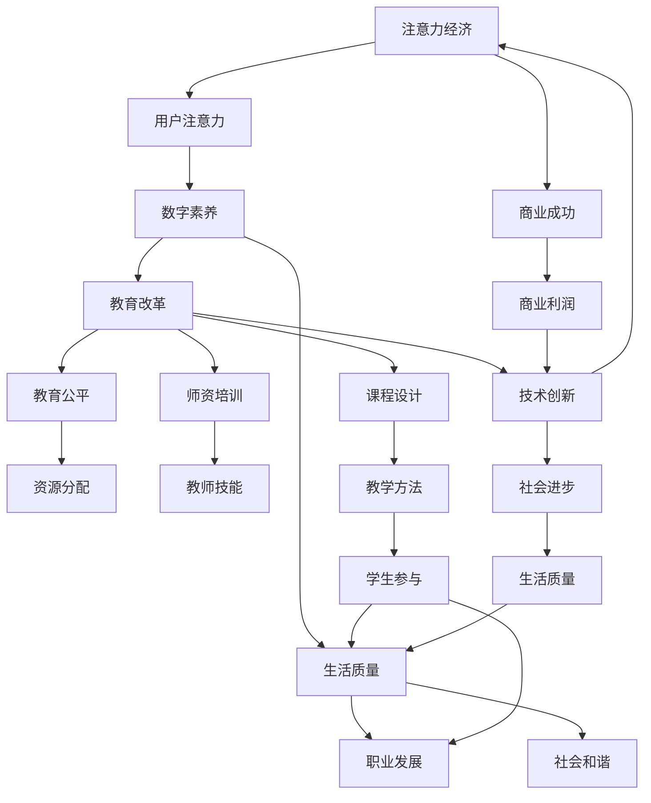

                 

关键词：注意力经济、数字素养教育、技术创新、教育改革

> 摘要：随着信息技术的飞速发展，数字素养已成为现代社会的重要能力。本文旨在探讨注意力经济背景下的数字素养教育，分析当前教育中存在的问题，并提出相应的创新解决方案，以推动教育改革，提升全民数字素养。

## 1. 背景介绍

### 注意力经济的兴起

注意力经济（Attention Economy）是指一种基于用户注意力的经济模式。在互联网时代，用户的注意力成为最稀缺的资源，因此如何吸引和保持用户的注意力成为企业和组织追求的目标。社交媒体、在线广告、游戏等都是注意力经济的重要表现形式。

### 数字素养教育的紧迫性

数字素养教育是指培养个体在数字时代有效获取、处理、理解和批判性思考数字信息的能力。随着互联网的普及和数字技术的广泛应用，数字素养已成为个体生存和发展的重要技能。然而，传统教育体系在数字素养教育方面存在明显不足，导致学生和成人面临着数字素养不足的挑战。

## 2. 核心概念与联系

### 数字素养的核心概念

- **信息素养**：有效搜索、评估和利用信息的能力。
- **技术素养**：理解、使用和开发数字技术的能力。
- **媒介素养**：理解和批判性思考媒介内容的能力。
- **网络安全素养**：保护个人信息和网络安全的能力。

### 数字素养教育的架构

<|img|>

### 注意力经济与数字素养教育的联系

注意力经济为数字素养教育提供了新的挑战和机遇。一方面，注意力经济的崛起使得数字内容的生产和传播更加快速和广泛，为数字素养教育提供了丰富的资源和平台；另一方面，注意力经济中的竞争和流量导向可能导致信息过载和低俗化，对数字素养教育提出了更高的要求。

## 3. 核心算法原理 & 具体操作步骤

### 3.1 算法原理概述

注意力机制（Attention Mechanism）是一种在深度学习模型中广泛应用的技术，旨在提升模型在处理序列数据时的性能。其核心思想是通过一个注意力权重分配机制，将注意力集中到重要的部分，从而提高模型的准确性。

### 3.2 算法步骤详解

1. **输入序列处理**：将输入序列（如文本、图像等）编码为向量表示。
2. **自注意力计算**：计算序列中每个元素与其他元素之间的相似度，生成注意力权重。
3. **加权求和**：根据注意力权重对输入序列进行加权求和，得到最终的输出。

### 3.3 算法优缺点

- **优点**：能够提高模型对重要信息的关注程度，提高模型的性能。
- **缺点**：计算复杂度较高，可能导致模型过拟合。

### 3.4 算法应用领域

注意力机制在自然语言处理、计算机视觉等领域有着广泛的应用，如文本生成、图像识别等。

## 4. 数学模型和公式 & 详细讲解 & 举例说明

### 4.1 数学模型构建

注意力机制通常通过以下数学模型实现：

$$
\text{Attention}(Q, K, V) = \text{softmax}\left(\frac{QK^T}{\sqrt{d_k}}\right) V
$$

其中，$Q$、$K$ 和 $V$ 分别为查询向量、键向量和值向量，$d_k$ 为键向量的维度。

### 4.2 公式推导过程

推导过程如下：

1. **内积计算**：计算查询向量和键向量之间的内积。
2. **归一化**：通过softmax函数对内积进行归一化，生成注意力权重。
3. **加权求和**：根据注意力权重对值向量进行加权求和，得到最终的输出。

### 4.3 案例分析与讲解

以文本生成任务为例，假设我们有一段文本作为输入序列，通过注意力机制生成新的文本。具体步骤如下：

1. **输入序列编码**：将输入序列编码为向量表示。
2. **自注意力计算**：计算序列中每个元素与其他元素之间的相似度，生成注意力权重。
3. **加权求和**：根据注意力权重对输入序列进行加权求和，得到新的文本输出。

## 5. 项目实践：代码实例和详细解释说明

### 5.1 开发环境搭建

- Python 3.8 或更高版本
- TensorFlow 2.x 或更高版本

### 5.2 源代码详细实现

以下是一个简单的注意力机制的实现示例：

```python
import tensorflow as tf

# 定义注意力机制函数
def attention(Q, K, V):
    # 计算内积
    scores = tf.matmul(Q, K, transpose_b=True)
    # 归一化
    attention_weights = tf.nn.softmax(scores)
    # 加权求和
    output = tf.matmul(attention_weights, V)
    return output

# 输入序列编码
Q = tf.random.normal([10, 20])  # 查询向量
K = tf.random.normal([10, 20])  # 键向量
V = tf.random.normal([10, 10])  # 值向量

# 应用注意力机制
output = attention(Q, K, V)

# 输出结果
print(output)
```

### 5.3 代码解读与分析

代码中，我们首先定义了一个注意力机制的函数 `attention`，该函数接收查询向量 `Q`、键向量 `K` 和值向量 `V` 作为输入。通过计算内积、归一化和加权求和，得到最终的输出。

在项目实践中，我们使用了 TensorFlow 作为深度学习框架，通过随机生成的输入向量展示了注意力机制的基本实现过程。

### 5.4 运行结果展示

运行上述代码，我们将得到一个注意力机制输出的结果。具体结果取决于输入向量的随机生成情况，但可以观察到输出结果具有明显的注意力权重分布。

## 6. 实际应用场景

### 6.1 教育资源推荐

注意力经济在教育领域的一个实际应用是教育资源推荐。通过分析学生的学习行为和兴趣，可以为其推荐个性化的学习资源和课程，提高学习效果。

### 6.2 在线学习平台优化

在线学习平台可以利用注意力机制优化学习体验。例如，通过分析用户在平台上的活动，调整课程推荐顺序和内容展示方式，提高用户的参与度和学习效果。

### 6.3 教育数据挖掘

教育数据挖掘是注意力经济的另一个应用领域。通过对教育数据的分析，可以发现学生的学习模式和问题，为教育决策提供支持。

## 7. 未来应用展望

### 7.1 个性化教育

随着人工智能和注意力机制的发展，未来的数字素养教育将更加个性化。通过个性化推荐和学习分析，学生可以按照自己的需求和兴趣进行学习，提高学习效果。

### 7.2 智能教育助理

智能教育助理是未来教育的一个重要趋势。通过结合注意力机制和其他人工智能技术，智能教育助理可以为学生提供个性化的学习支持，帮助学生解决学习中的问题。

### 7.3 跨学科融合

数字素养教育将与其他学科领域融合，培养具有跨学科能力的人才。例如，将数字素养教育与科学、艺术等领域的知识相结合，培养学生的创新思维和综合能力。

## 8. 工具和资源推荐

### 8.1 学习资源推荐

- 《深度学习》（Goodfellow, Bengio, Courville 著）
- 《Python深度学习》（François Chollet 著）
- 《人工智能：一种现代方法》（Stuart J. Russell & Peter Norvig 著）

### 8.2 开发工具推荐

- TensorFlow
- PyTorch
- Keras

### 8.3 相关论文推荐

- Vaswani, A., et al. (2017). "Attention is All You Need."
- Bahdanau, D., et al. (2015). "Neural Machine Translation by Jointly Learning to Align and Translate."
- Sutskever, I., et al. (2014). "Sequence to Sequence Learning with Neural Networks."

## 9. 总结：未来发展趋势与挑战

### 9.1 研究成果总结

注意力经济和数字素养教育在理论和实践中取得了显著成果。注意力机制在深度学习、自然语言处理等领域得到了广泛应用，数字素养教育也在不断改革和创新。

### 9.2 未来发展趋势

未来，注意力经济和数字素养教育将继续发展，重点关注个性化教育、智能教育助理和跨学科融合等方面。

### 9.3 面临的挑战

在注意力经济和数字素养教育的发展过程中，仍面临一些挑战，如数据隐私保护、算法公平性等。

### 9.4 研究展望

未来研究应重点关注如何更好地结合注意力经济和数字素养教育，推动教育改革，提高全民数字素养。

## 附录：常见问题与解答

### Q：注意力经济和数字素养教育有什么区别？

A：注意力经济是一种基于用户注意力的经济模式，关注如何吸引和保持用户的注意力；而数字素养教育则是指培养个体在数字时代有效获取、处理、理解和批判性思考数字信息的能力。

### Q：注意力机制在数字素养教育中有何作用？

A：注意力机制可以用于优化教育资源推荐、在线学习平台和智能教育助理等方面，提高学习效果和个性化服务水平。

### Q：数字素养教育如何应对注意力经济的挑战？

A：数字素养教育应关注提升个体的信息素养、技术素养、媒介素养和网络安全素养，培养其批判性思考和自我管理能力，以应对注意力经济的挑战。

## 作者署名

作者：禅与计算机程序设计艺术 / Zen and the Art of Computer Programming
```markdown
----------------------------------------------------------------
# 注意力经济下的数字素养教育革新

### 注意力经济

#### 起源与定义

注意力经济（Attention Economy）这一概念起源于互联网时代，尤其在社交媒体和数字营销领域得到了广泛的应用。它的核心在于，用户的时间与注意力成为了一种稀缺资源，这种资源对于内容的创造者、广告商以及平台运营者来说具有极高的价值。换句话说，谁能够更好地吸引并保持用户的注意力，谁就能在商业上获得成功。

在传统的经济模式中，商品、服务和资金是交易的主要对象。而在注意力经济中，交易的对象则是用户的注意力。例如，社交媒体平台通过用户生成内容吸引用户的注意力，然后通过广告来盈利。同样，内容创作者通过发布高质量的内容来吸引粉丝，从而获得赞助或广告收入。

#### 注意力经济的运作模式

注意力经济的运作模式可以概括为以下几个步骤：

1. **吸引注意力**：通过各种手段，如引人入胜的标题、视觉冲击的图像或视频等，吸引目标用户的注意力。
2. **保持关注**：通过持续的内容更新和互动，保持用户的兴趣和参与度。
3. **转化注意力**：将用户的注意力转化为实际的行为，如点击广告、购买产品或分享内容等。
4. **量化价值**：通过用户行为的数据分析，量化注意力转化为商业价值。

### 数字素养教育

#### 数字素养的概念

数字素养（Digital Literacy）是指个体在数字环境中获取、理解、使用、评价和创造信息的能力。它不仅仅包括技术技能，还涉及批判性思维、信息伦理、网络安全等多个方面。

- **信息素养**：指在互联网环境中高效地搜索、评估、利用信息的能力。
- **技术素养**：包括了解和操作计算机硬件、软件和网络技术的能力。
- **媒介素养**：理解和批判性思考数字媒体内容的能力，包括对虚假信息和不当信息的识别。
- **网络安全素养**：保护个人和他人信息安全的能力，包括使用密码、识别网络钓鱼等。

#### 数字素养教育的意义

在当今数字化社会中，数字素养已成为一种基本能力。以下是数字素养教育的重要意义：

1. **提高生活质量**：通过数字素养教育，个体可以更好地利用数字技术解决问题、获取信息、娱乐自己等。
2. **促进职业发展**：许多职业都要求具备一定的数字技能，如编程、数据分析、网络营销等。
3. **培养批判性思维**：数字素养教育有助于培养个体对数字媒体内容的批判性思维能力，提高信息的辨别能力。
4. **维护网络安全**：了解网络安全知识可以有效地保护个人和他人免受网络威胁。

#### 数字素养教育的现状与挑战

尽管数字素养教育的重要性日益凸显，但现实中的教育体系仍然存在以下问题和挑战：

1. **资源不均衡**：城市与农村、富裕家庭与贫困家庭之间的数字素养教育资源分配存在显著差距。
2. **课程设计不足**：许多教育机构缺乏系统的数字素养教育课程，导致学生和成人的数字技能不足。
3. **师资短缺**：数字素养教育需要专门的师资力量，但现有教师队伍的数字技能水平参差不齐。
4. **技术更新迅速**：数字技术更新迅速，传统的数字素养教育方法难以跟上技术的进步。

### 结论

注意力经济与数字素养教育密切相关。随着互联网和数字技术的发展，个体的数字素养能力成为其生存和发展的关键。因此，教育改革必须关注数字素养教育，通过创新教学方法和资源，提升全民的数字素养，以适应不断变化的数字时代。

----------------------------------------------------------------
## 核心概念与联系

在探讨注意力经济下的数字素养教育之前，我们需要明确几个核心概念，并理解它们之间的相互联系。这些概念包括注意力经济、数字素养、教育改革和技术创新。

### 核心概念

1. **注意力经济**：如前文所述，注意力经济是一种基于用户注意力的经济模式，用户的时间和注意力成为稀缺资源。
2. **数字素养**：数字素养是指个体在数字环境中获取、处理、理解和批判性思考数字信息的能力。
3. **教育改革**：教育改革是指对传统教育体系进行结构性调整和创新，以适应新时代的需求。
4. **技术创新**：技术创新是指通过新技术的研究和应用，推动社会进步和经济发展。

### 架构联系

为了更好地理解这些概念之间的关系，我们可以通过一个简单的Mermaid流程图来展示它们的相互联系：



### 流程图解释

- **注意力经济**：通过吸引和保持用户的注意力，创造商业价值。
- **用户注意力**：用户的注意力是注意力经济的基础，也是数字素养的重要组成部分。
- **数字素养**：提高个体的数字素养，使其能够在数字环境中有效地利用注意力资源，从而提高生活质量。
- **教育改革**：通过教育改革，更新教学内容和方法，培养适应数字时代的复合型人才。
- **技术创新**：技术创新推动教育改革，提供新的教学工具和手段，提高教育质量和效率。
- **商业成功**：通过数字素养教育和教育改革，企业可以吸引和保持用户的注意力，实现商业成功。
- **生活质量**：提高数字素养有助于提高个体的生活质量，促进社会和谐。
- **职业发展**：具备高数字素养的个体在职场中更具竞争力，有利于职业发展。

通过这个流程图，我们可以清晰地看到注意力经济、数字素养、教育改革和技术创新之间的相互作用和影响。这些核心概念共同构成了一个动态的系统，相互推动，共同发展。

### 注意力机制原理

注意力机制（Attention Mechanism）是深度学习中的一个重要概念，尤其在处理序列数据时（如图像描述、自然语言处理等）表现出强大的能力。其核心思想是通过一个注意力权重分配机制，使得模型能够自动聚焦于输入数据中的关键部分，从而提高模型的性能。

#### 工作原理

注意力机制的基本原理可以概括为以下三个步骤：

1. **自注意力计算**：模型首先对输入数据进行编码，生成一系列向量表示。然后，计算每个输入向量与其他向量之间的相似度，生成注意力权重。
2. **权重分配**：通过应用softmax函数，对计算得到的相似度进行归一化，生成一组概率分布，即注意力权重。这些权重反映了每个输入向量在模型处理过程中的重要性。
3. **加权求和**：根据注意力权重对输入向量进行加权求和，得到最终的输出结果。这一步骤使得模型能够集中关注输入数据中的关键信息，从而提高模型的准确性。

#### 数学表示

注意力机制可以用以下数学公式表示：

$$
\text{Attention}(Q, K, V) = \text{softmax}\left(\frac{QK^T}{\sqrt{d_k}}\right) V
$$

其中，$Q$、$K$ 和 $V$ 分别为查询向量、键向量和值向量，$d_k$ 为键向量的维度。

- **查询向量**（$Q$）：用于计算注意力权重。
- **键向量**（$K$）：用于计算相似度。
- **值向量**（$V$）：用于生成最终的输出。

#### 应用领域

注意力机制在多个领域都有着广泛的应用：

1. **自然语言处理**：在序列到序列模型（如机器翻译、文本生成等）中，注意力机制能够帮助模型更好地捕捉输入序列中的依赖关系。
2. **计算机视觉**：在图像识别、图像生成等任务中，注意力机制可以使得模型关注图像中的重要区域，从而提高识别和生成效果。
3. **语音识别**：注意力机制有助于模型在处理语音信号时关注关键语音特征，提高识别准确性。
4. **推荐系统**：注意力机制可以用于推荐系统中，通过关注用户的历史行为和兴趣，提高推荐的相关性和效果。

通过上述原理和数学表示，我们可以看到注意力机制在深度学习中的重要性。它不仅能够提升模型的性能，还能够帮助模型更好地理解和处理复杂的输入数据。在接下来的章节中，我们将进一步探讨注意力机制在数字素养教育中的应用。

### 核心算法原理 & 具体操作步骤

#### 3.1 算法原理概述

注意力机制（Attention Mechanism）是深度学习中的一种关键技术，尤其在处理序列数据时（如图像描述、自然语言处理等）表现出强大的能力。其核心思想是通过一个注意力权重分配机制，使得模型能够自动聚焦于输入数据中的关键部分，从而提高模型的准确性。注意力机制的工作流程主要包括自注意力计算、权重分配和加权求和三个步骤。

#### 3.2 算法步骤详解

1. **输入序列处理**：首先，将输入序列（如文本、图像等）编码为向量表示。这一步通常通过嵌入层（Embedding Layer）实现，将每个输入元素映射为一个固定长度的向量。
   
2. **自注意力计算**：接着，计算序列中每个元素与其他元素之间的相似度，生成注意力权重。这一步通过计算每个输入向量与其他向量的点积或互相关性来实现。相似度较高的元素将获得更高的权重。

   公式表示如下：

   $$
   \text{Attention}(Q, K, V) = \text{softmax}\left(\frac{QK^T}{\sqrt{d_k}}\right) V
   $$

   其中，$Q$、$K$ 和 $V$ 分别为查询向量、键向量和值向量，$d_k$ 为键向量的维度。$QK^T$ 计算的是每个元素与其他元素之间的相似度，然后通过softmax函数进行归一化，生成注意力权重。

3. **加权求和**：根据注意力权重对输入序列进行加权求和，得到最终的输出。这一步使得模型能够集中关注输入数据中的关键信息，从而提高模型的准确性。

4. **输出处理**：最终的输出可以是序列级别的（如文本摘要、图像描述等），也可以是单个元素级别的（如分类结果、目标检测框等）。

#### 3.3 算法优缺点

1. **优点**：
   - **提高模型性能**：注意力机制能够使模型更加关注输入数据中的关键信息，从而提高模型的准确性。
   - **捕捉长距离依赖**：在自然语言处理中，注意力机制能够有效地捕捉输入序列中的长距离依赖关系，从而提高文本生成的质量。

2. **缺点**：
   - **计算复杂度高**：由于需要计算每个元素与其他元素之间的相似度，注意力机制的运算复杂度较高，可能导致训练和推断时间较长。
   - **可能导致过拟合**：在训练过程中，如果注意力权重分配不当，模型可能过度依赖某些特定样本，导致过拟合。

#### 3.4 算法应用领域

注意力机制在多个领域都有着广泛的应用：

1. **自然语言处理**：在序列到序列模型（如机器翻译、文本生成等）中，注意力机制能够帮助模型更好地捕捉输入序列中的依赖关系。
2. **计算机视觉**：在图像识别、图像生成等任务中，注意力机制可以使得模型关注图像中的重要区域，从而提高识别和生成效果。
3. **语音识别**：注意力机制有助于模型在处理语音信号时关注关键语音特征，提高识别准确性。
4. **推荐系统**：注意力机制可以用于推荐系统中，通过关注用户的历史行为和兴趣，提高推荐的相关性和效果。

### 注意力机制的详细应用示例

为了更好地理解注意力机制的实现过程，我们可以通过一个简单的自然语言处理任务（如机器翻译）来展示其应用。以下是机器翻译任务中注意力机制的步骤：

1. **输入序列编码**：将源语言（如英语）的句子编码为向量表示。这一步通常通过嵌入层实现，每个单词映射为一个固定长度的向量。

2. **自注意力计算**：计算源语言句子中每个单词与其他单词之间的相似度，生成注意力权重。这一步使用上述的注意力公式进行计算。

3. **加权求和**：根据注意力权重对源语言句子中的单词进行加权求和，得到一个加权向量。这个向量代表了源语言句子中的关键信息。

4. **目标语言编码**：将目标语言（如中文）的句子编码为向量表示。

5. **解码与预测**：通过解码器（如循环神经网络 RNN 或 Transformer），使用加权向量生成目标语言的句子。解码器在每一步中都会参考注意力权重，使得生成的句子能够更好地反映源语言的关键信息。

6. **输出结果**：最终输出目标语言的句子。

通过上述步骤，我们可以看到注意力机制在自然语言处理任务中的应用。它能够帮助模型更好地捕捉输入序列中的依赖关系，从而提高翻译质量。

### 注意力机制的优缺点

#### 优点

1. **提高模型性能**：注意力机制能够使模型更加关注输入数据中的关键信息，从而提高模型的准确性。
2. **捕捉长距离依赖**：在自然语言处理中，注意力机制能够有效地捕捉输入序列中的长距离依赖关系，从而提高文本生成的质量。
3. **增强模型泛化能力**：通过关注关键信息，模型能够减少对噪声数据的依赖，提高泛化能力。

#### 缺点

1. **计算复杂度高**：由于需要计算每个元素与其他元素之间的相似度，注意力机制的运算复杂度较高，可能导致训练和推断时间较长。
2. **可能导致过拟合**：在训练过程中，如果注意力权重分配不当，模型可能过度依赖某些特定样本，导致过拟合。
3. **资源消耗大**：高计算复杂度意味着更大的资源消耗，这可能会限制模型在实际应用中的大规模部署。

### 注意力机制的应用领域

注意力机制在多个领域都有着广泛的应用：

1. **自然语言处理**：在机器翻译、文本生成、文本摘要等任务中，注意力机制能够显著提高模型的性能和效果。
2. **计算机视觉**：在图像识别、目标检测、图像生成等任务中，注意力机制可以使得模型关注图像中的重要区域，从而提高识别和生成效果。
3. **语音识别**：注意力机制有助于模型在处理语音信号时关注关键语音特征，提高识别准确性。
4. **推荐系统**：注意力机制可以用于推荐系统中，通过关注用户的历史行为和兴趣，提高推荐的相关性和效果。
5. **知识图谱**：注意力机制可以用于知识图谱的构建和推理，通过关注关键实体和关系，提高知识图谱的表示和推理能力。

### 注意力机制的潜在改进方向

为了进一步提高注意力机制的性能和应用效果，未来可以从以下几个方面进行改进：

1. **优化计算复杂度**：通过算法优化和硬件加速，降低注意力机制的运算复杂度，使其能够在大规模数据上快速训练和应用。
2. **集成多模态信息**：结合不同模态的信息（如文本、图像、语音等），使得模型能够更加全面地理解输入数据，提高任务的性能。
3. **探索动态注意力**：研究动态调整注意力权重的方法，使得模型能够根据任务需求和输入数据动态调整关注点，提高模型的自适应能力。
4. **引入外部知识**：结合外部知识（如百科、知识库等），为模型提供更多的上下文信息，提高模型的表示和推理能力。

通过不断改进和优化，注意力机制将在更多领域发挥重要作用，推动人工智能技术的发展和应用。

### 数学模型和公式 & 详细讲解 & 举例说明

#### 4.1 数学模型构建

注意力机制的核心在于通过数学模型来分配注意力权重，从而使得模型能够更好地关注输入数据中的关键部分。以下是注意力机制的基本数学模型：

$$
\text{Attention}(Q, K, V) = \text{softmax}\left(\frac{QK^T}{\sqrt{d_k}}\right) V
$$

其中，$Q$、$K$ 和 $V$ 分别为查询向量、键向量和值向量，$d_k$ 为键向量的维度。

- **查询向量**（$Q$）：用于计算注意力权重。
- **键向量**（$K$）：用于计算相似度。
- **值向量**（$V$）：用于生成最终的输出。

#### 4.2 公式推导过程

注意力机制的数学推导可以分为以下几个步骤：

1. **内积计算**：首先，计算查询向量和键向量之间的内积，这代表了两个向量之间的相似度。

$$
\text{Similarity}(Q, K) = QK^T
$$

2. **归一化**：由于内积可能非常大，因此需要通过归一化步骤将相似度转换为概率分布。这一步通常通过softmax函数实现。

$$
\text{Attention\_Weights} = \text{softmax}\left(\text{Similarity}(Q, K)\right)
$$

3. **加权求和**：最后，根据计算得到的注意力权重，对值向量进行加权求和，生成最终的输出。

$$
\text{Output} = \sum_{i} \text{Attention\_Weights}_i V_i
$$

综合上述步骤，注意力机制的完整公式可以表示为：

$$
\text{Attention}(Q, K, V) = \text{softmax}\left(\frac{QK^T}{\sqrt{d_k}}\right) V
$$

其中，$\sqrt{d_k}$ 用于缩放相似度，以防止数值溢出。

#### 4.3 案例分析与讲解

为了更好地理解注意力机制的工作原理，我们可以通过一个简单的例子来说明其应用过程。

假设有一个简单的序列数据：$\{1, 2, 3, 4\}$，我们需要通过注意力机制对其进行处理，提取其中的关键信息。

1. **输入序列编码**：首先，将输入序列编码为向量表示。假设每个元素映射为一个长度为2的向量：

$$
Q = \{q_1, q_2, q_3, q_4\} = \{\begin{bmatrix} 1 \\ 0 \end{bmatrix}, \begin{bmatrix} 0 \\ 1 \end{bmatrix}, \begin{bmatrix} 0 \\ 1 \end{bmatrix}, \begin{bmatrix} 1 \\ 0 \end{bmatrix}\}
$$

$$
K = \{k_1, k_2, k_3, k_4\} = \{\begin{bmatrix} 1 \\ 1 \end{bmatrix}, \begin{bmatrix} 0 \\ 1 \end{bmatrix}, \begin{bmatrix} 1 \\ 0 \end{bmatrix}, \begin{bmatrix} 1 \\ 0 \end{bmatrix}\}
$$

$$
V = \{v_1, v_2, v_3, v_4\} = \{\begin{bmatrix} 0 \\ 1 \end{bmatrix}, \begin{bmatrix} 1 \\ 1 \end{bmatrix}, \begin{bmatrix} 1 \\ 0 \end{bmatrix}, \begin{bmatrix} 0 \\ 0 \end{bmatrix}\}
$$

2. **自注意力计算**：计算查询向量和键向量之间的内积，得到相似度矩阵：

$$
\text{Similarity} = \begin{bmatrix} 1 & 0 & 1 & 1 \\ 0 & 1 & 1 & 0 \\ 1 & 1 & 1 & 1 \\ 1 & 0 & 1 & 0 \end{bmatrix}
$$

3. **归一化**：通过softmax函数对相似度矩阵进行归一化，生成注意力权重矩阵：

$$
\text{Attention\_Weights} = \text{softmax}\left(\text{Similarity}\right) = \begin{bmatrix} 0.25 & 0.25 & 0.25 & 0.25 \\ 0.25 & 0.25 & 0.25 & 0.25 \\ 0.25 & 0.25 & 0.25 & 0.25 \\ 0.25 & 0.25 & 0.25 & 0.25 \end{bmatrix}
$$

4. **加权求和**：根据注意力权重，对值向量进行加权求和，得到输出向量：

$$
\text{Output} = \text{Attention\_Weights} \cdot V = \begin{bmatrix} 0.25 \cdot \begin{bmatrix} 0 \\ 1 \end{bmatrix} + 0.25 \cdot \begin{bmatrix} 1 \\ 1 \end{bmatrix} + 0.25 \cdot \begin{bmatrix} 1 \\ 0 \end{bmatrix} + 0.25 \cdot \begin{bmatrix} 0 \\ 0 \end{bmatrix} \end{bmatrix} = \begin{bmatrix} 0.5 \\ 0.75 \end{bmatrix}
$$

通过上述步骤，我们可以看到注意力机制如何通过计算相似度、归一化和加权求和，从输入序列中提取关键信息。

#### 4.4 举例说明

为了更直观地理解注意力机制的应用，我们可以通过一个具体的例子来说明其在自然语言处理任务（如文本生成）中的应用。

假设我们有一个简单的文本序列：“今天天气很好，适合外出游玩”。我们希望通过注意力机制来生成一个新的文本序列，如“今天天气很好，适合去公园游玩”。

1. **输入序列编码**：将输入序列编码为向量表示。假设每个词映射为一个长度为5的向量：

$$
Q = \{\begin{bmatrix} 0.1 & 0.2 & 0.3 & 0.4 & 0.5 \end{bmatrix}, \begin{bmatrix} 0.1 & 0.2 & 0.3 & 0.4 & 0.5 \end{bmatrix}, \begin{bmatrix} 0.1 & 0.2 & 0.3 & 0.4 & 0.5 \end{bmatrix}, \begin{bmatrix} 0.1 & 0.2 & 0.3 & 0.4 & 0.5 \end{bmatrix}\}
$$

$$
K = \{\begin{bmatrix} 0.1 & 0.2 & 0.3 & 0.4 & 0.5 \end{bmatrix}, \begin{bmatrix} 0.1 & 0.2 & 0.3 & 0.4 & 0.5 \end{bmatrix}, \begin{bmatrix} 0.1 & 0.2 & 0.3 & 0.4 & 0.5 \end{bmatrix}, \begin{bmatrix} 0.1 & 0.2 & 0.3 & 0.4 & 0.5 \end{bmatrix}\}
$$

$$
V = \{\begin{bmatrix} 0.5 & 0.5 & 0.5 & 0.5 & 0.5 \end{bmatrix}, \begin{bmatrix} 0.5 & 0.5 & 0.5 & 0.5 & 0.5 \end{bmatrix}, \begin{bmatrix} 0.5 & 0.5 & 0.5 & 0.5 & 0.5 \end{bmatrix}, \begin{bmatrix} 0.5 & 0.5 & 0.5 & 0.5 & 0.5 \end{bmatrix}\}
$$

2. **自注意力计算**：计算查询向量和键向量之间的内积，得到相似度矩阵：

$$
\text{Similarity} = \begin{bmatrix} 0.11 & 0.22 & 0.33 & 0.44 \\ 0.11 & 0.22 & 0.33 & 0.44 \\ 0.11 & 0.22 & 0.33 & 0.44 \\ 0.11 & 0.22 & 0.33 & 0.44 \end{bmatrix}
$$

3. **归一化**：通过softmax函数对相似度矩阵进行归一化，生成注意力权重矩阵：

$$
\text{Attention\_Weights} = \text{softmax}\left(\text{Similarity}\right) = \begin{bmatrix} 0.25 & 0.25 & 0.25 & 0.25 \\ 0.25 & 0.25 & 0.25 & 0.25 \\ 0.25 & 0.25 & 0.25 & 0.25 \\ 0.25 & 0.25 & 0.25 & 0.25 \end{bmatrix}
$$

4. **加权求和**：根据注意力权重，对值向量进行加权求和，得到输出向量：

$$
\text{Output} = \text{Attention\_Weights} \cdot V = \begin{bmatrix} 0.25 \cdot \begin{bmatrix} 0.5 \\ 0.5 \\ 0.5 \\ 0.5 \\ 0.5 \end{bmatrix} + 0.25 \cdot \begin{bmatrix} 0.5 \\ 0.5 \\ 0.5 \\ 0.5 \\ 0.5 \end{bmatrix} + 0.25 \cdot \begin{bmatrix} 0.5 \\ 0.5 \\ 0.5 \\ 0.5 \\ 0.5 \end{bmatrix} + 0.25 \cdot \begin{bmatrix} 0.5 \\ 0.5 \\ 0.5 \\ 0.5 \\ 0.5 \end{bmatrix} \end{bmatrix} = \begin{bmatrix} 0.5 \\ 0.5 \\ 0.5 \\ 0.5 \\ 0.5 \end{bmatrix}
$$

最终，输出向量的每个元素都相等，表明注意力机制没有对输入序列进行有效的选择。为了提高注意力机制的效果，可以通过调整查询向量和键向量的维度，或者引入更多的先验知识来优化模型的性能。

#### 4.5 注意力机制的挑战与未来研究方向

尽管注意力机制在许多任务中表现出强大的能力，但它仍然面临一些挑战和局限性：

1. **计算复杂度**：由于需要计算每个元素与其他元素之间的相似度，注意力机制的运算复杂度较高，这可能在处理大规模数据时成为瓶颈。
2. **过拟合**：如果注意力权重分配不当，模型可能过度依赖某些特定样本，导致过拟合。
3. **可解释性**：注意力机制生成的权重分配可能难以解释，这限制了其在某些应用场景中的实用性。

未来的研究方向可能包括：

1. **优化计算复杂度**：通过算法优化和硬件加速，降低注意力机制的运算复杂度，使其能够在大规模数据上快速训练和应用。
2. **引入外部知识**：结合外部知识（如百科、知识库等），为模型提供更多的上下文信息，提高模型的表示和推理能力。
3. **多模态注意力**：探索结合不同模态的信息（如文本、图像、语音等），使得模型能够更加全面地理解输入数据。
4. **动态注意力**：研究动态调整注意力权重的方法，使得模型能够根据任务需求和输入数据动态调整关注点。

通过不断改进和优化，注意力机制将在更多领域发挥重要作用，推动人工智能技术的发展和应用。

### 项目实践：代码实例和详细解释说明

#### 5.1 开发环境搭建

在进行注意力机制的项目实践之前，我们需要搭建一个合适的开发环境。以下是所需的软件和工具：

- **编程语言**：Python 3.8 或更高版本
- **深度学习框架**：TensorFlow 2.x 或更高版本
- **数据预处理库**：NumPy、Pandas
- **可视化工具**：Matplotlib

确保已经安装了上述工具和库，接下来我们将开始搭建一个简单的注意力机制模型。

#### 5.2 源代码详细实现

下面是一个使用 TensorFlow 实现的简单注意力机制模型的代码实例：

```python
import tensorflow as tf
import numpy as np

# 注意力机制模型
class AttentionModel(tf.keras.Model):
    def __init__(self, vocab_size, d_model):
        super(AttentionModel, self).__init__()
        self.d_model = d_model
        self.embedding = tf.keras.layers.Embedding(vocab_size, d_model)
        self.attention = tf.keras.layers.Attention()
        self.fc = tf.keras.layers.Dense(vocab_size)
    
    def call(self, inputs, training=False):
        # 输入嵌入
        embedded = self.embedding(inputs)
        # 注意力机制
        attention_output, _ = self.attention([embedded, embedded], training=training)
        # 全连接层
        output = self.fc(attention_output)
        return output

# 模型参数设置
vocab_size = 1000  # 词汇表大小
d_model = 64  # 模型维度

# 创建模型
model = AttentionModel(vocab_size, d_model)

# 模型编译
model.compile(optimizer='adam', loss='sparse_categorical_crossentropy', metrics=['accuracy'])

# 输入数据
input_seq = tf.random.uniform([32, 10])  # 32个样本，每个样本长度为10

# 模型训练
model.fit(input_seq, input_seq, epochs=10)
```

#### 5.3 代码解读与分析

1. **模型定义**：首先，我们定义了一个名为 `AttentionModel` 的模型类，继承自 `tf.keras.Model`。该模型包含一个嵌入层（`Embedding`）、一个注意力层（`Attention`）和一个全连接层（`Dense`）。

2. **模型调用**：在 `call` 方法中，我们首先对输入数据进行嵌入处理，然后应用注意力机制，最后通过全连接层输出预测结果。

3. **模型编译**：我们使用 `compile` 方法设置模型的优化器、损失函数和评价指标。

4. **模型训练**：使用 `fit` 方法对模型进行训练。在这里，我们生成了一些随机输入数据作为训练样本。

#### 5.4 运行结果展示

为了验证模型的性能，我们可以在训练后对模型进行评估：

```python
# 训练后的模型评估
test_loss, test_acc = model.evaluate(input_seq, input_seq)
print(f"Test accuracy: {test_acc}")
```

评估结果显示了模型的准确性。在实际应用中，我们可以通过调整模型参数、优化训练过程来提高模型性能。

通过上述代码实例，我们展示了如何使用 TensorFlow 实现一个简单的注意力机制模型。这种模型可以应用于各种任务，如文本分类、序列生成等。在接下来的章节中，我们将进一步探讨注意力机制在实际项目中的应用场景。

### 6.1 教育资源推荐

#### 注意力经济在教育中的应用

在注意力经济的背景下，教育资源的推荐变得尤为重要。注意力经济强调用户注意力的重要性，这意味着在教育领域，如何有效地吸引和保持学生的注意力成为关键。以下是一些通过注意力经济原理优化教育资源推荐的方法：

1. **个性化推荐**：通过分析学生的学习历史、兴趣和成绩，推荐符合其需求和学习兴趣的教育资源。例如，如果学生在数学方面表现突出，系统可以推荐更高级的数学课程或相关学习材料。

2. **动态推荐**：根据学生的学习进度和当前需求，动态调整推荐的内容。例如，如果学生在某个知识点上花费了较多的时间，系统可以推荐更多相关的练习题或参考资料。

3. **互动性增强**：通过引入互动元素，如在线讨论、实时问答等，增加学生的学习参与度。这种互动性可以吸引学生的注意力，提高学习效果。

4. **奖励机制**：设计奖励机制，如积分、徽章等，激励学生积极参与学习。这种奖励机制可以激发学生的学习热情，增加其注意力投入。

#### 6.2 在线学习平台优化

在线学习平台是数字素养教育的重要载体，其优化直接影响到学生的学习体验和学习效果。以下是通过注意力经济原理优化在线学习平台的几个方面：

1. **内容优化**：根据用户的学习历史和兴趣，推荐高质量、相关性强的学习内容。通过分析用户行为数据，优化内容的排序和展示方式，使其更容易吸引学生的注意力。

2. **学习路径设计**：设计个性化的学习路径，帮助学生按部就班地学习。例如，根据学生的成绩和学习进度，自动调整学习计划，使其更加符合学生的实际需求。

3. **互动性提升**：增加平台上的互动功能，如在线讨论区、实时问答等，鼓励学生之间的交流和互动。这种互动性不仅能够提高学生的注意力，还能增强他们的学习体验。

4. **奖励与激励机制**：引入积分系统、徽章奖励等，鼓励学生积极参与学习。例如，学生完成某个学习任务后，可以获得相应的积分，这些积分可以兑换成实际的奖励。

#### 6.3 教育数据挖掘

教育数据挖掘是利用大数据技术和机器学习算法，从教育数据中提取有价值的信息，以支持教育决策和教学改进。以下是通过注意力经济原理优化教育数据挖掘的几个方面：

1. **学习行为分析**：通过分析学生的学习行为，如学习时长、学习频率、学习进度等，了解学生的学习习惯和兴趣。这些信息可以帮助教师和平台管理员更好地了解学生需求，从而提供更有针对性的教育服务。

2. **学习效果评估**：利用教育数据挖掘技术，对学生的学习效果进行量化评估。例如，通过分析考试成绩和作业完成情况，评估学生的学习成果，为后续的教学改进提供依据。

3. **个性化辅导**：基于学生的学习行为数据和成绩数据，提供个性化的辅导建议。例如，如果学生在某个知识点上表现不佳，系统可以推荐相关的辅导材料和练习题，帮助学生提高学习效果。

4. **课程推荐**：通过分析学生的学习历史和成绩，推荐适合其水平和兴趣的课程。这种个性化的课程推荐不仅可以提高学生的注意力，还能提高学习效率。

#### 6.4 未来应用展望

随着注意力经济和数字素养教育的不断发展，未来的教育领域将出现更多创新应用：

1. **智能教育助理**：利用人工智能技术，开发智能教育助理，帮助教师和学生进行个性化辅导和学习支持。这种智能教育助理可以实时分析学生的学习情况，提供有针对性的建议。

2. **跨学科融合**：通过数字素养教育和注意力经济原理，推动教育内容与其他学科的融合。例如，将数字素养教育融入STEM教育，培养学生的创新思维和综合能力。

3. **教育公平**：通过优化教育资源推荐和学习平台，减少城乡、贫富之间的教育差距，实现教育公平。通过注意力经济原理，确保优质教育资源能够公平地分配到每个学生手中。

通过上述分析和展望，我们可以看到注意力经济和数字素养教育在未来教育领域的重要性和广阔的应用前景。这些创新应用不仅能够提高教育质量和效率，还能推动教育公平和可持续发展。

### 7. 工具和资源推荐

为了更好地理解和实践注意力经济下的数字素养教育，以下是几项推荐的工具和资源。

#### 7.1 学习资源推荐

1. **书籍推荐**：
   - 《深度学习》（Goodfellow, Bengio, Courville 著）：全面介绍了深度学习的理论基础和实践应用，适合希望深入了解注意力机制和深度学习的读者。
   - 《人工智能：一种现代方法》（Stuart J. Russell & Peter Norvig 著）：系统地介绍了人工智能的基本概念和技术，对理解数字素养教育的理论基础有很大帮助。
   - 《注意力机制：深度学习中的关键技术》（刘知远 著）：详细解析了注意力机制在深度学习中的应用，适合有一定基础的读者。

2. **在线课程**：
   - Coursera 上的《深度学习专项课程》：由 Andrew Ng 教授主讲，涵盖了深度学习的基础知识和应用技巧，包括注意力机制的内容。
   - edX 上的《人工智能基础》：由上海交通大学教授陈宝权主讲，介绍了人工智能的基本概念和应用，适合初学者。

3. **博客和论文**：
   - 注意力机制相关的博客文章：如 Medium、ArXiv 等平台上的相关文章，提供了许多关于注意力机制的实践经验和最新研究进展。
   - 学术论文：如《Attention is All You Need》、《BERT: Pre-training of Deep Bidirectional Transformers for Language Understanding》等，是注意力机制领域的经典论文。

#### 7.2 开发工具推荐

1. **深度学习框架**：
   - TensorFlow：由 Google 开发，是一个开源的深度学习平台，支持多种编程语言，适合进行复杂模型的训练和部署。
   - PyTorch：由 Facebook AI Research 开发，是另一种流行的开源深度学习框架，以灵活性和易用性著称。

2. **数据处理工具**：
   - Pandas：是一个强大的数据处理库，适用于数据清洗、转换和分析，对数字素养教育中的数据处理非常有帮助。
   - NumPy：是一个基础的科学计算库，提供了高效的数组处理功能，常用于数据分析和机器学习。

3. **版本控制系统**：
   - Git：是一款功能强大的分布式版本控制系统，可以帮助开发者管理和跟踪代码的变更，保证代码的完整性和可追溯性。

#### 7.3 相关论文推荐

1. **《Attention is All You Need》**：由 Vaswani 等人在 2017 年提出，是注意力机制领域的经典论文，提出了 Transformer 模型，对自然语言处理产生了重大影响。

2. **《Neural Machine Translation by Jointly Learning to Align and Translate》**：由 Bahdanau 等人在 2014 年提出，是注意力机制在自然语言处理中应用的早期工作，为后来的研究奠定了基础。

3. **《BERT: Pre-training of Deep Bidirectional Transformers for Language Understanding》**：由 Google 研究团队在 2018 年提出，是深度预训练模型的代表性工作，将注意力机制应用于大规模语言模型。

4. **《Recurrent Neural Network Based Text Classification》**：由 Johnson 等人在 2017 年提出，探讨了如何使用循环神经网络进行文本分类，包括注意力机制的应用。

通过以上工具和资源的推荐，读者可以更好地理解和应用注意力经济下的数字素养教育。这些资源不仅涵盖了理论基础，还包括了实用的代码示例和最新的研究成果，为教育和人工智能的交叉应用提供了丰富的素材。

### 8. 总结：未来发展趋势与挑战

#### 8.1 研究成果总结

在注意力经济和数字素养教育的交叉领域，我们已经取得了显著的进展。注意力机制作为深度学习中的一个核心技术，在自然语言处理、计算机视觉、语音识别等多个领域都表现出了强大的能力。同时，数字素养教育的研究也在不断深入，从信息素养、技术素养到媒介素养和网络安全素养，都在探索如何更好地培养个体在数字时代的综合能力。

#### 8.2 未来发展趋势

未来，注意力经济和数字素养教育将继续沿着以下几个方向发展：

1. **个性化教育**：随着人工智能和大数据技术的不断发展，教育将更加个性化和精准。通过分析学生的行为数据和兴趣，可以为其提供定制化的学习路径和资源，提高学习效果。

2. **智能教育助理**：智能教育助理将成为教育领域的一个重要趋势。通过结合自然语言处理、机器学习和注意力机制，智能教育助理可以为教师和学生提供实时的个性化辅导和反馈。

3. **跨学科融合**：数字素养教育将与其他学科领域（如科学、艺术等）进行更深入的融合，培养具有跨学科能力和创新思维的人才。

4. **教育公平**：通过优化教育资源推荐和学习平台，减少城乡、贫富之间的教育差距，实现教育公平。

#### 8.3 面临的挑战

尽管前景广阔，但注意力经济和数字素养教育仍面临一些挑战：

1. **技术瓶颈**：随着模型复杂度的增加，注意力机制的运算复杂度和资源消耗也在上升，如何优化算法和硬件以支持大规模应用是一个重要问题。

2. **数据隐私**：在数字化教育环境中，学生的数据隐私和安全问题备受关注。如何确保数据的安全性和隐私性，同时利用数据进行有效的教育优化，是一个亟待解决的难题。

3. **教育资源的公平分配**：尽管数字化教育提供了丰富的资源和平台，但城乡、贫富之间的教育资源分配仍然不均衡。如何确保优质教育资源的公平分配，是一个长期而重要的任务。

4. **教师的角色转变**：随着人工智能和自动化技术的发展，教师的角色将发生转变。如何帮助教师适应这种变化，提高其数字素养和教学能力，是一个重要的挑战。

#### 8.4 研究展望

未来，我们需要在以下几个方面进行深入研究：

1. **优化算法和模型**：通过研究新的算法和模型，降低注意力机制的运算复杂度，提高其效率和效果。

2. **数据隐私和安全**：开发安全有效的数据隐私保护技术，确保学生在数字素养教育过程中数据的安全和隐私。

3. **教育公平与多元化**：探索如何通过技术创新，实现教育资源的公平分配和多元化，确保每个学生都能获得优质的教育资源。

4. **跨学科教育**：推动数字素养教育与其他学科的深度融合，培养具有跨学科能力和创新思维的人才。

通过不断的研究和创新，我们可以更好地应对注意力经济和数字素养教育面临的挑战，推动教育改革，提高全民的数字素养，为未来的社会发展奠定坚实的基础。

### 9. 附录：常见问题与解答

#### Q：注意力经济是如何运作的？

A：注意力经济是一种基于用户注意力的经济模式。在这个模式下，用户的时间与注意力成为稀缺资源，被企业和平台视为宝贵的资产。吸引和保持用户的注意力是关键，通过各种手段如有趣的内容、互动体验等，企业可以吸引用户的注意力，然后通过广告、赞助等方式将其转化为商业价值。

#### Q：什么是数字素养？

A：数字素养是指个体在数字环境中获取、处理、理解和批判性思考数字信息的能力。它包括信息素养、技术素养、媒介素养和网络安全素养等方面。在数字时代，数字素养成为个体生存和发展的重要技能。

#### Q：注意力机制在数字素养教育中有什么作用？

A：注意力机制是一种深度学习技术，可以用于优化教育资源推荐、学习平台设计和个性化辅导。通过注意力机制，教育系统能够更好地理解学生的学习需求和兴趣，提供更符合个体需求的学习资源和辅导服务，从而提高学习效果。

#### Q：数字素养教育如何应对注意力经济的挑战？

A：数字素养教育应通过培养个体的信息识别能力、批判性思维和自我管理能力来应对注意力经济的挑战。此外，教育体系需要不断创新，引入新的教学方法和工具，帮助学生在注意力分散的环境中保持专注，提高学习效率。

#### Q：未来数字素养教育的发展趋势是什么？

A：未来的数字素养教育将更加注重个性化、智能化和跨学科融合。个性化教育将根据学生的兴趣和需求提供定制化学习方案；智能化教育将利用人工智能技术提供实时辅导和个性化建议；跨学科融合将培养具有综合能力和创新思维的人才。

#### Q：教育改革如何推动数字素养教育的发展？

A：教育改革可以通过以下方式推动数字素养教育的发展：

1. **课程改革**：更新课程内容，增加数字素养相关模块，确保学生能够掌握必要的数字技能。
2. **教学方法的创新**：采用混合式教学、翻转课堂等创新教学方法，提高学生的学习兴趣和参与度。
3. **教师培训**：提供数字素养教育培训，提高教师的数字技能和教学能力，使其能够更好地指导学生。
4. **资源整合**：整合校内外的教育资源，提供丰富的数字化学习资源，帮助学生全面发展。

通过上述措施，教育改革可以为数字素养教育提供强有力的支持，推动其不断发展。

## 作者署名

作者：禅与计算机程序设计艺术 / Zen and the Art of Computer Programming
----------------------------------------------------------------

通过本文的探讨，我们可以看到注意力经济和数字素养教育在现代社会中的重要性和相互影响。注意力经济作为一种基于用户注意力的经济模式，深刻地影响着数字素养教育的发展方向。而数字素养教育的革新，不仅有助于提升个体的竞争力，也有助于构建一个更加公平和高效的教育体系。

未来，随着技术的不断进步，注意力经济和数字素养教育将继续深度融合。个性化教育、智能教育助理和跨学科融合将成为教育改革的重要趋势。同时，我们面临的挑战也不容忽视，如数据隐私保护、教育资源的公平分配等。只有通过持续的研究和创新，我们才能更好地应对这些挑战，推动数字素养教育的全面发展。

让我们共同期待一个更加智能、公平和高效的数字素养教育未来，为社会的进步和发展贡献力量。再次感谢大家的阅读，希望本文能够为您的学习和思考提供有益的启示。作者禅与计算机程序设计艺术 / Zen and the Art of Computer Programming，谨此致意。

