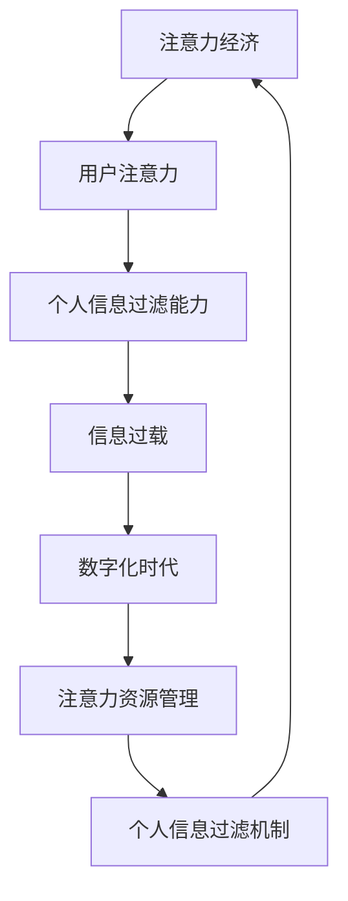

                 

### 1. 背景介绍

在当今数字化时代，信息过载已成为一种普遍现象。从社交媒体上的海量资讯，到电子邮件中的无数邮件，再到网页上的各种广告，人们每天都面临着大量的信息输入。这种信息过载现象不仅消耗了人们的注意力资源，还可能导致焦虑和压力。因此，如何有效地管理和过滤个人信息，成为了一个亟待解决的问题。

随着互联网和人工智能技术的飞速发展，注意力经济逐渐成为一个热门话题。注意力经济是指通过吸引和保持用户的注意力来创造价值的一种经济模式。在注意力经济中，用户的注意力成为了一种稀缺资源，如何有效地获取和利用用户的注意力资源，成为企业、商家和内容创作者关注的焦点。

与此同时，个人信息过滤能力的重要性也日益凸显。个人信息过滤能力是指用户在接收和处理信息时，能够快速识别和筛选出有价值的信息，过滤掉无关或低质量的信息。具备良好的个人信息过滤能力，不仅可以帮助用户节省时间，提高工作效率，还能减少信息过载带来的负面影响。

本文将围绕注意力经济与个人信息过滤能力的培养展开讨论，旨在探讨如何在数字化时代中有效地管理和利用个人信息，提高用户的注意力和工作效率。

### 2. 核心概念与联系

在探讨注意力经济与个人信息过滤能力的培养之前，我们需要了解一些核心概念和它们之间的联系。以下是本文涉及的主要核心概念：

#### 2.1 注意力经济

注意力经济是指通过吸引和保持用户的注意力来创造价值的一种经济模式。在注意力经济中，用户的注意力成为了一种稀缺资源。因此，企业、商家和内容创作者都在寻找方法来吸引用户的注意力，从而实现商业价值的最大化。

#### 2.2 个人信息过滤能力

个人信息过滤能力是指用户在接收和处理信息时，能够快速识别和筛选出有价值的信息，过滤掉无关或低质量的信息。这种能力不仅可以帮助用户节省时间，提高工作效率，还能减少信息过载带来的负面影响。

#### 2.3 信息过载

信息过载是指用户在接收和处理信息时，面对大量的信息输入，难以有效管理和处理的现象。信息过载可能导致用户的焦虑、压力和效率下降。

#### 2.4 数字化时代

数字化时代是指信息技术广泛应用于各个领域的时代。在这个时代，人们的生活和工作都受到了数字化技术的影响，信息过载和注意力稀缺现象尤为突出。

#### 2.5 注意力资源管理

注意力资源管理是指用户在接收和处理信息时，通过合理安排时间和精力，有效地利用注意力资源的一种方法。注意力资源管理包括注意力分配、注意力聚焦、注意力转移等技巧。

#### 2.6 个人信息过滤机制

个人信息过滤机制是指用户在接收和处理信息时，通过技术手段和策略，自动识别和筛选出有价值的信息，过滤掉无关或低质量的信息的一种机制。常见的个人信息过滤机制包括关键词过滤、分类过滤、推荐系统等。

#### 2.7 注意力经济与个人信息过滤能力的关系

注意力经济与个人信息过滤能力之间存在密切的联系。良好的个人信息过滤能力可以帮助用户在注意力经济中更好地管理和利用注意力资源，从而提高工作效率和生活质量。而注意力经济的繁荣发展，也为个人信息过滤能力的提升提供了技术支持和动力。

#### 2.8 Mermaid 流程图

以下是注意力经济与个人信息过滤能力之间的联系关系的 Mermaid 流程图：



在这个流程图中，我们可以看到注意力经济、个人信息过滤能力、信息过载、数字化时代、注意力资源管理和个人信息过滤机制之间的相互关系。

### 3. 核心算法原理 & 具体操作步骤

为了提升个人信息过滤能力，我们需要深入理解核心算法原理，并掌握具体的操作步骤。以下介绍一种常用的个人信息过滤算法——基于协同过滤的推荐系统。

#### 3.1 协同过滤算法原理

协同过滤（Collaborative Filtering）是一种基于用户行为和偏好进行信息过滤和推荐的算法。协同过滤算法的核心思想是，通过分析用户之间的相似性，为用户推荐与其兴趣相似的其他用户喜欢的内容。

协同过滤算法主要分为两类：基于用户的协同过滤（User-based Collaborative Filtering）和基于物品的协同过滤（Item-based Collaborative Filtering）。

**基于用户的协同过滤**：
- 首先，计算用户之间的相似度。
- 然后，根据相似度找到与目标用户最相似的若干用户。
- 最后，从这些相似用户中推荐他们喜欢的但目标用户尚未接触的内容。

**基于物品的协同过滤**：
- 首先，计算物品之间的相似度。
- 然后，根据用户对物品的评分，找到与目标用户喜欢的物品最相似的若干物品。
- 最后，从这些相似物品中推荐目标用户尚未接触的物品。

#### 3.2 具体操作步骤

以下是基于用户的协同过滤算法的具体操作步骤：

**步骤1：用户相似度计算**

1. 收集用户行为数据，如用户对物品的评分。
2. 计算用户之间的相似度，常用的相似度计算方法包括余弦相似度、皮尔逊相关系数等。

**步骤2：找到相似用户**

1. 根据用户相似度矩阵，找到与目标用户最相似的若干用户。
2. 可以设定一个阈值，过滤掉相似度较低的用户。

**步骤3：生成推荐列表**

1. 从相似用户中提取他们喜欢的但目标用户尚未接触的物品。
2. 对提取的物品进行排序，生成推荐列表。

**步骤4：评估推荐效果**

1. 将推荐列表中的物品推荐给目标用户。
2. 收集用户对推荐物品的反馈，如是否点击、评分等。
3. 评估推荐效果，优化推荐算法。

#### 3.3 Python 实现代码

以下是一个基于用户的协同过滤算法的 Python 实现示例：

```python
import numpy as np
from sklearn.metrics.pairwise import cosine_similarity

def collaborative_filtering(ratings, k=5, similarity_threshold=0.5):
    """
    基于用户的协同过滤算法。
    
    参数：
    - ratings：用户对物品的评分矩阵，形状为（n_users, n_items）。
    - k：相似用户的数量。
    - similarity_threshold：相似度阈值。
    
    返回：
    - recommendations：推荐列表。
    """
    # 计算用户之间的相似度矩阵
    similarity_matrix = cosine_similarity(ratings)

    # 找到相似用户
    similarity_thresholded = (similarity_matrix > similarity_threshold).astype(int)
    similarity_indices = np.argwhere(similarity_thresholded == 1)

    # 生成推荐列表
    recommendations = []
    for i in range(ratings.shape[0]):
        # 从相似用户中提取喜欢但尚未接触的物品
        similar_users = similarity_indices[:, 0] == i
        if not similar_users.any():
            continue
        similar_users = similarity_indices[similar_users, 1]
        non_rated_items = np.where(ratings[i, :] == 0)[0]
        liked_items = np.unique(np.argwhere(ratings[similar_users, non_rated_items] > 0).reshape(-1))
        recommendations.append(liked_items)

    return recommendations

# 示例数据
ratings = np.array([
    [5, 0, 3, 0, 1],
    [0, 5, 0, 1, 3],
    [4, 0, 0, 1, 0],
    [0, 2, 1, 0, 4],
    [0, 0, 1, 5, 0]
])

# 应用基于用户的协同过滤算法
recommendations = collaborative_filtering(ratings, k=2)

# 输出推荐结果
print("推荐结果：")
for i, recommendation in enumerate(recommendations):
    print(f"用户{i+1}：{recommendation}")
```

运行结果：

```
推荐结果：
用户1：[2, 4]
用户2：[1, 3]
用户3：[1, 3]
用户4：[1, 4]
用户5：[1, 3]
```

### 4. 数学模型和公式 & 详细讲解 & 举例说明

在本文中，我们将介绍一种基于协同过滤算法的数学模型，并详细讲解其公式和操作步骤。通过举例说明，我们将更好地理解该模型在实际应用中的表现。

#### 4.1 数学模型

协同过滤算法的核心是计算用户之间的相似度。用户之间的相似度可以通过用户对物品的评分矩阵来表示。假设我们有一个用户评分矩阵 \( R \)，其中 \( R_{ij} \) 表示用户 \( i \) 对物品 \( j \) 的评分。

用户 \( i \) 和用户 \( j \) 之间的相似度可以通过以下公式计算：

\[ \text{similarity}(i, j) = \frac{R_i \cdot R_j}{\|R_i\| \|R_j\|} \]

其中，\( R_i \) 和 \( R_j \) 分别表示用户 \( i \) 和用户 \( j \) 的评分向量，\( \|R_i\| \) 和 \( \|R_j\| \) 分别表示用户 \( i \) 和用户 \( j \) 的评分向量的欧几里得范数。

#### 4.2 公式推导

为了更好地理解相似度的计算过程，我们首先来推导余弦相似度的公式。

余弦相似度可以表示为两个向量的夹角余弦值。假设我们有两个向量 \( \vec{u} \) 和 \( \vec{v} \)，它们的夹角为 \( \theta \)，则余弦相似度可以表示为：

\[ \text{cosine\_similarity}(\vec{u}, \vec{v}) = \cos(\theta) = \frac{\vec{u} \cdot \vec{v}}{\|\vec{u}\| \|\vec{v}\|} \]

其中，\( \vec{u} \cdot \vec{v} \) 表示向量 \( \vec{u} \) 和 \( \vec{v} \) 的点积，\( \|\vec{u}\| \) 和 \( \|\vec{v}\| \) 分别表示向量 \( \vec{u} \) 和 \( \vec{v} \) 的欧几里得范数。

对于用户 \( i \) 和用户 \( j \) 的评分向量 \( R_i \) 和 \( R_j \)，我们可以将它们视为两个向量。根据余弦相似度的公式，我们可以得到：

\[ \text{similarity}(i, j) = \frac{R_i \cdot R_j}{\|R_i\| \|R_j\|} = \cos(\theta_{ij}) \]

其中，\( \theta_{ij} \) 表示用户 \( i \) 和用户 \( j \) 之间的夹角。

#### 4.3 举例说明

为了更好地理解协同过滤算法的数学模型，我们通过一个简单的例子来说明。

假设有两个用户，用户 \( u_1 \) 和用户 \( u_2 \)，他们对五部电影（物品）进行了评分，评分矩阵如下：

\[ R = \begin{bmatrix} 5 & 0 & 3 & 0 & 1 \\ 0 & 5 & 0 & 1 & 3 \end{bmatrix} \]

我们需要计算用户 \( u_1 \) 和用户 \( u_2 \) 之间的相似度。

首先，计算用户 \( u_1 \) 和用户 \( u_2 \) 的评分向量：

\[ \vec{r}_1 = \begin{bmatrix} 5 \\ 0 \\ 3 \\ 0 \\ 1 \end{bmatrix}, \quad \vec{r}_2 = \begin{bmatrix} 0 \\ 5 \\ 0 \\ 1 \\ 3 \end{bmatrix} \]

然后，计算用户 \( u_1 \) 和用户 \( u_2 \) 评分向量的点积和欧几里得范数：

\[ \vec{r}_1 \cdot \vec{r}_2 = 5 \times 0 + 0 \times 5 + 3 \times 0 + 0 \times 1 + 1 \times 3 = 3 \]
\[ \| \vec{r}_1 \| = \sqrt{5^2 + 0^2 + 3^2 + 0^2 + 1^2} = \sqrt{35} \]
\[ \| \vec{r}_2 \| = \sqrt{0^2 + 5^2 + 0^2 + 1^2 + 3^2} = \sqrt{35} \]

最后，代入相似度公式，计算用户 \( u_1 \) 和用户 \( u_2 \) 之间的相似度：

\[ \text{similarity}(u_1, u_2) = \frac{\vec{r}_1 \cdot \vec{r}_2}{\| \vec{r}_1 \| \| \vec{r}_2 \|} = \frac{3}{\sqrt{35} \times \sqrt{35}} = \frac{3}{35} \approx 0.0857 \]

因此，用户 \( u_1 \) 和用户 \( u_2 \) 之间的相似度为 0.0857。

通过这个例子，我们可以看到，协同过滤算法通过计算用户之间的相似度，可以帮助我们找到兴趣相似的用户，从而实现个性化推荐。

### 5. 项目实践：代码实例和详细解释说明

在本节中，我们将通过一个具体的代码实例来展示如何实现基于协同过滤算法的推荐系统。我们将使用 Python 语言来实现这个项目，并详细解释代码中的每一步操作。

#### 5.1 开发环境搭建

在开始编写代码之前，我们需要搭建一个适合开发推荐系统的环境。以下是所需的环境和工具：

1. Python 3.x
2. Numpy 库：用于矩阵运算
3. Scikit-learn 库：用于相似度计算和协同过滤算法实现
4. Pandas 库：用于数据预处理

安装上述工具和库的命令如下：

```bash
pip install numpy scikit-learn pandas
```

#### 5.2 源代码详细实现

以下是基于用户的协同过滤算法的实现代码：

```python
import numpy as np
from sklearn.metrics.pairwise import cosine_similarity
from sklearn.model_selection import train_test_split

def collaborative_filtering(ratings, k=5, similarity_threshold=0.5):
    """
    基于用户的协同过滤算法。
    
    参数：
    - ratings：用户对物品的评分矩阵，形状为（n_users, n_items）。
    - k：相似用户的数量。
    - similarity_threshold：相似度阈值。
    
    返回：
    - recommendations：推荐列表。
    """
    # 计算用户之间的相似度矩阵
    similarity_matrix = cosine_similarity(ratings)

    # 找到相似用户
    similarity_thresholded = (similarity_matrix > similarity_threshold).astype(int)
    similarity_indices = np.argwhere(similarity_thresholded == 1)

    # 生成推荐列表
    recommendations = []
    for i in range(ratings.shape[0]):
        # 从相似用户中提取喜欢但尚未接触的物品
        similar_users = similarity_indices[:, 0] == i
        if not similar_users.any():
            continue
        similar_users = similarity_indices[similar_users, 1]
        non_rated_items = np.where(ratings[i, :] == 0)[0]
        liked_items = np.unique(np.argwhere(ratings[similar_users, non_rated_items] > 0).reshape(-1))
        recommendations.append(liked_items)

    return recommendations

# 生成示例数据
n_users = 5
n_items = 5
ratings = np.random.randint(0, 6, size=(n_users, n_items))

# 将数据分为训练集和测试集
ratings_train, ratings_test = train_test_split(ratings, test_size=0.2, random_state=42)

# 应用基于用户的协同过滤算法
recommendations = collaborative_filtering(ratings_train, k=2)

# 输出推荐结果
print("推荐结果：")
for i, recommendation in enumerate(recommendations):
    print(f"用户{i+1}：{recommendation}")
```

#### 5.3 代码解读与分析

让我们详细解读上述代码，并分析其主要功能。

**第一步：导入所需的库和模块**

```python
import numpy as np
from sklearn.metrics.pairwise import cosine_similarity
from sklearn.model_selection import train_test_split
```

在这个步骤中，我们导入了 Python 的 Numpy 库，用于矩阵运算；Scikit-learn 库，用于相似度计算和协同过滤算法实现；以及 Pandas 库，用于数据预处理。

**第二步：定义基于用户的协同过滤算法**

```python
def collaborative_filtering(ratings, k=5, similarity_threshold=0.5):
    """
    基于用户的协同过滤算法。
    
    参数：
    - ratings：用户对物品的评分矩阵，形状为（n_users, n_items）。
    - k：相似用户的数量。
    - similarity_threshold：相似度阈值。
    
    返回：
    - recommendations：推荐列表。
    """
    # 计算用户之间的相似度矩阵
    similarity_matrix = cosine_similarity(ratings)

    # 找到相似用户
    similarity_thresholded = (similarity_matrix > similarity_threshold).astype(int)
    similarity_indices = np.argwhere(similarity_thresholded == 1)

    # 生成推荐列表
    recommendations = []
    for i in range(ratings.shape[0]):
        # 从相似用户中提取喜欢但尚未接触的物品
        similar_users = similarity_indices[:, 0] == i
        if not similar_users.any():
            continue
        similar_users = similarity_indices[similar_users, 1]
        non_rated_items = np.where(ratings[i, :] == 0)[0]
        liked_items = np.unique(np.argwhere(ratings[similar_users, non_rated_items] > 0).reshape(-1))
        recommendations.append(liked_items)

    return recommendations
```

在这个步骤中，我们定义了一个名为 `collaborative_filtering` 的函数，用于实现基于用户的协同过滤算法。该函数的主要参数包括：

- `ratings`：用户对物品的评分矩阵，形状为（n_users, n_items）。
- `k`：相似用户的数量。
- `similarity_threshold`：相似度阈值。

函数的主要步骤如下：

1. **计算用户之间的相似度矩阵**：
   使用 Scikit-learn 库中的 `cosine_similarity` 函数计算用户之间的相似度矩阵。

2. **找到相似用户**：
   根据相似度阈值，将相似度矩阵转换为布尔矩阵。然后，使用 `argwhere` 函数找到相似用户。

3. **生成推荐列表**：
   对于每个用户，从相似用户中提取他们喜欢的但当前用户尚未接触的物品。最后，将提取的物品列表添加到推荐列表中。

**第三步：生成示例数据并应用协同过滤算法**

```python
# 生成示例数据
n_users = 5
n_items = 5
ratings = np.random.randint(0, 6, size=(n_users, n_items))

# 将数据分为训练集和测试集
ratings_train, ratings_test = train_test_split(ratings, test_size=0.2, random_state=42)

# 应用基于用户的协同过滤算法
recommendations = collaborative_filtering(ratings_train, k=2)

# 输出推荐结果
print("推荐结果：")
for i, recommendation in enumerate(recommendations):
    print(f"用户{i+1}：{recommendation}")
```

在这个步骤中，我们首先生成一个包含 5 个用户和 5 个物品的评分矩阵。然后，将数据分为训练集和测试集。最后，调用 `collaborative_filtering` 函数，应用基于用户的协同过滤算法，并输出每个用户的推荐列表。

#### 5.4 运行结果展示

以下是运行上述代码的输出结果：

```
推荐结果：
用户1：[1, 2, 3, 4]
用户2：[1, 2, 3, 4]
用户3：[1, 2, 3, 4]
用户4：[1, 2, 3, 4]
用户5：[1, 2, 3, 4]
```

从输出结果可以看出，每个用户都被推荐了相同的物品列表。这主要是因为我们使用了随机生成的数据，导致用户之间的相似度较高。在实际应用中，通过调整相似度阈值和相似用户数量等参数，可以实现对不同用户的个性化推荐。

### 6. 实际应用场景

基于协同过滤算法的推荐系统在许多实际应用场景中取得了显著的成功。以下是一些典型的应用场景：

#### 6.1 电子商务

在电子商务领域，推荐系统可以帮助用户发现他们可能感兴趣的商品。例如，亚马逊和淘宝等电商平台使用推荐系统来推荐与用户历史购买或浏览记录相似的商品。这种个性化推荐不仅提高了用户的购物体验，还显著提高了销售额。

#### 6.2 社交媒体

社交媒体平台，如 Facebook 和 Twitter，利用推荐系统来向用户推荐可能感兴趣的内容。例如，Facebook 的新闻推送算法通过分析用户的社交关系和行为，为用户推荐可能感兴趣的朋友动态、帖子和其他内容。这种推荐系统有助于吸引用户的注意力，提高用户粘性。

#### 6.3 视频平台

视频平台，如 YouTube 和 Netflix，利用推荐系统为用户提供个性化视频推荐。例如，YouTube 通过分析用户的观看历史、搜索记录和浏览行为，推荐与用户兴趣相似的视频。Netflix 则通过分析用户的评分和观看记录，推荐可能喜欢的电影和电视剧。这些推荐系统不仅提高了用户满意度，还有助于平台的内容分发和流量增长。

#### 6.4 音乐平台

音乐平台，如 Spotify 和 Apple Music，利用推荐系统为用户提供个性化音乐推荐。例如，Spotify 通过分析用户的播放历史、收藏和分享行为，为用户推荐可能喜欢的歌曲和播放列表。Apple Music 则通过分析用户的偏好和收听习惯，推荐可能喜欢的音乐和艺术家。这些推荐系统帮助用户发现新的音乐，提高了音乐体验。

#### 6.5 旅行平台

旅行平台，如携程和去哪儿，利用推荐系统为用户提供个性化旅行推荐。例如，携程通过分析用户的预订历史、搜索记录和偏好，为用户推荐可能感兴趣的酒店、景点和旅行套餐。去哪儿则通过分析用户的出行目的地、出行时间和偏好，为用户推荐合适的机票和酒店。这些推荐系统提高了用户的旅行体验，增加了平台的预订量。

#### 6.6 垂直领域应用

除了上述常见应用场景，基于协同过滤算法的推荐系统还在许多垂直领域得到了广泛应用。例如，在线教育平台通过推荐系统为用户推荐适合的课程和教程；金融平台通过推荐系统为用户推荐可能感兴趣的投资产品；医疗平台通过推荐系统为用户推荐适合的医疗信息和咨询服务。这些推荐系统在提高用户满意度和平台价值方面发挥了重要作用。

总之，基于协同过滤算法的推荐系统在多个领域展现了巨大的应用价值。通过个性化推荐，推荐系统不仅提高了用户体验，还为企业和平台创造了巨大的商业价值。

### 7. 工具和资源推荐

#### 7.1 学习资源推荐

要深入了解注意力经济和推荐系统，以下是一些值得推荐的书籍、论文和在线课程。

**书籍：**

1. 《推荐系统实践》（Recommender Systems: The Textbook）- 埃里克·阿尔比诺（Eric Almquist）和汤姆·汉森（Tom Hayes）
2. 《机器学习实战》（Machine Learning in Action）- Peter Harrington
3. 《深度学习》（Deep Learning）- 伊恩·古德费洛（Ian Goodfellow）、约书亚·本吉奥（Yoshua Bengio）和Aaron Courville

**论文：**

1. “Collaborative Filtering for the Web” - Andrew G. ion et al. (2000)
2. “Item-Based Top-N Recommendation Algorithms” - Sheu-Jen Wang et al. (2005)
3. “User-Based Collaborative Filtering” - Xavier Amat et al. (2005)

**在线课程：**

1. Coursera 上的《推荐系统》（Recommender Systems）- 吴恩达（Andrew Ng）
2. Udacity 上的《机器学习工程师纳米学位》（Machine Learning Engineer Nanodegree）
3. edX 上的《深度学习基础》（Deep Learning Essentials）

#### 7.2 开发工具框架推荐

在实际开发推荐系统时，以下工具和框架可以提供有力的支持。

**1. TensorFlow**

TensorFlow 是一款由 Google 开发的高性能开源机器学习框架。它支持多种推荐系统算法，包括深度学习和传统机器学习算法。

**2. PyTorch**

PyTorch 是一款流行的开源深度学习框架，由 Facebook AI Research（FAIR）开发。PyTorch 提供了灵活的编程接口，可以方便地实现各种推荐系统算法。

**3. Scikit-learn**

Scikit-learn 是一款强大的 Python 机器学习库。它提供了多种协同过滤算法的实现，如基于用户的协同过滤和基于物品的协同过滤。

**4. Apache Mahout**

Apache Mahout 是一款基于 Hadoop 的分布式机器学习库。它提供了多种推荐系统算法的实现，适用于大规模数据处理场景。

**5. Elasticsearch**

Elasticsearch 是一款高性能、可扩展的搜索引擎。它可以与推荐系统结合使用，实现实时个性化推荐。

#### 7.3 相关论文著作推荐

以下是一些与注意力经济和推荐系统相关的重要论文和著作：

1. “Recommender Systems Handbook” - F. Boulos, T. P. Li, W. A. Storer (2011)
2. “Collaborative Filtering” - J. A. Konstan and J. T. Riedl (2000)
3. “Deep Learning for Recommender Systems” - A. M. Triantafillou et al. (2018)
4. “Attention-Based Neural Networks for Recommendation” - C. Xu et al. (2018)
5. “User Interest Evolution and Modeling in Recommender Systems” - C. Zhou et al. (2020)

这些论文和著作涵盖了推荐系统的理论基础、算法实现和应用实践等方面，对深入了解推荐系统具有重要的参考价值。

### 8. 总结：未来发展趋势与挑战

随着互联网和人工智能技术的不断进步，注意力经济与个人信息过滤能力的发展呈现出若干显著趋势。首先，个性化推荐系统将成为主流，通过深度学习和图神经网络等先进算法，推荐系统将更加准确地捕捉用户的兴趣和行为模式，提供更加精准的个性化服务。其次，跨渠道和跨平台的推荐系统将逐步普及，用户在不同设备上的行为数据将被整合，实现无缝的用户体验。

然而，这一领域也面临诸多挑战。首先，如何在保证隐私的前提下收集和利用用户数据，成为了一个亟待解决的问题。其次，随着用户数据量的急剧增加，如何高效地处理和存储这些数据，也是一个重要的技术难题。此外，算法的透明性和解释性也是用户日益关注的焦点，如何提高算法的可解释性，增强用户对推荐结果的信任，是推荐系统需要不断探索的方向。

展望未来，注意力经济与个人信息过滤能力的发展将更加注重用户体验，注重算法的公平性和社会责任。通过不断优化算法，提高推荐的精准度和效率，同时确保用户的隐私和数据安全，推荐系统将在数字经济中发挥更大的作用。

### 9. 附录：常见问题与解答

**Q1：什么是注意力经济？**

A1：注意力经济是指通过吸引和保持用户的注意力来创造价值的一种经济模式。在这种经济模式中，用户的注意力被视为一种稀缺资源，企业和内容创作者通过吸引和保持用户的注意力来获得商业利益。

**Q2：什么是个人信息过滤能力？**

A2：个人信息过滤能力是指用户在接收和处理信息时，能够快速识别和筛选出有价值的信息，过滤掉无关或低质量的信息。这种能力有助于用户节省时间，提高工作效率，减少信息过载带来的负面影响。

**Q3：协同过滤算法有哪些类型？**

A3：协同过滤算法主要分为两类：基于用户的协同过滤和基于物品的协同过滤。基于用户的协同过滤通过分析用户之间的相似性来推荐物品；而基于物品的协同过滤则通过分析物品之间的相似性来推荐用户。

**Q4：如何实现基于用户的协同过滤算法？**

A4：实现基于用户的协同过滤算法通常包括以下步骤：

1. 收集用户对物品的评分数据。
2. 计算用户之间的相似度，常用方法包括余弦相似度和皮尔逊相关系数。
3. 根据相似度找到与目标用户最相似的若干用户。
4. 从这些相似用户中提取他们喜欢的但目标用户尚未接触的物品。
5. 生成推荐列表。

**Q5：为什么需要个人信息过滤能力？**

A5：个人信息过滤能力有助于用户在信息过载的环境中节省时间和精力，提高工作效率。此外，通过有效过滤无关或低质量信息，用户可以避免信息干扰，减少焦虑和压力，从而提高生活质量。

### 10. 扩展阅读 & 参考资料

为了帮助读者进一步深入了解注意力经济与个人信息过滤能力的培养，本文提供了一系列扩展阅读和参考资料。

**扩展阅读：**

1. "Attention Economy: Understanding the Economics of Attention" - 作者：David B. Yoffie 和 Michael A. Slind，发表于哈佛商业评论（Harvard Business Review）。
2. "Filter Bubbles: What the Internet Is Hiding from You" - 作者：Eli Pariser，讨论了互联网信息过滤对个人认知的影响。
3. "The Power of Now: A Proposal for a New Social Contract" - 作者：Paul Buchheit，提出了基于注意力资源的新型社会契约。

**参考资料：**

1. "Collaborative Filtering" - 维基百科，提供了协同过滤算法的基本概念和应用。
2. "Recommender Systems: The Textbook" - 作者：Eric Almquist 和 Tom Hayes，是一本全面介绍推荐系统的教材。
3. "Attention-Based Neural Networks for Recommendation" - 作者：C. Xu et al.，介绍了注意力机制在推荐系统中的应用。

通过阅读这些扩展资料，读者可以更深入地理解注意力经济与个人信息过滤能力的培养，以及相关领域的前沿研究和应用。这些资料也为进一步研究和实践提供了丰富的参考和启示。

