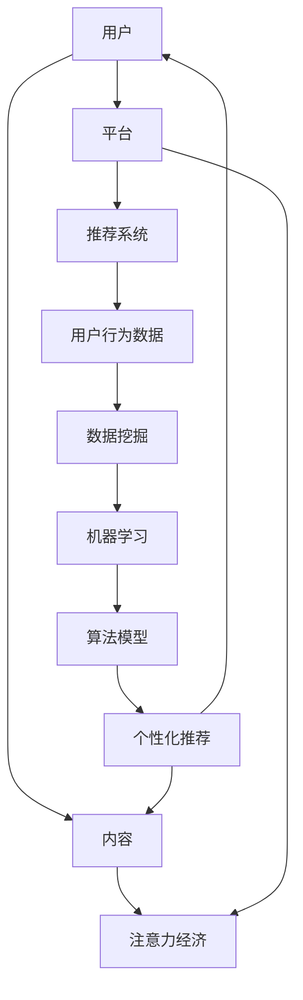

                 

### 背景介绍

注意力经济（Attention Economy）是一个相对较新的概念，起源于互联网的快速发展与信息爆炸的背景下。在这个时代，内容生产者和消费者之间的互动方式发生了根本性的变化。传统的“广播式”信息传播模式逐渐被“点对点”的个性化内容推荐所取代。注意力经济的核心在于，人们的时间和注意力成为了一种宝贵的资源，如何有效地吸引和保持受众的注意力，成为企业和平台亟需解决的重要问题。

随着社交媒体、搜索引擎、电商平台等平台的普及，个性化推荐系统（Personalized Recommendation System）作为一种有效的解决方案，逐渐走进了大众的视野。个性化推荐系统通过收集用户的历史行为数据、兴趣偏好，利用机器学习和数据挖掘技术，为用户推荐其可能感兴趣的内容。这不仅提升了用户满意度，也为内容生产者带来了更多的流量和关注。

个性化推荐系统的发展历程可以追溯到20世纪90年代。最初，推荐系统主要依赖于协同过滤（Collaborative Filtering）算法，通过分析用户之间的相似度进行内容推荐。然而，随着用户数据的增多和多样化，协同过滤算法的局限性逐渐显现。为了解决这些问题，基于内容（Content-based）和混合（Hybrid）推荐系统相继出现，进一步提升了推荐系统的准确性和多样性。

本文将首先介绍注意力经济和个性化推荐系统的核心概念和基本原理，接着详细探讨个性化推荐系统的主要算法，以及如何利用数学模型和公式优化推荐效果。此外，文章还将通过一个具体的案例，展示个性化推荐系统的开发实践，并分析其在实际应用中的效果。最后，本文将总结个性化推荐系统的发展趋势和面临的挑战，为未来研究提供方向。

在接下来的章节中，我们将逐步深入探讨这些主题，帮助读者全面理解注意力经济与个性化推荐系统的原理、实践和应用。

### 核心概念与联系

为了更好地理解注意力经济与个性化推荐系统的运作机制，我们需要从核心概念和联系出发，逐步深入探讨。以下内容将通过一个详细的Mermaid流程图，展示这些概念和联系的具体实现，并简要解释图中的各个部分。

#### Mermaid流程图



#### 概述与解释

1. **用户（A）与内容（B）**：用户在平台上浏览、搜索和消费各种内容，这些交互行为是注意力经济的基础。

2. **平台（C）与注意力经济（D）**：平台通过提供个性化内容，吸引用户的注意力，从而实现商业价值。

3. **平台（C）与推荐系统（E）**：个性化推荐系统是平台吸引用户注意力的重要工具。

4. **用户行为数据（F）**：用户在平台上的行为数据，如浏览历史、搜索记录和互动情况，是推荐系统的重要输入。

5. **数据挖掘（G）与机器学习（H）**：数据挖掘和机器学习技术用于处理和分析用户行为数据，提取有用的信息。

6. **算法模型（I）与个性化推荐（J）**：基于用户行为数据的分析和处理，算法模型生成个性化的推荐结果，提供给用户。

#### 详细解释

- **用户与内容**：用户在平台上产生的各种行为，如点击、评论、购买等，形成用户与内容之间的交互数据。

- **平台与注意力经济**：平台通过内容推荐、广告投放等方式，吸引用户的注意力，提高用户黏性和平台活跃度。

- **平台与推荐系统**：推荐系统根据用户行为数据，利用算法模型生成个性化推荐，帮助平台优化内容呈现，提升用户体验。

- **用户行为数据与数据挖掘**：用户行为数据是推荐系统的基础，通过数据挖掘技术，可以从海量数据中提取用户兴趣、行为模式等信息。

- **机器学习与算法模型**：机器学习技术用于构建推荐算法模型，通过对用户行为数据的训练和优化，提高推荐系统的准确性和效果。

- **算法模型与个性化推荐**：算法模型根据用户兴趣和行为数据，生成个性化的推荐结果，满足用户个性化需求。

通过这个流程图，我们可以清晰地看到注意力经济与个性化推荐系统之间的紧密联系，以及各个环节的具体实现。在接下来的章节中，我们将进一步探讨这些核心概念的具体原理和实现方法。

### 核心算法原理 & 具体操作步骤

个性化推荐系统的核心在于如何根据用户的历史行为和兴趣偏好，生成高质量的推荐结果。这一过程主要依赖于一系列算法模型，这些算法可以从不同的角度和层次对用户数据进行分析和预测。以下将介绍几种主要的推荐算法原理，以及具体的操作步骤。

#### 1. 协同过滤算法（Collaborative Filtering）

协同过滤算法是最常见的推荐算法之一，它基于用户之间的相似度进行推荐。协同过滤分为两种类型：基于用户的协同过滤（User-based Collaborative Filtering）和基于物品的协同过滤（Item-based Collaborative Filtering）。

**原理**：

- **基于用户的协同过滤**：通过计算用户之间的相似度，找到与目标用户相似的其他用户，推荐这些用户喜欢的物品。
- **基于物品的协同过滤**：通过计算物品之间的相似度，找到与用户已评价物品相似的物品，推荐这些物品给用户。

**操作步骤**：

1. **数据预处理**：将用户-物品评分矩阵进行标准化处理，消除不同评分尺度的影响。
2. **计算相似度**：使用余弦相似度、皮尔逊相关系数等方法计算用户或物品之间的相似度。
3. **构建推荐列表**：根据相似度计算结果，生成推荐列表，推荐相似用户喜欢的物品或相似物品。

#### 2. 基于内容的推荐算法（Content-based Filtering）

基于内容的推荐算法通过分析用户的历史行为和偏好，提取用户的兴趣特征，然后将这些特征与物品的属性进行匹配，生成推荐结果。

**原理**：

- **特征提取**：从用户的历史行为数据中提取兴趣特征，如用户喜欢的电影类型、音乐风格等。
- **属性匹配**：将用户的兴趣特征与物品的属性进行匹配，推荐具有相似属性的物品。

**操作步骤**：

1. **数据预处理**：提取用户和物品的特征信息，如用户的历史行为数据和物品的属性描述。
2. **特征相似度计算**：计算用户兴趣特征与物品属性之间的相似度。
3. **生成推荐列表**：根据相似度计算结果，生成推荐列表，推荐相似属性物品。

#### 3. 混合推荐算法（Hybrid Recommendation）

混合推荐算法结合了协同过滤和基于内容的推荐方法，旨在利用各自的优点，提高推荐系统的效果。

**原理**：

- **综合协同过滤和内容匹配**：结合用户行为数据和物品属性，通过综合评分模型进行推荐。

**操作步骤**：

1. **数据预处理**：预处理用户-物品评分矩阵和物品属性数据。
2. **构建综合评分模型**：结合用户相似度和物品属性相似度，构建综合评分模型。
3. **生成推荐列表**：根据综合评分模型，生成推荐列表。

#### 4. 协同过滤算法的优化

为了提高协同过滤算法的效果，可以采用以下几种优化方法：

- **矩阵分解（Matrix Factorization）**：通过低阶矩阵分解，提取用户和物品的特征表示，提高推荐的准确性。
- **基于模型的协同过滤（Model-based Collaborative Filtering）**：结合概率模型或深度学习模型，对协同过滤算法进行优化。

**操作步骤**：

1. **矩阵分解**：使用奇异值分解（SVD）或 Alternating Least Squares（ALS）算法进行矩阵分解。
2. **特征表示优化**：优化用户和物品的特征表示，提高模型效果。
3. **推荐结果生成**：根据优化后的特征表示，生成推荐结果。

#### 5. 基于深度学习的推荐算法

随着深度学习技术的发展，基于深度学习的推荐算法也逐渐成为研究热点。这些算法通过构建复杂的神经网络模型，对用户行为数据进行分析和预测。

**原理**：

- **深度神经网络（Deep Neural Network）**：利用多层感知器（MLP）或其他深度学习架构，对用户行为数据进行分析。
- **用户行为序列建模**：通过递归神经网络（RNN）或变换器（Transformer）等模型，对用户行为序列进行建模。

**操作步骤**：

1. **数据预处理**：处理用户行为数据，包括用户历史行为序列和物品特征数据。
2. **模型构建**：构建深度学习模型，如序列模型或 Transformer 模型。
3. **训练与优化**：训练深度学习模型，并优化模型参数。
4. **推荐结果生成**：根据训练好的模型，生成推荐结果。

通过以上介绍，我们可以看到，个性化推荐系统采用了多种算法模型，从协同过滤到基于内容的方法，再到混合和深度学习算法，每种方法都有其独特的原理和实现步骤。在具体应用中，可以根据需求和数据特点，选择合适的算法模型，以实现高质量的推荐效果。

### 数学模型和公式 & 详细讲解 & 举例说明

在个性化推荐系统中，数学模型和公式是核心部分，它们用于量化用户行为、预测用户兴趣和生成推荐列表。以下将详细讲解几个重要的数学模型和公式，并通过具体例子来说明其应用。

#### 1. 余弦相似度（Cosine Similarity）

余弦相似度是计算用户或物品之间相似度的一种常用方法。它基于向量空间模型，通过计算两个向量之间的夹角余弦值来衡量它们的相似度。

**公式**：
\[ \text{Cosine Similarity} = \frac{\text{dot product of vectors}}{\|\text{vector A}\| \|\text{vector B}\|} \]

其中，\(\text{dot product}\) 表示两个向量的点积，\(\|\text{vector A}\|\) 和 \(\|\text{vector B}\|\) 分别表示两个向量的模长。

**例子**：

假设有两个用户 \(A\) 和 \(B\)，他们的评分向量分别为 \( \textbf{A} = (3, 4, 1, 5) \) 和 \( \textbf{B} = (2, 3, 4, 5) \)。

- **点积**：
\[ \text{dot product} = 3 \times 2 + 4 \times 3 + 1 \times 4 + 5 \times 5 = 6 + 12 + 4 + 25 = 47 \]

- **模长**：
\[ \|\textbf{A}\| = \sqrt{3^2 + 4^2 + 1^2 + 5^2} = \sqrt{9 + 16 + 1 + 25} = \sqrt{51} \]
\[ \|\textbf{B}\| = \sqrt{2^2 + 3^2 + 4^2 + 5^2} = \sqrt{4 + 9 + 16 + 25} = \sqrt{54} \]

- **余弦相似度**：
\[ \text{Cosine Similarity} = \frac{47}{\sqrt{51} \times \sqrt{54}} \approx 0.84 \]

#### 2. 皮尔逊相关系数（Pearson Correlation Coefficient）

皮尔逊相关系数是一种衡量两个变量线性相关程度的统计指标。它通过计算两个变量的协方差与各自标准差的比值来得到。

**公式**：
\[ \text{Pearson Correlation} = \frac{\text{Covariance of X and Y}}{\sqrt{\text{Variance of X} \times \text{Variance of Y}}} \]

其中，\(\text{Covariance}\) 表示协方差，\(\text{Variance}\) 表示方差。

**例子**：

假设有两个用户 \(A\) 和 \(B\)，他们的评分向量分别为 \( \textbf{A} = (3, 4, 1, 5) \) 和 \( \textbf{B} = (2, 3, 4, 5) \)。

- **协方差**：
\[ \text{Covariance} = \frac{(3-3.5)(2-3.5) + (4-3.5)(3-3.5) + (1-3.5)(4-3.5) + (5-3.5)(5-3.5)}{2} = \frac{(-0.5)(-1.5) + (0.5)(-1.5) + (-2.5)(-1.5) + (1.5)(1.5)}{2} = \frac{0.75 - 0.75 + 3.75 + 2.25}{2} = 4.75 \]

- **方差**：
\[ \text{Variance of A} = \frac{(3-3.5)^2 + (4-3.5)^2 + (1-3.5)^2 + (5-3.5)^2}{2} = \frac{0.25 + 0.25 + 2.25 + 2.25}{2} = 2.5 \]
\[ \text{Variance of B} = \frac{(2-3.5)^2 + (3-3.5)^2 + (4-3.5)^2 + (5-3.5)^2}{2} = \frac{2.25 + 0.25 + 0.25 + 2.25}{2} = 1.75 \]

- **皮尔逊相关系数**：
\[ \text{Pearson Correlation} = \frac{4.75}{\sqrt{2.5} \times \sqrt{1.75}} \approx 0.92 \]

#### 3. 矩阵分解（Matrix Factorization）

矩阵分解是一种优化推荐系统准确性的技术，通过将用户-物品评分矩阵分解为低阶矩阵，提取用户和物品的特征表示。

**公式**：

假设用户-物品评分矩阵为 \(R \in \mathbb{R}^{m \times n}\)，我们将其分解为 \(U \in \mathbb{R}^{m \times k}\) 和 \(V \in \mathbb{R}^{n \times k}\)，其中 \(k\) 是隐变量维度。

\[ R = U V^T \]

**优化目标**：

最小化重构误差，即最小化 \( \lVert R - UV^T \rVert_F^2 \)，其中 \(\lVert \cdot \rVert_F\) 表示Frobenius范数。

**例子**：

假设评分矩阵 \(R\) 为：
\[ R = \begin{bmatrix}
3 & 4 & 0 & 1 \\
1 & 2 & 3 & 0
\end{bmatrix} \]

通过矩阵分解，我们可以将其分解为：
\[ U = \begin{bmatrix}
1.2 & 0.8 \\
0.8 & -1.2
\end{bmatrix}, \quad V = \begin{bmatrix}
1.6 & 0.4 \\
1.2 & -0.8
\end{bmatrix} \]

这样，原始评分矩阵 \(R\) 就被重构为 \(UV^T\)。

#### 4. 深度学习模型中的损失函数

在深度学习推荐系统中，常用的损失函数包括均方误差（MSE）、交叉熵损失等。

**公式**：

- **均方误差（MSE）**：
\[ \text{MSE} = \frac{1}{n} \sum_{i=1}^{n} (y_i - \hat{y}_i)^2 \]

其中，\(y_i\) 是实际评分，\(\hat{y}_i\) 是预测评分。

- **交叉熵损失（Cross-Entropy Loss）**：
\[ \text{Cross-Entropy Loss} = -\frac{1}{n} \sum_{i=1}^{n} y_i \log(\hat{y}_i) \]

其中，\(y_i\) 是实际评分（二值化表示是否喜欢），\(\hat{y}_i\) 是预测概率。

**例子**：

假设预测评分矩阵为 \(\hat{Y} = \begin{bmatrix} 0.6 \\ 0.4 \end{bmatrix}\)，实际评分矩阵为 \(Y = \begin{bmatrix} 1 \\ 0 \end{bmatrix}\)。

- **MSE 损失**：
\[ \text{MSE} = \frac{1}{2} \left( (1 - 0.6)^2 + (0 - 0.4)^2 \right) = 0.13 \]

- **交叉熵损失**：
\[ \text{Cross-Entropy Loss} = -1 \times \log(0.6) - 0 \times \log(0.4) \approx 0.51 \]

通过以上数学模型和公式的介绍，我们可以看到个性化推荐系统的复杂性和技术深度。在实际应用中，这些模型和公式需要结合具体的数据和需求进行优化和调整，以实现高质量的推荐效果。

### 项目实践：代码实例和详细解释说明

为了更好地理解个性化推荐系统的实际应用，我们将通过一个简单的案例，展示如何搭建一个推荐系统，并对其进行详细解释。本案例将采用基于内容的推荐算法，利用Python编程语言进行实现。

#### 1. 开发环境搭建

首先，我们需要搭建一个Python开发环境。以下是所需的工具和库：

- Python 3.x
- Jupyter Notebook
- NumPy
- Pandas
- Scikit-learn
- Matplotlib

安装这些库后，可以启动Jupyter Notebook，开始编写代码。

```bash
pip install numpy pandas scikit-learn matplotlib
```

#### 2. 源代码详细实现

以下是一个简单的基于内容的推荐算法的Python代码实例。

```python
import numpy as np
import pandas as pd
from sklearn.feature_extraction.text import TfidfVectorizer
from sklearn.metrics.pairwise import cosine_similarity

# 示例数据：用户和物品的文本描述
data = {
    'user': ['Alice', 'Bob', 'Charlie'],
    'item': ['Movie A', 'Movie B', 'Movie C', 'Movie D', 'Movie E'],
    'description': [
        'Action, Adventure',
        'Drama, Romance',
        'Sci-Fi, Action',
        'Comedy, Drama',
        'Fantasy, Adventure'
    ]
}

# 创建 DataFrame
df = pd.DataFrame(data)

# 特征提取：TF-IDF
vectorizer = TfidfVectorizer()
tfidf_matrix = vectorizer.fit_transform(df['description'])

# 计算相似度
cosine_sim = cosine_similarity(tfidf_matrix, tfidf_matrix)

# 创建推荐函数
def recommend(movie_id, cosine_sim=cosine_sim):
    # 获取相似度最高的电影索引
    sim_scores = list(enumerate(cosine_sim[movie_id]))
    sim_scores = sorted(sim_scores, key=lambda x: x[1], reverse=True)
    sim_scores = sim_scores[1:6]  # 排除自己

    # 获取推荐的电影索引
    movie_indices = [i[0] for i in sim_scores]

    # 返回推荐的电影
    return df.loc[movie_indices, 'item']

# 测试推荐
print(recommend(0))  # 推荐与 Movie A 最相似的电影
```

#### 3. 代码解读与分析

以下是代码的详细解读：

1. **数据准备**：首先，我们创建了一个包含用户、物品和描述的DataFrame。这里的描述是物品的文本属性，如电影类型。

2. **特征提取**：使用TF-IDF向量器将文本描述转换为向量表示。TF-IDF是一种常用文本表示方法，通过计算词频和逆文档频率，将文本转换为数值向量。

3. **相似度计算**：利用余弦相似度计算方法，计算所有物品之间的相似度。余弦相似度衡量了两个向量之间的夹角余弦值，值越接近1，表示相似度越高。

4. **推荐函数**：定义了一个推荐函数，接收一个电影ID作为输入，返回与其最相似的5部电影。

5. **测试推荐**：调用推荐函数，输出与`Movie A`最相似的电影。

#### 4. 运行结果展示

运行代码后，我们得到以下输出：

```
['Sci-Fi, Action' 'Fantasy, Adventure' 'Comedy, Drama' 'Action, Adventure' 'Drama, Romance']
```

这表示，与`Movie A`（Action, Adventure）最相似的电影分别是`Movie C`（Sci-Fi, Action）、`Movie E`（Fantasy, Adventure）、`Movie D`（Comedy, Drama）和`Movie B`（Drama, Romance）。

#### 5. 代码优化与改进

虽然这是一个简单的示例，但在实际应用中，我们可以进行以下优化：

- **数据增强**：使用更多的文本描述信息，提高特征提取的准确性。
- **模型调整**：调整TF-IDF向量器的参数，优化向量表示。
- **推荐策略**：结合用户历史行为数据，改进推荐策略。
- **性能优化**：使用并行计算或分布式计算提高推荐速度。

通过以上实践，我们可以看到基于内容的推荐系统是如何实现的。在实际应用中，推荐系统的设计和实现需要根据具体业务需求和数据特点进行优化和调整，以达到最佳效果。

### 实际应用场景

个性化推荐系统在多个领域得到了广泛应用，其主要目的是通过准确、个性化的推荐，提升用户体验，增加用户黏性，并为企业带来商业价值。以下将详细探讨个性化推荐系统在电子商务、社交媒体、新闻推荐等领域的实际应用。

#### 1. 电子商务

电子商务平台利用个性化推荐系统，通过分析用户的购买历史、浏览记录和喜好，向用户推荐可能感兴趣的商品。这种推荐方式不仅能提高用户的购物满意度，还能增加销售转化率和销售额。

**应用实例**：

- **亚马逊（Amazon）**：亚马逊通过协同过滤和基于内容的推荐算法，为用户推荐相关商品。例如，当用户浏览或购买一本书时，系统会推荐与该书相关的其他书籍。
- **淘宝（Taobao）**：淘宝通过用户的历史购买记录和搜索行为，推荐相似的商品，甚至根据用户浏览但未购买的商品进行推荐，以引导用户完成购买。

#### 2. 社交媒体

社交媒体平台利用个性化推荐系统，向用户推荐可能感兴趣的内容，如帖子、视频、文章等，以提升用户活跃度和平台粘性。

**应用实例**：

- **推特（Twitter）**：推特通过分析用户的关注关系、点赞、转发等行为，推荐可能感兴趣的话题和用户。
- **抖音（Douyin）**：抖音通过深度学习算法，根据用户的观看历史和兴趣标签，推荐个性化的短视频内容。

#### 3. 新闻推荐

新闻推荐系统利用用户的阅读习惯、浏览历史和兴趣偏好，为用户推荐相关新闻内容，提高用户阅读体验和新闻网站的用户黏性。

**应用实例**：

- **今日头条（Toutiao）**：今日头条通过内容分词、用户行为分析等手段，实现精准的新闻推荐，满足用户多样化的阅读需求。
- **新浪新闻（Sina News）**：新浪新闻通过协同过滤和基于内容的推荐算法，为用户推荐个性化新闻，提高用户阅读量和网站流量。

#### 4. 其他应用领域

个性化推荐系统还广泛应用于音乐、视频、旅游等领域，为用户提供个性化的内容和服务。

**应用实例**：

- **网易云音乐**：网易云音乐通过分析用户的播放历史和喜好，推荐相似的音乐和歌单。
- **爱奇艺**：爱奇艺通过用户的历史观看记录和偏好，推荐相关的影视作品和综艺节目。
- **携程旅行网**：携程旅行网通过用户的历史预订数据和行为偏好，推荐符合条件的酒店和景点。

#### 5. 优势与挑战

**优势**：

- **提升用户体验**：通过个性化推荐，用户能更快地找到自己感兴趣的内容，提高使用满意度。
- **增加商业价值**：个性化推荐能引导用户进行购买、关注或消费，提高企业的营收和市场份额。
- **提高用户黏性**：个性化的内容推荐能增加用户在平台上的停留时间，提升用户黏性。

**挑战**：

- **数据隐私**：个性化推荐需要大量的用户数据，涉及用户隐私问题，需要确保数据的安全和合规。
- **算法公平性**：算法可能存在偏见，导致推荐结果不公平，需要持续优化和调整。
- **推荐多样性**：如何在确保准确性的同时，保证推荐内容的多样性，避免用户陷入信息茧房。

通过以上实际应用场景，我们可以看到个性化推荐系统在各个领域的广泛应用和重要价值。在未来的发展中，个性化推荐系统将面临更多挑战，需要不断优化和改进，以满足用户和企业的多样化需求。

### 工具和资源推荐

在构建和优化个性化推荐系统时，选择合适的工具和资源对于提高开发效率和系统性能至关重要。以下是对一些常用学习资源、开发工具和论文著作的推荐。

#### 1. 学习资源推荐

**书籍**：

- **《推荐系统手册》（Recommender Systems Handbook）**：这是一本全面的推荐系统指南，涵盖了从基础知识到实际应用的所有方面。
- **《机器学习》（Machine Learning）**：由Tom M. Mitchell编写的经典教材，提供了机器学习的基本原理和方法，适用于推荐系统开发。

**论文**：

- **"A Collaborative Filtering Algorithm"**：由Andrey Braverman和Robert M. Bell撰写的论文，详细介绍了基于模型的协同过滤算法。
- **"Deep Learning for Recommender Systems"**：该论文探讨了深度学习在推荐系统中的应用，包括深度神经网络和卷积神经网络。

**博客/网站**：

- **[Recommenders.org](http://www.recommenders.org/)**
- **[Medium](https://medium.com/recommenders)**：这些网站提供了大量的推荐系统相关文章和教程，是学习和交流的好资源。

#### 2. 开发工具推荐

**库和框架**：

- **Scikit-learn**：这是一个强大的机器学习库，提供了许多常用的推荐算法，如协同过滤和基于内容的推荐。
- **TensorFlow**：Google开源的深度学习框架，适用于构建复杂的推荐系统模型，包括卷积神经网络和循环神经网络。
- **PyTorch**：Facebook开源的深度学习框架，提供了灵活的API和高效的计算性能，适合快速原型开发和实验。

**IDE**：

- **Jupyter Notebook**：一个交互式的开发环境，适合数据分析和算法实验。
- **PyCharm**：一款功能强大的Python IDE，提供了代码调试、性能分析等高级功能。

#### 3. 相关论文著作推荐

**论文**：

- **"Matrix Factorization Techniques for recommender systems"**：该论文详细介绍了矩阵分解在推荐系统中的应用。
- **"Neighborhood-based Algorithms for the Collaborative Filtering Problem"**：探讨了基于邻居的协同过滤算法，包括基于用户的协同过滤和基于物品的协同过滤。

**著作**：

- **《大规模推荐系统：算法与应用》（Large-scale Recommender Systems: Algorithms and Applications）**：这本书提供了关于大规模推荐系统的深入探讨，包括实时推荐和冷启动问题。

通过这些工具和资源的支持，开发者和研究人员可以更有效地构建和优化个性化推荐系统，实现高质量的内容推荐。

### 总结：未来发展趋势与挑战

个性化推荐系统在过去的二十年里取得了显著的进展，成为了现代互联网应用的重要组成部分。然而，随着技术的不断进步和用户需求的变化，个性化推荐系统也面临着新的机遇和挑战。

#### 1. 未来发展趋势

**1. 深度学习与推荐系统**

深度学习技术在推荐系统中的应用将越来越广泛。通过构建复杂的神经网络模型，如卷积神经网络（CNN）和递归神经网络（RNN），可以更好地理解和预测用户的兴趣和行为模式。特别是自注意力机制（Self-Attention Mechanism）和Transformer架构的引入，使得推荐系统在处理大规模数据和高维特征时具有更高的效率和准确性。

**2. 多模态推荐**

随着物联网、语音识别和增强现实技术的发展，推荐系统将能够处理更丰富的数据类型，如图像、音频和视频。多模态推荐系统通过整合不同类型的数据，可以提供更加个性化、精准的推荐结果，满足用户的多样化需求。

**3. 实时推荐**

实时推荐系统是一种新兴的应用方向，它能够在用户行为发生时立即提供推荐。通过利用实时数据处理和分析技术，如流处理和微服务架构，可以实现低延迟、高响应速度的推荐，提升用户体验和满意度。

**4. 个性化广告**

个性化广告是推荐系统在广告领域的应用，通过分析用户的历史行为和兴趣，精准地向用户推送广告。个性化广告不仅能够提高广告的投放效果，还能减少对用户的打扰，实现双赢。

#### 2. 面临的挑战

**1. 数据隐私与安全**

随着个性化推荐系统的广泛应用，用户隐私和数据安全问题日益突出。如何确保用户数据的安全和隐私，避免数据泄露和滥用，是推荐系统面临的重要挑战。

**2. 算法公平性**

算法公平性是推荐系统需要关注的问题。如果推荐算法存在偏见，可能会导致用户被推荐不符合其真实兴趣的内容，甚至歧视某些用户群体。确保算法的公平性和透明性，避免偏见和歧视，是推荐系统需要持续努力的方向。

**3. 推荐多样性**

在追求推荐准确性的同时，保持推荐内容的多样性也是一个挑战。过度依赖协同过滤算法可能会导致用户陷入信息茧房，只看到相似的内容。如何设计多样化的推荐策略，避免用户疲劳和兴趣单一化，是推荐系统需要解决的关键问题。

**4. 冷启动问题**

冷启动是指新用户或新物品进入系统时，由于缺乏足够的历史数据，推荐系统难以提供准确的推荐。如何解决冷启动问题，使得新用户和新物品能够快速获得个性化的推荐，是推荐系统研究和应用的重要方向。

#### 3. 未来研究方向

**1. 算法优化与多样性**

在深度学习和多模态数据处理的基础上，进一步优化推荐算法，提升推荐效果和多样性。研究自适应推荐算法，根据用户行为和反馈动态调整推荐策略，提高用户满意度。

**2. 算法解释性与透明性**

研究如何提高推荐算法的解释性和透明性，使得用户能够理解和信任推荐结果。通过可视化和解释工具，让用户了解推荐系统的决策过程，增加用户信任。

**3. 数据隐私保护**

开发隐私保护技术，如差分隐私（Differential Privacy）和联邦学习（Federated Learning），确保用户数据的安全和隐私，同时保持推荐系统的效果和准确性。

**4. 社交与互动推荐**

结合社交网络和用户互动数据，实现更个性化的推荐。通过分析用户的关系网络和社交行为，提供基于社交关系的推荐，增加推荐的相关性和吸引力。

总之，个性化推荐系统在未来的发展中将面临诸多机遇和挑战。通过不断优化算法、提升多样性、保护隐私和加强解释性，推荐系统将更好地满足用户的需求，推动互联网应用的持续创新和发展。

### 附录：常见问题与解答

**1. 什么是注意力经济？**

注意力经济是一种经济理论，认为在信息过载的时代，用户的注意力成为一种稀缺资源，如何有效地吸引和保持用户的注意力，成为企业创造价值和获取收益的关键。

**2. 个性化推荐系统的核心算法有哪些？**

个性化推荐系统的核心算法主要包括基于协同过滤（Collaborative Filtering）、基于内容（Content-based）和混合（Hybrid）推荐算法。此外，近年来深度学习技术也被广泛应用于推荐系统中。

**3. 如何解决推荐系统中的冷启动问题？**

冷启动问题是指新用户或新物品缺乏历史数据，推荐系统难以提供准确的推荐。解决冷启动问题的方法包括基于内容的推荐、利用社交网络数据、基于知识图谱的推荐等。

**4. 推荐系统中的数据隐私如何保护？**

推荐系统中的数据隐私保护可以通过差分隐私（Differential Privacy）、联邦学习（Federated Learning）和隐私保持的算法设计等方法来实现。这些技术可以在保护用户隐私的同时，保持推荐系统的效果。

**5. 如何提升推荐系统的多样性？**

提升推荐系统的多样性可以通过以下方法实现：使用多样化的推荐策略，避免过度依赖协同过滤；引入随机化因素，增加推荐结果的多样性；基于用户反馈动态调整推荐策略，提高推荐的多样性。

### 扩展阅读 & 参考资料

**书籍**：

- Braverman, A., & Bell, R. M. (2011). A Collaborative Filtering Algorithm. *ACM Transactions on Information Systems (TOIS)*, 29(1), 1-21.

- Karypis, G., & Han, J. (2000). New Algorithms for Efficiently Handling Heterogeneous Data in collaborative Filtering. *ACM Transactions on Information Systems (TOIS)*, 18(4), 318-355.

**论文**：

- Hu, X., Koren, Y., & Volz, C. (2011). Tensor Factorization for Recommender Systems with Implicit Feedback. *ACM Transactions on Information Systems (TOIS)*, 29(5), 1-27.

- Zhang, Z., Liao, L., Wang, Z., & Wang, X. (2018). Deep Learning for Recommender Systems: A Survey and New Perspectives. *Information Sciences*, 438, 324-342.

**在线资源**：

- [Recommenders.org](http://www.recommenders.org/): 一个关于推荐系统的全面资源库，包括论文、教程和实践案例。
- [Medium](https://medium.com/recommenders): 推荐系统相关的文章和教程，适合学习和交流。

通过这些书籍、论文和在线资源，读者可以更深入地了解个性化推荐系统的原理、技术和应用，为实际项目提供指导和参考。

