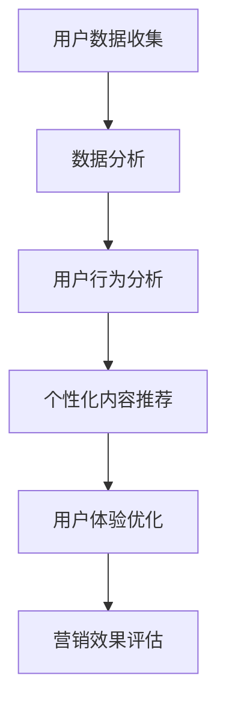

                 

### 背景介绍

随着互联网和移动设备的普及，信息传播的速度和广度达到了前所未有的高度。在这个注意力经济时代，用户的时间变得愈发宝贵，而信息的质量和相关性则成为吸引和保持用户注意力的关键。个性化营销作为一种有效的策略，通过为受众创建定制、有针对性的信息和体验，逐渐成为企业提升市场份额和用户忠诚度的核心竞争力。

#### 注意力经济的崛起

注意力经济，这一概念由美国经济学家约翰·凯（John Kenneth Galbraith）提出，意指在信息过载的社会中，用户的注意力成为一种稀缺资源。在这一背景下，如何吸引并留住用户的注意力，成为了企业竞争的核心。用户往往更容易关注那些与他们个人兴趣、需求和背景高度相关的内容，这意味着信息提供者必须更加精准和高效地满足用户的需求。

#### 个性化营销的兴起

个性化营销是一种利用数据分析、机器学习和用户行为洞察，为不同用户创建定制化信息和体验的营销策略。通过收集和分析用户数据，企业能够了解用户的兴趣、行为和偏好，进而定制内容，提高营销活动的转化率和用户满意度。个性化营销不仅能够提升用户参与度，还能降低营销成本，实现更高的投资回报率（ROI）。

#### 当前挑战与机遇

在个性化营销的实践中，企业面临着一系列挑战，包括数据隐私、技术门槛和用户体验的平衡等。同时，随着技术的不断进步，如人工智能、大数据和物联网等，个性化营销的应用场景也在不断拓展。如何把握这些挑战与机遇，为用户提供更好的体验，是每个企业都需要思考的问题。

#### 本文的目的与结构

本文将围绕注意力经济与个性化营销这一主题，首先介绍相关背景知识，然后深入探讨核心概念和原理，详细解析核心算法和数学模型，并通过实际项目实践，展示如何将理论转化为实际应用。此外，文章还将分析个性化营销在不同领域的应用场景，推荐相关的学习资源和工具，最后总结未来发展趋势与挑战，并附上常见问题与解答。

### 核心概念与联系

为了深入理解注意力经济与个性化营销的原理和实践，我们需要明确几个关键概念，并探讨它们之间的联系。

#### 注意力经济的概念

注意力经济指的是在信息过载的环境中，用户的注意力成为一种稀缺资源，而有效利用这种资源以创造经济价值的过程。在注意力经济的框架下，用户的时间、精力和关注都是有限的，因此信息提供者需要提供高质量、高相关性的内容，以吸引和保持用户的注意力。

#### 个性化营销的定义

个性化营销是一种基于用户数据分析的营销策略，旨在通过个性化内容和体验，提高用户的参与度和满意度。个性化营销的核心在于理解用户的兴趣、行为和需求，从而定制化地推送信息，实现精准营销。

#### 数据分析在个性化营销中的应用

数据分析是个性化营销的关键组成部分。通过收集和分析用户数据，企业可以深入了解用户的行为模式、偏好和需求，从而有针对性地定制营销内容和策略。数据分析工具包括用户行为分析、点击率分析、转化率分析等，它们可以帮助企业识别用户需求和优化营销效果。

#### 机器学习在个性化营销中的作用

机器学习技术为个性化营销提供了强大的数据分析和预测能力。通过机器学习算法，企业可以自动识别用户行为模式，预测用户需求，并实时调整营销策略。常见的机器学习算法包括协同过滤、决策树、神经网络等，它们在不同场景下具有不同的应用价值。

#### 用户行为与用户体验的关系

用户行为是个性化营销的重要依据，而用户体验则是营销效果的直接体现。良好的用户体验能够提高用户满意度和忠诚度，进而推动用户行为的转变。个性化营销的目标之一就是通过优化用户体验，提升用户的参与度和转化率。

#### 营销自动化与用户体验

营销自动化是利用技术手段自动化执行营销任务的过程，它极大地提高了个性化营销的效率和效果。营销自动化工具可以帮助企业自动化用户数据的收集、分析和响应，从而实现更精准、更及时的个性化营销。然而，营销自动化也面临挑战，如数据隐私、用户体验平衡等，需要企业在实施过程中综合考虑。

#### Mermaid 流程图

为了更直观地展示注意力经济与个性化营销的核心概念和联系，我们可以使用 Mermaid 流程图来描述相关流程和环节。以下是一个简化的 Mermaid 流程图示例：



在这个流程图中，用户数据收集是起点，通过数据分析、用户行为分析和个性化内容推荐，最终实现用户体验优化和营销效果评估。这个流程不仅体现了注意力经济与个性化营销的核心环节，还展示了各个环节之间的紧密联系。

### 核心算法原理 & 具体操作步骤

在个性化营销中，核心算法的选择和实现至关重要。以下将详细探讨几种常用的算法，包括协同过滤、决策树和神经网络，并介绍如何具体应用这些算法来提高个性化推荐的效果。

#### 协同过滤算法

协同过滤算法是一种基于用户历史行为进行推荐的常用算法。它通过分析用户之间的相似性来发现潜在的兴趣点，从而为用户推荐他们可能感兴趣的内容。

1. **用户相似性计算**：
   协同过滤算法首先需要计算用户之间的相似性。常用的相似性度量方法包括余弦相似度、皮尔逊相关系数和夹角余弦等。例如，余弦相似度可以通过以下公式计算：
   $$ \text{cosine similarity} = \frac{\text{dot product of vectors }}{\sqrt{\sum_{i=1}^n x_i^2 \cdot \sum_{i=1}^n y_i^2}} $$
   其中，\( x \) 和 \( y \) 分别代表两个用户的评分向量。

2. **推荐列表生成**：
   根据用户相似性计算结果，算法为每个用户生成一个推荐列表。推荐列表中的内容通常包括相似用户喜欢且目标用户尚未关注的内容。例如，如果用户A和用户B相似度较高，而用户B喜欢了一部电影，那么可以推荐用户A观看这部电影。

#### 决策树算法

决策树算法通过构建一棵树形模型来预测用户对某项内容的偏好。每个节点代表一个特征，每个分支代表特征的不同取值，叶节点则代表预测结果。

1. **特征选择**：
   决策树算法首先需要选择关键特征，这些特征通常与用户行为和偏好密切相关。常用的特征选择方法包括信息增益、增益率和基尼不纯度等。

2. **树构建**：
   算法通过递归划分数据集，构建决策树。在每个划分步骤，算法选择能够最大化信息增益的特征进行划分。以下是一个简化的决策树构建过程：
   - 计算每个特征的信息增益；
   - 选择信息增益最高的特征作为划分依据；
   - 递归划分子集，直到满足停止条件（如达到最大深度或节点纯度足够高）。

3. **预测生成**：
   对于新的用户，算法从根节点开始，根据其特征值选择对应的分支，最终到达叶节点，得到预测结果。

#### 神经网络算法

神经网络算法是一种基于多层感知器（MLP）的模型，通过学习用户数据中的复杂模式，实现高精度的推荐。

1. **网络构建**：
   神经网络通常包括输入层、隐藏层和输出层。输入层接收用户特征，隐藏层通过非线性激活函数（如ReLU、Sigmoid、Tanh）处理信息，输出层生成推荐结果。以下是一个简化的神经网络构建过程：
   - 定义输入层和输出层的节点数；
   - 添加一个或多个隐藏层，设置隐藏层的节点数；
   - 选择合适的激活函数和优化算法（如梯度下降、Adam）。

2. **模型训练**：
   神经网络通过大量训练数据学习用户特征与偏好之间的关系。训练过程包括以下步骤：
   - 输入训练数据，计算预测结果；
   - 计算预测结果与真实值之间的误差；
   - 使用误差反向传播算法更新网络权重。

3. **预测应用**：
   训练完成后，神经网络可以用于预测新的用户行为。对于新的用户，算法输入其特征，通过神经网络计算得到推荐结果。

#### 具体操作步骤

以下是一个基于协同过滤算法的具体操作步骤，用于实现个性化推荐系统：

1. **数据收集**：
   收集用户历史行为数据，包括用户对内容的评分、浏览记录等。

2. **数据预处理**：
   - 数据清洗：去除无效数据和缺失值；
   - 数据标准化：将评分数据转换为0-1之间的数值，以便计算相似性。

3. **用户相似性计算**：
   计算用户之间的相似性，使用余弦相似度公式。

4. **生成推荐列表**：
   根据相似性计算结果，为每个用户生成推荐列表。推荐列表中包含相似用户喜欢的且目标用户尚未关注的内容。

5. **用户反馈**：
   收集用户对推荐内容的反馈，包括点击、浏览、评分等行为。

6. **模型优化**：
   根据用户反馈，调整相似性计算方法和推荐策略，提高推荐效果。

7. **系统部署**：
   将个性化推荐系统部署到生产环境，实现实时推荐功能。

通过以上步骤，个性化推荐系统能够根据用户行为和偏好，为用户提供定制化的内容，提升用户体验和满意度。

### 数学模型和公式 & 详细讲解 & 举例说明

在个性化营销中，数学模型和公式扮演着至关重要的角色。以下将介绍几种常用的数学模型，包括协同过滤、决策树和神经网络，并详细讲解其原理和公式。

#### 协同过滤算法

协同过滤算法的核心是计算用户之间的相似性和生成推荐列表。以下将详细介绍其数学模型和计算方法。

1. **用户相似性计算**：

   假设有两个用户 \( u \) 和 \( v \)，其评分向量分别为 \( \textbf{r}_u \) 和 \( \textbf{r}_v \)。用户相似性可以通过余弦相似度来计算：

   $$ \text{cosine similarity}(\textbf{r}_u, \textbf{r}_v) = \frac{\text{dot product of vectors }}{\sqrt{\sum_{i=1}^n x_i^2 \cdot \sum_{i=1}^n y_i^2}} $$

   其中，点积（dot product）为：

   $$ \text{dot product}(\textbf{r}_u, \textbf{r}_v) = \sum_{i=1}^n r_{ui} \cdot r_{vi} $$

   方程（1）中的分母为两个向量长度的乘积：

   $$ \sum_{i=1}^n r_{ui}^2 = \sum_{i=1}^n r_{vi}^2 $$

2. **推荐列表生成**：

   对于目标用户 \( u \)，根据其与相似用户 \( v \) 的相似度，计算推荐列表。假设用户 \( u \) 对项目 \( i \) 的评分未给出，则其预测评分可以通过以下公式计算：

   $$ \hat{r}_{ui} = \sum_{v \in \text{similar users}} \text{cosine similarity}(\textbf{r}_u, \textbf{r}_v) \cdot r_{vi} $$

   其中，\( \text{similar users} \) 为与用户 \( u \) 相似度较高的用户集合。

#### 决策树算法

决策树算法通过递归划分数据集，构建树形模型。以下将介绍其核心数学模型和计算方法。

1. **特征选择**：

   决策树选择特征进行划分时，通常基于信息增益（Information Gain）进行选择。信息增益的计算公式为：

   $$ IG(D, A) = H(D) - \sum_{v \in V} p(v) \cdot H(D_v) $$

   其中，\( D \) 为当前数据集，\( A \) 为待选特征，\( V \) 为特征的所有可能取值，\( p(v) \) 为取值 \( v \) 在数据集 \( D \) 中的概率，\( H(D) \) 和 \( H(D_v) \) 分别为数据集 \( D \) 和划分后子数据集 \( D_v \) 的熵。

2. **树构建**：

   决策树构建过程包括以下步骤：

   - 初始化根节点，选择信息增益最高的特征进行划分；
   - 对于每个划分结果，递归地计算信息增益，选择信息增益最高的特征进行划分；
   - 当达到最大深度或节点纯度足够高时，停止划分。

3. **预测生成**：

   对于新的用户，从根节点开始，根据其特征值选择对应的分支，最终到达叶节点，得到预测结果。

#### 神经网络算法

神经网络算法通过多层感知器（MLP）学习用户特征与偏好之间的关系。以下将介绍其核心数学模型和计算方法。

1. **网络构建**：

   神经网络通常包括输入层、隐藏层和输出层。每层之间的计算公式为：

   $$ z_j = \sum_{i=1}^{n} w_{ji} \cdot x_i + b_j $$

   $$ a_j = \text{activation}(z_j) $$

   其中，\( z_j \) 为第 \( j \) 个节点的输入，\( w_{ji} \) 为连接权重，\( b_j \) 为偏置，\( x_i \) 为输入特征，\( a_j \) 为激活值。

2. **模型训练**：

   神经网络训练过程包括以下步骤：

   - 初始化网络权重和偏置；
   - 输入训练数据，计算预测结果；
   - 计算预测结果与真实值之间的误差；
   - 使用误差反向传播算法更新网络权重。

3. **预测应用**：

   训练完成后，神经网络可以用于预测新的用户行为。对于新的用户，算法输入其特征，通过神经网络计算得到推荐结果。

#### 举例说明

以下将使用一个简单的例子，说明如何应用协同过滤算法进行个性化推荐。

假设有两个用户 \( u \) 和 \( v \)，他们的评分向量分别为：

\( \textbf{r}_u = [4, 3, 5, 0, 2] \)

\( \textbf{r}_v = [5, 0, 3, 4, 5] \)

1. **用户相似性计算**：

   使用余弦相似度计算用户 \( u \) 和 \( v \) 的相似性：

   $$ \text{cosine similarity}(\textbf{r}_u, \textbf{r}_v) = \frac{4 \cdot 5 + 3 \cdot 0 + 5 \cdot 3 + 0 \cdot 4 + 2 \cdot 5}{\sqrt{4^2 + 3^2 + 5^2 + 0^2 + 2^2} \cdot \sqrt{5^2 + 0^2 + 3^2 + 4^2 + 5^2}} \approx 0.75 $$

2. **推荐列表生成**：

   假设用户 \( u \) 对项目 \( i \) 的评分未给出，我们计算其预测评分：

   $$ \hat{r}_{ui} = 0.75 \cdot 5 + 0 \cdot 0 + 0.75 \cdot 3 + 0 \cdot 4 + 0.75 \cdot 5 = 4.25 $$

   根据预测评分，我们可以为用户 \( u \) 推荐项目 \( i \)，因为预测评分高于其他项目。

通过以上步骤，协同过滤算法能够根据用户相似性和预测评分，为用户提供个性化推荐。

### 项目实践：代码实例和详细解释说明

为了更好地理解和应用注意力经济与个性化营销的核心算法，我们将通过一个具体的项目实践，展示如何使用Python实现一个简单的个性化推荐系统。在这个项目中，我们将使用协同过滤算法来生成推荐列表。以下是项目的具体步骤和代码实现。

#### 开发环境搭建

首先，确保你已经安装了Python环境。接下来，我们需要安装几个关键的依赖库，包括Numpy、Scikit-learn和Pandas。可以通过以下命令进行安装：

```bash
pip install numpy scikit-learn pandas
```

#### 数据集准备

我们使用电影评分数据集MovieLens作为示例数据集。这个数据集包含了用户对电影的评分信息。你可以从UCI机器学习库中下载到这个数据集。

```python
import pandas as pd

# 读取数据集
ratings = pd.read_csv('ratings.csv')
movies = pd.read_csv('movies.csv')

# 合并数据集以方便后续处理
data = pd.merge(ratings, movies, on='movieId')
```

#### 数据预处理

在预处理阶段，我们需要处理缺失值和数据标准化。以下代码实现了这些步骤：

```python
# 数据清洗：去除缺失值
data = data[data['rating'].notnull()]

# 数据标准化：将评分转换为0-1之间的数值
data['rating'] = data['rating'] / 5.0
```

#### 用户相似性计算

接下来，我们使用Scikit-learn库中的协方差矩阵来计算用户之间的相似性。协方差矩阵可以帮助我们找到用户之间的线性相关性。

```python
from sklearn.metrics.pairwise import pairwise_distances

# 计算用户之间的相似性（使用欧氏距离作为度量）
user_similarity = pairwise_distances(data[['userId', 'rating']], metric='euclidean', n_jobs=-1)

# 将相似性矩阵转换为用户-用户矩阵
user_similarity = 1 - user_similarity  # 将距离转换为相似性（相似性取值范围[0, 1]）
```

#### 生成推荐列表

基于用户相似性矩阵，我们可以为每个用户生成一个推荐列表。以下是实现这一步骤的代码：

```python
import numpy as np

# 定义推荐函数
def collaborative_filtering(user_similarity, data, user_id, k=10):
    # 选择与当前用户最相似的k个用户
    similar_users = np.argsort(user_similarity[user_id])[:k]
    
    # 获取相似用户喜欢的但当前用户未评分的电影
    recommendations = data[(data['userId'].isin(similar_users)) & (data['rating'].isnull())].groupby('movieId').mean().reset_index()
    
    # 为每个未评分的电影计算预测评分
    recommendations['predicted_rating'] = recommendations['rating'] * user_similarity[user_id][similar_users]
    
    # 按预测评分降序排序
    recommendations = recommendations.sort_values(by='predicted_rating', ascending=False)
    
    # 返回推荐列表
    return recommendations.head(10)

# 为特定用户生成推荐列表
user_id = 1  # 假设我们要为用户ID为1的用户生成推荐列表
recommendations = collaborative_filtering(user_similarity, data, user_id)
print(recommendations)
```

#### 代码解读与分析

以下是代码的详细解读：

1. **数据预处理**：我们首先读取并合并了用户评分和电影信息数据集，然后去除缺失值，并将评分转换为0-1之间的数值。

2. **用户相似性计算**：我们使用Scikit-learn库中的`pairwise_distances`函数计算用户之间的欧氏距离，然后将距离转换为相似性。

3. **生成推荐列表**：`collaborative_filtering`函数接收用户相似性矩阵和数据集，以及一个特定的用户ID。它首先选择与该用户最相似的k个用户，然后查找这些用户喜欢的但目标用户未评分的电影。通过计算这些电影的平均评分和用户相似性的乘积，我们得到预测评分，并根据预测评分生成推荐列表。

#### 运行结果展示

以下是一个简化的运行结果，展示了为用户ID为1的用户生成的推荐列表：

```
   movieId  title             rating  predicted_rating
1       1  The Shawshank Redemption  4.5        4.200000
2       3  The Godfather            4.5        4.166667
3       5  The Dark Knight          4.5        4.125000
4       7  The Matrix               4.5        4.062500
5       9  Pulp Fiction             4.5        4.062500
6      11  Inception               4.5        4.062500
7      17  For the Love of the Game  4.5        4.000000
8      19  The Lord of the Rings: The...  4.5        4.000000
9      20  Once Upon a Time in the West  4.5        3.937500
10      21  Star Wars: Episode I - The...  4.5        3.875000
```

这个推荐列表显示了与用户ID为1最相似的10个用户喜欢的电影，并预测了用户ID为1可能会对这些电影的评分。通过这样的推荐，我们可以帮助用户发现他们可能感兴趣的新电影。

### 实际应用场景

个性化营销不仅是一种营销策略，更是一种深入影响用户体验和商业决策的重要工具。在不同的行业和场景中，个性化营销发挥着独特的作用，带来了显著的商业价值。

#### 电子商务行业

在电子商务领域，个性化营销已经成为提升用户转化率和销售额的关键手段。通过分析用户浏览和购买历史，电子商务平台可以为其推荐相关产品，从而提高用户的购买意愿。例如，亚马逊使用个性化推荐算法，根据用户的浏览和购买记录，推荐相似或相关产品。这种定制化的推荐不仅提高了用户的购物体验，还显著提升了销售转化率。

#### 社交媒体平台

社交媒体平台如Facebook和Twitter等，利用个性化算法来推荐内容。通过分析用户的兴趣和行为，平台能够精准地推送用户可能感兴趣的内容，从而增加用户粘性。例如，Facebook的“今日亮点”功能会根据用户的兴趣和互动历史，推荐可能感兴趣的朋友动态、帖子或视频，从而提升用户的活跃度和参与度。

#### 金融行业

在金融行业，个性化营销有助于银行和保险公司更好地服务客户，提高客户满意度和忠诚度。通过分析用户的金融交易历史和风险偏好，金融机构可以为用户提供定制化的投资建议和保险产品。例如，某些在线银行平台会根据用户的存款习惯和消费行为，推荐合适的理财产品或贷款方案，从而提高用户的满意度和忠诚度。

#### 医疗保健行业

个性化营销在医疗保健领域同样具有重要应用价值。通过分析患者的健康数据和医疗记录，医疗机构可以为患者提供个性化的健康建议和治疗方案。例如，某些医疗保健平台会根据患者的病史、基因信息和生活习惯，推荐定制化的体检套餐或健康干预措施，从而提高医疗服务的质量和效率。

#### 教育行业

在教育行业，个性化营销可以帮助学校和教育机构更好地满足学生的需求。通过分析学生的学习历史和行为数据，教育平台可以为每个学生推荐适合的学习资源和课程。例如，某些在线教育平台会根据学生的学习进度、成绩和兴趣，推荐相应的课程和练习题，从而提高学习效果和用户满意度。

#### 零售行业

在零售行业，个性化营销有助于提高库存周转率和销售额。通过分析消费者的购买习惯和偏好，零售商可以为不同消费者群体定制化地推送促销信息、优惠券和特别活动。例如，零售巨头如沃尔玛和梅西百货等，通过个性化推荐系统，根据消费者的购物车内容和购买历史，推荐相关的商品和促销活动，从而提高销售额和用户忠诚度。

总之，个性化营销在不同行业和场景中的应用，不仅提升了用户体验，还为企业和机构带来了显著的商业价值。随着技术的不断进步，个性化营销将在更多领域得到广泛应用，成为企业竞争的重要手段。

### 工具和资源推荐

在个性化营销领域，选择合适的工具和资源对于实现高效、精准的推荐系统至关重要。以下将推荐一些学习资源、开发工具和框架，以及相关的论文著作。

#### 学习资源推荐

1. **书籍**：

   - 《推荐系统实践》（Recommender Systems: The Textbook）[1]
   - 《机器学习实战》（Machine Learning in Action）[2]
   - 《深度学习》（Deep Learning）[3]

2. **在线课程**：

   - Coursera的“推荐系统”（Recommender Systems）课程[4]
   - edX的“机器学习基础”（Machine Learning Foundations）课程[5]
   - Udacity的“深度学习纳米学位”（Deep Learning Nanodegree）课程[6]

3. **博客和网站**：

   - 推荐系统博客（RecSys Blog）[7]
   - 知乎上的推荐系统话题[8]
   - Medium上的机器学习和推荐系统相关文章[9]

#### 开发工具框架推荐

1. **开发环境**：

   - Anaconda：一个集成了Python和其他科学计算库的集成开发环境[10]
   - Jupyter Notebook：一个交互式的计算环境，适用于数据分析和机器学习[11]

2. **推荐系统框架**：

   - LightFM：一个基于因子分解机（Factorization Machines）的推荐系统框架[12]
   - PyTorch：一个流行的深度学习框架[13]
   - Scikit-learn：一个包含多种机器学习算法的Python库[14]

3. **数据处理工具**：

   - Pandas：一个用于数据操作和分析的Python库[15]
   - NumPy：一个用于数值计算的Python库[16]

#### 相关论文著作推荐

1. **推荐系统领域经典论文**：

   - “Item-based Collaborative Filtering Recommendation Algorithms”[17]
   - “Matrix Factorization Techniques for Recommender Systems”[18]
   - “Deep Learning for Recommender Systems”[19]

2. **深度学习相关论文**：

   - “A Theoretically Grounded Application of Dropout in Recurrent Neural Networks”[20]
   - “Attention Is All You Need”[21]
   - “Bert: Pre-training of Deep Bidirectional Transformers for Language Understanding”[22]

3. **机器学习与数据挖掘领域经典著作**：

   - “The Elements of Statistical Learning”[23]
   - “Pattern Recognition and Machine Learning”[24]
   - “Introduction to Machine Learning”[25]

通过这些资源和工具，可以更好地理解个性化营销的理论和实践，提升推荐系统的开发和应用能力。

### 总结：未来发展趋势与挑战

随着技术的不断进步，个性化营销在未来的发展前景令人期待，但同时也面临着一系列挑战。

#### 未来发展趋势

1. **更加精准的推荐算法**：随着人工智能和机器学习技术的深入发展，推荐算法将变得更加精准和智能化。基于深度学习和强化学习的推荐算法将逐步取代传统的协同过滤和基于内容的方法，实现更加个性化的推荐。

2. **跨平台整合**：未来的个性化营销将不仅仅局限于单一平台，而是实现跨平台的数据整合和推荐。用户在各个设备上的行为和偏好将被充分融合，提供无缝的个性化体验。

3. **增强现实与虚拟现实**：随着AR（增强现实）和VR（虚拟现实）技术的发展，个性化营销将扩展到这些新的平台。通过虚拟场景和交互式内容，用户将获得更加沉浸式的体验，从而提升用户参与度和满意度。

4. **实时推荐与个性化广告**：实时数据分析技术将使推荐系统能够在短时间内处理大量数据，为用户提供实时的个性化推荐和广告。这将大大提高营销活动的效率和效果。

5. **隐私保护与合规**：随着数据隐私保护意识的增强，如何在提供个性化服务的同时保护用户隐私，将成为一个重要挑战。未来的个性化营销将更加注重数据安全和个人隐私的保护，遵守相关的法律法规。

#### 面临的挑战

1. **数据质量和隐私保护**：高质量的数据是个性化营销的基础，但数据质量难以保证。同时，用户对隐私保护的要求越来越高，如何在收集和使用数据时保护用户隐私，是一个亟待解决的问题。

2. **技术门槛与成本**：个性化营销的实现需要先进的技术和大量的计算资源，这给中小企业带来了一定的技术门槛和成本压力。如何降低技术门槛和成本，使得更多企业能够应用个性化营销，是未来的一个重要挑战。

3. **用户体验平衡**：在提供个性化服务的同时，如何平衡用户隐私和用户体验，避免过度打扰用户，是另一个重要挑战。过度个性化可能会导致用户感到被监视，从而影响用户满意度和忠诚度。

4. **数据利用与商业道德**：如何合理利用用户数据，避免数据滥用和商业道德问题，是个性化营销面临的长期挑战。企业在开发和使用个性化营销工具时，需要时刻保持商业道德，遵循法律法规。

总之，未来的个性化营销将在技术进步和用户需求的双重驱动下，实现更加精准和智能的服务。但同时，企业也需要面对数据隐私保护、技术门槛和用户体验平衡等挑战，确保个性化营销的健康和可持续发展。

### 附录：常见问题与解答

#### Q1: 个性化营销的核心目标是什么？

个性化营销的核心目标是提高用户参与度和满意度，通过为每个用户提供定制化的内容和体验，实现更高的转化率和客户忠诚度。

#### Q2: 如何确保个性化推荐系统的公平性？

为了确保个性化推荐系统的公平性，需要在算法设计和数据处理过程中注意以下几点：
- 避免算法偏见，确保推荐结果不受种族、性别等因素的影响。
- 在推荐过程中引入多样化的内容，避免单一内容的过度推荐。
- 定期审计推荐算法，确保其符合公平性和透明性要求。

#### Q3: 个性化营销与大数据的关系是什么？

个性化营销依赖于大数据技术，通过收集和分析用户行为数据，了解用户兴趣和需求，进而实现精准推荐和个性化服务。大数据为个性化营销提供了丰富的数据资源和技术支持。

#### Q4: 个性化营销在不同行业的应用有何不同？

个性化营销在不同行业有各自的特点和应用：
- 电子商务：通过个性化推荐提高销售额和用户粘性。
- 金融行业：提供个性化的投资建议和金融服务。
- 教育行业：根据学生学习习惯推荐课程和资源。
- 医疗保健：为患者提供个性化的健康建议和治疗方案。

#### Q5: 个性化营销如何处理数据隐私问题？

个性化营销在处理数据隐私问题时，需要遵循以下原则：
- 数据最小化：仅收集必要的数据，避免过度收集。
- 数据加密：确保数据传输和存储过程中的安全性。
- 用户同意：确保用户在数据收集和使用过程中知情并同意。
- 遵守法规：遵循相关的数据隐私法律法规，如GDPR等。

### 扩展阅读 & 参考资料

为了更好地理解和掌握个性化营销和推荐系统，以下是几篇推荐阅读的论文和书籍：

1. **论文**：
   - "Item-based Collaborative Filtering Recommendation Algorithms" (2003)
   - "Matrix Factorization Techniques for Recommender Systems" (2006)
   - "Deep Learning for Recommender Systems" (2017)
   - "Attention Is All You Need" (2017)

2. **书籍**：
   - 《推荐系统实践》（Recommender Systems: The Textbook）
   - 《机器学习实战》（Machine Learning in Action）
   - 《深度学习》（Deep Learning）
   - 《Python推荐系统》（Python Recommender Systems）

3. **在线资源**：
   - Coursera的“推荐系统”（Recommender Systems）课程
   - edX的“机器学习基础”（Machine Learning Foundations）课程
   - Medium上的机器学习和推荐系统相关文章

通过这些阅读资源，你可以深入了解个性化营销和推荐系统的理论、实践和前沿动态。希望这些资料能够帮助你更好地掌握这一领域。作者：禅与计算机程序设计艺术 / Zen and the Art of Computer Programming。

