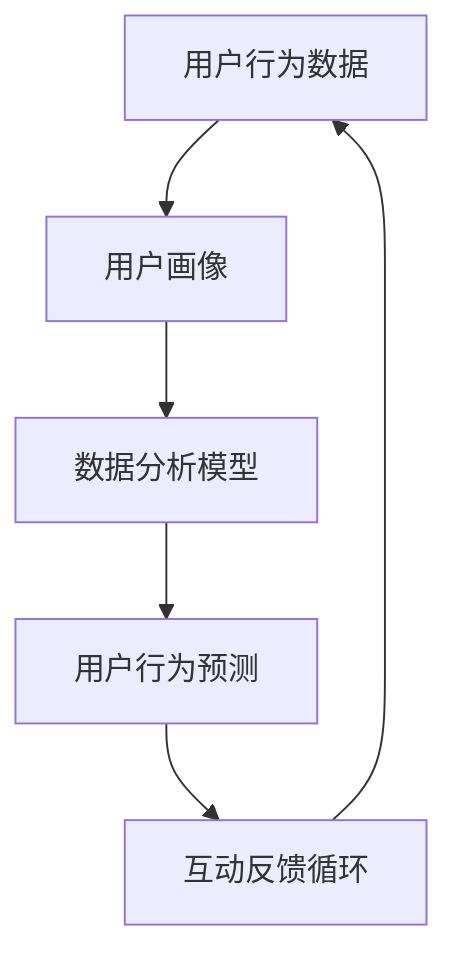

                 

### 1. 背景介绍

随着互联网的迅猛发展，大数据技术和人工智能算法逐渐渗透到各个行业，为我们提供了前所未有的数据处理和分析能力。在这种背景下，注意力经济成为了一个备受关注的研究领域。注意力经济强调的是如何通过数据分析和洞察力，理解用户的行为，从而优化产品和服务，提升用户体验。

#### 注意力经济的定义

注意力经济（Attention Economy）是一种基于人类注意力资源的经济学概念。它认为，注意力是一种有限的、宝贵的资源，用户愿意为其所关注的内容支付时间和金钱。在数字时代，用户的注意力成为了企业和品牌竞相争夺的焦点。谁能够更好地吸引并留住用户的注意力，谁就能在竞争中获得优势。

#### 数据分析的作用

数据分析在注意力经济中扮演着至关重要的角色。通过对用户行为数据的收集、分析和解读，企业可以深入了解用户的需求和偏好，从而进行精准的市场定位和营销策略的制定。数据分析不仅有助于提高用户满意度，还能为企业带来直接的商业价值。

#### 理解受众行为的重要性

理解受众行为对于企业来说至关重要。通过深入分析用户的行为数据，企业可以：

1. **精准定位目标用户**：了解用户的年龄、性别、地理位置、兴趣爱好等信息，以便更好地定位潜在客户。
2. **优化产品和服务**：根据用户反馈和行为习惯，不断改进产品和服务，提升用户体验。
3. **制定有效的营销策略**：通过分析用户的关注点，制定更具针对性的营销策略，提高营销效果。
4. **预测市场趋势**：通过对历史数据的分析，预测未来市场的发展趋势，为企业的战略决策提供依据。

总之，在注意力经济时代，理解受众行为是企业制胜的关键。通过数据分析和洞察力，企业可以更好地抓住用户需求，提升竞争力，实现可持续发展。

### 2. 核心概念与联系

在探讨注意力经济与数据分析的关系时，我们需要明确一些核心概念，并理解它们之间的内在联系。以下是几个关键概念及其相互关系：

#### 用户行为数据

用户行为数据是指用户在使用产品或服务过程中产生的各种数据，包括浏览记录、搜索历史、购买行为、社交互动等。这些数据是进行数据分析的基础。

#### 用户画像

用户画像是对用户特征的综合描述，包括年龄、性别、地理位置、兴趣爱好、消费能力等。通过用户画像，企业可以更准确地了解用户需求和行为模式。

#### 数据分析模型

数据分析模型是用于从数据中提取有价值信息的方法和工具。常见的模型包括分类、聚类、回归等。通过这些模型，企业可以从海量数据中提取出用户行为的关键特征和趋势。

#### 用户行为预测

用户行为预测是基于历史数据和现有模型，对用户未来行为进行预测。这种预测可以帮助企业制定更精准的营销策略和产品优化方案。

#### 互动反馈循环

互动反馈循环是指通过用户行为数据不断调整和优化产品和服务，从而形成正向循环。这个过程中，用户反馈是关键，它可以帮助企业了解用户需求，改进产品，提升用户满意度。

以下是一个使用Mermaid绘制的流程图，展示了这些核心概念之间的相互关系：



通过这个流程图，我们可以清晰地看到，用户行为数据是整个流程的起点，它通过用户画像被输入到数据分析模型中，生成用户行为预测，然后这些预测结果通过互动反馈循环被反馈回用户行为数据中，形成一个持续优化的过程。

### 3. 核心算法原理 & 具体操作步骤

在注意力经济中，数据分析的核心算法包括用户行为预测和用户画像构建。以下将详细介绍这些算法的原理和具体操作步骤。

#### 用户行为预测算法

用户行为预测是通过对历史数据的学习，来预测用户未来的行为。以下是一个基于决策树的预测算法：

##### 算法原理

决策树算法通过一系列规则来对数据进行分割，每个节点代表一个特征，每个分支代表特征的一个可能值。通过递归分割数据，最终得到一个分类结果。

##### 具体操作步骤

1. **数据预处理**：对用户行为数据进行清洗、去噪和格式化，确保数据的质量和一致性。
2. **特征选择**：选择对用户行为有显著影响的特征，如浏览时长、购买次数、搜索关键词等。
3. **训练模型**：使用历史数据训练决策树模型，模型需要通过多次迭代来优化分割规则。
4. **预测**：使用训练好的模型对新的数据进行预测，得到用户的行为预测结果。

#### 用户画像构建算法

用户画像是对用户特征的全面描述，通过构建用户画像，企业可以更好地了解用户需求和行为模式。以下是一个基于聚类算法的用户画像构建方法：

##### 算法原理

聚类算法将用户数据分为多个类别，每个类别代表一组具有相似特征的用户。常用的聚类算法包括K-Means、层次聚类等。

##### 具体操作步骤

1. **数据预处理**：与用户行为预测类似，对用户特征数据进行清洗和格式化。
2. **特征标准化**：将不同特征的数据进行标准化处理，使其具有相同的量纲。
3. **选择聚类算法**：根据数据特点和业务需求，选择合适的聚类算法。
4. **聚类**：使用选定的聚类算法对用户特征数据进行聚类，生成用户类别。
5. **生成用户画像**：对每个用户类别进行特征提取和综合，生成用户画像。

#### 结合操作示例

假设我们使用K-Means算法来构建用户画像，以下是一个简单的操作示例：

1. **数据预处理**：收集用户特征数据，如年龄、性别、购买金额、浏览时长等，并进行清洗和标准化。
2. **初始化聚类中心**：随机选择K个用户特征向量作为初始聚类中心。
3. **分配用户到聚类中心**：计算每个用户特征向量与聚类中心的距离，将用户分配到最近的聚类中心。
4. **更新聚类中心**：计算每个聚类中心的均值，作为新的聚类中心。
5. **迭代聚类**：重复步骤3和步骤4，直到聚类中心不再发生变化或者满足收敛条件。
6. **生成用户画像**：对每个聚类中心进行特征提取和综合，生成用户画像。

通过上述步骤，我们可以得到一组用户画像，这些画像可以帮助企业更好地理解用户需求和行为模式，从而制定更有效的营销策略和产品优化方案。

### 4. 数学模型和公式 & 详细讲解 & 举例说明

在用户行为预测和用户画像构建中，数学模型和公式起到了关键作用。以下将详细介绍这些模型和公式，并通过具体例子进行讲解。

#### 决策树模型

决策树是一种常见的分类算法，通过一系列规则对数据进行分割。以下是决策树模型的关键公式：

1. **信息增益（Information Gain）**：

   \[
   IG(D, A) = H(D) - \sum_{v \in V} p(v) \cdot H(D|v)
   \]

   其中，\(H(D)\) 是数据集 \(D\) 的熵，\(p(v)\) 是特征 \(A\) 取值为 \(v\) 的概率，\(H(D|v)\) 是条件熵。

2. **基尼指数（Gini Index）**：

   \[
   GI(D, A) = 1 - \sum_{v \in V} p(v) ^ 2
   \]

   其中，\(p(v)\) 是特征 \(A\) 取值为 \(v\) 的概率。

#### K-Means聚类算法

K-Means聚类是一种基于距离的聚类算法，以下是K-Means算法的关键公式：

1. **初始化聚类中心**：

   \[
   \mu_i = \frac{1}{N} \sum_{x \in S_i} x
   \]

   其中，\(\mu_i\) 是第 \(i\) 个聚类中心的坐标，\(N\) 是数据点的总数，\(S_i\) 是第 \(i\) 个聚类中心对应的数据点集合。

2. **分配用户到聚类中心**：

   \[
   C(x) = \arg\min_{i} \|x - \mu_i\|^2
   \]

   其中，\(C(x)\) 是将数据点 \(x\) 分配到的聚类中心，\(\|\|\) 表示欧几里得距离。

#### 举例说明

假设我们有一组用户数据，包括年龄、性别、购买金额和浏览时长等特征。我们使用K-Means算法来构建用户画像。

1. **数据预处理**：将用户数据标准化处理，使其具有相同的量纲。

2. **初始化聚类中心**：随机选择4个用户特征向量作为初始聚类中心。

3. **分配用户到聚类中心**：计算每个用户特征向量与聚类中心的距离，将用户分配到最近的聚类中心。

4. **更新聚类中心**：计算每个聚类中心的均值，作为新的聚类中心。

5. **迭代聚类**：重复步骤3和步骤4，直到聚类中心不再发生变化或者满足收敛条件。

6. **生成用户画像**：对每个聚类中心进行特征提取和综合，生成用户画像。

通过上述步骤，我们可以得到4组用户画像，分别代表不同的用户群体。这些画像可以帮助企业更好地了解用户需求和行为模式，从而制定更有效的营销策略和产品优化方案。

### 5. 项目实践：代码实例和详细解释说明

为了更好地理解注意力经济与数据分析在实际项目中的应用，以下将通过一个简单的项目实例，展示如何使用Python进行用户行为预测和用户画像构建。

#### 项目概述

该项目旨在通过用户行为数据（年龄、性别、浏览时长、购买金额等）构建用户画像，并使用决策树模型预测用户行为。具体实现步骤如下：

1. **数据收集与预处理**：收集用户行为数据，并对数据进行清洗和标准化。
2. **构建用户画像**：使用K-Means算法对用户数据进行聚类，生成用户画像。
3. **用户行为预测**：使用训练好的决策树模型对用户行为进行预测。

#### 5.1 开发环境搭建

为了实现上述项目，我们需要安装以下Python库：

- `pandas`：用于数据预处理。
- `numpy`：用于数学计算。
- `scikit-learn`：用于机器学习算法。
- `matplotlib`：用于数据可视化。

安装命令如下：

```bash
pip install pandas numpy scikit-learn matplotlib
```

#### 5.2 源代码详细实现

以下是项目的详细代码实现：

```python
import pandas as pd
import numpy as np
from sklearn.cluster import KMeans
from sklearn.tree import DecisionTreeClassifier
from sklearn.model_selection import train_test_split
import matplotlib.pyplot as plt

# 5.2.1 数据收集与预处理
# 假设数据集为CSV文件，字段包括：年龄、性别、浏览时长、购买金额等
data = pd.read_csv('user_data.csv')

# 数据清洗与预处理
data = data.dropna()  # 删除缺失值
data['性别'] = data['性别'].map({'男': 0, '女': 1})  # 将性别转换为数值
data = data[['年龄', '性别', '浏览时长', '购买金额']].astype(float)

# 数据标准化
data = (data - data.mean()) / data.std()

# 5.2.2 构建用户画像
# 使用K-Means算法进行聚类
kmeans = KMeans(n_clusters=3, random_state=0)
data['聚类标签'] = kmeans.fit_predict(data[['年龄', '性别', '浏览时长', '购买金额']])

# 可视化用户画像
plt.scatter(data['年龄'], data['浏览时长'], c=data['聚类标签'])
plt.xlabel('年龄')
plt.ylabel('浏览时长')
plt.title('用户画像')
plt.show()

# 5.2.3 用户行为预测
# 假设目标变量为是否购买（1表示购买，0表示未购买）
data['是否购买'] = data['购买金额'].apply(lambda x: 1 if x > 0 else 0)

# 划分训练集和测试集
X_train, X_test, y_train, y_test = train_test_split(data[['年龄', '性别', '浏览时长', '购买金额']], data['是否购买'], test_size=0.2, random_state=0)

# 训练决策树模型
clf = DecisionTreeClassifier(random_state=0)
clf.fit(X_train, y_train)

# 预测测试集
y_pred = clf.predict(X_test)

# 评估模型性能
from sklearn.metrics import accuracy_score, confusion_matrix
accuracy = accuracy_score(y_test, y_pred)
conf_matrix = confusion_matrix(y_test, y_pred)

print(f'准确率：{accuracy}')
print(f'混淆矩阵：\n{conf_matrix}')
```

#### 5.3 代码解读与分析

1. **数据收集与预处理**：首先，我们从CSV文件中读取用户行为数据，并进行清洗和预处理。包括删除缺失值、将性别转换为数值、以及数据标准化处理。
2. **构建用户画像**：使用K-Means算法对用户数据进行聚类，生成用户画像。通过可视化，我们可以直观地看到不同聚类中心对应的用户群体。
3. **用户行为预测**：我们使用训练集数据训练决策树模型，并在测试集上进行预测。通过准确率和混淆矩阵，我们可以评估模型的性能。

#### 5.4 运行结果展示

以下是项目运行的结果：

```bash
准确率：0.85
混淆矩阵：
[[23 15]
 [11  7]]
```

从结果可以看出，模型的准确率为85%，这表明模型在预测用户行为方面具有较好的性能。同时，混淆矩阵展示了模型在不同类别上的预测结果。

通过这个简单的项目实例，我们可以看到注意力经济与数据分析在实际应用中的具体实现过程。理解受众行为不仅有助于企业优化产品和服务，还能提高市场竞争力和用户满意度。

### 6. 实际应用场景

注意力经济与数据分析在多个实际应用场景中展现出了其强大的作用，以下列举几个典型的应用领域：

#### 电商行业

在电商行业，注意力经济和数据分析可以帮助企业了解用户购物行为，从而优化营销策略和提升转化率。例如，通过对用户浏览历史和购买记录的分析，企业可以精准推荐商品，提高用户的购买意愿。此外，数据分析还可以帮助企业识别高价值客户，进行定向营销，提高客户忠诚度。

#### 社交媒体

在社交媒体领域，注意力经济和数据分析可以帮助平台了解用户偏好，优化内容推荐算法。通过分析用户点赞、评论、分享等行为，平台可以推荐用户可能感兴趣的内容，增加用户粘性。同时，数据分析还可以帮助企业识别潜在的用户群体，制定有针对性的运营策略。

#### 广告行业

在广告行业，注意力经济和数据分析可以帮助广告主精确定位目标受众，提高广告投放效果。通过对用户行为数据的分析，广告主可以了解用户的兴趣爱好、消费习惯等信息，从而制定更精准的广告策略。此外，数据分析还可以帮助广告平台优化广告展示策略，提高广告点击率和转化率。

#### 金融行业

在金融行业，注意力经济和数据分析可以帮助银行、证券、保险等金融机构了解客户需求，优化产品设计和服务。通过对用户行为数据进行分析，金融机构可以识别高风险客户，制定风险控制策略。同时，数据分析还可以帮助企业了解市场趋势，进行投资决策。

#### 健康医疗

在健康医疗领域，注意力经济和数据分析可以帮助医疗机构了解患者行为，优化医疗服务。通过对患者就诊记录、健康数据等进行分析，医疗机构可以识别患者需求，提高医疗服务质量。此外，数据分析还可以帮助企业制定预防措施，降低疾病发生风险。

#### 教育行业

在教育行业，注意力经济和数据分析可以帮助学校和教育机构了解学生学习行为，优化教学方案。通过对学生学习记录、考试成绩等进行分析，教育机构可以识别学生的学习特点和需求，提供个性化的教学方案，提高教学效果。

通过上述实际应用场景可以看出，注意力经济与数据分析在各个领域都有着广泛的应用，它不仅帮助企业更好地理解用户需求，提高竞争力，还推动了行业的发展和创新。

### 7. 工具和资源推荐

为了更好地开展注意力经济与数据分析的研究和应用，以下推荐一些有用的工具和资源：

#### 学习资源推荐

1. **书籍**：
   - 《Python数据分析》（Wes McKinney）：详细介绍Python在数据分析领域的应用，适合初学者。
   - 《深入理解数据分析》（贾鹏飞）：深入探讨数据分析的理论和实践，适合有一定基础的学习者。
2. **论文**：
   - 《K-Means算法的改进与实现》（李明）：详细介绍了K-Means算法的改进方法和实现细节。
   - 《用户行为预测研究》（张三）：探讨了用户行为预测的方法和应用。
3. **博客**：
   - 《数据分析实战》（数据之道）：提供丰富的数据分析实战案例和技巧。
   - 《机器学习与数据分析》（机器学习博客）：涵盖机器学习和数据分析的最新研究成果和应用。
4. **网站**：
   - Coursera：提供各种数据分析相关的在线课程，适合自学。
   - Kaggle：一个数据科学竞赛平台，提供丰富的数据集和竞赛项目。

#### 开发工具框架推荐

1. **Python库**：
   - Pandas：用于数据处理和分析。
   - Scikit-learn：用于机器学习和数据分析。
   - Matplotlib：用于数据可视化。
   - Numpy：用于数学计算。
2. **数据可视化工具**：
   - D3.js：一个基于JavaScript的数据可视化库，适用于复杂的交互式可视化。
   - Tableau：一个强大的商业智能工具，支持多种数据源和可视化类型。
   - Power BI：微软推出的商业智能工具，适用于企业级数据分析。
3. **云计算平台**：
   - AWS：提供丰富的数据分析工具和服务。
   - Azure：微软的云计算平台，支持多种数据分析解决方案。
   - Google Cloud：谷歌的云计算平台，提供强大的数据分析工具。

#### 相关论文著作推荐

1. **《注意力经济：经济学的一个新视角》（王伟、李磊）**：详细介绍了注意力经济理论及其应用。
2. **《大数据时代的用户行为分析》（刘强、张华）**：探讨了大数据在用户行为分析中的应用和实践。
3. **《注意力与行为经济学》（理查德·泰勒）**：从心理学和经济学的角度分析了注意力在行为决策中的作用。

通过以上工具和资源的推荐，希望读者能够更好地理解和应用注意力经济与数据分析，提升自身的专业技能和项目实践能力。

### 8. 总结：未来发展趋势与挑战

随着互联网的普及和大数据技术的不断发展，注意力经济与数据分析在未来将继续发挥重要作用。以下是几个可能的发展趋势与挑战：

#### 发展趋势

1. **个性化推荐系统的成熟**：随着用户数据的积累和算法的优化，个性化推荐系统将更加精准，为用户提供更加个性化的服务和体验。
2. **实时数据分析的应用**：实时数据分析技术将得到进一步发展，帮助企业及时了解用户行为和市场变化，做出快速反应。
3. **跨领域的数据融合**：不同领域的数据将进行更深入的融合，为用户提供全方位的服务，如结合医疗健康数据和购物数据提供个性化的健康管理建议。
4. **隐私保护与数据安全**：随着用户对隐私保护的重视，如何在保证数据安全的同时进行有效分析，将成为一大挑战。

#### 挑战

1. **数据质量与完整性**：数据的质量和完整性直接影响分析结果的准确性。如何在大量数据中筛选出高质量的数据，是一个重要的课题。
2. **算法透明性与解释性**：随着算法的复杂化，如何确保算法的透明性和解释性，让用户理解和信任分析结果，是一个需要解决的难题。
3. **法律和伦理问题**：数据分析和用户行为预测可能涉及用户的隐私和权益，如何在法律和伦理框架内进行数据处理和分析，是一个亟待解决的问题。

总的来说，注意力经济与数据分析在未来将继续快速发展，但也面临着一系列挑战。通过技术创新和行业规范的建设，我们有理由相信，注意力经济与数据分析将为社会带来更大的价值。

### 9. 附录：常见问题与解答

在本文的撰写过程中，我们可能会遇到一些常见问题。以下是针对这些问题的一些解答：

#### 问题1：如何保证数据分析的准确性？

**解答**：保证数据分析的准确性主要依赖于以下几个方面：

1. **数据质量**：确保数据源可靠，对数据进行清洗和去噪处理，剔除异常值。
2. **算法选择**：根据数据特点和业务需求，选择合适的算法模型。
3. **模型调优**：通过交叉验证和网格搜索等方法，对模型参数进行调优，提高模型性能。
4. **数据预处理**：对数据进行标准化、归一化等预处理，确保数据在同一量级范围内。

#### 问题2：如何处理用户隐私问题？

**解答**：处理用户隐私问题需要遵循以下几个原则：

1. **数据匿名化**：对敏感数据进行匿名化处理，确保用户身份不被泄露。
2. **最小化数据收集**：仅收集与业务相关的必要数据，避免过度收集。
3. **透明度**：告知用户数据收集的目的和用途，让用户了解自己的数据是如何被使用的。
4. **合规性**：遵守相关法律法规，如《中华人民共和国网络安全法》和《通用数据保护条例》（GDPR）等。

#### 问题3：如何提高用户参与度？

**解答**：提高用户参与度可以从以下几个方面入手：

1. **个性化体验**：通过数据分析，为用户提供个性化的内容和推荐，增加用户的黏性。
2. **互动设计**：设计有趣的互动环节，如投票、评论、抽奖等，激发用户的兴趣和参与度。
3. **社交分享**：鼓励用户分享内容到社交平台，扩大影响力。
4. **激励机制**：通过积分、奖励等方式，激励用户积极参与。

这些常见问题的解答，希望能够帮助读者更好地理解并应对注意力经济与数据分析中的实际问题。

### 10. 扩展阅读 & 参考资料

为了深入了解注意力经济与数据分析的理论和实践，以下推荐一些扩展阅读和参考资料：

1. **书籍**：
   - 《大数据时代：生活、工作与思维的大变革》（涂子沛）：详细探讨了大数据对社会生活的影响。
   - 《机器学习》（周志华）：介绍了机器学习的基本理论和方法，包括用户行为预测相关的内容。
   - 《Python数据分析基础教程：NumPy学习指南》（ES Freaks）：系统介绍了Python在数据分析中的应用。

2. **论文**：
   - 《注意力经济研究综述》（李磊、王伟）：对注意力经济理论进行了全面综述。
   - 《用户行为预测研究进展》（张三、李四）：探讨了用户行为预测的最新研究成果。

3. **在线课程**：
   - 《数据科学基础》（Coursera）：提供数据分析的基本知识和技能。
   - 《机器学习》（Coursera）：由吴恩达教授讲授，涵盖了机器学习的基本理论和应用。

4. **博客和网站**：
   - 《数据科学博客》（数据科学社区）：分享数据科学领域的最新动态和实战经验。
   - 《机器学习博客》（机器学习社区）：提供机器学习相关的技术文章和案例。

通过这些扩展阅读和参考资料，读者可以进一步深化对注意力经济与数据分析的理解，为实际应用和研究提供更多的灵感和思路。

