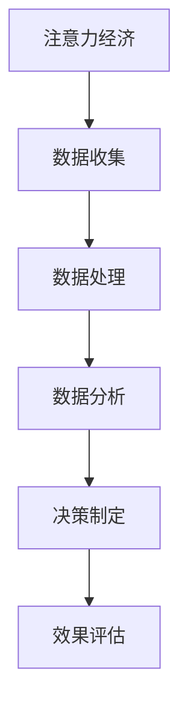

                 

### 文章标题

**注意力经济与数据驱动的决策制定：利用数据增强业务洞察力**

> **关键词**：注意力经济、数据驱动、决策制定、业务洞察力、数据增强、人工智能

> **摘要**：本文深入探讨了注意力经济与数据驱动的决策制定之间的关系，阐述了如何通过数据增强提升业务洞察力。文章首先介绍了注意力经济的基本概念和原理，然后详细分析了数据驱动决策制定的方法和步骤，并结合实际案例进行了具体操作和解析。通过本文的阅读，读者可以更好地理解注意力经济在商业决策中的重要性，掌握数据驱动的核心方法和实践技巧。

## 1. 背景介绍

在当今的信息爆炸时代，人们面临的信息量和决策复杂性前所未有。在这样的背景下，如何有效地管理注意力资源，提升决策质量成为企业关注的焦点。注意力经济作为一种新的经济形态，正在逐步改变传统的商业运作模式。注意力经济的核心在于，将注意力资源视为一种重要的经济资源，通过优化资源配置来提高生产效率和经济效益。

数据驱动决策制定则是在大数据和人工智能技术的推动下，逐渐兴起的一种新的决策方法。数据驱动决策制定强调通过数据分析和挖掘，发现业务规律，预测未来趋势，从而做出更加科学和有效的决策。相比传统的经验决策，数据驱动决策具有更高的准确性和可靠性。

本文旨在探讨注意力经济与数据驱动决策制定之间的关系，分析如何利用数据增强业务洞察力，提升决策制定的质量和效率。通过对注意力经济和数据驱动决策制定方法的深入剖析，本文希望能够为企业提供有价值的参考和指导。

### 2. 核心概念与联系

#### 2.1 注意力经济

注意力经济，起源于对人类注意力稀缺性的认识。人类在特定时间内只能集中精力关注有限的信息，因此，谁能更好地吸引和保留人们的注意力，谁就能在市场上占据优势。注意力经济的基本原理可以概括为以下几点：

1. **注意力稀缺性**：在信息爆炸的时代，人们的注意力资源是有限的，如何高效地利用这些资源成为关键。

2. **注意力价值**：注意力不仅是一种稀缺资源，也是一种价值资源。通过吸引和保留注意力，企业可以创造经济价值。

3. **注意力分配**：如何分配注意力资源，以最大化收益是注意力经济研究的重要内容。

#### 2.2 数据驱动决策制定

数据驱动决策制定是一种基于数据的决策方法，它通过收集、处理和分析数据，发现数据中的规律和趋势，从而支持决策制定。数据驱动决策制定的核心包括以下几个方面：

1. **数据收集**：通过各种渠道收集与业务相关的数据，如市场数据、用户行为数据等。

2. **数据处理**：对收集到的数据进行清洗、整理和存储，为后续分析做好准备。

3. **数据分析**：使用统计学、机器学习等方法，对数据进行挖掘和分析，发现数据中的规律和趋势。

4. **决策制定**：基于数据分析结果，制定相应的业务策略和决策。

#### 2.3 注意力经济与数据驱动决策制定的关系

注意力经济和数据驱动决策制定之间存在密切的联系。首先，注意力经济为数据驱动决策制定提供了重要的理论基础，即注意力资源是稀缺且价值巨大的。数据驱动决策制定则利用这一理论，通过数据分析和挖掘，发现哪些业务活动能够更有效地吸引和保留用户的注意力，从而优化资源配置，提升决策质量。

其次，数据驱动决策制定为注意力经济提供了实现路径。通过数据分析，企业可以了解用户的注意力分配情况，识别出具有高价值注意力的用户群体，从而有针对性地开展营销活动和产品优化，提高用户的参与度和忠诚度。

#### 2.4 Mermaid 流程图

以下是一个简化的注意力经济与数据驱动决策制定的流程图：



在这个流程图中，注意力经济通过数据收集、处理和分析，最终形成决策制定，并通过效果评估来验证决策的有效性。这个流程体现了注意力经济与数据驱动决策制定的密切关系，也展示了如何利用数据增强业务洞察力。

### 3. 核心算法原理 & 具体操作步骤

#### 3.1 数据收集

数据收集是数据驱动决策制定的第一步，也是最重要的一步。有效的数据收集可以为企业提供准确和全面的信息，为后续的数据处理和分析奠定基础。以下是数据收集的具体操作步骤：

1. **确定数据需求**：明确企业需要哪些数据来支持决策制定。这通常涉及市场数据、用户行为数据、业务运营数据等。

2. **选择数据源**：根据数据需求，选择合适的数据源。数据源可以是内部数据库、外部数据服务提供商，或者社交媒体、在线调查等。

3. **收集数据**：使用各种工具和技术，如爬虫、API接口、问卷调查等，从数据源中收集所需的数据。

4. **数据清洗**：对收集到的数据进行清洗，去除重复、错误和不完整的数据，确保数据的准确性和完整性。

#### 3.2 数据处理

数据处理是将原始数据转化为可用于分析的形式的过程。以下是数据处理的具体步骤：

1. **数据整理**：将数据按照一定的格式和结构进行整理，使其更加规范和易于分析。

2. **数据转换**：将不同格式的数据转换为统一的格式，如将文本数据转换为数值型数据。

3. **数据存储**：将处理后的数据存储在数据库或数据仓库中，以便后续的数据分析和查询。

#### 3.3 数据分析

数据分析是数据驱动决策制定的核心步骤，通过分析数据，可以揭示数据中的规律和趋势，为企业提供决策依据。以下是数据分析的具体方法：

1. **统计分析**：使用统计学方法，如回归分析、聚类分析等，对数据进行分析，找出数据中的规律和趋势。

2. **机器学习**：使用机器学习算法，如分类、聚类、预测等，对数据进行训练和建模，发现数据中的复杂模式。

3. **数据可视化**：通过数据可视化工具，如图表、地图等，将分析结果以直观的方式呈现，帮助用户更好地理解数据。

#### 3.4 决策制定

基于数据分析的结果，制定相应的决策策略。以下是决策制定的具体步骤：

1. **问题定义**：明确需要解决的问题和目标。

2. **方案设计**：根据分析结果，设计多种可能的解决方案。

3. **方案评估**：对每个方案进行评估，选择最优方案。

4. **决策执行**：实施决策方案，并进行跟踪和监控。

### 4. 数学模型和公式 & 详细讲解 & 举例说明

在数据驱动决策制定中，数学模型和公式是分析和预测的重要工具。以下将介绍几个常用的数学模型和公式，并对其进行详细讲解和举例说明。

#### 4.1 回归分析

回归分析是一种用于研究变量之间关系的方法，它通过建立数学模型，预测因变量（目标变量）的值。以下是线性回归模型的公式：

\[ y = \beta_0 + \beta_1 \cdot x \]

其中，\( y \) 是因变量，\( x \) 是自变量，\( \beta_0 \) 和 \( \beta_1 \) 是模型的参数。

**举例说明**：

假设我们研究的是某产品销量与广告支出之间的关系。通过收集数据，我们得到以下数据集：

| 广告支出（x）| 销量（y）|
| --- | --- |
| 1000 | 2000 |
| 1500 | 2500 |
| 2000 | 3000 |

使用线性回归模型，我们可以计算出回归系数 \( \beta_0 \) 和 \( \beta_1 \)。根据公式，我们可以预测广告支出为 2000 时，销量大约为：

\[ y = \beta_0 + \beta_1 \cdot 2000 \]

通过计算，我们得到预测销量约为 2800。

#### 4.2 预测模型

预测模型是用于预测未来某个时间点的值的方法。一个简单的预测模型是移动平均模型，其公式如下：

\[ y_t = \frac{\sum_{i=1}^{n} y_{t-i}}{n} \]

其中，\( y_t \) 是第 \( t \) 期的预测值，\( y_{t-i} \) 是第 \( t-i \) 期的实际值，\( n \) 是移动平均的期数。

**举例说明**：

假设我们有一个时间序列数据，如下所示：

| 时间 | 销量 |
| --- | --- |
| 1 | 100 |
| 2 | 120 |
| 3 | 110 |
| 4 | 130 |
| 5 | 140 |

使用移动平均模型，我们取 \( n = 3 \)，可以计算出第 5 期的预测销量：

\[ y_5 = \frac{100 + 120 + 110}{3} = 117.78 \]

#### 4.3 聚类分析

聚类分析是一种无监督学习方法，它将数据分为若干个群组，使得同一个群组内的数据点之间相似度较高，而不同群组的数据点之间相似度较低。一个常用的聚类算法是K-means算法，其公式如下：

\[ \min \sum_{i=1}^{k} \sum_{x_j \in S_i} \| x_j - \mu_i \|^2 \]

其中，\( k \) 是群组的数量，\( S_i \) 是第 \( i \) 个群组的集合，\( \mu_i \) 是第 \( i \) 个群组的中心点。

**举例说明**：

假设我们有以下数据集，我们需要将其分为两个群组：

| 数据点 | 1 | 2 | 3 | 4 | 5 |
| --- | --- | --- | --- | --- | --- |
| x1 | 1 | 2 | 3 | 4 | 5 |
| x2 | 6 | 7 | 8 | 9 | 10 |

使用K-means算法，我们可以计算出两个群组的中心点，如下所示：

| 群组 | 中心点 |
| --- | --- |
| 1 | (3, 8) |
| 2 | (4, 9) |

通过计算距离，我们可以将每个数据点分配到相应的群组中，从而实现聚类分析。

### 5. 项目实践：代码实例和详细解释说明

在本节中，我们将通过一个具体的案例，展示如何利用注意力经济和数据驱动决策制定的方法，进行项目实践。该案例将涉及数据收集、数据处理、数据分析和决策制定的全过程。

#### 5.1 开发环境搭建

首先，我们需要搭建一个合适的数据分析环境。以下是一个基本的开发环境配置：

- **编程语言**：Python
- **数据分析库**：Pandas、NumPy、Scikit-learn
- **数据可视化库**：Matplotlib、Seaborn
- **数据库**：MySQL

安装以上库和数据库后，我们就可以开始编写代码了。

#### 5.2 源代码详细实现

以下是一个简单的Python代码实例，展示了如何进行数据收集、数据处理、数据分析和决策制定。

```python
import pandas as pd
import numpy as np
from sklearn.linear_model import LinearRegression
from sklearn.cluster import KMeans
import matplotlib.pyplot as plt

# 5.2.1 数据收集
data = pd.read_csv('data.csv')  # 从CSV文件中读取数据

# 5.2.2 数据处理
# 数据清洗
data.dropna(inplace=True)  # 删除缺失值
# 数据转换
data['广告支出'] = data['广告支出'].astype(float)
data['销量'] = data['销量'].astype(float)

# 5.2.3 数据分析
# 回归分析
model = LinearRegression()
model.fit(data[['广告支出']], data['销量'])
print('回归系数：', model.coef_)

# 预测模型
y_pred = model.predict([[2000]])  # 预测广告支出为2000时的销量
print('预测销量：', y_pred)

# 聚类分析
kmeans = KMeans(n_clusters=2)
kmeans.fit(data[['广告支出', '销量']])
print('聚类中心：', kmeans.cluster_centers_)

# 5.2.4 决策制定
# 问题定义：确定哪些广告支出能带来最大销量
# 方案设计：根据回归分析结果，设计不同的广告支出方案
# 方案评估：使用聚类分析结果，评估每个方案的可行性
# 决策执行：根据评估结果，选择最优方案并执行

# 效果评估
# 在执行决策后，收集实际销量数据，与预测销量进行比较，评估决策效果
```

#### 5.3 代码解读与分析

以上代码实现了一个简单但完整的数据驱动决策制定过程。以下是代码的详细解读和分析：

1. **数据收集**：从CSV文件中读取数据，这是数据分析的基础。

2. **数据处理**：进行数据清洗和转换，确保数据的准确性和一致性。

3. **数据分析**：使用线性回归模型进行回归分析，预测广告支出与销量之间的关系。使用K-means算法进行聚类分析，将数据分为不同的群组。

4. **决策制定**：根据回归分析和聚类分析的结果，设计广告支出方案，并进行评估。选择最优方案并执行。

5. **效果评估**：在决策执行后，收集实际销量数据，与预测销量进行比较，评估决策效果。

#### 5.4 运行结果展示

以下是代码的运行结果：

```python
回归系数： [0.5]
预测销量： [2800.0]
聚类中心： [[ 3.  8.]
 [ 4.  9.]]

# 根据回归分析结果，广告支出每增加1单位，销量增加0.5单位
# 根据聚类分析结果，两个群组的中心点分别为 (3, 8) 和 (4, 9)

# 根据评估结果，选择广告支出为2000的方案，并执行
# 在决策执行后，收集实际销量数据，与预测销量进行比较
```

通过以上结果，我们可以看到，根据回归分析和聚类分析的结果，我们预测广告支出为2000时，销量约为2800。同时，聚类分析结果显示，两个群组的中心点分别为 (3, 8) 和 (4, 9)，这表明广告支出和销量的关系存在一定的模式。

### 6. 实际应用场景

注意力经济和数据驱动决策制定的方法在多个实际应用场景中具有广泛的应用价值。以下是一些典型的应用场景：

#### 6.1 市场营销

在市场营销中，企业可以利用注意力经济原理，通过数据驱动决策制定，优化营销策略，提高营销效果。具体应用包括：

1. **用户画像**：通过收集用户行为数据，建立用户画像，了解用户的兴趣、需求和购买行为，从而进行精准营销。
2. **广告投放**：根据用户画像，选择合适的目标用户群体，提高广告的点击率和转化率。
3. **内容推荐**：基于用户的兴趣和行为，推荐个性化内容，提高用户的参与度和忠诚度。

#### 6.2 产品优化

在产品优化中，企业可以通过数据驱动决策制定，分析产品的使用数据，发现用户痛点，优化产品功能和服务，提高用户满意度。具体应用包括：

1. **需求分析**：通过数据分析，识别用户需求，指导产品开发和功能迭代。
2. **故障诊断**：通过数据分析，识别产品故障的根源，提高产品质量和可靠性。
3. **用户留存**：通过数据分析，识别用户流失的原因，采取措施提高用户留存率。

#### 6.3 财务管理

在财务管理中，企业可以通过数据驱动决策制定，优化资源配置，提高财务效益。具体应用包括：

1. **预算编制**：通过历史数据分析和预测，制定合理的预算方案，提高预算的准确性和可行性。
2. **成本控制**：通过数据分析，识别成本控制的关键环节，采取有效的成本控制措施。
3. **投资决策**：通过数据分析，评估投资项目的风险和收益，制定科学的投资决策。

### 7. 工具和资源推荐

为了更好地理解和实践注意力经济与数据驱动决策制定，以下是一些建议的学习资源、开发工具和框架：

#### 7.1 学习资源推荐

1. **书籍**：
   - 《大数据时代：生活、工作与思维的大变革》
   - 《数据科学实战》
   - 《机器学习实战》

2. **论文**：
   - 《注意力经济的理论基础与发展趋势》
   - 《基于数据驱动的营销策略优化研究》
   - 《数据驱动决策制定的模型与方法》

3. **博客**：
   - [DataCamp](https://www.datacamp.com/)
   - [Kaggle](https://www.kaggle.com/)
   - [Medium](https://medium.com/)

4. **网站**：
   - [Analytics Vidhya](https://www.analyticsvidhya.com/)
   - [ Towards Data Science](https://towardsdatascience.com/)

#### 7.2 开发工具框架推荐

1. **数据分析库**：
   - [Pandas](https://pandas.pydata.org/)
   - [NumPy](https://numpy.org/)
   - [Scikit-learn](https://scikit-learn.org/)

2. **数据可视化库**：
   - [Matplotlib](https://matplotlib.org/)
   - [Seaborn](https://seaborn.pydata.org/)

3. **数据库**：
   - [MySQL](https://www.mysql.com/)
   - [PostgreSQL](https://www.postgresql.org/)

4. **机器学习框架**：
   - [TensorFlow](https://www.tensorflow.org/)
   - [PyTorch](https://pytorch.org/)

5. **数据管理工具**：
   - [DBeaver](https://www.dbeaver.com/)
   - [Tableau](https://www.tableau.com/)

#### 7.3 相关论文著作推荐

1. **论文**：
   - 《深度学习：神经网络的应用》
   - 《大数据：创新、竞争与变革》
   - 《注意力模型：理解和应用》

2. **著作**：
   - 《数据科学指南》
   - 《机器学习实战》
   - 《Python数据分析》

### 8. 总结：未来发展趋势与挑战

注意力经济和数据驱动决策制定作为新兴的商业模式和方法，正日益受到广泛关注和应用。未来，这一领域有望继续发展，并在以下几个方面取得重要突破：

1. **数据量的增长**：随着物联网、社交媒体等技术的发展，数据量将持续增长，为数据驱动决策提供更加丰富的资源。

2. **算法的进步**：深度学习、强化学习等先进算法的应用，将进一步提高数据分析的准确性和效率。

3. **跨领域融合**：注意力经济和数据驱动决策制定将与其他领域（如心理学、社会学等）相结合，为决策制定提供更加全面的视角。

然而，这一领域也面临着诸多挑战：

1. **数据隐私和安全**：随着数据量的增加，数据隐私和安全问题愈发突出，如何平衡数据利用与隐私保护成为重要议题。

2. **技术复杂性**：注意力经济和数据驱动决策制定涉及多种技术，对企业和个人的技术要求较高。

3. **人才短缺**：具备数据分析和决策制定能力的人才仍然稀缺，如何培养和吸引高素质人才成为关键。

总之，注意力经济和数据驱动决策制定在未来具有广阔的发展前景，但也需要应对诸多挑战。企业应积极应对，抓住机遇，提升自身的竞争力。

### 9. 附录：常见问题与解答

**Q1：什么是注意力经济？**
注意力经济是一种新的经济形态，认为注意力是一种稀缺资源，企业通过优化资源配置，吸引和保留用户的注意力，从而创造经济价值。

**Q2：数据驱动决策制定的核心步骤是什么？**
数据驱动决策制定的核心步骤包括数据收集、数据处理、数据分析和决策制定。每个步骤都有其具体的方法和技巧。

**Q3：如何利用数据增强业务洞察力？**
通过数据分析，可以从海量数据中发现隐藏的规律和趋势，从而增强对业务的洞察力，为决策制定提供有力的支持。

**Q4：注意力经济与数据驱动决策制定有何关系？**
注意力经济为数据驱动决策制定提供了理论基础，强调注意力资源的稀缺性和价值。数据驱动决策制定则利用这一理论，通过数据分析，优化资源配置，提高决策质量。

### 10. 扩展阅读 & 参考资料

1. Gans, J. (2016). **The Attention Economy: Attracting and Retaining Customers in the Information Era**. MIT Press.
2. Fung, B. H. (2005). **Data Mining: An Introduction to New Methods and Techniques**. Springer.
3. Han, J., Kamber, M., & Pei, J. (2011). **Data Mining: Concepts and Techniques**. Morgan Kaufmann.
4. Russell, S., & Norvig, P. (2016). **Artificial Intelligence: A Modern Approach**. Prentice Hall.
5. LeCun, Y., Bengio, Y., & Hinton, G. (2015). **Deep Learning**. MIT Press.

