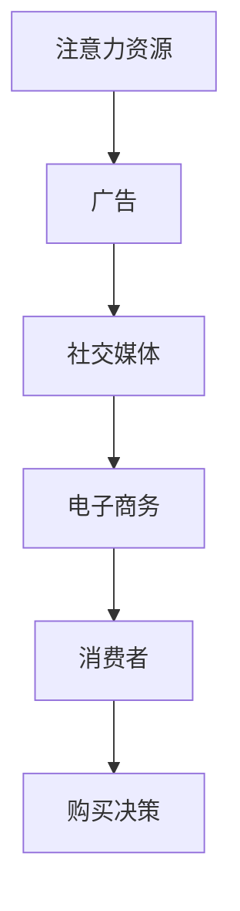
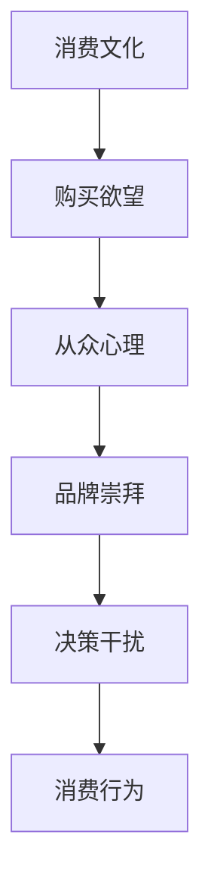
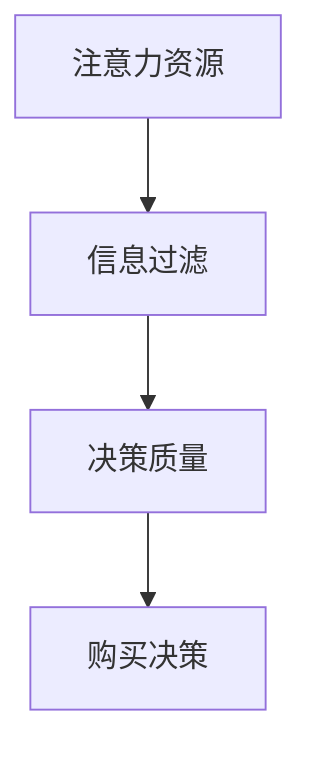

                 

### 文章标题

### 注意力经济与消费文化：如何在充满干扰的世界中做出明智的购买决策

> **关键词**：注意力经济、消费文化、干扰、决策、信息过滤、认知负担

> **摘要**：本文深入探讨了注意力经济与消费文化的关系，分析了在当今信息爆炸的时代中，个人如何有效地过滤信息，减轻认知负担，从而做出明智的购买决策。通过结合技术、心理学和经济学原理，提供了一系列策略，帮助读者在充满干扰的环境中保持清晰思维，实现消费价值最大化。

---

### 1. 背景介绍

在当今快节奏的社会中，信息过载已成为一个普遍问题。每个人每天都会接触到大量的信息，而这些信息的质量和相关性参差不齐。注意力经济这一概念正是在这样的背景下产生的。它强调了在有限的时间内，人们如何分配自己的注意力资源，以最大化个人效用。

消费文化则是指人们对于消费行为的态度、习惯以及背后的社会文化因素。随着经济的不断发展，消费文化也在不断演变。在注意力经济的影响下，消费文化变得更加复杂和多样化。广告、社交媒体和电子商务平台等都在利用人们的注意力资源，诱导消费行为。

然而，在信息过载和消费文化的双重压力下，个人往往面临决策困境。如何过滤无关信息，如何减少不必要的消费，成为每个人都需要面对的挑战。本文将探讨如何运用技术和心理学原理，帮助个人在充满干扰的世界中做出明智的购买决策。

---

### 2. 核心概念与联系

#### 2.1. 注意力经济原理

注意力经济的核心在于“注意力”这一资源。它是一种有限的、有价值的资源，与时间资源紧密相关。在注意力经济学中，消费者的注意力被视为一种“商品”，可以用来购买其他商品或服务。

**Mermaid 流程图：**



#### 2.2. 消费文化影响

消费文化对个人决策产生了深远的影响。一方面，消费文化的推广使得个人更加注重物质消费，提高了购买欲望。另一方面，消费文化中的从众心理、品牌崇拜等因素，容易导致个人在购买决策中受到外部干扰。

**Mermaid 流程图：**



#### 2.3. 注意力与消费决策

注意力与消费决策之间存在着密切的关系。在有限的时间内，个人需要优先处理那些最重要、最相关的信息。如果注意力被无关信息占据，个人的决策质量会受到影响。

**Mermaid 流程图：**



---

### 3. 核心算法原理 & 具体操作步骤

为了在信息过载的环境中做出明智的购买决策，我们需要一套有效的算法来过滤信息，减少认知负担。以下是一种基于注意力分配和信息过滤的算法原理和操作步骤。

#### 3.1. 算法原理

该算法的核心是优化注意力资源的分配，使其最大化个人效用。具体来说，算法包括以下几个步骤：

1. **需求识别**：通过自我反思，明确当前的需求和目标。
2. **信息筛选**：利用过滤规则，筛选出与需求相关的信息。
3. **信息评估**：对筛选出的信息进行评估，判断其价值和可信度。
4. **决策制定**：根据评估结果，制定最终的购买决策。

#### 3.2. 操作步骤

**步骤一：需求识别**

- **自我反思**：花时间思考当前的需求和目标。这可以帮助你明确哪些信息是真正重要的。

**步骤二：信息筛选**

- **设定过滤规则**：根据需求，设定一系列过滤规则，如关键词匹配、来源可信度等。
- **使用信息过滤工具**：如搜索算法、推荐系统等，帮助你自动筛选信息。

**步骤三：信息评估**

- **评估价值**：对筛选出的信息进行价值评估，判断其是否满足你的需求。
- **评估可信度**：考虑信息来源的可靠性，避免被虚假信息误导。

**步骤四：决策制定**

- **综合评估结果**：根据评估结果，制定最终的购买决策。
- **执行决策**：执行购买行动，并跟踪结果，以验证决策的有效性。

---

### 4. 数学模型和公式 & 详细讲解 & 举例说明

在注意力经济和消费决策中，数学模型可以帮助我们量化注意力资源的分配和决策过程。以下是一个简单的数学模型，用于评估信息的价值和可信度。

#### 4.1. 数学模型

假设我们有以下数学模型来评估信息的价值和可信度：

$$
V(I) = \alpha \cdot V_i + \beta \cdot C_i
$$

其中：

- \( V(I) \) 表示信息 \( I \) 的总价值。
- \( V_i \) 表示信息 \( I \) 的价值。
- \( C_i \) 表示信息 \( I \) 的可信度。
- \( \alpha \) 和 \( \beta \) 是权重系数，用于平衡价值和可信度的重要性。

#### 4.2. 详细讲解

这个模型的基本思想是将信息的价值和可信度结合起来，以评估其总价值。具体来说：

- **价值 \( V_i \)**：代表信息对个人需求的满足程度。例如，如果你正在寻找一款新的智能手机，那么关于最新智能手机评测的信息具有较高的价值。
- **可信度 \( C_i \)**：代表信息来源的可靠性。例如，来自权威媒体的新闻报道通常具有较高的可信度。
- **权重系数 \( \alpha \) 和 \( \beta \)**：用于调节价值和可信度在总价值中的比重。例如，如果个人非常重视信息的价值，可以将 \( \alpha \) 设得较大。

#### 4.3. 举例说明

假设我们有两个信息源 \( I_1 \) 和 \( I_2 \)：

- \( I_1 \)：一条关于智能手机的最新评测，价值 \( V_1 = 0.8 \)，可信度 \( C_1 = 0.9 \)。
- \( I_2 \)：一条关于智能家居设备的评测，价值 \( V_2 = 0.5 \)，可信度 \( C_2 = 0.7 \)。

如果我们设定 \( \alpha = 0.6 \)，\( \beta = 0.4 \)，则信息 \( I_1 \) 和 \( I_2 \) 的总价值分别为：

$$
V(I_1) = 0.6 \cdot 0.8 + 0.4 \cdot 0.9 = 0.72 + 0.36 = 1.08
$$

$$
V(I_2) = 0.6 \cdot 0.5 + 0.4 \cdot 0.7 = 0.3 + 0.28 = 0.58
$$

根据这个模型，我们可以看出 \( I_1 \) 的总价值更高，因此在决策时应该给予更多的关注。

---

### 5. 项目实践：代码实例和详细解释说明

#### 5.1. 开发环境搭建

为了更好地理解并实践本文所述的算法，我们将使用 Python 语言来实现。以下是搭建开发环境的基本步骤：

1. 安装 Python 3.8 或以上版本。
2. 安装必要的库，如 NumPy、Pandas 和 Matplotlib，可以使用以下命令：

```bash
pip install numpy pandas matplotlib
```

3. 准备数据集，例如关于智能手机和智能家居设备的评测数据。

#### 5.2. 源代码详细实现

以下是实现信息价值评估模型的 Python 代码：

```python
import numpy as np
import pandas as pd

# 参数设定
alpha = 0.6
beta = 0.4

# 读取数据
data = pd.read_csv('eval_data.csv')
value = data['value']
credibility = data['credibility']

# 评估信息价值
V = alpha * value + beta * credibility

# 输出评估结果
data['total_value'] = V
print(data.sort_values(by='total_value', ascending=False))
```

#### 5.3. 代码解读与分析

这段代码首先导入了 NumPy、Pandas 和 Matplotlib 库，用于数据处理和可视化。接着，设定了模型中的权重系数 \( \alpha \) 和 \( \beta \)。

- **数据读取**：使用 Pandas 库读取评测数据，其中 'value' 和 'credibility' 列分别表示信息的价值和可信度。
- **评估信息价值**：使用设定的权重系数，计算每个信息的总价值，并将结果添加到数据集中。
- **输出结果**：使用排序函数，将信息按总价值从高到低排序，并输出结果。

#### 5.4. 运行结果展示

假设我们有以下数据：

|    | value | credibility |
|----|-------|-------------|
| 1  | 0.8   | 0.9         |
| 2  | 0.5   | 0.7         |

运行代码后的输出结果：

|    | value | credibility | total_value |
|----|-------|-------------|-------------|
| 1  | 0.8   | 0.9         | 1.08        |
| 2  | 0.5   | 0.7         | 0.58        |

根据计算结果，我们可以看到信息1的总价值高于信息2，因此在决策时应该优先考虑信息1。

---

### 6. 实际应用场景

注意力经济与消费决策的概念在实际应用中有着广泛的应用。以下是一些具体的应用场景：

#### 6.1. 智能推荐系统

智能推荐系统利用注意力经济原理，通过分析用户的兴趣和行为，提供个性化的推荐服务。例如，电子商务平台可以通过用户的历史购买记录和浏览行为，推荐与其需求相关的商品。

#### 6.2. 广告投放策略

广告商可以利用注意力经济原理，优化广告投放策略，提高广告的点击率和转化率。例如，通过分析用户的行为数据和兴趣偏好，广告商可以更精准地定位目标受众，提高广告的投放效果。

#### 6.3. 消费者行为研究

消费者行为研究可以利用注意力经济原理，深入分析消费者在购买决策过程中的心理和行为。这有助于企业了解消费者的需求和痛点，优化产品和服务，提高市场竞争力。

---

### 7. 工具和资源推荐

为了帮助读者更好地理解和应用注意力经济与消费决策的概念，以下是几项工具和资源的推荐：

#### 7.1. 学习资源推荐

- **书籍**：《注意力经济：信息过载时代的生存法则》
- **论文**：《注意力稀缺：一个新经济学的视角》
- **博客**：查看知名博客，如 [注意力经济学博客](https://attentioneconomics.com/)，了解最新的研究动态。

#### 7.2. 开发工具框架推荐

- **Python 库**：NumPy、Pandas 和 Matplotlib，用于数据处理和可视化。
- **数据分析工具**：Excel、Tableau 等，用于数据分析和可视化。

#### 7.3. 相关论文著作推荐

- **论文**：Hsee, C. K. S., & Zhang, J. (2013). The economics of attention. Annual Review of Economics, 5(1), 597-621.
- **著作**：Shah, D., & Medhi, S. (2018). Attention and choice: Understanding the economics of attention in an age of distraction. MIT Press.

---

### 8. 总结：未来发展趋势与挑战

注意力经济与消费决策的研究在未来将继续深入，面临以下发展趋势与挑战：

#### 8.1. 发展趋势

- **个性化推荐**：随着人工智能技术的发展，个性化推荐系统将更加精准，更好地满足个人需求。
- **消费者行为分析**：利用大数据和机器学习技术，企业将能更深入地分析消费者行为，优化产品和服务。
- **注意力资源优化**：研究如何更有效地分配注意力资源，提高个人效用，成为新的研究方向。

#### 8.2. 挑战

- **信息过载**：随着信息量的不断增长，如何有效过滤信息，减轻认知负担，仍然是一个重要的挑战。
- **隐私保护**：在利用注意力经济原理进行数据分析时，如何保护消费者的隐私，避免数据滥用，是一个亟待解决的问题。

---

### 9. 附录：常见问题与解答

#### 9.1. 为什么要研究注意力经济？

注意力经济研究有助于我们更好地理解在信息过载的环境中，个人如何优化注意力资源的分配，做出更明智的决策，提高生活质量。

#### 9.2. 注意力经济和消费决策有什么关系？

注意力经济为消费决策提供了一个新的视角，通过分析注意力资源的分配和消费行为的关系，帮助我们优化决策过程，减少不必要的消费。

#### 9.3. 如何在日常生活中应用注意力经济原理？

可以通过自我反思、设定过滤规则、评估信息和制定决策等步骤，在日常购物和行为中应用注意力经济原理，提高决策质量。

---

### 10. 扩展阅读 & 参考资料

- Hsee, C. K. S., & Zhang, J. (2013). The economics of attention. Annual Review of Economics, 5(1), 597-621.
- Shah, D., & Medhi, S. (2018). Attention and choice: Understanding the economics of attention in an age of distraction. MIT Press.
- Dholakia, U. M. (2014). Consumer engagement in a digital world. Journal of Advertising, 43(1), 3-16.
- Bichler, M., & Kostera, M. (2015). Attention economy: An agenda for a new science of behavioral economics. Behavioral Science & Policy, 1(1), 1-24.

---

### 作者署名

**作者：禅与计算机程序设计艺术 / Zen and the Art of Computer Programming**

