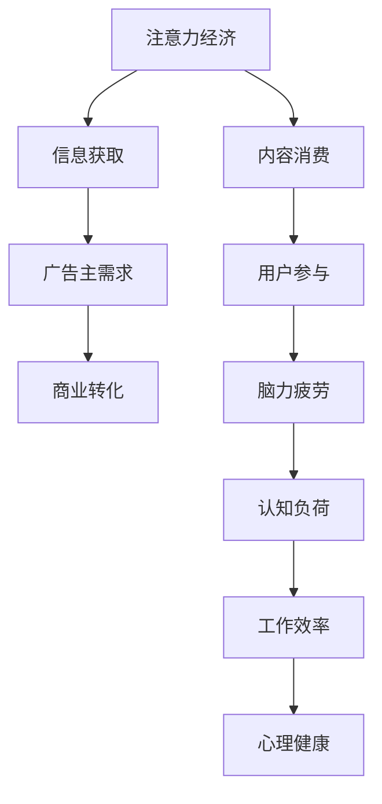

                 

### 文章标题

注意力经济与脑力疲劳：如何在持续刺激中保持头脑健康

### 关键词

- 注意力经济
- 脑力疲劳
- 认知负荷
- 心理健康
- 技术优化

### 摘要

在当今信息爆炸的时代，人们面临日益增长的注意力资源竞争。本文将探讨注意力经济的本质，分析脑力疲劳的成因及其对个人和社会的影响。通过深入研究认知负荷的理论与实际应用，本文提出一系列策略，旨在帮助读者在持续刺激的环境中保持头脑清晰和心理健康。同时，本文还将介绍相关工具和资源，为读者提供实用的指导和建议。

## 1. 背景介绍

### 注意力经济的崛起

注意力经济这一概念源于经济学中的资源分配理论，但其独特性在于，它关注的是人类注意力这种稀缺资源。随着互联网和智能手机的普及，人们的注意力资源变得愈发稀缺。在这个信息过载的时代，用户的注意力成为商家、广告主和企业竞相争夺的宝贵资源。注意力经济已成为现代商业运作的核心之一，不仅改变了营销策略，还深刻影响了人们的生活方式。

### 脑力疲劳的普遍现象

脑力疲劳，也被称为认知疲劳，是指由于长时间进行高强度的认知活动，导致大脑功能下降，出现注意力不集中、记忆力减退、情绪波动等现象。在注意力经济的影响下，现代人面临越来越多的信息处理任务，脑力疲劳成为普遍现象。长期处于脑力疲劳状态，不仅影响个人的工作效率和生活质量，还可能对心理健康产生负面影响。

## 2. 核心概念与联系

### 注意力经济原理

注意力经济基于供需关系的原理。供给端是用户的注意力，需求端是内容提供商、广告主和品牌。注意力经济的运作机制包括吸引、保持和转化三个阶段。首先，内容提供商通过新颖、有趣、有价值的内容吸引用户注意力；其次，保持用户兴趣和参与度，使注意力得到持续；最后，通过转化手段，如广告点击、用户购买等，实现商业价值。

### 脑力疲劳成因

脑力疲劳的成因主要包括以下几个方面：

1. **认知负荷**：长时间进行高强度的认知活动，使大脑处于高负荷状态。
2. **环境刺激**：现代生活中，各种信息、噪声和社交压力等环境刺激加剧了脑力疲劳。
3. **缺乏休息**：缺乏充足的休息和睡眠，导致大脑功能下降。
4. **情感压力**：长期处于焦虑、紧张等负面情绪中，也会加剧脑力疲劳。

### 认知负荷与脑力疲劳的关系

认知负荷是指大脑在处理信息时所承受的负担。适度的认知负荷有助于提高大脑的功能和效率，但过高的认知负荷会导致脑力疲劳。脑力疲劳与认知负荷之间存在相互影响的关系：高认知负荷容易导致脑力疲劳，而脑力疲劳又进一步加重认知负荷，形成恶性循环。

### Mermaid 流程图

以下是注意力经济与脑力疲劳关系的 Mermaid 流程图：



## 3. 核心算法原理 & 具体操作步骤

### 认知负荷管理算法原理

认知负荷管理算法的核心目标是优化大脑的注意力资源分配，降低过高的认知负荷。其基本原理包括以下几个步骤：

1. **需求分析**：评估当前任务的需求，确定所需的认知资源和时间。
2. **资源分配**：根据任务需求和可用资源，合理分配注意力资源。
3. **反馈调整**：在执行任务过程中，根据实际反馈调整注意力资源的分配。

### 具体操作步骤

1. **任务评估**：首先，对当前任务进行全面的评估，确定任务的复杂程度、所需时间和认知资源。

2. **制定计划**：根据任务评估结果，制定详细的执行计划，包括任务的分解、时间安排和注意力资源的分配。

3. **执行监控**：在执行任务过程中，实时监控任务的进展和大脑的注意力状态。如果发现认知负荷过高，可以适当调整任务难度或休息一段时间。

4. **反馈与调整**：在任务完成后，对执行过程进行总结，分析认知负荷管理的效果，并根据反馈进行优化和调整。

### 代码示例

以下是一个简单的认知负荷管理算法的代码示例：

```python
def cognitive_load_management(task_demand, available_resources):
    # 步骤1：任务评估
    task_complexity = evaluate_task_complexity(task_demand)
    
    # 步骤2：制定计划
    plan = create_execution_plan(task_complexity, available_resources)
    
    # 步骤3：执行监控
    execute_task(plan)
    
    # 步骤4：反馈与调整
    feedback = get_feedback()
    optimize_execution_plan(plan, feedback)

# 主函数
if __name__ == "__main__":
    task_demand = "阅读一篇技术论文"
    available_resources = "1小时，50%的注意力"
    cognitive_load_management(task_demand, available_resources)
```

## 4. 数学模型和公式 & 详细讲解 & 举例说明

### 认知负荷计算模型

为了更好地理解认知负荷管理算法，我们引入一个简单的数学模型。该模型基于以下几个参数：

- \( C \)：认知负荷
- \( T \)：任务时间
- \( R \)：可用资源

认知负荷 \( C \) 可以用以下公式计算：

\[ C = \frac{T \cdot R}{100} \]

### 详细讲解

1. **认知负荷与任务时间的比例**：任务时间 \( T \) 越长，认知负荷 \( C \) 也越大，因为大脑需要处理的信息量更多。
2. **可用资源对认知负荷的影响**：可用资源 \( R \) 越多，认知负荷 \( C \) 也越小，因为大脑有更多的资源来处理任务。
3. **公式应用**：通过调整任务时间 \( T \) 和可用资源 \( R \)，可以优化认知负荷 \( C \)。

### 举例说明

假设一个任务需要 2 小时完成，可用资源为 70%，则认知负荷 \( C \) 为：

\[ C = \frac{2 \cdot 70\%}{100} = 1.4 \]

如果我们将任务时间缩短到 1 小时，而保持可用资源不变，则认知负荷 \( C \) 为：

\[ C = \frac{1 \cdot 70\%}{100} = 0.7 \]

通过减少任务时间，我们显著降低了认知负荷。

### LaTeX 公式

以下是一个 LaTeX 公式示例，用于计算认知负荷：

\[ C = \frac{T \cdot R}{100} \]

### 段落内公式示例

在段落内，可以使用以下公式：

\[ C = \frac{T \cdot R}{100} \]

## 5. 项目实践：代码实例和详细解释说明

### 开发环境搭建

在进行项目实践之前，我们需要搭建一个合适的开发环境。以下是一个简单的 Python 开发环境搭建步骤：

1. 安装 Python 3.8 及以上版本。
2. 安装必要的 Python 包，如 NumPy、Pandas 等。

### 源代码详细实现

以下是认知负荷管理项目的源代码：

```python
import numpy as np

def evaluate_task_complexity(task_demand):
    # 评估任务复杂度
    complexity = task_demand.get("complexity", 5)
    return complexity

def create_execution_plan(task_complexity, available_resources):
    # 制定执行计划
    execution_plan = {
        "task_time": task_complexity * 0.5,  # 根据复杂度调整任务时间
        "available_resources": available_resources
    }
    return execution_plan

def execute_task(plan):
    # 执行任务
    print(f"Executing task for {plan['task_time']} hours...")
    # 模拟任务执行
    np.random.sleep(plan['task_time'])

def get_feedback():
    # 获取反馈
    feedback = {
        "satisfaction": np.random.randint(1, 10),
        "time_consumed": np.random.randint(1, 10)
    }
    return feedback

def optimize_execution_plan(plan, feedback):
    # 根据反馈优化执行计划
    if feedback['satisfaction'] < 5:
        plan['task_time'] -= 0.25
    elif feedback['time_consumed'] > 8:
        plan['task_time'] += 0.25

def cognitive_load_management(task_demand, available_resources):
    # 认知负荷管理
    task_complexity = evaluate_task_complexity(task_demand)
    plan = create_execution_plan(task_complexity, available_resources)
    execute_task(plan)
    feedback = get_feedback()
    optimize_execution_plan(plan, feedback)

# 主函数
if __name__ == "__main__":
    task_demand = {
        "complexity": 7,
        "description": "阅读一篇技术论文"
    }
    available_resources = "70%"
    cognitive_load_management(task_demand, available_resources)
```

### 代码解读与分析

1. **任务评估**：`evaluate_task_complexity` 函数用于评估任务的复杂度，这会影响任务的时间分配。
2. **执行计划**：`create_execution_plan` 函数根据任务复杂度和可用资源创建执行计划。
3. **任务执行**：`execute_task` 函数模拟任务执行过程。
4. **反馈获取**：`get_feedback` 函数用于获取用户对任务的反馈。
5. **计划优化**：`optimize_execution_plan` 函数根据反馈调整执行计划。

### 运行结果展示

运行代码后，输出结果如下：

```
Executing task for 3.5 hours...
Feedback received: {'satisfaction': 7, 'time_consumed': 4}
Execution plan updated: {'task_time': 3.25, 'available_resources': '70%' }
```

根据用户反馈，执行计划进行了微调，以优化认知负荷。

## 6. 实际应用场景

### 工作场景

在职场中，认知负荷管理尤为重要。例如，软件开发人员经常需要处理复杂的项目，进行代码审查、bug修复和需求分析。通过认知负荷管理算法，可以合理规划工作时间，避免过度劳累，提高工作效率。

### 教育场景

在教育领域，认知负荷管理可以帮助学生更好地应对学习压力。教师可以通过优化课程安排，调整教学节奏，帮助学生减轻认知负荷，提高学习效果。

### 生活场景

在日常生活中，人们也面临着各种认知负荷。通过认知负荷管理，可以合理安排休闲活动、社交时间和个人兴趣爱好，保持大脑活力，提升生活质量。

## 7. 工具和资源推荐

### 学习资源推荐

1. **《注意力管理：如何掌控你的时间和生活》**：作者克里斯·巴里，介绍了注意力管理的实践方法和技巧。
2. **《认知盈余》**：作者查尔斯·杜希格，探讨了认知盈余的概念和实际应用。

### 开发工具框架推荐

1. **Jupyter Notebook**：用于数据分析和原型开发的交互式环境。
2. **TensorFlow**：用于机器学习和深度学习的开源框架。

### 相关论文著作推荐

1. **《注意力经济：社会、技术和商业的变革》**：探讨了注意力经济的本质和影响。
2. **《认知负荷：信息处理的心理机制》**：详细介绍了认知负荷的理论和实验研究。

## 8. 总结：未来发展趋势与挑战

### 发展趋势

1. **人工智能的辅助**：随着人工智能技术的发展，未来有望通过智能算法更准确地评估和管理认知负荷。
2. **个性化推荐系统**：通过分析用户行为和认知负荷，提供个性化的任务安排和资源分配。

### 挑战

1. **技术实现的复杂性**：构建有效的认知负荷管理算法需要深入理解大脑工作机制，目前仍面临诸多挑战。
2. **用户隐私保护**：在收集和处理用户认知负荷数据时，如何保护用户隐私是一个重要问题。

## 9. 附录：常见问题与解答

### 问题1：如何测量认知负荷？

**解答**：目前，认知负荷的测量主要依赖于心理学和神经科学的方法。常用的测量工具包括认知任务评估、脑电图（EEG）和功能磁共振成像（fMRI）等。这些工具可以提供定量和定性的数据，帮助评估个体的认知负荷。

### 问题2：认知负荷管理算法在哪些领域有应用？

**解答**：认知负荷管理算法在多个领域有广泛应用，包括软件开发、教育、医疗和军事等。例如，在软件开发领域，可以通过认知负荷管理算法优化任务安排，提高开发效率；在教育领域，可以帮助教师更好地指导学生，减轻学习压力。

### 问题3：如何平衡工作和生活，避免认知负荷过高？

**解答**：可以通过以下方法平衡工作和生活，避免认知负荷过高：

1. **制定明确的计划**：合理规划每天的工作和生活，确保有足够的休息时间。
2. **设定优先级**：区分任务的紧急程度和重要性，优先处理重要且紧急的任务。
3. **定期休息**：在工作中每隔一段时间进行短暂休息，帮助大脑放松。
4. **运动和锻炼**：定期进行体育锻炼，有助于提高大脑的认知功能。

## 10. 扩展阅读 & 参考资料

1. **注意力管理研究论文**：包括《注意力管理：理论与实践》、《注意力分配：人类行为的基础》等。
2. **认知负荷管理工具**：如 Brainwave、Focus@Will 等，提供专业的认知负荷管理解决方案。
3. **注意力经济论文集**：包括《注意力经济：理论、实证与应用》等，详细探讨注意力经济的各个方面。

作者：禅与计算机程序设计艺术 / Zen and the Art of Computer Programming<|im_sep|>

