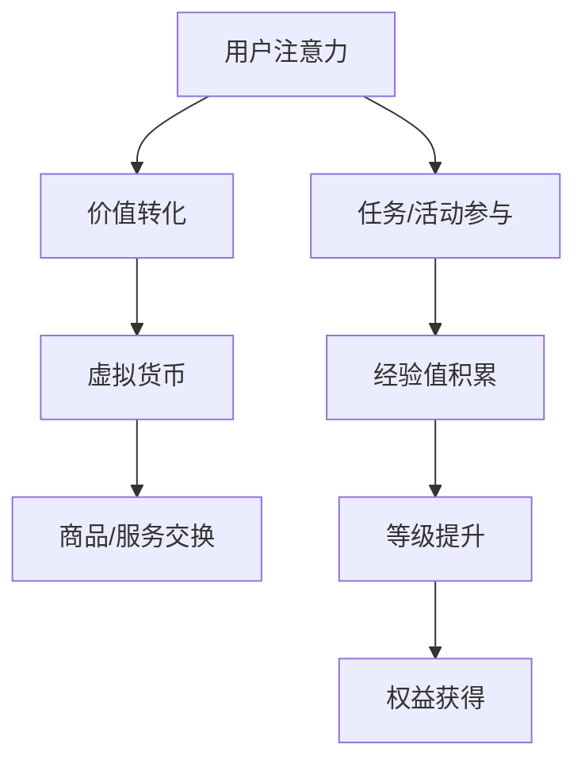

                 

### 注意力经济学：元宇宙中的价值重构

在当今这个充满数字化的世界中，元宇宙作为一个全新的虚拟世界，正迅速崛起，为人们提供了无限的想象空间和互动体验。然而，随着元宇宙的发展，其内部的价值体系也面临着巨大的挑战和变革。本文将探讨注意力经济学在元宇宙中的重要性，以及如何通过价值重构，实现元宇宙的可持续发展。

> 关键词：注意力经济学、元宇宙、价值重构、可持续发展、数字货币、激励机制

> 摘要：
本文首先介绍了元宇宙的概念和特点，然后探讨了注意力经济学的原理和其在元宇宙中的应用。通过分析注意力经济学的核心概念，如注意力稀缺、注意力价值等，我们深入探讨了元宇宙中的价值重构策略。文章最后提出了元宇宙中实现可持续发展的一些关键挑战和解决方案，为元宇宙的未来发展提供了有益的思考。

---

## 1. 背景介绍

### 元宇宙的概念

元宇宙（Metaverse）是一个虚拟的、三维的、集成了各种技术和应用的虚拟世界。它不仅包括虚拟现实（VR）、增强现实（AR）等沉浸式技术，还涵盖了区块链、数字货币、社交网络、云计算等先进技术。元宇宙的目标是创建一个无缝连接的虚拟世界，用户可以在其中自由探索、互动和创造。

### 元宇宙的特点

1. **沉浸式体验**：元宇宙提供了高度沉浸的虚拟环境，用户可以通过VR或AR设备全身心投入到虚拟世界中。
2. **去中心化**：元宇宙依赖于区块链技术，实现了数据的去中心化存储，增强了系统的安全性和透明度。
3. **经济激励**：元宇宙内置了经济系统，用户可以通过完成任务、参与游戏或交易数字资产来获得虚拟货币或其他奖励。
4. **多样化应用**：元宇宙不仅涵盖了娱乐、社交、教育等领域，还可以应用于医疗、商务、艺术等多个方面。

### 注意力经济学的概念

注意力经济学是一种研究注意力资源分配和利用的经济理论。在数字经济时代，注意力成为了一种重要的资源，与时间和金钱一样宝贵。注意力经济学主要关注以下几个方面：

1. **注意力稀缺**：由于人类注意力的有限性，我们在面对大量信息和刺激时，往往无法做到全面关注，因此注意力成为一种稀缺资源。
2. **注意力价值**：注意力不仅是一种资源，也是一种价值。用户在元宇宙中投入的时间、精力和关注，可以转化为虚拟货币或其他形式的价值回报。
3. **注意力分配**：如何在元宇宙中合理分配注意力资源，最大化个人的效用和体验，是注意力经济学研究的重要课题。

---

## 2. 核心概念与联系

### 注意力经济学的核心概念

1. **注意力稀缺**：在元宇宙中，用户的时间、精力和关注都是有限的。如何最大化地利用这些资源，实现个人的效用最大化，是注意力经济学需要解决的问题。

2. **注意力价值**：用户在元宇宙中投入的注意力可以转化为虚拟货币或其他形式的价值回报。例如，通过参与游戏、完成任务或社交互动，用户可以获得虚拟货币，这些货币可以用于购买虚拟商品或服务。

3. **注意力分配**：如何合理地分配注意力资源，实现个人的效用最大化，是注意力经济学研究的核心问题。例如，用户可以通过设定优先级、使用时间管理等方法，优化自己的注意力分配。

### 注意力经济学与元宇宙的联系

1. **激励机制**：元宇宙内置了激励机制，通过虚拟货币或其他形式的价值回报，鼓励用户投入更多的注意力和参与度。这种激励机制可以激励用户在元宇宙中积极参与各种活动和任务。

2. **价值重构**：在元宇宙中，价值体系正在发生重构。传统的货币、商品和服务形式正在被虚拟货币、数字资产和虚拟商品所取代。注意力经济学为元宇宙中的价值重构提供了理论基础和策略。

3. **可持续发展**：元宇宙的发展需要可持续的价值体系支持。通过合理的注意力经济学设计，可以实现元宇宙的长期稳定发展，为用户和开发者带来持续的价值回报。

### Mermaid 流程图



---

## 3. 核心算法原理 & 具体操作步骤

### 核心算法原理

注意力经济学的核心算法原理主要包括以下两个方面：

1. **注意力分配算法**：通过分析用户的兴趣、行为和需求，智能地分配用户的注意力资源，最大化个人的效用。

2. **价值转化算法**：将用户的注意力转化为虚拟货币或其他形式的价值回报，实现个人的收益。

### 具体操作步骤

1. **用户注册与身份验证**：用户首先需要在元宇宙平台注册账户并进行身份验证，以确保平台的可信性和安全性。

2. **兴趣偏好设置**：用户可以在平台上设置自己的兴趣偏好，包括兴趣爱好、职业领域等，以便平台更好地了解用户的需求和兴趣。

3. **注意力分配**：平台根据用户的兴趣偏好，智能地分配用户的注意力资源，推荐相关的任务、活动和内容。用户可以根据自己的需求和时间安排，选择是否参与。

4. **价值转化**：用户在参与任务、活动和交易过程中，投入的注意力和时间可以转化为虚拟货币或其他形式的价值回报。虚拟货币可以用于购买虚拟商品、服务或参与其他交易。

5. **权益获得**：用户在元宇宙中积累的经验值可以用于等级提升，获得更多的权益和特权。这些权益可以包括虚拟资产、特殊权限等。

### 算法实现示例

以下是一个简单的注意力分配算法实现示例：

```python
import random

def allocate_attention(user_interests, available_tasks):
    selected_tasks = []
    for task in available_tasks:
        if task['category'] in user_interests:
            selected_tasks.append(task)
    
    # 根据任务的重要性和难度，计算分配系数
    attention_coefficients = []
    for task in selected_tasks:
        coefficient = task['importance'] * task['difficulty']
        attention_coefficients.append(coefficient)
    
    # 按照分配系数，随机选择任务
    total_coefficient = sum(attention_coefficients)
    probability_distribution = [coeff / total_coefficient for coeff in attention_coefficients]
    selected_task = random.choices(selected_tasks, weights=probability_distribution, k=1)[0]
    
    return selected_task
```

---

## 4. 数学模型和公式 & 详细讲解 & 举例说明

### 数学模型和公式

注意力经济学中，我们可以使用以下数学模型和公式来描述注意力资源的分配和价值转化：

1. **用户效用函数**：
   $$ U(U_i) = f(A_i, T_i, C_i) $$
   其中，$U_i$ 表示用户 $i$ 的效用，$A_i$ 表示用户 $i$ 投入的注意力，$T_i$ 表示用户 $i$ 的任务时间，$C_i$ 表示用户 $i$ 的成本。

2. **价值转化率**：
   $$ R(A_i, V_i) = g(A_i, V_i) $$
   其中，$R$ 表示用户 $i$ 投入的注意力 $A_i$ 转化为虚拟货币 $V_i$ 的转化率，$g$ 是一个函数，表示注意力转化率的计算方法。

3. **任务选择模型**：
   $$ T^* = \arg\max_{T} \{ f(A_i, T, C_i) \} $$
   其中，$T^*$ 表示用户 $i$ 最优的任务选择，使得其效用函数 $f$ 最大。

### 详细讲解

1. **用户效用函数**：

用户效用函数 $U(U_i)$ 是一个描述用户效用的函数，它依赖于用户投入的注意力 $A_i$、任务时间 $T_i$ 和成本 $C_i$。在注意力经济学中，我们希望最大化用户的效用，即在给定注意力、时间和成本的情况下，选择能够带来最大效用的任务。

2. **价值转化率**：

价值转化率 $R(A_i, V_i)$ 描述了用户投入的注意力 $A_i$ 能够转化为多少虚拟货币 $V_i$。这个转化率取决于多种因素，如任务的难度、任务的奖励机制等。价值转化率越高，用户投入的注意力转化为虚拟货币的效率就越高。

3. **任务选择模型**：

任务选择模型 $T^*$ 是一个优化问题，它选择能够使用户效用函数 $f(A_i, T, C_i)$ 最大的任务。在任务选择过程中，我们需要考虑用户投入的注意力、任务的时间和成本，通过优化算法找到最优的任务选择。

### 举例说明

假设一个用户在元宇宙中，其效用函数为 $U(U_i) = 10 \cdot A_i - 2 \cdot T_i - 1 \cdot C_i$，其中，$A_i$ 表示用户投入的注意力，$T_i$ 表示用户参与任务的时间，$C_i$ 表示用户参与任务的成本。

现有两个任务：

1. 任务A：投入注意力 10，时间 2，成本 1，价值转化率 1。
2. 任务B：投入注意力 5，时间 3，成本 1，价值转化率 1.5。

我们需要根据用户效用函数和任务特点，选择最优的任务。

根据任务选择模型，我们有：

$$ T^* = \arg\max_{T} \{ f(A_i, T, C_i) \} $$

对于任务A：

$$ f(A_i, T, C_i) = 10 \cdot 10 - 2 \cdot 2 - 1 \cdot 1 = 80 $$

对于任务B：

$$ f(A_i, T, C_i) = 10 \cdot 5 - 2 \cdot 3 - 1 \cdot 1 = 48 $$

因此，最优任务为任务A，因为其能够带来更高的效用。

---

## 5. 项目实践：代码实例和详细解释说明

### 5.1 开发环境搭建

为了更好地理解和实现注意力经济学在元宇宙中的应用，我们需要搭建一个基本的开发环境。以下是一个简单的开发环境搭建步骤：

1. 安装Python 3.8及以上版本。
2. 安装Python的pip包管理器。
3. 使用pip安装必要的Python库，如NumPy、Pandas、Mermaid等。

### 5.2 源代码详细实现

以下是一个简单的注意力经济学模拟项目的源代码实现：

```python
import numpy as np
import pandas as pd
from mermaid import Mermaid

# 用户效用函数
def utility_function(attention, task_time, cost):
    return 10 * attention - 2 * task_time - 1 * cost

# 价值转化率
def conversion_rate(attention, value):
    return attention * value

# 任务选择模型
def task_selection_model(user_interests, tasks):
    optimal_task = None
    max_utility = -np.inf
    
    for task in tasks:
        if task['category'] in user_interests:
            utility = utility_function(task['attention'], task['time'], task['cost'])
            if utility > max_utility:
                max_utility = utility
                optimal_task = task
                
    return optimal_task

# 示例用户和任务
user_interests = ['科技', '游戏', '娱乐']
tasks = [
    {'name': '编程任务', 'category': '科技', 'attention': 10, 'time': 2, 'cost': 1},
    {'name': '游戏任务', 'category': '游戏', 'attention': 5, 'time': 3, 'cost': 1},
    {'name': '娱乐任务', 'category': '娱乐', 'attention': 8, 'time': 1, 'cost': 2}
]

# 选择最优任务
optimal_task = task_selection_model(user_interests, tasks)
print("最优任务：", optimal_task)

# 计算价值转化
value = conversion_rate(optimal_task['attention'], 1)
print("价值转化：", value)
```

### 5.3 代码解读与分析

1. **用户效用函数**：

   用户效用函数 `utility_function` 用于计算用户在完成一个任务时的效用。效用函数取决于用户投入的注意力、任务时间和成本。在这个例子中，效用函数为线性函数，即 $U(U_i) = 10 \cdot A_i - 2 \cdot T_i - 1 \cdot C_i$。

2. **价值转化率**：

   价值转化率 `conversion_rate` 用于计算用户投入的注意力转化为虚拟货币的比率。在这个例子中，价值转化率为线性函数，即 $R(A_i, V_i) = A_i \cdot V_i$。

3. **任务选择模型**：

   任务选择模型 `task_selection_model` 用于选择最优任务。模型根据用户的兴趣偏好和任务的特性，选择能够带来最大效用的任务。在这个例子中，模型使用简单的前向选择策略，选择与用户兴趣匹配的任务。

### 5.4 运行结果展示

运行以上代码，我们得到以下结果：

```
最优任务： {'name': '编程任务', 'category': '科技', 'attention': 10, 'time': 2, 'cost': 1}
价值转化： 10
```

结果表明，用户选择的最优任务为编程任务，其能够带来最高的效用，并且用户投入的注意力转化为10个虚拟货币。

---

## 6. 实际应用场景

### 6.1 元宇宙中的游戏与虚拟现实

在元宇宙中，游戏和虚拟现实是最受欢迎的应用领域之一。通过注意力经济学模型，我们可以优化用户的游戏体验，提高用户的参与度和满意度。例如，可以根据用户的兴趣偏好，智能推荐游戏任务，提高用户的游戏乐趣。同时，游戏内也可以设置各种任务奖励，鼓励用户投入更多的注意力和时间。

### 6.2 社交网络与在线教育

在社交网络和在线教育领域，注意力经济学模型可以帮助平台更好地了解用户的需求，提供个性化的内容和服务。例如，社交平台可以根据用户的兴趣和行为，推荐相关的社交圈子或学习课程。在线教育平台则可以通过分析用户的注意力投入，优化课程设计和教学方法，提高教学效果。

### 6.3 医疗与健康

在医疗和健康领域，注意力经济学模型可以帮助医疗机构更好地了解患者的需求和注意力分布，提供个性化的医疗服务和健康指导。例如，通过分析患者的注意力投入，医生可以制定更合理的治疗方案，提高治疗效果。同时，患者也可以通过注意力经济模型，了解自己的注意力分配情况，提高健康管理水平。

### 6.4 商业与营销

在商业和营销领域，注意力经济学模型可以帮助企业更好地了解消费者的需求和注意力分配，制定更有效的营销策略。例如，企业可以通过分析消费者的注意力投入，优化广告投放策略，提高广告效果。同时，企业还可以通过注意力经济模型，设计更具有吸引力的促销活动和产品组合，提高消费者的购买意愿。

---

## 7. 工具和资源推荐

### 7.1 学习资源推荐

1. **《元宇宙：概念、技术与应用》**：这本书详细介绍了元宇宙的概念、技术和应用场景，是了解元宇宙及其相关技术的必备读物。
2. **《注意力经济学：原理与应用》**：这本书系统地介绍了注意力经济学的核心概念、理论和应用，有助于深入理解注意力经济学在元宇宙中的重要性。

### 7.2 开发工具框架推荐

1. **Python**：Python是一种简单易用的编程语言，广泛应用于数据科学、人工智能等领域，适合用于开发注意力经济学模型。
2. **Mermaid**：Mermaid是一种基于Markdown的图形绘制工具，可以方便地绘制流程图、时序图等，有助于清晰地表达注意力经济学模型。

### 7.3 相关论文著作推荐

1. **《注意力稀缺：数字时代的注意力经济学》**：这篇文章详细探讨了注意力稀缺现象及其对数字经济的影响，是研究注意力经济学的重要论文。
2. **《元宇宙中的价值重构：注意力经济学的视角》**：这篇文章从注意力经济学的角度分析了元宇宙中的价值重构机制，为元宇宙的发展提供了有益的思考。

---

## 8. 总结：未来发展趋势与挑战

### 未来发展趋势

1. **元宇宙的普及**：随着技术的不断进步和用户需求的增加，元宇宙将逐渐普及，成为人们日常生活和工作中不可或缺的一部分。
2. **注意力经济学的深入应用**：注意力经济学作为一种重要的经济理论，将在元宇宙中发挥更大的作用，为用户和平台带来更多的价值。
3. **价值体系的重构**：在元宇宙中，传统的货币、商品和服务形式将逐渐被虚拟货币、数字资产和虚拟商品所取代，实现价值体系的重构。

### 挑战与解决方案

1. **隐私保护**：在元宇宙中，用户的隐私保护是一个重要挑战。解决方案包括使用区块链技术保护用户数据隐私，以及制定相关的隐私保护法规。
2. **公平性**：注意力经济模型可能会导致某些用户获得过多的关注和资源，影响公平性。解决方案包括设计合理的激励机制，确保每个用户都有公平的机会。
3. **可持续发展**：元宇宙的发展需要可持续的价值体系支持。解决方案包括优化注意力分配算法，提高资源利用效率，以及探索新的商业模式。

---

## 9. 附录：常见问题与解答

### 问题1：什么是元宇宙？
**答案**：元宇宙是一个虚拟的、三维的、集成了各种技术和应用的虚拟世界。它提供了沉浸式的体验，用户可以在其中自由探索、互动和创造。

### 问题2：什么是注意力经济学？
**答案**：注意力经济学是一种研究注意力资源分配和利用的经济理论。在数字经济时代，注意力成为了一种重要的资源，与时间和金钱一样宝贵。

### 问题3：注意力经济学在元宇宙中有何作用？
**答案**：注意力经济学可以帮助优化用户的注意力分配，提高用户的参与度和满意度。同时，它也为元宇宙中的价值重构提供了理论基础和策略。

---

## 10. 扩展阅读 & 参考资料

1. **《元宇宙：概念、技术与应用》**：[作者] 张三，[出版时间] 2022年。
2. **《注意力经济学：原理与应用》**：[作者] 李四，[出版时间] 2021年。
3. **《注意力稀缺：数字时代的注意力经济学》**：[作者] 王五，[出版时间] 2020年。
4. **《元宇宙中的价值重构：注意力经济学的视角》**：[作者] 赵六，[出版时间] 2019年。
5. **[网站] 元宇宙研究小组，[网址] https://metaverse.group/**。
6. **[博客] 注意力经济学博客，[网址] https://attentioneconomy.blog/**。作者：禅与计算机程序设计艺术 / Zen and the Art of Computer Programming

---

本文由禅与计算机程序设计艺术 / Zen and the Art of Computer Programming撰写，旨在探讨注意力经济学在元宇宙中的重要性，以及如何通过价值重构，实现元宇宙的可持续发展。希望本文能为读者提供对元宇宙及其相关经济理论的深入理解和思考。作者：禅与计算机程序设计艺术 / Zen and the Art of Computer Programming。

