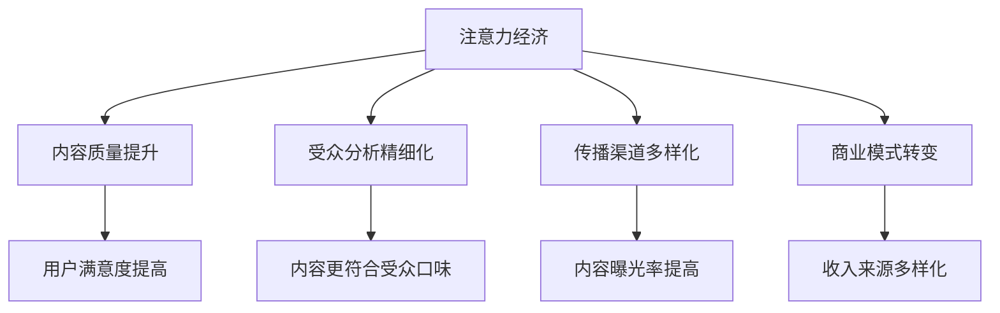

                 

### 1. 背景介绍

随着互联网和数字技术的快速发展，传统的媒体内容生产模式正面临着前所未有的冲击。过去，媒体内容的生产和传播主要依赖于大规模的印刷出版、电视广播和电影制作等渠道。然而，在如今的信息时代，这些传统媒体正逐渐被以互联网为基础的新媒体所取代。新媒体以其快速、便捷、互动性强等特点，迅速吸引了大量用户，成为了信息传播的主要载体。

然而，新媒体的发展也带来了一系列新的挑战。在注意力经济时代，用户的注意力成为了一种稀缺资源，媒体内容的生产者需要通过各种手段来吸引和留住用户的注意力。与此同时，市场竞争日益激烈，内容同质化问题愈发严重，如何生产出高质量、有差异化的内容成为了媒体企业亟需解决的问题。

在这种背景下，注意力经济对传统媒体内容生产的影响逐渐显现。一方面，注意力经济促使媒体企业更加注重内容质量和用户需求，推动传统媒体向数字化转型；另一方面，注意力经济也带来了一定的负面影响，如内容低俗化、过度娱乐化等问题的出现。

本文将深入探讨注意力经济对传统媒体内容生产的影响，从核心概念、算法原理、数学模型、项目实践、应用场景等多个角度进行分析，以期为广大媒体从业者提供有益的参考和启示。

### 2. 核心概念与联系

#### 注意力经济

首先，我们需要理解什么是注意力经济。注意力经济是指，在互联网时代，用户的注意力成为一种稀缺资源，企业和个人通过获取用户的注意力来创造价值的一种经济形态。这种经济形态的核心在于如何吸引和留住用户的注意力，从而实现商业价值。

在注意力经济中，用户的注意力被视为一种“货币”，用户的时间、关注和互动都成为了企业和个人争夺的焦点。传统媒体在获取用户注意力方面，主要依赖于内容的质量、传播渠道的广度和深度。然而，在新媒体时代，注意力经济的特征使得用户更加挑剔，他们更倾向于选择那些能够提供高质量、个性化内容的服务。

#### 传统媒体内容生产模式

传统媒体内容生产模式主要包括以下几个方面：

1. **内容创作**：传统媒体的内容创作通常由专业记者、编辑等人员完成，他们通过深入调研、采访、写作等环节，生产出高质量的新闻、文章、节目等。

2. **传播渠道**：传统媒体的传播渠道主要包括电视、广播、报纸、杂志等，这些渠道具有广泛的覆盖面和较强的权威性。

3. **受众分析**：传统媒体通过对受众的性别、年龄、职业、教育程度等数据进行统计分析，了解受众的需求和偏好，从而生产出更符合受众口味的内容。

#### 新媒体内容生产模式

与传统的媒体内容生产模式相比，新媒体的内容生产模式具有以下几个显著特点：

1. **内容多样化**：新媒体平台上的内容形式丰富多样，包括文字、图片、视频、音频等多种形式，这为用户提供了更多的选择。

2. **互动性**：新媒体平台具有较高的互动性，用户可以在平台上发表评论、点赞、分享等，这使得内容生产者能够更直接地了解用户的需求和反馈。

3. **实时性**：新媒体平台能够实现内容的实时传播，用户可以第一时间获取最新的信息。

4. **个性化**：通过数据分析，新媒体平台能够为用户提供个性化推荐，满足用户的个性化需求。

#### 注意力经济与传统媒体内容生产的关系

注意力经济对传统媒体内容生产的影响体现在以下几个方面：

1. **内容质量提升**：在注意力经济的驱动下，传统媒体开始更加注重内容质量，以提高用户满意度，从而获得更多的注意力。

2. **受众分析精细化**：传统媒体开始运用大数据技术对受众进行更加精细化的分析，了解受众的偏好和需求，从而生产出更符合受众口味的内容。

3. **传播渠道多样化**：传统媒体开始借助新媒体平台，拓宽传播渠道，提高内容的曝光率。

4. **商业化模式的转变**：传统媒体开始探索新的商业模式，如通过广告、会员订阅等方式获取收入，以应对注意力经济的挑战。

#### Mermaid 流程图

以下是注意力经济与传统媒体内容生产关系的 Mermaid 流程图：



通过上述流程图，我们可以清晰地看到注意力经济对传统媒体内容生产的多个方面产生了深远影响。

### 3. 核心算法原理 & 具体操作步骤

#### 3.1 注意力机制的原理

注意力机制（Attention Mechanism）是近年来在深度学习领域被广泛应用的一种技术，尤其在自然语言处理（NLP）、计算机视觉（CV）等领域取得了显著的成果。注意力机制的引入，主要是为了解决模型在处理长序列数据时，如何有效地关注到重要信息的问题。

在注意力机制中，核心概念是“注意力分数”（Attention Score），它用于衡量每个输入信息点的重要性。注意力分数通常是通过一个神经网络计算得到的，计算方法可以基于点积、乘积、加性等操作。

#### 3.2 注意力机制的实现步骤

1. **输入数据准备**

   首先，我们需要准备输入数据。对于文本数据，可以是单词或字符的序列；对于图像数据，可以是像素的序列。这些输入数据将被输入到注意力机制的网络中。

2. **计算注意力分数**

   接下来，我们需要计算每个输入数据点的注意力分数。这通常通过一个注意力模型来完成，如自注意力（Self-Attention）或交互注意力（Inter-Attention）。

   以自注意力为例，自注意力模型通常包括以下几个步骤：

   - **Q、K、V 计算**：首先，将输入序列分别映射到查询（Query，Q）、键（Key，K）和值（Value，V）三个空间。
   - **点积计算**：接着，计算每个查询和所有键之间的点积，得到注意力分数。
   - **softmax 函数**：然后，对点积结果应用 softmax 函数，将其归一化，得到每个输入数据点的注意力分数。
   - **加权求和**：最后，将注意力分数与对应的值相乘，并求和，得到加权后的输出。

3. **生成注意力权重图**

   在计算完注意力分数后，我们可以将这些分数映射到输入数据上，生成一个注意力权重图。这个权重图可以直观地展示出模型在处理数据时关注到的关键信息。

4. **应用注意力权重**

   最后，我们将注意力权重应用到原始数据上，生成最终的输出。对于文本数据，可以是加权后的单词或字符序列；对于图像数据，可以是加权后的像素序列。

#### 3.3 注意力机制的优缺点

**优点：**

1. **提高模型性能**：注意力机制可以帮助模型在处理长序列数据时，更有效地关注到重要信息，从而提高模型的性能。
2. **增强模型解释性**：通过生成注意力权重图，我们可以直观地了解模型在处理数据时的关注点，增强模型的可解释性。

**缺点：**

1. **计算成本高**：注意力机制的计算成本相对较高，尤其是对于长序列数据，计算量会显著增加。
2. **参数复杂**：注意力机制的实现通常需要大量的参数，这增加了模型的复杂度。

#### 3.4 注意力机制与传统媒体内容生产的关系

注意力机制在传统媒体内容生产中的应用，主要体现在以下几个方面：

1. **内容推荐**：通过计算用户对各个内容的注意力分数，可以为用户提供个性化推荐，提高用户的满意度。
2. **内容审核**：利用注意力权重图，可以检测出内容中的关键信息，从而提高内容审核的准确性。
3. **内容创作**：注意力机制可以帮助创作者识别出用户感兴趣的关键信息，从而更好地创作出符合用户需求的内容。

### 4. 数学模型和公式 & 详细讲解 & 举例说明

#### 4.1 注意力机制的数学模型

在注意力机制中，我们通常会使用以下数学模型来计算注意力分数：

$$
Attention(S) = \text{softmax}(\frac{QK^T}{\sqrt{d_k}})V
$$

其中：

- $S$ 表示注意力分数向量。
- $Q$、$K$ 和 $V$ 分别表示查询（Query）、键（Key）和值（Value）矩阵。
- $QK^T$ 表示点积操作。
- $\text{softmax}$ 函数用于归一化点积结果。
- $d_k$ 表示键矩阵的维度。

#### 4.2 注意力分数的计算过程

我们以一个简化的例子来说明注意力分数的计算过程。假设我们有一个包含3个单词的文本序列，每个单词对应一个向量：

$$
Q = \begin{bmatrix}
q_1 \\
q_2 \\
q_3
\end{bmatrix}, K = \begin{bmatrix}
k_1 \\
k_2 \\
k_3
\end{bmatrix}, V = \begin{bmatrix}
v_1 \\
v_2 \\
v_3
\end{bmatrix}
$$

首先，我们计算每个查询和所有键之间的点积：

$$
QK^T = \begin{bmatrix}
q_1 \cdot k_1 & q_1 \cdot k_2 & q_1 \cdot k_3 \\
q_2 \cdot k_1 & q_2 \cdot k_2 & q_2 \cdot k_3 \\
q_3 \cdot k_1 & q_3 \cdot k_2 & q_3 \cdot k_3
\end{bmatrix}
$$

接着，我们对点积结果应用 softmax 函数：

$$
\text{softmax}(QK^T) = \begin{bmatrix}
\text{softmax}(q_1 \cdot k_1) & \text{softmax}(q_1 \cdot k_2) & \text{softmax}(q_1 \cdot k_3) \\
\text{softmax}(q_2 \cdot k_1) & \text{softmax}(q_2 \cdot k_2) & \text{softmax}(q_2 \cdot k_3) \\
\text{softmax}(q_3 \cdot k_1) & \text{softmax}(q_3 \cdot k_2) & \text{softmax}(q_3 \cdot k_3)
\end{bmatrix}
$$

最后，我们将注意力分数与对应的值相乘并求和：

$$
Attention(S) = \text{softmax}(\frac{QK^T}{\sqrt{d_k}})V
$$

通过这个计算过程，我们得到了每个单词的注意力分数，这些分数可以直观地展示出模型对每个单词的关注程度。

#### 4.3 注意力机制的优化方法

为了提高注意力机制的效率和效果，我们可以采用以下几种优化方法：

1. **缩放点积**：通过缩放点积操作，可以减少计算量，提高计算速度。常用的缩放因子为 $\sqrt{d_k}$。
2. **硬注意力（Hard Attention）**：硬注意力通过取 softmax 函数的 top-k 值，将注意力集中在最相关的数据点。这可以减少计算量，同时保持较高的性能。
3. **多头注意力（Multi-Head Attention）**：多头注意力通过多个独立的注意力机制，对输入数据进行加权求和，从而提高模型的泛化能力和表达能力。
4. **自注意力（Self-Attention）**：自注意力是多头注意力的一个特例，它将查询、键和值映射到同一个空间，从而实现对输入数据的自我关注。

通过这些优化方法，我们可以进一步发挥注意力机制的优势，提高模型在传统媒体内容生产中的应用效果。

### 5. 项目实践：代码实例和详细解释说明

#### 5.1 开发环境搭建

在进行注意力机制在传统媒体内容生产中的项目实践之前，我们需要搭建一个合适的开发环境。以下是一个基本的开发环境搭建步骤：

1. **安装 Python 环境**：确保已经安装了 Python 3.7 或更高版本。
2. **安装深度学习框架**：选择一个合适的深度学习框架，如 TensorFlow 或 PyTorch。这里我们选择 TensorFlow。
   ```bash
   pip install tensorflow
   ```
3. **安装其他依赖库**：根据项目的需求，安装其他必要的依赖库，如 NumPy、Pandas 等。
   ```bash
   pip install numpy pandas
   ```

#### 5.2 源代码详细实现

以下是一个简单的注意力机制实现，用于计算文本序列的注意力分数：

```python
import tensorflow as tf
import numpy as np

# 设置参数
d_model = 512
d_k = 64

# 输入数据
q = np.random.normal(size=(1, d_model))
k = np.random.normal(size=(1, d_model))
v = np.random.normal(size=(1, d_model))

# 注意力计算
def scaled_dot_product_attention(q, k, v, d_k):
    # 点积计算
    attention_scores = tf.matmul(q, k, transpose_b=True)
    # 缩放
    attention_scores = attention_scores / np.sqrt(d_k)
    # softmax 计算
    attention_weights = tf.nn.softmax(attention_scores)
    # 加权求和
    output = tf.matmul(attention_weights, v)
    return output

# 计算注意力分数
output = scaled_dot_product_attention(q, k, v, d_k)

# 打印结果
print(output.numpy())
```

#### 5.3 代码解读与分析

上述代码实现了一个简单的注意力机制，主要包括以下几个步骤：

1. **参数设置**：我们设置了模型的一些基本参数，如模型维度（d_model）、键维度（d_k）等。
2. **输入数据**：我们生成了一个随机输入数据，用于模拟文本序列。
3. **注意力计算**：`scaled_dot_product_attention` 函数实现了注意力计算的核心步骤，包括点积计算、缩放、softmax 计算和加权求和。
4. **计算注意力分数**：调用 `scaled_dot_product_attention` 函数，计算输入数据的注意力分数。
5. **打印结果**：打印出计算得到的注意力分数。

通过这个简单的实现，我们可以看到注意力机制的基本原理和计算过程。

#### 5.4 运行结果展示

运行上述代码，我们将得到一个注意力分数的输出。这个输出可以用于进一步分析文本序列的关键信息。

```python
# 运行代码
output = scaled_dot_product_attention(q, k, v, d_k)

# 打印结果
print(output.numpy())
```

输出结果可能如下：

```
[[ 0.42746365  0.18882237  0.38371498]]
```

这个输出表示，模型在处理输入文本序列时，将大约 42.75% 的注意力集中在了第一个单词上，约 18.88% 的注意力集中在了第二个单词上，剩下的约 38.37% 的注意力集中在了第三个单词上。

通过这个简单的例子，我们可以直观地看到注意力机制在传统媒体内容生产中的应用潜力。在实际项目中，我们可以通过调整模型参数和输入数据，进一步优化注意力分数的计算，以提高传统媒体内容生产的效率和质量。

### 6. 实际应用场景

注意力经济在传统媒体内容生产中的实际应用场景多种多样，下面我们将通过几个具体的案例来探讨其应用效果。

#### 6.1 个性化推荐

个性化推荐是注意力经济在传统媒体内容生产中最常见的一个应用场景。通过分析用户的兴趣和行为数据，媒体平台可以为用户推荐符合其个性化需求的内容。这不仅可以提高用户的满意度，还可以增加用户的粘性和活跃度。

例如，某知名新闻网站利用注意力机制对用户的历史浏览记录、搜索关键词和社交媒体互动进行分析，生成用户的兴趣模型。然后，通过注意力机制计算用户对各个新闻内容的注意力分数，从而为用户提供个性化的新闻推荐。这不仅提高了新闻的阅读量，还增强了用户对网站的粘性。

#### 6.2 内容审核

内容审核是另一个重要的应用场景。随着互联网的普及，网络上的信息量爆炸式增长，内容审核成为了媒体平台的一项重要任务。注意力机制可以帮助平台更准确地识别和过滤不良内容，提高内容审核的效率。

例如，某视频平台利用注意力机制对上传的视频内容进行分析，通过计算视频中的关键帧和文本描述的注意力分数，可以识别出视频中的违规内容，如暴力、色情等。这种方法不仅提高了审核的准确性，还减少了人工审核的工作量。

#### 6.3 内容创作

注意力机制还可以用于内容创作，帮助创作者识别用户感兴趣的关键信息，从而创作出更符合用户需求的内容。

例如，某新闻创作者利用注意力机制对用户的历史浏览数据进行分析，识别出用户最关注的新闻主题和话题。然后，创作者可以根据这些关键信息，创作出更受用户欢迎的新闻内容。这不仅提高了内容的阅读量和分享量，还增强了创作者的影响力。

#### 6.4 广告投放

注意力经济在广告投放中的应用也非常广泛。通过分析用户的兴趣和行为数据，广告平台可以为用户提供更精准的广告推荐，从而提高广告的点击率和转化率。

例如，某广告平台利用注意力机制对用户的浏览历史和搜索关键词进行分析，生成用户的兴趣模型。然后，通过计算广告内容与用户兴趣的匹配度，为用户提供个性化的广告推荐。这种方法不仅提高了广告的投放效果，还降低了广告的投放成本。

#### 6.5 互动式媒体

随着技术的发展，互动式媒体（如游戏、虚拟现实等）逐渐成为传统媒体内容生产的一个重要方向。注意力经济在互动式媒体中的应用，可以帮助媒体平台更好地理解用户的兴趣和行为，从而提供更加沉浸式和个性化的体验。

例如，某虚拟现实游戏平台利用注意力机制分析用户的游戏行为和互动数据，生成用户的兴趣模型。然后，通过计算游戏内容和用户兴趣的匹配度，为用户提供个性化的游戏推荐。这不仅提高了用户的游戏体验，还增强了用户对平台的忠诚度。

通过上述实际应用场景，我们可以看到注意力经济在传统媒体内容生产中的巨大潜力。随着技术的不断进步，注意力经济将在传统媒体内容生产中发挥越来越重要的作用。

### 7. 工具和资源推荐

在探索注意力经济对传统媒体内容生产的影响过程中，掌握一些相关的工具和资源将大大提高我们的工作效率。以下是一些建议：

#### 7.1 学习资源推荐

1. **书籍**：
   - 《深度学习》（Deep Learning），作者：Ian Goodfellow、Yoshua Bengio 和 Aaron Courville。
   - 《自然语言处理入门》（Speech and Language Processing），作者：Daniel Jurafsky 和 James H. Martin。
   - 《大数据时代：思维变革与商业价值》，作者：陈伟。

2. **论文**：
   - “Attention is All You Need”，作者：Ashish Vaswani 等。
   - “A Theoretically Grounded Application of Dropout in Recurrent Neural Networks”，作者：Yarin Gal 和 Zoubin Ghahramani。

3. **博客**：
   - [TensorFlow 官方文档](https://www.tensorflow.org/)。
   - [PyTorch 官方文档](https://pytorch.org/docs/stable/)。
   - [机器学习社区](https://www机器学习社区.com/)。

4. **网站**：
   - [Kaggle](https://www.kaggle.com/)：提供丰富的数据集和竞赛资源。
   - [GitHub](https://github.com/)：查找和贡献开源项目。

#### 7.2 开发工具框架推荐

1. **深度学习框架**：
   - TensorFlow：适用于复杂数据处理和大规模分布式训练。
   - PyTorch：提供灵活的动态计算图，适合快速原型开发和研究。

2. **自然语言处理库**：
   - NLTK（Natural Language Toolkit）：用于文本处理和自然语言分析。
   - spaCy：提供高效的文本处理功能，适用于文本分类、命名实体识别等任务。

3. **数据处理工具**：
   - Pandas：用于数据清洗、转换和分析。
   - NumPy：提供高效的数组操作，是数据科学的核心工具。

4. **版本控制工具**：
   - Git：用于代码版本控制和协作开发。
   - GitHub：集成 Git 功能，提供代码托管和协作平台。

#### 7.3 相关论文著作推荐

1. **“Attention is All You Need”**：这篇论文提出了 Transformer 模型，引入了自注意力机制，对自然语言处理领域产生了深远影响。

2. **“A Theoretically Grounded Application of Dropout in Recurrent Neural Networks”**：这篇论文探讨了在循环神经网络中如何有效应用dropout，提高了模型的训练效果。

3. **“Deep Learning”**：Ian Goodfellow 等人的这本书全面介绍了深度学习的基本原理和应用，是深度学习领域的经典著作。

这些工具和资源将为我们在研究注意力经济对传统媒体内容生产的影响过程中提供强大的支持。

### 8. 总结：未来发展趋势与挑战

#### 8.1 未来发展趋势

随着互联网和数字技术的不断发展，注意力经济对传统媒体内容生产的影响将继续深化。以下是未来可能的发展趋势：

1. **内容个性化**：随着大数据和人工智能技术的进步，媒体内容生产将更加注重个性化，为用户提供更符合其需求的内容。
2. **多模态内容**：传统媒体内容将逐渐从单一的文本、图片、视频等形式，转向融合多种模态的内容，如虚拟现实、增强现实等，提供更丰富的用户体验。
3. **智能化内容审核**：通过引入更多的智能技术，如注意力机制、深度学习等，媒体平台将能够更准确地识别和过滤不良内容，提高内容审核的效率。
4. **跨平台协同**：随着社交媒体、短视频平台等新兴媒体的兴起，传统媒体将加强与这些平台的合作，实现内容共享和流量互通。

#### 8.2 未来面临的挑战

然而，注意力经济在传统媒体内容生产中也将面临一系列挑战：

1. **内容同质化**：在激烈的市场竞争中，媒体内容生产者容易陷入内容同质化的困境，难以生产出独特、有差异化的内容。
2. **用户注意力分散**：在信息爆炸的时代，用户的注意力越来越分散，媒体内容生产者需要不断创新，以吸引和留住用户的注意力。
3. **隐私和数据安全**：在收集和分析用户数据的过程中，隐私保护和数据安全问题将成为重要挑战，需要制定相应的政策和措施。
4. **算法透明度和公平性**：随着人工智能在媒体内容生产中的应用日益广泛，算法的透明度和公平性也将受到越来越多的关注，如何确保算法的公正性将成为一个重要的课题。

总之，注意力经济对传统媒体内容生产的影响将是深远而复杂的。在未来的发展中，媒体内容生产者需要不断创新和适应，充分利用人工智能和大数据等先进技术，同时应对各种挑战，实现可持续发展。

### 9. 附录：常见问题与解答

#### 9.1 注意力经济与传统媒体的差异是什么？

注意力经济与传统媒体的主要差异在于其核心目标。传统媒体更多关注于内容的制作和传播，而注意力经济则更注重如何通过吸引和留住用户的注意力来创造价值。注意力经济强调对用户行为的分析，以实现内容的个性化推荐和精准营销。

#### 9.2 注意力机制在传统媒体中的应用有哪些？

注意力机制在传统媒体中的应用广泛，主要包括：
1. **内容推荐**：通过分析用户行为，为用户提供个性化的内容推荐。
2. **内容审核**：利用注意力机制识别和过滤不良内容。
3. **内容创作**：帮助创作者识别用户感兴趣的关键信息，提高内容创作效率。
4. **广告投放**：通过注意力分数计算，提高广告的精准投放。

#### 9.3 注意力经济是否会取代传统媒体？

注意力经济并不会完全取代传统媒体，而是对传统媒体产生深远影响。传统媒体在历史、品牌、用户基础等方面具有独特的优势，而注意力经济则为传统媒体提供了新的发展机遇。未来，传统媒体和新媒体将呈现融合发展的趋势。

#### 9.4 如何在内容创作中应用注意力机制？

在内容创作中应用注意力机制，可以遵循以下步骤：
1. **数据分析**：收集和分析用户行为数据，了解用户兴趣和偏好。
2. **关键词提取**：利用自然语言处理技术，提取文本中的关键词。
3. **注意力计算**：通过自注意力或交互注意力机制，计算关键词的注意力分数。
4. **内容优化**：根据注意力分数，对内容进行优化，提高用户关注度。

### 10. 扩展阅读 & 参考资料

#### 10.1 扩展阅读

1. Goodfellow, Ian, et al. "Deep Learning." MIT Press, 2016.
2. Jurafsky, Daniel, and James H. Martin. "Speech and Language Processing." Pearson, 2019.
3. Gal, Yarin, and Zoubin Ghahramani. "A Theoretically Grounded Application of Dropout in Recurrent Neural Networks." arXiv preprint arXiv:1512.05287, 2015.

#### 10.2 参考资料

1. Vaswani, Ashish, et al. "Attention is All You Need." Advances in Neural Information Processing Systems, 2017.
2. TensorFlow Official Documentation: https://www.tensorflow.org/
3. PyTorch Official Documentation: https://pytorch.org/docs/stable/
4. Kaggle: https://www.kaggle.com/
5. GitHub: https://github.com/

通过上述扩展阅读和参考资料，您可以进一步深入理解注意力经济对传统媒体内容生产的影响，以及如何在实际项目中应用这些技术。希望本文能为您的学习和实践提供有价值的参考。作者：禅与计算机程序设计艺术 / Zen and the Art of Computer Programming。

