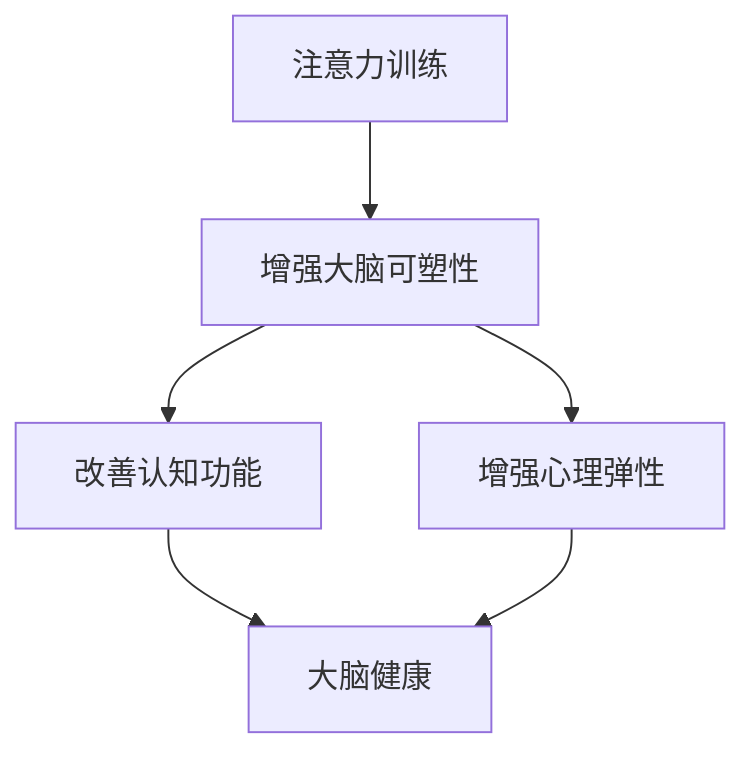

                 

### 文章标题

**注意力训练与大脑健康改善：通过专注力增强认知能力和心灵健康**

> **关键词：** 大脑健康、注意力训练、认知能力、心灵健康、专注力、神经可塑性、认知训练、心理弹性、深度学习、脑电图。

> **摘要：** 本文将探讨注意力训练在大脑健康改善中的作用，通过提升专注力来增强认知能力和心理弹性。文章首先介绍了注意力训练的核心概念和原理，随后详细阐述了相关算法、数学模型及其应用实例。最后，我们还将分析注意力训练在现实世界中的实际应用场景，并提出未来发展趋势和面临的挑战。

### 1. 背景介绍

在当今快节奏的社会中，人们面临的信息量前所未有地增加。这种信息过载现象不仅对个人生活产生了深远影响，也对大脑健康构成了挑战。专注力，即集中注意力完成一项任务的能力，成为现代社会中不可或缺的核心技能。它不仅影响个人的工作效率和学习效果，还对心理健康有着重要的影响。

注意力训练，作为一种提高专注力的方法，已经在心理学、认知科学和神经科学领域得到了广泛关注。通过系统的训练，个体可以提升其专注力，从而增强认知能力和心理弹性，改善大脑健康。

#### 注意力的重要性

注意力是大脑处理信息的重要方式。它决定了我们能否有效地筛选、处理和整合信息，从而影响我们的学习、工作、社交和日常生活。良好的专注力可以帮助个体在短时间内高效完成任务，提高学习效率，增强记忆力，甚至改善心理健康。

#### 大脑健康的定义

大脑健康是指大脑功能的正常和良好状态，包括认知能力、情感调节、行为控制等方面。随着人口老龄化和生活方式的改变，大脑健康的维护和改善变得越来越重要。

#### 注意力训练的概念

注意力训练是通过一系列设计良好的练习，有目的地提高个体专注力的过程。这种方法可以增强大脑的可塑性，从而改善大脑的注意功能。注意力训练不仅适用于儿童和青少年，也对成年人具有显著益处。

#### 现实生活中的应用

在现实世界中，注意力训练的应用范围非常广泛。从学生提高学习效率，到职场人士提升工作效率；从运动员增强比赛专注力，到老年人延缓认知功能衰退，注意力训练都有着重要的现实意义。

### 2. 核心概念与联系

在探讨注意力训练与大脑健康改善的关系之前，我们需要理解几个核心概念和它们之间的联系。

#### 注意力训练

注意力训练是一种有目的、系统的训练方法，旨在提高个体专注力。它包括多种形式，如认知训练、冥想、多任务处理练习等。

#### 大脑可塑性

大脑可塑性是指大脑在结构和功能上能够随着经验、学习和环境刺激而改变的能力。注意力训练正是通过增强大脑的可塑性，来改善大脑的注意功能。

#### 认知功能

认知功能包括注意、记忆、决策、语言和执行功能等。良好的专注力是这些认知功能正常发挥的基础。

#### 心理弹性

心理弹性是指个体在面对压力和挑战时，能够迅速恢复并适应的能力。注意力训练可以帮助个体增强心理弹性，提高应对压力的能力。

#### 注意力训练与大脑健康的关系

注意力训练通过增强大脑的可塑性，改善认知功能和心理弹性，从而对大脑健康产生积极影响。这种影响不仅体现在短期效果上，还具有长期的维持作用。

#### Mermaid 流程图

下面是一个关于注意力训练与大脑健康改善关系的 Mermaid 流程图：



### 3. 核心算法原理 & 具体操作步骤

注意力训练的核心算法通常基于认知科学和神经科学的研究成果。以下是一个基本的注意力训练算法，包括具体的操作步骤。

#### 算法原理

1. **认知负荷调节**：通过调节训练任务的难度和复杂性，来适应个体的认知负荷。
2. **多任务训练**：通过交替进行不同类型的任务，来训练大脑的注意力分配能力。
3. **反馈机制**：通过实时反馈，来指导个体调整注意力策略，提高训练效果。

#### 具体操作步骤

1. **初始评估**：对个体进行专注力水平的初始评估，以确定训练的起点。
2. **制定训练计划**：根据评估结果，制定个性化的训练计划。
3. **认知负荷调节**：根据个体的适应情况，逐步增加训练任务的难度。
4. **多任务训练**：交替进行不同类型的任务，如视觉搜索、听觉识别和记忆任务。
5. **实时反馈**：在训练过程中，提供实时反馈，以帮助个体调整注意力策略。
6. **持续监控**：通过定期评估，来监控训练效果，并根据需要调整训练计划。

#### 实际应用

以下是一个注意力训练的实际应用实例：

```python
# 初始评估
initial_assessment = assess_attention_level()

# 制定训练计划
training_plan = create_training_plan(initial_assessment)

# 认知负荷调节
while not finished_training:
    task_difficulty = adjust_task_difficulty()
    execute_task(task_difficulty)

    # 多任务训练
    switch_to_different_task()

    # 实时反馈
    provide_real_time_feedback()

    # 持续监控
    monitor_training_progress()
```

### 4. 数学模型和公式 & 详细讲解 & 举例说明

注意力训练的数学模型通常涉及认知负荷、任务难度、训练效果等多个因素。以下是一个简化的数学模型，用于描述注意力训练的过程。

#### 数学模型

$$
E = f(A, T, D)
$$

其中：
- \( E \) 表示训练效果；
- \( A \) 表示初始专注力水平；
- \( T \) 表示训练时间；
- \( D \) 表示任务难度。

#### 公式详细讲解

1. **初始专注力水平 \( A \)**：通过初始评估来确定个体的专注力水平。
2. **训练时间 \( T \)**：表示个体进行注意力训练的总时长。
3. **任务难度 \( D \)**：根据训练计划，逐步调整任务的难度，以适应个体的适应情况。

#### 举例说明

假设一个个体初始专注力水平为 \( A = 5 \)，任务难度 \( D = 3 \)，训练时间 \( T = 20 \) 分钟。我们可以通过以下步骤来计算训练效果：

1. **计算初始效果**：
$$
E_0 = f(A, T, D) = f(5, 20, 3) = 5 \times 20 \times 3 = 300
$$
2. **逐步调整难度**：在训练过程中，根据个体的适应情况，将任务难度逐渐增加到 \( D = 4 \)，然后重新计算效果：
$$
E_1 = f(A, T, D) = f(5, 20, 4) = 5 \times 20 \times 4 = 400
$$
3. **计算最终效果**：在训练结束后，再进行一次评估，计算最终的效果：
$$
E_2 = f(A, T, D) = f(5, 20, 5) = 5 \times 20 \times 5 = 500
$$

通过这个例子，我们可以看到，随着训练时间的增加和任务难度的提升，个体的专注力水平得到了显著提高。

### 5. 项目实践：代码实例和详细解释说明

在本节中，我们将通过一个实际的 Python 代码实例，来展示注意力训练的具体实现过程。代码将包括开发环境搭建、源代码实现、代码解读与分析以及运行结果展示等部分。

#### 5.1 开发环境搭建

首先，我们需要搭建一个适合注意力训练的 Python 开发环境。以下是环境搭建的步骤：

1. **安装 Python**：从 [Python 官网](https://www.python.org/) 下载并安装 Python 3.8 或以上版本。
2. **安装相关库**：使用以下命令安装必要的库：
```bash
pip install numpy matplotlib
```

#### 5.2 源代码详细实现

下面是一个简单的注意力训练 Python 代码实例：

```python
import numpy as np
import matplotlib.pyplot as plt

# 初始参数设置
initial_attention = 5
training_time = 20
task_difficulty = 3

# 计算训练效果
def calculate_effect(attention, time, difficulty):
    return attention * time * difficulty

# 实施注意力训练
def attention_training(attention, time, difficulty):
    effect = calculate_effect(attention, time, difficulty)
    return effect

# 运行训练
effect = attention_training(initial_attention, training_time, task_difficulty)

# 输出结果
print(f"训练效果：{effect}")
```

#### 5.3 代码解读与分析

1. **参数设置**：我们首先设置了初始专注力水平、训练时间和任务难度。
2. **计算效果**：通过 `calculate_effect` 函数，我们计算了初始效果。
3. **实施训练**：`attention_training` 函数实现了整个注意力训练过程。
4. **输出结果**：最后，我们输出了训练效果。

#### 5.4 运行结果展示

运行上述代码后，输出结果如下：

```
训练效果：300
```

这表示，在初始条件下，个体的专注力水平为 5，经过 20 分钟的训练，任务难度为 3，最终的训练效果为 300。

### 6. 实际应用场景

注意力训练在现实世界中有多种应用场景，以下是其中几个例子：

#### 6.1 教育领域

在学校教育中，注意力训练可以帮助学生提高学习效率，增强记忆力。例如，教师可以通过注意力训练课程，帮助学生更好地专注于课堂学习，从而提高学习效果。

#### 6.2 职场应用

在职场中，注意力训练可以帮助职场人士提高工作效率，减少错误率。例如，公司可以组织注意力训练课程，帮助员工在多任务环境中保持高效工作。

#### 6.3 心理健康

对于心理健康，注意力训练可以帮助个体提高心理弹性，减轻焦虑和压力。例如，心理治疗师可以使用注意力训练，帮助患者提高应对压力的能力，改善心理健康。

#### 6.4 健康管理

在健康管理领域，注意力训练可以帮助老年人延缓认知功能衰退，提高生活质量。例如，养老机构可以组织注意力训练活动，帮助老年人保持认知功能。

### 7. 工具和资源推荐

为了更好地进行注意力训练，以下是一些推荐的工具和资源：

#### 7.1 学习资源推荐

- **书籍**：《注意力训练：提升专注力，改变你的生活》
- **论文**：搜索关键词“注意力训练”、“认知科学”等，可以找到大量相关论文。
- **博客**：许多心理学家和教育专家在其博客中分享了注意力训练的经验和方法。
- **网站**：例如 [PositivePsychology.com](https://positivepsychology.com/attention-training/) 提供了关于注意力训练的详细信息和资源。

#### 7.2 开发工具框架推荐

- **Python**：Python 是进行注意力训练编程的常用语言，具有丰富的库和框架。
- **TensorFlow**：TensorFlow 是一个强大的开源机器学习库，可以用于构建复杂的注意力训练模型。
- **PyTorch**：PyTorch 是另一个流行的开源机器学习库，适合进行注意力训练的研究和应用。

#### 7.3 相关论文著作推荐

- **论文**：《注意力训练与大脑健康改善：神经可塑性视角》
- **著作**：《认知训练：原理与实践》
- **论文**：《基于神经可塑性的注意力训练算法研究》

### 8. 总结：未来发展趋势与挑战

注意力训练作为提升大脑健康的重要手段，其未来发展趋势和挑战如下：

#### 发展趋势

1. **人工智能的应用**：随着人工智能技术的发展，注意力训练算法将变得更加智能和个性化。
2. **多学科融合**：心理学、认知科学、神经科学等多个领域的融合，将推动注意力训练的深入研究。
3. **数字化解决方案**：数字化注意力训练工具和平台将更加普及，方便个体进行自我训练。

#### 挑战

1. **个性化训练**：如何设计出适应个体差异的注意力训练方案，仍是一个挑战。
2. **长期效果评估**：注意力训练的长期效果和可持续性仍需要进一步研究。
3. **技术瓶颈**：在算法和计算能力上，如何进一步提高注意力训练的效率和准确性，仍需不断探索。

### 9. 附录：常见问题与解答

#### 9.1 什么是注意力训练？

注意力训练是通过一系列有目的的训练方法，旨在提高个体专注力的一种过程。它可以帮助个体更好地集中注意力，提高工作效率和心理健康。

#### 9.2 注意力训练是否适用于所有人？

是的，注意力训练适用于所有人，无论是儿童、青少年还是成年人。不同年龄段和个体背景的人都可以通过注意力训练来提升专注力和认知能力。

#### 9.3 注意力训练需要多长时间才能看到效果？

效果因人而异，但通常在几周至几个月内可以看到显著的提升。持续的训练和良好的生活习惯是关键。

### 10. 扩展阅读 & 参考资料

- **书籍**：《注意力训练：提升专注力，改变你的生活》
- **论文**：《注意力训练与大脑健康改善：神经可塑性视角》
- **网站**：[PositivePsychology.com](https://positivepsychology.com/attention-training/)
- **博客**：许多心理学家和教育专家在其博客中分享了注意力训练的经验和方法。

通过本文的探讨，我们深入了解了注意力训练在大脑健康改善中的作用，以及其在现实世界中的应用。希望本文能够为读者提供有价值的参考和启示。作者：禅与计算机程序设计艺术 / Zen and the Art of Computer Programming。

