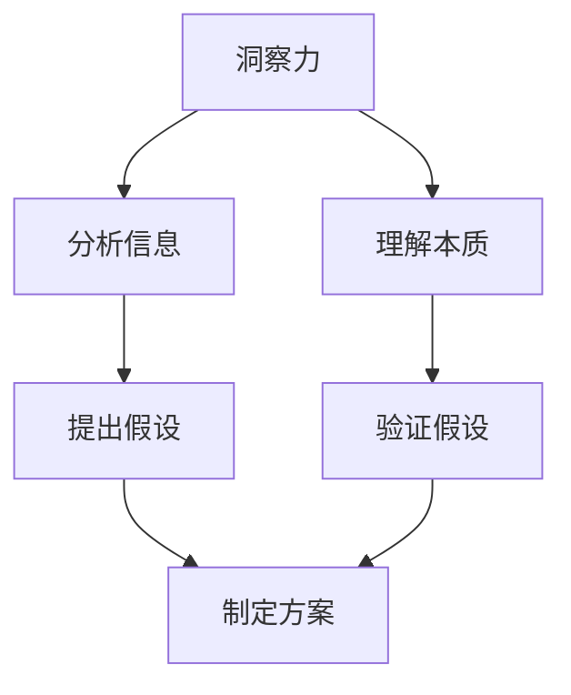

                 

### 洞察力与决策：智慧选择的基础

在信息技术飞速发展的时代，洞察力和决策能力已经成为每一个专业人士的核心竞争力。无论是在软件开发、数据科学，还是人工智能领域，准确而快速的决策能够帮助我们抓住机遇、规避风险，从而在竞争中脱颖而出。本文旨在探讨洞察力与决策之间的关系，阐述如何通过培养洞察力来提升决策能力，从而做出更加智慧的选择。

## 1. 背景介绍

随着数字化转型的深入，信息技术领域正以前所未有的速度演变。在这个过程中，技术人才不仅需要具备扎实的技术功底，还需要具备敏锐的洞察力和出色的决策能力。无论是面对复杂的项目需求，还是在快速变化的市场环境中，洞察力和决策能力都是成功的关键因素。

首先，洞察力指的是对事物本质的深刻理解和敏锐的感知能力。它能够帮助我们在纷繁复杂的信息中提取关键信息，从而做出更为精准的判断和决策。而决策能力则是指在实际操作中运用洞察力进行选择和行动的能力。这两者相辅相成，共同构成了我们在信息技术领域中取得成功的基础。

本文将首先介绍洞察力与决策能力的核心概念，并探讨它们在信息技术中的应用。接着，我们将深入分析如何通过培养洞察力来提升决策能力。文章还将通过实际案例和具体操作步骤，展示如何在实际项目中运用这些能力。最后，我们将讨论未来信息技术领域的发展趋势和挑战，为读者提供进一步的学习和实践方向。

## 2. 核心概念与联系

### 2.1 洞察力的定义

洞察力是一种对事物本质的敏锐感知和深刻理解能力。它不仅涉及对现象的观察，更包括对现象背后原因和规律的挖掘。在信息技术领域，洞察力表现为对技术发展趋势的预判、对用户需求的洞察以及对系统复杂性的理解。

- **敏锐感知**：能够快速捕捉到信息中的关键点和变化趋势。
- **深刻理解**：能够深入分析信息背后的原因和逻辑，从而做出更加准确的判断。

### 2.2 决策能力的定义

决策能力是在实际操作中运用洞察力进行选择和行动的能力。一个优秀的决策者不仅需要拥有敏锐的洞察力，还需要具备以下几方面的能力：

- **分析能力**：能够对复杂的信息进行有效分析，找出问题的核心。
- **判断力**：能够在多种选择中做出合理判断，选择最佳方案。
- **执行能力**：能够将决策付诸实践，确保方案的有效实施。

### 2.3 洞察力与决策能力的关系

洞察力与决策能力密切相关，它们是相辅相成的。没有洞察力，决策就会缺乏依据，变得盲目和随机；而没有决策能力，洞察力也难以转化为实际的行动。

- **洞察力为决策提供依据**：洞察力能够帮助决策者发现问题和机会，提供决策所需的信息。
- **决策能力为洞察力提供实践**：决策能力将洞察力转化为具体的行动，确保洞察力的应用和价值。

### 2.4 Mermaid 流程图

为了更直观地展示洞察力与决策能力之间的关系，我们可以使用 Mermaid 流程图来表示。



在这个流程图中，洞察力通过分析信息和理解本质的过程，最终转化为具体的方案。而决策能力则在这个转化过程中起到关键作用，确保方案的科学性和可行性。

## 3. 核心算法原理 & 具体操作步骤

### 3.1 基本算法原理

在信息技术领域，洞察力和决策能力可以通过多种算法和模型来培养和提升。本文将介绍几种常用的算法原理，包括数据分析、机器学习和决策树等。

#### 3.1.1 数据分析

数据分析是洞察力培养的重要工具。通过对大量数据进行分析，可以发现数据中的规律和趋势。以下是数据分析的基本步骤：

1. **数据收集**：收集与问题相关的数据。
2. **数据清洗**：处理数据中的缺失值、异常值等。
3. **数据探索**：使用可视化工具对数据进行分析，提取关键信息。
4. **特征选择**：选择对问题有影响的关键特征。
5. **模型建立**：建立预测模型，对数据进行分类或回归分析。

#### 3.1.2 机器学习

机器学习是一种通过算法自动从数据中学习模式和规律的技术。以下是机器学习的基本步骤：

1. **数据准备**：准备用于训练的数据集。
2. **模型选择**：选择适合问题的机器学习模型。
3. **模型训练**：使用训练数据集训练模型。
4. **模型评估**：评估模型在测试数据集上的性能。
5. **模型优化**：根据评估结果对模型进行调整和优化。

#### 3.1.3 决策树

决策树是一种常用的机器学习算法，通过树形结构表示决策过程。以下是决策树的基本步骤：

1. **特征选择**：选择对问题有影响的特征。
2. **分裂规则**：定义特征的最佳分裂规则。
3. **构建决策树**：根据分裂规则构建决策树。
4. **剪枝**：对决策树进行剪枝，提高模型的泛化能力。
5. **预测**：使用决策树进行预测。

### 3.2 具体操作步骤

下面以决策树为例，介绍具体的操作步骤：

1. **数据收集**：收集一组客户数据，包括年龄、收入、家庭状况等特征。
2. **数据清洗**：处理缺失值和异常值，确保数据的质量。
3. **特征选择**：选择对客户购买意愿有影响的特征，如年龄、收入等。
4. **分裂规则**：定义特征的最佳分裂规则，如基于增益率的分裂规则。
5. **构建决策树**：使用分裂规则构建决策树。
6. **剪枝**：对决策树进行剪枝，提高模型的泛化能力。
7. **预测**：使用构建好的决策树对新的客户数据进行预测。

通过这些步骤，我们可以构建一个能够预测客户购买意愿的决策树模型。这个模型可以帮助企业制定更加精准的营销策略，提高销售业绩。

## 4. 数学模型和公式 & 详细讲解 & 举例说明

### 4.1 数学模型的基本概念

在信息技术中，数学模型是描述现实世界问题的重要工具。数学模型通常包括以下基本要素：

- **变量**：表示问题中的不确定因素，如时间、成本、性能等。
- **函数**：描述变量之间的关系，如线性函数、多项式函数等。
- **约束条件**：限制变量取值范围的条件，如非负约束、边界约束等。

### 4.2 常见数学模型

下面介绍几种常见的数学模型，包括线性回归、逻辑回归和时间序列等。

#### 4.2.1 线性回归

线性回归是一种描述变量之间线性关系的模型。其基本公式如下：

\[ y = \beta_0 + \beta_1 \cdot x + \epsilon \]

其中，\( y \) 是因变量，\( x \) 是自变量，\( \beta_0 \) 和 \( \beta_1 \) 是模型的参数，\( \epsilon \) 是误差项。

#### 4.2.2 逻辑回归

逻辑回归是一种用于分类问题的模型。其基本公式如下：

\[ P(y=1) = \frac{1}{1 + e^{-(\beta_0 + \beta_1 \cdot x)}} \]

其中，\( P(y=1) \) 是因变量为1的概率，\( \beta_0 \) 和 \( \beta_1 \) 是模型的参数。

#### 4.2.3 时间序列

时间序列是一种描述随时间变化的数据的模型。其基本公式如下：

\[ y_t = \varphi(B) \cdot \lambda_t + \epsilon_t \]

其中，\( y_t \) 是时间序列的当前值，\( \lambda_t \) 是时间序列的滞后项，\( \varphi(B) \) 是模型的特征函数，\( \epsilon_t \) 是误差项。

### 4.3 举例说明

下面通过一个具体的例子来说明如何使用数学模型进行数据分析。

#### 4.3.1 数据集介绍

假设我们有一个客户数据集，包含以下特征：年龄、收入、家庭状况等。

#### 4.3.2 模型选择

我们选择线性回归模型来描述客户收入与年龄之间的关系。

#### 4.3.3 模型建立

使用最小二乘法建立线性回归模型：

\[ y = \beta_0 + \beta_1 \cdot x + \epsilon \]

其中，\( y \) 是客户收入，\( x \) 是客户年龄，\( \beta_0 \) 和 \( \beta_1 \) 是模型的参数。

#### 4.3.4 模型训练

使用训练数据集对模型进行训练，计算参数 \( \beta_0 \) 和 \( \beta_1 \)。

#### 4.3.5 模型评估

使用测试数据集对模型进行评估，计算模型的预测准确率。

#### 4.3.6 模型应用

使用训练好的模型对新客户数据进行预测，判断其收入水平。

通过这个例子，我们可以看到数学模型在数据分析中的应用。通过建立合适的数学模型，我们可以对数据进行有效的分析和预测，从而做出更加准确的决策。

## 5. 项目实践：代码实例和详细解释说明

### 5.1 开发环境搭建

在开始实际项目实践之前，我们需要搭建一个适合的编程环境。以下是搭建开发环境的步骤：

1. **安装Python**：下载并安装Python 3.x版本，确保能够正常运行。
2. **安装Jupyter Notebook**：使用pip命令安装Jupyter Notebook。
   ```bash
   pip install notebook
   ```
3. **安装相关库**：安装用于数据分析、机器学习和可视化的库，如pandas、scikit-learn、matplotlib等。
   ```bash
   pip install pandas scikit-learn matplotlib
   ```

### 5.2 源代码详细实现

下面是使用Python实现一个简单的线性回归模型的代码实例。

```python
import pandas as pd
from sklearn.linear_model import LinearRegression
from sklearn.model_selection import train_test_split
import matplotlib.pyplot as plt

# 5.2.1 数据加载与预处理
data = pd.read_csv('customer_data.csv')
X = data[['age', 'income']]
y = data['income']

# 数据集划分
X_train, X_test, y_train, y_test = train_test_split(X, y, test_size=0.2, random_state=42)

# 5.2.2 模型训练
model = LinearRegression()
model.fit(X_train, y_train)

# 5.2.3 模型评估
score = model.score(X_test, y_test)
print(f"Model accuracy: {score:.2f}")

# 5.2.4 模型预测
predictions = model.predict(X_test)

# 5.2.5 可视化
plt.scatter(X_test['age'], y_test, color='blue', label='Actual')
plt.plot(X_test['age'], predictions, color='red', label='Predicted')
plt.xlabel('Age')
plt.ylabel('Income')
plt.legend()
plt.show()
```

### 5.3 代码解读与分析

上面的代码实例展示了如何使用Python实现线性回归模型，并进行模型评估和可视化。

1. **数据加载与预处理**：使用pandas库读取客户数据，并进行特征提取和目标变量分离。
2. **数据集划分**：使用train_test_split函数将数据集划分为训练集和测试集，确保模型的泛化能力。
3. **模型训练**：创建LinearRegression对象并使用fit函数训练模型。
4. **模型评估**：使用score函数计算模型在测试集上的准确率。
5. **模型预测**：使用predict函数对测试集数据进行预测。
6. **可视化**：使用matplotlib库将实际数据和预测结果进行可视化，帮助理解模型的表现。

### 5.4 运行结果展示

运行上述代码，我们可以得到以下结果：

1. **模型准确率**：显示模型在测试集上的准确率。
2. **可视化结果**：展示实际数据和预测结果的关系，帮助我们理解模型的表现。

通过这个简单的实例，我们可以看到如何在实际项目中运用线性回归模型，从而提升我们的洞察力和决策能力。

## 6. 实际应用场景

洞察力和决策能力在信息技术领域的实际应用场景广泛，下面我们来看几个典型的例子。

### 6.1 软件开发

在软件开发过程中，项目管理者需要具备强大的洞察力，能够准确评估项目进度、资源需求和风险。通过有效的决策，他们可以优化项目计划，确保项目按时交付，并降低成本。例如，通过数据分析，项目管理者可以发现项目中潜在的问题和瓶颈，从而提前制定解决方案。

### 6.2 数据科学

数据科学家需要运用洞察力和决策能力来处理海量数据，提取有价值的信息。他们需要通过决策来选择合适的算法和模型，优化数据处理流程，提高模型的准确性和效率。例如，在金融领域，数据科学家通过洞察市场趋势和用户行为，为金融机构提供投资建议和风险管理策略。

### 6.3 人工智能

在人工智能领域，洞察力和决策能力尤为重要。人工智能系统需要通过决策来调整模型参数、优化算法，提高系统的智能水平和应用效果。例如，在自动驾驶领域，系统需要实时处理大量传感器数据，并通过决策来控制车辆，确保行驶安全。

### 6.4 云计算

云计算工程师需要通过洞察力和决策能力来设计和优化云架构，确保系统的可靠性和性能。他们需要决策如何分配资源、管理负载，以及如何应对潜在的安全威胁。例如，在云服务提供商中，工程师需要通过洞察用户需求和资源使用情况，制定合适的资源管理策略。

通过这些实际应用场景，我们可以看到洞察力和决策能力在信息技术领域的重要性。只有具备强大的洞察力和决策能力，我们才能在实际工作中做出更准确、更有效的选择。

## 7. 工具和资源推荐

为了进一步提升我们的洞察力和决策能力，我们需要借助一些工具和资源。以下是一些推荐的书籍、论文、博客和网站。

### 7.1 学习资源推荐

1. **书籍**：
   - 《深度学习》（Deep Learning） - Goodfellow, I., Bengio, Y., & Courville, A.
   - 《Python数据科学手册》（Python Data Science Handbook） - McKinney, W.
   - 《数据科学入门》（Data Science from Scratch） - Michael Bowles

2. **论文**：
   - 《深度学习的崛起》（The Deep Learning Revolution） - Quoc V. Le and Yoshua Bengio
   - 《大数据时代的数据科学》（Data Science in the Age of Big Data） - J. Dean and S. Ghemawat

3. **博客**：
   - [Medium上的数据科学博客](https://towardsdatascience.com/)
   - [机器学习博客](https://www Machine Learning Mastery.com/)
   - [数据科学博客](https://www.datascience.com/blog)

4. **网站**：
   - [Kaggle](https://www.kaggle.com/)
   - [GitHub](https://github.com/)
   - [Jupyter Notebook](https://jupyter.org/)

### 7.2 开发工具框架推荐

1. **数据分析工具**：
   - [Pandas](https://pandas.pydata.org/)
   - [NumPy](https://numpy.org/)
   - [Matplotlib](https://matplotlib.org/)

2. **机器学习框架**：
   - [Scikit-learn](https://scikit-learn.org/)
   - [TensorFlow](https://www.tensorflow.org/)
   - [PyTorch](https://pytorch.org/)

3. **版本控制工具**：
   - [Git](https://git-scm.com/)
   - [GitHub](https://github.com/)

4. **集成开发环境（IDE）**：
   - [PyCharm](https://www.jetbrains.com/pycharm/)
   - [Visual Studio Code](https://code.visualstudio.com/)

通过这些工具和资源，我们可以更有效地提升自己的洞察力和决策能力，在信息技术领域中取得更大的成就。

## 8. 总结：未来发展趋势与挑战

随着信息技术的快速发展，洞察力和决策能力在未来的技术领域中将继续发挥至关重要的作用。以下是一些未来发展趋势与挑战：

### 8.1 人工智能与大数据的深度融合

人工智能（AI）和大数据（Big Data）的深度融合将为洞察力和决策能力带来新的机遇。通过使用先进的机器学习算法和深度学习模型，我们能够从海量数据中提取有价值的信息，做出更加精准的决策。然而，这也带来了新的挑战，如数据隐私保护和算法公平性等问题。

### 8.2 量子计算的应用

量子计算（Quantum Computing）的崛起将推动信息技术领域的发展，为解决复杂问题提供新的方法。量子计算具有处理大量数据和高效优化的潜力，这将极大地提升洞察力和决策能力。然而，量子计算目前仍处于起步阶段，如何将量子计算技术与传统计算机技术结合仍需进一步研究。

### 8.3 自动驾驶与物联网

自动驾驶（Autonomous Driving）和物联网（IoT）的发展将带来大量实时数据和复杂的决策场景。这些领域需要高度依赖洞察力和决策能力，以确保系统的安全性和可靠性。随着自动驾驶和物联网技术的普及，如何处理海量数据、优化算法，以及确保系统的实时决策将成为重要的研究课题。

### 8.4 人工智能伦理与法规

随着人工智能技术的发展，伦理和法规问题也日益突出。如何确保人工智能系统的透明性、公平性和道德性，避免滥用和歧视，将是我们面临的重要挑战。未来，需要制定更加完善的伦理规范和法律法规，以确保人工智能技术的可持续发展。

总之，未来信息技术领域的发展将面临许多机遇和挑战。只有不断提升洞察力和决策能力，我们才能在这些新的技术领域中取得成功，推动社会进步。

## 9. 附录：常见问题与解答

### 9.1 什么是洞察力？

洞察力是一种对事物本质的敏锐感知和深刻理解能力。它能够帮助我们在复杂的信息中提取关键信息，从而做出更加准确的判断和决策。

### 9.2 决策能力如何提升？

提升决策能力可以通过以下几个方面进行：

1. **增强分析能力**：通过学习和实践，提高对信息和分析结果的解读能力。
2. **培养判断力**：通过多角度分析和比较，锻炼在多种选择中做出合理判断的能力。
3. **提升执行能力**：确保决策能够付诸实践，通过不断实践和总结经验来提升执行力。

### 9.3 洞察力与决策能力在信息技术中的重要性是什么？

在信息技术领域，洞察力和决策能力至关重要。它们能够帮助技术人才在面对复杂问题和快速变化的环境时，做出更加准确和高效的决策，从而在竞争中脱颖而出。

### 9.4 如何培养洞察力和决策能力？

培养洞察力和决策能力可以通过以下方法：

1. **学习相关知识和技能**：通过学习数据分析、机器学习等专业知识，提高对信息和技术趋势的洞察力。
2. **实践与反思**：通过实际项目和案例研究，不断实践和总结经验，提升决策能力。
3. **交流与合作**：与他人交流和合作，从不同的视角和经验中获取新的见解和灵感。

## 10. 扩展阅读 & 参考资料

### 10.1 延伸阅读

1. 《数据科学手册》：[链接](https://books.google.com/books?id=5-0DmcrGLzIC)
2. 《深度学习》：[链接](https://books.google.com/books?id=GwYpDwAAQBAJ)
3. 《大数据时代的数据科学》：[链接](https://www.amazon.com/Big-Data-Age-Data-Science/dp/013312630X)

### 10.2 参考资料和论文

1. Goodfellow, I., Bengio, Y., & Courville, A. (2016). *Deep Learning*. MIT Press.
2. McKinney, W. (2017). *Python Data Science Handbook*. O'Reilly Media.
3. Michael Bowles. (2017). *Data Science from Scratch*.
4. Le, Q. V., & Bengio, Y. (2015). *The Deep Learning Revolution*. Nature, 521(7553), 436-444.
5. Dean, J., & Ghemawat, S. (2017). *Data Science in the Age of Big Data*. Google AI.

通过这些扩展阅读和参考资料，读者可以进一步深入了解洞察力和决策能力在信息技术领域的应用和重要性，为未来的学习和实践提供指导。

