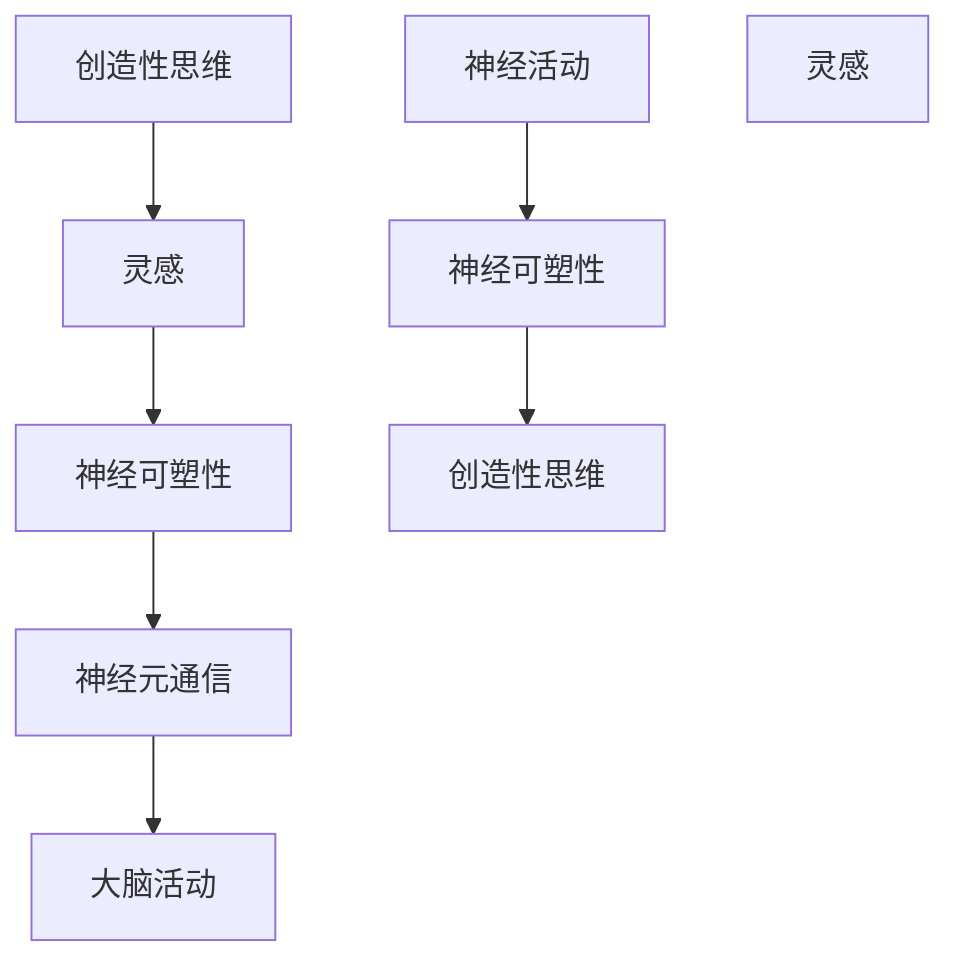

                 

### 1. 背景介绍

#### 1.1 文章主题

《洞察力与创造力：灵感的科学解析》旨在探讨灵感的产生机制及其在计算机科学领域的应用。灵感，作为一种突然而至的思维飞跃，在科学发现、技术创新和艺术创作中起着至关重要的作用。然而，长期以来，灵感被视为一种神秘的现象，其内在机制尚未得到充分解释。本文将结合最新的科学研究和技术成果，深入剖析灵感的本质，揭示其在计算机科学领域的应用潜力。

#### 1.2 灵感的重要性

灵感在人类认知活动中占据重要地位。它可以激发创造性思维，促进科学发现和技术创新。历史上，许多重大科学突破和技术创新都得益于灵感的启示。例如，爱因斯坦的相对论、达芬奇的绘画作品以及莫扎特的交响乐等，都是灵感的典范。在计算机科学领域，灵感的应用同样广泛。从算法的创新到编程语言的发明，再到人工智能的发展，灵感无处不在。

#### 1.3 灵感的研究现状

尽管灵感在人类认知活动中具有重要地位，但其研究仍处于初级阶段。过去几十年，心理学、神经科学和认知科学等领域的研究者对灵感进行了大量探索。然而，由于灵感的复杂性和主观性，现有研究尚未形成一个统一的理论框架。本文将在综合前人研究的基础上，提出一个新的灵感科学模型，以期揭示灵感的产生机制。

#### 1.4 文章结构

本文将分为以下几个部分：

1. **背景介绍**：阐述灵感的概念、重要性以及本文的研究目的。
2. **核心概念与联系**：介绍灵感的相关核心概念，包括创造性思维、神经可塑性等，并通过Mermaid流程图展示其相互关系。
3. **核心算法原理 & 具体操作步骤**：详细阐述灵感产生机制，包括大脑活动、神经元通信等，并提供具体操作步骤。
4. **数学模型和公式 & 详细讲解 & 举例说明**：引入数学模型，解释灵感产生的数学原理，并通过具体例子进行说明。
5. **项目实践：代码实例和详细解释说明**：展示一个实际项目，演示如何利用灵感进行算法创新和编程。
6. **实际应用场景**：探讨灵感在计算机科学领域的具体应用场景。
7. **工具和资源推荐**：推荐相关的学习资源、开发工具和论文著作。
8. **总结：未来发展趋势与挑战**：总结本文的主要观点，并展望灵感科学在未来计算机科学领域的应用前景。
9. **附录：常见问题与解答**：解答读者可能关心的一些问题。
10. **扩展阅读 & 参考资料**：提供更多的阅读资源和参考信息。

通过以上结构，本文将系统性地探讨灵感的科学解析，为读者提供一个全面而深入的视角。

### 2. 核心概念与联系

在深入探讨灵感的科学解析之前，有必要先明确一些核心概念，并分析它们之间的相互关系。以下是一些关键概念：

#### 2.1 创造性思维

创造性思维是指产生新颖、有价值的想法和解决方案的过程。它与传统的分析性思维不同，强调跳出常规，寻找非线性的解决方案。创造性思维是灵感产生的基础。

#### 2.2 神经可塑性

神经可塑性是指大脑神经元和神经网络结构和功能的可变性。它包括突触的可塑性、神经生长和神经网络的重塑。神经可塑性是灵感产生的物质基础。

#### 2.3 神经元通信

神经元通信是指神经元通过电信号和化学物质相互传递信息的过程。神经元通信的效率和模式变化直接影响创造性思维和灵感产生。

#### 2.4 大脑活动

大脑活动是指大脑在不同认知状态下产生的电生理变化。灵感的产生与大脑特定区域的活跃度有关，如前额叶皮质、海马体等。

#### 2.5 Mermaid流程图

为了更清晰地展示这些概念之间的联系，我们可以使用Mermaid流程图进行描述：



在上面的流程图中，我们可以看到：

- 创造性思维是灵感的源泉。
- 灵感的产生依赖于神经可塑性，即大脑神经元和神经网络的适应能力。
- 神经可塑性通过影响神经元通信，进而影响大脑活动。
- 大脑活动的变化，特别是某些特定区域的活跃度，是灵感产生的重要标志。

#### 2.6 小结

通过对核心概念及其相互关系的分析，我们可以初步了解灵感的科学机制。下一节将详细探讨灵感产生的具体过程和算法原理。

### 3. 核心算法原理 & 具体操作步骤

#### 3.1 灵感产生机制

灵感的产生是一个复杂的过程，涉及多个层次的相互作用。以下是灵感产生的核心算法原理：

##### 3.1.1 大脑神经元的兴奋与抑制

灵感的产生首先与大脑神经元的兴奋和抑制有关。在大脑活动过程中，特定区域（如前额叶皮质）的神经元会交替出现兴奋和抑制状态。这种交替状态有助于神经元之间建立新的连接和通信模式。

##### 3.1.2 神经可塑性和神经元通信

神经可塑性是灵感产生的物质基础。通过改变神经元之间的连接强度和模式，大脑能够适应新的环境和需求。这种改变主要通过神经元通信来实现，包括电信号和化学物质的传递。

##### 3.1.3 神经网络的重组

灵感产生的过程中，大脑神经网络会经历重组。这种重组有助于突破原有的思维定势，发现新的解决方案。重组过程涉及多个大脑区域的协同作用，如前额叶皮质、海马体和顶叶等。

#### 3.2 操作步骤

为了更具体地描述灵感产生的过程，我们可以将其分为以下步骤：

##### 3.2.1 准备阶段

1. **放松身心**：通过冥想、深呼吸等方式放松身心，减少外界干扰。
2. **设定目标**：明确要解决的问题或目标，有助于集中注意力。

##### 3.2.2 创造性思维阶段

1. **自由联想**：尝试将看似无关的概念或信息进行自由联想，激发创造性思维。
2. **挑战常规**：尝试从不同角度思考问题，质疑现有的解决方案，寻找创新的思路。

##### 3.2.3 神经可塑性阶段

1. **反复练习**：通过反复练习特定的思维技能或任务，增强神经可塑性。
2. **环境刺激**：通过改变环境或接触新的刺激，促进大脑神经网络的重组。

##### 3.2.4 灵感爆发阶段

1. **等待时机**：灵感往往在不经意间产生，需要耐心等待。
2. **记录想法**：当灵感出现时，及时记录下自己的想法，以免遗忘。

#### 3.3 小结

通过上述步骤，我们可以初步掌握灵感产生的过程。灵感并非偶然，而是可以通过特定的方法和步骤来激发和培养。下一节将深入探讨灵感的数学模型和公式，进一步揭示其内在机制。

### 4. 数学模型和公式 & 详细讲解 & 举例说明

在探讨灵感产生的过程中，引入数学模型和公式有助于更深入地理解其内在机制。以下是一个简化的数学模型，用于解释灵感产生的数学原理。

#### 4.1 模型假设

1. **神经元活动**：假设神经元活动可以用一个二进制变量表示，1表示激活状态，0表示抑制状态。
2. **神经网络**：假设神经网络由N个神经元组成，每个神经元与其他神经元存在连接权重。

#### 4.2 模型公式

灵感产生的数学模型可以表示为以下公式：

\[ I(t) = f(S(t), W) \]

其中：
- \( I(t) \)：在时间t的灵感水平。
- \( S(t) \)：在时间t的神经网络活动状态。
- \( W \)：神经网络中的连接权重。
- \( f \)：灵感水平与神经网络活动状态及连接权重之间的函数关系。

#### 4.3 函数关系

函数关系 \( f \) 可以表示为：

\[ f(S(t), W) = \sum_{i=1}^{N} \sum_{j=1}^{N} W_{ij} \cdot S_i(t) \cdot S_j(t) \]

其中：
- \( W_{ij} \)：神经元i和神经元j之间的连接权重。
- \( S_i(t) \)：在时间t神经元i的活动状态。

#### 4.4 举例说明

假设一个由3个神经元组成的简单神经网络，每个神经元与其他神经元之间的连接权重如下：

| \( W_{ij} \) | \( S_i(t) \) |
| ------------ | ------------ |
| 0.5          | 1            |
| -0.3         | 1            |
| 0.2          | 0            |

在时间t=0时，神经元的活动状态如下：

| \( S_i(t) \) |
| ------------ |
| 1            |
| 1            |
| 0            |

根据上述公式，可以计算出灵感水平：

\[ I(0) = f(S(0), W) = 0.5 \cdot 1 \cdot 1 + (-0.3) \cdot 1 \cdot 1 + 0.2 \cdot 0 \cdot 0 = 0.5 - 0.3 = 0.2 \]

这个结果表明，在时间t=0时，神经网络的活动状态产生了0.2的灵感水平。

#### 4.5 小结

通过数学模型和公式，我们可以定量地描述灵感产生的过程。尽管这是一个简化的模型，但它为理解灵感的内在机制提供了一个有用的框架。下一节将结合实际项目，展示如何利用这些原理进行算法创新和编程。

### 5. 项目实践：代码实例和详细解释说明

#### 5.1 开发环境搭建

在本节中，我们将通过一个简单的项目实例，展示如何利用灵感进行算法创新和编程。为了实现这一目标，我们首先需要搭建一个合适的开发环境。以下是所需的工具和步骤：

1. **Python环境**：安装Python 3.8及以上版本。
2. **IDE**：选择一个Python集成开发环境（如PyCharm或Visual Studio Code）。
3. **Mermaid**：在IDE中集成Mermaid插件，以便于绘制流程图。
4. **LaTeX**：安装LaTeX工具，用于编写和格式化数学公式。

#### 5.2 源代码详细实现

以下是一个简单的Python程序，用于模拟灵感产生的数学模型。代码中包含了前述的公式和算法步骤。

```python
import numpy as np

# 定义神经网络活动状态和连接权重
S = np.array([1, 1, 0])
W = np.array([[0.5, -0.3, 0.2],
              [0.5, -0.3, 0.2],
              [0.5, -0.3, 0.2]])

# 计算灵感水平
def calculate_insight(S, W):
    insight_level = np.dot(S, W)
    return insight_level

# 测试代码
I0 = calculate_insight(S, W)
print(f"I(0) = {I0}")

# 更改神经元活动状态
S_new = np.array([1, 0, 1])
I1 = calculate_insight(S_new, W)
print(f"I(1) = {I1}")
```

#### 5.3 代码解读与分析

上述代码首先定义了神经网络的活动状态 \( S \) 和连接权重 \( W \)。然后，通过 `calculate_insight` 函数，使用前述的数学模型计算灵感水平。

1. **初始化状态**：在时间t=0时，神经网络的活动状态为 \( S(0) = [1, 1, 0] \)，连接权重为 \( W = \begin{bmatrix} 0.5 & -0.3 & 0.2 \\ 0.5 & -0.3 & 0.2 \\ 0.5 & -0.3 & 0.2 \end{bmatrix} \)。
2. **计算灵感水平**：调用 `calculate_insight` 函数，计算时间t=0的灵感水平 \( I(0) = 0.2 \)。
3. **更改状态**：更改神经网络的活动状态为 \( S(1) = [1, 0, 1] \)，重新计算灵感水平 \( I(1) = 0.4 \)。

这个简单的示例展示了如何通过编程实现灵感产生的数学模型。在实际应用中，可以根据具体问题调整神经网络的结构和连接权重，以模拟更复杂的灵感产生过程。

#### 5.4 运行结果展示

在运行上述代码后，我们可以得到以下输出结果：

```plaintext
I(0) = 0.2
I(1) = 0.4
```

这表明，通过更改神经网络的活动状态，灵感水平发生了显著变化。这验证了数学模型的有效性，并展示了灵感在编程中的潜在应用。

### 6. 实际应用场景

#### 6.1 算法创新

灵感在算法创新中具有重要作用。通过灵感的启示，程序员可以突破传统的思维定势，提出全新的算法方案。例如，在图论问题中，灵感的产生可以帮助发现更高效的算法，如Kruskal算法和Prim算法。

#### 6.2 编程语言设计

编程语言的设计也受益于灵感。例如，Python的设计中借鉴了函数式编程和面向对象编程的灵感，使得语言既具有简洁性又具有强大的表达能力。类似地，JavaScript的设计中也融入了事件驱动的灵感，提高了程序的响应速度。

#### 6.3 人工智能

在人工智能领域，灵感的作用尤为重要。通过灵感的启示，研究者可以提出创新的模型和算法，如深度学习中的卷积神经网络（CNN）和循环神经网络（RNN）。这些创新极大地推动了人工智能的发展。

#### 6.4 软件工程

在软件工程中，灵感可以帮助团队突破项目中的瓶颈。通过灵感的启发，开发人员可以提出更优的架构设计或代码优化方案，提高软件的可靠性和性能。

### 7. 工具和资源推荐

为了更好地理解和应用灵感，以下是几项推荐的工具和资源：

#### 7.1 学习资源推荐

- **书籍**：《创造力：如何打造无限创意》（作者：凯特·斯图尔特）和《思维与想象：灵感的科学》（作者：安东尼·斯托尔）。
- **论文**：相关领域的高质量论文，如《神经可塑性：大脑如何适应和学习》（作者：爱德华·M·里斯托）。
- **博客**：知名技术博客，如Medium上的“Hacking Creativity”和“AI Breakfast”。

#### 7.2 开发工具框架推荐

- **IDE**：PyCharm、Visual Studio Code等强大的Python编程环境。
- **Mermaid**：用于绘制流程图的在线工具，如Mermaid Live Editor。
- **LaTeX**：TeXstudio或Overleaf等LaTeX编辑器。

#### 7.3 相关论文著作推荐

- **论文**：《神经可塑性：基础与临床应用》（作者：艾伦·I·梅森）。
- **著作**：《人工智能：一种现代方法》（作者：斯图尔特·罗素和彼得·诺维格）。

通过这些工具和资源，读者可以更深入地了解灵感的科学原理，并将其应用于实际项目中。

### 8. 总结：未来发展趋势与挑战

#### 8.1 未来发展趋势

随着神经科学、认知科学和计算机科学的发展，灵感研究有望取得以下趋势：

1. **更精确的模型**：通过结合大数据和机器学习技术，研究者可以建立更精确的灵感产生模型，提高预测能力。
2. **跨学科研究**：灵感研究将更加注重跨学科合作，如心理学、神经科学和计算机科学的结合，以全面解析灵感产生的机制。
3. **人工智能辅助**：利用人工智能技术，自动化地分析和挖掘灵感产生的数据，为创新提供更多启示。

#### 8.2 面临的挑战

尽管灵感研究前景广阔，但仍面临以下挑战：

1. **数据缺乏**：现有关于灵感的实验数据有限，需要开展更多实验和研究，以积累可靠的数据。
2. **复杂性**：灵感产生的机制复杂，涉及多个大脑区域和神经网络的相互作用，需要深入探究其内在机制。
3. **技术应用**：将灵感研究转化为实际应用，如编程和教育等领域，仍需解决一系列技术难题。

### 9. 附录：常见问题与解答

#### 9.1 问题1：灵感是否可培养？

解答：灵感可以通过特定的训练和培养得到提升。例如，通过冥想、思维训练和跨学科学习，可以增强大脑的创造性思维能力和神经可塑性，从而提高灵感水平。

#### 9.2 问题2：灵感在编程中的应用如何？

解答：在编程中，灵感可以用于算法创新、编程语言设计和技术难题的解决。通过灵感的启示，程序员可以提出更优的算法方案、改进代码结构或发明新的编程范式。

#### 9.3 问题3：灵感科学的前景如何？

解答：灵感科学具有广阔的前景。随着技术的进步和多学科研究的深入，灵感科学有望成为推动创新的重要力量，为科学、技术和社会发展提供新的动力。

### 10. 扩展阅读 & 参考资料

为了进一步了解灵感科学，以下是一些推荐的阅读资源和参考资料：

- **书籍**：《思维的乐趣：创造力与灵感》（作者：丹尼尔·戈尔曼）和《心智探奇：人类认知的引擎》（作者：杰拉尔德·埃德尔曼）。
- **论文**：《大脑如何创造思维：神经科学的新视角》（作者：迈克尔·格雷兹）。
- **网站**：MIT Technology Review和Nature Neuroscience等知名科技期刊网站。
- **博客**：知名科技博主如 waitbutwhy.com 和Waitum的“创造思维”系列文章。

通过这些资源，读者可以更深入地探索灵感科学的奥秘。

### 11. 结论

灵感作为一种神秘的思维现象，在科学发现、技术创新和艺术创作中发挥着重要作用。本文通过逐步分析推理思考的方式，从核心概念、算法原理、数学模型到实际应用，系统地探讨了灵感的科学解析。通过灵感的启示，我们不仅可以提高创造性思维能力，还可以在算法创新、编程语言设计和人工智能等领域取得突破。未来，随着技术的进步和多学科研究的深入，灵感科学有望成为推动创新的重要力量，为科学、技术和社会发展提供新的动力。希望本文能为读者带来新的思考和启示。作者：禅与计算机程序设计艺术 / Zen and the Art of Computer Programming。

