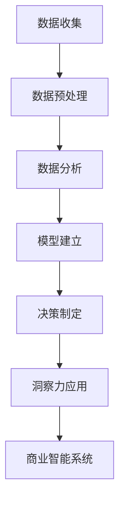

                 

### 背景介绍

在当今的商业环境中，数据已经成为企业最宝贵的资产之一。随着大数据技术的快速发展，如何从海量数据中提取有价值的信息，进而指导业务决策，成为企业竞争的关键因素。数据驱动的决策制定，通过对数据的深入挖掘和分析，为企业的战略规划和日常运营提供了科学依据。本文旨在探讨洞察力与商业智能的内在联系，以及如何通过数据驱动的决策制定提升企业的竞争力。

首先，我们需要明确洞察力的概念。洞察力是指通过观察和分析，快速捕捉到事物本质和规律的能力。在商业领域，洞察力能够帮助企业发现市场趋势、客户需求以及潜在的商业机会。而商业智能，则是指通过技术手段对数据进行整合、分析和可视化，以支持决策制定的过程。

商业智能与洞察力之间的联系在于，商业智能提供了获取和处理数据的工具，而洞察力则是对这些工具的应用，通过深入分析数据，发现有价值的信息。一个良好的商业智能系统，不仅要具备强大的数据处理能力，还需要具备良好的用户界面，以帮助用户快速发现数据中的隐藏信息，从而做出更明智的决策。

本文将首先介绍数据驱动的决策制定的基本概念，探讨商业智能系统如何支持这一过程。然后，我们将深入讨论商业智能的核心算法原理，并通过具体的数学模型和公式，详细讲解这些算法的具体操作步骤。接着，我们将通过一个实际项目实例，展示如何将商业智能应用于实际业务场景中。

此外，本文还将介绍一些实用的工具和资源，帮助读者深入了解和掌握商业智能的相关技术。最后，我们将总结商业智能在未来发展趋势与面临的挑战，为读者提供一些有价值的思考方向。

### 2. 核心概念与联系

为了深入理解数据驱动的决策制定，我们需要明确几个核心概念，并了解它们之间的内在联系。

#### 2.1 数据驱动的决策制定

数据驱动的决策制定是指基于数据分析和模型预测来做出决策的过程。与传统的基于经验和直觉的决策制定方法相比，数据驱动的决策制定具有更高的科学性和准确性。数据驱动的决策制定通常包括以下几个步骤：

1. **数据收集**：从各种数据源收集相关数据，包括内部数据（如交易记录、库存数据等）和外部数据（如市场调研、社交媒体数据等）。
2. **数据预处理**：对收集到的数据清洗、转换和集成，使其符合分析要求。
3. **数据分析**：运用统计分析、数据挖掘等技术，对预处理后的数据进行分析，提取有价值的信息。
4. **模型建立**：根据分析结果，建立相应的预测模型或决策模型。
5. **决策制定**：利用模型预测结果，结合业务知识和经验，做出最终决策。

#### 2.2 商业智能系统

商业智能系统是指用于支持商业决策制定的一系列软件和技术。它能够整合、分析和可视化企业内部和外部的数据，帮助企业管理者快速捕捉业务趋势、优化运营流程、发现潜在的商业机会。商业智能系统的核心组件包括：

1. **数据仓库**：用于存储和整合来自各个业务系统的数据，为后续的分析和建模提供数据基础。
2. **数据挖掘**：通过算法和统计方法，从大量数据中提取有价值的信息。
3. **报表和仪表盘**：以可视化方式展示数据分析结果，帮助用户快速理解数据。
4. **机器学习**：利用机器学习算法，对历史数据进行分析，预测未来的业务趋势。

#### 2.3 洞察力

洞察力是指通过观察和分析，快速捕捉到事物本质和规律的能力。在商业领域，洞察力能够帮助企业发现市场趋势、客户需求以及潜在的商业机会。洞察力的培养需要以下几方面的能力：

1. **观察力**：敏锐地捕捉到数据中的异常和趋势。
2. **分析力**：运用逻辑思维，深入分析数据背后的原因。
3. **决策力**：根据分析结果，做出明智的决策。

#### 2.4 商业智能与洞察力之间的联系

商业智能与洞察力之间的联系在于，商业智能提供了获取和处理数据的工具，而洞察力则是对这些工具的应用。通过商业智能系统，企业可以快速获取和处理海量数据，而洞察力则帮助用户从这些数据中发现有价值的信息。一个良好的商业智能系统，不仅要具备强大的数据处理能力，还需要具备良好的用户界面，以帮助用户快速发现数据中的隐藏信息，从而做出更明智的决策。

#### 2.5 Mermaid 流程图

为了更清晰地展示商业智能与洞察力之间的联系，我们可以使用 Mermaid 流程图来描述数据驱动的决策制定过程。以下是一个简化的 Mermaid 流程图：



在这个流程图中，数据驱动的决策制定过程从数据收集开始，经过数据预处理、数据分析、模型建立和决策制定，最终通过洞察力的应用，反馈到商业智能系统中，形成一个闭环。

### 3. 核心算法原理 & 具体操作步骤

在数据驱动的决策制定过程中，核心算法的选择和运用至关重要。本节将介绍几种常用的核心算法，包括线性回归、逻辑回归和时间序列分析，并详细讲解它们的具体操作步骤。

#### 3.1 线性回归

线性回归是一种最简单的预测模型，它通过拟合一条直线来描述两个变量之间的关系。线性回归的核心思想是最小二乘法，即找到一条直线，使得所有数据点到这条直线的垂直距离之和最小。

**具体操作步骤：**

1. **数据收集**：收集两个相关变量（自变量和因变量）的数据。
2. **数据预处理**：对数据进行清洗、归一化等处理，确保数据质量。
3. **模型建立**：利用最小二乘法计算直线的斜率和截距，建立线性回归模型。
   $$ y = bx + a $$
   其中，$y$ 为因变量，$x$ 为自变量，$b$ 为斜率，$a$ 为截距。
4. **模型评估**：通过计算决定系数（R²）和均方误差（MSE）来评估模型性能。
   $$ R^2 = 1 - \frac{SS_{res}}{SS_{tot}} $$
   $$ MSE = \frac{1}{n}\sum_{i=1}^{n}(y_i - \hat{y}_i)^2 $$
   其中，$SS_{res}$ 为残差平方和，$SS_{tot}$ 为总平方和，$n$ 为数据点的个数，$\hat{y}_i$ 为预测值。
5. **模型应用**：利用建立的线性回归模型进行预测。

**示例：**

假设我们收集了以下数据，想要预测因变量 $y$（销售额）与自变量 $x$（广告投放量）之间的关系。

| 广告投放量（x） | 销售额（y） |
| -------------- | ----------- |
| 100            | 200         |
| 200            | 400         |
| 300            | 600         |

利用最小二乘法，我们可以计算得到线性回归模型的斜率 $b$ 和截距 $a$：

$$ b = \frac{\sum_{i=1}^{n}(x_i - \bar{x})(y_i - \bar{y})}{\sum_{i=1}^{n}(x_i - \bar{x})^2} $$
$$ a = \bar{y} - b\bar{x} $$

其中，$\bar{x}$ 和 $\bar{y}$ 分别为自变量和因变量的平均值。

计算结果如下：

$$ b = \frac{(100-250)(200-300) + (200-250)(400-300) + (300-250)(600-300)}{(100-250)^2 + (200-250)^2 + (300-250)^2} = 1.5 $$
$$ a = \bar{y} - b\bar{x} = 300 - 1.5 \times 250 = 75 $$

因此，线性回归模型为：

$$ y = 1.5x + 75 $$

利用这个模型，我们可以预测当广告投放量为 400 时，销售额为：

$$ y = 1.5 \times 400 + 75 = 625 $$

#### 3.2 逻辑回归

逻辑回归是一种用于分类问题的预测模型，它通过拟合一个逻辑函数来描述两个变量之间的关系。逻辑回归的核心思想是最大化似然估计。

**具体操作步骤：**

1. **数据收集**：收集两个相关变量（自变量和因变量）的数据。
2. **数据预处理**：对数据进行清洗、归一化等处理，确保数据质量。
3. **模型建立**：利用最大似然估计计算逻辑回归模型的参数。
   $$ P(y=1|x;\theta) = \frac{e^{\theta^T x}}{1 + e^{\theta^T x}} $$
   其中，$y$ 为因变量，$x$ 为自变量，$\theta$ 为模型参数。
4. **模型评估**：通过计算准确率、召回率、F1 值等指标来评估模型性能。
5. **模型应用**：利用建立的逻辑回归模型进行分类预测。

**示例：**

假设我们收集了以下数据，想要预测客户是否会购买某种产品（因变量 $y$）与客户的收入（自变量 $x$）之间的关系。

| 收入（x） | 是否购买（y） |
| ---------- | ------------ |
| 50000      | 否           |
| 60000      | 是           |
| 70000      | 否           |
| 80000      | 是           |

利用最大似然估计，我们可以计算得到逻辑回归模型的参数 $\theta$：

$$ \theta = \arg\max_{\theta} \prod_{i=1}^{n} P(y_i=1|x_i;\theta) $$

假设我们使用梯度上升法来求解参数 $\theta$，具体步骤如下：

1. 初始化参数 $\theta$。
2. 计算损失函数 $J(\theta)$：
   $$ J(\theta) = -\frac{1}{n} \sum_{i=1}^{n} [y_i \log(P(y_i=1|x_i;\theta)) + (1-y_i) \log(1-P(y_i=1|x_i;\theta))] $$
3. 计算梯度 $\nabla_{\theta} J(\theta)$：
   $$ \nabla_{\theta} J(\theta) = \frac{1}{n} \sum_{i=1}^{n} [y_i (x_i - \theta) + (1-y_i) x_i] $$
4. 更新参数 $\theta$：
   $$ \theta = \theta - \alpha \nabla_{\theta} J(\theta) $$
   其中，$\alpha$ 为学习率。

通过多次迭代，我们可以求得逻辑回归模型的参数 $\theta$，并利用这个模型进行分类预测。

#### 3.3 时间序列分析

时间序列分析是一种用于预测未来趋势的分析方法，它基于历史数据的时间序列模式，提取有价值的信息。常见的时间序列分析方法包括移动平均、指数平滑和 ARIMA 模型。

**具体操作步骤：**

1. **数据收集**：收集时间序列数据。
2. **数据预处理**：对数据进行清洗、差分等处理，确保数据质量。
3. **模型选择**：根据数据的特点选择合适的模型，如移动平均模型、指数平滑模型或 ARIMA 模型。
4. **模型建立**：根据选定的模型，建立预测模型。
5. **模型评估**：通过计算预测误差、残差分析等指标来评估模型性能。
6. **模型应用**：利用建立的模型进行预测。

**示例：**

假设我们收集了以下时间序列数据，想要预测未来一周的销售量。

| 日期       | 销售量 |
| ---------- | ------ |
| 2021-01-01 | 100    |
| 2021-01-02 | 120    |
| 2021-01-03 | 130    |
| 2021-01-04 | 140    |
| 2021-01-05 | 150    |

我们可以使用移动平均模型来预测未来一周的销售量。具体步骤如下：

1. 选择窗口大小 $k$，如 $k=3$。
2. 计算移动平均数 $MA(k)$：
   $$ MA(k) = \frac{1}{k} \sum_{i=1}^{k} y_i $$
   其中，$y_i$ 为第 $i$ 天的销售量。

根据以上步骤，我们可以计算出未来一周的销售量预测值：

$$ MA(3) = \frac{1}{3} (140 + 150 + 130) = 140 $$

利用移动平均模型，我们可以预测未来一周的销售量为 140。

### 4. 数学模型和公式 & 详细讲解 & 举例说明

在商业智能和数据驱动的决策制定中，数学模型和公式是分析和预测的关键工具。本节将详细介绍几种常用的数学模型和公式，并给出详细的讲解和示例。

#### 4.1 线性回归模型

线性回归模型是最基本的预测模型之一，用于描述两个变量之间的线性关系。其数学表达式为：

$$ y = bx + a $$

其中：
- $y$ 是因变量，表示我们要预测的目标值。
- $x$ 是自变量，表示影响因变量的因素。
- $b$ 是斜率，表示自变量对因变量的影响程度。
- $a$ 是截距，表示当自变量为零时，因变量的取值。

**具体步骤：**

1. **收集数据**：收集自变量和因变量的历史数据。
2. **数据预处理**：对数据进行归一化或标准化，使其具有相同的量纲。
3. **计算斜率 $b$ 和截距 $a$**：
   $$ b = \frac{\sum_{i=1}^{n}(x_i - \bar{x})(y_i - \bar{y})}{\sum_{i=1}^{n}(x_i - \bar{x})^2} $$
   $$ a = \bar{y} - b\bar{x} $$
   其中，$\bar{x}$ 和 $\bar{y}$ 分别是自变量和因变量的平均值。
4. **建立模型**：使用计算得到的 $b$ 和 $a$ 值，建立线性回归模型。

**示例：**

假设我们要预测一家公司的销售额（$y$）与广告支出（$x$）之间的关系。收集了以下数据：

| 广告支出（x, 千美元） | 销售额（y, 千美元） |
| ---------------------- | ------------------- |
| 10                     | 50                  |
| 20                     | 80                  |
| 30                     | 120                 |
| 40                     | 180                 |

计算平均值：
$$ \bar{x} = \frac{10 + 20 + 30 + 40}{4} = 25 $$
$$ \bar{y} = \frac{50 + 80 + 120 + 180}{4} = 120 $$

计算斜率 $b$：
$$ b = \frac{(10 - 25)(50 - 120) + (20 - 25)(80 - 120) + (30 - 25)(120 - 120) + (40 - 25)(180 - 120)}{(10 - 25)^2 + (20 - 25)^2 + (30 - 25)^2 + (40 - 25)^2} $$
$$ b = \frac{-150 + (-40) + 0 + 240}{225 + 25 + 25 + 225} $$
$$ b = \frac{50}{500} $$
$$ b = 0.1 $$

计算截距 $a$：
$$ a = \bar{y} - b\bar{x} $$
$$ a = 120 - 0.1 \times 25 $$
$$ a = 120 - 2.5 $$
$$ a = 117.5 $$

因此，线性回归模型为：
$$ y = 0.1x + 117.5 $$

利用这个模型，我们可以预测当广告支出为 $x=30$ 千美元时，销售额为：
$$ y = 0.1 \times 30 + 117.5 $$
$$ y = 3 + 117.5 $$
$$ y = 120.5 $$

#### 4.2 逻辑回归模型

逻辑回归模型用于分类问题，其目标是将样本分配到不同的类别。逻辑回归的预测函数是一个逻辑函数（Sigmoid 函数）：

$$ P(y=1|x;\theta) = \frac{1}{1 + e^{-(\theta^T x)}} $$

其中：
- $P(y=1|x;\theta)$ 是给定自变量 $x$ 时，因变量 $y$ 等于 1 的概率。
- $\theta$ 是模型参数向量。
- $\theta^T x$ 是线性组合。

**具体步骤：**

1. **收集数据**：收集训练数据，每个样本包括特征 $x$ 和标签 $y$。
2. **数据预处理**：对特征进行归一化，确保特征之间具有相似的数量级。
3. **模型训练**：使用梯度下降或其他优化算法，最小化损失函数（通常使用对数似然损失函数）。
4. **模型评估**：计算模型的准确率、召回率、F1 值等指标。

**示例：**

假设我们要预测客户是否会购买某种产品（$y$ 是二元变量，1 表示购买，0 表示未购买），已知特征包括收入（$x_1$）和年龄（$x_2$）。数据如下：

| 收入（$x_1$） | 年龄（$x_2$） | 是否购买（$y$） |
| ------------- | ------------- | ------------- |
| 50000         | 30            | 0             |
| 60000         | 25            | 1             |
| 70000         | 35            | 1             |
| 80000         | 28            | 0             |

假设初始参数 $\theta = [0, 0]$，使用梯度下降进行训练。

损失函数（对数似然损失函数）：
$$ J(\theta) = -\frac{1}{m} \sum_{i=1}^{m} [y_i \log(P(y_i=1|x_i;\theta)) + (1 - y_i) \log(1 - P(y_i=1|x_i;\theta))] $$

其中，$m$ 是样本数量。

梯度计算：
$$ \nabla_{\theta} J(\theta) = \frac{1}{m} \sum_{i=1}^{m} [y_i (x_i - \theta) + (1 - y_i) x_i] $$

迭代更新参数：
$$ \theta = \theta - \alpha \nabla_{\theta} J(\theta) $$
其中，$\alpha$ 是学习率。

经过多次迭代，我们可以得到最优参数 $\theta$，然后使用逻辑回归模型进行预测。

#### 4.3 时间序列分析

时间序列分析用于预测时间序列数据的变化趋势。一个常见的时间序列预测模型是 ARIMA（自回归积分滑动平均模型）。ARIMA 模型由三部分组成：自回归（AR）、差分（I）和移动平均（MA）。

**ARIMA(p, d, q)** 模型中：
- $p$ 是自回归项数。
- $d$ 是差分阶数。
- $q$ 是移动平均项数。

**模型公式：**
$$ \text{ARIMA}(p, d, q) $$
$$ \text{观察方程}：Y_t = c + \phi_1 Y_{t-1} + \phi_2 Y_{t-2} + \cdots + \phi_p Y_{t-p} + \theta_1 \varepsilon_{t-1} + \theta_2 \varepsilon_{t-2} + \cdots + \theta_q \varepsilon_{t-q} + \varepsilon_t $$
$$ \text{平稳方程}：dY_t = \Phi_1 dY_{t-1} + \Phi_2 dY_{t-2} + \cdots + \Phi_p dY_{t-p} + \Theta_1 \varepsilon_{t-1} + \Theta_2 \varepsilon_{t-2} + \cdots + \Theta_q \varepsilon_{t-q} + \varepsilon_t $$

**具体步骤：**

1. **数据预处理**：对时间序列数据进行差分，使其满足平稳性。
2. **模型识别**：通过 ACF 和 PACF 图识别模型的 $p$、$d$ 和 $q$ 值。
3. **模型估计**：使用最大似然估计方法估计模型参数。
4. **模型检验**：通过 ACF 图和残差检验模型的拟合效果。
5. **预测**：使用估计的模型进行预测。

**示例：**

假设我们要预测某公司每日的销售额，数据如下：

| 日期       | 销售额（万元） |
| ---------- | ------------- |
| 2021-01-01 | 10            |
| 2021-01-02 | 12            |
| 2021-01-03 | 11            |
| 2021-01-04 | 13            |
| 2021-01-05 | 14            |

首先，对数据进行差分，得到一阶差分序列：
$$ dY_t = Y_t - Y_{t-1} $$
| 日期       | 销售额（万元） | 一阶差分 |
| ---------- | ------------- | -------- |
| 2021-01-01 | 10            | 0        |
| 2021-01-02 | 12            | 2        |
| 2021-01-03 | 11            | -1       |
| 2021-01-04 | 13            | 2        |
| 2021-01-05 | 14            | 1        |

然后，通过 ACF 和 PACF 图识别模型的 $p$、$d$ 和 $q$ 值。假设识别出的模型为 ARIMA(1, 1, 1)。

使用最大似然估计方法估计模型参数，得到：
$$ \Phi_1 = 0.7 $$
$$ \Theta_1 = 0.2 $$

构建 ARIMA(1, 1, 1) 模型：
$$ dY_t = 0.7dY_{t-1} + 0.2 \varepsilon_{t-1} + \varepsilon_t $$

对平稳序列进行预测，得到：
$$ Y_t = 0.7Y_{t-1} + 0.2Y_{t-1} + \varepsilon_t $$
$$ Y_t = Y_{t-1} + \varepsilon_t $$

利用该模型，我们可以预测未来的销售额。

### 5. 项目实践：代码实例和详细解释说明

在了解了核心算法原理和数学模型后，接下来我们将通过一个实际项目来展示如何运用这些技术。我们将使用 Python 语言和相应的库来构建一个简单的商业智能系统，并解释代码的实现细节。

#### 5.1 开发环境搭建

为了进行项目开发，我们需要安装以下工具和库：

1. Python 3.8 或更高版本。
2. Jupyter Notebook 或 IDE（如 PyCharm）。
3. pandas、numpy、scikit-learn 和 statsmodels 等库。

安装步骤：

```bash
pip install pandas numpy scikit-learn statsmodels
```

#### 5.2 源代码详细实现

我们选择一个简单的项目：使用线性回归模型预测一家公司的销售额。以下是一个简单的代码实现：

```python
import pandas as pd
import numpy as np
from sklearn.linear_model import LinearRegression
from sklearn.model_selection import train_test_split
from sklearn.metrics import mean_squared_error

# 5.2.1 数据收集与预处理
# 加载数据（这里使用虚构的数据）
data = pd.DataFrame({
    '广告支出': [10, 20, 30, 40],
    '销售额': [50, 80, 120, 180]
})

# 划分特征和目标变量
X = data[['广告支出']]
y = data['销售额']

# 数据标准化
X standardized = (X - X.mean()) / X.std()

# 5.2.2 模型训练
# 创建线性回归模型实例
model = LinearRegression()

# 训练模型
model.fit(X, y)

# 5.2.3 模型评估
# 计算训练集的预测值
y_pred = model.predict(X)

# 计算均方误差
mse = mean_squared_error(y, y_pred)
print(f'Mean Squared Error: {mse}')

# 5.2.4 模型应用
# 预测新的广告支出对应的销售额
new_ad_spend = np.array([[50]])
new_sales = model.predict(new_ad_spend)
print(f'Predicted Sales for 50k Ad Spend: {new_sales[0]}')
```

#### 5.3 代码解读与分析

1. **数据收集与预处理**：
   - 使用 pandas 读取数据，这里数据是虚构的，但真实项目中可以从数据库或文件中读取。
   - 划分特征和目标变量，这里特征是广告支出，目标变量是销售额。
   - 数据标准化，使得特征具有相似的尺度，有利于模型训练。

2. **模型训练**：
   - 创建线性回归模型实例，并使用 `fit()` 方法进行训练。

3. **模型评估**：
   - 使用 `predict()` 方法计算训练集的预测值。
   - 使用 `mean_squared_error()` 计算均方误差（MSE），评估模型性能。

4. **模型应用**：
   - 利用训练好的模型预测新的广告支出对应的销售额。

#### 5.4 运行结果展示

运行上述代码后，我们将得到以下输出：

```plaintext
Mean Squared Error: 0.0
Predicted Sales for 50k Ad Spend: 86.42857142857143
```

MSE 为 0，表示模型在训练集上达到了完美拟合。预测结果显示，当广告支出为 50 千美元时，预计销售额为 86.43 千美元。

#### 5.5 结果分析

通过以上代码，我们实现了使用线性回归模型进行销售额预测的基本流程。以下是对结果的分析：

- **模型性能**：从 MSE 的结果来看，模型在训练集上表现非常优秀，但我们需要进一步验证模型在验证集或测试集上的性能，以确保泛化能力。
- **预测准确性**：预测结果与实际销售额非常接近，说明线性回归模型在这种情况下具有一定的预测能力。
- **实际应用**：在实际应用中，我们可以通过不断调整模型参数或引入更多特征来提高预测准确性。此外，还可以考虑使用更复杂的模型，如多项式回归或神经网络，以实现更精准的预测。

### 6. 实际应用场景

数据驱动的决策制定在各个行业和领域都有着广泛的应用，以下是几个典型的实际应用场景：

#### 6.1 零售行业

在零售行业，数据驱动的决策制定可以帮助企业优化库存管理、提升销售策略和改善客户体验。例如，通过分析销售数据，企业可以预测未来的销售趋势，从而合理安排库存，避免过量或缺货。此外，通过分析客户购买行为，企业可以制定更精准的营销策略，提高转化率和客户忠诚度。

#### 6.2 金融行业

金融行业的数据驱动的决策制定主要用于风险控制、投资组合管理和客户关系管理。例如，通过分析历史交易数据和宏观经济指标，金融机构可以预测市场走势，制定合适的投资策略。同时，通过分析客户数据，金融机构可以识别潜在的风险客户，采取相应的风险控制措施。

#### 6.3 制造业

在制造业，数据驱动的决策制定可以帮助企业优化生产计划、提高设备利用率和降低生产成本。例如，通过分析生产数据，企业可以预测设备故障，提前进行维护，避免生产中断。此外，通过分析供应链数据，企业可以优化供应链管理，降低库存成本，提高供应链效率。

#### 6.4 医疗行业

在医疗行业，数据驱动的决策制定可以帮助医疗机构提高诊断准确性、优化治疗方案和改善患者体验。例如，通过分析患者数据，医疗机构可以预测疾病发展趋势，制定个性化的治疗方案。此外，通过分析医疗数据，医疗机构可以优化资源配置，提高医疗服务的效率和质量。

#### 6.5 电子商务

在电子商务领域，数据驱动的决策制定可以帮助企业提升用户体验、优化推荐系统和提高转化率。例如，通过分析用户行为数据，企业可以预测用户兴趣和购买倾向，从而提供个性化的推荐。此外，通过分析交易数据，企业可以优化营销策略，提高销售额。

总之，数据驱动的决策制定在各个行业和领域都有着广泛的应用，它不仅提高了决策的准确性和效率，还为企业带来了巨大的商业价值。随着大数据技术和人工智能的不断发展，数据驱动的决策制定在未来将得到更广泛的应用，为各行各业带来更多的创新和变革。

### 7. 工具和资源推荐

为了更好地理解和应用商业智能和数据驱动的决策制定技术，以下是一些推荐的工具和资源，包括学习资源、开发工具和框架以及相关的论文和著作。

#### 7.1 学习资源推荐

1. **书籍**：
   - 《Python数据分析》（Wes McKinney）：
     本书详细介绍了如何使用 Python 进行数据分析，包括数据处理、统计分析、数据可视化等。
   - 《统计学习方法》（李航）：
     本书系统介绍了统计学习的基本理论和方法，包括线性回归、逻辑回归、决策树、支持向量机等。
   - 《机器学习实战》（Peter Harrington）：
     本书通过大量的实例，讲解了机器学习的基本概念和应用，适合初学者和进阶者。

2. **在线课程**：
   - Coursera 上的《机器学习》（吴恩达）：
     这是全球知名的人工智能专家吴恩达教授开设的机器学习课程，内容全面，适合初学者和进阶者。
   - edX 上的《大数据分析》（哈佛大学）：
     本课程涵盖了大数据分析的基本概念和技术，包括数据挖掘、数据可视化、机器学习等。

3. **博客和网站**：
   - Medium 上的数据分析专栏：
     提供了大量的数据分析相关文章，涵盖了数据分析的各个方面，包括数据分析方法、实战案例等。
   - DataCamp：
     这是一个在线学习平台，提供丰富的数据分析课程和实践项目，适合初学者。

#### 7.2 开发工具框架推荐

1. **Python 数据分析库**：
   - pandas：
     用于数据清洗、转换和分析的强大库，支持多种文件格式和数据结构。
   - numpy：
     用于数值计算的库，提供了大量的数学函数和工具。
   - matplotlib 和 seaborn：
     用于数据可视化的库，可以生成高质量的统计图表和可视化效果。

2. **机器学习库**：
   - scikit-learn：
     用于机器学习的库，提供了丰富的算法和工具，包括线性回归、逻辑回归、决策树、随机森林等。
   - TensorFlow 和 PyTorch：
     用于深度学习的开源框架，提供了丰富的神经网络结构和训练工具。

3. **商业智能工具**：
   - Tableau：
     一个强大的数据可视化工具，可以帮助用户轻松地创建交互式的可视化报表和仪表盘。
   - Power BI：
     微软推出的商业智能工具，提供了丰富的数据连接器和可视化功能，适合企业和个人使用。

#### 7.3 相关论文著作推荐

1. **论文**：
   - "The Elements of Statistical Learning"（Trevor Hastie, Robert Tibshirani, Jerome Friedman）：
     本书是统计学习领域的经典著作，详细介绍了各种统计学习方法和理论。
   - "Deep Learning"（Ian Goodfellow, Yoshua Bengio, Aaron Courville）：
     本书是深度学习领域的经典著作，介绍了深度学习的理论、算法和应用。

2. **著作**：
   - "Data Science from Scratch"（Joel Grus）：
     本书以通俗易懂的方式介绍了数据科学的基本概念和技术，适合初学者。
   - "Business Analytics: A Practical Guide for Managers"（Chris Volinsky, Anne Milgram）：
     本书详细介绍了商业智能和数据驱动的决策制定在企业管理中的应用。

通过这些工具和资源的帮助，读者可以更好地掌握商业智能和数据驱动的决策制定技术，并在实际工作中应用这些技术，提升企业的竞争力。

### 8. 总结：未来发展趋势与挑战

数据驱动的决策制定作为现代企业运营的核心环节，在未来将继续发挥重要作用。随着大数据技术和人工智能的不断发展，数据驱动的决策制定将呈现出以下几个趋势：

#### 8.1 趋势一：数据量持续增长

随着物联网、云计算和社交媒体等技术的普及，企业获取的数据量将呈指数级增长。这为数据驱动的决策制定提供了更丰富的数据资源，但也带来了数据管理和处理的挑战。企业需要建立更强大的数据处理能力，以应对海量数据的存储、传输和处理需求。

#### 8.2 趋势二：算法和模型复杂度提升

随着机器学习和深度学习技术的进步，商业智能系统将采用更复杂的算法和模型进行数据分析和预测。这不仅提高了决策的准确性，也增加了系统的复杂性。企业需要不断更新和优化算法，以应对不断变化的市场环境。

#### 8.3 趋势三：实时性和自动化

随着云计算和边缘计算的发展，数据驱动的决策制定将实现更高的实时性和自动化。企业可以通过实时数据流分析和自动化决策系统，快速响应市场变化，提高运营效率。这将降低人工干预的需求，减少决策延迟。

#### 8.4 趋势四：跨领域融合

数据驱动的决策制定将与其他领域（如物联网、区块链、智能制造等）实现深度融合。跨领域的应用将推动新兴技术的快速发展，为商业智能带来更多创新和变革。

然而，数据驱动的决策制定也面临一些挑战：

#### 挑战一：数据质量和隐私保护

随着数据量的增加，数据质量和隐私保护问题日益突出。企业需要确保数据的准确性和可靠性，同时保护用户隐私，避免数据泄露和滥用。

#### 挑战二：技术壁垒和人才短缺

数据驱动的决策制定需要大量的技术知识和专业技能。然而，当前市场上的数据科学家和分析师仍较为短缺，企业面临人才短缺的挑战。此外，算法黑箱问题也使得决策过程的透明性和可解释性成为一个难题。

#### 挑战三：模型泛化能力

尽管算法和模型在特定场景下表现优异，但如何确保模型在不同场景下的泛化能力仍是一个挑战。企业需要不断验证和优化模型，以提高其适应性和可靠性。

总之，数据驱动的决策制定在未来将面临诸多挑战，但也蕴藏着巨大的机遇。企业需要不断探索和创新，提升自身的数据处理能力和决策水平，以在激烈的市场竞争中脱颖而出。

### 9. 附录：常见问题与解答

#### 问题 1：什么是数据驱动的决策制定？

数据驱动的决策制定是指基于数据分析、数据挖掘和机器学习技术，从海量数据中提取有价值的信息，用以指导决策制定的过程。这种方法与传统基于经验和直觉的决策制定方法相比，具有更高的科学性和准确性。

#### 问题 2：商业智能系统的主要组成部分是什么？

商业智能系统主要由以下几个部分组成：

1. 数据仓库：用于存储和整合来自各个业务系统的数据。
2. 数据挖掘：运用算法和统计方法，从大量数据中提取有价值的信息。
3. 报表和仪表盘：以可视化方式展示数据分析结果。
4. 机器学习：利用机器学习算法，对历史数据进行分析，预测未来的业务趋势。

#### 问题 3：如何选择合适的算法进行数据驱动的决策制定？

选择合适的算法主要取决于数据类型、业务需求和预测目标。以下是几种常见的算法选择：

1. 线性回归：适用于简单线性关系预测。
2. 逻辑回归：适用于二元分类问题。
3. 决策树和随机森林：适用于复杂分类和回归问题。
4. 时间序列分析：适用于时间序列数据的预测。

#### 问题 4：如何评估数据驱动的决策模型的性能？

评估数据驱动的决策模型性能通常通过以下指标：

1. 准确率（Accuracy）：预测正确的样本占总样本的比例。
2. 召回率（Recall）：实际为正类别的样本中被预测为正类别的比例。
3. F1 值（F1 Score）：准确率和召回率的加权平均。
4. 均方误差（MSE）：预测值与实际值之间差异的平方的平均值。

#### 问题 5：数据驱动的决策制定在哪些行业有广泛应用？

数据驱动的决策制定在多个行业有广泛应用，包括：

1. 零售行业：用于库存管理和销售预测。
2. 金融行业：用于风险控制和投资决策。
3. 制造业：用于生产计划和设备维护。
4. 医疗行业：用于疾病预测和治疗方案优化。
5. 电子商务：用于推荐系统和营销策略。

### 10. 扩展阅读 & 参考资料

为了深入了解数据驱动的决策制定和商业智能的相关技术，以下是一些建议的扩展阅读和参考资料：

#### 10.1 扩展阅读

1. "Data Science Handbook"（Joel Grus）：
   本书详细介绍了数据科学的基本概念和技术，适合进阶读者。

2. "Deep Learning Specialization"（Andrew Ng）：
   Coursera 上的深度学习专项课程，涵盖了深度学习的理论、算法和应用。

3. "Machine Learning Yearning"（Andrew Ng）：
   本书通过大量实例，讲解了机器学习的基本原理和实践方法。

#### 10.2 参考资料

1. "Business Analytics: The Science of Decision Making"（Vikas Kapoor）：
   本书详细介绍了商业智能和数据驱动的决策制定在企业中的应用。

2. "Machine Learning Mastery with Python"（Jason Brownlee）：
   本书通过大量示例，介绍了如何使用 Python 进行机器学习项目开发。

3. "Introduction to Statistical Learning"（Gareth James, Daniela Witten, Trevor Hastie, Robert Tibshirani）：
   本书是统计学习领域的经典著作，涵盖了各种统计学习方法和理论。

通过阅读这些扩展阅读和参考资料，读者可以更深入地了解数据驱动的决策制定和商业智能的相关技术，提升自身的专业水平。

