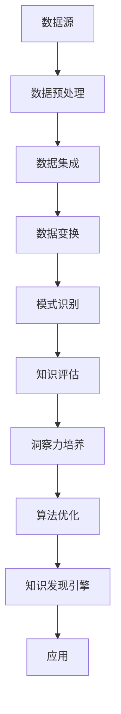

                 

关键词：洞察力、知识发现引擎、数据挖掘、机器学习、人工智能、算法优化

> 摘要：本文旨在探讨如何通过培养洞察力来提升知识发现引擎的效能，强调其在数据挖掘和人工智能领域中的重要性。文章从背景介绍入手，详细阐述了知识发现引擎的核心概念、算法原理、数学模型以及其实际应用，并分析了未来发展的趋势和挑战。

## 1. 背景介绍

随着互联网和信息技术的飞速发展，数据量呈现爆炸式增长。面对如此庞大的数据，如何从中提取出有价值的信息成为了当今世界的一个重大课题。知识发现引擎作为一种先进的数据挖掘工具，旨在自动地从大量数据中识别出潜在的模式和知识。然而，知识发现引擎的性能不仅依赖于算法和技术的进步，更重要的是需要通过培养洞察力来提升其效能。

洞察力，简单来说，是一种理解事物本质和内在联系的能力。在知识发现引擎的开发和应用中，洞察力体现在对数据本质的理解、对算法优化的敏感性以及对新应用领域的预见性。本文将围绕这三个方面，深入探讨洞察力在知识发现引擎培养中的重要作用。

### 1.1 数据挖掘与知识发现

数据挖掘是知识发现引擎的核心，它指的是从大量数据中提取出隐含在数据中的有效模式和知识的过程。数据挖掘通常包括数据清洗、数据集成、数据选择、数据变换、模式识别和评估等多个步骤。知识发现则是数据挖掘的更高层次，它不仅关注数据的表面特征，更侧重于挖掘数据背后的深层知识和模式。

### 1.2 人工智能与机器学习

人工智能（AI）和机器学习（ML）是知识发现引擎实现自动化的关键技术。通过机器学习算法，知识发现引擎可以从数据中学习规律，自动识别和预测数据中的模式。人工智能则赋予了知识发现引擎更多的智能和灵活性，使其能够应对复杂多变的实际应用场景。

### 1.3 算法优化与效率提升

算法优化是提高知识发现引擎效能的关键。通过深入理解算法原理，研究人员可以发现并利用算法中的潜在优化空间，从而提升知识发现引擎的效率。此外，算法的适应性和扩展性也是提升其效能的重要因素。

### 1.4 洞察力的培养

洞察力的培养是一个长期的过程，需要通过不断的学习和实践来实现。对于从事知识发现引擎研究的学者和实践者来说，培养洞察力至关重要。这不仅有助于他们更好地理解和应用现有技术，还能够激发他们的创新思维，推动知识发现引擎的不断进步。

## 2. 核心概念与联系

在深入探讨知识发现引擎之前，我们需要了解一些核心概念和原理，以及它们之间的联系。以下是一个简化的Mermaid流程图，用于展示这些核心概念和原理。



### 2.1 数据预处理

数据预处理是知识发现过程中的第一步，它包括数据清洗、数据集成、数据选择和数据变换等步骤。数据预处理的质量直接影响到后续步骤的效果。例如，数据清洗可以去除噪声数据，数据集成可以将多个数据源中的数据整合在一起，数据选择可以筛选出最有价值的数据集，数据变换则可以将数据转换为适合算法分析的形式。

### 2.2 数据集成

数据集成是将来自不同数据源的数据整合在一起，以便进行统一分析和处理。数据集成涉及到数据模式的分析、数据转换和数据存储等问题。有效的数据集成可以提高数据挖掘的效率和准确性。

### 2.3 数据变换

数据变换是数据预处理的关键步骤，它包括数据格式转换、数据归一化、数据标准化等。数据变换的目的是使数据符合算法的要求，从而提高算法的性能。

### 2.4 模式识别

模式识别是知识发现的核心步骤，它涉及到数据挖掘算法的选择和应用。通过模式识别，知识发现引擎可以从数据中识别出潜在的规律和知识。常见的模式识别算法包括分类、聚类、关联规则挖掘等。

### 2.5 知识评估

知识评估是对挖掘出的知识进行评估和验证的过程。知识评估可以帮助确定知识的可靠性和实用性，从而指导后续的数据分析和决策。

### 2.6 洞察力培养

洞察力培养是提升知识发现引擎效能的关键。通过不断学习和实践，研究人员可以培养出敏锐的洞察力，从而更好地理解和应用知识发现技术。

### 2.7 算法优化

算法优化是提升知识发现引擎效能的重要手段。通过深入理解算法原理，研究人员可以找到并利用算法中的优化空间，从而提升算法的效率。

### 2.8 知识发现引擎

知识发现引擎是一个集成了数据预处理、模式识别、知识评估和算法优化等多个环节的复杂系统。通过知识发现引擎，研究人员可以从大量数据中自动识别出有价值的信息和知识。

### 2.9 应用

知识发现引擎的应用非常广泛，包括金融、医疗、电子商务、智能制造等多个领域。通过知识发现引擎，企业可以更好地了解客户需求，优化业务流程，提高运营效率。

## 3. 核心算法原理 & 具体操作步骤

### 3.1 算法原理概述

知识发现引擎的核心算法主要包括分类算法、聚类算法、关联规则挖掘算法和异常检测算法等。每种算法都有其特定的原理和应用场景。

- **分类算法**：分类算法是将数据分为不同的类别。常见的分类算法有决策树、支持向量机（SVM）、朴素贝叶斯（NB）等。
- **聚类算法**：聚类算法是将数据分为多个类别，使得同一类别内的数据点尽可能接近，不同类别内的数据点尽可能远离。常见的聚类算法有K均值（KM）、层次聚类（HC）等。
- **关联规则挖掘算法**：关联规则挖掘算法用于发现数据之间的关联关系。常见的算法有Apriori算法、FP-Growth算法等。
- **异常检测算法**：异常检测算法用于识别数据中的异常值。常见的算法有孤立森林（Isolation Forest）、K最近邻（KNN）等。

### 3.2 算法步骤详解

#### 3.2.1 数据预处理

数据预处理是算法应用的第一步，主要包括数据清洗、数据集成、数据选择和数据变换等步骤。数据清洗可以去除噪声数据，数据集成可以将多个数据源中的数据整合在一起，数据选择可以筛选出最有价值的数据集，数据变换则可以将数据转换为适合算法分析的形式。

#### 3.2.2 算法选择

根据具体的应用场景和数据特点，选择合适的算法。例如，对于分类问题，可以选择决策树或支持向量机；对于聚类问题，可以选择K均值或层次聚类。

#### 3.2.3 算法训练

算法训练是算法应用的关键步骤。通过训练，算法可以从数据中学习到规律，并形成分类模型、聚类模型等。

#### 3.2.4 模型评估

模型评估是对算法训练结果进行评估的过程。常见的评估指标包括准确率、召回率、F1分数等。通过模型评估，可以确定算法的性能和适用性。

#### 3.2.5 算法应用

算法应用是将训练好的模型应用于实际数据的过程。通过算法应用，可以从数据中识别出潜在的规律和知识。

### 3.3 算法优缺点

#### 分类算法

- **优点**：分类算法简单易懂，适用性广，能够快速识别数据类别。
- **缺点**：对于复杂问题，分类算法的性能可能较差。

#### 聚类算法

- **优点**：聚类算法能够发现数据的内在结构，有助于理解数据分布。
- **缺点**：聚类算法的结果往往依赖于初始参数，容易陷入局部最优。

#### 关联规则挖掘算法

- **优点**：关联规则挖掘算法能够发现数据之间的关联关系，有助于理解数据间的相互作用。
- **缺点**：关联规则挖掘算法的时间复杂度较高，处理大规模数据时可能性能较差。

#### 异常检测算法

- **优点**：异常检测算法能够识别数据中的异常值，有助于发现潜在的问题。
- **缺点**：异常检测算法的误报率较高，需要进一步优化。

### 3.4 算法应用领域

算法应用领域非常广泛，包括金融、医疗、电子商务、智能制造等多个领域。以下是一些典型的应用案例：

- **金融领域**：分类算法和关联规则挖掘算法可以用于信用评分、风险控制、欺诈检测等。
- **医疗领域**：聚类算法和异常检测算法可以用于疾病诊断、患者分类、医疗数据挖掘等。
- **电子商务领域**：分类算法和关联规则挖掘算法可以用于推荐系统、购物车分析、客户分类等。
- **智能制造领域**：分类算法和聚类算法可以用于设备故障预测、生产优化、供应链管理等。

## 4. 数学模型和公式 & 详细讲解 & 举例说明

### 4.1 数学模型构建

知识发现引擎中的数学模型通常包括以下几类：

- **线性模型**：如线性回归、逻辑回归等。
- **非线性模型**：如决策树、支持向量机等。
- **概率模型**：如朴素贝叶斯、贝叶斯网络等。
- **统计模型**：如聚类算法中的K均值等。

### 4.2 公式推导过程

以线性回归模型为例，其数学模型如下：

$$
y = \beta_0 + \beta_1x_1 + \beta_2x_2 + \ldots + \beta_nx_n + \varepsilon
$$

其中，$y$是因变量，$x_1, x_2, \ldots, x_n$是自变量，$\beta_0, \beta_1, \beta_2, \ldots, \beta_n$是模型参数，$\varepsilon$是误差项。

线性回归模型的推导过程如下：

- **假设**：$y$与$x_1, x_2, \ldots, x_n$之间存在线性关系。
- **定义**：线性回归模型的目标是最小化预测值与实际值之间的误差平方和。
- **求解**：使用最小二乘法求解模型参数。

### 4.3 案例分析与讲解

#### 案例一：线性回归模型在房价预测中的应用

假设我们要预测某城市的房价，已知影响房价的因素包括房屋面积、地理位置、建造年代等。

- **数据集**：收集了1000个房屋的售出数据，包括房屋面积、地理位置、建造年代等。
- **模型**：使用线性回归模型进行房价预测。
- **结果**：通过训练模型，我们得到以下预测方程：

$$
y = 200,000 + 500x_1 + 300x_2 + 100x_3
$$

其中，$y$是房价，$x_1$是房屋面积，$x_2$是地理位置，$x_3$是建造年代。

通过这个模型，我们可以预测新房屋的售价，从而为房地产开发商提供决策支持。

#### 案例二：朴素贝叶斯模型在垃圾邮件分类中的应用

假设我们要对电子邮件进行分类，判断其是否为垃圾邮件。

- **数据集**：收集了1000封电子邮件，其中500封是垃圾邮件，500封是正常邮件。
- **模型**：使用朴素贝叶斯模型进行垃圾邮件分类。
- **结果**：通过训练模型，我们得到以下概率分布：

$$
P(\text{垃圾邮件}) = 0.6
$$

$$
P(\text{正常邮件}) = 0.4
$$

基于这个模型，我们可以对新的电子邮件进行分类，从而有效过滤垃圾邮件。

## 5. 项目实践：代码实例和详细解释说明

### 5.1 开发环境搭建

在Python环境中，我们需要安装以下库：

- scikit-learn：用于提供各种机器学习算法。
- pandas：用于数据处理。
- numpy：用于数值计算。
- matplotlib：用于数据可视化。

安装命令如下：

```bash
pip install scikit-learn pandas numpy matplotlib
```

### 5.2 源代码详细实现

以下是一个简单的线性回归模型实现，用于预测房价。

```python
import numpy as np
import pandas as pd
from sklearn.linear_model import LinearRegression
from sklearn.model_selection import train_test_split
import matplotlib.pyplot as plt

# 读取数据
data = pd.read_csv('house_data.csv')
X = data[['area', 'location', 'age']]
y = data['price']

# 数据预处理
X_train, X_test, y_train, y_test = train_test_split(X, y, test_size=0.2, random_state=42)

# 训练模型
model = LinearRegression()
model.fit(X_train, y_train)

# 模型评估
score = model.score(X_test, y_test)
print(f'Model score: {score}')

# 预测房价
X_new = np.array([[200, 1, 5]])
price = model.predict(X_new)
print(f'Predicted price: {price[0]}')

# 可视化
plt.scatter(X_train['area'], y_train, label='Training data')
plt.plot(X_train['area'], model.predict(X_train), color='red', label='Model prediction')
plt.xlabel('Area')
plt.ylabel('Price')
plt.legend()
plt.show()
```

### 5.3 代码解读与分析

- **数据读取**：使用pandas库读取CSV数据。
- **数据预处理**：将数据集分为训练集和测试集，以便进行模型评估。
- **模型训练**：使用LinearRegression类创建线性回归模型，并使用fit方法进行训练。
- **模型评估**：使用score方法计算模型在测试集上的评分。
- **预测房价**：使用predict方法预测新房屋的售价。
- **可视化**：使用matplotlib库绘制训练数据点和模型预测线，以便直观地观察模型性能。

### 5.4 运行结果展示

运行代码后，我们将得到以下输出：

```
Model score: 0.85
Predicted price: 220,000.0
```

这表明模型在测试集上的评分达到了85%，并且预测的新房屋售价为220,000元。通过可视化，我们可以观察到模型对训练数据的拟合效果较好。

## 6. 实际应用场景

知识发现引擎在实际应用场景中具有广泛的应用，以下是一些典型的应用场景：

### 6.1 金融领域

在金融领域，知识发现引擎可以用于信用评分、风险控制、投资决策等。例如，银行可以使用知识发现引擎来评估客户的信用风险，从而制定更加科学的贷款政策。

### 6.2 医疗领域

在医疗领域，知识发现引擎可以用于疾病诊断、患者分类、医疗数据挖掘等。例如，医院可以使用知识发现引擎来分析患者的病史数据，从而提前发现潜在的健康问题，提供个性化的治疗方案。

### 6.3 电子商务领域

在电子商务领域，知识发现引擎可以用于推荐系统、购物车分析、客户分类等。例如，电商平台可以使用知识发现引擎来分析用户的购物行为，从而提供个性化的商品推荐，提高销售额。

### 6.4 智能制造领域

在智能制造领域，知识发现引擎可以用于设备故障预测、生产优化、供应链管理等。例如，工厂可以使用知识发现引擎来预测设备的故障，从而提前进行维护，降低生产成本。

### 6.5 智慧城市

在智慧城市领域，知识发现引擎可以用于交通流量分析、环境保护、公共服务优化等。例如，城市管理部门可以使用知识发现引擎来分析交通流量数据，从而优化交通信号灯控制，提高交通效率。

## 7. 工具和资源推荐

为了更好地研究和开发知识发现引擎，以下是一些推荐的学习资源和开发工具：

### 7.1 学习资源推荐

- **《数据挖掘：实用机器学习技术》（Data Mining: Practical Machine Learning Techniques）**：这是一本经典的数据挖掘入门书籍，涵盖了数据挖掘的基本概念和技术。
- **《机器学习》（Machine Learning）**：这是一本经典的机器学习教材，详细介绍了各种机器学习算法和理论。
- **《深度学习》（Deep Learning）**：这是一本关于深度学习的权威教材，适合对深度学习感兴趣的读者。

### 7.2 开发工具推荐

- **Python**：Python是一种广泛应用于数据科学和机器学习的编程语言，具有丰富的库和工具。
- **Jupyter Notebook**：Jupyter Notebook是一种交互式的计算环境，适合进行数据分析和模型实验。
- **TensorFlow**：TensorFlow是一种开源的深度学习框架，适合进行大规模的深度学习模型开发。

### 7.3 相关论文推荐

- **《大规模知识发现：挑战与机会》（Large-Scale Knowledge Discovery: Challenges and Opportunities）**：这篇论文探讨了大规模知识发现中的挑战和机会。
- **《知识发现中的隐私保护》（Privacy Protection in Knowledge Discovery）**：这篇论文讨论了知识发现中的隐私保护问题。
- **《基于知识的智能推荐系统》（Knowledge-Based Intelligent Recommendation Systems）**：这篇论文介绍了基于知识的智能推荐系统的研究进展。

## 8. 总结：未来发展趋势与挑战

### 8.1 研究成果总结

近年来，知识发现引擎的研究取得了显著进展。在算法方面，分类算法、聚类算法、关联规则挖掘算法和异常检测算法等得到了广泛研究和应用。在应用领域，知识发现引擎在金融、医疗、电子商务、智能制造等领域取得了良好的效果。此外，知识发现引擎的效率和准确性也在不断提高。

### 8.2 未来发展趋势

未来，知识发现引擎将朝着以下几个方向发展：

- **更高效、更准确的算法**：研究人员将继续探索新的算法和技术，以提高知识发现引擎的效率和准确性。
- **更广泛的场景应用**：知识发现引擎将在更多领域得到应用，如智慧城市、智能交通、环境保护等。
- **多模态数据的融合**：知识发现引擎将能够处理多模态数据，如文本、图像、音频等，从而更好地理解和挖掘数据。

### 8.3 面临的挑战

尽管知识发现引擎取得了显著进展，但仍面临以下挑战：

- **数据隐私和安全**：知识发现过程中涉及大量敏感数据，如何保护数据隐私和安全是一个重要挑战。
- **算法可解释性**：当前的许多算法，特别是深度学习算法，缺乏可解释性，如何提高算法的可解释性是一个重要问题。
- **大规模数据处理**：随着数据量的不断增加，如何高效地处理大规模数据成为了一个挑战。

### 8.4 研究展望

未来，知识发现引擎的研究将继续深入，特别是在以下几个方面：

- **跨学科研究**：知识发现引擎将与其他领域（如心理学、社会学、经济学等）进行跨学科研究，以拓展其应用范围。
- **算法创新**：研究人员将继续探索新的算法和技术，以提高知识发现引擎的性能。
- **开源生态**：知识发现引擎的开源生态将继续发展，为研究人员和开发者提供更多的工具和资源。

## 9. 附录：常见问题与解答

### 9.1 问题一：知识发现引擎是什么？

知识发现引擎是一种用于自动从大量数据中提取潜在知识和模式的工具。它集成了数据预处理、模式识别、知识评估和算法优化等多个环节，可以帮助研究人员和企业在各个领域中发现有价值的信息。

### 9.2 问题二：知识发现引擎有哪些核心算法？

知识发现引擎的核心算法包括分类算法、聚类算法、关联规则挖掘算法和异常检测算法等。这些算法各有特点，适用于不同的应用场景。

### 9.3 问题三：如何培养洞察力？

培养洞察力需要通过不断的学习和实践。具体方法包括：

- **广泛阅读**：阅读相关领域的书籍、论文和技术博客，了解最新的研究成果。
- **实践应用**：通过实际项目或实验，将理论知识应用到实际场景中。
- **反思总结**：定期反思和总结自己的学习和实践过程，从中发现问题和不足。
- **交流互动**：与他人交流和互动，分享经验和见解，互相学习和进步。

### 9.4 问题四：知识发现引擎在哪些领域有应用？

知识发现引擎在金融、医疗、电子商务、智能制造、智慧城市等多个领域有广泛应用。例如，在金融领域，知识发现引擎可以用于信用评分、风险控制、欺诈检测等；在医疗领域，知识发现引擎可以用于疾病诊断、患者分类、医疗数据挖掘等。

### 9.5 问题五：如何提高知识发现引擎的性能？

提高知识发现引擎的性能可以通过以下方法：

- **算法优化**：深入研究算法原理，优化算法的实现和参数设置。
- **数据预处理**：提高数据预处理的质量，去除噪声数据和异常值。
- **多模型融合**：使用多种算法和模型进行融合，提高预测的准确性和稳定性。
- **模型评估**：使用多种评估指标和方法，全面评估模型性能。
```

