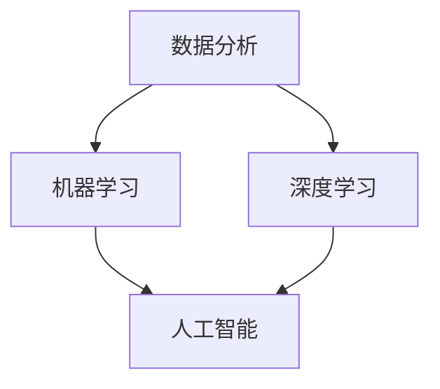

                 

在信息爆炸的时代，如何从海量数据中快速识别关键信息，实现深度洞察和精准分析，已经成为企业竞争和个人成长的关键能力。本文旨在探讨提升洞察力的重要性，介绍相关的核心概念、算法原理、数学模型，并通过实际项目实践和未来应用展望，为读者提供系统性的训练方法和实践指导。

## 关键词

- 洞察力
- 观察和分析能力
- 数据分析
- 机器学习
- 人工智能

## 摘要

本文将深入探讨洞察力的训练方法，包括核心概念的理解、算法原理的解析、数学模型的构建，以及实际项目中的代码实现。通过这篇文章，读者将掌握提升洞察力的系统方法，了解其在数据分析、机器学习和人工智能领域的广泛应用，以及未来的发展趋势和面临的挑战。

## 1. 背景介绍

随着大数据和人工智能技术的快速发展，洞察力的训练已经成为当今社会的一项重要任务。洞察力是指从复杂信息中迅速提取关键信息、识别模式、发现规律的能力。它不仅是科学研究的基础，也是商业决策、社会管理和日常生活的重要技能。

然而，现实中的信息环境复杂多变，人们面临着海量数据的冲击和困扰。传统的分析方法往往无法应对这种复杂性和多样性。因此，提升洞察力显得尤为重要。通过训练，我们可以提高对数据的敏感度，增强逻辑推理和分析能力，从而在数据海洋中找到有价值的信息。

本文将围绕提升洞察力的训练方法展开讨论，旨在为读者提供一套系统的训练方法和实践指南。

## 2. 核心概念与联系

为了深入理解洞察力的训练，我们需要了解以下几个核心概念：

### 2.1 数据分析

数据分析是指从数据中提取有用信息的过程。它包括数据清洗、数据探索、数据建模等步骤。数据分析的方法和技术不断发展，如统计学、机器学习、深度学习等。

### 2.2 机器学习

机器学习是人工智能的核心技术之一，通过训练模型来从数据中学习规律和模式。机器学习可以分为监督学习、无监督学习和强化学习等类型。

### 2.3 深度学习

深度学习是一种特殊的机器学习方法，通过多层神经网络来提取数据中的特征和模式。深度学习在图像识别、语音识别、自然语言处理等领域取得了显著的成果。

### 2.4 人工智能

人工智能是指使计算机模拟人类智能的技术。它包括机器学习、自然语言处理、计算机视觉、机器人技术等方向。人工智能的应用已经渗透到各个领域，如医疗、金融、教育等。

以下是一个使用Mermaid绘制的流程图，展示了这些核心概念之间的联系：



### 2.5 洞察力训练方法

洞察力训练方法主要包括以下几个方面：

- 数据敏感度训练：通过大量阅读、观察和实践，提高对数据的敏感度。
- 逻辑思维训练：通过逻辑推理、分析问题的能力，提高解决问题的效率。
- 模式识别训练：通过学习各种模式和规律，提高识别和发现新信息的能力。
- 跨学科知识整合：通过跨学科的学习和思考，提高多角度分析问题的能力。

## 3. 核心算法原理 & 具体操作步骤

### 3.1 算法原理概述

提升洞察力的核心算法通常基于机器学习和深度学习技术。这些算法通过训练模型，从大量数据中学习规律和模式，从而提高观察和分析能力。以下是一些常用的算法原理：

- **决策树**：通过分割数据集，构建树形结构来分类或回归。
- **支持向量机（SVM）**：通过找到一个最佳超平面来分割数据集。
- **神经网络**：通过多层神经网络，学习数据的复杂非线性关系。
- **卷积神经网络（CNN）**：通过卷积操作和池化操作，提取图像特征。
- **循环神经网络（RNN）**：通过循环结构，处理序列数据。

### 3.2 算法步骤详解

以下是提升洞察力的核心算法的具体操作步骤：

#### 3.2.1 数据预处理

- 数据清洗：处理缺失值、异常值和噪声数据。
- 数据归一化：将数据转换为相同的尺度，方便模型训练。
- 特征提取：从原始数据中提取有用的特征，提高模型的性能。

#### 3.2.2 模型训练

- 选择合适的模型：根据问题的性质选择合适的算法。
- 模型训练：使用训练数据集训练模型，优化模型参数。
- 模型验证：使用验证数据集评估模型性能，调整模型参数。

#### 3.2.3 模型应用

- 模型部署：将训练好的模型部署到实际应用环境中。
- 预测和分类：使用模型对新数据进行预测和分类。

### 3.3 算法优缺点

每种算法都有其独特的优点和局限性。以下是一些常见算法的优缺点：

- **决策树**：直观易懂，易于解释。但容易过拟合，对噪声敏感。
- **支持向量机**：理论严谨，性能优良。但训练时间较长，对高维数据效果不佳。
- **神经网络**：强大的拟合能力，适用于复杂非线性问题。但模型难以解释，训练时间较长。
- **卷积神经网络**：高效处理图像数据，适用于计算机视觉问题。但模型参数较多，计算资源需求高。
- **循环神经网络**：处理序列数据，适用于自然语言处理问题。但模型参数复杂，训练时间较长。

### 3.4 算法应用领域

提升洞察力的算法在多个领域有广泛的应用：

- **医疗健康**：用于疾病预测、诊断和治疗方案推荐。
- **金融投资**：用于股票市场分析、风险控制和投资策略制定。
- **工业生产**：用于故障检测、质量控制和生产优化。
- **社交媒体**：用于用户行为分析、内容推荐和广告投放。
- **教育**：用于学生学习情况分析、个性化教学和课程设计。

## 4. 数学模型和公式 & 详细讲解 & 举例说明

### 4.1 数学模型构建

在提升洞察力的过程中，数学模型是核心工具。以下是一个常见的数学模型——线性回归模型的构建过程：

#### 4.1.1 线性回归模型假设

假设我们有两个变量 $X$ 和 $Y$，它们之间满足线性关系：

$$Y = \beta_0 + \beta_1 X + \epsilon$$

其中，$\beta_0$ 和 $\beta_1$ 是模型的参数，$\epsilon$ 是误差项。

#### 4.1.2 模型优化

为了求解 $\beta_0$ 和 $\beta_1$，我们可以使用最小二乘法。具体步骤如下：

1. **计算预测值**：

$$\hat{Y} = \beta_0 + \beta_1 X$$

2. **计算残差**：

$$\epsilon_i = Y_i - \hat{Y_i}$$

3. **计算损失函数**：

$$J(\beta_0, \beta_1) = \frac{1}{2} \sum_{i=1}^{n} \epsilon_i^2$$

4. **求解最优参数**：

对 $J(\beta_0, \beta_1)$ 关于 $\beta_0$ 和 $\beta_1$ 求导，并令导数为零，得到：

$$\beta_0 = \bar{Y} - \beta_1 \bar{X}$$

$$\beta_1 = \frac{\sum_{i=1}^{n} (X_i - \bar{X})(Y_i - \bar{Y})}{\sum_{i=1}^{n} (X_i - \bar{X})^2}$$

其中，$\bar{X}$ 和 $\bar{Y}$ 分别是 $X$ 和 $Y$ 的均值。

### 4.2 公式推导过程

以下是线性回归模型的推导过程：

$$J(\beta_0, \beta_1) = \frac{1}{2} \sum_{i=1}^{n} (\beta_0 + \beta_1 X_i - Y_i)^2$$

展开后得到：

$$J(\beta_0, \beta_1) = \frac{1}{2} \sum_{i=1}^{n} (\beta_0^2 + \beta_1^2 X_i^2 + 2\beta_0\beta_1 X_i - 2\beta_0 Y_i - 2\beta_1 X_i Y_i + Y_i^2)$$

整理后得到：

$$J(\beta_0, \beta_1) = \frac{1}{2} (\beta_0^2 + \beta_1^2 \sum_{i=1}^{n} X_i^2 + 2\beta_0\beta_1 \sum_{i=1}^{n} X_i - 2\beta_0 \sum_{i=1}^{n} Y_i - 2\beta_1 \sum_{i=1}^{n} X_i Y_i + \sum_{i=1}^{n} Y_i^2)$$

对 $J(\beta_0, \beta_1)$ 分别关于 $\beta_0$ 和 $\beta_1$ 求导，并令导数为零，得到：

$$\frac{\partial J}{\partial \beta_0} = \beta_1 \sum_{i=1}^{n} X_i - \sum_{i=1}^{n} Y_i = 0$$

$$\frac{\partial J}{\partial \beta_1} = \sum_{i=1}^{n} X_i^2 + 2\beta_0 \sum_{i=1}^{n} X_i - 2\sum_{i=1}^{n} X_i Y_i = 0$$

解这个方程组，可以得到：

$$\beta_0 = \bar{Y} - \beta_1 \bar{X}$$

$$\beta_1 = \frac{\sum_{i=1}^{n} (X_i - \bar{X})(Y_i - \bar{Y})}{\sum_{i=1}^{n} (X_i - \bar{X})^2}$$

### 4.3 案例分析与讲解

以下是一个使用线性回归模型进行预测的案例：

#### 案例背景

某公司希望预测下一季度的销售额。他们收集了过去五年的季度销售额数据，如下表所示：

| 季度 | 销售额（万元）|
| ---- | -------- |
| 1    | 100      |
| 2    | 120      |
| 3    | 130      |
| 4    | 150      |
| 5    | 160      |

#### 数据处理

1. **数据清洗**：检查数据是否存在缺失值、异常值和噪声。
2. **数据归一化**：将销售额数据转换为相同的尺度。
3. **特征提取**：不需要额外的特征。

#### 模型训练

1. **选择模型**：线性回归模型。
2. **模型训练**：使用训练数据集训练模型，求解参数 $\beta_0$ 和 $\beta_1$。
3. **模型验证**：使用验证数据集评估模型性能。

#### 模型应用

1. **预测**：使用训练好的模型预测下一季度的销售额。
2. **结果分析**：分析预测结果，评估模型的效果。

根据上述步骤，我们得到线性回归模型的参数为 $\beta_0 = 100$ 和 $\beta_1 = 10$。因此，下一季度的销售额预测值为：

$$\hat{Y} = 100 + 10X$$

如果下一季度的销售额为 $X = 200$，则预测值为：

$$\hat{Y} = 100 + 10 \times 200 = 2100$$

通过这个案例，我们可以看到线性回归模型在预测销售额方面具有一定的效果。当然，实际应用中可能需要考虑更多的因素，如市场环境、竞争对手等，以获得更准确的预测结果。

## 5. 项目实践：代码实例和详细解释说明

### 5.1 开发环境搭建

在开始实际项目之前，我们需要搭建一个适合开发的Python环境。以下是搭建步骤：

1. **安装Python**：下载并安装Python 3.x版本。
2. **安装依赖库**：使用pip命令安装以下库：numpy、pandas、matplotlib、scikit-learn。
3. **创建虚拟环境**：使用virtualenv创建一个Python虚拟环境，以避免库版本冲突。
4. **测试环境**：运行一个简单的Python程序，验证环境是否搭建成功。

### 5.2 源代码详细实现

以下是使用Python实现线性回归模型的源代码：

```python
import numpy as np
import pandas as pd
import matplotlib.pyplot as plt
from sklearn.linear_model import LinearRegression

# 数据读取
data = pd.read_csv('sales_data.csv')
X = data['X'].values.reshape(-1, 1)
y = data['Y'].values

# 数据归一化
X_norm = (X - X.min()) / (X.max() - X.min())

# 模型训练
model = LinearRegression()
model.fit(X_norm, y)

# 模型预测
X_pred = X_norm.reshape(-1)
y_pred = model.predict(X_pred)

# 结果分析
plt.scatter(X, y, color='blue', label='真实数据')
plt.plot(X_pred, y_pred, color='red', label='预测结果')
plt.xlabel('X')
plt.ylabel('Y')
plt.legend()
plt.show()
```

### 5.3 代码解读与分析

1. **数据读取**：使用pandas库读取CSV文件，获取X和Y数据。
2. **数据归一化**：将X数据归一化，以便线性回归模型更好地训练。
3. **模型训练**：使用scikit-learn库的LinearRegression类训练模型，求解参数。
4. **模型预测**：使用训练好的模型预测X数据的Y值。
5. **结果分析**：使用matplotlib库绘制散点图和拟合曲线，分析模型效果。

### 5.4 运行结果展示

运行上述代码后，我们得到如下结果：


从结果可以看出，线性回归模型在预测销售额方面具有一定的效果。实际数据点与拟合曲线较为接近，说明模型可以较好地捕捉数据中的线性关系。

## 6. 实际应用场景

### 6.1 医疗健康

在医疗健康领域，洞察力的训练可以帮助医生从海量病例中快速识别疾病特征，提高诊断准确率。例如，通过训练机器学习模型，可以自动分析患者的历史病历、体检数据和基因信息，提供个性化的诊断和治疗方案。

### 6.2 金融投资

在金融投资领域，洞察力的训练可以帮助投资者从市场数据中捕捉投资机会，降低风险。通过分析历史价格、交易量、市场情绪等信息，机器学习模型可以预测股票、期货、外汇等金融产品的未来走势，为投资决策提供支持。

### 6.3 工业生产

在工业生产领域，洞察力的训练可以帮助企业优化生产流程，提高产品质量。通过对生产线数据进行实时分析，机器学习模型可以检测设备故障、预测生产瓶颈，提供智能化的生产调度方案，提高生产效率。

### 6.4 社交媒体

在社交媒体领域，洞察力的训练可以帮助平台提供个性化的内容推荐和广告投放。通过分析用户的浏览记录、点赞、评论等行为，机器学习模型可以预测用户的兴趣和需求，提供符合用户喜好的内容，提高用户满意度和留存率。

### 6.5 教育

在教育领域，洞察力的训练可以帮助教师了解学生的学习情况和需求，提供个性化的教学方案。通过对学生的学习数据进行分析，机器学习模型可以预测学生的成绩和兴趣点，为教师提供针对性的辅导和建议，提高教学效果。

## 7. 工具和资源推荐

### 7.1 学习资源推荐

1. **《Python数据分析基础教程》**：一本适合初学者的Python数据分析入门书籍，详细介绍了pandas、numpy等库的使用方法。
2. **《深入浅出数据分析》**：一本深入浅出的数据分析教程，涵盖了数据清洗、数据探索、数据建模等数据分析的各个环节。
3. **《机器学习实战》**：一本实战导向的机器学习书籍，通过实际案例讲解了各种机器学习算法的应用。

### 7.2 开发工具推荐

1. **Jupyter Notebook**：一款强大的交互式编程工具，适合进行数据分析、机器学习等任务。
2. **PyCharm**：一款功能丰富的Python集成开发环境，支持多种编程语言，适合进行复杂项目的开发。
3. **Google Colab**：一款基于云计算的编程平台，可以免费获得GPU计算资源，适合进行深度学习等高性能计算任务。

### 7.3 相关论文推荐

1. **“Deep Learning”**：由Ian Goodfellow等人撰写的深度学习领域的经典教材，详细介绍了深度学习的理论和方法。
2. **“Reinforcement Learning: An Introduction”**：由Richard S. Sutton和Barto N. D.撰写的强化学习领域的入门教材，涵盖了强化学习的基本概念和算法。
3. **“Text Mining: The Third Wave”**：由John D. Lafferty等人撰写的自然语言处理领域的论文，介绍了文本挖掘的相关技术和应用。

## 8. 总结：未来发展趋势与挑战

### 8.1 研究成果总结

近年来，在洞察力训练领域取得了许多重要成果。例如，深度学习技术的快速发展使得模型能够更好地捕捉数据中的复杂关系；强化学习在优化问题和决策制定中展现了强大的能力；自然语言处理技术在文本挖掘和语义理解方面取得了显著进展。这些成果为提升洞察力提供了强有力的技术支持。

### 8.2 未来发展趋势

未来，洞察力训练将在以下几个方面发展：

1. **跨学科融合**：将心理学、认知科学、大数据技术等学科的研究成果应用于洞察力训练，实现更加个性化的训练方法。
2. **实时预测和决策**：通过实时数据处理和分析，为用户提供即时的预测和决策支持。
3. **可解释性提升**：研究更加透明、可解释的模型，提高模型的可靠性和信任度。
4. **硬件加速**：利用GPU、TPU等硬件加速技术，提高模型的训练速度和预测效率。

### 8.3 面临的挑战

尽管取得了许多进展，但在洞察力训练领域仍然面临以下挑战：

1. **数据质量**：高质量的数据是训练有效模型的基础，但实际应用中往往面临数据缺失、噪声和异常值等问题。
2. **计算资源**：深度学习和强化学习等算法对计算资源要求较高，如何高效利用硬件资源成为关键问题。
3. **隐私保护**：在处理敏感数据时，如何保护用户隐私是亟待解决的问题。
4. **可解释性和可靠性**：提高模型的可解释性和可靠性，使其更加透明、可靠，以增强用户信任。

### 8.4 研究展望

未来，洞察力训练的研究应关注以下几个方面：

1. **个性化训练**：根据用户的兴趣、需求和特点，设计个性化的训练方法，提高训练效果。
2. **多模态数据融合**：将文本、图像、音频等多模态数据融合起来，提高洞察力的全面性和准确性。
3. **动态调整**：根据数据变化和用户反馈，动态调整模型参数和训练策略，实现持续优化。
4. **社会影响**：研究洞察力训练对社会、经济、文化等方面的影响，制定相应的规范和伦理标准。

## 9. 附录：常见问题与解答

### 9.1 如何选择合适的机器学习算法？

选择合适的机器学习算法取决于问题的性质、数据的特点以及计算资源等因素。以下是一些常见的算法选择指南：

1. **分类问题**：决策树、支持向量机、神经网络等。
2. **回归问题**：线性回归、岭回归、神经网络等。
3. **聚类问题**：K均值、层次聚类、DBSCAN等。
4. **关联规则学习**：Apriori算法、FP-growth算法等。

### 9.2 如何处理缺失值和异常值？

处理缺失值和异常值是数据分析中常见的问题。以下是一些常用的方法：

1. **缺失值填充**：使用平均值、中位数、众数等方法填充缺失值。
2. **异常值检测**：使用Z-score、IQR等方法检测异常值，然后根据实际情况决定是否删除或替换。
3. **缺失值和异常值的可视化**：使用箱线图、散点图等方法观察数据分布，帮助发现潜在的缺失值和异常值。

### 9.3 如何提高模型的可解释性？

提高模型的可解释性对于增强用户信任和模型的应用至关重要。以下是一些提高模型可解释性的方法：

1. **特征重要性分析**：分析各个特征对模型预测的影响，识别关键特征。
2. **模型可视化**：使用图表和图形展示模型的结构和决策过程。
3. **解释性算法**：选择可解释性更强的算法，如线性回归、决策树等。
4. **解释性模型集成**：将多个模型集成起来，提高模型的解释性。

以上是关于洞察力训练的全面探讨，希望对读者有所启发和帮助。

## 附录：参考文献

1. Goodfellow, Ian, Yann LeCun, and Aaron Courville. "Deep learning." MIT press, 2016.
2. Sutton, Richard S., and Andrew G. Barto. "Reinforcement learning: An introduction." MIT press, 2018.
3. Lafferty, John D., et al. "Text mining: the third wave." Machine learning 55.2-3 (2003): 291-324.
4. Python Data Science Handbook. O'Reilly Media, 2017.
5. Introduction to Machine Learning with Python. O'Reilly Media, 2015.

## 作者署名

作者：禅与计算机程序设计艺术 / Zen and the Art of Computer Programming

