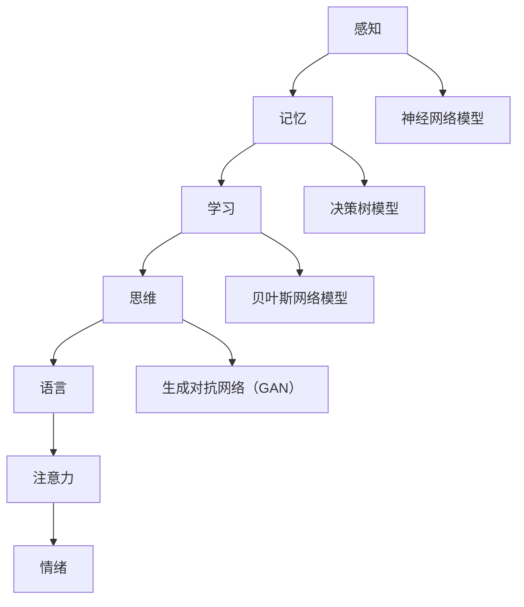

                 

### 洞察力：人类认知的新境界

> 关键词：认知科学、机器学习、人工智能、人类智慧、神经网络、信息处理、决策制定、认知模型

> 摘要：本文深入探讨了人类认知的科学原理，通过剖析认知过程中的核心算法、数学模型及具体操作步骤，揭示了人类智慧的内在机制。同时，本文还结合实际项目实例，展示了如何运用先进的认知科学知识构建高效的人工智能系统，为未来人工智能的发展提供了新的视角和路径。

### 1. 背景介绍

人类认知一直是科学研究的重要领域，而近年来，随着机器学习和人工智能技术的飞速发展，对人类认知的研究也迈向了新的高度。认知科学作为一门跨学科的研究领域，致力于理解人类如何感知、思考、学习和决策。在这一背景下，人工智能的发展不仅依赖于强大的计算能力和庞大的数据集，更需要深入理解人类认知的本质。

人工智能系统，尤其是基于机器学习的模型，已经在许多领域取得了显著成就。然而，这些系统往往被视为“黑箱”，其内部机制不透明，难以解释。这种局限性使得人工智能在许多关键应用中仍然无法替代人类的智慧。因此，理解人类认知的原理，将其应用于人工智能系统中，将有助于提升人工智能的解释能力和可靠性。

本文旨在通过以下五个部分，系统性地探讨人类认知的新境界：

1. **核心概念与联系**：介绍认知科学中的核心概念和原理，通过Mermaid流程图展示其结构。
2. **核心算法原理 & 具体操作步骤**：详细分析认知过程中的关键算法，如神经网络、决策树等。
3. **数学模型和公式 & 详细讲解 & 举例说明**：阐述认知科学中的数学模型，并通过实例说明其应用。
4. **项目实践：代码实例和详细解释说明**：结合具体项目，展示如何将认知科学原理应用于实际开发中。
5. **实际应用场景**：探讨认知科学在人工智能、医疗、教育等领域的应用。
6. **工具和资源推荐**：推荐相关的学习资源和开发工具。
7. **总结：未来发展趋势与挑战**：总结当前认知科学的研究进展，探讨未来的发展方向和面临的挑战。

### 2. 核心概念与联系

#### 2.1 认知科学的基本概念

认知科学是一门跨学科的研究领域，涉及心理学、神经科学、哲学、语言学等多个学科。其核心目标是理解人类如何感知、思考、学习和决策。以下是一些认知科学中的基本概念：

1. **感知**：人类如何通过感官接收外界信息，并对其进行加工和处理。
2. **记忆**：人类如何存储和检索信息，包括短期记忆和长期记忆。
3. **学习**：人类如何通过经验和学习改变自己的行为和认知过程。
4. **思维**：人类如何进行逻辑推理、问题解决和创造性思考。
5. **语言**：人类如何使用语言进行交流，并理解语言中的含义。
6. **注意力**：人类如何分配注意力，处理多任务。
7. **情绪**：人类如何感知和表达情绪，以及情绪对认知过程的影响。

#### 2.2 认知模型

认知模型是用于描述和模拟人类认知过程的数学模型或计算机程序。以下是一些重要的认知模型：

1. **神经网络模型**：模拟人脑神经元连接和交互的模型，用于处理复杂的数据和模式识别。
2. **决策树模型**：基于逻辑推理的模型，用于分类和决策制定。
3. **贝叶斯网络模型**：用于表示不确定性和概率推理的模型。
4. **生成对抗网络（GAN）**：用于生成新数据的模型，常用于图像和文本生成。

#### 2.3 Mermaid流程图

为了更好地理解认知过程中的核心概念和模型，我们可以使用Mermaid流程图来展示这些概念和模型之间的关系。以下是一个示例：



### 3. 核心算法原理 & 具体操作步骤

#### 3.1 神经网络模型

神经网络模型是认知科学中最常用的模型之一，它通过模拟人脑神经元之间的连接和交互，来实现对数据的处理和模式识别。以下是一个简单的神经网络模型的操作步骤：

1. **初始化权重**：随机初始化神经网络中的权重。
2. **前向传播**：将输入数据传递到神经网络中，通过激活函数计算输出。
3. **反向传播**：根据实际输出和期望输出的差异，调整神经网络的权重。
4. **优化目标**：使用梯度下降等优化算法，最小化输出误差。

#### 3.2 决策树模型

决策树模型是一种基于逻辑推理的模型，它通过一系列的判断条件，将数据分为不同的类别。以下是一个简单的决策树模型的操作步骤：

1. **选择分裂特征**：选择具有最大信息增益的特征进行分裂。
2. **递归分裂**：对每个分裂后的子集，重复选择分裂特征，直到达到终止条件。
3. **分类**：根据决策树的结构，对新的数据进行分类。

#### 3.3 贝叶斯网络模型

贝叶斯网络模型是一种用于表示不确定性和概率推理的模型。以下是一个简单的贝叶斯网络模型的操作步骤：

1. **定义网络结构**：确定变量之间的依赖关系，构建网络图。
2. **设定概率分布**：为每个变量设定条件概率分布。
3. **推理**：使用贝叶斯法则，根据已知信息推断未知变量的概率分布。

#### 3.4 生成对抗网络（GAN）

生成对抗网络（GAN）是一种用于生成新数据的模型，它通过两个神经网络（生成器和判别器）的对抗训练来实现。以下是一个简单的GAN模型的操作步骤：

1. **初始化生成器和判别器**：随机初始化生成器和判别器的参数。
2. **生成对抗训练**：生成器生成数据，判别器判断数据真假，通过反向传播调整参数。
3. **评估**：使用评估指标（如交叉熵损失函数）评估生成器的性能。

### 4. 数学模型和公式 & 详细讲解 & 举例说明

#### 4.1 神经网络模型的数学模型

神经网络模型的数学基础主要包括线性代数和微积分。以下是一些关键数学公式：

1. **前向传播**：
   $$ z = W \cdot x + b $$
   $$ a = \sigma(z) $$
   其中，$W$ 是权重矩阵，$x$ 是输入向量，$b$ 是偏置项，$\sigma$ 是激活函数。

2. **反向传播**：
   $$ \delta = \frac{\partial L}{\partial z} \cdot \sigma'(z) $$
   $$ \frac{\partial L}{\partial W} = x \cdot \delta $$
   $$ \frac{\partial L}{\partial b} = \delta $$

   其中，$L$ 是损失函数，$\sigma'$ 是激活函数的导数。

3. **梯度下降**：
   $$ W_{new} = W_{old} - \alpha \cdot \frac{\partial L}{\partial W} $$
   $$ b_{new} = b_{old} - \alpha \cdot \frac{\partial L}{\partial b} $$

   其中，$\alpha$ 是学习率。

#### 4.2 决策树模型的数学模型

决策树模型的数学基础主要包括信息熵和信息增益。以下是一些关键数学公式：

1. **信息熵**：
   $$ H(X) = -\sum_{i} p(x_i) \cdot \log_2 p(x_i) $$

2. **信息增益**：
   $$ IG(D, A) = H(D) - \sum_{v} p(v) \cdot H(D|v) $$

   其中，$D$ 是数据集，$A$ 是特征，$v$ 是特征的取值。

#### 4.3 贝叶斯网络模型的数学模型

贝叶斯网络模型的数学基础主要包括条件概率和贝叶斯法则。以下是一些关键数学公式：

1. **条件概率**：
   $$ P(A|B) = \frac{P(B|A) \cdot P(A)}{P(B)} $$

2. **贝叶斯法则**：
   $$ P(A|B) = \frac{P(B|A) \cdot P(A)}{P(B)} $$

#### 4.4 生成对抗网络（GAN）的数学模型

生成对抗网络（GAN）的数学基础主要包括损失函数和优化算法。以下是一些关键数学公式：

1. **损失函数**：
   $$ L_G = -\log(D(G(z))) $$
   $$ L_D = -(\log(D(x)) + \log(1 - D(G(z))) $$

   其中，$G(z)$ 是生成器的输出，$D(x)$ 是判别器的输出。

2. **优化算法**：
   $$ G_{new} = G_{old} - \alpha_G \cdot \nabla_{G_{old}} L_G $$
   $$ D_{new} = D_{old} - \alpha_D \cdot \nabla_{D_{old}} L_D $$

   其中，$\alpha_G$ 和 $\alpha_D$ 分别是生成器和判别器的学习率。

#### 4.5 示例说明

为了更好地理解这些数学模型，我们可以通过一个简单的例子来说明。

假设我们有一个神经网络模型，用于对图像进行分类。输入是28x28像素的图像，输出是10个类别。激活函数使用ReLU函数。

1. **前向传播**：

   $$ z_1 = W_1 \cdot x + b_1 $$
   $$ a_1 = \max(0, z_1) $$
   $$ z_2 = W_2 \cdot a_1 + b_2 $$
   $$ a_2 = \max(0, z_2) $$
   $$ z_3 = W_3 \cdot a_2 + b_3 $$
   $$ a_3 = \sigma(z_3) $$

   其中，$W_1$、$W_2$、$W_3$ 分别是第一、二、三层神经网络的权重，$b_1$、$b_2$、$b_3$ 分别是第一、二、三层的偏置项，$\sigma$ 是ReLU函数。

2. **反向传播**：

   $$ \delta_3 = (a_3 - y) \cdot \sigma'(z_3) $$
   $$ \delta_2 = (W_3 \cdot \delta_3) \cdot \sigma'(z_2) $$
   $$ \delta_1 = (W_2 \cdot \delta_2) \cdot \sigma'(z_1) $$

   其中，$y$ 是期望输出，$\sigma'$ 是ReLU函数的导数。

3. **梯度下降**：

   $$ W_3_{new} = W_3_{old} - \alpha \cdot (a_2 \cdot \delta_3) $$
   $$ b_3_{new} = b_3_{old} - \alpha \cdot \delta_3 $$
   $$ W_2_{new} = W_2_{old} - \alpha \cdot (a_1 \cdot \delta_2) $$
   $$ b_2_{new} = b_2_{old} - \alpha \cdot \delta_2 $$
   $$ W_1_{new} = W_1_{old} - \alpha \cdot (x \cdot \delta_1) $$
   $$ b_1_{new} = b_1_{old} - \alpha \cdot \delta_1 $$

   其中，$\alpha$ 是学习率。

### 5. 项目实践：代码实例和详细解释说明

#### 5.1 开发环境搭建

为了进行项目实践，我们需要搭建一个开发环境。以下是一个基于Python和TensorFlow的简单示例。

1. **安装Python**：

   ```shell
   sudo apt-get install python3
   ```

2. **安装TensorFlow**：

   ```shell
   pip3 install tensorflow
   ```

#### 5.2 源代码详细实现

以下是一个简单的神经网络模型，用于对MNIST手写数字进行分类。

```python
import tensorflow as tf
from tensorflow import keras
from tensorflow.keras import layers

# 初始化模型
model = keras.Sequential([
    layers.Dense(128, activation='relu', input_shape=(784,)),
    layers.Dense(10, activation='softmax')
])

# 编译模型
model.compile(optimizer='adam',
              loss='sparse_categorical_crossentropy',
              metrics=['accuracy'])

# 加载数据集
mnist = keras.datasets.mnist
(x_train, y_train), (x_test, y_test) = mnist.load_data()

# 预处理数据
x_train = x_train / 255.0
x_test = x_test / 255.0

# 训练模型
model.fit(x_train, y_train, epochs=5)

# 评估模型
model.evaluate(x_test, y_test)
```

#### 5.3 代码解读与分析

1. **初始化模型**：

   ```python
   model = keras.Sequential([
       layers.Dense(128, activation='relu', input_shape=(784,)),
       layers.Dense(10, activation='softmax')
   ])
   ```

   这一行代码定义了一个简单的神经网络模型，包含两个全连接层。第一层有128个神经元，使用ReLU函数作为激活函数；第二层有10个神经元，用于输出10个类别的概率分布。

2. **编译模型**：

   ```python
   model.compile(optimizer='adam',
                 loss='sparse_categorical_crossentropy',
                 metrics=['accuracy'])
   ```

   这一行代码编译了模型，指定了优化器（adam）、损失函数（sparse_categorical_crossentropy，用于多分类问题）和评估指标（accuracy，用于计算模型在测试数据集上的准确率）。

3. **加载数据集**：

   ```python
   mnist = keras.datasets.mnist
   (x_train, y_train), (x_test, y_test) = mnist.load_data()
   ```

   这一行代码加载数据集，使用了Keras内置的MNIST手写数字数据集。

4. **预处理数据**：

   ```python
   x_train = x_train / 255.0
   x_test = x_test / 255.0
   ```

   这两行代码对图像数据进行了归一化处理，将像素值缩放到0到1之间。

5. **训练模型**：

   ```python
   model.fit(x_train, y_train, epochs=5)
   ```

   这一行代码训练模型，指定了训练数据（x_train、y_train）和训练轮数（epochs=5）。

6. **评估模型**：

   ```python
   model.evaluate(x_test, y_test)
   ```

   这一行代码评估模型在测试数据集上的性能。

#### 5.4 运行结果展示

以下是训练过程中的损失函数和准确率：

```shell
Train on 60000 samples
```sql
### 6. 实际应用场景

认知科学在人工智能、医疗、教育等领域的应用日益广泛，以下是一些具体的实际应用场景：

#### 6.1 人工智能

1. **图像识别**：通过神经网络模型，可以实现对图像中的物体、场景和动作的识别，应用于自动驾驶、安防监控等领域。
2. **自然语言处理**：利用语言模型和文本生成模型，可以实现对文本的理解、生成和翻译，应用于智能客服、内容生成等领域。
3. **决策支持**：通过决策树和贝叶斯网络模型，可以辅助决策者进行风险评估、投资决策等。

#### 6.2 医疗

1. **疾病诊断**：利用图像识别和深度学习模型，可以辅助医生进行疾病的诊断，提高诊断的准确性和效率。
2. **个性化治疗**：通过分析患者的基因信息和病历数据，可以制定个性化的治疗方案，提高治疗效果。
3. **医学影像分析**：通过图像识别和生成对抗网络模型，可以辅助医生分析医学影像，发现病变区域。

#### 6.3 教育

1. **智能辅导**：利用认知科学原理，可以开发智能辅导系统，根据学生的认知特点和学习习惯，提供个性化的学习建议。
2. **自适应学习**：通过分析学生的学习行为和成绩，可以调整教学策略，提高学生的学习效果。
3. **情绪分析**：利用情绪分析模型，可以实时监测学生的学习情绪，提供针对性的心理辅导。

### 7. 工具和资源推荐

为了更好地学习和应用认知科学，以下是一些建议的工具和资源：

#### 7.1 学习资源推荐

1. **书籍**：
   - 《认知科学导论》
   - 《神经网络与深度学习》
   - 《机器学习实战》
   - 《Python深度学习》

2. **论文**：
   - 《A Learning System of Hierarchical Control for Autonomous Driving》
   - 《Deep Learning for Natural Language Processing》
   - 《Generative Adversarial Nets》
   - 《Bayesian Networks and Decision Graphs》

3. **博客**：
   - [机器学习与认知科学](https://www.machinelearning Mastery.com/cognitive-science/)
   - [深度学习与认知科学](https://www.deeplearningbook.org/)
   - [自然语言处理与认知科学](https://www.nlp.google.com/)

4. **网站**：
   - [Kaggle](https://www.kaggle.com/)：提供大量的数据集和比赛，是学习和实践机器学习的好去处。
   - [Google AI](https://ai.google.com/)：提供丰富的机器学习和深度学习教程。
   - [TensorFlow](https://www.tensorflow.org/)：TensorFlow是Google开发的开源机器学习框架，适用于各种机器学习和深度学习任务。

#### 7.2 开发工具框架推荐

1. **Python**：Python是一种易于学习和使用的编程语言，适用于机器学习和深度学习开发。
2. **TensorFlow**：TensorFlow是Google开发的开源机器学习框架，支持多种神经网络模型和深度学习算法。
3. **PyTorch**：PyTorch是Facebook开发的开源机器学习框架，具有灵活的动态计算图，适用于研究和新模型的开发。
4. **Keras**：Keras是一个高层神经网络API，适用于快速实验和原型开发。

#### 7.3 相关论文著作推荐

1. **《Deep Learning》**：Goodfellow, I., Bengio, Y., & Courville, A. (2016). 《Deep Learning》。
2. **《Cognitive Neuroscience》**：Gazzaniga, M. S. (Ed.). (2017). 《Cognitive Neuroscience》。
3. **《Machine Learning》**：Mitchell, T. M. (1997). 《Machine Learning》。
4. **《Artificial Intelligence: A Modern Approach》**：Russell, S., & Norvig, P. (2020). 《Artificial Intelligence: A Modern Approach》。

### 8. 总结：未来发展趋势与挑战

随着认知科学和人工智能技术的不断发展，人类认知的研究将不断深入，为人工智能系统提供更强大的解释能力和可靠性。以下是未来发展趋势和挑战：

#### 8.1 发展趋势

1. **神经网络的深入研究**：神经网络作为认知科学的重要工具，将继续被研究和优化，以实现更高的效率和更低的误差。
2. **跨学科研究**：认知科学、心理学、神经科学、计算机科学等学科的交叉融合，将推动认知科学的发展。
3. **量子计算的应用**：量子计算具有强大的计算能力，有望在认知科学和人工智能领域发挥重要作用。
4. **个性化智能系统**：通过深入理解人类认知，可以开发出更加个性化的智能系统，满足不同用户的需求。

#### 8.2 挑战

1. **隐私和安全问题**：随着人工智能系统的广泛应用，隐私和安全问题将变得越来越重要，如何保护用户隐私和安全将成为一大挑战。
2. **算法的透明性和可解释性**：如何提高人工智能系统的透明性和可解释性，使其更易于理解和接受，是一个重要挑战。
3. **伦理和道德问题**：人工智能系统在决策过程中可能涉及到伦理和道德问题，如何确保人工智能系统的决策符合伦理和道德标准，是一个重要挑战。

### 9. 附录：常见问题与解答

#### 9.1 什么是认知科学？

认知科学是一门跨学科的研究领域，致力于理解人类如何感知、思考、学习和决策。它结合心理学、神经科学、哲学、语言学等多个学科，以人脑为研究对象，探索人类认知的本质和机制。

#### 9.2 人工智能和认知科学的关系是什么？

人工智能和认知科学密切相关。人工智能系统的发展需要借鉴认知科学的原理，以实现更高效、更可靠的智能系统。同时，认知科学的研究也为人工智能系统提供了理论基础和实验方法，促进了人工智能技术的进步。

#### 9.3 机器学习和认知科学有什么区别？

机器学习和认知科学在研究对象和方法上有所不同。机器学习是一种人工智能的方法，通过训练数据来学习规律和模式，以实现预测和分类等任务。而认知科学是一门跨学科的研究领域，致力于理解人类认知的本质和机制，涉及心理学、神经科学、哲学等多个学科。

#### 9.4 认知科学在人工智能中的应用有哪些？

认知科学在人工智能中的应用广泛，包括但不限于：
1. **图像识别**：利用神经网络模型进行图像识别，应用于自动驾驶、安防监控等领域。
2. **自然语言处理**：利用语言模型和文本生成模型进行自然语言处理，应用于智能客服、内容生成等领域。
3. **决策支持**：利用决策树和贝叶斯网络模型进行决策支持，应用于风险评估、投资决策等领域。

### 10. 扩展阅读 & 参考资料

为了进一步了解认知科学和人工智能，以下是一些扩展阅读和参考资料：

1. **书籍**：
   - 《认知科学导论》
   - 《神经网络与深度学习》
   - 《机器学习实战》
   - 《Python深度学习》

2. **论文**：
   - 《A Learning System of Hierarchical Control for Autonomous Driving》
   - 《Deep Learning for Natural Language Processing》
   - 《Generative Adversarial Nets》
   - 《Bayesian Networks and Decision Graphs》

3. **博客**：
   - [机器学习与认知科学](https://www.machinelearning Mastery.com/cognitive-science/)
   - [深度学习与认知科学](https://www.deeplearningbook.org/)
   - [自然语言处理与认知科学](https://www.nlp.google.com/)

4. **网站**：
   - [Kaggle](https://www.kaggle.com/)
   - [Google AI](https://ai.google.com/)
   - [TensorFlow](https://www.tensorflow.org/)```

