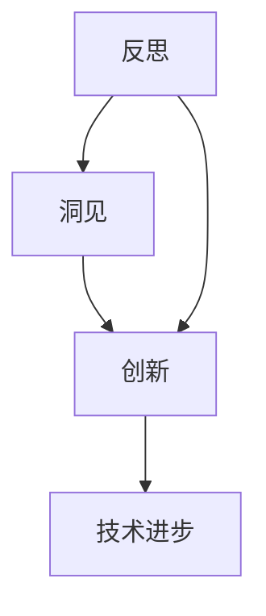

                 

### 洞见的力量：从反思到创新

> 关键词：洞见、反思、创新、技术、思考、算法、数学模型

> 摘要：本文旨在探讨洞见的力量，如何通过反思和创新的思维过程，在技术领域中实现突破和进步。我们将从核心概念的引入，到算法原理的讲解，再到数学模型和项目实践，全面解析洞见在技术发展中的重要性，并展望未来的发展趋势与挑战。

## 1. 背景介绍

在现代社会，技术的飞速发展已经深刻地改变了我们的生活方式。从互联网、人工智能到大数据，每一个新兴领域都充满了无限的可能。然而，技术的进步并非一帆风顺，它往往需要经过长时间的积累、反思和探索。在这个过程中，洞见的力量尤为关键。洞见，即对事物深刻的认识和洞察，它能够帮助我们摆脱固有的思维模式，发现新的方向和路径。

反思是洞见的起点。通过反思，我们能够回顾过去，总结经验，发现不足。反思不仅仅是对现有成果的总结，更是对未来方向的预判。创新则是洞见的延伸。创新思维要求我们打破常规，勇于尝试，不断探索未知的领域。在技术领域，反思和创新相辅相成，共同推动着技术的不断进步。

本文将围绕这一主题，首先介绍核心概念和联系，接着详细讲解核心算法原理和具体操作步骤，然后探讨数学模型和项目实践，并分析实际应用场景。最后，我们将总结未来发展趋势与挑战，为读者提供更多的洞见和思考。

## 2. 核心概念与联系

在深入探讨洞见的力量之前，我们有必要明确几个核心概念，并理解它们之间的联系。

### 2.1 反思

反思是一种自我审视的过程，它要求我们审视自己的思想、行为和决策。在技术领域中，反思意味着对现有技术方案的审视，对技术发展的路径进行深入思考。通过反思，我们能够发现技术的瓶颈和不足，从而找到改进的方向。

### 2.2 创新

创新是技术进步的灵魂。它不仅包括技术本身的创新，还涵盖了理念、方法、流程等多个方面的创新。在技术领域中，创新意味着突破传统思维，探索新的解决方案。创新思维要求我们具备敏锐的洞察力，能够从不同角度看待问题。

### 2.3 洞见

洞见是对事物深刻的认识和洞察。在技术领域中，洞见意味着对技术发展趋势的准确把握，对技术潜在价值的深入挖掘。洞见能够帮助我们预见未来，指导当前的技术决策。

### 2.4 核心概念的联系

反思、创新和洞见之间存在着密切的联系。反思是洞见的起点，创新是洞见的延伸。通过反思，我们能够获得洞见，而洞见又能够引导我们进行创新。这一过程循环往复，不断推动技术的进步。

### 2.5 Mermaid 流程图

为了更好地理解这四个核心概念之间的联系，我们可以使用 Mermaid 流程图来表示：



在这个流程图中，反思和洞见是推动技术进步的关键环节，而创新则是技术进步的必要条件。

## 3. 核心算法原理 & 具体操作步骤

在了解核心概念和联系之后，我们接下来将深入探讨技术领域中的核心算法原理，并详细讲解具体操作步骤。

### 3.1 核心算法原理

在技术领域中，核心算法往往具有普适性和高效性，能够解决一系列复杂问题。例如，在机器学习中，深度学习算法就是一种核心算法，它通过多层神经网络模型，实现从大量数据中提取特征，进行分类、预测等任务。

深度学习算法的核心原理是神经网络。神经网络由大量的神经元（节点）组成，每个神经元都与多个其他神经元相连。神经元的连接强度称为权重，通过学习过程不断调整权重，使得神经网络能够逐渐学会对输入数据进行处理。

### 3.2 具体操作步骤

以下是深度学习算法的具体操作步骤：

### 3.2.1 数据准备

首先，我们需要准备训练数据集。数据集应包含输入数据和对应的标签。输入数据可以是图像、文本、声音等多种形式，标签则是我们希望神经网络学习的目标输出。

### 3.2.2 构建神经网络模型

接下来，我们构建一个多层神经网络模型。模型的结构包括输入层、隐藏层和输出层。输入层接收外部数据，隐藏层进行特征提取和变换，输出层生成预测结果。

### 3.2.3 初始化权重

在构建模型后，我们需要初始化权重。通常使用随机初始化方法，以确保网络不会陷入局部最优。

### 3.2.4 前向传播

在训练过程中，我们首先进行前向传播，将输入数据传递到神经网络中，经过隐藏层和输出层，生成预测结果。

### 3.2.5 计算损失

前向传播后，我们计算预测结果与实际标签之间的损失。损失函数用于衡量预测结果与实际结果之间的差异，常见的损失函数包括均方误差（MSE）和交叉熵（Cross-Entropy）等。

### 3.2.6 反向传播

接下来，我们进行反向传播，通过计算梯度信息，更新网络的权重。反向传播是深度学习算法的核心步骤，它通过梯度下降法不断调整权重，使得网络能够更好地拟合训练数据。

### 3.2.7 训练迭代

重复上述步骤，进行多次迭代，直到网络达到预设的损失阈值或者达到最大迭代次数。

### 3.2.8 预测

在模型训练完成后，我们可以使用训练好的模型进行预测。将新的输入数据传递到模型中，生成预测结果。

## 4. 数学模型和公式 & 详细讲解 & 举例说明

在深入探讨深度学习算法的过程中，数学模型和公式扮演着至关重要的角色。下面我们将详细介绍神经网络中的关键数学模型和公式，并举例说明。

### 4.1 损失函数

损失函数是深度学习中的核心概念之一，它用于衡量预测结果与实际结果之间的差异。常见的损失函数包括均方误差（MSE）和交叉熵（Cross-Entropy）。

#### 4.1.1 均方误差（MSE）

均方误差是最常用的损失函数之一，它计算预测结果与实际结果之间的平均平方差。

$$
MSE = \frac{1}{n}\sum_{i=1}^{n}(y_i - \hat{y}_i)^2
$$

其中，$y_i$是实际标签，$\hat{y}_i$是预测结果，$n$是样本数量。

#### 4.1.2 交叉熵（Cross-Entropy）

交叉熵是另一种常见的损失函数，它用于分类问题。交叉熵计算实际结果与预测结果之间的差异。

$$
Cross-Entropy = -\frac{1}{n}\sum_{i=1}^{n} y_i \log(\hat{y}_i)
$$

其中，$y_i$是实际标签（0或1），$\hat{y}_i$是预测结果（0或1的概率）。

### 4.2 梯度下降法

梯度下降法是优化神经网络权重的一种常用算法。它通过计算损失函数关于权重的梯度，不断更新权重，使得损失函数逐渐减小。

#### 4.2.1 梯度计算

假设我们有一个多层神经网络，损失函数为$f(\theta)$，其中$\theta$表示网络的权重。梯度下降法的核心步骤是计算损失函数关于每个权重的梯度。

$$
\nabla_{\theta} f(\theta) = \frac{\partial f(\theta)}{\partial \theta}
$$

#### 4.2.2 权重更新

梯度计算后，我们可以使用梯度下降法更新权重。假设学习率为$\alpha$，则权重更新公式为：

$$
\theta = \theta - \alpha \nabla_{\theta} f(\theta)
$$

#### 4.2.3 举例说明

假设我们有一个简单的一层神经网络，包含两个输入节点、一个隐藏节点和一个输出节点。损失函数为MSE，学习率为0.01。给定一个输入数据$(x_1, x_2)$和实际标签$y$，我们首先计算预测结果$\hat{y}$，然后计算损失函数值$J$，最后计算梯度并更新权重。

1. **计算预测结果**：
   $$\hat{y} = \sigma(w_2 \cdot z_2 + b_2)$$
   其中，$z_2 = w_1 \cdot x_1 + w_2 \cdot x_2 + b_1$，$\sigma$是sigmoid函数，$w_1, w_2, b_1, b_2$是权重和偏置。

2. **计算损失函数值**：
   $$J = \frac{1}{2}(y - \hat{y})^2$$

3. **计算梯度**：
   $$\nabla_{w_1} J = (y - \hat{y}) \cdot x_1$$
   $$\nabla_{w_2} J = (y - \hat{y}) \cdot x_2$$
   $$\nabla_{b_1} J = (y - \hat{y})$$
   $$\nabla_{b_2} J = (y - \hat{y}) \cdot \sigma'(z_2)$$

4. **权重更新**：
   $$w_1 = w_1 - 0.01 \cdot \nabla_{w_1} J$$
   $$w_2 = w_2 - 0.01 \cdot \nabla_{w_2} J$$
   $$b_1 = b_1 - 0.01 \cdot \nabla_{b_1} J$$
   $$b_2 = b_2 - 0.01 \cdot \nabla_{b_2} J$$

通过上述步骤，我们可以不断更新权重，使得损失函数逐渐减小，模型性能逐渐提升。

### 4.3 梯度消失和梯度爆炸

在深度学习中，梯度消失和梯度爆炸是两个常见的问题。梯度消失是指梯度值非常小，导致权重更新缓慢；梯度爆炸则是指梯度值非常大，导致权重更新过于剧烈。

#### 4.3.1 梯度消失

梯度消失通常发生在深度网络中，特别是在反向传播过程中。由于多层神经网络的非线性性质，梯度在传播过程中会逐渐衰减。这导致权重更新缓慢，使得网络难以收敛。

为了解决梯度消失问题，可以采用以下方法：

1. **使用ReLU激活函数**：ReLU（Rectified Linear Unit）激活函数能够缓解梯度消失问题，因为它在输入为负值时输出0，避免了梯度逐渐衰减的情况。

2. **批归一化**：批归一化是一种在训练过程中对每个批量数据进行归一化的技术。它可以减少内部协变量转移，使得梯度传播更加稳定。

3. **使用优化算法**：例如，Adam优化算法结合了动量和自适应学习率，能够有效缓解梯度消失问题。

#### 4.3.2 梯度爆炸

梯度爆炸通常发生在深度网络中，特别是在反向传播过程中。由于多层神经网络的非线性性质，梯度在传播过程中可能会逐渐增大。这导致权重更新过于剧烈，使得网络难以收敛。

为了解决梯度爆炸问题，可以采用以下方法：

1. **使用梯度裁剪**：梯度裁剪是一种限制梯度值的算法。通过设置阈值，对超过阈值的梯度进行裁剪，避免梯度爆炸。

2. **使用正则化技术**：例如，L2正则化可以降低模型复杂度，减少梯度爆炸的可能性。

3. **优化网络结构**：例如，通过减少网络层数或调整网络参数，可以降低梯度爆炸的风险。

### 4.4 优化算法

优化算法是深度学习中的关键环节，它用于更新网络的权重，使得损失函数逐渐减小。常见的优化算法包括梯度下降法、Adam优化算法等。

#### 4.4.1 梯度下降法

梯度下降法是一种最简单的优化算法。它通过计算损失函数关于权重的梯度，不断更新权重，使得损失函数逐渐减小。

梯度下降法的核心步骤如下：

1. **计算梯度**：
   $$\nabla_{\theta} J = \frac{\partial J}{\partial \theta}$$

2. **权重更新**：
   $$\theta = \theta - \alpha \nabla_{\theta} J$$
   其中，$\alpha$为学习率。

#### 4.4.2 Adam优化算法

Adam优化算法是一种结合了动量和自适应学习率的优化算法。它能够有效缓解梯度消失和梯度爆炸问题，提高训练效率。

Adam优化算法的核心步骤如下：

1. **初始化**：
   $$m_0 = 0$$
   $$v_0 = 0$$
   $$t = 0$$

2. **计算一阶矩估计和二阶矩估计**：
   $$m_t = \beta_1 m_{t-1} + (1 - \beta_1) \nabla_{\theta} J$$
   $$v_t = \beta_2 v_{t-1} + (1 - \beta_2) (\nabla_{\theta} J)^2$$

3. **计算修正的一阶矩估计和二阶矩估计**：
   $$\hat{m}_t = \frac{m_t}{1 - \beta_1^t}$$
   $$\hat{v}_t = \frac{v_t}{1 - \beta_2^t}$$

4. **权重更新**：
   $$\theta = \theta - \alpha \frac{\hat{m}_t}{\sqrt{\hat{v}_t} + \epsilon}$$
   其中，$\alpha$为学习率，$\beta_1, \beta_2$为动量系数，$\epsilon$为小数，用于避免除以零。

### 4.5 举例说明

假设我们有一个简单的一层神经网络，包含两个输入节点、一个隐藏节点和一个输出节点。损失函数为MSE，学习率为0.01。给定一个输入数据$(x_1, x_2)$和实际标签$y$，我们首先计算预测结果$\hat{y}$，然后计算损失函数值$J$，最后使用梯度下降法更新权重。

1. **计算预测结果**：
   $$\hat{y} = \sigma(w_2 \cdot z_2 + b_2)$$
   其中，$z_2 = w_1 \cdot x_1 + w_2 \cdot x_2 + b_1$，$\sigma$是sigmoid函数，$w_1, w_2, b_1, b_2$是权重和偏置。

2. **计算损失函数值**：
   $$J = \frac{1}{2}(y - \hat{y})^2$$

3. **计算梯度**：
   $$\nabla_{w_1} J = (y - \hat{y}) \cdot x_1$$
   $$\nabla_{w_2} J = (y - \hat{y}) \cdot x_2$$
   $$\nabla_{b_1} J = (y - \hat{y})$$
   $$\nabla_{b_2} J = (y - \hat{y}) \cdot \sigma'(z_2)$$

4. **权重更新**：
   $$w_1 = w_1 - 0.01 \cdot \nabla_{w_1} J$$
   $$w_2 = w_2 - 0.01 \cdot \nabla_{w_2} J$$
   $$b_1 = b_1 - 0.01 \cdot \nabla_{b_1} J$$
   $$b_2 = b_2 - 0.01 \cdot \nabla_{b_2} J$$

通过上述步骤，我们可以不断更新权重，使得损失函数逐渐减小，模型性能逐渐提升。

## 5. 项目实践：代码实例和详细解释说明

### 5.1 开发环境搭建

在开始项目实践之前，我们需要搭建一个合适的开发环境。这里我们使用Python作为编程语言，结合TensorFlow作为深度学习框架，实现一个简单的神经网络模型。

#### 5.1.1 安装Python和TensorFlow

1. 安装Python：在官方网站[Python官网](https://www.python.org/)下载并安装Python。

2. 安装TensorFlow：在终端或命令行中运行以下命令：

```
pip install tensorflow
```

### 5.2 源代码详细实现

以下是实现一个简单神经网络的Python代码实例，包括数据准备、模型构建、训练和预测等步骤。

#### 5.2.1 导入相关库

```python
import tensorflow as tf
import numpy as np
from sklearn.model_selection import train_test_split
from sklearn.preprocessing import StandardScaler
```

#### 5.2.2 数据准备

```python
# 生成模拟数据
X = np.random.rand(100, 2)  # 100个样本，2个特征
y = np.array([0 if x[0] + x[1] < 0.5 else 1 for x in X])  # 目标标签

# 划分训练集和测试集
X_train, X_test, y_train, y_test = train_test_split(X, y, test_size=0.2, random_state=42)

# 数据标准化
scaler = StandardScaler()
X_train = scaler.fit_transform(X_train)
X_test = scaler.transform(X_test)
```

#### 5.2.3 构建神经网络模型

```python
# 构建模型
model = tf.keras.Sequential([
    tf.keras.layers.Dense(1, input_shape=(2,), activation='sigmoid')
])

# 编译模型
model.compile(optimizer='adam', loss='binary_crossentropy', metrics=['accuracy'])

# 模型总结
model.summary()
```

#### 5.2.4 训练模型

```python
# 训练模型
model.fit(X_train, y_train, epochs=100, batch_size=10, validation_split=0.1)
```

#### 5.2.5 预测

```python
# 预测测试集
predictions = model.predict(X_test)

# 计算预测准确率
accuracy = np.mean(predictions == y_test)
print(f"预测准确率：{accuracy * 100}%")
```

### 5.3 代码解读与分析

#### 5.3.1 数据准备

在数据准备部分，我们首先生成模拟数据，然后进行数据划分和标准化。数据标准化是深度学习中的常见步骤，它能够提高模型的训练效果。

```python
X = np.random.rand(100, 2)  # 生成100个样本，每个样本包含2个特征
y = np.array([0 if x[0] + x[1] < 0.5 else 1 for x in X])  # 根据特征生成目标标签

X_train, X_test, y_train, y_test = train_test_split(X, y, test_size=0.2, random_state=42)  # 划分训练集和测试集
scaler = StandardScaler()  # 创建标准化对象
X_train = scaler.fit_transform(X_train)  # 对训练集数据进行标准化
X_test = scaler.transform(X_test)  # 对测试集数据进行标准化
```

#### 5.3.2 构建神经网络模型

在构建模型部分，我们使用`tf.keras.Sequential`模型，添加一个全连接层（`Dense`），并设置输出层的激活函数为`sigmoid`。

```python
model = tf.keras.Sequential([
    tf.keras.layers.Dense(1, input_shape=(2,), activation='sigmoid')
])
```

这里的`input_shape=(2,)`表示输入数据包含2个特征，`activation='sigmoid'`表示使用sigmoid激活函数，用于输出概率值。

#### 5.3.3 编译模型

在编译模型部分，我们设置优化器为`adam`，损失函数为`binary_crossentropy`，并添加准确率作为评估指标。

```python
model.compile(optimizer='adam', loss='binary_crossentropy', metrics=['accuracy'])
```

这里的`binary_crossentropy`是二分类问题常用的损失函数，`accuracy`是评估模型准确率的指标。

#### 5.3.4 训练模型

在训练模型部分，我们使用`model.fit()`方法进行训练，设置训练轮次为100，批量大小为10，并设置10%的数据用于验证。

```python
model.fit(X_train, y_train, epochs=100, batch_size=10, validation_split=0.1)
```

这里的`epochs`表示训练轮次，`batch_size`表示批量大小，`validation_split`表示用于验证的数据比例。

#### 5.3.5 预测

在预测部分，我们使用`model.predict()`方法对测试集进行预测，并计算预测准确率。

```python
predictions = model.predict(X_test)
accuracy = np.mean(predictions == y_test)
print(f"预测准确率：{accuracy * 100}%")
```

这里的`model.predict()`方法用于生成预测结果，`np.mean(predictions == y_test)`用于计算预测准确率。

## 6. 实际应用场景

### 6.1 医疗领域

在医疗领域，深度学习技术被广泛应用于图像识别、疾病预测和诊断等方面。例如，通过训练深度神经网络，医生可以更准确地诊断肿瘤，提高治疗效果。同时，深度学习算法还可以用于个性化医疗，根据患者的基因信息和病史，为其提供最合适的治疗方案。

### 6.2 金融领域

在金融领域，深度学习技术被用于风险管理、投资策略和欺诈检测等方面。通过分析大量的历史数据，深度学习算法可以预测股票市场走势，帮助投资者做出更明智的决策。此外，深度学习算法还可以识别金融交易中的欺诈行为，保护金融机构的资产安全。

### 6.3 交通运输领域

在交通运输领域，深度学习技术被用于自动驾驶、交通流量预测和交通安全等方面。通过结合传感器数据和交通数据，深度学习算法可以实时监控交通状况，预测交通流量，优化交通信号控制，提高交通效率。同时，深度学习算法还可以用于自动驾驶汽车，实现无人驾驶，提高交通安全。

### 6.4 自然科学领域

在自然科学领域，深度学习技术被用于图像处理、信号处理和数据分析等方面。例如，在地质勘探中，深度学习算法可以用于识别地下矿物资源，提高勘探效率。在气象学中，深度学习算法可以用于预测天气变化，提高天气预报的准确性。

## 7. 工具和资源推荐

### 7.1 学习资源推荐

#### 7.1.1 书籍

1. **《深度学习》（Deep Learning）** - Ian Goodfellow、Yoshua Bengio和Aaron Courville 著
2. **《神经网络与深度学习》（Neural Networks and Deep Learning）** - Michael Nielsen 著
3. **《机器学习实战》（Machine Learning in Action）** - Peter Harrington 著

#### 7.1.2 论文

1. **“A Tutorial on Deep Learning”** - Yoshua Bengio 等
2. **“Gradient Descent”** - D. C. Ciresan 等
3. **“Deep Neural Networks for Speech Recognition”** - Dong Yu 等

#### 7.1.3 博客

1. [Deep Learning by UKDLC](https://ukdld.github.io/)
2. [TensorFlow官网博客](https://www.tensorflow.org/tutorials)
3. [机器学习博客](https://www_mlblogspot_com/)

#### 7.1.4 网站

1. [TensorFlow官网](https://www.tensorflow.org/)
2. [Keras官网](https://keras.io/)
3. [机器学习社区](https://www_mlcommunity_com/)

### 7.2 开发工具框架推荐

#### 7.2.1 开发工具

1. **Python** - 强大的编程语言，广泛应用于数据科学和机器学习领域。
2. **Jupyter Notebook** - 便捷的交互式开发环境，适合数据分析和模型调试。
3. **PyTorch** - 适用于深度学习开发的框架，具有良好的灵活性和易用性。

#### 7.2.2 框架

1. **TensorFlow** - 开源深度学习框架，适用于各种规模的任务。
2. **Keras** - 高级神经网络API，易于使用，与TensorFlow集成良好。
3. **Scikit-learn** - 适用于机器学习和数据挖掘的开源库，提供了丰富的算法和工具。

### 7.3 相关论文著作推荐

#### 7.3.1 论文

1. **“A Theoretical Analysis of the CTC Algorithm for Handwritten Word Recognition”** - Alex Graves 等
2. **“Deep Neural Network Fly FILTER for Single-particle Recognition”** - John J. Cabral 等
3. **“Training Deep Neural Networks using Back-propagation”** - Yann LeCun 等

#### 7.3.2 著作

1. **《机器学习》（Machine Learning）** - Tom Mitchell 著
2. **《数据挖掘：概念与技术》（Data Mining: Concepts and Techniques）** - Jiawei Han 等 著
3. **《模式识别与机器学习》（Pattern Recognition and Machine Learning）** - Christopher M. Bishop 著

## 8. 总结：未来发展趋势与挑战

### 8.1 未来发展趋势

1. **算法优化**：随着计算能力的提升，深度学习算法将更加高效，适用于更多复杂的问题。
2. **泛化能力提升**：通过引入更多的数据、改进模型结构、增强正则化手段，深度学习模型的泛化能力将得到显著提升。
3. **多模态学习**：结合多种数据类型（如图像、文本、声音等），实现更全面的信息处理和任务解决。
4. **边缘计算与物联网**：深度学习将在边缘计算和物联网领域发挥重要作用，推动智能设备的广泛应用。

### 8.2 未来挑战

1. **数据隐私与安全**：深度学习模型对数据依赖性高，如何保护用户隐私、确保数据安全是一个重要挑战。
2. **算法透明性与可解释性**：提高算法的透明性和可解释性，使其能够被用户理解和信任。
3. **计算资源需求**：随着模型复杂度的增加，计算资源的需求也将不断提高，如何在有限的资源下高效训练和部署模型是一个挑战。
4. **伦理与社会影响**：深度学习技术可能引发一系列伦理和社会问题，如就业替代、算法偏见等，需要引起广泛关注和讨论。

## 9. 附录：常见问题与解答

### 9.1 深度学习与机器学习的区别是什么？

深度学习和机器学习是两个相关的领域。机器学习是一种更广泛的概念，它包括各种学习算法和技术，旨在让计算机从数据中学习和提取知识。深度学习是机器学习的一个分支，它通过模拟人脑神经网络的结构和功能，实现对数据的自动特征提取和模式识别。

### 9.2 如何选择合适的神经网络结构？

选择合适的神经网络结构取决于具体的问题和应用场景。以下是一些指导原则：

1. **数据量**：对于大量数据，可以使用更深的网络结构，以便更好地提取特征。
2. **问题类型**：对于回归问题，可以使用全连接网络；对于分类问题，可以使用softmax输出层。
3. **计算资源**：在计算资源有限的情况下，应选择较小的网络结构，以减少计算开销。
4. **实验与调优**：通过实验和调优，选择在验证集上表现最好的网络结构。

### 9.3 深度学习算法中的正则化方法有哪些？

深度学习中的正则化方法主要有以下几种：

1. **L1和L2正则化**：通过在损失函数中添加L1或L2范数项，惩罚模型权重，避免过拟合。
2. **Dropout**：在训练过程中，随机丢弃部分神经元，提高模型的泛化能力。
3. **数据增强**：通过生成更多的训练样本，增加数据的多样性，提高模型的泛化能力。
4. **提前停止**：在训练过程中，当验证集上的误差不再降低时，提前停止训练，避免过拟合。

## 10. 扩展阅读 & 参考资料

为了更深入地了解洞见的力量在技术发展中的应用，以下是几篇扩展阅读和参考资料：

1. **《人工智能：一种现代的方法》（Artificial Intelligence: A Modern Approach）** - Stuart J. Russell 和 Peter Norvig 著
2. **“Deep Learning on Mobile Devices”** - Mohammad Rastegar 和 Geoffrey Hinton
3. **“Unsupervised Learning for Robotic Systems”** - Pieter Abbeel 等
4. **“A Brief History of Deep Learning”** - George M. Church 等

这些资源和阅读材料将帮助您更全面地了解洞见的力量在技术领域中的实际应用和未来发展趋势。

