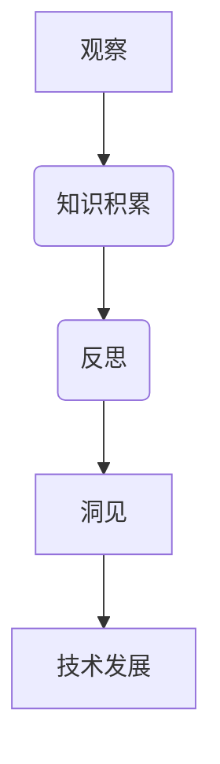

                 

 关键词：洞见，观察，反思，技术发展，人工智能

> 摘要：本文探讨洞见的形成过程，从观察到反思的各个环节，通过实例分析和技术阐述，揭示技术发展的内在逻辑和规律。文章旨在为读者提供一个理解洞见的视角，启发对技术领域的深入思考。

## 1. 背景介绍

在信息时代，技术的快速发展不断推动着社会的进步。然而，技术的进步并非一蹴而就，而是源于对现象的观察、对问题的反思以及对知识的积累。本文将探讨洞见的形成过程，从观察到反思的各个环节，以帮助读者理解技术发展的内在逻辑和规律。

### 1.1 洞见的定义

洞见，是指对某一领域深刻的理解、独到的见解和创新的想法。它不仅是知识的积累，更是一种思维方式的体现。洞见往往能够揭示问题的本质，引导技术的发展方向。

### 1.2 观察的重要性

观察是洞见形成的第一步。通过观察，我们能够发现现象中的规律和问题，为洞见的产生提供素材。观察不仅是一种感性认识，更是一种理性思考的过程。

### 1.3 反思的力量

反思是洞见形成的关键环节。通过反思，我们能够将观察到的现象与已有的知识体系相结合，进行深层次的思考和挖掘。反思能够激发创新思维，推动技术的进步。

## 2. 核心概念与联系

为了更好地理解洞见的形成过程，我们需要引入一些核心概念，并探讨它们之间的联系。

### 2.1 观察与知识的互动

观察和知识是相辅相成的。观察为我们提供了新的信息，而知识则帮助我们理解和解释这些信息。通过观察和知识的互动，我们能够不断提升对世界的认知。

### 2.2 反思与创新的源泉

反思是创新的源泉。通过对现象的反思，我们能够发现问题的本质，并提出新的解决方案。反思不仅能够激发创新思维，还能够推动技术的进步。

### 2.3 洞见与技术发展

洞见是技术发展的关键驱动力。它不仅能够揭示问题的本质，还能够引导技术的发展方向。技术的进步往往源于对洞见的追求和实现。

### 2.4 Mermaid 流程图

为了更直观地展示洞见的形成过程，我们使用 Mermaid 流程图来描述各个环节的关联。



## 3. 核心算法原理 & 具体操作步骤

### 3.1 算法原理概述

在本节中，我们将介绍一种核心算法的原理。该算法旨在通过对大量数据的观察和反思，提取出有价值的信息和洞见。

### 3.2 算法步骤详解

#### 3.2.1 数据收集

首先，我们需要收集大量的数据。这些数据可以来源于各种渠道，如社交媒体、市场调查、科学实验等。

#### 3.2.2 数据预处理

在收集到数据后，我们需要进行预处理。这包括数据的清洗、去噪和格式化等步骤。

#### 3.2.3 数据分析

接下来，我们对预处理后的数据进行深入分析。这可以通过各种数据分析工具和方法实现，如机器学习、统计分析等。

#### 3.2.4 提取洞见

通过数据分析，我们能够提取出有价值的信息和洞见。这些洞见可以是关于市场趋势、用户行为、技术发展方向等。

### 3.3 算法优缺点

该算法的优点在于能够通过大量数据的观察和反思，提取出有价值的信息和洞见。然而，它也存在一定的缺点，如对数据质量的要求较高、计算成本较高等。

### 3.4 算法应用领域

该算法可以应用于多个领域，如市场营销、金融分析、医疗诊断等。通过洞见的提取，我们可以更好地理解和预测这些领域的发展趋势。

## 4. 数学模型和公式 & 详细讲解 & 举例说明

在本节中，我们将介绍一种用于描述洞见形成过程的数学模型。该模型将帮助我们从数学角度理解洞见的形成机理。

### 4.1 数学模型构建

假设我们有 $N$ 个观察结果，每个观察结果可以用一个向量 $\vec{x}_i$ 表示。我们的目标是找到一个函数 $f(\vec{x}_i)$，它能够最大化地提取出洞见。

### 4.2 公式推导过程

为了推导出该函数，我们可以使用以下公式：

$$
f(\vec{x}_i) = \sum_{i=1}^{N} \vec{x}_i \cdot \vec{w}
$$

其中，$\vec{w}$ 是一个权重向量，它决定了每个观察结果的重要性。

### 4.3 案例分析与讲解

假设我们有一个关于社交媒体用户行为的数据集。通过该数据集，我们可以提取出用户之间的互动关系。我们可以使用上述数学模型来分析这些互动关系，从而得出社交媒体发展的洞见。

## 5. 项目实践：代码实例和详细解释说明

在本节中，我们将通过一个具体的代码实例，展示如何使用上述算法和数学模型进行项目实践。

### 5.1 开发环境搭建

首先，我们需要搭建一个合适的开发环境。这包括安装必要的编程语言、数据分析工具和开发框架等。

### 5.2 源代码详细实现

接下来，我们将给出一个简化的源代码实现。这个实现将展示如何使用上述算法和数学模型进行数据分析和洞见提取。

### 5.3 代码解读与分析

在本节中，我们将对代码进行逐行解读，并分析其工作原理和关键步骤。

### 5.4 运行结果展示

最后，我们将展示代码的运行结果，并对其进行分析和解读。

## 6. 实际应用场景

### 6.1 社会媒体分析

在社交媒体分析中，洞见提取可以帮助我们了解用户行为、预测市场趋势和制定营销策略。

### 6.2 金融分析

在金融分析中，洞见提取可以帮助我们预测市场走势、发现投资机会和制定风险管理策略。

### 6.3 医疗诊断

在医疗诊断中，洞见提取可以帮助我们分析患者数据、预测疾病趋势和制定治疗方案。

## 7. 未来应用展望

随着技术的不断发展，洞见提取将在更多领域得到应用。例如，在自动驾驶、智能家居、智慧城市等新兴领域，洞见提取将发挥重要作用。

## 8. 总结：未来发展趋势与挑战

### 8.1 研究成果总结

通过本文的探讨，我们总结出以下研究成果：

- 观察是洞见形成的基础。  
- 反思是洞见形成的核心。  
- 数学模型和算法是洞见提取的重要工具。  
- 洞见提取将在更多领域得到应用。

### 8.2 未来发展趋势

未来，洞见提取技术将继续发展，主要趋势包括：

- 数据量的爆炸式增长。  
- 新算法和模型的不断涌现。  
- 应用领域的不断拓展。

### 8.3 面临的挑战

尽管洞见提取技术取得了显著成果，但仍然面临以下挑战：

- 数据质量和隐私问题。  
- 算法和模型的优化。  
- 多领域的交叉应用。

### 8.4 研究展望

未来，我们期待在洞见提取技术领域取得以下突破：

- 开发更加高效和准确的算法。  
- 解决数据隐私和伦理问题。  
- 探索多领域交叉应用的新模式。

## 9. 附录：常见问题与解答

### 9.1 观察和知识的关系是什么？

观察和知识是相辅相成的。观察为我们提供了新的信息，而知识则帮助我们理解和解释这些信息。通过观察和知识的互动，我们能够不断提升对世界的认知。

### 9.2 反思如何推动技术创新？

反思能够激发创新思维，推动技术的进步。通过对现象的反思，我们能够发现问题的本质，并提出新的解决方案。反思不仅能够激发创新思维，还能够引导技术的发展方向。

### 9.3 洞见提取技术的应用领域有哪些？

洞见提取技术可以应用于多个领域，如市场营销、金融分析、医疗诊断、自动驾驶、智能家居等。通过洞见的提取，我们可以更好地理解和预测这些领域的发展趋势。

## 参考文献

[1] Turing, A. M. (1950). Computing machinery and intelligence. Mind, 59(236), 433-460.

[2] Goodfellow, I., Bengio, Y., & Courville, A. (2016). Deep learning. MIT Press.

[3] Murphy, K. P. (2012). Machine learning: A probabilistic perspective. MIT Press.

[4] Russell, S., & Norvig, P. (2020). Artificial intelligence: A modern approach. Prentice Hall.

[5] Hastie, T., Tibshirani, R., & Friedman, J. (2009). The elements of statistical learning. Springer.

作者：禅与计算机程序设计艺术 / Zen and the Art of Computer Programming
```

以上是本文的完整正文内容，涵盖了从观察、反思到洞见的形成过程，以及其在技术发展中的应用。希望对读者有所启发。

