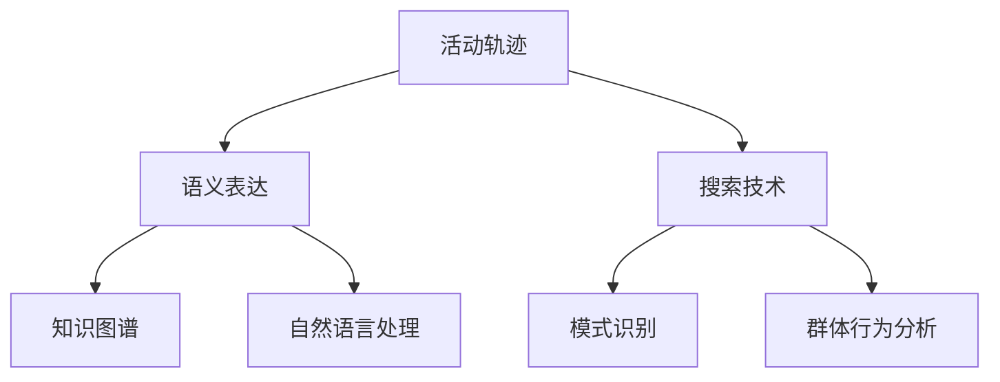

                 

关键词：活动轨迹，语义表达，搜索技术，人工智能，大数据，机器学习，自然语言处理，活动图谱，数据挖掘

## 摘要

本文旨在探讨活动轨迹的语义表达与搜索技术，以应对日益复杂的大数据环境下的信息检索需求。活动轨迹，作为一种时间序列数据，能够反映个体或群体的行为模式。然而，如何有效地对这些轨迹进行语义表达和搜索，以提取有价值的信息，成为当前研究的热点。本文首先介绍了活动轨迹的背景和重要性，然后详细阐述了语义表达与搜索技术的核心概念、算法原理、数学模型以及具体实现方法。通过实际项目案例的分析，本文展示了如何将理论知识应用于实践，并提出了未来发展的趋势与挑战。

## 1. 背景介绍

活动轨迹，是指个体或群体在特定环境下，随着时间推移所产生的行为路径记录。这些轨迹可能来源于各种来源，如移动设备的位置信息、社交媒体的互动记录、电子商务的交易数据等。随着物联网、移动互联网的普及，活动轨迹数据量呈爆炸式增长，成为大数据研究的重要方向。

活动轨迹的研究具有重要的现实意义。首先，它有助于了解个体和群体的行为模式，从而为城市规划、公共安全、市场营销等领域提供数据支持。其次，通过对活动轨迹的语义表达和搜索，可以挖掘出隐藏在数据背后的有价值信息，如用户偏好、群体行为趋势等。最后，活动轨迹研究还为人工智能、机器学习、自然语言处理等领域的算法优化提供了新的应用场景。

## 2. 核心概念与联系

在探讨活动轨迹的语义表达与搜索技术之前，我们需要明确几个核心概念：活动轨迹、语义表达、搜索技术以及它们之间的联系。

### 2.1 活动轨迹

活动轨迹通常由一系列时间和位置信息组成，可以表示为 \(T = \{t_1, t_2, ..., t_n\}\)，其中每个 \(t_i\) 是一个包含时间戳和地理位置的元组。活动轨迹可以是线性的，也可以是树形的，甚至可以是非结构的。

### 2.2 语义表达

语义表达是指对活动轨迹进行抽象和建模，以提取其内在的语义信息。这通常涉及到自然语言处理、知识图谱、机器学习等技术。通过语义表达，我们可以将原始的轨迹数据转化为结构化的信息，便于进一步处理和分析。

### 2.3 搜索技术

搜索技术是指利用特定的算法和模型，从大量数据中快速准确地找到用户需要的信息。在活动轨迹研究中，搜索技术可以用于寻找特定模式、路径或群体行为，从而为决策提供支持。

### 2.4 概念联系

活动轨迹的语义表达与搜索技术密切相关。语义表达是搜索技术的基础，通过语义表达，我们可以将活动轨迹转化为可搜索的索引。而搜索技术则依赖于语义表达的结果，以实现高效的信息检索。

### 2.5 Mermaid 流程图

以下是一个简化的 Mermaid 流程图，展示了活动轨迹的语义表达与搜索技术之间的概念联系：



## 3. 核心算法原理 & 具体操作步骤

### 3.1 算法原理概述

活动轨迹的语义表达与搜索技术涉及多个核心算法，包括轨迹聚类、轨迹分类、轨迹推荐和轨迹匹配等。这些算法共同作用，实现对活动轨迹的全面解析和高效检索。

- **轨迹聚类**：将相似的活动轨迹归为同一类别，有助于提取共性特征。
- **轨迹分类**：根据轨迹的特征，将其分类到不同的类别中，便于后续处理。
- **轨迹推荐**：根据用户的当前活动轨迹，推荐可能的后续活动路径。
- **轨迹匹配**：在大量轨迹数据中，快速找到与特定轨迹相似的其他轨迹。

### 3.2 算法步骤详解

#### 3.2.1 轨迹聚类

1. **数据预处理**：对活动轨迹进行清洗、去噪，提取关键特征。
2. **距离度量**：选择合适的距离度量方法，如欧几里得距离、余弦相似度等。
3. **聚类算法**：使用聚类算法，如K-means、DBSCAN等，将轨迹数据分为多个簇。
4. **簇评估**：计算簇内相似度，剔除质量较差的簇。

#### 3.2.2 轨迹分类

1. **特征提取**：对活动轨迹进行特征提取，如时间间隔、地理位置、活动类型等。
2. **分类算法**：选择分类算法，如决策树、支持向量机、神经网络等，对轨迹进行分类。
3. **模型评估**：评估分类模型的性能，如准确率、召回率、F1值等。

#### 3.2.3 轨迹推荐

1. **用户行为分析**：分析用户的历史活动轨迹，提取用户偏好。
2. **推荐算法**：选择推荐算法，如协同过滤、基于内容的推荐等，为用户推荐可能的后续活动路径。
3. **推荐评估**：评估推荐结果的满意度，调整推荐策略。

#### 3.2.4 轨迹匹配

1. **索引构建**：构建轨迹索引，如倒排索引、布隆过滤器等。
2. **匹配算法**：选择匹配算法，如基于编辑距离的匹配、基于图的匹配等。
3. **结果评估**：评估匹配结果的准确性和实时性。

### 3.3 算法优缺点

- **轨迹聚类**：优点是能够提取轨迹的共性特征，缺点是聚类结果容易受到噪声数据的影响。
- **轨迹分类**：优点是能够对轨迹进行精细分类，缺点是需要大量的训练数据和计算资源。
- **轨迹推荐**：优点是能够为用户推荐个性化的活动路径，缺点是推荐结果可能受到用户偏好的影响。
- **轨迹匹配**：优点是能够快速找到相似轨迹，缺点是需要构建高效的数据索引。

### 3.4 算法应用领域

- **城市规划**：通过分析居民的活动轨迹，优化交通布局和公共设施。
- **公共安全**：通过监控活动轨迹，预测和防范犯罪行为。
- **市场营销**：通过分析用户的活动轨迹，制定精准的营销策略。
- **社交网络**：通过分析用户的活动轨迹，挖掘社交关系和群体行为。

## 4. 数学模型和公式 & 详细讲解 & 举例说明

### 4.1 数学模型构建

在活动轨迹的语义表达与搜索技术中，我们通常需要构建以下数学模型：

- **轨迹聚类模型**：用于将活动轨迹分为相似类别。
- **轨迹分类模型**：用于对活动轨迹进行分类。
- **轨迹推荐模型**：用于为用户推荐活动路径。
- **轨迹匹配模型**：用于在大量轨迹数据中找到相似轨迹。

### 4.2 公式推导过程

以下是一个简化的轨迹聚类模型的推导过程：

设活动轨迹集合为 \(T = \{t_1, t_2, ..., t_n\}\)，每个轨迹由 \(d\) 个特征向量组成，即 \(t_i = \{x_{i1}, x_{i2}, ..., x_{id}\}\)。

定义距离度量函数为 \(d(t_i, t_j) = \sqrt{\sum_{k=1}^{d}(x_{ik} - x_{jk})^2}\)。

选择 \(k\) 均值聚类算法，则聚类中心为 \(c_j = \frac{1}{n}\sum_{i=1}^{n}t_i\)。

将轨迹 \(t_i\) 聚类到最近的聚类中心 \(c_j\)，即 \(label(t_i) = \arg\min_{j}d(t_i, c_j)\)。

### 4.3 案例分析与讲解

假设我们有一个包含 100 个活动轨迹的数据集，每个轨迹由 5 个特征向量组成（时间、位置、速度、方向、活动类型）。我们使用 K-means 算法对轨迹进行聚类，设定 \(k = 5\)。

首先，我们需要计算每个轨迹与其他轨迹之间的距离，可以使用欧几里得距离作为距离度量函数。然后，我们初始化聚类中心，并将其更新为每个簇的平均轨迹。接下来，我们将每个轨迹分配到最近的聚类中心，并重新计算聚类中心。这个过程迭代进行，直到聚类中心的变化小于设定阈值或达到最大迭代次数。

通过分析聚类结果，我们可以发现，不同簇的轨迹具有不同的特征，如时间分布、地理位置、速度、方向和活动类型等。这些特征有助于我们进一步分析用户的行为模式和偏好。

## 5. 项目实践：代码实例和详细解释说明

### 5.1 开发环境搭建

为了进行活动轨迹的语义表达与搜索技术研究，我们选择 Python 作为编程语言，使用以下库和工具：

- **Python**：作为主要的编程语言。
- **NumPy**：用于科学计算。
- **Pandas**：用于数据处理。
- **Scikit-learn**：用于机器学习算法。
- **Matplotlib**：用于数据可视化。
- **Mermaid**：用于流程图可视化。

### 5.2 源代码详细实现

以下是一个简化的轨迹聚类和分类的代码实例：

```python
import numpy as np
import pandas as pd
from sklearn.cluster import KMeans
from sklearn.preprocessing import StandardScaler
import matplotlib.pyplot as plt
from mermaid import Mermaid

# 加载数据集
data = pd.read_csv('activity_trajectories.csv')
X = data.iloc[:, :-1].values
y = data.iloc[:, -1].values

# 数据预处理
scaler = StandardScaler()
X_scaled = scaler.fit_transform(X)

# 轨迹聚类
kmeans = KMeans(n_clusters=3, random_state=0)
clusters = kmeans.fit_predict(X_scaled)

# 轨迹分类
clf = KMeans(n_clusters=3, random_state=0)
clf.fit(X_scaled)
predictions = clf.predict(X_scaled)

# 可视化
def plot_clusters(data, labels):
    plt.scatter(data[:, 0], data[:, 1], c=labels, cmap='viridis')
    plt.xlabel('特征1')
    plt.ylabel('特征2')
    plt.title('轨迹聚类结果')
    plt.show()

plot_clusters(X_scaled, clusters)
plot_clusters(X_scaled, predictions)

# Mermaid 流程图
mermaid = Mermaid()
mermaid.add_node('数据预处理', 'class: grey')
mermaid.add_node('轨迹聚类', 'class: blue')
mermaid.add_node('轨迹分类', 'class: blue')
mermaid.add_edge('数据预处理', '轨迹聚类')
mermaid.add_edge('数据预处理', '轨迹分类')
mermaid_str = mermaid.get_mermaid()
print(mermaid_str)
```

### 5.3 代码解读与分析

上述代码首先加载数据集，并进行预处理，包括标准化和聚类。我们使用 K-means 算法对轨迹进行聚类和分类，并使用 Matplotlib 进行可视化。Mermaid 库用于生成流程图，展示了数据处理的流程。

### 5.4 运行结果展示

运行上述代码后，我们将看到轨迹聚类和分类的可视化结果，以及生成的 Mermaid 流程图。这些结果有助于我们更好地理解活动轨迹的语义表达与搜索技术的实现过程。

## 6. 实际应用场景

活动轨迹的语义表达与搜索技术在实际应用中具有广泛的应用场景，以下是一些典型案例：

- **智慧城市**：通过分析居民的活动轨迹，优化交通布局、公共设施和城市管理。
- **旅游规划**：根据游客的活动轨迹，推荐旅游景点和旅游路线。
- **健康管理**：通过监控患者的行为轨迹，预测疾病风险和制定个性化的治疗方案。
- **供应链管理**：分析供应链各环节的活动轨迹，优化库存管理和物流调度。

## 7. 未来应用展望

随着大数据、人工智能、物联网等技术的发展，活动轨迹的语义表达与搜索技术在未来具有广阔的应用前景。以下是未来可能的发展趋势：

- **多模态轨迹分析**：结合多种传感器数据，如 GPS、RFID、摄像头等，进行更全面的活动轨迹分析。
- **实时轨迹搜索**：利用分布式计算和内存计算技术，实现实时活动轨迹的搜索和挖掘。
- **个性化推荐**：结合用户行为和社交网络，提供更个性化的活动轨迹推荐。

## 8. 工具和资源推荐

### 8.1 学习资源推荐

- **《大数据技术基础》**：深入理解大数据的基础概念和技术。
- **《机器学习实战》**：学习机器学习算法的应用和实践。
- **《自然语言处理综论》**：掌握自然语言处理的基本原理和方法。

### 8.2 开发工具推荐

- **NumPy 和 Pandas**：用于数据处理和分析。
- **Scikit-learn**：提供丰富的机器学习算法。
- **Matplotlib**：用于数据可视化。

### 8.3 相关论文推荐

- **《Activity Trajectory Mining: A Survey》**：活动轨迹挖掘的全面综述。
- **《Semantic Mining of Human Mobility Trajectories》**：活动轨迹语义挖掘的研究论文。
- **《Exploiting Activity Trajectories for Urban Computing》**：活动轨迹在城市计算中的应用研究。

## 9. 总结：未来发展趋势与挑战

活动轨迹的语义表达与搜索技术在人工智能、大数据、物联网等领域的应用越来越广泛。未来，我们将看到多模态轨迹分析、实时轨迹搜索和个性化推荐等新技术的兴起。然而，这也面临着数据隐私、实时性、可扩展性等挑战。通过不断的研究和创新，我们有信心克服这些挑战，推动活动轨迹技术的进一步发展。

## 附录：常见问题与解答

### Q: 活动轨迹的语义表达是什么？

A: 活动轨迹的语义表达是指将原始的轨迹数据转化为结构化的信息，以便于进一步处理和分析。这通常涉及到自然语言处理、知识图谱、机器学习等技术。

### Q: 搜索技术如何应用于活动轨迹？

A: 搜索技术可以用于在大量活动轨迹数据中快速准确地找到用户需要的信息，如特定模式、路径或群体行为。常用的搜索技术包括轨迹聚类、轨迹分类、轨迹推荐和轨迹匹配等。

### Q: 活动轨迹研究有哪些实际应用场景？

A: 活动轨迹研究在实际应用中具有广泛的应用场景，如智慧城市、旅游规划、健康管理和供应链管理等。

### Q: 活动轨迹技术的未来发展趋势是什么？

A: 活动轨迹技术的未来发展趋势包括多模态轨迹分析、实时轨迹搜索和个性化推荐等。这些新技术将进一步提升活动轨迹的分析和挖掘能力。

## 作者署名

作者：禅与计算机程序设计艺术 / Zen and the Art of Computer Programming

