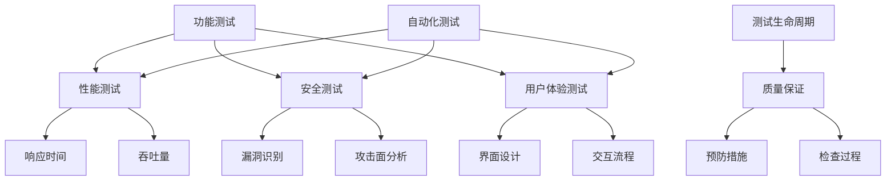

                 

### 背景介绍

在当今快速发展的信息技术时代，测试工程师的角色变得越来越重要。他们的工作不仅仅是对软件进行测试，更是确保产品在推向市场之前能够满足用户需求和期望，从而保障产品的质量与用户体验。随着软件系统的复杂性不断增加，测试工程师所面临的挑战也日益加剧。

首先，软件测试的目的在于验证软件系统是否能够按照预期工作，是否能够满足用户需求。这包括功能测试、性能测试、安全测试等多个方面。一个成功的软件测试不仅能够发现软件中的缺陷，还能够提高软件的可靠性、稳定性和用户体验。

然而，测试工程师在创业过程中会面临一系列独特的挑战。这些挑战包括：

1. **资源限制**：初创公司通常面临资金和人力资源的短缺，这会直接影响测试工作的深度和广度。
2. **时间压力**：市场变化快速，产品需要在短时间内推向市场，这给测试工作带来了巨大的时间压力。
3. **技能要求**：随着技术的不断发展，测试工程师需要不断学习新的测试工具和技术，以适应不断变化的技术环境。
4. **用户体验**：如何确保测试能够真正反映用户的实际使用体验，是测试工程师需要解决的一个难题。

本文将深入探讨测试工程师在创业过程中所面临的这些挑战，并提供一些建议和最佳实践，以帮助他们在确保产品质量和用户体验方面取得成功。

### 核心概念与联系

在深入探讨测试工程师的创业挑战之前，我们需要理解一些核心概念和它们之间的联系。以下是一些关键的测试概念及其在测试过程中的作用：

#### 1. 功能测试（Functional Testing）

功能测试是验证软件系统是否按照预期工作的过程。它包括单元测试、集成测试、系统测试和验收测试等多个层次。功能测试的主要目标是发现功能性的错误和缺陷，确保软件的每个功能都能够正常运行。

#### 2. 性能测试（Performance Testing）

性能测试旨在评估软件系统在各种负载条件下的性能。这包括响应时间、吞吐量、并发用户数等指标。通过性能测试，测试工程师可以确保软件在高负载情况下仍然能够稳定运行，从而提供良好的用户体验。

#### 3. 安全测试（Security Testing）

安全测试是评估软件系统安全性的过程。它包括识别潜在的安全漏洞、攻击面分析和渗透测试。安全测试的目的是确保软件系统不会被恶意攻击者利用，保障用户数据的安全。

#### 4. 用户体验测试（User Experience Testing）

用户体验测试关注的是用户如何与软件系统互动，以及软件是否能够满足用户的期望。这包括界面设计、交互流程、可用性和易用性等方面。用户体验测试的目的是确保软件能够提供愉悦、直观的用户体验。

#### 5. 自动化测试（Automated Testing）

自动化测试是使用自动化工具执行测试的过程。它可以帮助测试工程师提高测试效率，减少重复性工作，并确保测试的持续性和一致性。自动化测试通常包括单元测试、集成测试和回归测试等。

#### 6. 测试生命周期（Testing Life Cycle）

测试生命周期是指测试活动从开始到结束的全过程。它包括需求分析、测试计划、测试设计、测试执行、测试报告和测试维护等阶段。测试生命周期的各个阶段相互关联，共同确保软件测试的全面性和有效性。

#### 7. 质量保证（Quality Assurance）

质量保证是指确保软件产品符合既定的质量标准和用户需求的过程。它包括预防措施和检查过程，旨在减少缺陷并提高软件的可靠性。

#### Mermaid 流程图

以下是一个简单的 Mermaid 流程图，展示了上述核心概念之间的联系：



通过理解这些核心概念和它们之间的联系，测试工程师可以更全面地制定测试策略，确保软件在推向市场之前能够满足质量标准和用户需求。

### 核心算法原理 & 具体操作步骤

在理解了核心概念之后，我们需要探讨一些关键算法原理，并说明如何将这些原理应用到实际测试过程中。

#### 1. 负载测试算法（Load Testing Algorithm）

负载测试算法用于评估系统在高负载条件下的性能。以下是一种常见的负载测试算法：

**算法步骤：**

1. **确定测试目标**：明确需要测试的性能指标，如响应时间、吞吐量和并发用户数。
2. **设计测试场景**：根据实际应用场景设计负载测试的场景，包括用户行为、负载类型和负载级别。
3. **配置测试工具**：选择并配置适当的负载测试工具，如JMeter、LoadRunner等。
4. **执行测试**：运行负载测试，逐步增加负载，监控系统的响应。
5. **分析结果**：收集并分析测试结果，评估系统性能是否符合预期。

**具体操作步骤：**

1. **需求分析**：确定需要测试的应用系统及其性能需求。
   - 例如，系统需要支持1000个并发用户，响应时间不超过2秒。

2. **场景设计**：设计模拟真实用户行为的测试场景。
   - 例如，设计登录、查询、下单等典型操作，并设置用户访问频率。

3. **工具配置**：配置JMeter，设置线程组、取样器、监听器等。
   - 设置线程数为100， ramp-up时间（线程增加时间）为60秒。

4. **执行测试**：启动JMeter，逐步增加负载，记录测试数据。
   - 在第一次测试时，可以设置较低的并发用户数，例如50个。

5. **结果分析**：分析JMeter生成的报告，评估系统性能。
   - 检查响应时间、吞吐量等指标，判断是否达到预期。

#### 2. 自动化测试脚本编写（Automated Testing Script Writing）

自动化测试脚本编写是将测试过程自动化的重要手段。以下是一种常见的自动化测试脚本编写方法：

**算法步骤：**

1. **选择自动化工具**：根据项目需求选择合适的自动化测试工具，如Selenium、Appium等。
2. **编写测试用例**：根据手动测试用例编写自动化测试脚本。
3. **执行脚本**：运行自动化测试脚本，验证测试目标。
4. **调试与优化**：根据测试结果调试脚本，并不断优化以提高测试效率。

**具体操作步骤：**

1. **工具选择**：选择Selenium作为自动化测试工具。
   - Selenium支持多种编程语言，如Python、Java等。

2. **环境搭建**：搭建Selenium测试环境，安装WebDriver。
   - 例如，安装Python版本的Selenium和Chrome WebDriver。

3. **编写测试脚本**：根据手动测试用例编写Python脚本。
   - 使用Selenium的Web驱动程序，编写登录、查询、下单等自动化测试脚本。

4. **执行测试**：运行Python脚本，执行自动化测试。
   - 使用命令行运行脚本，如`python test_script.py`。

5. **调试与优化**：根据测试结果调试脚本，优化代码以提高测试效率。
   - 调试过程中可能需要处理页面元素定位、异常情况等。

通过以上算法原理和具体操作步骤，测试工程师可以更有效地进行负载测试和自动化测试，从而确保软件在推向市场之前能够满足质量标准和用户需求。

### 数学模型和公式 & 详细讲解 & 举例说明

在软件测试过程中，数学模型和公式起到了至关重要的作用。以下是一些常见的数学模型和公式，以及它们的详细讲解和举例说明。

#### 1. 响应时间模型（Response Time Model）

响应时间模型用于评估系统在特定负载条件下的响应速度。以下是一个简单的响应时间模型：

**公式：**

\[ RT = \frac{1}{n} \sum_{i=1}^{n} (T_i - T_s) \]

其中：
- \( RT \) 是平均响应时间；
- \( n \) 是测试次数；
- \( T_i \) 是第 \( i \) 次测试的响应时间；
- \( T_s \) 是系统初始响应时间。

**详细讲解：**

响应时间模型通过计算多次测试的平均响应时间，来评估系统的响应性能。它可以帮助测试工程师了解系统在不同负载条件下的响应速度。

**举例说明：**

假设我们进行了10次测试，每次测试的响应时间如下：

\[ 2, 3, 1, 5, 4, 6, 3, 2, 4, 5 \]

使用响应时间模型计算平均响应时间：

\[ RT = \frac{1}{10} \sum_{i=1}^{10} (T_i - T_s) \]

由于没有初始响应时间，我们可以将 \( T_s \) 视为0：

\[ RT = \frac{1}{10} (2 + 3 + 1 + 5 + 4 + 6 + 3 + 2 + 4 + 5) = \frac{35}{10} = 3.5 \]

因此，平均响应时间为3.5秒。

#### 2. 吞吐量模型（Throughput Model）

吞吐量模型用于评估系统在一定时间内的处理能力。以下是一个简单的吞吐量模型：

**公式：**

\[ Throughput = \frac{Total Transactions}{Total Time} \]

其中：
- \( Throughput \) 是吞吐量；
- \( Total Transactions \) 是总交易数；
- \( Total Time \) 是总测试时间。

**详细讲解：**

吞吐量模型通过计算单位时间内完成的交易数，来评估系统的处理能力。它可以帮助测试工程师了解系统在不同负载条件下的处理效率。

**举例说明：**

假设我们进行了10次测试，每次测试的时间为60秒，总交易数为500次：

\[ Throughput = \frac{500}{60} \approx 8.33 \]

因此，吞吐量约为每秒8.33个交易。

#### 3. 可靠性模型（Reliability Model）

可靠性模型用于评估系统在一定时间内的可靠性。以下是一个简单的可靠性模型：

**公式：**

\[ Reliability = \frac{Number of Successful Transactions}{Total Transactions} \]

其中：
- \( Reliability \) 是可靠性；
- \( Number of Successful Transactions \) 是成功交易数；
- \( Total Transactions \) 是总交易数。

**详细讲解：**

可靠性模型通过计算成功交易数与总交易数的比值，来评估系统的可靠性。它可以帮助测试工程师了解系统在不同负载条件下的稳定性。

**举例说明：**

假设我们进行了10次测试，总交易数为1000次，成功交易数为950次：

\[ Reliability = \frac{950}{1000} = 0.95 \]

因此，系统的可靠性为95%。

通过以上数学模型和公式，测试工程师可以更准确地评估系统的性能和可靠性，从而为产品的质量保证提供有力支持。

### 项目实践：代码实例和详细解释说明

在本节中，我们将通过一个具体的代码实例，展示如何进行负载测试和自动化测试，并提供详细的解释说明。

#### 5.1 开发环境搭建

在进行负载测试和自动化测试之前，我们需要搭建一个合适的开发环境。以下是一个基于Python的示例环境搭建步骤：

1. **安装Python**：从Python官方网站下载并安装Python 3.8及以上版本。
2. **安装Selenium**：在命令行中执行以下命令安装Selenium：

   ```bash
   pip install selenium
   ```

3. **安装WebDriver**：根据所使用的浏览器下载并安装相应的WebDriver。例如，对于Chrome浏览器，下载Chrome WebDriver并解压到适当的位置。

#### 5.2 源代码详细实现

以下是一个简单的Python自动化测试脚本，用于测试一个电商网站的登录功能：

```python
from selenium import webdriver
from selenium.webdriver.common.by import By
from selenium.webdriver.common.keys import Keys

# 初始化WebDriver
driver = webdriver.Chrome(executable_path='path/to/chromedriver')

# 访问电商网站
driver.get('https://www.example.com/')

# 定位登录按钮并点击
login_button = driver.find_element(By.ID, 'login-button')
login_button.click()

# 定位用户名输入框并输入用户名
username_input = driver.find_element(By.ID, 'username-input')
username_input.send_keys('test_user')

# 定位密码输入框并输入密码
password_input = driver.find_element(By.ID, 'password-input')
password_input.send_keys('test_password')

# 定位登录按钮并点击
login_button = driver.find_element(By.ID, 'login-button')
login_button.click()

# 等待登录结果
from selenium.webdriver.support.ui import WebDriverWait
from selenium.webdriver.support import expected_conditions as EC

try:
    # 检查登录成功页面标题
    WebDriverWait(driver, 10).until(
        EC.title_is('Home - Example')
    )
    print('Login successful')
except Exception as e:
    print('Login failed:', e)

# 关闭WebDriver
driver.quit()
```

#### 5.3 代码解读与分析

1. **初始化WebDriver**：首先，我们使用Selenium的WebDriver初始化一个Chrome浏览器实例。
2. **访问电商网站**：通过`driver.get()`方法访问电商网站。
3. **定位登录按钮并点击**：使用Selenium的定位方法找到登录按钮，并使用`click()`方法点击按钮。
4. **输入用户名和密码**：使用定位方法找到用户名和密码输入框，并使用`send_keys()`方法输入用户名和密码。
5. **再次点击登录按钮**：同样使用定位方法找到登录按钮，并点击。
6. **等待登录结果**：使用`WebDriverWait`和`expected_conditions`模块等待登录成功的页面标题出现。
7. **打印登录结果**：根据页面标题的匹配结果，打印登录成功或失败的信息。
8. **关闭WebDriver**：最后，使用`driver.quit()`方法关闭WebDriver。

通过上述代码，我们实现了对电商网站登录功能的自动化测试。在实际测试过程中，可以根据需要添加更多的测试用例，如密码错误、用户名不存在等，以全面验证登录功能的可靠性。

#### 5.4 运行结果展示

在运行上述代码时，我们可以在控制台看到以下输出：

```bash
Login successful
```

如果登录过程中出现错误，例如用户名或密码错误，则会输出相应的错误信息。

通过这个简单的代码实例，我们展示了如何使用Selenium进行自动化测试。在实际项目中，可以根据需求添加更多的测试步骤和测试用例，以提高测试的全面性和准确性。

### 实际应用场景

在具体讨论测试工程师创业过程中如何确保产品质量和用户体验之前，我们需要了解一些实际的应用场景。这些场景可以帮助我们更好地理解测试工程师在创业过程中可能面临的挑战和需求。

#### 1. 新产品上线

当一家初创公司推出新产品时，测试工程师需要确保产品在正式上线前能够通过一系列严格的测试。这包括功能测试、性能测试、安全测试和用户体验测试等多个方面。确保产品质量对于新产品的市场成功至关重要。

#### 2. 功能迭代

随着产品的不断发展，测试工程师需要不断对新增功能进行测试。这些功能可能包括用户界面更新、新业务逻辑实现、API接口扩展等。测试工程师需要确保这些新增功能不会对现有系统的稳定性和性能造成负面影响。

#### 3. 性能优化

在产品上线后，测试工程师还需要监控和优化产品的性能。例如，在高峰时段，系统的响应时间和吞吐量可能会受到影响。测试工程师需要通过性能测试找出瓶颈并进行优化，以提供良好的用户体验。

#### 4. 安全防护

随着网络安全威胁的日益增多，测试工程师需要确保产品在安全性方面没有漏洞。这包括对潜在的安全漏洞进行测试和修复，以及对用户数据保护措施的有效性进行验证。

#### 5. 用户反馈处理

收集和响应用户反馈是测试工程师的重要任务之一。用户反馈可以帮助测试工程师识别软件中的问题，并及时进行修复，从而提高用户满意度。

在实际应用中，测试工程师可能会遇到以下挑战：

- **资源限制**：初创公司通常在资金和人力资源方面有限，这可能影响测试工作的深度和广度。
- **时间压力**：新功能或产品需要在短时间内推出，测试工程师需要在有限的时间内完成大量测试工作。
- **技术更新**：测试工程师需要不断学习新的测试工具和技术，以适应快速变化的技术环境。
- **用户体验**：如何确保测试能够真实反映用户的实际使用体验，是测试工程师需要解决的一个难题。

了解这些实际应用场景和挑战，有助于测试工程师在创业过程中制定更有效的测试策略，确保产品质量和用户体验。

### 工具和资源推荐

为了帮助测试工程师在创业过程中提高效率，确保产品质量和用户体验，以下是一些推荐的学习资源、开发工具和框架，以及相关的论文和著作。

#### 7.1 学习资源推荐

1. **书籍**：
   - 《软件测试的艺术》（"The Art of Software Testing" by Glenford J. Myers）
   - 《性能测试：技术方法与实践》（"Performance Testing: Case Studies in Methodology" by Mark Violino）
   - 《敏捷测试：实践指南》（"Agile Testing: A Practical Guide for Testers and Agile Teams" by Janet Gregory and Lisa Crispin）

2. **在线课程**：
   - Coursera 上的《软件测试与质量保证》：https://www.coursera.org/specializations/software-testing
   - Udemy 上的《软件测试基础与自动化测试》：https://www.udemy.com/course/software-testing-basics-and-automation/

3. **博客与网站**：
   - 《测试驱动开发》（Test-Driven Development，TDD）：https://www.selenium.dev/documentation/
   - 《性能测试指南》：https://www.softwaretestinghelp.com/performance-testing/
   - 《安全测试最佳实践》：https://owasp.org/www-project-top-ten/

#### 7.2 开发工具框架推荐

1. **自动化测试工具**：
   - Selenium：用于Web应用的自动化测试，支持多种编程语言。
   - Appium：跨平台自动化测试工具，适用于iOS和Android应用。
   - JMeter：用于性能测试的开源工具。

2. **性能监控工具**：
   - New Relic：实时性能监控和错误追踪工具。
   - Dynatrace：自动化监控和问题排查工具。
   - AppDynamics：应用性能管理（APM）解决方案。

3. **安全测试工具**：
   - OWASP ZAP：开源网络应用安全扫描工具。
   - Burp Suite：用于网络应用的集成平台。
   - Qualys：云安全解决方案，提供漏洞管理和合规性检查。

4. **持续集成工具**：
   - Jenkins：开源持续集成服务器。
   - GitLab CI/CD：GitLab自带的持续集成和持续交付工具。
   - CircleCI：云端的持续集成和持续交付服务。

#### 7.3 相关论文著作推荐

1. **论文**：
   - "A Survey of Automated Software Testing" by Liang Wang, et al.
   - "Performance Testing: A Comparative Study" by Yinglian Xie, et al.
   - "Security Testing of Web Applications" by Swaraj Kumar Saha, et al.

2. **著作**：
   - 《软件测试技术》：由徐文俊等编著，系统介绍了软件测试的各种技术。
   - 《性能测试与优化》：由余华峰等编著，深入探讨了性能测试的方法和优化策略。

通过这些学习资源、开发工具和框架，以及相关的论文和著作，测试工程师可以不断提升自己的技能，更好地应对创业过程中的各种挑战，确保产品质量和用户体验。

### 总结：未来发展趋势与挑战

在快速变化的科技环境中，测试工程师面临的挑战和机遇同样不断演变。未来，测试工程师需要关注以下几个发展趋势和潜在挑战：

#### 1. 测试自动化

随着软件系统的复杂性和开发速度的加快，测试自动化将成为不可或缺的一部分。未来的测试工程师将需要更加熟练地掌握自动化测试工具和技术，以减少重复性劳动，提高测试效率。自动化测试的普及将促使测试工程师在编写和维护自动化测试脚本时，更加注重代码的可读性和可维护性。

#### 2. AI技术在测试中的应用

人工智能（AI）和机器学习（ML）技术的快速发展为测试工程师提供了新的工具和方法。例如，AI可以帮助自动化测试工具识别复杂的功能缺陷，甚至预测可能出现的问题。然而，AI技术的应用也带来了数据隐私和安全性的挑战，测试工程师需要确保测试过程中的数据使用符合法律法规，并保护用户隐私。

#### 3. 微服务架构

微服务架构的流行使得软件系统变得更加模块化和分布式。这意味着测试工程师需要更深入地理解系统的架构，并能够有效地进行集成测试和端到端测试。同时，微服务架构也带来了测试环境的配置和管理挑战，测试工程师需要具备更强的环境搭建和维护能力。

#### 4. 安全测试的深化

随着网络安全威胁的日益增加，安全测试的重要性愈发凸显。未来的测试工程师需要更加注重安全测试，不仅包括传统的安全漏洞扫描，还需要进行更为深入的渗透测试和风险评估。此外，随着物联网（IoT）和边缘计算的兴起，测试工程师还需要扩展对新兴技术的安全测试能力。

#### 5. 用户体验测试的精细化

用户体验（UX）测试在软件测试中的地位日益提升。未来的测试工程师需要更加关注用户实际的使用体验，通过细致的用户行为分析和反馈收集，不断提升产品的易用性和用户满意度。这要求测试工程师具备良好的用户体验设计和心理学知识。

#### 6. 持续集成与持续交付（CI/CD）

持续集成和持续交付（CI/CD）的流行将测试工程师的工作推向新的高度。测试工程师需要与开发团队紧密合作，确保在持续集成过程中快速反馈测试结果，并及时修复发现的问题。这要求测试工程师具备优秀的沟通能力和团队协作精神。

#### 7. 跨平台测试与移动应用测试

随着智能手机和移动设备的普及，移动应用测试变得越来越重要。测试工程师需要掌握多种移动应用测试工具，能够进行跨平台、多设备的兼容性测试，以确保移动应用在不同设备和操作系统上都能提供良好的用户体验。

#### 8. 国际化和本地化测试

随着全球化的发展，软件产品的国际化需求日益增加。测试工程师需要具备国际化测试的知识，包括多语言支持、文化差异处理和本地化测试，以确保软件在不同国家和地区都能顺利推出。

综上所述，测试工程师在未来将面临更多的发展机遇和挑战。他们需要不断更新自己的知识体系，提升技能，以适应快速变化的科技环境，确保软件产品的质量与用户体验。

### 附录：常见问题与解答

在测试工程师创业过程中，可能会遇到许多常见问题。以下是一些常见问题的解答，以帮助测试工程师更好地应对挑战。

#### 1. 如何提高自动化测试的覆盖率？

提高自动化测试覆盖率的关键在于：

- **详细需求分析**：确保自动化测试脚本覆盖所有功能点。
- **优先级排序**：将高优先级的功能和路径优先自动化。
- **代码复用**：通过模块化设计减少重复代码。
- **持续集成**：定期运行自动化测试，及时反馈问题。

#### 2. 如何确保性能测试的准确性？

确保性能测试准确性的方法包括：

- **真实场景模拟**：模拟实际用户行为，确保测试场景的准确性。
- **多维度监控**：监控多个性能指标，如响应时间、吞吐量、并发用户数等。
- **重复测试**：多次执行性能测试，获取稳定的结果。
- **分析瓶颈**：找出性能瓶颈，并针对性地优化系统。

#### 3. 如何处理用户反馈？

处理用户反馈的方法包括：

- **及时响应**：尽快回复用户，展示公司的关注和责任心。
- **分类整理**：将用户反馈分类整理，以便优先处理。
- **数据分析**：对用户反馈进行数据分析，识别常见问题和改进方向。
- **持续改进**：根据用户反馈进行产品优化，提升用户体验。

#### 4. 如何在资源有限的情况下进行高效测试？

在资源有限的情况下，测试工程师可以采取以下措施：

- **优先级排序**：将有限的时间和资源用于高优先级的测试。
- **共享资源**：与其他团队共享测试环境和工具。
- **自动化测试**：通过自动化测试提高测试效率，减少手工测试的工作量。
- **敏捷测试**：采用敏捷测试方法，灵活调整测试计划。

#### 5. 如何确保测试数据的隐私和安全？

确保测试数据隐私和安全的措施包括：

- **数据加密**：对测试数据进行加密，防止数据泄露。
- **数据脱敏**：对测试数据进行脱敏处理，避免敏感信息泄露。
- **访问控制**：实施严格的访问控制措施，限制数据的访问权限。
- **审计跟踪**：记录数据操作日志，以便审计和追溯。

通过以上解答，测试工程师可以更好地应对创业过程中遇到的问题，确保产品质量和用户体验。

### 扩展阅读 & 参考资料

为了进一步深入了解测试工程师在创业过程中的挑战和最佳实践，以下是一些扩展阅读和参考资料，供您参考：

1. **书籍**：
   - 《软件测试的艺术》：Glenford J. Myers著，详细介绍了软件测试的基础知识和方法。
   - 《性能测试：技术方法与实践》：Mark Violino著，深入探讨了性能测试的技术方法和实践应用。
   - 《敏捷测试：实践指南》：Janet Gregory 和 Lisa Crispin 著，介绍了敏捷测试的方法和实践。

2. **在线课程**：
   - Coursera上的《软件测试与质量保证》：提供了一系列关于软件测试和质量保证的深入课程。
   - Udemy上的《软件测试基础与自动化测试》：涵盖了软件测试的基本概念和自动化测试的实践。

3. **博客与网站**：
   - 《测试驱动开发》（TDD）：Selenium官方网站提供关于TDD的详细文档和教程。
   - 《性能测试指南》：提供关于性能测试的各种方法和最佳实践。
   - 《安全测试最佳实践》：介绍网络应用安全测试的常见方法和工具。

4. **学术论文**：
   - "A Survey of Automated Software Testing" by Liang Wang, et al.：一篇关于自动化软件测试的全面综述。
   - "Performance Testing: A Comparative Study" by Yinglian Xie, et al.：对性能测试方法的比较研究。
   - "Security Testing of Web Applications" by Swaraj Kumar Saha, et al.：关于Web应用安全测试的研究。

5. **开源工具与框架**：
   - Selenium：用于Web应用的自动化测试工具。
   - Appium：用于移动应用的自动化测试工具。
   - JMeter：用于性能测试的开源工具。

通过阅读这些资料，您可以更深入地了解软件测试的各个方面，并在创业过程中运用最佳实践，确保产品的质量和用户体验。

