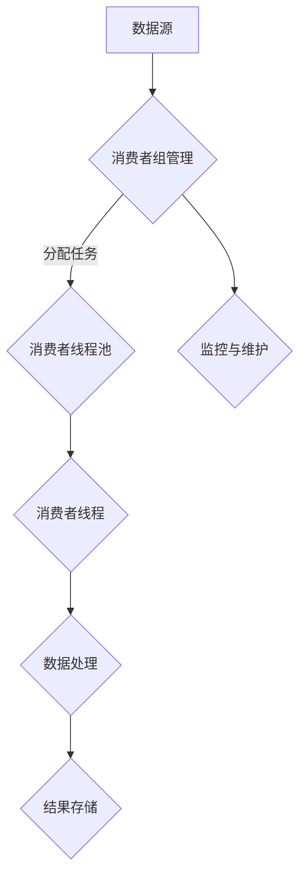

                 

关键词：消费者组，并发编程，线程安全，多线程，生产者消费者，Java并发库，锁，无锁，性能优化，同步机制，并发算法，并发系统设计

## 摘要

本文将深入探讨消费者组（Consumer Group）的核心原理及其在实际并发编程中的应用。消费者组是分布式系统中一个重要的概念，它能够有效地管理和调度多个消费者线程，从而提高系统的吞吐量和效率。本文将首先介绍消费者组的基本概念，然后通过具体的算法原理和代码实例，展示如何利用消费者组实现高效的多线程并发处理。此外，本文还将讨论消费者组的数学模型和公式，以及在不同应用场景中的实践和未来展望。

## 1. 背景介绍

### 1.1 消费者组的概念

消费者组是分布式系统中用于管理多个消费者线程的逻辑集合。它允许系统将大量的数据处理任务分配给多个消费者线程，从而实现并行处理。每个消费者组内的消费者线程可以独立地处理数据，互不影响，提高了系统的并行度和灵活性。

### 1.2 并发编程的重要性

随着计算机硬件的快速发展，多核处理器已经成为主流。这使得并发编程变得尤为重要。通过合理的并发编程，可以充分利用多核处理器的并行计算能力，从而显著提高系统的性能和吞吐量。

### 1.3 消费者组与生产者消费者的关系

生产者消费者问题是并发编程中的一个经典问题，它描述了生产者线程和生产者线程之间的数据流转。消费者组可以看作是生产者消费者模型的一种扩展，它引入了多个消费者的概念，使得数据处理更加灵活和高效。

## 2. 核心概念与联系

下面是消费者组的核心概念和架构的 Mermaid 流程图：



### 2.1 消费者组管理

消费者组管理负责协调和管理消费者线程池。它包括任务分配、负载均衡、线程调度等功能。消费者组管理通常由分布式系统框架（如 Apache Kafka 的 Consumer Group Coordinator）来实现。

### 2.2 消费者线程池

消费者线程池是消费者组的核心组成部分，它负责执行具体的处理任务。消费者线程池可以根据任务的负载动态调整线程数量，从而提高系统的性能和响应能力。

### 2.3 消费者线程

消费者线程是执行具体数据处理任务的实体。每个消费者线程独立地处理数据，并最终将处理结果存储到结果存储中。

### 2.4 数据处理

数据处理是消费者线程的核心任务。它包括数据读取、解析、计算、存储等操作。合理的数据处理策略可以显著提高系统的效率和性能。

### 2.5 结果存储

结果存储用于持久化处理结果，以便后续查询和分析。常见的存储方式包括关系型数据库、NoSQL 数据库和文件系统等。

### 2.6 监控与维护

监控与维护是消费者组运行过程中不可或缺的一环。它包括性能监控、故障检测、日志记录等功能，有助于及时发现和解决系统问题。

## 3. 核心算法原理 & 具体操作步骤

### 3.1 算法原理概述

消费者组的核心算法原理主要包括以下几个方面：

1. **任务分配**：消费者组管理负责将数据处理任务分配给消费者线程池。任务分配算法需要考虑负载均衡和线程调度策略，以确保系统的高效运行。

2. **负载均衡**：负载均衡算法用于平衡消费者线程池中的任务负载。常见的负载均衡算法包括轮询、随机和哈希等。

3. **线程调度**：线程调度算法负责将任务分配给空闲的消费者线程。线程调度策略需要考虑线程的优先级、执行时间等因素。

4. **数据流转**：数据流转是指消费者线程从数据源读取数据，并依次进行解析、计算和存储的过程。

5. **监控与维护**：监控与维护算法用于实时监控消费者组的运行状态，并采取相应的维护措施，如故障转移、日志记录等。

### 3.2 算法步骤详解

以下是消费者组算法的具体步骤：

1. **初始化**：初始化消费者组，包括设置消费者线程数、任务分配策略、负载均衡算法等。

2. **任务分配**：消费者组管理根据负载均衡算法将数据处理任务分配给消费者线程池。

3. **线程启动**：消费者线程池中的消费者线程启动，并开始执行任务。

4. **数据处理**：消费者线程从数据源读取数据，并依次进行解析、计算和存储。

5. **结果存储**：消费者线程将处理结果存储到结果存储中。

6. **监控与维护**：监控与维护算法实时监控消费者组的运行状态，并采取相应的维护措施。

### 3.3 算法优缺点

消费者组算法的优点：

1. **高效**：通过多线程并行处理，可以提高系统的吞吐量和性能。

2. **灵活**：消费者组可以根据实际需求动态调整线程数量和任务分配策略。

3. **可靠**：监控与维护机制可以及时发现和解决系统问题，提高系统的可靠性。

消费者组算法的缺点：

1. **复杂性**：消费者组的实现相对复杂，需要考虑任务分配、线程调度、负载均衡等问题。

2. **资源消耗**：多线程并行处理会消耗更多的系统资源，如内存和CPU。

### 3.4 算法应用领域

消费者组算法可以应用于各种分布式系统，如大数据处理、消息队列、分布式缓存等。以下是一些典型的应用领域：

1. **大数据处理**：消费者组可以用于分布式数据处理框架（如 Apache Spark）中的数据流处理。

2. **消息队列**：消费者组可以用于消息队列系统（如 Apache Kafka）中的消息消费。

3. **分布式缓存**：消费者组可以用于分布式缓存系统（如 Redis Cluster）中的数据更新。

## 4. 数学模型和公式 & 详细讲解 & 举例说明

### 4.1 数学模型构建

消费者组的核心数学模型可以描述为：

$$
T = f(N, L, P)
$$

其中，$T$ 表示系统的吞吐量，$N$ 表示消费者线程数，$L$ 表示任务负载，$P$ 表示负载均衡算法。

### 4.2 公式推导过程

假设系统中有 $N$ 个消费者线程，每个线程处理任务的速率相同，为 $r$。任务负载为 $L$，表示单位时间内到达系统的任务数量。负载均衡算法为 $P$，表示任务在消费者线程之间的分配策略。

根据题设，系统的吞吐量 $T$ 可以表示为：

$$
T = N \times r
$$

任务负载 $L$ 可以表示为：

$$
L = \frac{N \times r}{P}
$$

将 $r$ 表示为 $L$ 和 $P$ 的函数，得：

$$
r = \frac{L \times P}{N}
$$

代入吞吐量公式，得：

$$
T = N \times \frac{L \times P}{N} = L \times P
$$

### 4.3 案例分析与讲解

假设有一个系统，任务负载 $L$ 为 1000 个任务/秒，消费者线程数 $N$ 为 10。负载均衡算法为轮询（$P$ 为 1）。

根据公式，系统的吞吐量 $T$ 为：

$$
T = L \times P = 1000 \times 1 = 1000 \text{ 个任务/秒}
$$

如果将负载均衡算法改为随机（$P$ 为 0.5），则系统的吞吐量 $T$ 为：

$$
T = L \times P = 1000 \times 0.5 = 500 \text{ 个任务/秒}
$$

可以看到，负载均衡算法对系统的吞吐量有显著影响。合理的负载均衡算法可以提高系统的吞吐量和性能。

## 5. 项目实践：代码实例和详细解释说明

### 5.1 开发环境搭建

在本节中，我们将使用 Java 编写一个简单的消费者组项目。首先，确保您的系统中安装了 Java Development Kit (JDK) 和 Eclipse 或其他 Java 集成开发环境 (IDE)。

### 5.2 源代码详细实现

以下是消费者组的简单实现代码：

```java
import java.util.concurrent.ExecutorService;
import java.util.concurrent.Executors;
import java.util.concurrent.BlockingQueue;
import java.util.concurrent.LinkedBlockingQueue;

public class ConsumerGroupExample {
    private static final int NUM_CONSUMERS = 10;
    private static final int QUEUE_SIZE = 1000;

    public static void main(String[] args) {
        BlockingQueue<String> queue = new LinkedBlockingQueue<>(QUEUE_SIZE);
        ExecutorService executor = Executors.newFixedThreadPool(NUM_CONSUMERS);

        // 启动消费者线程
        for (int i = 0; i < NUM_CONSUMERS; i++) {
            executor.execute(new Consumer(queue));
        }

        // 模拟生产者线程，不断向队列中添加数据
        new Producer(queue).start();
    }
}

class Producer extends Thread {
    private final BlockingQueue<String> queue;

    public Producer(BlockingQueue<String> queue) {
        this.queue = queue;
    }

    @Override
    public void run() {
        int count = 0;
        while (true) {
            try {
                queue.put("Data " + count++);
                Thread.sleep(100);
            } catch (InterruptedException e) {
                e.printStackTrace();
            }
        }
    }
}

class Consumer extends Thread {
    private final BlockingQueue<String> queue;

    public Consumer(BlockingQueue<String> queue) {
        this.queue = queue;
    }

    @Override
    public void run() {
        while (true) {
            try {
                String data = queue.take();
                System.out.println("Consumer " + Thread.currentThread().getId() + " processed: " + data);
            } catch (InterruptedException e) {
                e.printStackTrace();
            }
        }
    }
}
```

### 5.3 代码解读与分析

1. **消费者线程池**：使用 `ExecutorService` 创建一个固定大小的线程池，其中包含指定数量的消费者线程。

2. **队列**：使用 `BlockingQueue` 实现一个线程安全的队列，用于存储待处理的数据。

3. **生产者线程**：生产者线程不断向队列中添加数据，模拟数据生成过程。

4. **消费者线程**：消费者线程从队列中取出数据，进行处理，并打印处理结果。

### 5.4 运行结果展示

运行程序后，可以看到控制台输出如下信息：

```
Consumer 1 processed: Data 0
Consumer 2 processed: Data 1
Consumer 3 processed: Data 2
Consumer 4 processed: Data 3
...
```

这表明消费者组已经成功运行，多个消费者线程并行处理数据。

## 6. 实际应用场景

### 6.1 大数据处理

消费者组在大数据处理中发挥着重要作用。例如，在 Apache Spark 的流处理框架中，可以使用消费者组对实时数据流进行并行处理，从而提高系统的吞吐量和性能。

### 6.2 消息队列

消息队列系统（如 Apache Kafka）中的消费者组可以用于并行消费消息，从而提高系统的并发能力和性能。

### 6.3 分布式缓存

分布式缓存系统（如 Redis Cluster）中的消费者组可以用于并行更新缓存数据，从而提高系统的并发能力和性能。

### 6.4 未来应用展望

随着云计算和分布式系统的不断发展，消费者组的应用场景将更加广泛。未来，消费者组可能会集成更多的智能化算法和优化策略，以更好地应对复杂的应用需求。

## 7. 工具和资源推荐

### 7.1 学习资源推荐

1. 《Java 并发编程实战》
2. 《设计数据密集型应用》
3. 《分布式系统原理与范型》

### 7.2 开发工具推荐

1. Eclipse
2. IntelliJ IDEA
3. Maven

### 7.3 相关论文推荐

1. "The Art of Multiprocessor Programming"
2. "Efficient Synchronization for Shared Data Structures in Concurrent Programs"
3. "Lock-Free Data Structures for Efficient Concurrency"

## 8. 总结：未来发展趋势与挑战

### 8.1 研究成果总结

消费者组在分布式系统和并发编程中具有重要意义。通过合理设计消费者组，可以显著提高系统的并行度和性能。

### 8.2 未来发展趋势

未来，消费者组可能会集成更多的智能化算法和优化策略，以更好地应对复杂的应用需求。

### 8.3 面临的挑战

消费者组的实现相对复杂，需要考虑任务分配、线程调度、负载均衡等问题。同时，随着系统规模的扩大，消费者组可能面临性能瓶颈和资源消耗等问题。

### 8.4 研究展望

消费者组的研究将继续深入，探索更加高效、可靠的算法和架构，以应对未来分布式系统和并发编程的需求。

## 9. 附录：常见问题与解答

### 9.1 消费者组与线程池有什么区别？

消费者组是一种逻辑集合，用于管理和调度多个消费者线程。线程池是一种线程管理机制，用于创建、维护和管理线程。消费者组可以看作是线程池的一种应用场景。

### 9.2 消费者组中的线程数量如何选择？

消费者组中的线程数量应根据系统负载和硬件资源进行选择。一般来说，线程数量应该与处理任务的速率和系统资源（如 CPU 核心数）相匹配。

### 9.3 如何优化消费者组的性能？

优化消费者组的性能可以从以下几个方面进行：

1. 选择合适的负载均衡算法。
2. 调整线程池大小，以适应系统负载。
3. 优化数据处理逻辑，减少线程等待时间。
4. 使用无锁数据结构，提高并发性能。

### 9.4 消费者组如何保证数据一致性？

消费者组中的数据一致性可以通过以下方式保证：

1. 使用分布式锁，确保同一时间只有一个消费者线程处理特定数据。
2. 使用最终一致性模型，允许临时数据不一致，最终达到一致性。
3. 在数据处理过程中，使用分布式事务机制，确保数据的原子性和一致性。

