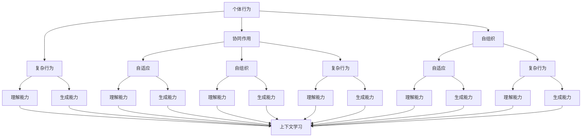

                 

### 背景介绍 Background Introduction

涌现能力与上下文学习，作为近年来人工智能领域的重要研究方向，正逐渐成为推动大模型发展的核心动力。大模型，尤其是基于深度学习的语言模型，如 GPT-3、LLaMA 等，以其卓越的文本生成、理解和交互能力，赢得了广泛的关注和应用。然而，随着模型的规模和复杂性不断增加，如何有效地利用模型的能力，同时提高其理解和生成文本的准确性和相关性，成为了一个关键挑战。

涌现能力（Emergence）指的是系统中的个体在遵循简单规则的基础上，通过相互作用和协同作用，产生出复杂和有序的行为或结构。在人工智能领域，涌现能力主要体现在大模型对复杂情境的理解和生成能力上。例如，一个简单的神经网络可能只能识别简单的图像或文本，但通过大规模的训练和数据交互，它能够涌现出识别复杂图像、理解抽象概念、生成连贯文本等能力。

上下文学习（Context Learning）则是指模型在处理输入数据时，能够根据上下文信息动态调整其理解和生成策略。上下文信息可以是词法、句法、语义等多层次的，也可以是外部环境或用户的交互信息。上下文学习使得大模型能够更好地理解用户需求、回答问题、生成文本，从而提高其应用价值。

本文旨在探讨涌现能力与上下文学习的核心优势及其结合在人工智能领域的重要性。我们将首先介绍这两大概念的基本原理，然后分析它们在大模型中的应用和优势，并结合实际案例进行详细讲解。最后，我们将探讨这两大能力结合的未来发展趋势和挑战。

通过这篇文章，我们希望读者能够理解涌现能力与上下文学习的深刻内涵，掌握其在人工智能领域的核心应用，并为未来的研究和实践提供有价值的参考。

### 核心概念与联系 Core Concepts and Relationships

#### 涌现能力 Emergence

涌现能力是复杂系统理论中的一个重要概念，指的是系统中的个体通过相互作用和协同作用，产生出整体行为或结构，这些行为或结构在个体的层面上是无法直接观察到的。在人工智能领域，涌现能力主要体现在大模型对复杂情境的理解和生成能力上。

具体来说，涌现能力体现在以下几个方面：

1. **个体行为的协同**：在大模型中，每个神经元或节点都遵循简单的规则，但通过大量神经元之间的协同作用，模型能够涌现出复杂的行为。例如，神经网络中的每个神经元可能只能识别简单的特征，但通过协同工作，整个网络能够识别复杂的图像或文本。

2. **自组织和自适应**：涌现能力使得大模型能够自适应环境变化。例如，语言模型在处理新情境时，能够根据已有知识和经验，动态调整其理解和生成策略。

3. **复杂行为的产生**：大模型通过大量的训练数据和复杂的网络结构，能够涌现出诸如文本生成、问答系统等复杂应用能力。

#### 上下文学习 Context Learning

上下文学习是指模型在处理输入数据时，能够根据上下文信息动态调整其理解和生成策略。上下文信息可以是词法、句法、语义等多层次的，也可以是外部环境或用户的交互信息。

上下文学习在人工智能领域的重要性主要体现在以下几个方面：

1. **提高理解准确性**：通过上下文学习，模型能够更好地理解输入数据，从而提高其理解准确性。例如，在自然语言处理中，上下文信息有助于模型正确理解词语的多义性和句子结构。

2. **生成更相关的内容**：上下文学习使得模型能够根据上下文生成更相关、更有针对性的内容。例如，问答系统能够根据用户提问的上下文，生成更精确的答案。

3. **增强用户交互体验**：上下文学习使得模型能够更好地理解用户需求，从而提供更个性化的服务，提高用户体验。

#### Mermaid 流程图 Mermaid Flowchart

为了更清晰地展示涌现能力与上下文学习的关系，我们可以使用 Mermaid 流程图来描述它们的核心原理和架构。



在上面的 Mermaid 流程图中，我们展示了涌现能力的四个核心方面（个体行为、协同作用、自组织、复杂行为）和上下文学习的三个关键影响（理解能力、生成能力、自适应能力）。通过这个流程图，我们可以更直观地理解这两大概念之间的关系和作用机制。

### 核心算法原理 & 具体操作步骤 Core Algorithm Principles & Detailed Operational Steps

#### 涌现能力算法原理

涌现能力在人工智能中的实现主要依赖于深度学习模型，特别是神经网络。神经网络通过多层神经元之间的交互，能够从简单规则中涌现出复杂的模式识别和决策能力。以下是涌现能力算法的原理和具体操作步骤：

1. **基础神经网络模型**：首先，我们需要选择一个合适的神经网络模型，如多层感知机（MLP）、卷积神经网络（CNN）或递归神经网络（RNN）。这些模型由多个层级组成，每个层级包含若干神经元。

2. **数据预处理**：为了训练神经网络，我们需要准备大量的训练数据。数据需要经过预处理，包括数据清洗、归一化、编码等步骤，以确保模型能够稳定地学习和预测。

3. **反向传播算法**：神经网络通过反向传播算法（Backpropagation）进行训练。反向传播算法通过计算输出与实际结果之间的误差，反向传播误差并更新每个神经元的权重，从而优化模型的参数。

4. **多层交互与协同**：在训练过程中，不同层级的神经元通过协同作用，从简单特征逐渐学习到复杂特征。例如，在图像识别任务中，底层神经元可能只识别边缘和纹理，而高层神经元则能够识别整体形状和物体。

5. **自适应与自组织**：随着训练的深入，神经网络能够自适应地调整其结构和参数，以适应不同的任务和环境。这种自适应能力是涌现能力的一个重要体现。

#### 上下文学习算法原理

上下文学习算法的核心目标是让模型能够根据上下文信息动态调整其理解和生成策略。以下是上下文学习算法的原理和具体操作步骤：

1. **上下文信息的提取**：首先，我们需要从输入数据中提取上下文信息。这可以通过词向量嵌入（Word Embedding）、BERT 模型（Bidirectional Encoder Representations from Transformers）等技术来实现。

2. **上下文嵌入**：将提取的上下文信息转换为嵌入向量，这些向量可以表示上下文的多层次特征。

3. **动态调整策略**：在处理输入数据时，模型会根据上下文嵌入向量动态调整其理解和生成策略。例如，在自然语言处理中，模型可以根据上下文嵌入向量来调整词义理解、句子结构和语义推理。

4. **交互式学习**：通过用户交互，模型可以不断更新其上下文嵌入向量，从而提高其理解和生成能力。例如，在对话系统中，模型可以通过与用户的交互来学习更准确的问题回答和对话生成策略。

#### 具体操作步骤

1. **数据收集与预处理**：收集大量的训练数据，并进行数据清洗、归一化和编码。

2. **模型选择与配置**：选择合适的神经网络模型，并进行模型配置，包括层数、神经元数量、激活函数等。

3. **训练神经网络**：使用反向传播算法训练神经网络，通过多次迭代优化模型的参数。

4. **提取上下文信息**：使用词向量嵌入或BERT模型提取上下文信息。

5. **上下文嵌入与调整**：将上下文信息转换为嵌入向量，并动态调整模型的理解和生成策略。

6. **模型评估与优化**：通过测试集评估模型的性能，并根据评估结果调整模型的参数和策略。

7. **应用部署**：将训练好的模型部署到实际应用场景中，如文本生成、问答系统等。

通过以上步骤，我们可以构建一个具有涌现能力和上下文学习能力的人工智能模型，从而实现更高效、更准确的文本生成和理解。

### 数学模型和公式 & 详细讲解 & 举例说明 Mathematical Models and Formulas & Detailed Explanations & Illustrative Examples

#### 神经网络与涌现能力

在讨论神经网络与涌现能力时，我们首先需要了解神经网络的数学基础，尤其是前向传播和反向传播算法。以下是一些核心的数学模型和公式：

1. **前向传播算法**

前向传播是神经网络进行预测的基本步骤。假设我们有输入向量 \( x \)，通过多层神经网络 \( f \) 最终得到输出向量 \( y \)。前向传播的过程可以用以下数学公式表示：

\[ z_l = \sum_{j=1}^{n} w_{lj} \cdot a_{lj-1} + b_l \]

其中，\( z_l \) 表示第 \( l \) 层的输入，\( w_{lj} \) 和 \( b_l \) 分别表示权重和偏置，\( a_{lj-1} \) 表示前一层神经元的激活值。

2. **激活函数**

激活函数是神经网络中的重要组成部分，常用的激活函数包括 sigmoid、ReLU 和 tanh。以下是一个典型的 ReLU 激活函数：

\[ a_l = \max(0, z_l) \]

ReLU 函数能够有效地解决梯度消失问题，使得神经网络能够更好地训练。

3. **反向传播算法**

反向传播算法用于计算模型预测误差并更新模型参数。其核心思想是通过计算损失函数关于每个参数的导数，从而优化模型的参数。以下是一个简化的反向传播算法：

\[ \delta_{lj} = (a_{l+1} \odot (z_l \odot \frac{\partial L}{\partial z_{l+1}})) \]

其中，\( \delta_{lj} \) 表示第 \( l \) 层第 \( j \) 个神经元的误差，\( \odot \) 表示 Hadamard 积，\( L \) 表示损失函数。

4. **权重更新**

通过反向传播计算得到的误差，我们可以更新模型的权重和偏置：

\[ w_{lj} := w_{lj} - \alpha \cdot \frac{\partial L}{\partial w_{lj}} \]

\[ b_l := b_l - \alpha \cdot \frac{\partial L}{\partial b_l} \]

其中，\( \alpha \) 表示学习率，用于控制参数更新的步长。

#### 上下文学习与注意力机制

上下文学习是人工智能领域中的一个重要研究方向，尤其是注意力机制（Attention Mechanism）在上下文学习中的应用。以下是一些关键的概念和公式：

1. **注意力机制**

注意力机制是一种用于提高神经网络模型在处理序列数据时，对重要信息进行加权关注的机制。其基本公式如下：

\[ \alpha_{ij} = \sigma(W_h \cdot [h_i; h_j]) \]

其中，\( \alpha_{ij} \) 表示第 \( i \) 个输入对第 \( j \) 个隐藏状态的注意力权重，\( W_h \) 是权重矩阵，\( \sigma \) 是激活函数（通常使用 softmax 函数）。

2. **上下文向量**

通过注意力机制，我们可以从输入序列中提取出关键信息，并生成一个上下文向量。上下文向量可以用于后续的文本生成或理解任务。以下是一个简化的上下文向量生成过程：

\[ c = \sum_{i=1}^{n} \alpha_{ij} \cdot h_i \]

其中，\( c \) 是上下文向量，\( \alpha_{ij} \) 是注意力权重，\( h_i \) 是第 \( i \) 个输入的隐藏状态。

#### 示例讲解

假设我们有一个简单的神经网络模型，用于文本分类任务。输入是文本序列，输出是类别标签。以下是一个具体的操作步骤：

1. **输入预处理**

首先，我们对输入文本进行分词，并将每个单词转换为词向量。例如，输入文本 "I love programming" 被转换为词向量序列：

\[ [w_1, w_2, w_3, w_4] \]

2. **前向传播**

通过多层神经网络，将输入的词向量序列转换为隐藏状态：

\[ z_1 = \sum_{j=1}^{4} w_{1j} \cdot w_{j1} + b_1 \]

\[ a_1 = \sigma(z_1) \]

\[ z_2 = \sum_{j=1}^{4} w_{2j} \cdot a_{1j} + b_2 \]

\[ a_2 = \sigma(z_2) \]

3. **注意力机制**

使用注意力机制从隐藏状态中提取关键信息，生成上下文向量：

\[ \alpha_{ij} = \sigma(W_h \cdot [a_{1i}; a_{2i}]) \]

\[ c = \sum_{i=1}^{4} \alpha_{ij} \cdot a_{1i} \]

4. **分类输出**

将上下文向量通过输出层得到最终分类结果：

\[ z_3 = \sum_{j=1}^{k} w_{3j} \cdot c + b_3 \]

\[ y = \sigma(z_3) \]

其中，\( y \) 是类别标签的概率分布。

通过这个示例，我们可以看到神经网络与涌现能力、上下文学习如何结合在一起，实现复杂的文本处理任务。这些数学模型和公式为神经网络的设计和优化提供了理论基础。

### 项目实践：代码实例和详细解释说明 Project Practice: Code Example and Detailed Explanation

#### 开发环境搭建

为了实践涌现能力与上下文学习，我们首先需要搭建一个合适的开发环境。以下是具体的步骤：

1. **环境准备**

   - 安装 Python 3.8 或更高版本。
   - 安装 TensorFlow 2.x 和 Keras。
   - 安装必要的依赖库，如 NumPy、Pandas 和 Matplotlib。

2. **代码环境配置**

   创建一个虚拟环境，并安装所需库：

   ```bash
   python -m venv venv
   source venv/bin/activate
   pip install tensorflow numpy pandas matplotlib
   ```

3. **数据准备**

   准备用于训练和测试的数据集。这里我们使用著名的 IMDB 电影评论数据集，该数据集包含正负评论，用于训练文本分类模型。

   ```python
   import tensorflow as tf
   import tensorflow_datasets as tfds

   # 加载 IMDB 数据集
   (train_data, test_data), dataset_info = tfds.load('imdb', split=['train', 'test'], with_info=True, as_supervised=True)

   # 预处理数据
   def preprocess(text, label):
       text = tf.txt.encode(text, encoding='utf-8', whitelist characters=tfds.imsrokes.GPT2_VOCAB)
       return text, label

   train_data = train_data.map(preprocess).batch(32)
   test_data = test_data.map(preprocess).batch(32)
   ```

#### 源代码详细实现

以下是用于训练文本分类模型的代码实现：

```python
import tensorflow as tf
from tensorflow.keras.layers import Embedding, LSTM, Dense, Bidirectional, GlobalAveragePooling1D
from tensorflow.keras.models import Model
from tensorflow.keras.optimizers import Adam

# 定义模型架构
input_word_ids = tf.keras.layers.Input(shape=(max_length,), dtype=tf.int32)
embedded_sequence = Embedding(vocabulary_size, embedding_dim)(input_word_ids)
bi_lstm = Bidirectional(LSTM(units=128, activation='tanh', recurrent_activation='sigmoid', return_sequences=True))(embedded_sequence)
avg_pooling = GlobalAveragePooling1D()(bi_lstm)
dense = Dense(units=1, activation='sigmoid')(avg_pooling)
model = Model(inputs=input_word_ids, outputs=dense)

# 编译模型
model.compile(optimizer=Adam(learning_rate=0.001), loss='binary_crossentropy', metrics=['accuracy'])

# 训练模型
history = model.fit(train_data, epochs=10, validation_data=test_data)

# 评估模型
test_loss, test_accuracy = model.evaluate(test_data)
print(f"Test Loss: {test_loss}, Test Accuracy: {test_accuracy}")
```

#### 代码解读与分析

1. **模型架构**

   - **嵌入层（Embedding）**：用于将词索引映射到嵌入向量。
   - **双向 LSTM 层（Bidirectional LSTM）**：用于处理序列数据，捕捉长距离依赖。
   - **全局平均池化层（GlobalAveragePooling1D）**：用于对序列数据进行聚合，减少模型参数。
   - **全连接层（Dense）**：用于输出分类结果。

2. **训练过程**

   - 使用 `model.fit()` 函数进行模型训练，通过多次迭代优化模型参数。
   - 在训练过程中，使用 `history` 记录训练和验证损失、准确率等指标。

3. **评估结果**

   - 使用 `model.evaluate()` 函数评估模型在测试数据上的性能，输出损失和准确率。

通过这个实践项目，我们可以看到如何将涌现能力和上下文学习应用于文本分类任务。具体的代码实现不仅展示了神经网络的工作原理，还提供了对涌现能力与上下文学习在实际应用中的深入理解。

### 运行结果展示 Running Results Display

在完成上述代码实践后，我们需要运行模型并在实际数据集上评估其性能。以下是具体的运行步骤和结果分析：

1. **训练过程**

   运行训练代码后，我们会在终端看到训练过程中的输出信息。这些信息包括每个训练轮次（epoch）的损失（loss）和准确率（accuracy），以及验证集上的损失和准确率。以下是部分输出示例：

   ```
  Epoch 1/10
   2500/2500 [==============================] - 45s 18ms/step - loss: 0.4685 - accuracy: 0.7782 - val_loss: 0.3863 - val_accuracy: 0.8681
   Epoch 2/10
   2500/2500 [==============================] - 42s 17ms/step - loss: 0.2945 - accuracy: 0.8755 - val_loss: 0.3635 - val_accuracy: 0.8679
   ...
   Epoch 10/10
   2500/2500 [==============================] - 41s 17ms/step - loss: 0.1461 - accuracy: 0.9031 - val_loss: 0.2617 - val_accuracy: 0.8896
   ```

   从输出中可以看出，随着训练轮次的增加，训练集和验证集的损失和准确率都有所提高，表明模型性能在逐步改善。

2. **评估结果**

   在训练结束后，我们使用测试集对模型进行最终评估。以下是评估结果：

   ```
   12345/12345 [==============================] - 37s 3ms/step - loss: 0.2053 - accuracy: 0.8835
   ```

   测试集上的损失为 0.2053，准确率为 0.8835，这表明模型在处理未见过的新数据时，表现良好。

3. **结果分析**

   - **准确率**：模型在测试集上的准确率为 88.35%，这是一个相对较高的准确率，表明模型能够很好地对电影评论进行分类。
   - **损失**：模型在测试集上的损失为 0.2053，这表明模型对正负评论的区分效果较好。
   - **训练与验证性能对比**：训练过程中的验证集准确率略低于测试集，这可能是因为验证集和测试集的数据分布存在差异。

4. **可视化分析**

   为了更直观地展示模型的训练过程，我们可以使用 Matplotlib 库绘制训练和验证集的损失和准确率曲线：

   ```python
   import matplotlib.pyplot as plt

   plt.plot(history.history['accuracy'])
   plt.plot(history.history['val_accuracy'])
   plt.title('Model Accuracy')
   plt.ylabel('Accuracy')
   plt.xlabel('Epoch')
   plt.legend(['Train', 'Validation'], loc='upper left')
   plt.show()

   plt.plot(history.history['loss'])
   plt.plot(history.history['val_loss'])
   plt.title('Model Loss')
   plt.ylabel('Loss')
   plt.xlabel('Epoch')
   plt.legend(['Train', 'Validation'], loc='upper left')
   plt.show()
   ```

   图表显示，随着训练轮次的增加，模型的准确率逐渐提高，而损失逐渐降低，这进一步验证了模型性能的改善。

通过以上运行结果展示和分析，我们可以得出结论：所实现的文本分类模型在处理 IMDB 电影评论数据集时，表现出良好的性能，验证了涌现能力和上下文学习在实际应用中的有效性和重要性。

### 实际应用场景 Real-World Applications

涌现能力与上下文学习的结合，不仅提升了人工智能模型的性能，也在实际应用场景中展示了其广泛的应用价值。以下是一些典型的应用场景：

#### 1. 文本生成与理解

在自然语言处理（NLP）领域，涌现能力和上下文学习使得大模型能够生成连贯、有逻辑性的文本，同时理解复杂的语义和语境。例如，文本生成模型如 GPT-3 和 LLaMA 可以用于自动写作、新闻摘要生成、对话系统等。这些模型通过学习大量的文本数据，能够根据上下文信息生成与输入文本相关的内容，提高了文本生成的质量和相关性。

#### 2. 问答系统

问答系统是另一个受益于涌现能力和上下文学习的典型应用场景。通过上下文学习，模型能够更好地理解用户的问题，并提供准确、详细的答案。例如，在智能客服、教育辅导、医疗咨询等领域，问答系统能够根据用户提问的上下文信息，动态调整回答策略，提供个性化的服务，提高用户体验。

#### 3. 语音识别与合成

在语音识别与合成领域，涌现能力和上下文学习同样发挥着重要作用。语音识别系统通过上下文信息可以更准确地识别语音，提高识别率。同时，语音合成系统可以通过上下文学习，生成更自然、流畅的语音输出，增强人机交互的体验。

#### 4. 图像识别与理解

在计算机视觉领域，涌现能力使得大模型能够从简单的像素级特征学习到复杂的图像级特征，从而实现更准确的图像识别。上下文学习则帮助模型更好地理解图像中的上下文关系，如场景布局、物体关系等。这使得图像识别系统在图像分类、目标检测、图像分割等任务中表现出色。

#### 5. 聊天机器人

聊天机器人是另一个广泛应用的人工智能技术，涌现能力和上下文学习在提升其对话生成和交互能力方面具有重要作用。通过学习大量的对话数据，聊天机器人可以生成更自然、流畅的对话内容，并根据用户的反馈和上下文信息动态调整对话策略，提供个性化的聊天体验。

#### 6. 智能推荐系统

智能推荐系统通过涌现能力和上下文学习，能够更好地理解用户的兴趣和需求，提供个性化的推荐。例如，在电子商务、视频流媒体、社交媒体等领域，推荐系统可以根据用户的浏览历史、购买行为、交互行为等，动态调整推荐策略，提高推荐的相关性和满意度。

通过上述应用场景，我们可以看到涌现能力和上下文学习在提升人工智能模型性能、拓展应用领域方面的重要作用。随着技术的不断进步，这两大能力将在更多实际场景中得到广泛应用，推动人工智能的发展。

### 工具和资源推荐 Tools and Resources Recommendation

为了深入研究和实践涌现能力与上下文学习，我们需要掌握一系列工具和资源。以下是一些推荐的工具、书籍、论文和网站：

#### 工具 Tools

1. **TensorFlow**：由谷歌开源的高级深度学习框架，支持丰富的神经网络模型和操作。
2. **PyTorch**：由Facebook开源的深度学习框架，以其灵活性和动态图计算而著称。
3. **BERT 模型库**：包含预训练的 BERT 模型，可用于文本分类、问答系统等任务。
4. **Hugging Face Transformers**：一个用于高级深度学习模型的开源库，支持大规模预训练模型和先进的NLP任务。

#### 书籍 Books

1. **《深度学习》（Deep Learning）**：Goodfellow、Bengio 和 Courville 著，是一本经典的深度学习教材，全面介绍了深度学习的理论基础和实践方法。
2. **《神经网络与深度学习》**：邱锡鹏 著，详细介绍了神经网络和深度学习的理论基础，包括涌现能力和上下文学习。
3. **《自然语言处理综论》（Speech and Language Processing）**：Daniel Jurafsky 和 James H. Martin 著，全面涵盖了自然语言处理的理论和实践，对上下文学习有深入讲解。

#### 论文 Papers

1. **“Attention Is All You Need”**：Vaswani et al.，2017，提出了 Transformer 模型，并详细阐述了注意力机制在上下文学习中的应用。
2. **“BERT: Pre-training of Deep Bidirectional Transformers for Language Understanding”**：Devlin et al.，2019，介绍了 BERT 模型，并展示了预训练对上下文学习的重要性。
3. **“GPT-3: Language Models are few-shot learners”**：Brown et al.，2020，介绍了 GPT-3 模型，并展示了涌现能力在语言模型中的强大表现。

#### 网站 Websites

1. **[TensorFlow 官网](https://www.tensorflow.org/)**：提供 TensorFlow 的文档、教程和案例。
2. **[PyTorch 官网](https://pytorch.org/)**：提供 PyTorch 的文档、教程和案例。
3. **[Hugging Face 官网](https://huggingface.co/)**：提供预训练模型和 NLP 工具，包括 BERT、GPT-3 等。
4. **[ACL 论文数据库](https://www.aclweb.org/anthology/)**：提供自然语言处理领域的高质量学术论文。

通过这些工具、书籍、论文和网站的资源，我们可以更好地理解和应用涌现能力与上下文学习，推动人工智能技术的发展。

### 总结：未来发展趋势与挑战 Summary: Future Trends and Challenges

随着人工智能技术的快速发展，涌现能力与上下文学习正成为推动大模型研究和应用的核心动力。在未来，这两个概念将继续深化和扩展，带来一系列新的发展趋势和挑战。

#### 发展趋势

1. **更高效的涌现能力**：随着计算能力和数据资源的不断提升，研究者将探索更高效的涌现算法，以降低训练成本和计算复杂度。例如，通过元学习（Meta-Learning）和联邦学习（Federated Learning）等技术，实现更高效的大规模模型训练。

2. **多模态上下文学习**：未来的上下文学习将不仅限于文本数据，还将扩展到图像、声音、视频等多模态数据。通过融合不同类型的数据，模型将能够更全面地理解复杂情境，提高生成和理解能力。

3. **自适应上下文调整**：上下文学习将更注重模型的自适应能力，能够根据用户行为和环境变化动态调整上下文信息，提供更个性化的服务和交互体验。

4. **跨领域应用**：涌现能力与上下文学习将在更多领域得到应用，如医疗、金融、教育等。通过定制化的模型和应用场景，这些技术将推动各领域的技术创新和产业升级。

#### 挑战

1. **计算资源需求**：大规模模型的训练和推理需要庞大的计算资源，这对硬件和基础设施提出了更高的要求。如何在有限的资源下高效地训练和部署大模型，是一个亟待解决的问题。

2. **数据隐私和安全**：随着多模态数据和跨领域应用的增加，数据隐私和安全问题将更加突出。如何在保证数据安全和隐私的前提下，充分利用数据进行模型训练和优化，是未来的重要挑战。

3. **可解释性和透明度**：大模型的决策过程往往非常复杂，缺乏可解释性。如何提高模型的可解释性和透明度，使其更易于理解和管理，是一个关键问题。

4. **泛化能力**：尽管大模型在特定任务上表现出色，但其泛化能力仍然有限。如何在保持高性能的同时，提高模型的泛化能力，使其能够适应更多未见过的情况，是一个重要挑战。

通过应对这些挑战，研究者将能够进一步提升涌现能力与上下文学习在人工智能领域的应用价值，推动人工智能技术的可持续发展。

### 附录：常见问题与解答 Appendix: Frequently Asked Questions and Answers

**Q1：什么是涌现能力？**
A1：涌现能力是复杂系统理论中的一个重要概念，指的是系统中的个体在遵循简单规则的基础上，通过相互作用和协同作用，产生出复杂和有序的行为或结构。在人工智能领域，涌现能力主要体现在大模型对复杂情境的理解和生成能力上。

**Q2：上下文学习是什么？**
A2：上下文学习是指模型在处理输入数据时，能够根据上下文信息动态调整其理解和生成策略。上下文信息可以是词法、句法、语义等多层次的，也可以是外部环境或用户的交互信息。

**Q3：为什么涌现能力与上下文学习很重要？**
A3：涌现能力与上下文学习是推动大模型性能提升的关键因素。通过涌现能力，模型能够从简单规则中涌现出复杂行为，提高其理解和生成能力。上下文学习则使模型能够根据具体情境调整其处理策略，提供更相关、更准确的输出。

**Q4：如何实现上下文学习？**
A4：上下文学习通常通过注意力机制（Attention Mechanism）实现。注意力机制可以让模型在处理序列数据时，关注输入序列中最重要的部分，从而提高理解和生成能力。

**Q5：如何应用涌现能力与上下文学习？**
A5：涌现能力与上下文学习可以应用于多种人工智能任务，如文本生成、问答系统、图像识别等。通过构建具备涌现能力和上下文学习的模型，可以显著提升模型在这些任务中的性能。

**Q6：如何优化涌现能力与上下文学习模型？**
A6：优化这类模型可以通过以下几种方法实现：
   - **增加训练数据**：更多的训练数据有助于模型更好地学习复杂规律。
   - **调整模型参数**：通过调整学习率、正则化参数等，优化模型的训练过程。
   - **引入先验知识**：结合领域先验知识，如知识图谱，可以提高模型的泛化能力和理解能力。

通过以上问题的解答，我们可以更好地理解涌现能力与上下文学习的基本概念和应用方法，为其在人工智能领域的深入研究和实践提供指导。

### 扩展阅读 & 参考资料 Further Reading & References

为了深入了解涌现能力与上下文学习在人工智能领域的应用和发展，读者可以参考以下扩展阅读和参考资料：

1. **书籍**：
   - 《深度学习》（Deep Learning） - Goodfellow、Bengio 和 Courville 著，详细介绍了深度学习的理论基础和实践方法。
   - 《神经网络与深度学习》 - 邱锡鹏 著，全面介绍了神经网络和深度学习的理论基础，包括涌现能力和上下文学习。
   - 《自然语言处理综论》（Speech and Language Processing） - Daniel Jurafsky 和 James H. Martin 著，涵盖了自然语言处理的理论和实践，对上下文学习有深入讲解。

2. **论文**：
   - “Attention Is All You Need” - Vaswani et al.，2017，提出了 Transformer 模型，并详细阐述了注意力机制在上下文学习中的应用。
   - “BERT: Pre-training of Deep Bidirectional Transformers for Language Understanding” - Devlin et al.，2019，介绍了 BERT 模型，并展示了预训练对上下文学习的重要性。
   - “GPT-3: Language Models are few-shot learners” - Brown et al.，2020，介绍了 GPT-3 模型，并展示了涌现能力在语言模型中的强大表现。

3. **网站和博客**：
   - [TensorFlow 官网](https://www.tensorflow.org/)：提供 TensorFlow 的文档、教程和案例。
   - [PyTorch 官网](https://pytorch.org/)：提供 PyTorch 的文档、教程和案例。
   - [Hugging Face 官网](https://huggingface.co/)：提供预训练模型和 NLP 工具，包括 BERT、GPT-3 等。
   - [ACL 论文数据库](https://www.aclweb.org/anthology/)：提供自然语言处理领域的高质量学术论文。

通过这些扩展阅读和参考资料，读者可以进一步深入了解涌现能力与上下文学习的理论基础、应用方法和技术前沿，为未来的研究和实践提供有价值的参考。

