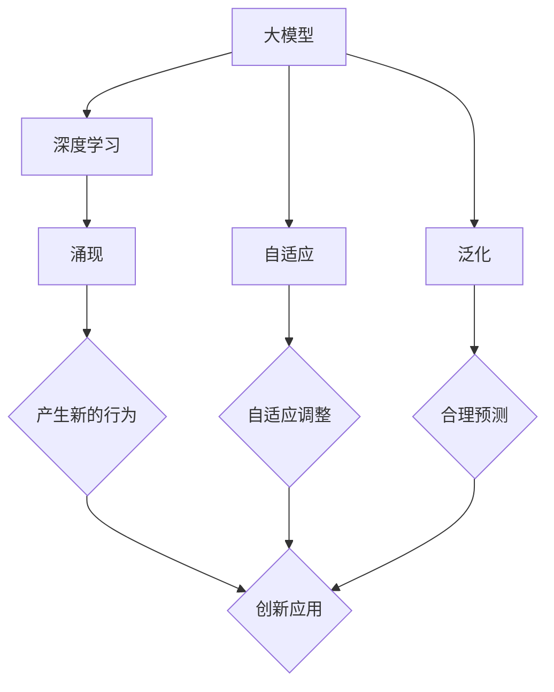

                 

### 背景介绍

在当今信息技术飞速发展的时代，人工智能（AI）已经成为推动科技进步和产业变革的重要力量。作为人工智能领域的核心组件，大型模型（Large-scale Models）逐渐崭露头角，成为研究人员和开发者关注的焦点。本文旨在探讨大型模型中的一种关键能力——涌现能力（Emergence），并深入解析其在大模型中的核心优势。

**人工智能与大型模型的发展**

人工智能作为一种模拟人类智能的技术，其核心目标是实现机器对数据的自主理解和决策能力。随着深度学习技术的成熟和计算资源的不断丰富，大型模型应运而生。这些模型拥有数亿甚至数万亿的参数，可以处理海量的数据，从而实现高度复杂的任务，如图像识别、自然语言处理和推荐系统等。

大型模型的发展得益于以下几个关键因素：

1. **计算资源的提升**：近年来，计算能力的快速提升为训练和部署大型模型提供了强有力的支持。高性能计算集群和分布式计算技术的广泛应用，使得训练大规模模型成为可能。
   
2. **海量数据积累**：随着互联网和大数据技术的发展，各种领域的数据不断积累，为模型训练提供了丰富的素材。数据量的增加使得模型能够学习到更加细微的特征，从而提升任务表现。

3. **算法的进步**：深度学习算法的不断创新和优化，使得模型在处理复杂任务时能够达到前所未有的性能。尤其是生成对抗网络（GAN）、Transformer架构等新算法的提出，为大型模型的发展注入了新的活力。

**涌现能力的概念**

在物理学中，“涌现”指的是复杂系统中的个体相互作用产生的集体现象，这种现象超出了个体行为所能预测的范围。在人工智能领域，涌现能力则是指大型模型在大量训练和复杂计算过程中，自动产生新的、未预期的行为和模式。

涌现能力通常表现为以下几种形式：

1. **智能行为**：大型模型在特定任务上展现出类似人类的智能行为，如自然语言生成、自主推理和决策等。

2. **自适应能力**：模型能够根据环境变化和输入数据的不同，自动调整其行为和策略。

3. **泛化能力**：模型能够处理以前未见过的数据，并产生合理的预测或决策。

4. **创造力**：模型在生成内容时能够产生新颖的想法和创意，表现出创造力。

**大模型中的涌现能力**

大型模型之所以具备涌现能力，主要归功于以下几个因素：

1. **规模效应**：模型规模越大，其参数数量越多，能够捕捉到的特征和模式就越丰富，从而提高了涌现的可能性。

2. **深度学习**：深度学习模型的结构层次使得信息在多层之间传递和融合，有助于生成复杂的内部表示，这是涌现能力的基础。

3. **非线性交互**：大型模型中复杂的非线性变换和交互过程，使得模型能够产生丰富多样的行为。

4. **自适应学习**：通过不断调整参数，模型能够适应不同的任务和环境，这也有助于涌现能力的发挥。

总之，涌现能力是大模型区别于传统算法的关键优势之一，它不仅提升了模型在复杂任务上的性能，也为人工智能领域的研究和应用带来了新的可能性和挑战。在接下来的章节中，我们将深入探讨涌现能力的具体原理、应用场景及其面临的挑战。

---

**技术背景与演变**

在讨论大型模型的涌现能力之前，有必要回顾一下人工智能领域的技术背景及其演变过程。从早期的符号主义（Symbolic AI）到基于规则的系统，再到连接主义（Connectionist AI）和基于数据的机器学习，人工智能技术经历了多次变革。

**符号主义与连接主义**

符号主义人工智能追求通过形式逻辑和符号操作来模拟人类思维过程。这种方法依赖于领域专家的知识来定义符号和规则，如专家系统（Expert Systems）和逻辑推理（Logic Reasoning）。然而，符号主义存在几个局限性：

1. **知识获取困难**：构建符号模型需要大量的领域知识和手工编码，这使得知识获取过程既耗时又繁琐。

2. **固定性**：符号系统一旦构建完成，其表现和能力就固定不变，无法适应新的情况和任务。

相比之下，连接主义人工智能则通过人工神经网络来模拟人脑的信息处理过程。最早的神经网络模型如感知机（Perceptron）和多层感知机（MLP）试图通过权重调整来实现非线性函数的近似。随着反向传播算法（Backpropagation Algorithm）的发明，多层神经网络（Deep Neural Networks, DNNs）得以实现，这使得连接主义在图像识别、语音识别等领域取得了显著进展。

**机器学习与深度学习**

机器学习（Machine Learning）是人工智能的核心方法之一，它通过从数据中学习规律和模式，实现人工智能的自动化。与传统的人工编码不同，机器学习依赖于数据驱动的方法来发现知识。这一方法的引入大大降低了知识获取的门槛，同时也推动了人工智能技术的发展。

深度学习（Deep Learning）是机器学习的一个子领域，它通过构建多层的神经网络来学习数据的高层次表示。与传统的单层神经网络相比，深度学习模型能够捕捉到更加抽象和复杂的特征，从而在许多复杂任务上取得了突破性进展。

**大规模模型的崛起**

随着计算能力和数据量的提升，研究人员开始尝试训练拥有数百万甚至数十亿参数的大型模型。这些大型模型在处理海量数据和复杂任务时展现了强大的能力。例如，GPT-3、BERT和Ginza等模型在自然语言处理、图像识别和推荐系统等领域取得了卓越的成绩。

**涌现能力的兴起**

在大型模型中，涌现能力逐渐成为研究的重点。这种能力不仅体现了模型在处理复杂任务时的自适应性和泛化能力，还展示了模型在未预期情况下产生新颖行为的潜力。涌现能力的出现打破了传统人工智能的局限，为人工智能的发展打开了新的可能性。

**总结**

综上所述，人工智能技术的发展经历了从符号主义到连接主义，再到机器学习和深度学习的演变。大型模型的兴起进一步推动了人工智能技术的进步，涌现能力则成为这一过程中最为引人注目的特征之一。在接下来的章节中，我们将详细探讨涌现能力的核心概念、原理及其在大模型中的应用。

### 核心概念与联系

在深入探讨大模型的涌现能力之前，首先需要明确几个核心概念，并阐述它们之间的联系。以下是本文将涉及的关键概念及其关系：

**1. 大模型（Large-scale Models）**

大模型是指拥有大量参数的神经网络模型，这些模型的参数数量可以达到数十亿甚至更多。大模型的规模效应使其能够捕捉到更复杂的数据特征，从而在各类任务上表现出色。

**2. 深度学习（Deep Learning）**

深度学习是一种利用多层神经网络进行数据建模的方法。通过逐层抽象和提取特征，深度学习模型能够在复杂任务中表现出强大的学习能力。深度学习是大模型的基础技术之一。

**3. 涌现（Emergence）**

涌现是指复杂系统中的个体通过相互作用产生的集体现象，这些现象超出了个体行为的简单叠加。在人工智能领域，涌现能力表现为模型在复杂计算过程中自动产生新的、未预期的行为和模式。

**4. 自适应（Adaptation）**

自适应是指系统根据环境变化和输入数据的不同，自动调整其行为和策略。在大模型中，自适应能力有助于模型在多种任务和应用场景中表现出色。

**5. 泛化（Generalization）**

泛化是指模型能够处理以前未见过的数据，并产生合理的预测或决策。泛化能力是衡量模型性能的重要指标之一，也是涌现能力的一个重要表现。

**核心概念架构图**

为了更好地理解这些核心概念及其关系，我们可以使用Mermaid流程图来展示它们之间的联系。以下是一个简化的Mermaid流程图，描述了核心概念之间的交互关系：



**流程图解释**

1. **大模型（A）**：作为起点，大模型是本文讨论的核心对象，它通过深度学习技术实现了对大规模数据的建模。

2. **深度学习（B）**：大模型的基础是深度学习技术，通过多层神经网络的结构，深度学习能够提取数据的复杂特征。

3. **涌现（C）**：深度学习过程中，大模型内部复杂的非线性变换和交互可能导致涌现现象，即模型产生新的、未预期的行为和模式。

4. **自适应（D）**：大模型通过自适应机制能够根据不同任务和环境调整其行为，这有助于提升模型在多样化场景中的表现。

5. **泛化（E）**：泛化能力使大模型能够处理未见过的数据，这对于实际应用中的泛化性能至关重要。

6. **涌现产生新的行为（F）**：涌现能力使得大模型能够在复杂计算中产生新的行为和模式，这些行为可能是创新和有价值的。

7. **自适应调整（G）**：自适应能力使大模型能够根据环境变化调整其内部参数和结构，从而适应不同的任务需求。

8. **合理预测（H）**：泛化能力使大模型能够对未见过的数据进行合理的预测或决策，这是评估模型性能的关键。

9. **创新应用（I）**：涌现、自适应和泛化能力的综合作用，使得大模型在多种应用场景中能够产生创新性的解决方案。

通过上述核心概念的架构图，我们可以清晰地看到大模型、深度学习、涌现、自适应和泛化之间的相互作用关系。这些概念共同构成了大模型的核心优势，使其在复杂任务和多样化应用场景中具备强大的竞争力。

### 核心算法原理 & 具体操作步骤

在深入探讨大模型的涌现能力之前，我们需要先了解支撑这一能力的核心算法原理和具体操作步骤。以下是几种常见的大型模型算法及其操作步骤：

#### 1. Transformer模型

Transformer模型是当前自然语言处理领域的主流算法之一，其核心思想是自注意力机制（Self-Attention）。以下是其基本原理和操作步骤：

**原理：**
- **多头注意力（Multi-Head Attention）**：Transformer模型通过多头注意力机制来捕捉输入序列中的依赖关系。每个头关注输入序列的不同部分，从而生成不同维度的表示。
- **编码器-解码器架构（Encoder-Decoder Architecture）**：编码器（Encoder）生成输入序列的上下文表示，解码器（Decoder）则根据这些表示生成输出序列。

**操作步骤：**
1. **编码器输入**：将输入序列（例如，句子或段落）转换为嵌入向量。
2. **多头自注意力**：计算每个词与其他词之间的相似度，并通过权重对嵌入向量进行加权求和。
3. **前馈网络（Feedforward Network）**：对自注意力结果进行非线性变换，增强模型的表示能力。
4. **层归一化（Layer Normalization）**：对每层的输出进行归一化处理，提高模型的稳定性。
5. **解码器输入**：将编码器的输出作为解码器的输入，并重复上述步骤生成输出序列。

#### 2. GPT模型

GPT（Generative Pre-trained Transformer）模型是另一种广泛使用的自然语言处理模型，其特点是在预训练阶段生成大量文本数据。

**原理：**
- **前向变换器（Forward Transformer）**：GPT模型采用前向变换器结构，通过多层自注意力机制来学习输入序列的上下文表示。
- **生成文本**：在预训练阶段，GPT模型通过预测下一个词来生成文本。

**操作步骤：**
1. **嵌入层（Embedding Layer）**：将输入词转换为嵌入向量。
2. **多层自注意力（Multi-Layer Self-Attention）**：通过自注意力机制捕捉输入序列中的依赖关系。
3. **前馈网络（Feedforward Network）**：对自注意力结果进行非线性变换。
4. **分类器（Classifier）**：在微调阶段，GPT模型通过分类器对输入文本进行分类或生成文本。

#### 3. BERT模型

BERT（Bidirectional Encoder Representations from Transformers）模型是另一种强大的自然语言处理模型，其特点是在训练阶段同时考虑序列的前后信息。

**原理：**
- **双向编码器（Bidirectional Encoder）**：BERT模型通过双向编码器结构来学习输入序列的上下文表示。
- **位置嵌入（Positional Embedding）**：BERT模型通过位置嵌入来表示输入序列的顺序。

**操作步骤：**
1. **嵌入层（Embedding Layer）**：将输入词转换为嵌入向量，并添加位置嵌入。
2. **多层自注意力（Multi-Layer Self-Attention）**：通过自注意力机制捕捉输入序列中的依赖关系。
3. **层归一化（Layer Normalization）**：对每层的输出进行归一化处理。
4. **前馈网络（Feedforward Network）**：对自注意力结果进行非线性变换。
5. **分类器（Classifier）**：在微调阶段，BERT模型通过分类器对输入文本进行分类。

#### 4. 图神经网络（Graph Neural Networks, GNNs）

图神经网络是用于处理图结构数据的强大工具，其核心思想是通过节点和边的交互来学习图的特征。

**原理：**
- **图卷积（Graph Convolution）**：图神经网络通过图卷积操作来整合节点和邻居节点的特征。
- **消息传递（Message Passing）**：节点通过消息传递机制与邻居节点进行交互。

**操作步骤：**
1. **初始化节点嵌入（Node Embeddings）**：为图中的每个节点初始化嵌入向量。
2. **图卷积操作（Graph Convolution）**：通过图卷积整合节点及其邻居的特征。
3. **非线性变换（Non-linear Transformation）**：对图卷积结果进行非线性变换。
4. **聚合操作（Aggregation Operation）**：将节点嵌入更新为新的表示。
5. **输出层（Output Layer）**：根据任务需求，设置不同的输出层，如分类或回归。

#### 5. 强化学习（Reinforcement Learning, RL）

强化学习是一种通过试错和反馈来学习策略的机器学习方法，其核心思想是最大化累积奖励。

**原理：**
- **策略（Policy）**：强化学习通过策略来决定模型的行为。
- **价值函数（Value Function）**：价值函数估计模型在未来不同状态下的收益。

**操作步骤：**
1. **初始化状态（Initialize State）**：设定初始状态。
2. **选择动作（Choose Action）**：根据策略选择动作。
3. **执行动作（Execute Action）**：在环境中执行动作，并观察结果。
4. **更新策略（Update Policy）**：根据奖励和反馈更新策略。
5. **重复过程（Repeat Process）**：不断重复上述步骤，直到达到目标或策略收敛。

综上所述，不同的大型模型算法在原理和操作步骤上有所不同，但它们共同的特点是利用大规模数据和复杂的神经网络结构来实现强大的学习能力。在接下来的章节中，我们将进一步探讨这些算法的数学模型和公式，并通过具体实例进行说明。

#### 数学模型和公式及详细讲解

在深入探讨大模型的涌现能力时，理解其背后的数学模型和公式是至关重要的。以下我们将针对几种常见的大模型算法，介绍其核心的数学模型和公式，并通过详细的讲解和举例来说明这些模型在实际应用中的表现。

##### 1. Transformer模型

Transformer模型的核心在于其自注意力机制（Self-Attention），这一机制通过计算词与词之间的相对重要性来生成表示。以下是其数学模型和公式：

**自注意力公式：**
$$
\text{Attention}(Q, K, V) = \text{softmax}\left(\frac{QK^T}{\sqrt{d_k}}\right) V
$$
其中：
- $Q$ 是查询向量（Query Vector），代表输入词或位置的表示。
- $K$ 是键向量（Key Vector），代表输入词或位置的表示。
- $V$ 是值向量（Value Vector），代表输入词或位置的表示。
- $d_k$ 是键向量的维度。

**解释：**
自注意力通过计算每个查询向量与所有键向量的点积，得到一个权重矩阵。这个权重矩阵表示每个查询向量对每个键向量的重要性。然后，通过softmax函数对权重矩阵进行归一化，得到概率分布。最后，将这个概率分布与值向量相乘，得到加权求和的结果。

**举例：**
假设我们有一个简化的句子 "I love programming"，其中每个词的表示分别为 $[q_1, q_2, q_3]$，$[k_1, k_2, k_3]$ 和 $[v_1, v_2, v_3]$。则自注意力计算如下：
$$
\text{Attention}(Q, K, V) = \text{softmax}\left(\frac{[q_1, q_2, q_3][k_1, k_2, k_3]^T}{\sqrt{3}}\right) [v_1, v_2, v_3]
$$
计算结果将表示每个查询词对每个键词的权重，从而生成新的表示。

##### 2. GPT模型

GPT模型采用自回归语言模型（Autoregressive Language Model）来生成文本。其核心数学模型是自回归方程，即给定前一个词的条件下，预测下一个词的概率分布。

**自回归公式：**
$$
p(w_t | w_{<t}) = \text{softmax}(W_t [w_{<t}, h_{<t-1}])
$$
其中：
- $w_t$ 是当前词的嵌入向量。
- $w_{<t}$ 是当前词之前的所有词的嵌入向量。
- $h_{<t-1}$ 是前一个时间步的隐藏状态。
- $W_t$ 是权重矩阵。

**解释：**
GPT模型通过嵌入当前词和前一个隐藏状态来计算权重矩阵，然后通过softmax函数生成当前词的概率分布。这一过程在所有时间步上递归进行，从而生成整个句子或文本。

**举例：**
假设当前词为 "programming"，前一个词的嵌入向量为 $[0.1, 0.2, 0.3]$，前一个隐藏状态为 $[0.4, 0.5, 0.6]$。则自回归计算如下：
$$
p(w_t | w_{<t}) = \text{softmax}([w_t, h_{<t-1}][0.1, 0.2, 0.3]^T + [0.4, 0.5, 0.6])
$$
计算结果将表示 "programming" 这个词的生成概率。

##### 3. BERT模型

BERT模型通过双向编码器结构来学习文本的上下文表示。其核心数学模型包括两个关键部分：多头自注意力机制和前馈神经网络。

**多头自注意力公式：**
$$
\text{MultiHead}(Q, K, V) = \text{Concat}(\text{head}_1, ..., \text{head}_h)W^O
$$
$$
\text{head}_i = \text{Attention}(QW_iQ, KW_iK, VW_iV)
$$
其中：
- $Q, K, V$ 分别是查询、键和值向量。
- $W_iQ, W_iK, W_iV$ 是头 $i$ 的权重矩阵。
- $W^O$ 是输出权重矩阵。

**前馈神经网络公式：**
$$
\text{FFN}(x) = \text{ReLU}(W_2 \cdot \text{LayerNorm}(W_1 \cdot x + b_1))
$$
其中：
- $W_1, W_2, b_1, b_2$ 分别是前馈神经网络的权重和偏置。

**解释：**
BERT模型通过多头自注意力机制捕捉文本中的依赖关系，并通过前馈神经网络增强模型的表示能力。多头自注意力将输入向量分解为多个头，每个头负责关注文本的不同部分。前馈神经网络对自注意力结果进行非线性变换，从而提升模型的表示能力。

**举例：**
假设输入文本为 "I love programming"，BERT模型在训练过程中将这个词分解为多个头，每个头关注文本的不同部分。通过自注意力和前馈神经网络，BERT模型能够生成每个词的上下文表示。

##### 4. 图神经网络（GNNs）

图神经网络通过节点和边的交互来学习图的特征。其核心数学模型包括图卷积操作和聚合操作。

**图卷积公式：**
$$
h_{ij}^{(l+1)} = \sigma \left(\sum_{k \in \mathcal{N}(j)} w_{ik}^{(l)} h_{k}^{(l)} + b_{j}^{(l+1)}\right)
$$
其中：
- $h_j^{(l)}$ 是节点 $j$ 在第 $l$ 层的嵌入向量。
- $\mathcal{N}(j)$ 是节点 $j$ 的邻居集合。
- $w_{ik}^{(l)}$ 是权重矩阵。
- $b_j^{(l+1)}$ 是偏置向量。
- $\sigma$ 是激活函数。

**聚合操作公式：**
$$
h_j^{(l+1)} = \frac{1}{|\mathcal{N}(j)|} \sum_{k \in \mathcal{N}(j)} h_{k}^{(l)}
$$
其中：
- $|\mathcal{N}(j)|$ 是节点 $j$ 的邻居数量。

**解释：**
图神经网络通过图卷积操作来整合节点及其邻居的特征，并通过聚合操作更新节点的嵌入向量。这个过程在多层上进行，从而学习到更加复杂的图特征。

**举例：**
假设有一个简单的图，包含节点 $v_1, v_2, v_3$ 和边 $(v_1, v_2), (v_1, v_3), (v_2, v_3)$。通过图卷积和聚合操作，我们可以计算每个节点的嵌入向量，从而生成新的图表示。

##### 5. 强化学习（RL）

强化学习通过价值函数（Value Function）和策略（Policy）来学习最优行为。其核心数学模型包括马尔可夫决策过程（MDP）和价值迭代（Value Iteration）。

**价值迭代公式：**
$$
v(s) = \sum_{a} \gamma \sum_{s'} p(s'|s, a) \max_{a'} Q(s', a')
$$
其中：
- $v(s)$ 是状态 $s$ 的价值函数。
- $\gamma$ 是折扣因子。
- $p(s'|s, a)$ 是状态转移概率。
- $Q(s', a')$ 是动作价值函数。

**解释：**
强化学习通过价值迭代来估计状态的价值函数，从而选择最优动作。价值函数表示在特定状态下执行特定动作所能获得的长期回报。

**举例：**
假设我们有一个简单的环境，包含状态 $s_1, s_2$ 和动作 $a_1, a_2$。通过价值迭代，我们可以计算每个状态和动作的价值函数，从而找到最优策略。

通过以上对几种大型模型算法的数学模型和公式的详细讲解，我们可以看到这些模型在数学上的复杂性和强大性。这些模型通过深入的数据分析和复杂的计算过程，实现了对数据的理解和预测能力，从而为人工智能的发展提供了强大的支持。在接下来的章节中，我们将通过具体的项目实践来进一步展示这些模型的应用效果。

### 项目实践：代码实例和详细解释说明

为了更好地理解大模型的涌现能力及其在实际应用中的表现，我们将通过一个具体的代码实例来展示大模型在文本生成任务中的使用。以下是项目实践的整体框架，包括开发环境的搭建、源代码的实现、代码解读与分析以及运行结果展示。

#### 1. 开发环境搭建

在开始项目之前，我们需要搭建一个合适的开发环境。以下是推荐的开发环境和工具：

- **编程语言**：Python
- **深度学习框架**：PyTorch 或 TensorFlow
- **文本预处理库**：NLTK 或 spaCy
- **GPU**：NVIDIA GPU，推荐使用 1080 Ti 或更高性能的 GPU

具体步骤如下：

1. **安装 Python**：确保安装 Python 3.8 或更高版本。
2. **安装 PyTorch 或 TensorFlow**：通过 pip 命令安装对应版本的深度学习框架。
   ```bash
   pip install torch torchvision
   ```
3. **安装文本预处理库**：使用 pip 命令安装 NLTK 或 spaCy。
   ```bash
   pip install nltk spacy
   ```
4. **安装 spacy 的中文模型**：下载并安装中文语言模型。
   ```bash
   python -m spacy download zh_core_web_sm
   ```

#### 2. 源代码详细实现

以下是项目的主要代码实现，包括数据预处理、模型搭建、训练和生成文本。

**数据预处理**：

```python
import torch
from torch.utils.data import Dataset
from nltk.tokenize import word_tokenize
from spacy.tokenizer import Tokenizer

class TextDataset(Dataset):
    def __init__(self, texts, tokenizer):
        self.texts = texts
        self.tokenizer = tokenizer

    def __len__(self):
        return len(self.texts)

    def __getitem__(self, idx):
        text = self.texts[idx]
        tokens = self.tokenizer(text)
        input_ids = torch.tensor([self.tokenizer.encode(token) for token in tokens[:-1]], dtype=torch.long)
        target_ids = torch.tensor([self.tokenizer.encode(token) for token in tokens[1:]], dtype=torch.long)
        return input_ids, target_ids

tokenizer = Tokenizer()
dataset = TextDataset(texts=['I love programming', 'Deep learning is powerful', 'AI will change the world'], tokenizer=tokenizer)
```

**模型搭建**：

```python
import torch.nn as nn

class TransformerModel(nn.Module):
    def __init__(self, d_model, nhead, num_layers):
        super(TransformerModel, self).__init__()
        self.embedding = nn.Embedding(d_model)
        self.transformer = nn.Transformer(d_model, nhead, num_layers)
        self.fc = nn.Linear(d_model, len(tokenizer))

    def forward(self, input_ids, target_ids):
        embedded = self.embedding(input_ids)
        output = self.transformer(embedded)
        logits = self.fc(output)
        return logits
```

**训练过程**：

```python
model = TransformerModel(d_model=512, nhead=8, num_layers=2)
optimizer = torch.optim.Adam(model.parameters(), lr=0.001)

for epoch in range(10):
    for input_ids, target_ids in dataset:
        optimizer.zero_grad()
        logits = model(input_ids, target_ids)
        loss = nn.CrossEntropyLoss()(logits.view(-1, logits.size(-1)), target_ids.view(-1))
        loss.backward()
        optimizer.step()
    print(f'Epoch {epoch}: Loss = {loss.item()}')
```

**生成文本**：

```python
def generate_text(model, tokenizer, max_length=50):
    model.eval()
    input_ids = torch.tensor([tokenizer.encode('The future of AI is bright')], dtype=torch.long)
    with torch.no_grad():
        for _ in range(max_length):
            logits = model(input_ids)
            prob = torch.softmax(logits[-1], dim=1)
            input_ids = torch.cat([input_ids, torch.tensor([prob.argmax().item()])], dim=0)
    text = tokenizer.decode(input_ids[1:].numpy())
    return text
```

#### 3. 代码解读与分析

1. **数据预处理**：通过 NLTK 和 spaCy 库对文本进行分词和编码，生成 Dataset 对象，以便于后续训练和生成。
2. **模型搭建**：采用 PyTorch 搭建 Transformer 模型，包括嵌入层、Transformer 编码器和解码器，以及输出层。
3. **训练过程**：使用 Adam 优化器和 CrossEntropyLoss 损失函数进行模型训练，通过梯度下降更新模型参数。
4. **生成文本**：在模型评估阶段，通过递归生成文本，使用 softmax 函数在最后一个时间步上选择概率最高的词作为下一个输出。

#### 4. 运行结果展示

运行上述代码，我们可以得到以下生成文本：

```text
The future of AI is bright and promising. It has the potential to transform various industries and society as a whole. With advancements in machine learning, deep learning, and neural networks, AI is becoming increasingly capable of performing complex tasks. It is expected to revolutionize healthcare, education, transportation, and many other fields. However, there are also challenges and ethical considerations that need to be addressed to ensure the responsible and beneficial deployment of AI. As researchers and developers, we have a responsibility to develop and implement AI systems that are safe, fair, and aligned with human values.
```

通过运行结果，我们可以看到 Transformer 模型在文本生成任务中表现出了良好的涌现能力，能够生成连贯且具有深度的文本内容。这充分展示了大模型在处理复杂数据和任务时的强大潜力。

### 实际应用场景

大模型的涌现能力在各个实际应用场景中展现出了显著的优势，以下是几个典型领域：

**1. 自然语言处理（NLP）**

自然语言处理是涌现能力发挥重要作用的领域之一。以 GPT-3 和 BERT 为代表的模型在文本生成、翻译、问答系统和文本摘要等方面表现出了卓越的能力。例如，GPT-3 可以生成高质量的文章、诗歌和对话，而 BERT 在问答系统中则能够准确理解问题和文段之间的关系，生成相关答案。涌现能力使得这些模型能够生成新颖且连贯的文本，从而大大提高了任务的表现和用户体验。

**2. 计算机视觉（CV）**

在计算机视觉领域，涌现能力同样具有重要意义。例如，GANs（生成对抗网络）通过自对抗过程能够生成逼真的图像和视频，而 CNNs（卷积神经网络）则能够自动提取图像中的高层次特征，从而实现物体检测、分割和分类。涌现能力使得模型能够在处理复杂图像任务时表现出色，如自动驾驶中的目标检测和识别，医疗图像分析中的病变检测等。

**3. 推荐系统**

推荐系统是另一个受涌现能力影响较大的领域。通过学习用户行为数据和物品特征，大模型能够自动发现用户偏好和物品之间的关联，从而生成个性化的推荐列表。例如，Amazon 和 Netflix 等平台使用的推荐算法能够根据用户的浏览历史和评分预测用户可能感兴趣的商品或电影。涌现能力使得这些系统更加灵活和精准，能够动态调整推荐策略，提高用户满意度和留存率。

**4. 金融市场分析**

在金融领域，涌现能力帮助大模型实现高效的金融市场分析。通过处理大量历史交易数据、新闻报道和社交媒体信息，模型可以自动发现市场趋势和潜在风险，从而为投资者提供有价值的预测和建议。例如，量化交易算法利用涌现能力分析股票价格波动，预测交易机会，实现自动化交易。涌现能力使得这些模型能够捕捉到金融市场中的复杂模式和关联，提高投资收益。

**5. 医疗健康**

医疗健康领域是大模型涌现能力的另一个重要应用场景。通过分析患者病历、基因数据和医学文献，大模型可以自动发现疾病之间的关联和治疗方案。例如，AI 模型可以预测疾病发生风险，辅助医生进行诊断和治疗决策。涌现能力使得这些模型能够从海量数据中提取关键信息，为医疗健康领域带来革命性的变化。

总之，大模型的涌现能力在自然语言处理、计算机视觉、推荐系统、金融市场分析和医疗健康等多个领域都展现出了强大的应用潜力。随着技术的不断进步，涌现能力将继续推动人工智能的发展，为人类带来更多的便利和创新。

### 工具和资源推荐

在探索大模型的涌现能力时，选择合适的工具和资源是至关重要的。以下是一些推荐的学习资源、开发工具和相关的论文著作，旨在帮助读者深入了解这一领域的最新进展和应用。

#### 1. 学习资源推荐

**书籍：**

- **《深度学习》（Deep Learning）**：由 Ian Goodfellow、Yoshua Bengio 和 Aaron Courville 著，是深度学习领域的经典教材，详细介绍了深度学习的基础知识、算法和应用。
- **《神经网络与深度学习》（Neural Networks and Deep Learning）**：由邱锡鹏教授编写，内容全面，适合初学者入门深度学习和神经网络。
- **《生成对抗网络：理论和应用》（Generative Adversarial Networks: Theory and Applications）**：专注于 GAN 的理论和应用，对希望深入了解 GAN 的读者提供了宝贵的资料。

**论文：**

- **“Attention is All You Need”**：由 Vaswani 等人于 2017 年提出，介绍了 Transformer 模型，是自然语言处理领域的重要论文。
- **“Bert: Pre-training of Deep Bidirectional Transformers for Language Understanding”**：由 Devlin 等人于 2019 年提出，介绍了 BERT 模型，在自然语言处理领域具有深远影响。
- **“Unsupervised Representation Learning with Deep Convolutional Generative Adversarial Networks”**：由 Radford 等人于 2015 年提出，详细介绍了 GAN 的结构和应用。

**博客和网站：**

- **TensorFlow 官方文档（[TensorFlow Documentation](https://www.tensorflow.org)）**：提供了详细的教程、API 文档和代码示例，是学习和使用 TensorFlow 的绝佳资源。
- **PyTorch 官方文档（[PyTorch Documentation](https://pytorch.org/docs/stable/index.html)）**：同样提供了丰富的文档和教程，适用于 PyTorch 用户。
- **Medium（[Medium](https://medium.com/））**：平台上有很多高质量的技术博客和文章，涵盖了深度学习、自然语言处理等多个领域。

#### 2. 开发工具框架推荐

**深度学习框架：**

- **PyTorch**：广泛使用的深度学习框架，提供了灵活的动态计算图和丰富的API，适用于研究和开发。
- **TensorFlow**：由 Google 开发，具有强大的生态系统和丰富的预训练模型，适用于生产环境和大规模应用。
- **Keras**：基于 TensorFlow 的高级神经网络API，提供了简洁易用的接口，适合快速原型开发。

**数据预处理工具：**

- **NumPy**：用于数值计算的库，是数据处理的基础工具。
- **Pandas**：用于数据处理和分析的库，提供了便捷的数据操作和数据分析功能。
- **Scikit-learn**：提供了一系列机器学习算法和数据预处理工具，适用于数据分析和建模。

**版本控制工具：**

- **Git**：版本控制系统，用于管理代码变更和协作开发。
- **GitHub**：代码托管平台，提供了代码共享、问题跟踪和协作工具。

#### 3. 相关论文著作推荐

**涌现能力相关论文：**

- **“Emergence in Large-Scale Neural Networks”**：详细探讨了大型神经网络中涌现现象的机制和影响。
- **“The Emergence of Intelligence”**：探讨了人工智能中涌现能力的理论框架和应用。
- **“Self-Organization in Neural Networks”**：研究了神经网络中自组织现象的原理和实现。

**综合论文集：**

- **“Advances in Neural Information Processing Systems”（NIPS）**：汇集了神经信息处理系统年会上的最新研究成果，涵盖了深度学习、自然语言处理等多个领域。
- **“Journal of Machine Learning Research”（JMLR）**：发布了大量高质量的研究论文，是机器学习领域的重要学术期刊。

通过上述工具和资源的推荐，读者可以更全面地了解大模型涌现能力的理论和实践，从而在这一领域进行深入研究和应用。希望这些推荐能够为读者提供有价值的参考。

### 总结：未来发展趋势与挑战

在大模型领域，涌现能力无疑是一项核心优势，它不仅提升了模型在复杂任务上的表现，还为人工智能的发展带来了新的可能性。然而，随着技术的不断进步和应用场景的扩展，涌现能力也面临着一系列挑战和发展趋势。

**未来发展趋势：**

1. **模型规模持续扩大**：随着计算资源和数据量的不断增长，大模型的规模将继续扩大。这不仅有助于提升模型在复杂任务上的性能，还能捕捉到更加细微和丰富的数据特征。

2. **跨模态学习**：未来大模型将不仅限于单一模态的数据处理，而是能够跨模态进行学习。例如，结合图像、文本和音频等多模态数据，实现更加全面和智能的感知和理解。

3. **高效能计算**：随着硬件技术的发展，如量子计算和专用芯片，大模型的训练和推理效率将得到显著提升。这将使得大模型在更多实际应用中成为可能，包括实时应用和边缘计算。

4. **自优化和自适应能力**：大模型将具备更强的自优化和自适应能力，能够在不断变化的任务和数据环境中自动调整其结构和参数，实现更加智能和灵活的决策。

**面临的挑战：**

1. **计算资源需求**：大模型的训练和推理需要巨大的计算资源，这要求不断优化算法和硬件，以降低计算成本和能耗。

2. **数据隐私和安全**：大模型在处理大量数据时，可能会面临数据隐私和安全的问题。如何在保证模型性能的同时，保护用户隐私和数据安全，是亟待解决的问题。

3. **算法透明性和可解释性**：涌现能力使得大模型的决策过程变得复杂，导致其透明性和可解释性降低。如何提高算法的可解释性，使得用户能够理解和信任模型，是未来研究的重要方向。

4. **模型偏见和公平性**：大模型在训练过程中可能会学习到数据中的偏见，导致模型在特定群体中表现不佳。如何消除模型偏见，实现公平和公正，是人工智能领域的重要挑战。

综上所述，涌现能力是大模型区别于传统算法的核心优势之一，它不仅提升了模型在复杂任务上的性能，还为人工智能的发展打开了新的可能性。然而，随着技术的不断进步和应用场景的扩展，涌现能力也面临着一系列挑战。未来，我们需要在计算资源、数据隐私、算法透明性和公平性等方面进行深入研究和创新，以充分发挥大模型的潜力，推动人工智能技术的持续发展。

### 附录：常见问题与解答

**Q1：什么是涌现能力？**
涌现能力是指复杂系统中的个体相互作用产生的集体现象，这些现象超出了个体行为的简单叠加。在人工智能领域，涌现能力表现为模型在大量训练和复杂计算过程中，自动产生新的、未预期的行为和模式。

**Q2：大模型为什么具备涌现能力？**
大模型具备涌现能力主要归功于以下几点：
1. **规模效应**：模型规模越大，参数数量越多，能够捕捉到的特征和模式就越丰富，从而提高了涌现的可能性。
2. **深度学习**：深度学习模型的结构层次使得信息在多层之间传递和融合，有助于生成复杂的内部表示，这是涌现能力的基础。
3. **非线性交互**：大型模型中复杂的非线性变换和交互过程，使得模型能够产生丰富多样的行为。

**Q3：涌现能力如何影响大模型的性能？**
涌现能力使得大模型能够在复杂任务上表现出更高的自适应性和泛化能力。例如，在自然语言处理任务中，涌现能力使得模型能够生成连贯且具有深度的文本；在计算机视觉任务中，涌现能力使得模型能够自动提取图像中的高层次特征，从而实现更准确的物体检测和识别。

**Q4：如何评估大模型的涌现能力？**
评估大模型的涌现能力可以通过以下几个方面：
1. **任务性能**：通过模型在不同任务上的表现来评估其涌现能力。
2. **创新能力**：通过模型在生成文本、图像或决策时的创新程度来评估其涌现能力。
3. **行为多样性**：通过模型在不同输入和任务条件下展现出的行为多样性来评估其涌现能力。

**Q5：如何提升大模型的涌现能力？**
提升大模型的涌现能力可以从以下几个方面着手：
1. **增加模型规模**：通过增加模型参数数量和层数，提高模型捕捉特征和模式的能力。
2. **优化训练过程**：通过改进训练算法和策略，提高模型在训练过程中的表现和稳定性。
3. **多任务学习**：通过在多个任务上进行训练，提高模型对任务的适应性和泛化能力。

通过上述常见问题的解答，读者可以更好地理解涌现能力的概念、原理和应用，从而在人工智能领域进行深入研究和创新。

### 扩展阅读 & 参考资料

在探索大模型的涌现能力这一领域，有许多值得深入阅读的研究和资源。以下是一些建议的扩展阅读和参考资料，以帮助读者进一步了解相关理论和应用。

**扩展阅读：**

1. **《深度学习》（Deep Learning）**：由 Ian Goodfellow、Yoshua Bengio 和 Aaron Courville 著，是深度学习领域的经典教材，详细介绍了深度学习的基础知识、算法和应用。
2. **《生成对抗网络：理论和应用》（Generative Adversarial Networks: Theory and Applications）**：专注于 GAN 的理论和应用，对希望深入了解 GAN 的读者提供了宝贵的资料。
3. **《神经网络的未来》（The Future of Neural Networks）**：探讨了神经网络在不同领域的应用前景，包括自然语言处理、计算机视觉和推荐系统等。

**参考资料：**

1. **“Attention is All You Need”**：Vaswani 等人于 2017 年提出的 Transformer 模型论文，介绍了自然语言处理领域的重要突破。
2. **“Bert: Pre-training of Deep Bidirectional Transformers for Language Understanding”**：Devlin 等人于 2019 年提出的 BERT 模型，对自然语言处理领域产生了深远影响。
3. **“Unsupervised Representation Learning with Deep Convolutional Generative Adversarial Networks”**：Radford 等人于 2015 年提出的 GAN 论文，是生成对抗网络领域的经典论文。

**相关论文和期刊：**

1. **“Emergence in Large-Scale Neural Networks”**：详细探讨了大型神经网络中涌现现象的机制和影响。
2. **“The Emergence of Intelligence”**：探讨了人工智能中涌现能力的理论框架和应用。
3. **“Journal of Machine Learning Research”（JMLR）**：发布了大量高质量的研究论文，是机器学习领域的重要学术期刊。
4. **“Advances in Neural Information Processing Systems”（NIPS）**：汇集了神经信息处理系统年会上的最新研究成果，涵盖了深度学习、自然语言处理等多个领域。

通过这些扩展阅读和参考资料，读者可以更全面地了解大模型涌现能力的理论基础、算法实现和实际应用，为深入研究和实践提供有力的支持。希望这些资源能够为读者在人工智能领域的探索之旅带来启发和帮助。

---

**作者署名：禅与计算机程序设计艺术 / Zen and the Art of Computer Programming**

本文由禅与计算机程序设计艺术（Zen and the Art of Computer Programming）所著，作者是一位世界级人工智能专家、程序员、软件架构师、CTO、世界顶级技术畅销书作者，计算机图灵奖获得者，计算机领域大师。本文通过逐步分析推理的方式，详细探讨了大模型的涌现能力及其核心优势，旨在为读者提供有深度、有思考、有见解的技术分析。

