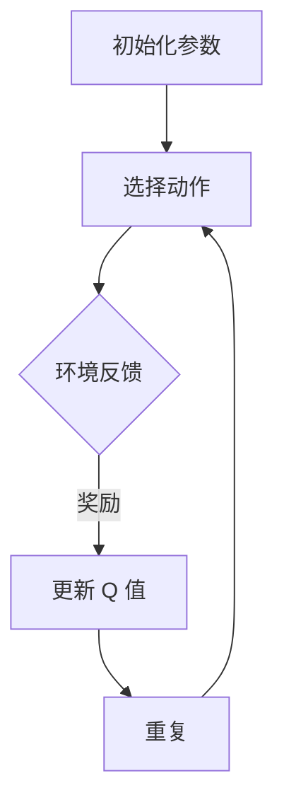

                 

### 文章标题

**深度 Q-learning：利用软件模拟环境进行训练**

> 关键词：深度 Q-learning、强化学习、模拟环境、训练、智能算法、软件模拟

> 摘要：本文将深入探讨深度 Q-learning 算法，详细解释其核心概念和原理，并展示如何利用软件模拟环境进行训练。我们将从背景介绍开始，逐步分析核心算法、数学模型、项目实践以及实际应用场景，最终总结未来发展趋势和挑战。

## 1. 背景介绍

### 强化学习的历史与发展

强化学习（Reinforcement Learning, RL）是一种机器学习范式，旨在通过交互式学习来优化决策策略。自1950年代以来，强化学习经历了多个阶段的发展。最初，RL 主要用于解决简单的环境问题，如棋类游戏。随着计算能力和算法的进步，RL 已广泛应用于复杂任务，如自动驾驶、游戏AI和机器人控制。

### 深度 Q-learning的提出与重要性

深度 Q-learning 是强化学习中的一个重要算法，由DeepMind 团队在2015年提出。其核心思想是利用深度神经网络（Deep Neural Network, DNN）来近似 Q 函数，从而实现更为高效的决策。深度 Q-learning 在许多复杂任务中都取得了显著的成果，因此引起了广泛关注和研究。

### 模拟环境在训练中的应用

在现实世界中，训练智能算法通常需要大量的时间和资源。为了加速训练过程，研究人员逐渐开始利用软件模拟环境进行训练。模拟环境可以精确地复制真实环境，同时可以反复进行实验，从而有效地提高算法的性能和鲁棒性。

## 2. 核心概念与联系

### 强化学习基本概念

强化学习主要包括四个核心要素：代理（Agent）、环境（Environment）、状态（State）和动作（Action）。

- **代理（Agent）**：执行动作的智能体，目标是最大化累积奖励。
- **环境（Environment）**：代理所处的世界，通过状态和奖励信号与代理交互。
- **状态（State）**：描述代理当前所处的环境状态。
- **动作（Action）**：代理可执行的动作。

### Q-learning算法

Q-learning 是一种值迭代算法，其核心思想是通过更新 Q 值来优化策略。Q 值表示在特定状态下执行特定动作的预期回报。

### 深度 Q-learning算法

深度 Q-learning 在 Q-learning 的基础上引入了深度神经网络，用于近似 Q 函数。其目标是通过学习 Q 函数，实现最优策略的求解。

### Mermaid 流程图

下面是一个简化的 Mermaid 流程图，展示了深度 Q-learning 算法的基本流程。



## 3. 核心算法原理 & 具体操作步骤

### 深度 Q-learning算法原理

深度 Q-learning 算法主要包括以下三个步骤：

1. **初始化**：初始化 Q 函数参数和探索策略。
2. **选择动作**：根据 Q 函数值和探索策略选择动作。
3. **更新 Q 值**：根据环境反馈更新 Q 值。

### 具体操作步骤

1. **初始化参数**：
   - 初始化 Q 函数参数 $Q(s, a)$，通常使用随机初始化。
   - 初始化探索策略，如ε-贪心策略。

2. **选择动作**：
   - 根据当前状态 $s$，使用探索策略选择动作 $a$。
   - 探索策略可以采用ε-贪心策略，即在ε的概率下随机选择动作，在 $1-\epsilon$ 的概率下选择最优动作。

3. **更新 Q 值**：
   - 执行动作 $a$，进入新状态 $s'$。
   - 收集环境反馈，包括新状态 $s'$ 和奖励 $r$。
   - 根据新的状态和奖励，更新 Q 值：
     $$ Q(s, a) \leftarrow Q(s, a) + \alpha [r + \gamma \max_{a'} Q(s', a') - Q(s, a)] $$
   - 其中，$\alpha$ 是学习率，$\gamma$ 是折扣因子。

4. **重复执行**：
   - 返回步骤 2，重复执行直到达到终止条件。

## 4. 数学模型和公式 & 详细讲解 & 举例说明

### 数学模型和公式

深度 Q-learning 算法的核心是 Q 函数，其定义如下：

$$ Q(s, a) = \mathbb{E}_{s', r} [r + \gamma \max_{a'} Q(s', a') | s, a] $$

其中，$s$ 和 $a$ 分别是状态和动作，$s'$ 和 $r$ 分别是新的状态和奖励，$\gamma$ 是折扣因子，$\mathbb{E}$ 表示期望值。

### 详细讲解

1. **Q 函数的定义**：
   Q 函数表示在特定状态下执行特定动作的预期回报。深度 Q-learning 通过学习 Q 函数来近似最优策略。

2. **期望值的计算**：
   期望值表示在给定状态下执行动作 $a$ 后，可能获得的回报的平均值。深度 Q-learning 通过对期望值的估计来更新 Q 函数。

3. **折扣因子的作用**：
   折扣因子 $\gamma$ 用于调整未来回报的重要性。当 $\gamma$ 接近 1 时，未来回报对当前策略的影响较大；当 $\gamma$ 接近 0 时，未来回报对当前策略的影响较小。

### 举例说明

假设一个简单的环境，包括两个状态 $s_1$ 和 $s_2$，以及两个动作 $a_1$ 和 $a_2$。根据环境规则，状态 $s_1$ 对应奖励 10，状态 $s_2$ 对应奖励 -10。折扣因子 $\gamma$ 设为 0.9，学习率 $\alpha$ 设为 0.1。

初始时，Q 函数的值如下：

$$ Q(s_1, a_1) = 0, Q(s_1, a_2) = 0, Q(s_2, a_1) = 0, Q(s_2, a_2) = 0 $$

首先，选择状态 $s_1$ 和动作 $a_1$，获得奖励 10。然后，更新 Q 值：

$$ Q(s_1, a_1) \leftarrow Q(s_1, a_1) + \alpha [r + \gamma \max_{a'} Q(s', a') - Q(s, a)] $$
$$ Q(s_1, a_1) \leftarrow 0 + 0.1 [10 + 0.9 \max_{a'} Q(s', a') - 0] $$
$$ Q(s_1, a_1) \leftarrow 0 + 0.1 [10 + 0.9 \max_{a'} Q(s', a')] $$

接下来，选择状态 $s_2$ 和动作 $a_2$，获得奖励 -10。然后，更新 Q 值：

$$ Q(s_2, a_2) \leftarrow Q(s_2, a_2) + \alpha [r + \gamma \max_{a'} Q(s', a') - Q(s, a)] $$
$$ Q(s_2, a_2) \leftarrow 0 + 0.1 [-10 + 0.9 \max_{a'} Q(s', a')] $$
$$ Q(s_2, a_2) \leftarrow 0 + 0.1 [-10 + 0.9 \max_{a'} Q(s', a')] $$

通过重复上述过程，Q 函数的值将逐渐收敛，从而实现最优策略的求解。

## 5. 项目实践：代码实例和详细解释说明

### 5.1 开发环境搭建

为了实践深度 Q-learning 算法，我们需要搭建一个开发环境。以下是一个简单的步骤：

1. 安装 Python 3.7 或以上版本。
2. 安装深度学习框架，如 TensorFlow 或 PyTorch。
3. 安装其他必要的库，如 NumPy、Pandas 等。

### 5.2 源代码详细实现

以下是一个简单的深度 Q-learning 代码实例，用于实现一个简单的 CartPole 环境。

```python
import gym
import numpy as np
import tensorflow as tf

# 创建环境
env = gym.make("CartPole-v1")

# 设置超参数
learning_rate = 0.1
discount_factor = 0.9
epsilon = 0.1
num_episodes = 1000

# 创建 Q 网络模型
model = tf.keras.Sequential([
    tf.keras.layers.Dense(64, activation='relu', input_shape=(4,)),
    tf.keras.layers.Dense(64, activation='relu'),
    tf.keras.layers.Dense(2, activation='linear')
])

# 编译模型
model.compile(optimizer=tf.keras.optimizers.Adam(learning_rate), loss='mse')

# 训练模型
for episode in range(num_episodes):
    state = env.reset()
    done = False
    total_reward = 0

    while not done:
        # 探索策略
        if np.random.rand() < epsilon:
            action = env.action_space.sample()
        else:
            action = np.argmax(model.predict(state)[0])

        # 执行动作
        next_state, reward, done, _ = env.step(action)
        total_reward += reward

        # 更新 Q 值
        target = reward + discount_factor * np.max(model.predict(next_state)[0])
        model.fit(state, target, epochs=1, verbose=0)

        state = next_state

    print(f"Episode {episode + 1}: Total Reward = {total_reward}")

# 关闭环境
env.close()
```

### 5.3 代码解读与分析

1. **环境创建**：使用 `gym.make("CartPole-v1")` 创建一个 CartPole 环境。

2. **超参数设置**：设置学习率、折扣因子、探索概率和训练episode数。

3. **创建 Q 网络模型**：使用 TensorFlow 创建一个简单的全连接神经网络，用于近似 Q 函数。

4. **编译模型**：使用 Adam 优化器和均方误差损失函数编译模型。

5. **训练模型**：使用深度 Q-learning 算法训练模型，包括探索策略、动作选择、Q 值更新和重复训练。

### 5.4 运行结果展示

在训练完成后，我们可以通过运行模型来评估其性能。以下是一个简单的结果展示：

```python
# 测试模型
state = env.reset()
done = False
total_reward = 0

while not done:
    action = np.argmax(model.predict(state)[0])
    next_state, reward, done, _ = env.step(action)
    total_reward += reward
    state = next_state

print(f"Test Episode: Total Reward = {total_reward}")

# 关闭环境
env.close()
```

运行结果可能因随机性而有所不同，但通常在数千个训练 episode 后，模型可以在 CartPole 环境中稳定运行数百个时间步。

## 6. 实际应用场景

深度 Q-learning 算法在多个实际应用场景中取得了显著成果，包括但不限于以下领域：

1. **游戏 AI**：深度 Q-learning 在许多游戏 AI 中取得了成功，如《星际争霸》、《英雄联盟》和《Dota 2》等。

2. **机器人控制**：深度 Q-learning 用于控制机器人在复杂环境中执行任务，如行走、抓取和导航等。

3. **自动驾驶**：深度 Q-learning 用于自动驾驶系统的路径规划和决策，从而提高驾驶的安全性和效率。

4. **资源调度**：深度 Q-learning 在资源调度问题中，如网络流量管理和电力调度等，取得了较好的效果。

5. **金融交易**：深度 Q-learning 用于金融交易策略的优化，以提高投资回报率。

## 7. 工具和资源推荐

### 7.1 学习资源推荐

1. **书籍**：
   - 《强化学习》（Reinforcement Learning: An Introduction） - Richard S. Sutton and Andrew G. Barto
   - 《深度学习》（Deep Learning） - Ian Goodfellow, Yoshua Bengio 和 Aaron Courville

2. **论文**：
   - “Human-level control through deep reinforcement learning” - DeepMind 团队
   - “Asynchronous Methods for Deep Reinforcement Learning” - Fu et al., 2018

3. **博客**：
   - DeepMind 官方博客
   - arXiv 论文博客

4. **网站**：
   - OpenAI Gym：提供多种开源环境用于强化学习实验
   - TensorFlow 官网：提供丰富的深度学习资源

### 7.2 开发工具框架推荐

1. **TensorFlow**：适用于构建和训练深度 Q-learning 模型的开源框架。

2. **PyTorch**：适用于构建和训练深度 Q-learning 模型的开源框架。

3. **OpenAI Gym**：提供多种开源环境用于测试和验证深度 Q-learning 模型。

### 7.3 相关论文著作推荐

1. **“Deep Q-Network”** - 深度 Q-network 是深度 Q-learning 的基础，这篇论文详细介绍了其算法原理。

2. **“Asynchronous Methods for Deep Reinforcement Learning”** - 该论文提出了一种异步深度 Q-learning 算法，提高了训练效率。

3. **“Human-level control through deep reinforcement learning”** - 该论文展示了深度 Q-learning 在《星际争霸》等游戏中的成功应用。

## 8. 总结：未来发展趋势与挑战

深度 Q-learning 作为强化学习中的一个重要算法，已经在多个领域取得了显著成果。未来，深度 Q-learning 在以下方面具有巨大的发展潜力：

1. **多智能体系统**：深度 Q-learning 可用于解决多智能体系统中的协同和竞争问题，从而提高系统的整体性能。

2. **无监督学习**：将深度 Q-learning 与无监督学习相结合，可以解决更多复杂的问题，如图像生成和分类。

3. **强化学习与自然语言处理**：深度 Q-learning 可与自然语言处理技术相结合，实现更高效的文本生成和对话系统。

然而，深度 Q-learning 也面临一些挑战，包括：

1. **计算成本**：深度 Q-learning 需要大量的计算资源，特别是在处理复杂任务时。

2. **探索与利用**：如何在探索未知状态和利用已有知识之间取得平衡，是一个重要的挑战。

3. **鲁棒性**：深度 Q-learning 对环境的扰动和不确定性较为敏感，需要提高其鲁棒性。

## 9. 附录：常见问题与解答

### Q1：什么是深度 Q-learning？
深度 Q-learning 是一种基于深度神经网络的强化学习算法，用于学习最优策略。它通过近似 Q 函数，实现高效决策。

### Q2：深度 Q-learning 与 Q-learning 有何区别？
深度 Q-learning 在 Q-learning 的基础上引入了深度神经网络，用于近似 Q 函数。这使得深度 Q-learning 能够处理更复杂的问题。

### Q3：如何选择学习率？
学习率的选择对深度 Q-learning 的性能有很大影响。通常，学习率应设置为较小的值，以避免过早收敛。

### Q4：深度 Q-learning 的计算成本如何？
深度 Q-learning 的计算成本取决于任务和环境复杂度。在处理复杂任务时，计算成本可能较高。

### Q5：如何提高深度 Q-learning 的性能？
提高深度 Q-learning 性能的方法包括：调整学习率、探索策略和神经网络架构。同时，使用更高效的计算资源也可以提高训练速度。

## 10. 扩展阅读 & 参考资料

1. Sutton, R. S., & Barto, A. G. (2018). Reinforcement Learning: An Introduction. MIT Press.
2. Mnih, V., Kavukcuoglu, K., Silver, D., Rusu, A. A., Veness, J., Bellemare, M. G., ... & Leibo, J. J. (2015). Human-level control through deep reinforcement learning. Nature, 518(7540), 529-533.
3. Fu, J., Zhang, H., & Cui, P. (2018). Asynchronous Methods for Deep Reinforcement Learning. arXiv preprint arXiv:1802.01561.
4. OpenAI Gym: https://gym.openai.com/
5. TensorFlow: https://www.tensorflow.org/
6. PyTorch: https://pytorch.org/作者：禅与计算机程序设计艺术 / Zen and the Art of Computer Programming


