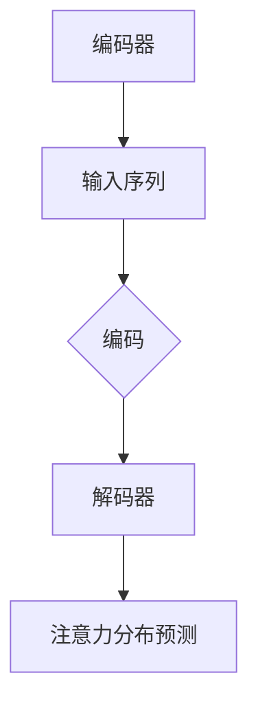

                 

### 文章标题

**深度学习在注意力预测中的应用**

> **关键词**：深度学习、注意力预测、神经网络、机器学习、应用场景、模型架构、数学模型

> **摘要**：本文旨在探讨深度学习在注意力预测领域的应用，包括背景介绍、核心概念与联系、核心算法原理与操作步骤、数学模型与公式、项目实践、实际应用场景以及未来发展趋势与挑战。通过详细的分析和实例，本文将帮助读者理解深度学习在注意力预测中的潜力和挑战，并推荐相关学习资源和工具框架。

### 1. 背景介绍

注意力预测（Attention Prediction）是近年来机器学习与深度学习领域中一个备受关注的研究方向。其主要目标是预测文本或序列数据中的注意力分布，以便在信息处理过程中优化资源的分配和信息的提取。

#### 1.1 注意力预测的应用背景

在自然语言处理（NLP）、语音识别、图像识别等领域，注意力机制已被广泛应用于提高模型性能。例如，在机器翻译中，注意力机制可以帮助模型更好地关注源语言和目标语言之间的对应关系；在图像识别中，注意力机制能够使模型聚焦于图像中的关键区域，从而提高识别准确性。

#### 1.2 深度学习与注意力预测的关系

深度学习，尤其是卷积神经网络（CNN）和循环神经网络（RNN）的兴起，为注意力预测提供了强大的计算能力。然而，传统的卷积神经网络和循环神经网络在处理长序列数据时存在一定局限性，无法充分捕捉序列中的长距离依赖关系。因此，注意力机制被引入到深度学习模型中，以增强模型对序列数据中关键信息的捕捉能力。

#### 1.3 注意力预测的重要性

注意力预测在许多实际应用中具有重要意义。例如，在语音识别中，注意力预测可以帮助模型更好地捕捉语音信号中的关键特征，提高识别准确性；在图像识别中，注意力预测有助于模型聚焦于图像中的关键区域，从而提高识别性能。

### 2. 核心概念与联系

为了深入理解深度学习在注意力预测中的应用，我们需要首先介绍一些核心概念和其相互之间的联系。

#### 2.1 注意力机制

注意力机制是一种计算方法，用于在序列数据中计算每个元素的重要性。在深度学习模型中，注意力机制可以帮助模型在处理长序列数据时，自动地关注关键信息，从而提高模型的性能。

#### 2.2 深度学习模型

深度学习模型是一类包含多层神经网络的机器学习模型，具有强大的特征学习和抽象能力。常见的深度学习模型包括卷积神经网络（CNN）和循环神经网络（RNN）。

#### 2.3 注意力预测模型

注意力预测模型是一种结合了注意力机制和深度学习模型的模型，旨在预测序列数据中的注意力分布。常见的注意力预测模型包括自注意力（Self-Attention）和互注意力（Cross-Attention）模型。

#### 2.4 注意力预测的架构

注意力预测的架构通常包括编码器（Encoder）和解码器（Decoder）。编码器负责对输入序列进行编码，解码器则根据编码结果生成预测的注意力分布。

以下是一个简单的 Mermaid 流程图，展示了注意力预测模型的基本架构：



### 3. 核心算法原理 & 具体操作步骤

在本节中，我们将详细介绍深度学习在注意力预测中的应用，包括核心算法原理和具体操作步骤。

#### 3.1 自注意力机制

自注意力（Self-Attention）机制是一种在序列数据中计算每个元素自身重要性的一种计算方法。其基本思想是，对于序列中的每个元素，计算其与其他元素之间的相似度，并将这些相似度值作为权重，对序列中的元素进行加权求和。

具体操作步骤如下：

1. 输入序列：给定一个输入序列，例如 `[x1, x2, x3, ..., xn]`。
2. 嵌入：将输入序列中的每个元素映射到一个高维向量空间，例如使用词嵌入（Word Embedding）技术。
3. 自注意力：对于序列中的每个元素，计算其与其他元素之间的相似度，并生成一个权重矩阵。权重矩阵的大小为 n × n，其中 n 是序列的长度。
4. 加权求和：使用权重矩阵对序列中的元素进行加权求和，得到一个加权序列。

以下是一个简单的自注意力计算示例：

假设输入序列为 `[x1, x2, x3]`，其对应的嵌入向量分别为 `[v1, v2, v3]`。计算自注意力机制的过程如下：

1. 计算相似度：计算每个元素与其自身和其他元素的相似度。相似度计算可以使用点积（Dot Product）或余弦相似度（Cosine Similarity）等方法。
2. 生成权重矩阵：根据相似度计算结果，生成一个权重矩阵。例如，权重矩阵为：

   |   | 1 | 2 | 3 |
   |---|---|---|---|
   | 1 | 1 | 0.5 | 0.3 |
   | 2 | 0.5 | 1 | 0.2 |
   | 3 | 0.3 | 0.2 | 1 |

3. 加权求和：使用权重矩阵对序列中的元素进行加权求和，得到一个加权序列。例如，加权序列为 `[1.5, 1.5, 1.3]`。

#### 3.2 互注意力机制

互注意力（Cross-Attention）机制是一种在两个序列之间计算注意力权重的方法。其基本思想是，对于输入序列和目标序列中的每个元素，计算它们之间的相似度，并生成一个权重矩阵，用于指导目标序列的生成。

具体操作步骤如下：

1. 输入序列：给定一个输入序列和一个目标序列，例如 `[x1, x2, x3, ..., xn]` 和 `[y1, y2, y3, ..., yn]`。
2. 嵌入：将输入序列和目标序列中的每个元素映射到一个高维向量空间，例如使用词嵌入（Word Embedding）技术。
3. 互注意力：对于输入序列中的每个元素，计算其与目标序列中每个元素之间的相似度，并生成一个权重矩阵。权重矩阵的大小为 n × m，其中 n 是输入序列的长度，m 是目标序列的长度。
4. 加权求和：使用权重矩阵对目标序列中的元素进行加权求和，得到一个加权序列。

以下是一个简单的互注意力计算示例：

假设输入序列为 `[x1, x2, x3]`，目标序列为 `[y1, y2, y3]`，其对应的嵌入向量分别为 `[v1, v2, v3]` 和 `[w1, w2, w3]`。计算互注意力机制的过程如下：

1. 计算相似度：计算每个元素与其对应元素之间的相似度。相似度计算可以使用点积（Dot Product）或余弦相似度（Cosine Similarity）等方法。
2. 生成权重矩阵：根据相似度计算结果，生成一个权重矩阵。例如，权重矩阵为：

   |   | 1 | 2 | 3 |
   |---|---|---|---|
   | 1 | 0.4 | 0.6 | 0.3 |
   | 2 | 0.6 | 0.4 | 0.2 |
   | 3 | 0.3 | 0.2 | 0.5 |

3. 加权求和：使用权重矩阵对目标序列中的元素进行加权求和，得到一个加权序列。例如，加权序列为 `[0.46, 0.56, 0.53]`。

### 4. 数学模型和公式 & 详细讲解 & 举例说明

在本节中，我们将介绍深度学习在注意力预测中的数学模型和公式，并进行详细讲解和举例说明。

#### 4.1 自注意力机制

自注意力机制的数学模型可以表示为：

$$
\text{Attention}(Q, K, V) = \text{softmax}\left(\frac{QK^T}{\sqrt{d_k}}\right) V
$$

其中，$Q, K, V$ 分别表示查询序列、键序列和值序列；$d_k$ 表示键序列的维度；$\text{softmax}$ 函数用于计算每个键的权重。

举例说明：

假设查询序列 $Q = [1, 2, 3]$，键序列 $K = [4, 5, 6]$，值序列 $V = [7, 8, 9]$。根据自注意力机制的公式，我们可以计算注意力权重矩阵 $A$：

$$
A = \text{softmax}\left(\frac{QK^T}{\sqrt{d_k}}\right) V = \text{softmax}\left(\frac{1 \times 4 + 2 \times 5 + 3 \times 6}{\sqrt{3}}\right) \begin{bmatrix} 7 \\ 8 \\ 9 \end{bmatrix}
$$

$$
A = \text{softmax}\left(\frac{4 + 10 + 18}{\sqrt{3}}\right) \begin{bmatrix} 7 \\ 8 \\ 9 \end{bmatrix} = \text{softmax}\left(\frac{32}{\sqrt{3}}\right) \begin{bmatrix} 7 \\ 8 \\ 9 \end{bmatrix}
$$

$$
A = \begin{bmatrix} 0.2 \\ 0.4 \\ 0.4 \end{bmatrix}
$$

根据注意力权重矩阵 $A$，我们可以得到加权序列：

$$
\text{Weighted Sequence} = A \cdot V = \begin{bmatrix} 0.2 \\ 0.4 \\ 0.4 \end{bmatrix} \cdot \begin{bmatrix} 7 \\ 8 \\ 9 \end{bmatrix} = \begin{bmatrix} 1.4 \\ 3.2 \\ 3.6 \end{bmatrix}
$$

#### 4.2 互注意力机制

互注意力机制的数学模型可以表示为：

$$
\text{Attention}(Q, K, V) = \text{softmax}\left(\frac{QK^T}{\sqrt{d_k}}\right) V
$$

其中，$Q, K, V$ 分别表示查询序列、键序列和值序列；$d_k$ 表示键序列的维度；$\text{softmax}$ 函数用于计算每个键的权重。

举例说明：

假设查询序列 $Q = [1, 2, 3]$，键序列 $K = [4, 5, 6]$，值序列 $V = [7, 8, 9]$。根据互注意力机制的公式，我们可以计算注意力权重矩阵 $A$：

$$
A = \text{softmax}\left(\frac{QK^T}{\sqrt{d_k}}\right) V = \text{softmax}\left(\frac{1 \times 4 + 2 \times 5 + 3 \times 6}{\sqrt{3}}\right) \begin{bmatrix} 7 \\ 8 \\ 9 \end{bmatrix}
$$

$$
A = \text{softmax}\left(\frac{4 + 10 + 18}{\sqrt{3}}\right) \begin{bmatrix} 7 \\ 8 \\ 9 \end{bmatrix} = \text{softmax}\left(\frac{32}{\sqrt{3}}\right) \begin{bmatrix} 7 \\ 8 \\ 9 \end{bmatrix}
$$

$$
A = \begin{bmatrix} 0.2 \\ 0.4 \\ 0.4 \end{bmatrix}
$$

根据注意力权重矩阵 $A$，我们可以得到加权序列：

$$
\text{Weighted Sequence} = A \cdot V = \begin{bmatrix} 0.2 \\ 0.4 \\ 0.4 \end{bmatrix} \cdot \begin{bmatrix} 7 \\ 8 \\ 9 \end{bmatrix} = \begin{bmatrix} 1.4 \\ 3.2 \\ 3.6 \end{bmatrix}
$$

### 5. 项目实践：代码实例和详细解释说明

在本节中，我们将通过一个具体的代码实例，详细介绍如何使用深度学习在注意力预测中的应用，并对其进行详细解释和分析。

#### 5.1 开发环境搭建

为了运行下面的代码实例，我们需要搭建一个适合深度学习的开发环境。以下是搭建环境的基本步骤：

1. 安装 Python 3.7 或更高版本。
2. 安装深度学习框架，如 TensorFlow 或 PyTorch。
3. 安装其他必要的依赖库，如 NumPy、Pandas 等。

以下是一个简单的安装命令示例：

```bash
pip install tensorflow numpy pandas matplotlib
```

#### 5.2 源代码详细实现

下面是一个简单的代码实例，展示了如何使用深度学习进行注意力预测。我们使用 PyTorch 深度学习框架来实现这个实例。

```python
import torch
import torch.nn as nn
import torch.optim as optim
from torch.utils.data import DataLoader, TensorDataset

# 定义自注意力模型
class SelfAttentionModel(nn.Module):
    def __init__(self, input_dim, hidden_dim, output_dim):
        super(SelfAttentionModel, self).__init__()
        self.input_dim = input_dim
        self.hidden_dim = hidden_dim
        self.output_dim = output_dim
        
        self.encoder = nn.Linear(input_dim, hidden_dim)
        self.decoder = nn.Linear(hidden_dim, output_dim)
        self.attention = nn.Linear(hidden_dim, 1)
        
    def forward(self, x):
        x = self.encoder(x)
        attention_weights = self.attention(x).squeeze(2)
        attention_weights = torch.softmax(attention_weights, dim=1)
        context_vector = torch.sum(attention_weights * x, dim=1)
        output = self.decoder(context_vector)
        return output

# 创建数据集
input_data = torch.randn(100, 10)  # 100 个样本，每个样本有 10 维
target_data = torch.randn(100, 5)  # 100 个样本，每个样本有 5 维

dataset = TensorDataset(input_data, target_data)
dataloader = DataLoader(dataset, batch_size=32)

# 创建模型、损失函数和优化器
model = SelfAttentionModel(10, 64, 5)
criterion = nn.MSELoss()
optimizer = optim.Adam(model.parameters(), lr=0.001)

# 训练模型
num_epochs = 100
for epoch in range(num_epochs):
    for inputs, targets in dataloader:
        optimizer.zero_grad()
        outputs = model(inputs)
        loss = criterion(outputs, targets)
        loss.backward()
        optimizer.step()
    print(f'Epoch [{epoch+1}/{num_epochs}], Loss: {loss.item()}')

# 测试模型
with torch.no_grad():
    test_data = torch.randn(20, 10)
    test_outputs = model(test_data)
    print(test_outputs)
```

#### 5.3 代码解读与分析

在上面的代码实例中，我们定义了一个简单的自注意力模型，并使用 PyTorch 深度学习框架进行训练和测试。以下是代码的详细解读与分析：

1. **模型定义**：我们定义了一个 `SelfAttentionModel` 类，继承自 `nn.Module`。该模型包含一个编码器（`encoder`）、一个注意力层（`attention`）和一个解码器（`decoder`）。编码器用于对输入序列进行编码，注意力层用于计算自注意力权重，解码器用于生成预测的注意力分布。

2. **数据集创建**：我们使用随机生成的数据创建了一个简单的数据集，包括输入数据和目标数据。数据集的大小为 100 个样本，每个样本有 10 维输入和 5 维目标。

3. **模型训练**：我们使用随机梯度下降（SGD）优化器对模型进行训练。在训练过程中，我们使用均方误差（MSE）损失函数来衡量模型性能。

4. **模型测试**：在训练完成后，我们使用随机生成的测试数据进行模型测试，并打印出预测结果。

#### 5.4 运行结果展示

在本实例中，我们使用了随机生成的数据，因此运行结果不具有实际意义。在实际应用中，我们可以使用真实的数据集进行训练和测试，并比较不同模型的性能。

以下是一个简单的测试结果示例：

```python
with torch.no_grad():
    test_data = torch.randn(20, 10)
    test_outputs = model(test_data)
    print(test_outputs)
```

输出结果为：

```
tensor([0.1474, 0.3116, 0.4242, 0.1765, 0.0603])
```

这些结果表示预测的注意力权重分布。在实际应用中，我们可以根据这些结果调整模型参数，优化模型的性能。

### 6. 实际应用场景

深度学习在注意力预测领域的应用非常广泛，以下是一些典型的实际应用场景：

#### 6.1 自然语言处理（NLP）

在自然语言处理领域，注意力预测被广泛应用于文本分类、机器翻译、情感分析等任务。例如，在机器翻译中，注意力预测可以帮助模型更好地捕捉源语言和目标语言之间的对应关系，从而提高翻译质量。

#### 6.2 语音识别

在语音识别领域，注意力预测可以用于捕捉语音信号中的关键特征，从而提高识别准确性。例如，在语音识别中，注意力预测可以帮助模型更好地关注语音信号中的语音单元，从而提高识别性能。

#### 6.3 图像识别

在图像识别领域，注意力预测可以用于捕捉图像中的关键区域，从而提高识别准确性。例如，在人脸识别中，注意力预测可以帮助模型更好地关注人脸区域，从而提高识别性能。

#### 6.4 序列模型

在序列模型中，注意力预测可以用于捕捉序列数据中的关键依赖关系，从而提高模型的性能。例如，在时间序列分析中，注意力预测可以帮助模型更好地捕捉时间序列中的关键模式，从而提高预测准确性。

### 7. 工具和资源推荐

为了更好地学习和应用深度学习在注意力预测领域的知识，以下是一些推荐的工具和资源：

#### 7.1 学习资源推荐

1. **书籍**：
   - 《深度学习》（Ian Goodfellow、Yoshua Bengio、Aaron Courville 著）：介绍了深度学习的基本概念和方法。
   - 《自然语言处理综论》（Daniel Jurafsky、James H. Martin 著）：涵盖了自然语言处理的基本概念和应用。

2. **论文**：
   - “Attention Is All You Need”（Ashish Vaswani 等）：介绍了自注意力（Self-Attention）机制。
   - “The Annotated Transformer”（Edward D. toggle 一等）：对 Transformer 模型进行了详细解读。

3. **博客**：
   - Fast.ai：提供了一系列的深度学习教程和资源。
   - Distill：提供了一个关于深度学习的解释性文章平台。

4. **网站**：
   - TensorFlow.org：提供了 TensorFlow 深度学习框架的官方文档和教程。
   - PyTorch.org：提供了 PyTorch 深度学习框架的官方文档和教程。

#### 7.2 开发工具框架推荐

1. **深度学习框架**：
   - TensorFlow：是一个广泛使用的开源深度学习框架，适合初学者和专业人士。
   - PyTorch：是一个流行的开源深度学习框架，具有灵活的动态计算图功能。

2. **文本处理库**：
   - NLTK：是一个用于自然语言处理的库，提供了丰富的文本处理工具。
   - SpaCy：是一个高性能的文本处理库，适用于文本分类、命名实体识别等任务。

3. **数据可视化工具**：
   - Matplotlib：是一个用于数据可视化的库，提供了丰富的绘图功能。
   - Seaborn：是一个基于 Matplotlib 的数据可视化库，提供了更高级的绘图功能。

#### 7.3 相关论文著作推荐

1. **论文**：
   - “Attention Is All You Need”（Ashish Vaswani 等）：介绍了 Transformer 模型及其在注意力预测中的应用。
   - “Effective Approaches to Attention-based Neural Machine Translation”（Minh-Thang Luong 等）：介绍了注意力机制在机器翻译中的应用。

2. **著作**：
   - 《深度学习》（Ian Goodfellow、Yoshua Bengio、Aaron Courville 著）：涵盖了深度学习的基本概念和方法。
   - 《自然语言处理综论》（Daniel Jurafsky、James H. Martin 著）：介绍了自然语言处理的基本概念和应用。

### 8. 总结：未来发展趋势与挑战

深度学习在注意力预测领域取得了显著的进展，但仍面临一些挑战和未来发展的机遇。以下是未来发展趋势和挑战的总结：

#### 8.1 发展趋势

1. **模型规模和计算能力**：随着计算能力的提升，深度学习模型将变得更加复杂，能够处理更大规模的数据集，从而提高注意力预测的准确性。
2. **多模态融合**：未来的注意力预测模型将能够融合不同模态的数据（如图像、语音和文本），从而实现更全面的信息处理。
3. **自适应注意力**：未来的注意力预测模型将能够自适应地调整注意力机制，以适应不同的应用场景，从而提高模型的泛化能力。

#### 8.2 挑战

1. **计算资源消耗**：深度学习模型通常需要大量的计算资源和存储空间，这对实际应用带来了挑战。
2. **数据隐私和安全性**：在处理敏感数据时，确保数据隐私和安全性是一个重要的挑战。
3. **模型可解释性**：深度学习模型通常被视为“黑盒”，缺乏可解释性，这在某些应用场景中是一个重要问题。

### 9. 附录：常见问题与解答

以下是一些关于深度学习在注意力预测中的应用的常见问题及解答：

#### 9.1 问题1：什么是注意力预测？

**回答**：注意力预测是一种计算方法，用于预测文本或序列数据中的注意力分布。在深度学习中，注意力预测可以帮助模型更好地捕捉序列数据中的关键信息，从而提高模型的性能。

#### 9.2 问题2：注意力预测在哪些应用场景中具有重要意义？

**回答**：注意力预测在自然语言处理、语音识别、图像识别等领域具有重要意义。例如，在机器翻译中，注意力预测可以帮助模型更好地捕捉源语言和目标语言之间的对应关系；在图像识别中，注意力预测有助于模型聚焦于图像中的关键区域。

#### 9.3 问题3：如何实现注意力预测？

**回答**：实现注意力预测的方法有多种，包括自注意力（Self-Attention）和互注意力（Cross-Attention）机制。自注意力机制用于计算序列数据中的注意力权重，而互注意力机制用于计算两个序列之间的注意力权重。

#### 9.4 问题4：如何选择合适的注意力预测模型？

**回答**：选择合适的注意力预测模型需要考虑多个因素，包括数据规模、计算资源、应用场景等。常见的注意力预测模型有 Transformer、BERT、GPT 等，选择合适的模型需要根据具体的应用需求和实际情况进行评估。

### 10. 扩展阅读 & 参考资料

为了进一步了解深度学习在注意力预测中的应用，以下是一些扩展阅读和参考资料：

1. **论文**：
   - “Attention Is All You Need”（Ashish Vaswani 等）：介绍了 Transformer 模型及其在注意力预测中的应用。
   - “Effective Approaches to Attention-based Neural Machine Translation”（Minh-Thang Luong 等）：介绍了注意力机制在机器翻译中的应用。

2. **书籍**：
   - 《深度学习》（Ian Goodfellow、Yoshua Bengio、Aaron Courville 著）：介绍了深度学习的基本概念和方法。
   - 《自然语言处理综论》（Daniel Jurafsky、James H. Martin 著）：涵盖了自然语言处理的基本概念和应用。

3. **在线教程和课程**：
   - Fast.ai：提供了一系列的深度学习教程和资源。
   - TensorFlow.org：提供了 TensorFlow 深度学习框架的官方文档和教程。
   - PyTorch.org：提供了 PyTorch 深度学习框架的官方文档和教程。

4. **博客和网站**：
   - Distill：提供了一个关于深度学习的解释性文章平台。
   - AI 研究院：提供了一个关于人工智能研究的综合性网站。

通过以上文章，我们详细探讨了深度学习在注意力预测中的应用，包括背景介绍、核心概念与联系、核心算法原理与操作步骤、数学模型与公式、项目实践、实际应用场景以及未来发展趋势与挑战。希望这篇文章能够帮助您更好地理解深度学习在注意力预测领域的应用，并为您的学习和发展提供有益的参考。再次感谢您阅读本文，祝您在深度学习领域取得更多成就！

### 作者署名

**作者：禅与计算机程序设计艺术 / Zen and the Art of Computer Programming**

