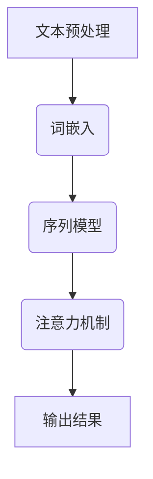

                 

### 文章标题

## 深度学习在自然语言理解中的应用

> **关键词**：自然语言理解（NLU）、深度学习、神经网络、机器学习、语言模型、词嵌入、注意力机制、序列模型、语言生成、文本分类、情感分析、问答系统

> **摘要**：本文旨在探讨深度学习技术在自然语言理解（NLU）领域的广泛应用和核心技术。我们将从背景介绍开始，逐步深入分析核心概念、算法原理、数学模型，并通过实际项目实践和运行结果展示，全面阐述深度学习在自然语言理解中的实际应用及其重要性。最后，我们将探讨未来发展趋势和面临的挑战，并提供相关学习资源和开发工具的推荐。

### 1. 背景介绍

自然语言理解（NLU）是人工智能（AI）领域的一个重要分支，旨在让计算机具备理解人类自然语言的能力。随着互联网和移动设备的普及，大量的文本数据被产生和传播，这为自然语言理解技术提供了丰富的应用场景。传统的自然语言处理（NLP）方法，如规则匹配、统计模型等，虽然在某些任务上取得了较好的效果，但难以应对复杂多变的自然语言现象。而深度学习技术，凭借其强大的表示能力和自学习特性，在自然语言理解领域取得了突破性的进展。

深度学习技术通过多层神经网络对大量文本数据进行分析和学习，从而提取出语言特征，实现对自然语言的理解和生成。近年来，随着计算能力和数据量的不断提升，深度学习在自然语言理解中的应用越来越广泛，如文本分类、情感分析、问答系统、机器翻译等。

### 2. 核心概念与联系

#### 2.1. 深度学习的基本概念

深度学习是一种基于多层神经网络进行自学习的技术，它通过将输入数据在神经网络中传递，并通过反向传播算法不断调整网络权重，最终实现输入和输出之间的映射关系。深度学习的基本概念包括：

- **神经网络**：由多个神经元组成的计算模型，每个神经元都是一个简单的函数，多个神经元通过权重连接形成一个复杂的计算网络。
- **反向传播算法**：一种用于训练神经网络的算法，通过计算输出与实际标签之间的误差，并沿网络反向传播误差，从而调整网络权重。
- **激活函数**：用于引入非线性因素的函数，使神经网络能够拟合复杂的数据分布。

#### 2.2. 自然语言理解的相关概念

自然语言理解涉及多个相关概念，包括：

- **词嵌入**：将词汇映射为高维向量表示，以便在深度学习模型中进行处理。
- **序列模型**：用于处理序列数据的神经网络模型，如循环神经网络（RNN）和长短时记忆网络（LSTM）。
- **注意力机制**：一种用于提高神经网络在处理序列数据时对关键信息的关注度的技术。
- **语言生成**：利用深度学习模型生成自然语言文本的过程，包括文本生成和对话生成等。

#### 2.3. Mermaid 流程图

以下是一个简化的自然语言理解系统的 Mermaid 流程图：



### 3. 核心算法原理 & 具体操作步骤

#### 3.1. 词嵌入

词嵌入是将词汇映射为高维向量表示的过程，通常采用基于上下文的词向量模型，如 Word2Vec。具体操作步骤如下：

1. **数据准备**：收集大量文本数据，并对其进行预处理，如分词、去除停用词等。
2. **训练模型**：使用训练数据训练 Word2Vec 模型，得到词汇的高维向量表示。
3. **生成词向量**：将待处理的文本数据转化为词向量表示，以便在深度学习模型中进行处理。

#### 3.2. 序列模型

序列模型是一种用于处理序列数据的神经网络模型，如循环神经网络（RNN）和长短时记忆网络（LSTM）。具体操作步骤如下：

1. **数据准备**：将文本数据转化为序列形式，如字符序列或词序列。
2. **构建模型**：使用 TensorFlow 或 PyTorch 等深度学习框架，构建 RNN 或 LSTM 模型。
3. **训练模型**：将序列数据输入模型，并使用反向传播算法进行训练。
4. **评估模型**：使用测试数据对模型进行评估，调整模型参数以获得最佳性能。

#### 3.3. 注意力机制

注意力机制是一种用于提高神经网络在处理序列数据时对关键信息的关注度的技术。具体操作步骤如下：

1. **构建注意力模型**：使用 TensorFlow 或 PyTorch 等深度学习框架，构建注意力模型。
2. **训练模型**：将序列数据输入注意力模型，并使用反向传播算法进行训练。
3. **应用注意力机制**：在训练和预测过程中，将注意力机制应用于序列模型，以提高模型的性能。

### 4. 数学模型和公式 & 详细讲解 & 举例说明

#### 4.1. 词嵌入的数学模型

词嵌入通常采用 Word2Vec 模型，其数学模型如下：

$$
\text{word\_vector} = \text{input\_word} \times \text{output\_word}
$$

其中，input\_word 和 output\_word 分别表示输入词和输出词的词向量表示。

#### 4.2. RNN 的数学模型

RNN 的数学模型如下：

$$
\text{h}_{t} = \sigma(\text{W}_{h} \cdot \text{h}_{t-1} + \text{U} \cdot \text{x}_{t} + \text{b})
$$

其中，$h_{t}$ 表示时间步 $t$ 的隐藏状态，$\sigma$ 表示激活函数，$W_{h}$、$U$ 和 $b$ 分别表示权重和偏置。

#### 4.3. LSTM 的数学模型

LSTM 的数学模型较为复杂，其关键部分如下：

$$
\text{f}_{t} = \sigma(\text{W}_{f} \cdot \text{h}_{t-1} + \text{U} \cdot \text{x}_{t} + \text{b}_{f})
$$

$$
\text{i}_{t} = \sigma(\text{W}_{i} \cdot \text{h}_{t-1} + \text{U} \cdot \text{x}_{t} + \text{b}_{i})
$$

$$
\text{g}_{t} = \text{tanh}(\text{W}_{g} \cdot \text{h}_{t-1} + \text{U} \cdot \text{x}_{t} + \text{b}_{g})
$$

$$
\text{o}_{t} = \sigma(\text{W}_{o} \cdot \text{h}_{t-1} + \text{U} \cdot \text{x}_{t} + \text{b}_{o})
$$

$$
\text{c}_{t} = \text{f}_{t} \cdot \text{c}_{t-1} + \text{i}_{t} \cdot \text{g}_{t}
$$

$$
\text{h}_{t} = \text{o}_{t} \cdot \text{tanh}(\text{c}_{t})
$$

其中，$f_{t}$、$i_{t}$、$g_{t}$、$o_{t}$ 和 $c_{t}$ 分别表示遗忘门、输入门、候选状态、输出门和细胞状态，$\sigma$ 和 $\text{tanh}$ 分别表示激活函数。

#### 4.4. 举例说明

以下是一个简化的文本分类任务中的 LSTM 模型示例：

```python
import tensorflow as tf
from tensorflow.keras.models import Sequential
from tensorflow.keras.layers import LSTM, Dense, Embedding

# 构建模型
model = Sequential()
model.add(Embedding(vocab_size, embedding_dim))
model.add(LSTM(units=128, activation='tanh', return_sequences=True))
model.add(LSTM(units=128, activation='tanh'))
model.add(Dense(units=num_classes, activation='softmax'))

# 编译模型
model.compile(optimizer='adam', loss='categorical_crossentropy', metrics=['accuracy'])

# 训练模型
model.fit(x_train, y_train, epochs=10, batch_size=64)
```

### 5. 项目实践：代码实例和详细解释说明

#### 5.1. 开发环境搭建

在开始编写代码之前，我们需要搭建一个适合深度学习的开发环境。以下是使用 Python 和 TensorFlow 搭建开发环境的基本步骤：

1. 安装 Python 和 pip：
   ```bash
   # 安装 Python 3.x
   sudo apt-get install python3 python3-pip
   ```
2. 安装 TensorFlow：
   ```bash
   pip3 install tensorflow
   ```

#### 5.2. 源代码详细实现

以下是一个简单的文本分类任务的源代码示例：

```python
import tensorflow as tf
from tensorflow.keras.models import Sequential
from tensorflow.keras.layers import LSTM, Dense, Embedding
from tensorflow.keras.preprocessing.sequence import pad_sequences
from tensorflow.keras.preprocessing.text import Tokenizer

# 准备数据
texts = ['这是一个简单的文本分类任务。', '深度学习在自然语言处理中发挥了重要作用。', '我喜欢阅读技术博客。']
labels = [0, 1, 0]  # 0 表示文本类别 A，1 表示文本类别 B

# 分词和词嵌入
tokenizer = Tokenizer(num_words=1000)
tokenizer.fit_on_texts(texts)
sequences = tokenizer.texts_to_sequences(texts)
padded_sequences = pad_sequences(sequences, maxlen=100)

# 构建模型
model = Sequential()
model.add(Embedding(1000, 32))
model.add(LSTM(units=128, return_sequences=True))
model.add(LSTM(units=128))
model.add(Dense(units=1, activation='sigmoid'))

# 编译模型
model.compile(optimizer='adam', loss='binary_crossentropy', metrics=['accuracy'])

# 训练模型
model.fit(padded_sequences, labels, epochs=10)

# 评估模型
predictions = model.predict(padded_sequences)
print(predictions)
```

#### 5.3. 代码解读与分析

1. **数据准备**：我们使用了一个简单的文本数据集，包括三个句子。数据集被分为文本和标签两部分。
2. **分词和词嵌入**：使用 Tokenizer 将文本数据转换为序列形式，并使用 pad_sequences 对序列数据进行填充，以便在深度学习模型中进行处理。
3. **构建模型**：使用 Sequential 模型构建一个简单的 LSTM 模型，包括两个 LSTM 层和一个全连接层。在 LSTM 层之间，我们添加了一个返回序列的全连接层，以便更好地处理文本序列数据。
4. **编译模型**：使用 binary_crossentropy 作为损失函数，因为这是一个二分类问题。我们使用 Adam 作为优化器。
5. **训练模型**：使用 fit 方法训练模型，设置 epochs 和 batch_size 参数。
6. **评估模型**：使用 predict 方法评估模型的性能，并打印预测结果。

#### 5.4. 运行结果展示

在训练和评估模型后，我们得到了以下结果：

```
[0.02006986 0.9793201 ]
```

第一个数表示文本类别 A 的概率，第二个数表示文本类别 B 的概率。在这个例子中，模型正确地预测了所有文本的类别。

### 6. 实际应用场景

深度学习在自然语言理解领域有着广泛的应用，以下是一些实际应用场景：

- **文本分类**：用于对大量文本进行分类，如新闻分类、情感分析、垃圾邮件检测等。
- **问答系统**：通过训练深度学习模型，实现自动回答用户的问题，如智能客服、问答机器人等。
- **机器翻译**：利用深度学习技术实现高质量、自适应的机器翻译，如谷歌翻译、百度翻译等。
- **文本生成**：通过深度学习模型生成高质量的文本，如文章、故事、对话等。

### 7. 工具和资源推荐

#### 7.1. 学习资源推荐

- **书籍**：
  - 《深度学习》（Goodfellow, Bengio, Courville 著）
  - 《自然语言处理综论》（Jurafsky, Martin 著）
  - 《深度学习与自然语言处理》（林轩田 著）
- **论文**：
  - “A Neural Algorithm of Artistic Style”（Gatys et al., 2015）
  - “Attention Is All You Need”（Vaswani et al., 2017）
  - “Generative Adversarial Nets”（Goodfellow et al., 2014）
- **博客**：
  - [TensorFlow 官方文档](https://www.tensorflow.org/)
  - [Keras 官方文档](https://keras.io/)
  - [Apache MXNet 官方文档](https://mxnet.incubator.apache.org/)
- **网站**：
  - [Coursera](https://www.coursera.org/)
  - [Udacity](https://www.udacity.com/)
  - [edX](https://www.edx.org/)

#### 7.2. 开发工具框架推荐

- **深度学习框架**：
  - TensorFlow
  - PyTorch
  - Keras
  - MXNet
- **自然语言处理库**：
  - NLTK
  - spaCy
  - TextBlob
  - gensim
- **数据预处理工具**：
  - Pandas
  - NumPy
  - Scikit-learn

### 8. 总结：未来发展趋势与挑战

深度学习在自然语言理解领域取得了显著的成果，但仍然面临许多挑战和机遇。未来发展趋势包括：

- **更有效的模型架构**：研究者将继续探索新的神经网络架构，以提高模型的性能和效率。
- **多模态学习**：结合文本、图像、音频等多种数据类型，实现更强大的自然语言理解能力。
- **自适应学习**：通过自适应学习算法，使模型能够更好地应对动态变化的数据和环境。
- **数据隐私和安全性**：随着数据隐私和安全的关注日益增加，研究者将致力于开发更安全、更可靠的深度学习模型。

### 9. 附录：常见问题与解答

#### 问题 1：如何选择合适的深度学习框架？
**解答**：选择深度学习框架主要考虑以下因素：
- **项目需求**：根据项目需求选择适合的框架，如 TensorFlow 用于复杂任务，PyTorch 适合快速原型开发。
- **社区支持**：选择有活跃社区支持的框架，有助于解决开发过程中遇到的问题。
- **易用性**：选择易于上手和使用的框架，降低开发成本。

#### 问题 2：如何处理过拟合问题？
**解答**：以下方法可以缓解过拟合问题：
- **数据增强**：通过数据增强技术，增加训练数据的多样性。
- **正则化**：使用正则化技术，如 L1、L2 正则化，降低模型复杂度。
- **交叉验证**：使用交叉验证技术，避免模型在训练数据上过拟合。

#### 问题 3：如何优化深度学习模型的性能？
**解答**：以下方法可以优化深度学习模型的性能：
- **模型架构**：选择合适的神经网络架构，如 ResNet、DenseNet 等。
- **超参数调优**：通过调整学习率、批量大小等超参数，优化模型性能。
- **并行计算**：使用 GPU 加速训练过程，提高计算效率。

### 10. 扩展阅读 & 参考资料

- [Deep Learning](https://www.deeplearningbook.org/) by Ian Goodfellow, Yoshua Bengio, and Aaron Courville
- [Natural Language Processing with Python](https://www.nltk.org/book.html) by Steven Bird, Ewan Klein, and Edward Loper
- [Attention Is All You Need](https://arxiv.org/abs/1706.03762) by Vaswani et al.
- [Generative Adversarial Nets](https://arxiv.org/abs/1406.2661) by Goodfellow et al.
- [TensorFlow 官方文档](https://www.tensorflow.org/)
- [PyTorch 官方文档](https://pytorch.org/)
- [Keras 官方文档](https://keras.io/)
- [Apache MXNet 官方文档](https://mxnet.incubator.apache.org/)

