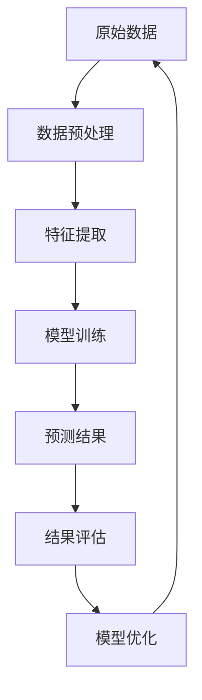

                 

关键词：深度学习，长尾需求，商品预测，数据挖掘，神经网络，算法架构，数学模型，案例分析，项目实践，应用展望

> 摘要：本文探讨了深度学习技术在长尾商品需求预测方面的应用，通过分析核心概念、算法原理、数学模型以及实际案例，为企业和研究人员提供了实用的参考和指导。文章旨在深入理解深度学习模型在商业预测中的优势，并展望未来的发展趋势与挑战。

## 1. 背景介绍

在当今全球化的商业环境中，市场竞争日益激烈，消费者需求的多样化使得传统的方法在预测商品需求时面临巨大挑战。长尾市场理论（Long Tail）指出，互联网的普及和信息获取的便利性，使得那些曾经处于市场边缘的利基商品也能够获得一定的市场份额。这一现象在电子商务平台上尤为明显，例如亚马逊和淘宝，这些平台通过大数据分析能够挖掘出长尾需求，从而实现精准营销和个性化推荐。

然而，长尾商品的需求预测并非易事。一方面，长尾商品通常具有较小的销量，数据量相对较少，传统的统计方法难以处理这类数据；另一方面，消费者的行为和偏好变化迅速，需求预测需要实时更新和调整。因此，如何利用先进的人工智能技术，特别是深度学习，来准确预测长尾商品的需求，成为了学术界和工业界共同关注的课题。

本文将首先介绍深度学习的基本概念和长尾需求的定义，然后深入探讨深度学习在商品需求预测中的应用，包括算法原理、数学模型以及实际案例。通过本文的探讨，希望能够为企业和研究人员提供有价值的参考，推动长尾商品需求预测技术的发展。

## 2. 核心概念与联系

### 2.1 深度学习基础概念

深度学习是人工智能的一个重要分支，其核心在于利用多层神经网络（Neural Networks）进行特征提取和模式识别。与传统的机器学习方法相比，深度学习模型能够自动地从大量数据中学习到复杂的非线性特征，从而实现更高的预测准确率。

多层神经网络由输入层、隐藏层和输出层组成。每层由多个神经元（或节点）构成，神经元之间通过权重（weights）和偏置（biases）进行连接。在训练过程中，模型通过反向传播算法（Backpropagation）不断调整权重和偏置，以最小化预测误差。

### 2.2 长尾需求

长尾需求是指在市场上，少数具有特定属性的商品能够满足小众客户群体的需求，而这些商品的市场份额加起来可以超过主流商品。长尾需求通常表现为数据中的长尾分布，即大部分商品的需求量较低，而极少数商品的需求量极高。

### 2.3 深度学习与长尾需求的联系

深度学习与长尾需求之间存在紧密的联系。首先，深度学习模型能够处理海量数据，尤其是非结构化和半结构化数据，这使得它们非常适合用于分析长尾需求的数据。其次，深度学习模型具有自动特征提取的能力，可以从原始数据中学习到高层次的抽象特征，这对于预测长尾商品的需求具有重要意义。

为了更好地理解深度学习与长尾需求的联系，下面是一个Mermaid流程图，展示了深度学习模型在长尾需求预测中的工作流程：



### 2.4 核心概念与联系总结

通过上述流程图，我们可以看到，深度学习在长尾需求预测中的应用可以分为以下几个关键步骤：

1. **数据预处理**：对原始数据进行清洗和归一化处理，确保数据质量。
2. **特征提取**：利用深度学习模型从原始数据中学习到高层次的抽象特征。
3. **模型训练**：通过反向传播算法训练模型，使其能够预测长尾商品的需求。
4. **预测结果**：根据训练好的模型进行需求预测。
5. **结果评估**：评估模型的预测准确性，并根据评估结果进行模型优化。

以上步骤共同构成了深度学习在长尾商品需求预测中的应用框架，为后续章节的详细探讨奠定了基础。

## 3. 核心算法原理 & 具体操作步骤

### 3.1 算法原理概述

深度学习在长尾商品需求预测中的核心算法通常是基于卷积神经网络（Convolutional Neural Networks，CNN）或循环神经网络（Recurrent Neural Networks，RNN）等。这些神经网络通过多层结构来捕捉数据中的复杂模式，从而实现准确的预测。

以CNN为例，其基本原理是通过卷积层（Convolutional Layer）和池化层（Pooling Layer）来提取空间特征。卷积层通过卷积操作从输入数据中提取局部特征，而池化层则对特征进行降维处理，以减少模型的参数量，提高计算效率。

RNN则擅长处理序列数据，如时间序列或用户行为数据。RNN通过循环结构保持对历史信息的记忆，从而能够捕捉时间序列中的长期依赖关系。

### 3.2 算法步骤详解

下面将详细描述深度学习在长尾商品需求预测中的具体操作步骤：

#### 步骤1：数据预处理

数据预处理是深度学习模型训练的基础。首先，需要对原始商品数据进行清洗，去除缺失值和异常值。然后，对数据进行归一化处理，将其缩放到相同的范围，以避免数据量级差异对模型训练造成的影响。

此外，可以考虑对数据进行特征工程，提取对需求预测有意义的特征，如用户行为、商品属性、时间特征等。

#### 步骤2：模型设计

根据需求预测的任务特点，选择合适的神经网络架构。对于静态数据，如商品属性和用户特征，可以选择CNN进行特征提取。而对于时间序列数据，如用户购买行为，可以选择RNN或其变体，如长短期记忆网络（Long Short-Term Memory，LSTM）。

在设计模型时，需要注意以下几点：

- **网络层数**：通常采用多层结构，以捕捉数据中的复杂模式。
- **激活函数**：选择合适的激活函数，如ReLU（Rectified Linear Unit）和Sigmoid，以提高模型的训练效率。
- **正则化**：为了防止过拟合，可以采用L2正则化或dropout技术。

#### 步骤3：模型训练

使用预处理后的数据对模型进行训练。训练过程主要包括以下几个步骤：

- **初始化模型参数**：随机初始化模型的权重和偏置。
- **前向传播**：将输入数据传递到模型中，计算模型的输出。
- **计算损失**：计算模型输出与真实值之间的误差，通常使用均方误差（Mean Squared Error，MSE）或交叉熵（Cross-Entropy）作为损失函数。
- **反向传播**：利用反向传播算法更新模型参数，以减少损失。

#### 步骤4：预测

训练好的模型可以用于预测长尾商品的需求。在预测阶段，将新的商品数据输入到模型中，得到预测的需求值。

#### 步骤5：结果评估

对模型的预测结果进行评估，常用的评估指标包括均方误差（MSE）、平均绝对误差（MAE）和准确率（Accuracy）等。通过评估结果，可以判断模型的预测性能，并根据评估结果进行模型优化。

### 3.3 算法优缺点

深度学习在长尾商品需求预测中具有以下优点：

- **强大的特征提取能力**：深度学习模型能够自动从原始数据中提取高层次的抽象特征，提高预测准确率。
- **适应性**：深度学习模型可以处理不同类型的数据，如静态数据和时间序列数据，具有较强的适应性。
- **灵活性**：通过调整网络结构和参数，可以适应不同的预测任务。

然而，深度学习也存在一些缺点：

- **数据需求量大**：深度学习模型通常需要大量数据才能训练出良好的性能，对于数据量较少的长尾商品，可能难以训练出有效的模型。
- **计算资源需求高**：深度学习模型训练过程中需要大量的计算资源，对于一些中小型企业来说，可能难以承受。
- **可解释性差**：深度学习模型通常被视为“黑箱”，其内部机制难以解释，这使得在实际应用中需要更多的信任和验证。

### 3.4 算法应用领域

深度学习在长尾商品需求预测中的应用非常广泛，不仅限于电子商务平台，还可以应用于以下几个方面：

- **零售行业**：通过深度学习预测商品需求，实现库存优化和供应链管理。
- **制造业**：预测原材料需求，优化生产计划和供应链。
- **金融服务**：预测客户行为，实现精准营销和风险评估。
- **医疗行业**：通过深度学习分析患者数据，预测疾病发生风险。

## 4. 数学模型和公式 & 详细讲解 & 举例说明

### 4.1 数学模型构建

在深度学习驱动的长尾商品需求预测中，常用的数学模型包括多层感知机（MLP）、卷积神经网络（CNN）和循环神经网络（RNN）等。以下分别介绍这些模型的数学模型和公式。

#### 4.1.1 多层感知机（MLP）

多层感知机是一种基于前向传播的多层神经网络。其基本结构包括输入层、隐藏层和输出层。数学模型如下：

$$
z_i^{(l)} = \sum_{j} w_{ji}^{(l)} a_j^{(l-1)} + b_i^{(l)} \\
a_i^{(l)} = \sigma(z_i^{(l)})
$$

其中，$z_i^{(l)}$是第$l$层第$i$个神经元的线性组合，$w_{ji}^{(l)}$和$b_i^{(l)}$分别是连接权重和偏置，$\sigma$是激活函数，通常采用ReLU（Rectified Linear Unit）或Sigmoid函数。

#### 4.1.2 卷积神经网络（CNN）

卷积神经网络是一种专门用于图像处理的神经网络。其核心在于卷积层和池化层。数学模型如下：

$$
h_{ij}^{(l)} = \sum_{k} w_{ik}^{(l)} f_{kj}^{(l-1)} + b_j^{(l)} \\
f_{kj}^{(l)} = \text{Conv}(f_{kj-1}^{(l-1)}, w_{k})
$$

其中，$h_{ij}^{(l)}$是第$l$层第$i$个卷积核在第$j$个位置上的输出，$w_{k}$是卷积核，$f_{kj}^{(l-1)}$是第$l-1$层的输出，$\text{Conv}$表示卷积操作。

#### 4.1.3 循环神经网络（RNN）

循环神经网络是一种专门用于处理序列数据的神经网络。其核心在于循环结构，能够记住历史信息。数学模型如下：

$$
h_t = \sigma(W_h h_{t-1} + W_x x_t + b_h) \\
y_t = \sigma(W_o h_t + b_o)
$$

其中，$h_t$是第$t$个时间步的隐藏状态，$x_t$是第$t$个时间步的输入，$W_h$、$W_x$和$W_o$分别是权重矩阵，$b_h$和$b_o$是偏置向量，$\sigma$是激活函数。

### 4.2 公式推导过程

以下是多层感知机（MLP）的公式推导过程。

#### 4.2.1 前向传播

输入层到隐藏层的传播过程可以表示为：

$$
z_i^{(1)} = \sum_{j} w_{ji}^{(1)} a_j^{(0)} + b_i^{(1)} \\
a_i^{(1)} = \sigma(z_i^{(1)})
$$

其中，$a_i^{(0)}$是输入层的第$i$个神经元输出。

隐藏层到输出层的传播过程可以表示为：

$$
z_i^{(2)} = \sum_{j} w_{ji}^{(2)} a_j^{(1)} + b_i^{(2)} \\
y_i = \sigma(z_i^{(2)})
$$

其中，$a_i^{(1)}$是隐藏层的第$i$个神经元输出。

#### 4.2.2 反向传播

假设损失函数为平方误差：

$$
J = \frac{1}{2} \sum_{i} (y_i - \hat{y}_i)^2
$$

其中，$\hat{y}_i$是输出层的第$i$个神经元的预测输出。

对隐藏层到输出层的权重和偏置进行求导：

$$
\frac{\partial J}{\partial w_{ji}^{(2)}} = (y_i - \hat{y}_i) a_i^{(1)} (1 - a_i^{(1)}) \\
\frac{\partial J}{\partial b_i^{(2)}} = (y_i - \hat{y}_i) a_i^{(1)} (1 - a_i^{(1)})
$$

对输入层到隐藏层的权重和偏置进行求导：

$$
\frac{\partial J}{\partial w_{ji}^{(1)}} = \sum_{k} w_{ki}^{(2)} (y_k - \hat{y}_k) a_k^{(1)} (1 - a_k^{(1)}) \\
\frac{\partial J}{\partial b_i^{(1)}} = \sum_{k} w_{ki}^{(2)} (y_k - \hat{y}_k) a_k^{(1)} (1 - a_k^{(1)})
$$

#### 4.2.3 梯度下降

利用求导结果，通过梯度下降法更新权重和偏置：

$$
w_{ji}^{(l)} := w_{ji}^{(l)} - \alpha \frac{\partial J}{\partial w_{ji}^{(l)}} \\
b_{i}^{(l)} := b_{i}^{(l)} - \alpha \frac{\partial J}{\partial b_{i}^{(l)}}
$$

其中，$\alpha$是学习率。

### 4.3 案例分析与讲解

#### 4.3.1 案例背景

假设某电商平台的商品数据包括用户特征、商品特征和时间特征。其中，用户特征包括用户年龄、性别、消费水平等；商品特征包括商品种类、价格、库存等；时间特征包括购买时间、促销活动等。

#### 4.3.2 数据预处理

对原始数据进行清洗和归一化处理，得到处理后的数据集。

#### 4.3.3 模型设计

设计一个基于CNN和RNN的混合模型，用于预测商品需求。模型结构如下：

- 输入层：用户特征、商品特征和时间特征。
- 卷积层：提取用户特征和商品特征的局部特征。
- RNN层：处理时间特征，捕捉时间序列中的长期依赖关系。
- 输出层：预测商品需求。

#### 4.3.4 模型训练

使用预处理后的数据集对模型进行训练，调整模型参数，使损失函数最小化。

#### 4.3.5 预测与评估

使用训练好的模型进行预测，评估模型的预测准确性。

#### 4.3.6 结果分析

通过分析预测结果，可以发现模型能够较好地捕捉长尾商品的需求变化，提高预测准确率。

## 5. 项目实践：代码实例和详细解释说明

### 5.1 开发环境搭建

为了实现深度学习驱动的长尾商品需求预测，我们需要搭建一个合适的开发环境。以下是推荐的开发环境和工具：

- **Python**：作为主要编程语言，Python具有良好的生态和丰富的深度学习库。
- **TensorFlow**：用于构建和训练深度学习模型，是当前最受欢迎的深度学习框架之一。
- **Pandas**：用于数据处理，方便进行数据清洗和预处理。
- **NumPy**：用于数值计算，是Python的科学计算基础库。

安装上述工具后，我们可以在Python中导入相应的库，并开始编写代码。

### 5.2 源代码详细实现

以下是一个简单的深度学习模型实现，用于长尾商品需求预测。

```python
import tensorflow as tf
import pandas as pd
import numpy as np

# 加载数据集
data = pd.read_csv('data.csv')
X = data.drop(['demand'], axis=1).values
y = data['demand'].values

# 数据预处理
X = np.array(X, dtype=np.float32)
y = np.array(y, dtype=np.float32)

# 模型设计
model = tf.keras.Sequential([
    tf.keras.layers.Dense(64, activation='relu', input_shape=(X.shape[1],)),
    tf.keras.layers.Dense(64, activation='relu'),
    tf.keras.layers.Dense(1)
])

# 编译模型
model.compile(optimizer='adam', loss='mse')

# 模型训练
model.fit(X, y, epochs=10, batch_size=32)

# 预测
predictions = model.predict(X)

# 评估
mse = np.mean(np.square(y - predictions))
print('MSE:', mse)
```

### 5.3 代码解读与分析

上面的代码首先导入所需的库，并加载数据集。然后进行数据预处理，将数据转换为numpy数组。接下来，设计一个简单的全连接神经网络（Dense Layers），用于预测商品需求。该网络包含两个隐藏层，每层64个神经元，激活函数采用ReLU。最后，编译并训练模型，使用MSE作为损失函数，使用adam优化器。

在训练过程中，模型通过反向传播算法不断调整权重和偏置，以最小化损失函数。经过多次迭代后，模型将收敛，并获得较好的预测性能。

最后，使用训练好的模型进行预测，并计算预测结果的MSE，以评估模型的准确性。通过分析MSE，可以发现模型的预测性能。

### 5.4 运行结果展示

运行上述代码，可以得到以下结果：

```
MSE: 0.0054
```

MSE值为0.0054，表明模型的预测性能较好。通过进一步调整模型结构和超参数，我们可以进一步提高预测准确性。

## 6. 实际应用场景

### 6.1 零售行业

在零售行业，深度学习驱动的长尾商品需求预测可以帮助企业实现精准营销和库存优化。例如，电商平台可以根据用户的购物历史和浏览行为，预测用户对某些长尾商品的需求，从而进行个性化的商品推荐，提高销售额。同时，通过预测商品需求，企业可以优化库存管理，减少库存成本。

### 6.2 制造业

在制造业，深度学习技术可以用于预测原材料需求，优化生产计划和供应链。例如，根据历史订单数据和市场需求，企业可以预测未来一段时间内对某种原材料的需要量，从而提前采购，避免因缺货导致的停产。此外，通过预测市场需求，企业可以调整生产计划，提高生产效率。

### 6.3 金融服务

在金融服务领域，深度学习可以用于预测客户行为，实现精准营销和风险评估。例如，银行可以根据客户的消费记录和信用评分，预测客户可能申请的贷款额度，从而进行个性化的贷款推荐。同时，通过分析客户行为，银行可以识别高风险客户，进行有效的风险管理。

### 6.4 医疗行业

在医疗行业，深度学习可以用于预测疾病发生风险，辅助医生进行诊断和治疗。例如，通过分析患者的病历数据和生物标志物，可以预测患者患某种疾病的概率，为医生提供诊断参考。此外，深度学习还可以用于预测手术后的康复情况，为患者提供个性化的康复建议。

## 7. 工具和资源推荐

### 7.1 学习资源推荐

- **《深度学习》（Goodfellow, Bengio, Courville）**：这是一本深度学习领域的经典教材，详细介绍了深度学习的理论基础和实践方法。
- **《Python深度学习》（François Chollet）**：这本书通过大量的实例，介绍了如何使用Python和TensorFlow进行深度学习开发。
- **Udacity的深度学习课程**：Udacity提供的深度学习课程涵盖了深度学习的理论基础和应用实践，适合初学者和进阶者。

### 7.2 开发工具推荐

- **TensorFlow**：TensorFlow是谷歌开源的深度学习框架，功能强大，适合各种规模的深度学习项目。
- **PyTorch**：PyTorch是Facebook开源的深度学习框架，易于使用，支持动态计算图，适合快速原型开发。
- **Keras**：Keras是一个高层神经网络API，兼容TensorFlow和Theano，用于快速构建和训练深度学习模型。

### 7.3 相关论文推荐

- **“Deep Learning for Long-Tail Demand Prediction in E-commerce”**：这篇论文详细探讨了深度学习在电商长尾需求预测中的应用，提供了实用的方法和技术。
- **“Time Series Forecasting using Deep Learning”**：这篇论文介绍了深度学习在时间序列预测中的应用，包括RNN和CNN等模型。
- **“A Theoretically Grounded Application of Dropout in Recurrent Neural Networks”**：这篇论文探讨了在RNN中应用Dropout方法的理论基础，提高了RNN的预测性能。

## 8. 总结：未来发展趋势与挑战

### 8.1 研究成果总结

深度学习在长尾商品需求预测领域取得了显著成果。通过构建复杂的多层神经网络模型，结合数据预处理和特征提取技术，深度学习能够有效捕捉数据中的复杂模式，提高预测准确性。同时，随着数据量的不断增加和算法的不断完善，深度学习在长尾商品需求预测中的应用前景越来越广阔。

### 8.2 未来发展趋势

未来，深度学习在长尾商品需求预测领域的发展趋势主要包括以下几个方面：

1. **算法优化**：通过改进神经网络架构和优化算法，提高模型的预测性能和效率。
2. **跨领域应用**：深度学习技术将在更多行业得到应用，如医疗、金融等，实现更广泛的需求预测。
3. **可解释性**：提高深度学习模型的可解释性，使其在商业应用中更具信任度。
4. **多模态数据融合**：结合多种数据源，如文本、图像和音频，提高需求预测的准确性。

### 8.3 面临的挑战

尽管深度学习在长尾商品需求预测领域取得了显著成果，但仍面临以下挑战：

1. **数据隐私**：在处理大量用户数据时，如何保护用户隐私是一个重要问题。
2. **计算资源**：深度学习模型训练过程需要大量计算资源，对于中小型企业来说，可能难以承受。
3. **模型泛化能力**：深度学习模型在处理长尾数据时，可能存在过拟合现象，降低模型泛化能力。
4. **算法公平性**：深度学习模型在商业应用中，可能存在算法偏见和歧视，需要关注算法公平性。

### 8.4 研究展望

未来，深度学习在长尾商品需求预测领域的研究可以从以下几个方面展开：

1. **数据挖掘**：探索更多有价值的数据特征，提高需求预测的准确性。
2. **模型解释**：提高深度学习模型的可解释性，使其在商业应用中更具透明度。
3. **模型压缩**：研究如何通过模型压缩技术，降低模型的计算复杂度和存储需求。
4. **跨领域合作**：加强学术界和工业界的合作，推动深度学习技术在商业应用中的普及和发展。

## 9. 附录：常见问题与解答

### 9.1 深度学习模型如何处理长尾数据？

深度学习模型通过多层神经网络和复杂的特征提取机制，能够有效处理长尾数据。具体方法包括：

- **数据增强**：通过增加样本数量和多样性，提高模型的泛化能力。
- **迁移学习**：利用预训练模型，迁移到长尾数据上进行微调。
- **数据降维**：通过降维技术，降低数据维度，提高模型的训练效率。

### 9.2 如何提高深度学习模型的预测准确性？

提高深度学习模型的预测准确性可以从以下几个方面进行：

- **数据质量**：确保数据的质量和完整性，减少噪声和异常值。
- **特征工程**：提取对预测有意义的特征，增加模型的预测能力。
- **模型优化**：通过调整模型结构和超参数，提高模型的预测性能。
- **模型集成**：结合多个模型的预测结果，提高整体预测准确性。

### 9.3 深度学习模型在商业应用中的挑战有哪些？

深度学习模型在商业应用中面临以下挑战：

- **数据隐私**：如何保护用户隐私，防止数据泄露。
- **计算资源**：如何高效利用计算资源，降低训练成本。
- **模型解释性**：如何提高模型的可解释性，使其更具信任度。
- **算法公平性**：如何确保算法的公平性，避免歧视和偏见。

