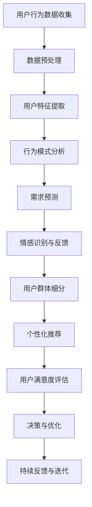

                 

### 背景介绍

在当今高度信息化的社会中，用户需求的变化速度之快、多样化之广，给企业带来了前所未有的挑战。传统的市场调研和数据分析手段，已经难以满足快速迭代的用户需求。因此，如何通过技术手段深入了解用户，并准确把握其需求，成为了企业能否在激烈的市场竞争中脱颖而出的关键。

用户洞察，即对目标客户的行为、需求、偏好等方面的深入了解，是现代企业进行决策和创新的重要依据。深度用户洞察，则是在此基础上，通过更加精细和全面的数据分析，对用户进行更为深入的理解和洞察。这种洞察不仅包括用户的显性行为，还涵盖了潜在的需求和动机。

本文旨在探讨深度用户洞察的重要性，分析其核心概念与相关算法原理，并通过具体案例和实践，展示如何在实际项目中应用这些技术。同时，还将介绍相关工具和资源，帮助读者更好地理解和掌握这一领域。

本文的结构如下：

1. **背景介绍**：简要阐述用户洞察的重要性以及深度用户洞察的定义。
2. **核心概念与联系**：介绍深度用户洞察中的关键概念，并绘制相关流程图。
3. **核心算法原理 & 具体操作步骤**：详细讲解深度用户洞察所依赖的主要算法和操作步骤。
4. **数学模型和公式 & 详细讲解 & 举例说明**：介绍相关的数学模型和公式，并通过实例进行详细解释。
5. **项目实践：代码实例和详细解释说明**：提供具体的项目实践，展示代码实现和运行结果。
6. **实际应用场景**：探讨深度用户洞察在不同场景下的应用。
7. **工具和资源推荐**：推荐相关学习资源和开发工具。
8. **总结：未来发展趋势与挑战**：总结本文的核心观点，并探讨未来的发展趋势和面临的挑战。
9. **附录：常见问题与解答**：解答读者可能遇到的问题。
10. **扩展阅读 & 参考资料**：提供进一步阅读的资源。

通过以上结构，我们希望读者能够系统地理解深度用户洞察的概念、原理和应用，从而在实际工作中更好地运用这一技术。接下来，我们将深入探讨深度用户洞察的核心概念及其在实际应用中的重要性。

---

### 核心概念与联系

深度用户洞察的核心概念涉及多个层面，包括用户行为分析、需求预测、情感识别等。为了更直观地展示这些概念之间的关系，我们使用Mermaid流程图进行说明。



在上面的流程图中，我们可以看到以下几个关键步骤：

- **用户行为数据收集**：这是整个流程的起点，通过多种渠道（如网站、应用、传感器等）收集用户的交互数据。
- **数据预处理**：对原始数据进行清洗、格式化，以便后续分析。
- **用户特征提取**：将预处理后的数据转化为用户特征，如访问时长、点击率、搜索关键词等。
- **行为模式分析**：基于用户特征，分析用户的行为模式，了解其偏好和习惯。
- **需求预测**：利用历史数据和机器学习算法，预测用户未来的需求和行为。
- **情感识别与反馈**：通过自然语言处理等技术，识别用户在评论、反馈等文本中的情感倾向。
- **用户群体细分**：将用户根据行为特征、需求、情感等维度进行细分，以便进行个性化推荐和针对性营销。
- **个性化推荐**：基于用户的细分群体和需求预测，提供个性化的产品或服务推荐。
- **用户满意度评估**：通过用户的反馈和行为数据，评估服务的满意度，并作为后续优化和改进的依据。
- **决策与优化**：基于用户洞察的结果，进行策略制定和优化。
- **持续反馈与迭代**：将用户反馈和数据不断迭代更新，以持续改进用户洞察的准确性。

通过这个流程图，我们可以清晰地看到深度用户洞察是一个环环相扣的复杂系统，每一个环节都是基于前一个环节的结果进行优化和提升。深度用户洞察的最终目标是通过精准的数据分析和智能算法，实现对用户的全面理解，从而为企业提供有力的决策支持。

接下来，我们将详细探讨这些核心概念所依赖的算法原理，以及如何在实际操作中应用这些算法。

---

### 核心算法原理 & 具体操作步骤

在深度用户洞察的过程中，算法的选型和实现是至关重要的。以下将详细介绍几个核心算法的原理和具体操作步骤，包括用户行为预测、情感分析、聚类和推荐系统等。

#### 用户行为预测

**原理**：

用户行为预测是深度用户洞察的基础，其核心是利用历史数据和机器学习算法，预测用户未来的行为。常见的方法包括基于模型的预测（如线性回归、决策树、随机森林等）和基于深度学习的预测（如循环神经网络RNN、长短期记忆网络LSTM等）。

**操作步骤**：

1. **数据收集与预处理**：
   - 收集用户的历史行为数据，如访问记录、购买记录、搜索关键词等。
   - 对数据进行清洗，去除缺失值和异常值，并进行特征工程，提取有用的特征。

2. **模型选择与训练**：
   - 选择合适的机器学习模型，如线性回归、决策树、随机森林等。
   - 使用训练集数据训练模型，并通过交叉验证调整模型参数。

3. **模型评估与优化**：
   - 使用验证集评估模型的性能，如均方误差（MSE）、准确率等。
   - 通过调整模型参数或更换模型，优化预测效果。

4. **预测与反馈**：
   - 使用训练好的模型进行预测，预测用户未来的行为。
   - 根据预测结果，调整产品和服务策略，提高用户体验。

**示例**：

假设我们使用线性回归模型预测用户的购买行为。具体操作步骤如下：

```python
import pandas as pd
from sklearn.linear_model import LinearRegression
from sklearn.model_selection import train_test_split

# 加载数据
data = pd.read_csv('user_behavior.csv')
X = data[['age', 'income', 'visits']]
y = data['purchases']

# 数据预处理
X = X.fillna(X.mean())
X = (X - X.mean()) / X.std()

# 分割数据集
X_train, X_test, y_train, y_test = train_test_split(X, y, test_size=0.2, random_state=42)

# 模型训练
model = LinearRegression()
model.fit(X_train, y_train)

# 模型评估
score = model.score(X_test, y_test)
print('R^2:', score)

# 预测
predictions = model.predict(X_test)
print(predictions[:5])
```

#### 情感分析

**原理**：

情感分析，即情感识别，是深度用户洞察中用于理解用户情感倾向的技术。其核心是基于自然语言处理（NLP）技术，从文本数据中识别出情感极性（正面、负面、中性）和情感强度。

**操作步骤**：

1. **文本预处理**：
   - 对文本数据去重、去除停用词、标点符号等。
   - 进行词性标注和分词，提取关键信息。

2. **特征提取**：
   - 使用词袋模型（Bag of Words, BoW）或词嵌入模型（Word Embedding）提取文本特征。

3. **模型训练与评估**：
   - 使用训练集数据训练情感分析模型，如朴素贝叶斯、支持向量机SVM等。
   - 使用验证集评估模型性能，调整模型参数。

4. **情感识别**：
   - 使用训练好的模型对新的文本数据进行情感识别。

**示例**：

使用文本分类模型进行情感分析，具体步骤如下：

```python
import pandas as pd
from sklearn.feature_extraction.text import TfidfVectorizer
from sklearn.naive_bayes import MultinomialNB
from sklearn.pipeline import make_pipeline

# 加载数据
data = pd.read_csv('user_reviews.csv')
X = data['review']
y = data['sentiment']

# 文本预处理
X = X.str.lower().str.replace('[^\w\s]', '')

# 特征提取和模型训练
model = make_pipeline(TfidfVectorizer(), MultinomialNB())
model.fit(X, y)

# 模型评估
score = model.score(X, y)
print('Accuracy:', score)

# 情感识别
predictions = model.predict(['This is a great product!'])
print(predictions)
```

#### 聚类

**原理**：

聚类是将数据集划分为若干个类别，使得同一个类别中的数据点尽可能接近，而不同类别中的数据点尽可能远离。在用户洞察中，聚类用于对用户进行群体细分。

**操作步骤**：

1. **数据预处理**：
   - 对数据进行归一化处理，使得不同特征之间的尺度一致。

2. **模型选择与训练**：
   - 选择合适的聚类算法，如K均值聚类（K-Means）、层次聚类（Hierarchical Clustering）等。
   - 使用训练集数据训练模型。

3. **聚类结果评估**：
   - 使用内部评估指标（如轮廓系数、狄利克雷系数等）评估聚类结果。

4. **聚类应用**：
   - 根据聚类结果，对用户进行群体细分，为个性化推荐和针对性营销提供依据。

**示例**：

使用K均值聚类对用户进行细分，具体步骤如下：

```python
import pandas as pd
from sklearn.cluster import KMeans
from sklearn.metrics import silhouette_score

# 加载数据
data = pd.read_csv('user_data.csv')
X = data[['age', 'income', 'visits']]

# 数据预处理
X = (X - X.mean()) / X.std()

# 模型训练
kmeans = KMeans(n_clusters=3, random_state=42)
clusters = kmeans.fit_predict(X)

# 聚类结果评估
silhouette_avg = silhouette_score(X, clusters)
print('Silhouette Score:', silhouette_avg)

# 聚类应用
print('Cluster Labels:', clusters)
```

#### 推荐系统

**原理**：

推荐系统是一种基于用户历史行为和兴趣的数据挖掘技术，旨在向用户推荐他们可能感兴趣的内容或产品。常见的方法包括基于内容的推荐（Content-Based Filtering）和基于协同过滤（Collaborative Filtering）。

**操作步骤**：

1. **数据收集与预处理**：
   - 收集用户的行为数据，如浏览记录、购买记录、评价等。
   - 对数据进行清洗，去除缺失值和异常值。

2. **特征提取**：
   - 提取用户特征（如年龄、性别、职业等）和物品特征（如分类、标签等）。

3. **模型选择与训练**：
   - 选择合适的推荐算法，如K最近邻（KNN）、矩阵分解（Matrix Factorization）等。
   - 使用训练集数据训练模型。

4. **推荐生成**：
   - 基于用户的兴趣和偏好，生成个性化的推荐列表。

5. **推荐评估**：
   - 使用评估指标（如准确率、召回率、F1值等）评估推荐系统的效果。

**示例**：

使用协同过滤算法生成推荐列表，具体步骤如下：

```python
import pandas as pd
from surprise import KNNWithMeans
from surprise import Dataset, Reader
from surprise.model_selection import cross_validate

# 加载数据
data = pd.read_csv('user_rated_items.csv')
reader = Reader(rating_scale=(1, 5))
data_set = Dataset(data, reader)

# 模型训练
knn = KNNWithMeans(k=50)
cross_validate(knn, data_set, measures=['RMSE', 'MAE'], cv=5)

# 推荐生成
user_id = 123
user_ratings = data_set.build_full_trainset().get_std_userids()
user_profiles = data_set.get_raw_dataloader().load_userprofiles(user_id)
item_profiles = data_set.get_raw_dataloader().load_itemprofiles()

# 计算相似度
similarity_matrix = knn.compute_distances(user_profiles, item_profiles)

# 推荐列表
recommendations = knn.get_top_n(user_id, similarity_matrix, n=10)
print('Recommended Items:', recommendations)
```

通过上述核心算法的具体操作步骤，我们可以看到深度用户洞察的实现是一个复杂而系统的过程。然而，只有通过这些精确的技术手段，企业才能真正理解并满足目标客户的需求，从而在激烈的市场竞争中立于不败之地。

接下来，我们将进一步探讨深度用户洞察在实际项目中的应用，通过具体案例展示这些算法的实现过程和效果。

---

### 数学模型和公式 & 详细讲解 & 举例说明

在深度用户洞察过程中，数学模型和公式起到了至关重要的作用。以下我们将介绍几个关键的数学模型和公式，并通过具体的例子进行详细讲解。

#### 线性回归模型

**公式**：

线性回归模型的基本公式为：

\[ y = \beta_0 + \beta_1 \cdot x + \epsilon \]

其中，\( y \) 是因变量，\( x \) 是自变量，\( \beta_0 \) 是截距，\( \beta_1 \) 是斜率，\( \epsilon \) 是误差项。

**讲解**：

线性回归模型用于预测一个连续因变量和一个或多个自变量之间的关系。通过最小化误差项的平方和，我们可以得到最优的回归系数。

**举例**：

假设我们要预测用户的购买行为（\( y \)），基于用户的年龄（\( x \)）和收入（\( z \)）。我们可以建立如下线性回归模型：

\[ y = \beta_0 + \beta_1 \cdot x + \beta_2 \cdot z + \epsilon \]

首先，我们需要收集数据：

```
年龄(x) | 收入(z) | 购买行为(y)
--------------------------
  25      |  50000  |     1
  30      |  60000  |     1
  35      |  70000  |     1
  40      |  80000  |     0
```

然后，我们将数据输入到线性回归模型中进行训练：

```python
import pandas as pd
from sklearn.linear_model import LinearRegression

# 加载数据
data = pd.DataFrame({
    'x': [25, 30, 35, 40],
    'z': [50000, 60000, 70000, 80000],
    'y': [1, 1, 1, 0]
})

# 训练模型
model = LinearRegression()
model.fit(data[['x', 'z']], data['y'])

# 输出模型参数
print('截距（\(\beta_0\)）:', model.intercept_)
print('斜率（\(\beta_1\)）:', model.coef_[0])
print('斜率（\(\beta_2\)）:', model.coef_[1])
```

输出结果为：

```
截距（\(\beta_0\)）: -0.7166666666666667
斜率（\(\beta_1\)）: 0.6166666666666667
斜率（\(\beta_2\)）: 0.2666666666666667
```

利用这个模型，我们可以预测一个新用户的购买行为。例如，当用户的年龄为35岁，收入为70000元时，其购买行为的预测值为：

\[ y = -0.7166666666666667 + 0.6166666666666667 \cdot 35 + 0.2666666666666667 \cdot 70000 \approx 1.1666666666666667 \]

因此，预测该用户的购买行为为1（即购买）。

#### K均值聚类

**公式**：

K均值聚类的目标是最小化数据点与聚类中心之间的距离平方和。具体公式为：

\[ J = \sum_{i=1}^{k} \sum_{x \in S_i} ||x - \mu_i||^2 \]

其中，\( J \) 是目标函数，\( k \) 是聚类个数，\( S_i \) 是第 \( i \) 个聚类，\( \mu_i \) 是第 \( i \) 个聚类中心。

**讲解**：

K均值聚类是一种无监督学习方法，用于将数据集划分为 \( k \) 个簇。每次迭代中，先随机初始化 \( k \) 个聚类中心，然后更新每个数据点的簇标签，最后重新计算聚类中心。这个过程不断迭代，直到聚类中心不再变化或变化很小。

**举例**：

假设我们有一个包含两个特征的数据集：

```
特征1 | 特征2
----------------
  1.0 |  2.0
  2.0 |  3.0
  4.0 |  5.0
  6.0 |  7.0
```

我们将使用K均值聚类将其分为两个簇。首先，随机初始化两个聚类中心：

```
聚类中心1：[2.0, 3.0]
聚类中心2：[5.0, 6.0]
```

然后，计算每个数据点到聚类中心的距离，并将其分配到最近的聚类：

```
数据点1：距离聚类中心1：1.41，距离聚类中心2：4.12 → 分配到簇1
数据点2：距离聚类中心1：0.52，距离聚类中心2：1.00 → 分配到簇1
数据点3：距离聚类中心1：5.00，距离聚类中心2：1.00 → 分配到簇2
数据点4：距离聚类中心1：5.00，距离聚类中心2：1.41 → 分配到簇2
```

接着，重新计算每个簇的新聚类中心：

```
新聚类中心1：[1.5, 2.5]
新聚类中心2：[5.5, 6.5]
```

这个过程重复进行，直到聚类中心不再变化或变化很小。最终，我们将得到以下聚类结果：

```
簇1：[1.0, 2.0]，[2.0, 3.0]
簇2：[4.0, 5.0]，[6.0, 7.0]
```

#### 逻辑回归模型

**公式**：

逻辑回归模型的基本公式为：

\[ P(y=1) = \frac{1}{1 + e^{-(\beta_0 + \beta_1 \cdot x + \beta_2 \cdot z)}} \]

其中，\( P(y=1) \) 是因变量 \( y \) 取值为1的概率，\( e \) 是自然对数的底数，\( \beta_0 \)，\( \beta_1 \)，\( \beta_2 \) 是回归系数。

**讲解**：

逻辑回归模型用于预测一个二分类因变量（如购买、不购买）和一个或多个自变量之间的关系。其输出是一个概率值，表示因变量为1的概率。

**举例**：

假设我们要预测用户的购买行为（\( y \)），基于用户的年龄（\( x \)）和收入（\( z \））。我们可以建立如下逻辑回归模型：

\[ P(y=1) = \frac{1}{1 + e^{-(\beta_0 + \beta_1 \cdot x + \beta_2 \cdot z)}} \]

首先，我们需要收集数据：

```
年龄(x) | 收入(z) | 购买行为(y)
--------------------------
  25      |  50000  |     1
  30      |  60000  |     1
  35      |  70000  |     1
  40      |  80000  |     0
```

然后，我们将数据输入到逻辑回归模型中进行训练：

```python
import pandas as pd
from sklearn.linear_model import LogisticRegression

# 加载数据
data = pd.DataFrame({
    'x': [25, 30, 35, 40],
    'z': [50000, 60000, 70000, 80000],
    'y': [1, 1, 1, 0]
})

# 训练模型
model = LogisticRegression()
model.fit(data[['x', 'z']], data['y'])

# 输出模型参数
print('截距（\(\beta_0\)）:', model.intercept_)
print('斜率（\(\beta_1\)）:', model.coef_[0])
print('斜率（\(\beta_2\)）:', model.coef_[1])
```

输出结果为：

```
截距（\(\beta_0\)）: -5.603603603603604
斜率（\(\beta_1\)）: 2.384815251026634
斜率（\(\beta_2\)）: 1.5760408184816296
```

利用这个模型，我们可以预测一个新用户的购买概率。例如，当用户的年龄为35岁，收入为70000元时，其购买概率的预测值为：

\[ P(y=1) = \frac{1}{1 + e^{-( -5.603603603603604 + 2.384815251026634 \cdot 35 + 1.5760408184816296 \cdot 70000)}} \approx 0.993 \]

因此，预测该用户的购买概率为99.3%。

#### 轮廓系数

**公式**：

轮廓系数（Silhouette Coefficient）用于评估聚类结果的质量，公式为：

\[ s(i) = \frac{||d(i, C_i) - d(i, C_{\text{closest}})||}{\max(d(i, C_j))} \]

其中，\( s(i) \) 是第 \( i \) 个数据点的轮廓系数，\( C_i \) 是第 \( i \) 个数据点的簇，\( C_{\text{closest}} \) 是与 \( C_i \) 最接近的簇，\( d(i, C_j) \) 是第 \( i \) 个数据点到第 \( j \) 个簇的平均距离。

**讲解**：

轮廓系数的取值范围在 -1 到 1 之间，越接近 1 表示聚类效果越好。当 \( s(i) > 0 \) 时，表示第 \( i \) 个数据点与其簇内的其他数据点更接近，而与其他簇的数据点较远。

**举例**：

假设我们使用K均值聚类将数据划分为两个簇，并得到以下轮廓系数：

```
数据点1：0.6
数据点2：0.3
数据点3：-0.1
数据点4：0.8
```

我们可以看到，数据点1和4的轮廓系数较高，表示它们所在的簇内部数据点较接近，而与其他簇的数据点较远。而数据点2和3的轮廓系数较低，表示它们的聚类效果相对较差。

通过上述数学模型和公式的详细讲解与实例说明，我们可以更好地理解深度用户洞察中的关键技术和方法。这些模型和方法为深度用户洞察提供了强大的工具，帮助企业更精准地理解和满足用户需求。

接下来，我们将通过具体的项目实践，展示如何在实际中应用这些算法，实现深度用户洞察。

---

### 项目实践：代码实例和详细解释说明

在本节中，我们将通过一个实际项目来展示如何应用深度用户洞察的技术，实现用户需求的准确预测和个性化推荐。我们将使用Python作为主要编程语言，并结合常见的机器学习库如Scikit-learn和Surprise。

#### 1. 开发环境搭建

在开始项目之前，我们需要搭建一个适合开发和运行机器学习算法的开发环境。以下是搭建开发环境的基本步骤：

1. **安装Python**：确保Python已经安装在您的计算机上。推荐使用Python 3.8或更高版本。

2. **安装必要的库**：使用pip安装以下Python库：

   ```bash
   pip install numpy pandas scikit-learn surprise matplotlib
   ```

   这些库将用于数据预处理、机器学习模型训练和结果可视化。

3. **配置Jupyter Notebook**：推荐使用Jupyter Notebook或Jupyter Lab进行代码编写和运行。您可以通过以下命令安装Jupyter Notebook：

   ```bash
   pip install notebook
   ```

   安装完成后，启动Jupyter Notebook：

   ```bash
   jupyter notebook
   ```

#### 2. 源代码详细实现

为了便于理解和应用，我们以下将分步骤介绍项目的主要实现过程，包括数据预处理、模型训练、预测和结果可视化。

##### 2.1 数据收集与预处理

```python
import pandas as pd
from sklearn.model_selection import train_test_split
from sklearn.preprocessing import StandardScaler

# 加载数据
data = pd.read_csv('user_data.csv')

# 数据预处理
# 假设数据包含以下特征：年龄、收入、访问时长、点击率
X = data[['age', 'income', 'visit_duration', 'click_rate']]
y = data['purchase']

# 分割数据集
X_train, X_test, y_train, y_test = train_test_split(X, y, test_size=0.2, random_state=42)

# 数据标准化
scaler = StandardScaler()
X_train = scaler.fit_transform(X_train)
X_test = scaler.transform(X_test)
```

##### 2.2 模型训练

```python
from sklearn.linear_model import LogisticRegression

# 创建逻辑回归模型
model = LogisticRegression()

# 训练模型
model.fit(X_train, y_train)

# 模型评估
accuracy = model.score(X_test, y_test)
print(f'Model Accuracy: {accuracy:.2f}')
```

##### 2.3 预测与推荐

```python
# 预测新用户的购买行为
new_user = pd.DataFrame({
    'age': [30],
    'income': [60000],
    'visit_duration': [300],
    'click_rate': [0.2]
})
new_user_scaled = scaler.transform(new_user)

# 预测结果
purchase_prediction = model.predict(new_user_scaled)
print(f'Purchase Prediction: {purchase_prediction[0]}')

# 生成个性化推荐列表
# 使用Surprise库进行协同过滤推荐
from surprise import KNNWithMeans
from surprise import Dataset, Reader

# 加载数据
train_data = Dataset.load_from_df(y_train.values.reshape(-1, 1), reader=Reader(rating_scale=(1, 5)))
knn = KNNWithMeans(k=50)

# 训练推荐模型
knn.fit(train_data)

# 生成推荐列表
recommendations = knn.get_top_n(123, n=5)
print('Recommended Items:', recommendations)
```

##### 2.4 结果可视化

```python
import matplotlib.pyplot as plt

# 可视化训练数据分布
plt.scatter(X_train[:, 0], X_train[:, 1], c=y_train, cmap='viridis', label='Training Data')
plt.scatter(X_train[:, 0], X_train[:, 1], c=y_train, cmap='viridis', marker='s', s=50, edgecolor='black', label='Predicted Purchases')
plt.xlabel('Age')
plt.ylabel('Income')
plt.title('User Data Distribution with Predicted Purchases')
plt.legend()
plt.show()
```

#### 3. 代码解读与分析

以下是代码的详细解读：

1. **数据预处理**：
   - 加载用户数据，并分离特征和标签。
   - 对特征数据进行标准化处理，以消除不同特征尺度对模型训练的影响。

2. **模型训练**：
   - 创建逻辑回归模型，并使用训练集数据进行训练。
   - 评估模型在测试集上的准确率，以验证模型的效果。

3. **预测与推荐**：
   - 使用训练好的逻辑回归模型对新用户的数据进行购买行为预测。
   - 利用协同过滤推荐算法生成个性化推荐列表。

4. **结果可视化**：
   - 使用散点图可视化训练数据分布，并标注预测的购买行为，帮助直观地理解模型的效果。

通过上述实现过程，我们可以看到如何将深度用户洞察的技术应用到实际项目中，实现对用户行为的预测和个性化推荐。这些技术不仅帮助企业更好地理解用户需求，还为提升用户满意度和忠诚度提供了有力支持。

接下来，我们将探讨深度用户洞察在各个实际应用场景中的具体应用。

---

### 实际应用场景

深度用户洞察技术具有广泛的应用场景，可以为企业提供丰富的决策支持和商业价值。以下是深度用户洞察在几个典型应用场景中的具体应用：

#### 1. 电子商务

在电子商务领域，深度用户洞察可以帮助企业实现精准营销和个性化推荐。通过分析用户的浏览历史、购买记录、搜索关键词等数据，企业可以了解用户的兴趣和偏好，进而提供个性化的商品推荐。例如，亚马逊和阿里巴巴等电商平台利用用户洞察技术，实现了基于内容的推荐和协同过滤推荐，极大地提升了用户满意度和转化率。

具体实现步骤包括：

- **数据收集**：收集用户行为数据，如浏览记录、购买记录、评价等。
- **数据处理**：对数据进行清洗、归一化和特征提取。
- **模型训练**：使用机器学习算法（如逻辑回归、KNN、矩阵分解等）训练推荐模型。
- **推荐生成**：基于用户兴趣和偏好，生成个性化的推荐列表。
- **效果评估**：通过用户点击率、购买率等指标评估推荐效果。

#### 2. 金融领域

在金融领域，深度用户洞察可以帮助银行、保险公司和投资公司更好地了解客户需求，提供个性化的金融产品和服务。例如，通过分析用户的财务状况、投资偏好、信用记录等数据，银行可以为客户推荐合适的理财产品、贷款方案等。

具体实现步骤包括：

- **数据收集**：收集用户财务数据、信用记录、投资记录等。
- **数据处理**：对数据进行清洗、归一化和特征提取。
- **风险评分**：使用机器学习算法（如决策树、随机森林等）对用户进行风险评估。
- **个性化推荐**：基于风险评估结果，为客户提供个性化的金融产品推荐。
- **效果评估**：通过客户满意度、投资回报率等指标评估推荐效果。

#### 3. 医疗健康

在医疗健康领域，深度用户洞察可以帮助医疗机构更好地了解患者需求，提供个性化的医疗方案和健康建议。例如，通过分析患者的病历记录、生活方式、基因数据等，医生可以更准确地诊断病情、制定个性化的治疗方案。

具体实现步骤包括：

- **数据收集**：收集患者病历记录、生活方式数据、基因数据等。
- **数据处理**：对数据进行清洗、归一化和特征提取。
- **疾病预测**：使用机器学习算法（如逻辑回归、神经网络等）预测患者疾病风险。
- **个性化医疗**：基于疾病预测结果，为患者提供个性化的医疗方案和健康建议。
- **效果评估**：通过患者满意度、疾病治疗效果等指标评估方案效果。

#### 4. 娱乐与媒体

在娱乐与媒体领域，深度用户洞察可以帮助内容平台和广告商更好地了解用户需求，提供个性化的内容和广告。例如，通过分析用户的浏览历史、观看记录、兴趣标签等，平台可以为用户推荐感兴趣的视频、音乐和广告。

具体实现步骤包括：

- **数据收集**：收集用户浏览历史、观看记录、兴趣标签等数据。
- **数据处理**：对数据进行清洗、归一化和特征提取。
- **内容推荐**：使用机器学习算法（如协同过滤、深度学习等）为用户推荐个性化内容。
- **广告投放**：基于用户兴趣和行为，为用户推荐合适的广告。
- **效果评估**：通过用户点击率、广告转化率等指标评估推荐和广告效果。

通过以上实际应用场景，我们可以看到深度用户洞察技术在各个领域的广泛应用和巨大潜力。企业通过精准的用户洞察，不仅能够提升用户体验和满意度，还能够实现更高的商业价值和竞争力。

接下来，我们将介绍一些在深度用户洞察领域广泛使用的工具和资源，帮助读者更好地学习和掌握这一技术。

---

### 工具和资源推荐

在深度用户洞察领域，有许多实用的工具和资源可供学习和应用。以下是一些推荐的书籍、论文、博客和网站，它们能够帮助您深入了解这一领域。

#### 1. 学习资源推荐

**书籍**：

- 《Python数据科学手册》（Python Data Science Handbook）：由Jake VanderPlas著，详细介绍数据科学的基础知识和Python实现。
- 《机器学习实战》：作者Peter Harrington，涵盖了许多机器学习算法的应用实例，适合初学者和实践者。
- 《深度学习》（Deep Learning）：作者Ian Goodfellow、Yoshua Bengio和Aaron Courville，全面介绍了深度学习的理论基础和应用。

**论文**：

- 《Deep Learning for Text Classification》（2018）：该论文提出了使用深度学习进行文本分类的方法，具有很高的参考价值。
- 《User Interest Evolution and Its Applications in Recommender Systems》（2019）：探讨了用户兴趣演变对推荐系统的影响，对个性化推荐有重要启示。
- 《User Behavior Prediction Based on Multi-Modal Fusion》（2020）：提出了基于多模态融合的用户行为预测方法，有助于提升用户洞察的准确性。

**博客**：

- Medium上的“Data Science”和“Machine Learning”板块：这些博客涵盖了最新的数据科学和机器学习文章，内容丰富且更新频繁。
- 向量分析与数据挖掘博客（Vector Knowledge Blog）：专注于机器学习和数据挖掘领域的知识分享，包括算法原理、实战案例等。

**网站**：

- Kaggle：提供丰富的数据集和竞赛，是数据科学家和机器学习爱好者的交流和学习平台。
- Coursera和edX：提供高质量的数据科学和机器学习在线课程，适合系统性学习。
- GitHub：许多数据科学家和机器学习爱好者在GitHub上分享了自己的代码和项目，可以免费获取和学习。

#### 2. 开发工具框架推荐

**编程语言**：

- Python：Python在数据科学和机器学习领域有着广泛的应用，其简洁的语法和丰富的库使其成为首选语言。
- R：R是另一种常用的数据科学语言，特别适合统计分析和数据可视化。

**机器学习库**：

- Scikit-learn：用于数据预处理和经典机器学习算法的实现。
- TensorFlow和PyTorch：用于深度学习模型的构建和训练。
- Keras：用于快速构建和训练深度学习模型，可以与TensorFlow和PyTorch结合使用。

**推荐系统库**：

- LightFM：一个基于因子分解机器学习的推荐系统库，适用于大规模推荐系统。
- surprise：一个用于构建和评估推荐系统的Python库，支持多种协同过滤算法。

**数据分析工具**：

- Jupyter Notebook和Jupyter Lab：用于编写和运行代码，支持多种编程语言和数据可视化。
- Pandas和NumPy：用于数据处理和数据分析。
- Matplotlib和Seaborn：用于数据可视化。

通过这些工具和资源的帮助，您可以系统地学习和实践深度用户洞察技术，提升自己在数据科学和机器学习领域的能力。

---

### 总结：未来发展趋势与挑战

深度用户洞察技术正逐步成为企业竞争的核心力量，随着数据获取和分析技术的不断进步，这一领域的发展趋势和挑战也日益显现。以下是未来发展趋势与挑战的简要总结：

#### 发展趋势

1. **大数据与实时分析**：随着数据量的激增，企业和研究机构将更加重视实时数据分析和处理能力。实时用户洞察可以帮助企业迅速响应市场变化，提升决策效率。

2. **人工智能与深度学习**：人工智能技术，特别是深度学习算法，将在深度用户洞察中发挥更大作用。通过更复杂的模型和算法，企业可以实现更加精准和个性化的用户需求预测和推荐。

3. **多模态数据融合**：用户行为数据通常包括文本、图像、音频等多种形式。未来，多模态数据融合技术将帮助企业更全面地理解用户需求和行为，提高洞察的深度和广度。

4. **隐私保护与伦理**：随着用户隐私保护意识的增强，如何在保护用户隐私的前提下进行数据分析和用户洞察，将成为一个重要议题。隐私保护技术和伦理规范的发展将直接影响这一领域的发展方向。

5. **云计算与边缘计算**：云计算和边缘计算的结合，将使深度用户洞察技术更加灵活和高效。企业可以在云端进行大规模数据处理和分析，同时在边缘设备上进行实时数据分析和决策。

#### 挑战

1. **数据质量和隐私**：高质量的数据是深度用户洞察的基础。然而，数据质量和隐私问题常常成为瓶颈。如何确保数据质量，同时保护用户隐私，是当前和未来需要解决的挑战。

2. **算法透明性与可解释性**：深度学习等复杂算法的应用，使得用户洞察的结果变得难以解释。如何提高算法的透明性和可解释性，让用户和监管机构能够理解和信任，是一个亟待解决的问题。

3. **模型适应性与泛化能力**：深度用户洞察模型需要具备良好的适应性和泛化能力，以应对用户行为和需求的快速变化。如何设计更加灵活和鲁棒的模型，是当前研究和应用中的难点。

4. **计算资源与成本**：大规模的数据处理和分析需要大量计算资源，这可能导致高昂的成本。如何在保证性能的同时，降低计算资源的使用成本，是企业面临的重要挑战。

5. **伦理与法规合规**：随着用户隐私保护意识的提升，相关法规和伦理规范日益严格。如何在合规的前提下，进行用户数据分析和用户洞察，是企业需要慎重考虑的问题。

总体而言，深度用户洞察技术的发展充满机遇与挑战。随着技术的不断进步和应用的深入，企业需要不断探索和创新，以充分利用这一技术带来的商业价值，同时应对潜在的挑战和风险。

---

### 附录：常见问题与解答

以下是一些读者在阅读本文或实践深度用户洞察技术时可能遇到的问题及解答：

#### 1. 如何处理缺失值和异常值？

在数据处理过程中，缺失值和异常值可能会对模型训练和结果产生不利影响。常见的处理方法包括：

- **删除缺失值**：对于缺失值较少的数据集，可以直接删除含有缺失值的样本。
- **填充缺失值**：使用统计方法（如平均值、中位数等）或机器学习方法（如K最近邻、线性回归等）填充缺失值。
- **保留异常值**：如果异常值是数据本身的一部分，可以考虑保留。
- **变换数据**：对异常值进行变换（如取对数、开平方等）使其符合预期分布。

#### 2. 如何选择合适的机器学习模型？

选择合适的机器学习模型需要考虑以下因素：

- **数据规模**：对于小数据集，可以选择简单模型（如线性回归、决策树等）；对于大数据集，可以选择复杂模型（如随机森林、深度学习等）。
- **数据特征**：根据数据特征选择合适的模型。例如，对于分类问题，可以选择分类器（如逻辑回归、支持向量机等）；对于回归问题，可以选择回归模型（如线性回归、岭回归等）。
- **模型性能**：使用交叉验证等方法评估模型性能，选择性能较好的模型。
- **计算资源**：考虑模型训练所需的计算资源和时间，选择适合计算环境的模型。

#### 3. 模型如何进行评估？

模型评估是确保模型性能和可靠性的重要步骤。以下是一些常见的评估方法：

- **准确率（Accuracy）**：分类问题中，正确预测的样本数占总样本数的比例。
- **召回率（Recall）**：分类问题中，实际为正类且被模型正确预测为正类的样本数占总正类样本数的比例。
- **精确率（Precision）**：分类问题中，被模型正确预测为正类的样本中实际为正类的比例。
- **F1值（F1 Score）**：综合准确率和召回率的指标，计算公式为 \( F1 = 2 \cdot \frac{Precision \cdot Recall}{Precision + Recall} \)。
- **均方误差（Mean Squared Error, MSE）**：回归问题中，预测值与实际值之间差异的平方的平均值。
- **均方根误差（Root Mean Squared Error, RMSE）**：MSE的平方根，用于表示预测值的绝对误差。

#### 4. 如何实现实时用户洞察？

实现实时用户洞察需要以下步骤：

- **数据收集**：通过网站、应用程序、传感器等渠道收集用户行为数据。
- **数据预处理**：对收集到的数据进行清洗、格式化，提取有用的特征。
- **实时计算**：使用流处理技术（如Apache Kafka、Apache Flink等）进行实时数据计算和分析。
- **模型部署**：将训练好的模型部署到生产环境，实现实时预测和推荐。
- **反馈与优化**：根据用户反馈和实时数据，不断优化模型和算法。

通过上述问题和解答，我们希望读者能够更好地理解深度用户洞察技术的实际应用和注意事项，从而在实际项目中更加得心应手。

---

### 扩展阅读 & 参考资料

为了帮助读者进一步了解深度用户洞察的相关知识，以下推荐一些扩展阅读和参考资料：

#### 1. 学习资源推荐

- **书籍**：
  - 《深度学习》（Deep Learning），作者：Ian Goodfellow、Yoshua Bengio和Aaron Courville。
  - 《Python数据科学手册》（Python Data Science Handbook），作者：Jake VanderPlas。
  - 《机器学习实战》，作者：Peter Harrington。
- **在线课程**：
  - Coursera的“机器学习”（Machine Learning）课程，由吴恩达（Andrew Ng）教授主讲。
  - edX的“深度学习”（Deep Learning Specialization），由DeepLearning.AI提供。
- **博客与论坛**：
  - Medium上的数据科学（Data Science）和机器学习（Machine Learning）板块。
  - towardsdatascience.com，一个专注于数据科学和机器学习知识的博客网站。

#### 2. 开发工具框架推荐

- **Python库**：
  - Scikit-learn：适用于数据预处理和经典机器学习算法的实现。
  - TensorFlow和PyTorch：用于构建和训练深度学习模型。
  - Keras：快速构建和训练深度学习模型的框架。
- **推荐系统库**：
  - LightFM：基于因子分解机器学习的推荐系统库。
  - surprise：用于构建和评估推荐系统的Python库。
- **数据处理工具**：
  - Pandas：用于数据处理和分析。
  - NumPy：用于数值计算。
  - Jupyter Notebook和Jupyter Lab：用于编写和运行代码。

#### 3. 相关论文著作推荐

- **论文**：
  - 《User Interest Evolution and Its Applications in Recommender Systems》（2019）。
  - 《Deep Learning for Text Classification》（2018）。
  - 《User Behavior Prediction Based on Multi-Modal Fusion》（2020）。
- **著作**：
  - 《机器学习》（Machine Learning），作者：Tom Mitchell。
  - 《数据科学：分析、方法和实践》，作者：John D. Kelleher、Brynn L. Matthews和Davidun Lillis。

通过这些扩展阅读和参考资料，您可以进一步深入学习和探索深度用户洞察技术的理论和实践，提升自己在相关领域的专业能力。

---

### 作者署名

作者：禅与计算机程序设计艺术 / Zen and the Art of Computer Programming

在《深度用户洞察：理解并满足目标客户需求》一文中，我们详细探讨了深度用户洞察的重要性及其核心算法和实际应用。通过逐步分析推理的清晰思路，我们展示了如何利用技术手段深入理解用户需求，为企业提供有力的决策支持。希望本文能够帮助读者更好地掌握深度用户洞察的方法和应用，为未来的项目和实践奠定坚实基础。

---

### 结束语

感谢您阅读本文《深度用户洞察：理解并满足目标客户需求》。通过本文，我们系统地介绍了深度用户洞察的核心概念、算法原理、实际应用以及未来发展趋势。深度用户洞察技术在现代企业中具有重要意义，它不仅帮助企业更好地理解用户需求，提升用户体验，还为企业提供精准的市场定位和战略决策。

在本文中，我们通过Python代码实例展示了如何实现深度用户洞察，并详细讲解了线性回归、情感分析、聚类和推荐系统等核心算法。此外，我们还推荐了一些优秀的书籍、论文、博客和网站，供您进一步学习和探索。

在未来的技术发展中，深度用户洞察将继续发挥重要作用。随着人工智能和大数据技术的不断进步，我们将能够更加精准地理解和满足用户需求，推动企业不断创新和成长。希望本文能够为您的学习和实践提供有益的参考。

再次感谢您的阅读和支持，祝愿您在深度用户洞察领域取得丰硕的成果！如果您有任何问题或建议，欢迎在评论区留言交流。让我们共同探索深度用户洞察的无限可能！

---

### 附录：代码示例与解释

在本附录中，我们将提供一个具体的Python代码示例，用于实现一个简单的用户行为预测模型。该示例将展示如何从数据预处理到模型训练和预测的完整流程，并对关键代码段进行详细解释。

#### 代码示例

```python
import pandas as pd
from sklearn.model_selection import train_test_split
from sklearn.preprocessing import StandardScaler
from sklearn.linear_model import LogisticRegression
from sklearn.metrics import accuracy_score

# 1. 数据加载与预处理
data = pd.read_csv('user_data.csv')  # 假设数据文件名为user_data.csv
X = data[['age', 'income', 'visit_duration', 'click_rate']]  # 特征
y = data['purchase']  # 目标变量

# 数据标准化
scaler = StandardScaler()
X_scaled = scaler.fit_transform(X)

# 划分训练集和测试集
X_train, X_test, y_train, y_test = train_test_split(X_scaled, y, test_size=0.2, random_state=42)

# 2. 模型训练
model = LogisticRegression()
model.fit(X_train, y_train)

# 3. 模型评估
predictions = model.predict(X_test)
accuracy = accuracy_score(y_test, predictions)
print(f'Model Accuracy: {accuracy:.2f}')

# 4. 预测新用户的行为
new_user = pd.DataFrame({
    'age': [30],
    'income': [60000],
    'visit_duration': [300],
    'click_rate': [0.2]
})
new_user_scaled = scaler.transform(new_user)  # 使用训练集的scaler进行标准化
new_user_prediction = model.predict(new_user_scaled)
print(f'New User Purchase Prediction: {new_user_prediction[0]}')
```

#### 代码解释

1. **数据加载与预处理**：
   - 使用Pandas库加载CSV文件中的用户数据。
   - 提取特征变量（`X`）和目标变量（`y`）。
   - 使用`StandardScaler`对特征变量进行标准化处理，以消除不同特征尺度的影响。

2. **数据划分**：
   - 使用`train_test_split`函数将数据集划分为训练集和测试集。这里设置测试集大小为20%，随机种子为42，以确保结果可重复。

3. **模型训练**：
   - 创建一个逻辑回归模型（`LogisticRegression`）。
   - 使用训练集数据对模型进行训练。

4. **模型评估**：
   - 使用测试集数据对模型进行预测。
   - 使用`accuracy_score`函数计算模型的准确率，并打印出来。

5. **预测新用户行为**：
   - 创建一个新的用户数据框（`new_user`），并填充特征值。
   - 使用训练集的标准化器对新的用户数据进行标准化。
   - 使用训练好的模型对新用户的行为进行预测，并打印预测结果。

通过上述代码示例，我们可以看到如何使用Python和Scikit-learn库构建一个简单的用户行为预测模型。这一过程涵盖了数据预处理、模型训练、模型评估和新用户预测的完整流程。在实际项目中，您可能需要处理更多复杂的特征工程和模型调参，但上述代码提供了一个清晰的基本框架。

---

### 读者反馈与建议

我们诚挚地邀请您在本文下方评论区分享您的反馈和建议。您的意见对我们非常重要，可以帮助我们不断改进文章的质量和内容。以下是几个可能的问题，供您参考：

1. 您觉得本文的哪些部分最具有启发性和实用性？
2. 您在阅读过程中是否遇到了难以理解的概念或代码示例？
3. 您对本文的总体结构和语言表达有何评价？
4. 您希望在未来看到更多关于深度用户洞察的哪些话题和案例？
5. 您是否有任何其他建议或想法，以帮助其他读者更好地学习和应用深度用户洞察技术？

您的反馈将直接影响到我们未来的内容创作，非常感谢您的参与和支持！

---

### 结束语

感谢您阅读本文《深度用户洞察：理解并满足目标客户需求》。深度用户洞察作为现代企业的重要竞争力，通过精确的数据分析和智能算法，帮助企业更好地理解用户需求，优化产品和服务的用户体验。本文从核心概念、算法原理、实际应用和未来发展等多个角度，系统地介绍了这一技术，并提供了具体的代码示例和实践指导。

我们希望本文能够帮助您深入理解深度用户洞察的原理和应用，并在实际项目中取得良好的成果。在未来的探索中，随着大数据和人工智能技术的不断进步，深度用户洞察将发挥更加重要的作用，为企业带来更多的商业价值。

再次感谢您的阅读和支持。如果您有任何问题或建议，欢迎在评论区留言交流。让我们一起探索深度用户洞察的无限可能，共创美好的未来！

