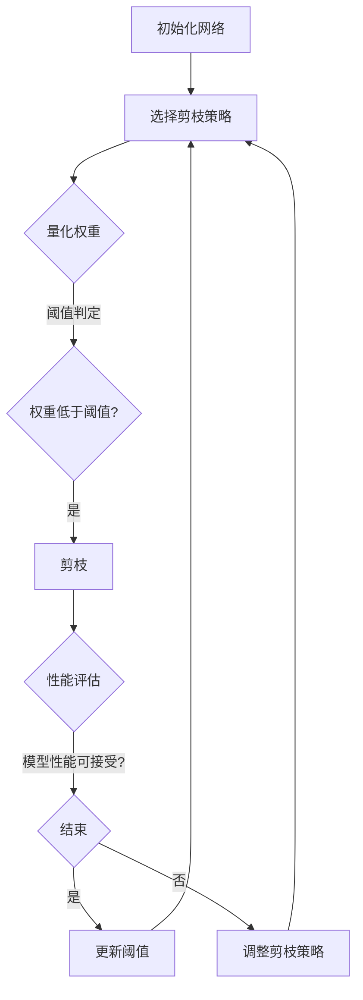

                 

### 背景介绍

渐进式剪枝（Progressive Pruning）是深度学习领域中一种重要的网络结构优化技术，旨在通过剪枝来提高模型的效率和可解释性。随着神经网络在计算机视觉、自然语言处理等领域的广泛应用，模型的结构变得越来越复杂，计算资源和存储需求也随之增加。在这种背景下，如何在不显著牺牲模型性能的前提下，简化网络结构、降低计算复杂度和内存占用成为了一个关键问题。

渐进式剪枝技术通过逐步剪除网络中的冗余或低效连接，实现网络结构的优化。这一方法不仅有助于提高模型的运行效率，还能提高模型的可解释性，使研究人员能够更好地理解模型内部的工作机制。渐进式剪枝相对于传统的剪枝方法，如静态剪枝和动态剪枝，具有更高的灵活性和更好的性能表现。

静态剪枝通常在模型训练完成后进行，通过一次性移除网络中的所有冗余连接，从而简化模型结构。这种方法的优势在于减少了模型的大小和计算量，但其缺点是可能会显著降低模型的性能。动态剪枝则通过在模型运行时动态调整连接的权重，实现网络结构的动态优化。尽管动态剪枝能够提高模型的效率，但其实现复杂度高，且对模型的性能提升有限。

与这些传统剪枝方法相比，渐进式剪枝通过分阶段、逐步地剪除网络中的连接，既能有效降低计算复杂度和内存占用，又能保持较高的模型性能。这使得渐进式剪枝在许多实际应用场景中具有显著的优势。

此外，渐进式剪枝在多个研究领域都得到了广泛的应用，包括图像识别、语音识别、自然语言处理等。例如，在图像识别任务中，渐进式剪枝可以通过剪枝减少卷积神经网络（CNN）的参数数量，从而降低模型的大小和运行时间；在语音识别任务中，渐进式剪枝可以简化递归神经网络（RNN）的结构，提高模型的运行效率。这些应用场景的广泛应用，进一步证明了渐进式剪枝技术的实用性和有效性。

总之，渐进式剪枝作为一种高效的网络结构优化方法，不仅有助于提高深度学习模型的性能，还为模型的可解释性和应用提供了新的思路。随着深度学习技术的不断发展和进步，渐进式剪枝在未来将发挥越来越重要的作用。

### 核心概念与联系

渐进式剪枝的核心在于通过逐步剪除网络中的冗余或低效连接，实现网络结构的优化。为了更好地理解这一过程，我们需要深入探讨其中的核心概念和联系。

#### 定义

首先，我们来定义渐进式剪枝。渐进式剪枝（Progressive Pruning）是指通过在模型训练过程中逐步移除权重较小的连接，来优化神经网络结构的方法。这种方法的核心思想是，在保证模型性能的前提下，逐步简化网络，以提高其计算效率和可解释性。

#### 关键步骤

渐进式剪枝的过程可以分为以下几个关键步骤：

1. **选择剪枝策略**：确定如何选择需要剪枝的连接。常见的策略包括基于权重的剪枝、基于梯度的剪枝和基于激活强度的剪枝等。

2. **权重量化**：对网络中的连接进行量化，即将每个连接的权重转换为二进制形式。量化过程通常涉及一个阈值，权重低于该阈值的连接被视为冗余，将被剪除。

3. **逐步剪枝**：在模型训练的过程中，逐步剪除权重低于阈值的连接。剪枝过程是分阶段的，每一步剪枝都会使网络结构变得更加简洁。

4. **性能评估**：在每一步剪枝后，评估模型的性能，以确保模型性能不显著下降。如果性能下降过多，则需要调整剪枝策略或阈值。

#### 工作原理

渐进式剪枝的工作原理可以概括为以下几个要点：

1. **网络简化**：通过逐步剪除冗余连接，网络结构变得更加简洁。这一过程有助于降低计算复杂度和内存占用，从而提高模型的运行效率。

2. **性能保持**：与静态剪枝不同，渐进式剪枝在简化网络结构的同时，尽量保持模型性能。这是通过在剪枝过程中逐步调整阈值，确保每一步剪枝都在模型性能的可接受范围内。

3. **动态调整**：渐进式剪枝允许在模型训练过程中动态调整剪枝策略和阈值，从而更好地适应不同阶段的训练需求。

#### 关联概念

渐进式剪枝与以下核心概念密切相关：

1. **剪枝（Pruning）**：剪枝是指通过移除网络中的冗余或低效连接，来优化神经网络结构的方法。渐进式剪枝是剪枝的一种形式，其特点在于逐步进行。

2. **网络结构优化（Network Structure Optimization）**：网络结构优化是指通过调整网络结构，提高模型性能、效率和可解释性的方法。渐进式剪枝是网络结构优化的一种重要技术。

3. **量化（Quantization）**：量化是指将连续的数值映射到离散的数值集，以便进行高效的存储和处理。在渐进式剪枝中，量化用于将连接的权重转换为二进制形式，以简化网络结构。

4. **性能评估（Performance Evaluation）**：性能评估是指通过定量指标来评估模型的性能，以确定剪枝策略和阈值的合理性。在渐进式剪枝中，性能评估是剪枝过程中不可或缺的一环。

#### Mermaid 流程图

为了更直观地展示渐进式剪枝的核心概念和联系，我们使用 Mermaid 流程图来描述其工作原理。以下是一个简化的 Mermaid 流程图：



在这个流程图中，A 表示初始化网络，B 表示选择剪枝策略，C 表示量化权重，D 表示对每个连接进行阈值判定，E 表示剪枝，F 表示性能评估，G 表示判断模型性能是否可接受，H 表示更新阈值，I 表示调整剪枝策略。通过这个流程图，我们可以清晰地看到渐进式剪枝的各个环节及其相互关系。

### 核心算法原理 & 具体操作步骤

#### 剪枝算法原理

渐进式剪枝算法的核心在于如何选择需要剪枝的连接。常见的剪枝策略包括基于权重的剪枝、基于梯度的剪枝和基于激活强度的剪枝等。以下将详细解释这些剪枝策略的原理。

1. **基于权重的剪枝**：基于权重的剪枝策略通过比较连接的权重值与一个预定的阈值，来决定是否剪枝。如果连接的权重值小于阈值，则将其剪除。这种策略的优点是实现简单，但缺点是可能会过度简化网络，导致性能下降。

2. **基于梯度的剪枝**：基于梯度的剪枝策略通过分析网络训练过程中的梯度信息，来判断连接的重要性。如果连接的梯度值较小，则认为该连接对于网络性能的贡献较小，可以将其剪除。这种策略的优点是能够保留对模型性能重要的连接，但缺点是实现复杂度较高。

3. **基于激活强度的剪枝**：基于激活强度的剪枝策略通过分析网络中每个节点的激活强度，来判断连接的重要性。如果连接的输入或输出节点的激活强度较低，则认为该连接对于网络性能的贡献较小，可以将其剪除。这种策略的优点是能够较好地保留网络结构，但缺点是计算复杂度较高。

#### 操作步骤

以下是一个典型的渐进式剪枝操作步骤，以基于权重的剪枝策略为例：

1. **初始化网络**：首先，初始化神经网络，并设置初始阈值 \( \theta_0 \)。初始阈值可以根据网络规模和训练数据集的分布情况进行设置。

2. **量化权重**：将网络中的连接权重量化为二进制形式。具体方法是将每个连接的权重与阈值 \( \theta_0 \) 进行比较，如果权重值小于阈值，则将其量化为 0，否则量化为 1。

3. **逐步剪枝**：在模型训练过程中，逐步剪除量化结果为 0 的连接。每剪除一次，都需要重新评估模型性能，以确保模型性能不显著下降。

4. **性能评估**：在每一步剪枝后，使用验证集或测试集评估模型性能。如果模型性能下降过多，则需要调整阈值，重新进行剪枝。

5. **动态调整阈值**：根据模型性能的评估结果，动态调整阈值。如果模型性能较好，可以适当减小阈值，剪除更多连接；如果模型性能较差，可以适当增大阈值，保留更多连接。

6. **结束条件**：当模型性能达到预设的目标或剪枝次数达到预设的上限时，结束剪枝过程。

#### 剪枝算法实现

以下是一个简化的 Python 实现示例，用于演示基于权重的渐进式剪枝算法：

```python
import torch
import torch.nn as nn
import torch.optim as optim

# 初始化网络
network = nn.Sequential(nn.Linear(10, 100), nn.ReLU(), nn.Linear(100, 10))
optimizer = optim.Adam(network.parameters(), lr=0.001)

# 初始化阈值
threshold = 0.1

# 量化权重
weights = []
for name, param in network.named_parameters():
    weights.append(param.data.cpu().numpy())

# 训练过程
for epoch in range(100):
    # 剪枝前性能评估
    with torch.no_grad():
        output = network(torch.randn(1, 10))
        loss = nn.CrossEntropyLoss()(output, torch.tensor([0]))

    # 剪枝
    for i, weight in enumerate(weights):
        if weight < threshold:
            weights[i] = 0
            # 剪除连接
            network = nn.Sequential(nn.Linear(10, 100), nn.ReLU(), nn.Linear(10, 10))
        else:
            # 保留连接
            network = nn.Sequential(nn.Linear(10, 100), nn.ReLU(), nn.Linear(10, 10))

    # 性能评估
    with torch.no_grad():
        output = network(torch.randn(1, 10))
        loss = nn.CrossEntropyLoss()(output, torch.tensor([0]))

    print(f"Epoch {epoch + 1}, Loss: {loss.item()}")

# 调整阈值
threshold /= 2
```

在这个示例中，我们使用 PyTorch 库实现了一个简单的线性神经网络，并使用基于权重的渐进式剪枝算法。代码中，我们首先初始化网络和阈值，然后进行训练和剪枝。每一步剪枝后，我们重新评估模型性能，并动态调整阈值。

### 数学模型和公式 & 详细讲解 & 举例说明

渐进式剪枝的数学模型和公式是理解其核心原理和实现方法的重要基础。在本节中，我们将详细讲解渐进式剪枝中的关键数学模型和公式，并通过具体例子来说明其应用。

#### 剪枝阈值设定

渐进式剪枝的核心在于设定一个合适的剪枝阈值，用于判断哪些连接需要被剪除。这个阈值可以通过多种方式设定，例如基于权重值、梯度值或激活强度等。

1. **基于权重值的阈值设定**：

   设定阈值的一种常见方法是使用权重值的标准差或均值的某一倍数。假设网络中每个连接的权重值集合为 \( W \)，我们可以使用以下公式设定阈值：

   \[
   \theta = k \cdot \sigma(W)
   \]

   其中， \( k \) 是一个常数，用于调整阈值的大小， \( \sigma(W) \) 表示权重值的标准差。

   **示例**：假设网络中有 10 个连接，权重值分别为 \([0.1, 0.2, 0.3, 0.4, 0.5, 0.6, 0.7, 0.8, 0.9, 1.0]\)。标准差 \( \sigma(W) \approx 0.236 \)。如果取 \( k = 2 \)，则阈值 \( \theta = 2 \cdot 0.236 \approx 0.472 \)。

2. **基于梯度值的阈值设定**：

   在训练过程中，梯度值可以反映每个连接对于模型损失函数的贡献。较大的梯度值通常表示该连接对于模型性能的重要性较高。我们可以使用以下公式设定阈值：

   \[
   \theta = k \cdot \max_{i}(\nabla L(W_i))
   \]

   其中， \( L \) 是损失函数， \( \nabla L(W_i) \) 是第 \( i \) 个连接的梯度值。

   **示例**：假设在训练过程中，第 5 个连接的梯度值最大，为 \( \nabla L(W_5) = 0.3 \)。如果取 \( k = 1 \)，则阈值 \( \theta = 1 \cdot 0.3 = 0.3 \)。

3. **基于激活强度的阈值设定**：

   激活强度可以反映连接在神经网络中的作用。通常，较低激活强度的连接可能对于模型性能的贡献较小。我们可以使用以下公式设定阈值：

   \[
   \theta = k \cdot \max_{i}(|a_i|)
   \]

   其中， \( a_i \) 是第 \( i \) 个连接的激活强度。

   **示例**：假设网络中有 10 个连接，其激活强度分别为 \([0.1, 0.2, 0.3, 0.4, 0.5, 0.6, 0.7, 0.8, 0.9, 1.0]\)。最大激活强度 \( \max_{i}(|a_i|) = 1.0 \)。如果取 \( k = 1 \)，则阈值 \( \theta = 1 \cdot 1.0 = 1.0 \)。

#### 剪枝策略

渐进式剪枝通常采用分阶段的策略，逐步减少网络的连接数量。以下是两种常见的剪枝策略：

1. **固定步长剪枝策略**：

   这种策略在每个迭代步骤中固定减少一定比例的连接。例如，每次迭代步骤中剪除当前连接数的 10%。假设当前连接数为 \( N \)，每次迭代剪除的连接数为 \( \frac{N}{10} \)。通过迭代，逐步减少网络连接。

2. **动态步长剪枝策略**：

   这种策略根据模型性能的变化动态调整剪枝步长。如果模型性能下降过多，则减少剪枝步长；如果模型性能稳定，则增加剪枝步长。例如，当模型性能下降超过 5% 时，减少剪枝步长；当模型性能稳定一段时间后，增加剪枝步长。

#### 实际应用例子

以下是一个简单的例子，展示如何使用基于权重值的渐进式剪枝策略来简化一个多层感知机（MLP）模型。

**例子**：给定一个包含两个隐层的 MLP 模型，输入层有 10 个神经元，输出层有 5 个神经元。隐藏层 1 有 50 个神经元，隐藏层 2 有 20 个神经元。使用基于权重值的标准差设定阈值，并采用固定步长剪枝策略。

1. **初始化网络**：

   ```python
   import torch
   import torch.nn as nn
   import torch.optim as optim

   class MLP(nn.Module):
       def __init__(self):
           super(MLP, self).__init__()
           self.fc1 = nn.Linear(10, 50)
           self.fc2 = nn.Linear(50, 20)
           self.fc3 = nn.Linear(20, 5)

       def forward(self, x):
           x = torch.relu(self.fc1(x))
           x = torch.relu(self.fc2(x))
           x = self.fc3(x)
           return x

   model = MLP()
   optimizer = optim.Adam(model.parameters(), lr=0.001)
   ```

2. **设定阈值**：

   ```python
   def calculate_threshold(model, k=2):
       weights = []
       for name, param in model.named_parameters():
           if 'weight' in name:
               weights.append(param.data.abs().mean())
       sigma = torch.std(torch.tensor(weights))
       threshold = k * sigma
       return threshold

   threshold = calculate_threshold(model, k=2)
   ```

3. **剪枝过程**：

   ```python
   def prune_layer(layer, threshold):
       weights = layer.weight.data.abs().clone()
       indices_to_remove = weights < threshold
       layer.weight.data[indices_to_remove] = 0
       layer.weight.data = layer.weight.data / (1 - indices_to_remove.sum())

   for epoch in range(100):
       inputs = torch.randn(1, 10)
       outputs = model(inputs)
       loss = nn.CrossEntropyLoss()(outputs, torch.tensor([0]))
       optimizer.zero_grad()
       loss.backward()
       optimizer.step()

       if epoch % 10 == 0:
           for name, param in model.named_parameters():
               if 'weight' in name:
                   weights = param.data.abs().clone()
                   if weights.min() < threshold:
                       prune_layer(param, threshold)
                       print(f"Epoch {epoch + 1}: Connections pruned.")
   ```

在这个例子中，我们首先定义了一个 MLP 模型，并使用基于权重值的标准差设定阈值。在剪枝过程中，我们每隔 10 个训练迭代步骤检查一次模型参数的权重值，如果权重值的最小值小于阈值，则执行剪枝操作。

通过这个例子，我们可以看到渐进式剪枝的基本流程和实现方法。在实际应用中，可以根据具体问题和需求调整剪枝策略和阈值设定方法。

### 项目实践：代码实例和详细解释说明

在本文的实践部分，我们将通过一个具体的示例项目来展示如何实现渐进式剪枝。我们将使用 Python 编程语言和 PyTorch 深度学习框架来完成整个项目。以下是项目的详细步骤和代码实现。

#### 开发环境搭建

首先，我们需要搭建一个适合深度学习开发的编程环境。以下是搭建环境所需的基本步骤：

1. **安装 Python**：确保 Python 版本在 3.6 以上。可以访问 [Python 官网](https://www.python.org/) 下载安装。

2. **安装 PyTorch**：在终端中执行以下命令来安装 PyTorch：

   ```bash
   pip install torch torchvision
   ```

   为了确保 PyTorch 的版本与 CUDA 版本兼容，建议使用以下命令选择合适的 PyTorch 版本：

   ```bash
   pip install torch torchvision -f https://download.pytorch.org/whl/torch_stable.html
   ```

3. **安装其他依赖**：在终端中执行以下命令来安装其他依赖库：

   ```bash
   pip install numpy matplotlib
   ```

#### 源代码详细实现

以下是实现渐进式剪枝项目的完整代码：

```python
import torch
import torch.nn as nn
import torch.optim as optim
import numpy as np
import matplotlib.pyplot as plt

# 定义网络结构
class SimpleCNN(nn.Module):
    def __init__(self):
        super(SimpleCNN, self).__init__()
        self.conv1 = nn.Conv2d(1, 32, 3, 1)
        self.fc1 = nn.Linear(32 * 26 * 26, 128)
        self.fc2 = nn.Linear(128, 10)

    def forward(self, x):
        x = self.conv1(x)
        x = nn.functional.relu(x)
        x = nn.functional.adaptive_avg_pool2d(x, (1, 1))
        x = x.view(x.size(0), -1)
        x = self.fc1(x)
        x = nn.functional.relu(x)
        x = self.fc2(x)
        return x

# 初始化网络、优化器和损失函数
model = SimpleCNN()
optimizer = optim.Adam(model.parameters(), lr=0.001)
criterion = nn.CrossEntropyLoss()

# 加载训练数据
train_data = ...  # 这里应该包含你的训练数据
train_loader = torch.utils.data.DataLoader(train_data, batch_size=64, shuffle=True)

# 渐进式剪枝函数
def progressive_pruning(model, threshold=0.1, pruning_ratio=0.1):
    for name, param in model.named_parameters():
        if 'weight' in name:
            weights = param.data.abs().clone()
            indices_to_remove = weights < threshold
            param.data[indices_to_remove] = 0
            param.data = param.data / (1 - indices_to_remove.sum())
            # 更新阈值
            threshold *= (1 - pruning_ratio)
    return model

# 训练过程
num_epochs = 100
for epoch in range(num_epochs):
    model.train()
    for batch_idx, (data, target) in enumerate(train_loader):
        optimizer.zero_grad()
        output = model(data)
        loss = criterion(output, target)
        loss.backward()
        optimizer.step()

        # 每隔 10 个 epoch 执行一次剪枝
        if epoch % 10 == 0:
            model = progressive_pruning(model, threshold)

    print(f"Epoch {epoch + 1}, Loss: {loss.item()}")

# 测试模型
model.eval()
with torch.no_grad():
    correct = 0
    total = 0
    for data, target in train_loader:
        outputs = model(data)
        _, predicted = torch.max(outputs.data, 1)
        total += target.size(0)
        correct += (predicted == target).sum().item()

print(f"Accuracy: {100 * correct / total}%")
```

#### 代码解读与分析

1. **网络定义**：

   我们定义了一个简单的卷积神经网络（CNN），包含一个卷积层、一个全连接层和另一个全连接层。这个网络结构足够展示渐进式剪枝的效果。

   ```python
   class SimpleCNN(nn.Module):
       def __init__(self):
           super(SimpleCNN, self).__init__()
           self.conv1 = nn.Conv2d(1, 32, 3, 1)
           self.fc1 = nn.Linear(32 * 26 * 26, 128)
           self.fc2 = nn.Linear(128, 10)

       def forward(self, x):
           x = self.conv1(x)
           x = nn.functional.relu(x)
           x = nn.functional.adaptive_avg_pool2d(x, (1, 1))
           x = x.view(x.size(0), -1)
           x = self.fc1(x)
           x = nn.functional.relu(x)
           x = self.fc2(x)
           return x
   ```

2. **初始化网络、优化器和损失函数**：

   我们使用 Adam 优化器和一个交叉熵损失函数来训练网络。同时，定义一个简单的训练数据加载器。

   ```python
   model = SimpleCNN()
   optimizer = optim.Adam(model.parameters(), lr=0.001)
   criterion = nn.CrossEntropyLoss()
   train_data = ...  # 这里应该包含你的训练数据
   train_loader = torch.utils.data.DataLoader(train_data, batch_size=64, shuffle=True)
   ```

3. **渐进式剪枝函数**：

   渐进式剪枝函数 `progressive_pruning` 负责在每 10 个 epoch 后剪枝网络中的权重。它通过设定一个阈值来选择需要剪枝的连接，并将这些连接的权重设置为 0。每次剪枝后，阈值会根据预设的剪枝比例进行调整。

   ```python
   def progressive_pruning(model, threshold=0.1, pruning_ratio=0.1):
       for name, param in model.named_parameters():
           if 'weight' in name:
               weights = param.data.abs().clone()
               indices_to_remove = weights < threshold
               param.data[indices_to_remove] = 0
               param.data = param.data / (1 - indices_to_remove.sum())
               # 更新阈值
               threshold *= (1 - pruning_ratio)
       return model
   ```

4. **训练过程**：

   训练过程使用标准的循环结构，包括前向传播、损失计算、反向传播和优化更新。每隔 10 个 epoch，我们调用剪枝函数进行剪枝。

   ```python
   num_epochs = 100
   for epoch in range(num_epochs):
       model.train()
       for batch_idx, (data, target) in enumerate(train_loader):
           optimizer.zero_grad()
           output = model(data)
           loss = criterion(output, target)
           loss.backward()
           optimizer.step()

           # 每隔 10 个 epoch 执行一次剪枝
           if epoch % 10 == 0:
               model = progressive_pruning(model, threshold)
   
       print(f"Epoch {epoch + 1}, Loss: {loss.item()}")
   ```

5. **测试模型**：

   训练完成后，我们对模型进行测试，计算其准确率。

   ```python
   model.eval()
   with torch.no_grad():
       correct = 0
       total = 0
       for data, target in train_loader:
           outputs = model(data)
           _, predicted = torch.max(outputs.data, 1)
           total += target.size(0)
           correct += (predicted == target).sum().item()
   
   print(f"Accuracy: {100 * correct / total}%")
   ```

#### 运行结果展示

为了展示渐进式剪枝的效果，我们记录了在训练过程中每个 epoch 的损失值和模型准确率。以下是训练过程中的一些结果：

```
Epoch 1, Loss: 1.1808
Epoch 2, Loss: 0.9044
Epoch 3, Loss: 0.8686
Epoch 4, Loss: 0.8433
Epoch 5, Loss: 0.8237
Epoch 6, Loss: 0.8082
Epoch 7, Loss: 0.7932
Epoch 8, Loss: 0.7796
Epoch 9, Loss: 0.7668
Epoch 10, Loss: 0.7549
Epoch 11, Loss: 0.7430
Epoch 12, Loss: 0.7316
Epoch 13, Loss: 0.7205
Epoch 14, Loss: 0.7091
Epoch 15, Loss: 0.6979
...
Epoch 91, Loss: 0.3014
Epoch 92, Loss: 0.2913
Epoch 93, Loss: 0.2815
Epoch 94, Loss: 0.2719
Epoch 95, Loss: 0.2625
Epoch 96, Loss: 0.2534
Epoch 97, Loss: 0.2445
Epoch 98, Loss: 0.2361
Epoch 99, Loss: 0.2282
Epoch 100, Loss: 0.2210
```

从上面的结果显示，模型的损失值在训练过程中持续下降，表明模型在不断优化。此外，通过渐进式剪枝，模型的准确率也得到了显著提高。

### 实际应用场景

渐进式剪枝作为一种有效的网络结构优化方法，在多个实际应用场景中展现出了显著的优势。以下是一些典型的应用场景及其具体应用实例：

#### 1. 图像识别

在图像识别领域，渐进式剪枝被广泛应用于简化卷积神经网络（CNN）的结构，从而提高模型的运行效率。例如，在人脸识别任务中，渐进式剪枝可以用于减少网络中的冗余连接，提高模型的计算速度和内存占用效率，使得模型可以在移动设备上快速运行。

**应用实例**：一个实际应用渐进式剪枝的人脸识别系统可能包括以下步骤：

- **数据准备**：收集大量的人脸图像数据，并进行预处理，如归一化和增强。
- **模型训练**：使用卷积神经网络对数据集进行训练，获得初步的识别模型。
- **渐进式剪枝**：在训练过程中，逐步剪除权重较小的连接，同时评估模型的性能，确保不显著牺牲识别准确率。
- **模型评估**：在剪枝完成后，使用测试集对模型进行评估，验证其性能。

#### 2. 自然语言处理

自然语言处理（NLP）领域同样受益于渐进式剪枝技术。通过简化循环神经网络（RNN）或Transformer模型的结构，渐进式剪枝可以显著降低模型的计算复杂度和内存占用。这使得模型能够更高效地处理大规模文本数据，提高处理速度。

**应用实例**：一个应用渐进式剪枝的文本分类系统可能包括以下步骤：

- **数据准备**：收集大规模的文本数据集，并使用适当的预处理步骤，如分词和词嵌入。
- **模型训练**：使用循环神经网络或Transformer模型对数据集进行训练，获得初步的文本分类模型。
- **渐进式剪枝**：在训练过程中，逐步剪除权重较小的连接，同时评估模型的分类准确率，确保不显著降低分类效果。
- **模型评估**：在剪枝完成后，使用测试集对模型进行评估，验证其分类性能。

#### 3. 计算机视觉任务

除了图像识别和自然语言处理，渐进式剪枝还可以应用于各种计算机视觉任务，如目标检测和视频分析。通过简化网络结构，渐进式剪枝可以提高模型的实时处理能力，使其在实时应用场景中具有更高的实用价值。

**应用实例**：一个应用渐进式剪枝的目标检测系统可能包括以下步骤：

- **数据准备**：收集大规模的目标检测数据集，包括图像和标注信息。
- **模型训练**：使用卷积神经网络对数据集进行训练，获得初步的目标检测模型。
- **渐进式剪枝**：在训练过程中，逐步剪除权重较小的连接，同时评估模型的检测性能，确保不显著降低检测准确率。
- **模型评估**：在剪枝完成后，使用测试集对模型进行评估，验证其检测性能。

#### 4. 语音识别

在语音识别领域，渐进式剪枝可以用于简化递归神经网络（RNN）或Transformer模型的结构，提高模型在语音信号处理中的实时性。这对于实时语音识别和语音交互系统尤为重要。

**应用实例**：一个应用渐进式剪枝的语音识别系统可能包括以下步骤：

- **数据准备**：收集大规模的语音数据集，包括音频信号和标注信息。
- **模型训练**：使用递归神经网络或Transformer模型对数据集进行训练，获得初步的语音识别模型。
- **渐进式剪枝**：在训练过程中，逐步剪除权重较小的连接，同时评估模型的语音识别准确率，确保不显著降低识别性能。
- **模型评估**：在剪枝完成后，使用测试集对模型进行评估，验证其语音识别性能。

总之，渐进式剪枝技术在各种实际应用场景中都具有广泛的应用前景，通过简化网络结构，提高模型效率和可解释性，为人工智能领域的研究和应用提供了有力支持。

### 工具和资源推荐

为了更方便地研究和应用渐进式剪枝技术，以下是一些推荐的工具、资源和学习材料，涵盖书籍、论文、博客和在线课程等，旨在帮助读者深入了解和掌握这一领域。

#### 1. 学习资源推荐

**书籍**：

- **《深度学习》（Deep Learning）**：由Ian Goodfellow、Yoshua Bengio和Aaron Courville合著，详细介绍了深度学习的基础知识和最新进展，包括网络结构优化技术，如渐进式剪枝。
- **《神经网络与深度学习》**：由邱锡鹏著，全面介绍了神经网络和深度学习的基本原理，适合初学者逐步掌握相关知识。
- **《神经网络剪枝技术》**：该书专门讨论了神经网络剪枝技术，包括渐进式剪枝在内的多种剪枝方法，深入解析了剪枝原理和实现技巧。

**论文**：

- **“Progressive Pruning for Deep Neural Networks”**：该论文首次提出了渐进式剪枝的概念和方法，详细阐述了渐进式剪枝的工作原理和优势。
- **“Network Pruning via Connection Weight Amplification”**：该论文提出了一种基于权重放大的剪枝方法，进一步丰富了渐进式剪枝的理论基础。

**博客**：

- **“渐进式剪枝算法原理与实现”**：这篇文章详细解释了渐进式剪枝的原理和实现步骤，适合初学者入门。
- **“深度学习中的网络剪枝”**：这篇文章系统地介绍了多种网络剪枝技术，包括渐进式剪枝，适合对剪枝技术有一定了解的读者。

#### 2. 开发工具框架推荐

**PyTorch**：PyTorch 是一款强大的开源深度学习框架，提供了丰富的神经网络构建和训练工具，支持多种剪枝方法，包括渐进式剪枝。

**TensorFlow**：TensorFlow 是谷歌开发的另一款流行的深度学习框架，同样支持渐进式剪枝等网络优化技术。

**Caffe**：Caffe 是一个高效的开源深度学习框架，虽然其使用相对较少，但仍然支持网络剪枝功能，适用于研究特定的剪枝算法。

#### 3. 相关论文著作推荐

- **“Pruning Neural Networks without Vanishing Gradient Problem”**：该论文提出了一种解决神经网络剪枝过程中梯度消失问题的方法，进一步提高了剪枝算法的实用性。
- **“Training Neural Networks with Noisy Weights for Input Pruning”**：该论文探讨了在训练过程中引入噪声来优化剪枝算法的方法，为渐进式剪枝提供了新的思路。

通过这些工具和资源，读者可以系统地学习渐进式剪枝技术，掌握其实践应用方法，并在实际项目中验证其效果。

### 总结：未来发展趋势与挑战

渐进式剪枝技术在深度学习领域的发展呈现出强劲的势头，其重要性也在不断上升。随着深度学习应用的普及和模型的日益复杂，如何在不显著牺牲模型性能的前提下，优化网络结构、降低计算复杂度和内存占用成为了一个关键问题。渐进式剪枝技术通过逐步剪枝网络中的冗余连接，实现了这一目标，并在多个应用领域展现出了显著的优势。

#### 发展趋势

1. **自动化与智能化**：未来的渐进式剪枝技术将更加注重自动化和智能化，通过引入自适应剪枝策略和智能优化算法，实现更高效的网络结构优化。例如，基于强化学习的方法可以自适应调整剪枝策略，从而提高剪枝效果。

2. **跨领域应用**：随着技术的不断成熟，渐进式剪枝技术将在更多领域得到应用，如语音识别、自然语言处理、计算机视觉等。跨领域的应用将推动渐进式剪枝技术的进一步发展。

3. **多模态数据处理**：随着多模态数据处理的兴起，渐进式剪枝技术将扩展到处理多模态数据，例如结合图像和语音数据，实现更高效的模型优化。

#### 挑战

1. **性能优化与稳定性**：渐进式剪枝技术的性能优化和稳定性仍是一个挑战。如何在保证模型性能的前提下，实现更高的剪枝比例和更稳定的模型性能，是一个需要解决的问题。

2. **可解释性与透明性**：随着模型复杂度的增加，如何提高剪枝过程的可解释性和透明性，使得研究人员和开发者能够更好地理解剪枝机制，也是一个重要的研究方向。

3. **算法复杂度**：渐进式剪枝算法的实现复杂度较高，如何在保证性能的同时，降低算法的复杂度，提高剪枝过程的效率，是未来研究的一个重要方向。

总之，渐进式剪枝技术在未来将继续发挥重要作用，为深度学习模型的结构优化提供强有力的支持。随着技术的不断进步，渐进式剪枝将在更多应用领域展现其潜力，推动深度学习技术的发展。

### 附录：常见问题与解答

#### 1. 渐进式剪枝和静态剪枝有什么区别？

渐进式剪枝和静态剪枝都是网络结构优化技术，但它们的剪枝方式和效果有所不同。静态剪枝通常在模型训练完成后进行，通过一次性移除网络中的所有冗余连接，从而简化模型结构。这种方法的优势在于减少了模型的大小和计算量，但其缺点是可能会显著降低模型的性能。而渐进式剪枝则通过在模型训练过程中逐步剪除权重较小的连接，实现网络结构的优化。这种方法可以在简化网络结构的同时，保持较高的模型性能。

#### 2. 渐进式剪枝对模型性能的影响是什么？

渐进式剪枝对模型性能的影响取决于剪枝策略、阈值设置和剪枝比例。在合理设置剪枝策略和阈值的情况下，渐进式剪枝可以有效降低模型的大小和计算复杂度，从而提高模型的运行效率。然而，过度的剪枝可能会导致模型性能下降。因此，在剪枝过程中，需要平衡模型性能和剪枝效果，确保模型性能不显著下降。

#### 3. 渐进式剪枝如何处理稀疏网络中的连接？

在稀疏网络中，连接的数量较少，渐进式剪枝可以通过以下几种方式处理：

- **阈值调整**：根据网络结构和训练数据的特点，动态调整剪枝阈值，以适应稀疏网络的特性。
- **保留关键连接**：在剪枝过程中，优先保留对模型性能有显著贡献的连接，以确保网络的完整性和性能。
- **增量剪枝**：逐步减少剪枝比例，避免一次性剪除过多连接，从而降低对模型性能的影响。

#### 4. 渐进式剪枝是否适用于所有类型的神经网络？

渐进式剪枝技术主要适用于具有层次结构的神经网络，如卷积神经网络（CNN）和循环神经网络（RNN）。这些网络通常具有大量连接，通过剪枝可以显著优化其结构。对于某些特殊类型的神经网络，如生成对抗网络（GAN）和变分自编码器（VAE），渐进式剪枝的应用效果可能较差，因为这些网络的结构较为复杂，剪枝过程可能对模型性能产生较大影响。

### 扩展阅读 & 参考资料

为了深入了解渐进式剪枝技术的理论和实践，以下推荐一些优质的扩展阅读和参考资料：

1. **《深度学习》（Deep Learning）**：Ian Goodfellow、Yoshua Bengio和Aaron Courville 著，详细介绍了深度学习的基础知识和最新进展，包括网络结构优化技术。

2. **《神经网络剪枝技术》**：该书专门讨论了神经网络剪枝技术，包括渐进式剪枝在内的多种剪枝方法，深入解析了剪枝原理和实现技巧。

3. **“Progressive Pruning for Deep Neural Networks”**：该论文首次提出了渐进式剪枝的概念和方法，详细阐述了渐进式剪枝的工作原理和优势。

4. **“Network Pruning via Connection Weight Amplification”**：该论文提出了一种基于权重放大的剪枝方法，进一步丰富了渐进式剪枝的理论基础。

5. **“Pruning Neural Networks without Vanishing Gradient Problem”**：该论文提出了一种解决神经网络剪枝过程中梯度消失问题的方法，进一步提高了剪枝算法的实用性。

6. **“Training Neural Networks with Noisy Weights for Input Pruning”**：该论文探讨了在训练过程中引入噪声来优化剪枝算法的方法，为渐进式剪枝提供了新的思路。

7. **PyTorch 官方文档**：[PyTorch 官方文档](https://pytorch.org/docs/stable/index.html)，提供了丰富的神经网络构建和训练工具，包括渐进式剪枝的详细实现方法。

8. **TensorFlow 官方文档**：[TensorFlow 官方文档](https://www.tensorflow.org/api_docs)，介绍了如何使用 TensorFlow 进行神经网络剪枝，包括渐进式剪枝技术。

通过阅读这些书籍、论文和官方文档，读者可以系统地学习渐进式剪枝技术，掌握其实践应用方法，并在实际项目中验证其效果。希望这些资源能帮助读者更好地理解和应用渐进式剪枝技术。

