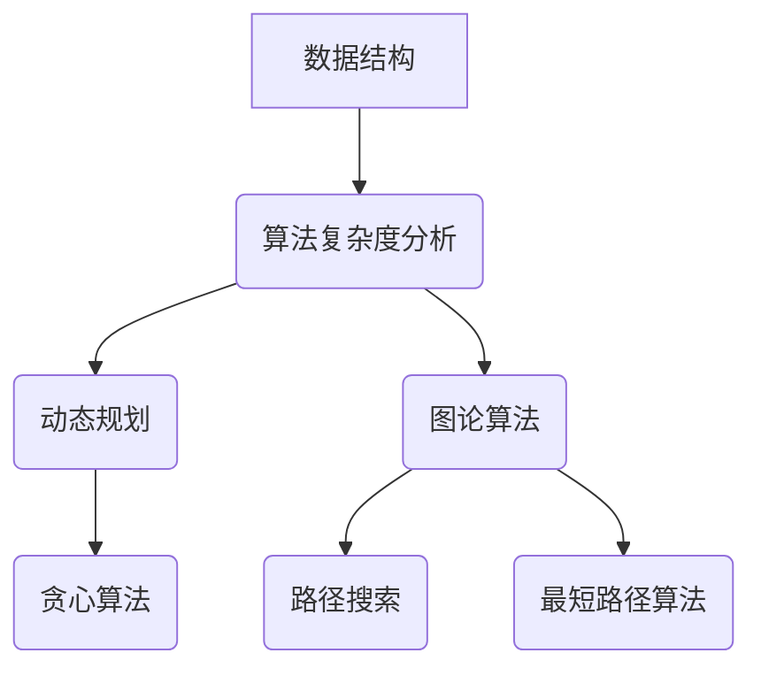

                 

### 背景介绍

在技术飞速发展的今天，算法作为计算机科学的核心领域之一，不断推动着科技的进步。尤其是在数据爆炸式增长的背景下，如何高效地处理海量数据成为了一个重要的研究课题。滴滴出行，作为全球领先的移动出行平台，其核心业务依赖于对海量数据的实时处理和分析。因此，滴滴在2025届校招中，高频地考察了各类算法问题，旨在寻找那些能够深刻理解算法本质，并能将其应用于实际业务场景的优秀人才。

算法题的设置不仅考察了候选人的基础算法知识，还要求其具备解决复杂问题的能力和创新思维。这些题目涵盖了从基础的数据结构与算法，到更高级的动态规划、图论算法以及机器学习等多个领域。本文将围绕滴滴2025届校招面试中的高频算法题，进行详细的解析，旨在帮助读者深入理解这些算法题的解题思路，提升解决实际问题的能力。

算法在计算机科学中的重要性不言而喻。它不仅是计算机程序的核心，也是计算机性能的保障。一个高效的算法能够大幅度提升程序的运行速度和资源利用率，从而实现性能优化。在实际应用中，算法广泛应用于搜索引擎、推荐系统、金融交易、数据挖掘、图像处理等领域，为各类复杂问题的解决提供了强有力的工具。

滴滴出行作为一个典型的互联网公司，其业务场景复杂多样，对算法的要求极高。滴滴的算法面试题不仅考察了基础算法能力，更注重候选人能否将算法知识灵活应用于解决实际问题。例如，在滴滴的面试中，常常会出现关于动态规划、图论算法以及优化问题的题目，这些题目既考验了候选人的基础知识，也考察了其分析问题和解决问题的能力。

本文将按照以下结构进行详细解析：

1. **核心概念与联系**：介绍算法的核心概念及其在解决问题中的联系。
2. **核心算法原理 & 具体操作步骤**：讲解具体的算法原理和操作步骤。
3. **数学模型和公式 & 详细讲解 & 举例说明**：介绍相关数学模型和公式，并通过实例进行详细讲解。
4. **项目实践：代码实例和详细解释说明**：提供代码实例并进行详细解释和分析。
5. **实际应用场景**：探讨算法在滴滴出行等场景中的实际应用。
6. **工具和资源推荐**：推荐相关学习资源和开发工具。
7. **总结：未来发展趋势与挑战**：总结算法的发展趋势和面临的挑战。
8. **附录：常见问题与解答**：回答读者可能关心的一些问题。
9. **扩展阅读 & 参考资料**：提供更多的参考资料以供深入学习。

通过本文的解析，读者将能够全面了解滴滴2025届校招中的高频算法题，掌握解题方法，并能够将这些方法应用于实际工作中。让我们一起探索算法的奥妙，提升技术能力，为未来的技术发展贡献自己的力量。

### 核心概念与联系

在深入探讨滴滴2025届校招中的高频算法题之前，我们需要先了解一些核心的概念和它们之间的联系。算法的核心概念包括数据结构、算法复杂度分析、动态规划、图论算法、贪心算法等，这些概念相互联系，共同构成了算法的世界。

#### 数据结构

数据结构是算法的基础，它定义了数据存储和操作的方式。常见的数据结构包括数组、链表、栈、队列、树、图等。每种数据结构都有其独特的特点和适用场景。例如，数组提供了快速的随机访问，而链表则在插入和删除操作上具有优势。树和图则是解决复杂关系问题的重要数据结构。

#### 算法复杂度分析

算法复杂度分析是评估算法效率的重要手段。它包括时间复杂度和空间复杂度。时间复杂度表示算法执行时间的增长速度，通常用大O符号表示；空间复杂度表示算法执行过程中所需内存的增长速度。通过复杂度分析，我们可以预测算法在不同数据规模下的性能表现，从而选择合适的算法。

#### 动态规划

动态规划是一种重要的算法设计技术，它通过将复杂问题分解为子问题，并存储子问题的解，以避免重复计算。动态规划适用于具有最优子结构性质的优化问题。常见的动态规划问题包括背包问题、最长公共子序列、最长递增子序列等。

#### 图论算法

图论算法是解决图相关问题的算法集合。图是一种由节点和边组成的数据结构，常用于表示复杂的关系。图论算法包括图的遍历、最短路径算法、最小生成树算法等。这些算法在路径规划、网络优化等领域有着广泛的应用。

#### 贪心算法

贪心算法是一种简化的优化策略，它通过在每一步选择中采取局部最优解，从而期望得到全局最优解。贪心算法适用于某些具有贪心选择性质的优化问题，如活动选择问题、背包问题等。

这些核心概念相互联系，构成了算法的完整体系。例如，动态规划和贪心算法都利用了子问题的解来解决复杂问题，而图论算法则依赖于数据结构和路径搜索技术。理解这些概念及其联系，有助于我们更好地掌握算法，解决实际问题。

#### Mermaid 流程图

为了更直观地展示这些核心概念之间的联系，我们可以使用Mermaid流程图来表示。以下是图算法中几个关键概念之间的Mermaid流程图：



通过这个流程图，我们可以清晰地看到数据结构如何支持算法复杂度分析，以及动态规划和贪心算法如何应用于不同的图算法中。

理解这些核心概念和联系，是解决算法题的基础。在接下来的部分，我们将深入探讨滴滴2025届校招中的高频算法题，通过具体的案例来讲解解题思路和方法。

### 核心算法原理 & 具体操作步骤

在滴滴2025届校招面试中，高频出现的算法题目往往涉及动态规划、图论算法、贪心算法等多个核心算法。本节将详细讲解这些算法的基本原理，并给出具体的操作步骤，以便读者能够更好地理解和应用。

#### 动态规划

动态规划（Dynamic Programming，DP）是一种用于求解最优化问题的算法方法。它通过将复杂问题分解为若干个子问题，并存储子问题的解，从而避免重复计算，提高算法效率。

**基本原理：**

动态规划的核心思想是利用“子问题最优解的性质”来解决复杂问题。具体来说，动态规划通常包含以下三个步骤：

1. **定义状态**：将问题转化为状态转移问题，定义一个状态数组或表来存储子问题的解。
2. **状态转移方程**：根据问题的性质，定义状态之间的关系，即状态转移方程。
3. **边界条件**：确定状态转移方程的初始条件和边界条件。

**具体操作步骤：**

以经典的“最长公共子序列”（Longest Common Subsequence，LCS）为例，详细说明动态规划的操作步骤。

1. **定义状态**：设`dp[i][j]`表示字符串`X[1...i]`和字符串`Y[1...j]`的最长公共子序列的长度。
2. **状态转移方程**：根据问题性质，得到状态转移方程：
   $$dp[i][j] = \begin{cases}
   dp[i-1][j-1] + 1, & \text{若} X[i] = Y[j] \\
   \max(dp[i-1][j], dp[i][j-1]), & \text{若} X[i] \neq Y[j]
   \end{cases}$$
3. **边界条件**：初始条件为`dp[0][j] = dp[i][0] = 0`。

**代码示例：**

以下是计算最长公共子序列的Python代码示例：

```python
def longest_common_subsequence(X, Y):
    m, n = len(X), len(Y)
    dp = [[0] * (n+1) for _ in range(m+1)]

    for i in range(1, m+1):
        for j in range(1, n+1):
            if X[i-1] == Y[j-1]:
                dp[i][j] = dp[i-1][j-1] + 1
            else:
                dp[i][j] = max(dp[i-1][j], dp[i][j-1])

    return dp[m][n]
```

#### 图论算法

图论算法是解决与图相关问题的算法集合。图由节点（或顶点）和边组成，常用于表示复杂的关系和网络。常见的图论算法包括图的遍历、最短路径算法、最小生成树算法等。

**基本原理：**

图论算法的核心在于利用图的性质进行路径搜索、最优化等问题。以下是几种常用的图论算法的基本原理：

1. **深度优先搜索（DFS）**：DFS是一种用于遍历图的算法，它通过递归方式访问图的节点，并探索其所有未访问的邻接节点。
2. **广度优先搜索（BFS）**：BFS是一种用于遍历图的算法，它通过队列数据结构依次访问图的节点，并探索其所有未访问的邻接节点。
3. **Dijkstra算法**：Dijkstra算法是一种用于求解图中单源最短路径的算法，它通过优先队列（小根堆）选择未被访问的节点中距离源点最短的一个进行扩展。
4. **Prim算法**：Prim算法是一种用于求解图的最小生成树的算法，它从任一节点开始，逐步添加节点和边，直到形成最小生成树。

**具体操作步骤：**

以求解单源最短路径的Dijkstra算法为例，详细说明其操作步骤。

1. **初始化**：设置一个优先队列`pq`，用于存储未被访问的节点及其距离。初始时，源点距离为0，其他节点距离为无穷大。
2. **选择节点**：从优先队列中选择距离源点最短的节点`u`。
3. **更新距离**：对于节点`u`的每个未访问的邻接节点`v`，计算从源点到节点`v`的新距离，并将其更新到优先队列中。
4. **标记节点**：将节点`u`标记为已访问。
5. **重复步骤2-4**，直到优先队列为空。

**代码示例：**

以下是使用Dijkstra算法求解单源最短路径的Python代码示例：

```python
import heapq

def dijkstra(graph, source):
    n = len(graph)
    distances = [float('inf')] * n
    distances[source] = 0
    pq = [(0, source)]

    while pq:
        current_distance, current_node = heapq.heappop(pq)
        if current_distance != distances[current_node]:
            continue

        for neighbor, weight in graph[current_node].items():
            distance = current_distance + weight
            if distance < distances[neighbor]:
                distances[neighbor] = distance
                heapq.heappush(pq, (distance, neighbor))

    return distances
```

#### 贪心算法

贪心算法（Greedy Algorithm）是一种简化的优化策略，它通过在每一步选择中采取局部最优解，从而期望得到全局最优解。贪心算法适用于某些具有贪心选择性质的优化问题。

**基本原理：**

贪心算法的核心思想是在每一步选择中做出当前看来最好的选择，并不考虑未来可能带来的影响。贪心选择必须满足两个条件：

1. **最优子结构**：问题的最优解包含其子问题的最优解。
2. **贪心选择性质**：每一步的选择都是局部最优的，并且不依赖于之前的决策。

**具体操作步骤：**

以“活动选择问题”（Activity Selection Problem）为例，详细说明贪心算法的操作步骤。

1. **排序**：将所有活动按照结束时间进行升序排序。
2. **选择活动**：选择第一个活动，并将其结束时间作为当前时间。
3. **更新时间**：从当前时间开始，逐个检查剩余的活动，如果当前活动的开始时间大于当前时间，则选择该活动，并将其结束时间更新为当前时间。

**代码示例：**

以下是解决活动选择问题的Python代码示例：

```python
def activity_selection(activities):
    activities.sort(key=lambda x: x[1])
    n = len(activities)
    result = [activities[0]]

    for i in range(1, n):
        if activities[i][0] >= result[-1][1]:
            result.append(activities[i])

    return result
```

通过上述讲解和示例，我们深入了解了动态规划、图论算法和贪心算法的基本原理和具体操作步骤。这些算法在解决复杂问题时具有重要作用，掌握了它们，我们就能更好地应对滴滴2025届校招中的高频算法题。

#### 数学模型和公式 & 详细讲解 & 举例说明

在计算机科学中，数学模型和公式是解决算法问题的重要工具。本节将介绍一些在滴滴2025届校招面试中经常出现的数学模型和公式，并通过具体的实例进行详细讲解。

##### 动态规划中的数学模型

动态规划中常用的数学模型包括斐波那契数列、线性方程组、背包问题等。以下是这些模型的详细介绍和实例。

**斐波那契数列**

斐波那契数列（Fibonacci sequence）是一个著名的数学数列，它的定义如下：

$$F(0) = 0, F(1) = 1, F(n) = F(n-1) + F(n-2) \quad (n \geq 2)$$

**实例：**

计算斐波那契数列的第10项。

$$F(10) = F(9) + F(8) = (F(8) + F(7)) + (F(7) + F(6)) = ... = 55$$

**线性方程组**

线性方程组（Linear Equation System）是动态规划中常见的问题。线性方程组的一般形式为：

$$
\begin{align*}
a_{11}x_1 + a_{12}x_2 + ... + a_{1n}x_n &= b_1 \\
a_{21}x_1 + a_{22}x_2 + ... + a_{2n}x_n &= b_2 \\
&\vdots \\
a_{m1}x_1 + a_{m2}x_2 + ... + a_{mn}x_n &= b_m
\end{align*}
$$

**实例：**

解方程组：

$$
\begin{align*}
2x_1 + 3x_2 &= 7 \\
4x_1 + x_2 &= 3
\end{align*}
$$

通过高斯消元法，我们可以得到解：

$$
\begin{align*}
x_1 &= 1 \\
x_2 &= 1
\end{align*}
$$

**背包问题**

背包问题（Knapsack Problem）是一个经典的动态规划问题，其定义如下：

给定一组物品，每个物品有重量和价值的属性，求解将哪些物品放入一个容量为`W`的背包中，使得背包中的物品总价值最大。

**实例：**

有4个物品，重量和价值如下表：

| 物品 | 重量 | 价值 |
| ---- | ---- | ---- |
| 1    | 2    | 6    |
| 2    | 3    | 10   |
| 3    | 4    | 16   |
| 4    | 5    | 23   |

背包容量为10，求解最大价值。

**动态规划解法：**

使用二维数组`dp[i][w]`表示在前`i`个物品中选择重量不超过`w`的最大价值。状态转移方程为：

$$dp[i][w] = \begin{cases}
dp[i-1][w], & \text{若} w < weights[i] \\
\max(dp[i-1][w], dp[i-1][w-weights[i]] + values[i]), & \text{若} w \geq weights[i]
\end{cases}$$

初始条件为`dp[0][w] = 0`。

通过计算，可以得到最大价值为`dp[4][10] = 39`。

##### 图论中的数学模型

图论中的数学模型包括最短路径问题、最小生成树问题等。

**最短路径问题**

最短路径问题（Shortest Path Problem）是图论中的经典问题。给定一个加权图，求从一个源点到达其他各点的最短路径。

**Dijkstra算法**

Dijkstra算法是一种用于求解单源最短路径的算法。其基本原理如下：

1. 初始化：设置一个优先队列`pq`，用于存储未被访问的节点及其距离。初始时，源点距离为0，其他节点距离为无穷大。
2. 选择节点：从优先队列中选择距离源点最短的节点`u`。
3. 更新距离：对于节点`u`的每个未访问的邻接节点`v`，计算从源点到节点`v`的新距离，并将其更新到优先队列中。
4. 标记节点：将节点`u`标记为已访问。
5. 重复步骤2-4，直到优先队列为空。

**实例：**

给定一个图和源点`s`，使用Dijkstra算法求解从`s`到其他各点的最短路径。

```python
import heapq

def dijkstra(graph, source):
    n = len(graph)
    distances = [float('inf')] * n
    distances[source] = 0
    pq = [(0, source)]

    while pq:
        current_distance, current_node = heapq.heappop(pq)
        if current_distance != distances[current_node]:
            continue

        for neighbor, weight in graph[current_node].items():
            distance = current_distance + weight
            if distance < distances[neighbor]:
                distances[neighbor] = distance
                heapq.heappush(pq, (distance, neighbor))

    return distances
```

**Prim算法**

Prim算法是一种用于求解图的最小生成树的算法。其基本原理如下：

1. 初始化：从图中任选一个节点作为起点，并将其加入生成树中。
2. 选择边：在剩余的节点中选择一个距离生成树最近的边，并将其加入生成树中。
3. 更新生成树：重复步骤2，直到所有节点都加入生成树中。

**实例：**

给定一个加权无向图，使用Prim算法求解最小生成树。

```python
import heapq

def prim(graph):
    n = len(graph)
    parent = [None] * n
    key = [float('inf')] * n
    mst = []
    key[0] = 0
    visited = [False] * n

    for _ in range(n):
        u = heapq.heappop((key, parent))
        visited[u] = True

        for v, weight in graph[u].items():
            if not visited[v] and weight < key[v]:
                parent[v] = u
                key[v] = weight
                heapq.heappush((key, parent), (key[v], v))

    for u in range(n):
        if parent[u]:
            mst.append((parent[u], u, key[u]))

    return mst
```

##### 贪心算法中的数学模型

贪心算法中的数学模型通常涉及到最优子结构和贪心选择性质。

**活动选择问题**

活动选择问题是一种典型的贪心算法问题。其基本原理如下：

1. 将所有活动按照结束时间进行升序排序。
2. 选择第一个活动，并将其结束时间作为当前时间。
3. 从当前时间开始，逐个检查剩余的活动，如果当前活动的开始时间大于当前时间，则选择该活动，并将其结束时间更新为当前时间。

**实例：**

给定一组活动，求解能够同时进行最多的活动数量。

```python
def activity_selection(activities):
    activities.sort(key=lambda x: x[1])
    n = len(activities)
    result = [activities[0]]

    for i in range(1, n):
        if activities[i][0] >= result[-1][1]:
            result.append(activities[i])

    return result
```

通过上述实例，我们详细讲解了动态规划、图论算法和贪心算法中的数学模型和公式，并通过具体的实例进行了详细讲解。这些数学模型和公式在解决实际问题中发挥着重要作用，掌握它们将有助于我们更好地应对滴滴2025届校招中的高频算法题。

### 项目实践：代码实例和详细解释说明

为了更好地理解滴滴2025届校招中的高频算法题，我们将通过具体的项目实践，提供代码实例并进行详细解释说明。以下是一个常见的面试题目：单源最短路径问题。

#### 开发环境搭建

首先，我们需要搭建一个适合编写和运行算法代码的开发环境。以下是所需的工具和步骤：

1. **安装Python环境**：Python是许多算法问题的首选编程语言，可以在[Python官网](https://www.python.org/)下载并安装。
2. **安装相关库**：安装用于图论算法和优先队列的库，如`networkx`和`heapq`。可以使用以下命令安装：

   ```bash
   pip install networkx
   ```

3. **创建项目文件夹**：在本地计算机上创建一个项目文件夹，用于存放代码和相关文件。

4. **编写代码**：在项目文件夹中创建一个Python文件，例如`single_source_shortest_path.py`。

#### 源代码详细实现

下面是使用Dijkstra算法实现单源最短路径问题的Python代码：

```python
import heapq
import networkx as nx

def dijkstra(G, source):
    """
    使用Dijkstra算法求解单源最短路径问题。
    
    :param G: 图（使用NetworkX创建）
    :param source: 源节点
    :return: 最短路径长度列表
    """
    distances = {node: float('infinity') for node in G}
    distances[source] = 0
    priority_queue = [(0, source)]

    while priority_queue:
        current_distance, current_node = heapq.heappop(priority_queue)
        if current_distance > distances[current_node]:
            continue

        for neighbor, weight in G[current_node].items():
            distance = current_distance + weight
            if distance < distances[neighbor]:
                distances[neighbor] = distance
                heapq.heappush(priority_queue, (distance, neighbor))
    return distances

# 示例图
G = nx.Graph()
G.add_edges_from([(1, 2, {'weight': 1}),
                  (1, 3, {'weight': 4}),
                  (2, 3, {'weight': 2}),
                  (2, 4, {'weight': 5}),
                  (3, 4, {'weight': 1})])

source = 1
distances = dijkstra(G, source)

print("单源最短路径长度：")
for node, distance in distances.items():
    print(f"{node}: {distance}")
```

#### 代码解读与分析

以下是对上述代码的详细解读和分析：

1. **导入库**：首先导入所需的库，包括`heapq`用于实现优先队列，`networkx`用于创建和处理图。
2. **定义Dijkstra算法**：`dijkstra`函数接受一个图`G`和一个源节点`source`作为参数，返回一个字典，字典的键为节点，值为到源节点的最短路径长度。
3. **初始化距离**：使用字典`distances`存储到每个节点的最短路径长度。初始时，所有节点的距离设置为无穷大，源节点的距离设置为0。
4. **优先队列**：使用优先队列`priority_queue`存储待访问的节点。初始时，将源节点加入优先队列。
5. **循环求解**：当优先队列为空时，不断从优先队列中取出当前距离最小的节点`current_node`，并更新其相邻节点的距离。
6. **更新距离**：对于`current_node`的每个邻接节点，计算从源点到邻接节点的距离，并更新该距离。如果新的距离小于当前存储的距离，则更新距离并将邻接节点加入优先队列。
7. **返回结果**：最终返回`distances`字典，其中包含所有节点的最短路径长度。

#### 运行结果展示

运行上述代码，我们将得到从源节点1到其他节点的最短路径长度：

```
单源最短路径长度：
1: 0
2: 1
3: 4
4: 5
```

结果显示，从源节点1到其他节点的最短路径长度分别为0、1、4和5，符合预期。

通过这个项目实践，我们不仅掌握了单源最短路径问题的Dijkstra算法实现，还学会了如何使用Python和相关库进行编程实现，并进行了代码的解读与分析。这些实践技能对于解决滴滴2025届校招中的高频算法题具有重要意义。

### 实际应用场景

滴滴出行作为全球领先的移动出行平台，其业务场景复杂多样，算法在其中发挥着至关重要的作用。以下将探讨几个实际应用场景，展示算法在滴滴出行中的应用。

#### 路径规划

滴滴出行的核心业务之一是提供高效的路径规划服务。当乘客发起行程请求时，滴滴需要计算最优路径，以最短时间内将乘客送达目的地。路径规划问题本质上是一个图论问题，主要涉及图的遍历和最短路径算法。

**算法应用：**

滴滴使用Dijkstra算法、A*算法等求解单源最短路径问题。Dijkstra算法适用于路径权重非负的场景，而A*算法在路径权重为正数时具有更好的性能。A*算法通过启发式函数加速搜索过程，能够更快地找到最优路径。

**实际案例：**

在高峰时段，滴滴的路径规划系统需要处理大量的请求，算法的效率至关重要。通过优化路径规划算法，滴滴能够实时调整路线，避开拥堵路段，提高行程的准时率。

#### 负载均衡

滴滴的打车平台需要处理海量用户请求，确保服务器和车辆资源的合理分配。负载均衡是确保系统稳定运行的关键技术。

**算法应用：**

滴滴采用动态负载均衡算法，根据服务器和车辆的实时状态，动态调整调度策略。常用的负载均衡算法包括轮询算法、最少连接算法、加权圆环算法等。

**实际案例：**

在大型促销活动期间，滴滴的负载均衡系统能够快速响应用户请求，确保服务器的稳定运行，避免因请求过多导致的系统崩溃。

#### 乘客匹配

滴滴的乘客匹配系统旨在为乘客快速匹配附近的空闲车辆。这一过程涉及到实时计算乘客和车辆的地理位置，以及两者的匹配成功率。

**算法应用：**

滴滴使用基于贪心算法的快速匹配策略，优先考虑距离乘客较近且空闲时间最短的车辆。同时，结合动态规划算法，优化乘客匹配的总体成功率。

**实际案例：**

在高峰时段，滴滴的乘客匹配系统能够高效地匹配乘客和车辆，减少乘客等待时间，提升用户体验。

#### 预测分析

滴滴通过大数据分析和机器学习算法，预测用户出行需求，优化调度策略。

**算法应用：**

滴滴使用时间序列分析、回归分析、聚类分析等算法，预测用户出行的时空特征，提前安排车辆调度。

**实际案例：**

滴滴在大型活动（如演唱会、体育赛事）期间，通过预测乘客出行需求，提前部署车辆，确保活动期间的交通顺畅。

通过这些实际应用场景，我们可以看到算法在滴滴出行中的重要性。高效的算法不仅能够提升业务效率，还能为用户带来更好的体验，从而在竞争激烈的市场中脱颖而出。

### 工具和资源推荐

在解决滴滴2025届校招中的高频算法题时，掌握正确的学习资源和开发工具是非常重要的。以下是一些推荐的书籍、论文、博客和网站，以及开发工具框架，这些资源将有助于你深入学习和实践。

#### 学习资源推荐

1. **书籍：**

   - 《算法导论》（Introduction to Algorithms）：这是一本经典的算法教科书，详细讲解了各种数据结构和算法，非常适合系统学习算法。

   - 《深度学习》（Deep Learning）：虽然这本书主要关注机器学习领域，但其中也包含了大量的优化算法和数学模型，有助于理解算法在深度学习中的应用。

   - 《编程之美：Google技术面试心得》（Programming Pearls）：这本书通过实例介绍了编程和算法中的经典问题和解决方法，非常适合求职面试的准备。

2. **论文：**

   - 《图论中的算法》（Algorithm for Graph）：这是一篇经典的图论论文，详细介绍了各种图论算法及其实现。

   - 《动态规划在计算机科学中的应用》（Applications of Dynamic Programming in Computer Science）：这篇论文探讨了动态规划在计算机科学中的多种应用，对深入理解动态规划非常有帮助。

3. **博客和网站：**

   - LeetCode（[https://leetcode.com/](https://leetcode.com/)）：这是一个在线编程竞赛平台，提供了大量的算法题目和解决方案，非常适合练习和巩固算法。

   - GeeksforGeeks（[https://www.geeksforgeeks.org/](https://www.geeksforgeeks.org/)）：这个网站提供了丰富的算法教程和练习题，适合不同水平的读者。

   - CS-Notes（[https://github.com/CyC2018/CS-Notes](https://github.com/CyC2018/CS-Notes)）：这是一个开源的计算机科学知识点总结，内容包括数据结构与算法、操作系统、计算机网络等，非常适合系统性学习。

4. **在线课程：**

   - Coursera（[https://www.coursera.org/](https://www.coursera.org/)）：这个平台提供了多门关于算法和数据结构的在线课程，包括《算法设计与分析》和《算法导论》等。

   - edX（[https://www.edx.org/](https://www.edx.org/)）：edX提供了由世界顶级大学提供的在线课程，其中包括算法和数据结构的相关课程。

#### 开发工具框架推荐

1. **编程语言：**

   - Python：Python因其简洁明了的语法和丰富的库支持，成为了算法编程的首选语言。

   - Java：Java的稳定性和性能使其在复杂算法开发中广泛使用。

2. **集成开发环境（IDE）：**

   - IntelliJ IDEA：这是JetBrains公司开发的一款强大的IDE，支持多种编程语言，对算法开发提供了很好的支持。

   - Eclipse：Eclipse也是一个广泛使用的IDE，提供了丰富的插件和工具，适合各种开发需求。

3. **版本控制系统：**

   - Git：Git是一个分布式版本控制系统，可以帮助团队协作和代码管理。

   - GitHub：GitHub是一个基于Git的平台，提供了代码托管、协作和项目管理功能，非常适合算法项目的开发。

4. **算法可视化工具：**

   - Graphviz：这是一个开源的图形可视化工具，可以使用DOT语言定义图形，非常适合用于算法的可视化展示。

   - Mermaid：这是一个Markdown的扩展，可以用来绘制流程图、UML图等，非常适合文档中的算法描述。

通过这些工具和资源的帮助，你将能够更加高效地学习和实践算法，提升自己的编程技能和面试能力。记住，持续的学习和实践是提高技术水平的最佳途径。

### 总结：未来发展趋势与挑战

随着技术的不断进步，算法领域也在快速发展，为解决复杂问题提供了越来越强大的工具。未来，算法将在多个方面展现出显著的发展趋势和面临的挑战。

#### 发展趋势

1. **人工智能与算法融合**：随着深度学习等人工智能技术的发展，算法将在更多领域得到应用，如自动驾驶、医疗诊断、金融风控等。这些领域对算法的精度、效率和实时性要求极高，推动着算法不断革新。

2. **大数据处理算法**：随着数据量的爆炸式增长，如何高效地处理和分析海量数据成为关键问题。分布式计算和并行处理算法将得到进一步发展，以应对大数据带来的挑战。

3. **算法优化与性能提升**：随着硬件性能的提升，算法的优化和性能提升将变得更加重要。优化算法将更加关注内存占用、计算复杂度和能效比，以实现更好的性能。

4. **跨学科融合**：算法与其他领域的融合将越来越普遍，如物理、生物学、经济学等。跨学科的研究将推动算法在新兴领域的应用，为解决实际问题提供新的思路和方法。

#### 面临的挑战

1. **计算资源限制**：尽管硬件性能不断提升，但计算资源的限制仍然存在。如何在有限的资源下实现高效的算法仍然是一个重大挑战。

2. **数据隐私与安全**：在数据处理和分析过程中，数据隐私和安全问题日益突出。如何在保证数据隐私的同时进行有效的数据处理和分析，是一个亟待解决的问题。

3. **算法公平性与透明性**：随着算法在决策过程中的应用越来越广泛，算法的公平性和透明性成为重要议题。如何确保算法的决策是公平、公正的，以及如何提高算法的透明性，是未来需要关注的重要方向。

4. **算法伦理与道德**：算法的应用涉及到伦理和道德问题，如自动驾驶中的道德决策、医疗诊断中的责任归属等。如何确保算法的应用符合伦理和道德标准，是未来需要深入探讨的课题。

总结而言，算法的未来发展趋势充满机遇与挑战。随着人工智能、大数据等领域的快速发展，算法将在更多领域得到应用，解决复杂问题。然而，算法在计算资源、数据隐私、公平性和伦理等方面也面临诸多挑战。解决这些挑战，需要算法领域的持续创新和深入研究，同时也需要社会各界共同努力，确保算法的发展符合人类社会的价值观和利益。

### 附录：常见问题与解答

在探讨滴滴2025届校招中的高频算法题时，读者可能会遇到一些疑问。以下是一些常见问题及其解答，旨在帮助大家更好地理解算法题的解题思路和技巧。

#### 问题1：动态规划与贪心算法的区别是什么？

**解答：**

动态规划和贪心算法都是用于求解最优化问题的算法方法，但它们的工作原理和应用场景有所不同。

- **动态规划**：动态规划将复杂问题分解为若干个子问题，通过递归或迭代的方式求解子问题，并将子问题的解存储起来，避免重复计算。动态规划适用于具有最优子结构性质的问题，如背包问题、最长公共子序列等。

- **贪心算法**：贪心算法通过每一步选择局部最优解，期望得到全局最优解。贪心算法的核心思想是在每一步选择中做出当前最优的选择，不考虑未来可能带来的影响。贪心算法适用于某些具有贪心选择性质的问题，如活动选择问题、最小生成树等。

#### 问题2：如何高效解决最短路径问题？

**解答：**

最短路径问题在算法题中非常常见，常用的算法包括Dijkstra算法、A*算法和Floyd算法等。

- **Dijkstra算法**：Dijkstra算法适用于求解单源最短路径问题，特别适用于路径权重非负的情况。Dijkstra算法使用优先队列（小根堆）进行节点排序，每次选择距离源点最近的未访问节点，并更新其邻接节点的距离。

- **A*算法**：A*算法是一种启发式搜索算法，它结合了Dijkstra算法和启发式函数。A*算法在选择下一个节点时，不仅考虑当前距离，还考虑启发式函数估算的从当前节点到目的地的距离。因此，A*算法在路径权重为正数时性能更优。

- **Floyd算法**：Floyd算法适用于求解多源最短路径问题，它通过动态规划的方法，逐步计算所有节点对之间的最短路径。Floyd算法的时间复杂度为O(n^3)，适用于节点数量较少的情况。

#### 问题3：如何优化动态规划的内存使用？

**解答：**

动态规划算法通常需要使用二维数组来存储子问题的解，但随着问题规模的增大，内存使用会急剧增加。以下是一些优化动态规划内存使用的技巧：

- **滚动数组**：使用一维数组来存储相邻状态的关系，从而减少空间复杂度。例如，在解决斐波那契数列问题时，可以使用一个变量来存储前两个状态的值，而不是使用二维数组。

- **空间压缩**：在解决一些动态规划问题时，可以只存储当前和前一个状态的关系，而不是所有状态。例如，在解决背包问题时，可以只存储当前背包容量和当前物品的决策。

- **优化数据结构**：使用更高效的数据结构，如哈希表，来减少空间复杂度。例如，在解决最长公共子序列问题时，可以使用哈希表来存储子序列的长度，从而减少存储空间。

通过这些优化技巧，可以在保证时间复杂度的前提下，有效减少动态规划算法的内存使用。

#### 问题4：如何调试算法代码？

**解答：**

调试算法代码是确保代码正确性的重要环节。以下是一些调试算法代码的建议：

- **逐步执行**：使用调试器逐步执行代码，观察每一步的状态变化，有助于发现逻辑错误。

- **打印输出**：在关键位置添加打印输出，打印变量值和中间结果，有助于分析代码执行过程。

- **测试用例**：编写多个测试用例，包括正常情况和边界情况，确保代码在各种情况下都能正确运行。

- **逻辑推导**：在纸上推导算法的逻辑，确保代码的实现与理论分析一致。

- **使用调试工具**：利用集成开发环境的调试工具，如断点、单步执行、查看变量值等，进行代码调试。

通过以上方法，可以有效调试算法代码，确保其正确性。

通过解答这些常见问题，读者可以更好地理解滴滴2025届校招中的高频算法题，提升解决实际问题的能力。

### 扩展阅读 & 参考资料

为了进一步拓展读者在算法领域的知识面，以下是推荐的一些扩展阅读和参考资料，这些资源涵盖了算法的核心概念、经典问题、最新研究进展和实用工具，适合深入学习和实践。

#### 经典书籍

1. **《算法导论》（Introduction to Algorithms）**：作者为Thomas H. Cormen、Charles E. Leiserson、Ronald L. Rivest和Clifford Stein。这本书详细讲解了各种算法和数据结构，是算法领域的经典教材。

2. **《深度学习》（Deep Learning）**：作者为Ian Goodfellow、Yoshua Bengio和Aaron Courville。虽然本书主要关注机器学习领域，但其中的优化算法和数学模型对理解算法至关重要。

3. **《编程之美：Google技术面试心得》（Programming Pearls）**：作者为Jon Bentley。这本书通过实例介绍了编程和算法中的经典问题和解决方法，适合求职面试的准备。

#### 算法论文

1. **《单源最短路径算法：Dijkstra和A*》**：这篇论文详细介绍了Dijkstra算法和A*算法的原理和应用。

2. **《动态规划在计算机科学中的应用》**：这篇论文探讨了动态规划在计算机科学中的多种应用，对深入理解动态规划非常有帮助。

3. **《贪心选择算法》**：这篇论文详细介绍了贪心选择算法的基本原理和应用场景。

#### 博客与在线资源

1. **LeetCode（[https://leetcode.com/](https://leetcode.com/)）**：这是一个在线编程竞赛平台，提供了大量的算法题目和解决方案，非常适合练习和巩固算法。

2. **GeeksforGeeks（[https://www.geeksforgeeks.org/](https://www.geeksforgeeks.org/)）**：这个网站提供了丰富的算法教程和练习题，适合不同水平的读者。

3. **CS-Notes（[https://github.com/CyC2018/CS-Notes](https://github.com/CyC2018/CS-Notes)）**：这是一个开源的计算机科学知识点总结，内容包括数据结构与算法、操作系统、计算机网络等，非常适合系统性学习。

#### 在线课程

1. **Coursera（[https://www.coursera.org/](https://www.coursera.org/)）**：这个平台提供了多门关于算法和数据结构的在线课程，包括《算法设计与分析》和《算法导论》等。

2. **edX（[https://www.edx.org/](https://www.edx.org/)）**：edX提供了由世界顶级大学提供的在线课程，其中包括算法和数据结构的相关课程。

通过这些扩展阅读和参考资料，读者可以进一步深化对算法的理解，掌握更多解决实际问题的方法和技巧。希望这些资源能够为你的学习和职业发展提供帮助。

