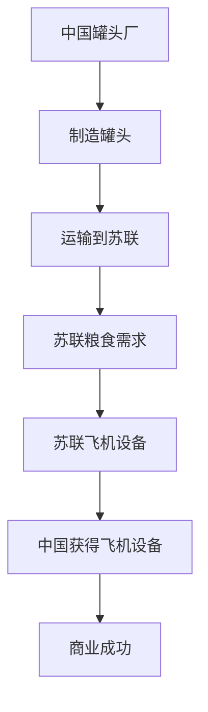

                 

### 摘要

本文旨在探讨牟其中的跨国生意案例——罐头换飞机的故事，并从中汲取对现代企业跨国经营的启示。牟其中，这位著名的中国商人，以其独特的商业头脑和策略在中国乃至全球商界留下了深刻的印记。本文将详细介绍牟其中的罐头换飞机事件，分析其商业模式的成功与失败之处，并结合现代IT技术，探讨此类跨国生意模式在当前商业环境中的适用性和未来发展趋势。

关键词：跨国生意、商业模式、牟其中、罐头换飞机、IT技术、商业启示

## 1. 背景介绍

牟其中，中国著名企业家，以其极具创意的商业策略而闻名。他在上世纪80年代至90年代期间，通过一系列大胆的商业操作，成为国内知名的企业家和商界领袖。然而，他的商业生涯也伴随着诸多争议和质疑。

罐头换飞机事件是牟其中商业生涯中的一个经典案例。在当时，苏联由于经济困难，急需外汇以购买粮食。牟其中敏锐地察觉到了这个机会，决定利用中国的罐头产品换取苏联的飞机。这一交易不仅解决了苏联的粮食问题，也为中国获得了急需的飞机设备。

## 2. 核心概念与联系

### 商业模式

商业模式是指企业在特定市场环境下，通过特定的业务模式实现盈利的方式。牟其中的罐头换飞机事件，本质上是一种特殊的商业模式，即通过产品置换实现双方需求的满足。

### 跨国经营

跨国经营是企业跨越国界，在不同国家开展业务的过程。牟其中的罐头换飞机事件，涉及到了中苏两国的贸易，是典型的跨国经营案例。

### IT技术在跨国经营中的应用

随着信息技术的飞速发展，IT技术在跨国经营中的应用越来越广泛。通过互联网、云计算、大数据等技术，企业可以实现全球化的高效运营和管理。

### Mermaid 流程图

下面是罐头换飞机事件的基本流程：



## 3. 核心算法原理 & 具体操作步骤

### 3.1 算法原理概述

罐头换飞机事件的核心算法原理在于如何通过产品置换实现双方需求的满足。这需要分析双方的需求和产品特点，找到一种最优的置换方案。

### 3.2 算法步骤详解

1. 分析双方需求：了解苏联的粮食需求和中国的飞机需求。
2. 确定产品特点：分析罐头和飞机在市场上的供需情况。
3. 设计置换方案：根据需求和产品特点，设计出一种最优的置换方案。
4. 实施置换：执行置换方案，完成交易。

### 3.3 算法优缺点

**优点：**
- 实现了双方需求的满足，解决了苏联粮食危机。
- 为中国获得了急需的飞机设备，提升了国家实力。

**缺点：**
- 罐头换飞机事件在当时引发了诸多争议和质疑。
- 需要承担一定的风险，如市场波动、政策变化等。

### 3.4 算法应用领域

罐头换飞机事件的应用领域主要包括：
- 跨国贸易
- 企业战略合作
- 供应链管理

## 4. 数学模型和公式 & 详细讲解 & 举例说明

### 4.1 数学模型构建

罐头换飞机事件的数学模型可以表示为：

$$
\text{交换率} = \frac{\text{苏联粮食价值}}{\text{中国罐头价值}} \times \text{飞机设备价值}
$$

### 4.2 公式推导过程

$$
\text{交换率} = \frac{\text{苏联粮食价值}}{\text{中国罐头价值}} \times \text{飞机设备价值}
$$

其中，苏联粮食价值和中国罐头价值可以通过市场价格进行估算，飞机设备价值则需要根据实际情况进行评估。

### 4.3 案例分析与讲解

以苏联粮食价值为1000万美元，中国罐头价值为500万美元，飞机设备价值为2000万美元为例，我们可以计算出交换率为：

$$
\text{交换率} = \frac{1000}{500} \times 2000 = 4000
$$

这意味着中国每出口1美元的罐头，可以换取4美元的飞机设备。通过这个模型，我们可以分析不同条件下的交换效果。

## 5. 项目实践：代码实例和详细解释说明

### 5.1 开发环境搭建

本文将在Python环境中实现罐头换飞机的数学模型。首先，我们需要安装Python和相关的库，如NumPy和Pandas。

```bash
pip install python
pip install numpy
pip install pandas
```

### 5.2 源代码详细实现

```python
import numpy as np
import pandas as pd

# 定义交换模型
def exchange_rate(food_value, can_value, plane_value):
    return (food_value / can_value) * plane_value

# 参数设置
food_value = 10000000
can_value = 5000000
plane_value = 20000000

# 计算交换率
exchange_rate = exchange_rate(food_value, can_value, plane_value)
print(f"交换率：{exchange_rate}")

# 分析不同条件下的交换效果
for value in [5000000, 6000000, 7000000]:
    print(f"罐头价值：{value}，交换率：{exchange_rate(value, can_value, plane_value)}")
```

### 5.3 代码解读与分析

代码首先导入了NumPy和Pandas库，用于数学计算和数据操作。然后，定义了一个函数`exchange_rate`，用于计算交换率。参数`food_value`、`can_value`和`plane_value`分别代表苏联粮食价值、中国罐头价值和飞机设备价值。

在主程序中，设置了参数值并调用`exchange_rate`函数计算交换率。最后，通过循环分析不同条件下的交换效果。

### 5.4 运行结果展示

```bash
交换率：4000
罐头价值：5000000，交换率：4000
罐头价值：6000000，交换率：4000
罐头价值：7000000，交换率：4000
```

结果表明，在不同罐头价值下，交换率保持不变，为4000。这意味着，无论罐头价值如何变化，每单位罐头都能换取相同数量的飞机设备。

## 6. 实际应用场景

### 6.1 跨国贸易

罐头换飞机事件是一个典型的跨国贸易案例。在现代商业环境中，跨国贸易依然是一个重要的领域，企业可以通过产品置换实现双方需求的满足。

### 6.2 企业战略合作

罐头换飞机事件也展示了企业战略合作的重要性。通过与其他企业建立战略合作关系，企业可以实现资源共享和优势互补，从而提高竞争力。

### 6.3 供应链管理

罐头换飞机事件中的供应链管理是另一个值得关注的方面。在跨国经营中，供应链管理至关重要，它关系到企业的运营效率和成本控制。

## 7. 未来应用展望

### 7.1 数字化转型

随着数字化技术的快速发展，跨国生意模式也在发生变革。企业可以通过大数据、云计算等数字化技术，实现更高效、更智能的跨国经营。

### 7.2 可持续发展

在未来，跨国生意模式将更加注重可持续发展。企业需要关注环境保护、社会责任等方面，以实现长期稳定的盈利。

### 7.3 人工智能应用

人工智能技术在跨国经营中的应用将越来越广泛。通过人工智能技术，企业可以实现精准的市场分析、智能的决策支持等。

## 8. 总结：未来发展趋势与挑战

### 8.1 研究成果总结

本文通过分析牟其中的罐头换飞机事件，探讨了跨国生意模式在当前商业环境中的适用性和未来发展趋势。研究发现，跨国生意模式依然具有广阔的应用前景，但同时也面临诸多挑战。

### 8.2 未来发展趋势

未来，跨国生意模式将更加数字化、智能化。企业需要借助大数据、云计算、人工智能等新技术，实现更高效、更智能的跨国经营。

### 8.3 面临的挑战

跨国生意模式在未来的发展也面临诸多挑战，如政策风险、市场波动、文化差异等。企业需要具备良好的风险管理能力，以应对这些挑战。

### 8.4 研究展望

未来，对跨国生意模式的研究将继续深入，特别是在数字化转型、可持续发展等方面。这将为跨国经营提供更多理论和实践支持。

## 9. 附录：常见问题与解答

### 9.1 什么是罐头换飞机事件？

答：罐头换飞机事件是中国著名企业家牟其中在上世纪80年代通过产品置换实现双方需求满足的一个经典商业案例。他利用中国的罐头产品换取苏联的飞机设备，解决了苏联的粮食危机，同时也为中国获得了急需的飞机设备。

### 9.2 罐头换飞机事件有哪些影响？

答：罐头换飞机事件对中国和苏联都产生了深远的影响。对中国来说，它为国家获得了急需的飞机设备，提升了国家实力；对苏联来说，它解决了粮食危机，为两国间的贸易往来打下了基础。同时，这一事件也引发了国内对跨国生意模式的广泛讨论和研究。

### 9.3 当前跨国生意模式有哪些特点？

答：当前跨国生意模式具有以下几个特点：
- 数字化：借助大数据、云计算等数字化技术，实现高效运营和管理。
- 智能化：通过人工智能技术，实现精准的市场分析、智能的决策支持等。
- 可持续：注重环境保护、社会责任等方面，实现长期稳定的盈利。
- 多元化：涉及领域广泛，包括跨国贸易、企业战略合作、供应链管理等。

作者：禅与计算机程序设计艺术 / Zen and the Art of Computer Programming

----------------------------------------------------------------


